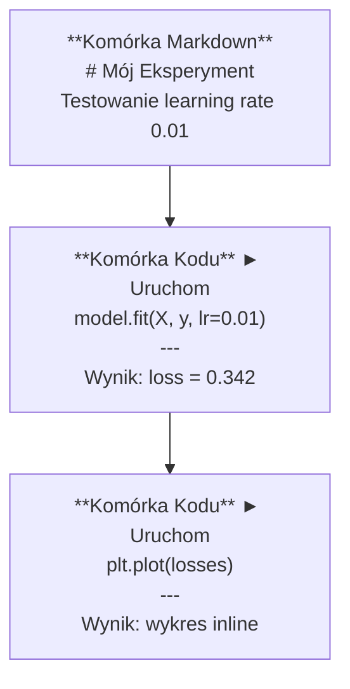
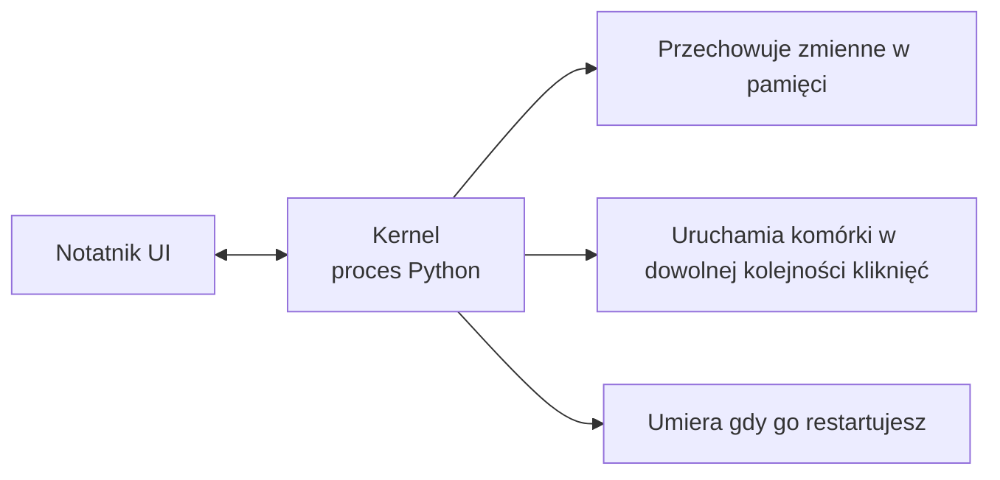

# Jupyter Notebooks

> Notatniki to warsztat pracy inżyniera AI. Tutaj tworzysz prototypy, a potem przenosisz to, co działa, do produkcji.

**Typ:** Zbuduj to
**Języki:** Python
**Wymagania wstępne:** Phase 0, Lesson 01
**Czas:** ~30 minut

## Cele uczenia się

- Zainstaluj i uruchom JupyterLab, Jupyter Notebook lub VS Code z rozszerzeniem Jupyter
- Używaj magicznych poleceń (`%timeit`, `%%time`, `%matplotlib inline`) do benchmarkowania i wizualizacji inline
- Rozróżniaj, kiedy używać notatników, a kiedy skryptów i stosuj workflow "eksploruj w notatnikach, wdrążaj w skryptach"
- Identyfikuj i unikaj typowych pułapek notatników: wykonywanie poza kolejnością, ukryty stan i wycieki pamięci

## Problem

Każdy artykuł o AI, tutorial i konkurs na Kaggle używa Jupyter notebooks. Pozwalają uruchamiać kod partiami, widzieć wyniki inline, mieszać kod z wyjaśnieniami i szybko iterować. Jeśli próbujesz uczyć się AI bez notatników, to jakbyś robił zadania z matematyki bez brudnopisu.

Ale notatniki mają prawdziwe pułapki. Ludzie używają ich do wszystkiego, włącznie z rzeczami, w których są fatalni. Wiedza o tym, kiedy używać notatnika, a kiedy skryptu, uchroni cię przed koszmarami debugowania później.

## Koncepcja

Notatnik to lista komórek. Każda komórka jest albo kodem, albo tekstem.



Kernel to proces Pythona działający w tle. Gdy uruchamiasz komórkę, wysyła kod do kernela, który go wykonuje i odsyła wynik. Wszystkie komórki współdzielą ten sam kernel, więc zmienne persistują między komórkami.



Ta część "w dowolnej kolejności kliknięć" to jednocześnie supermoc i pułapka.

## Zbuduj to

### Krok 1: Wybierz swoje środowisko

Trzy opcje, jeden format:

| Środowisko | Instalacja | Najlepsze dla |
|-----------|---------|----------|
| JupyterLab | `pip install jupyterlab` potem `jupyter lab` | Pełne IDE, wiele zakładek, przeglądarka plików, terminal |
| Jupyter Notebook | `pip install notebook` potem `jupyter notebook` | Proste, lekkie, jeden notatnik na raz |
| VS Code | Zainstaluj rozszerzenie "Jupyter" | Już w twoim edytorze, integracja z git, debugowanie |

Wszystkie trzy czytają i zapisują ten sam plik `.ipynb`. Wybierz co lubisz. JupyterLab jest najczęstszy w pracy z AI.

```bash
pip install jupyterlab
jupyter lab
```

### Krok 2: Skróty klawiszowe, które mają znaczenie

Operujesz w dwóch trybach. Naciśnij `Escape` dla trybu poleceń (niebieski pasek po lewej), `Enter` dla trybu edycji (zielony pasek).

**Tryb poleceń (najczęściej używane):**

| Klawisz | Akcja |
|-----|--------|
| `Shift+Enter` | Uruchom komórkę, przejdź do następnej |
| `A` | Wstaw komórkę powyżej |
| `B` | Wstaw komórkę poniżej |
| `DD` | Usuń komórkę |
| `M` | Konwertuj na markdown |
| `Y` | Konwertuj na kod |
| `Z` | Cofnij operację na komórce |
| `Ctrl+Shift+H` | Pokaż wszystkie skróty |

**Tryb edycji:**

| Klawisz | Akcja |
|-----|--------|
| `Tab` | Autouzupełnianie |
| `Shift+Tab` | Pokaż sygnaturę funkcji |
| `Ctrl+/` | Przełącz komentarz |

`Shift+Enter` to ten skrót, którego będziesz używać tysiące razy dziennie. Naucz się go pierwszy.

### Krok 3: Typy komórek

**Komórki kodu** uruchamiają Python i pokazują wynik:

```python
import numpy as np
data = np.random.randn(1000)
data.mean(), data.std()
```

Wynik: `(0.0032, 0.9987)`

**Komórki markdown** renderują sformatowany tekst. Używaj ich do dokumentowania tego, co robisz i dlaczego. Obsługuje nagłówki, pogrubienie, kursywę, matematykę LaTeX (`$E = mc^2$), tabele i obrazy.

### Krok 4: Magiczne polecenia

To nie są polecenia Pythona. To polecenia specyficzne dla Jupyter, które zaczynają się od `%` (line magic) lub `%%` (cell magic).

**Mierz czas kodu:**

```python
%timeit np.random.randn(10000)
```

Wynik: `45.2 us +/- 1.3 us per loop`

```python
%%time
model.fit(X_train, y_train, epochs=10)
```

Wynik: `Wall time: 2.34 s`

`%timeit` uruchamia kod wiele razy i uśrednia. `%%time` uruchamia go raz. Używaj `%timeit` do mikrobenchmarków, `%%time` do uruchomień treningowych.

**Włącz wykresy inline:**

```python
%matplotlib inline
```

Każde `plt.plot()` lub `plt.show()` teraz renderuje bezpośrednio w notatniku.

**Instaluj pakiety bez wychodzenia z notatnika:**

```python
!pip install scikit-learn
```

Prefix `!` uruchamia dowolne polecenie powłoki.

**Sprawdź zmienne środowiskowe:**

```python
%env CUDA_VISIBLE_DEVICES
```

### Krok 5: Wyświetlaj bogate wyniki inline

Notatniki automatycznie wyświetlają ostatnie wyrażenie w komórce. Ale możesz tym sterować:

```python
import pandas as pd

df = pd.DataFrame({
    "model": ["Linear", "Random Forest", "Neural Net"],
    "accuracy": [0.72, 0.89, 0.94],
    "training_time": [0.1, 2.3, 45.6]
})
df
```

To renderuje sformatowaną tabelę HTML, nie zrzut tekstowy. To samo z wykresami:

```python
import matplotlib.pyplot as plt

plt.figure(figsize=(8, 4))
plt.plot([1, 2, 3, 4], [1, 4, 2, 3])
plt.title("Inline Plot")
plt.show()
```

Wykres pojawia się tuż pod komórką. Dlatego notatniki dominują w pracy z AI. Widzisz dane, wykres i kod razem.

Dla obrazów:

```python
from IPython.display import Image, display
display(Image(filename="architecture.png"))
```

### Krok 6: Google Colab

Colab to darmowy Jupyter notebook w chmurze. Daje ci GPU, preinstalowane biblioteki i integrację z Google Drive. Bez konieczności konfiguracji.

1. Idź na [colab.research.google.com](https://colab.research.google.com)
2. Wgraj dowolny plik `.ipynb` z tego kursu
3. Runtime > Change runtime type > T4 GPU (darmowe)

Różnice Colab od lokalnego Jupyter:

- Pliki nie persistują między sesjami (zapisuj na Drive lub pobierz)
- Preinstalowane: numpy, pandas, matplotlib, torch, tensorflow, sklearn
- `from google.colab import files` do wgrywania/pobierania plików
- `from google.colab import drive; drive.mount('/content/drive')` dla trwałego przechowywania
- Sesje wygasają po 90 minutach nieaktywności (darmowy tier)

## Użyj tego

### Notatniki vs Skrypty: Kiedy używać czego

| Używaj notatników do | Używaj skryptów do |
|-------------------|-----------------|
| Eksploracji zbioru danych | Potoków treningowych |
| Prototypowania modelu | Wielokrotnego użytku narzędzi |
| Wizualizacji wyników | Czegokolwiek z `if __name__` |
| Wyjaśniania swojej pracy | Kodu uruchamianego według harmonogramu |
| Szybkich eksperymentów | Kodu produkcyjnego |
| Ćwiczeń z kursu | Pakietów i bibliotek |

Zasada: **eksploruj w notatnikach, wdrążaj w skryptach**.

Typowy workflow w AI:

1. Eksploruj dane w notatniku
2. Prototypuj swój model w notatniku
3. Gdy działa, przenieś kod do plików `.py`
4. Importuj te pliki `.py` z powrotem do notatnika do dalszych eksperymentów

### Typowe pułapki

**Wykonanie poza kolejnością.** Uruchamiasz komórkę 5, potem komórkę 2, potem komórkę 7. Notatnik działa na twoim komputerze, ale psuje się, gdy ktoś uruchamia go od góry do dołu. Rozwiązanie: Kernel > Restart & Run All przed udostępnieniem.

**Ukryty stan.** Usuwasz komórkę, ale zmienna, którą utworzyła, nadal jest w pamięci. Notatnik wygląda czysto, ale zależy od ducha komórki. Rozwiązanie: Restartuj kernel regularnie.

**Wycieki pamięci.** Ładowanie zbioru danych 4GB, trening modelu, ładowanie kolejnego zbioru danych. Nic nie jest zwalniane. Rozwiązanie: `del nazwa_zmiennej` i `gc.collect()`, albo restartuj kernel.

## Wdróż to

Ta lekcja wytwarza:

- `outputs/prompt-notebook-helper.md` do debugowania problemów z notatnikami

## Ćwiczenia

1. Otwórz JupyterLab, stwórz notatnik i użyj `%timeit` do porównania list comprehension z numpy dla tworzenia tablicy 100 000 losowych liczb
2. Stwórz notatnik z komórkami markdown i kodu, który ładuje CSV, wyświetla dataframe i rysuje wykres. Potem uruchom Kernel > Restart & Run All, żeby zweryfikować, że działa od góry do dołu
3. Weź kod z `code/notebook_tips.py`, wklej go do notatnika Colab i uruchom z darmowym GPU

## Kluczowe pojęcia

| Pojęcie | Co ludzie mówią | Co to tak naprawdę oznacza |
|------|----------------|----------------------|
| Kernel | "Ta rzecz uruchamiająca mój kod" | Osobny proces Pythona, który wykonuje komórki i przechowuje zmienne w pamięci |
| Komórka | "Blok kodu" | Niezależnie uruchamialna jednostka w notatniku, albo kod albo markdown |
| Magiczne polecenie | "Sztuczki Jupyter" | Specjalne polecenia z prefixem `%` lub `%%`, które sterują środowiskiem notatnika |
| `.ipynb` | "Plik notatnika" | Plik JSON zawierający komórki, wyniki i metadane. Oznacza IPython Notebook |

## Dalsza lektura

- [Dokumentacja JupyterLab](https://jupyterlab.readthedocs.io/) dla pełnego zestawu funkcji
- [FAQ Google Colab](https://research.google.com/colaboratory/faq.html) dla limitów i funkcji specyficznych dla Colab
- [28 wskazówek Jupyter Notebook](https://www.dataquest.io/blog/jupyter-notebook-tips-tricks-shortcuts/) dla skrótów dla zaawansowanych użytkowników