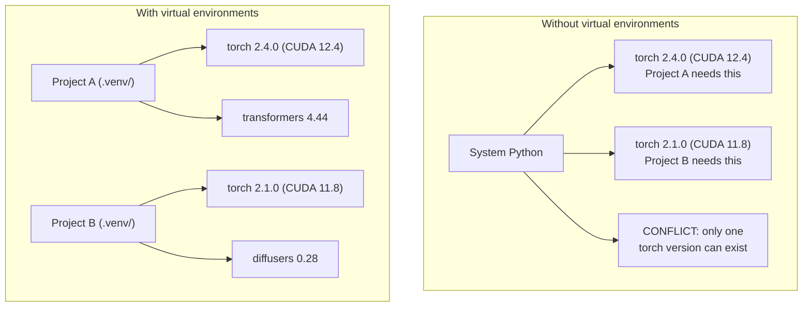

# Środowiska Python

> Piekło zależności jest prawdziwe. Środowiska wirtualne są lekiem.

**Typ:** Zbuduj
**Języki:** Python
**Wymagania wstępne:** Phase 0, Lesson 01
**Czas:** ~30 minut

## Cele uczenia się

- Twórz izolowane środowiska wirtualne używając `uv`, `venv` lub `conda`
- Pisz `pyproject.toml` z opcjonalnymi grupami zależności i generuj lockfile dla powtarzalności
- Diagnozuj i naprawiaj typowe problemy: globalne instalacje, mieszanie pip/conda, niezgodności wersji CUDA
- Implementuj strategię środowiskową dla każdej fazy w projektach z konfliktującymi zależnościami

## Problem

Instalujesz PyTorch 2.4 do projektu fine-tuning. W następnym tygodniu inny projekt potrzebuje PyTorch 2.1, bo jego build CUDA jest przypięty. Ulepszasz globalnie i pierwszy projekt się psuje. Ulepszasz i drugi projekt się psuje.

To jest piekło zależności. Zdarza się ciągle w pracy AI/ML, bo:

- PyTorch, JAX i TensorFlow każdy dostarcza swoje własne powiązania CUDA
- Biblioteki modeli przypinają konkretne wersje frameworków
- Globalny `pip install` nadpisuje to, co było wcześniej
- Buildy CUDA 11.8 nie działają ze sterownikami CUDA 12.x (i odwrotnie)

Rozwiązanie: każdy projekt dostaje swoje własne izolowane środowisko z własnymi pakietami.

## Koncepcja



## Zbuduj to

### Opcja 1: uv venv (Zalecane)

`uv` to najszybszy menedżer pakietów Python (10-100x szybszy niż pip). Obsługuje środowiska wirtualne, wersje Pythona i rozwiązywanie zależności w jednym narzędziu.

```bash
curl -LsSf https://astral.sh/uv/install.sh | sh

uv python install 3.12

cd your-project
uv venv
source .venv/bin/activate
```

Instaluj pakiety:

```bash
uv pip install torch numpy
```

Utwórz projekt z `pyproject.toml` w jednym kroku:

```bash
uv init my-ai-project
cd my-ai-project
uv add torch numpy matplotlib
```

### Opcja 2: venv (Wbudowane)

Jeśli nie możesz zainstalować `uv`, Python dostarcza `venv`:

```bash
python3 -m venv .venv
source .venv/bin/activate  # Linux/macOS
.venv\Scripts\activate     # Windows

pip install torch numpy
```

Wolniejsze niż `uv`, ale działa wszędzie tam, gdzie jest zainstalowany Python.

### Opcja 3: conda (Gdy Potrzebujesz)

Conda zarządza zależnościami nie-Pythonowymi jak toolkity CUDA, cuDNN i biblioteki C. Używaj jej, gdy:

- Potrzebujesz konkretnej wersji toolkitu CUDA bez instalacji systemowej
- Jesteś na współdzielonym klastrze, gdzie nie możesz instalować pakietów systemowych
- Instrukcje instalacji biblioteki mówią "użyj conda"

```bash
# Install miniconda (not the full Anaconda)
curl -LsSf https://repo.anaconda.com/miniconda/Miniconda3-latest-Linux-x86_64.sh -o miniconda.sh
bash miniconda.sh -b

conda create -n myproject python=3.12
conda activate myproject

conda install pytorch torchvision torchaudio pytorch-cuda=12.4 -c pytorch -c nvidia
```

Jedna zasada: jeśli używasz conda dla środowiska, używaj conda dla wszystkich pakietów w tym środowisku. Mieszanie `pip install` w środowisku conda powoduje konflikty zależności, które są bolesne do debugowania.

### Dla Tego Kursu: Strategia Per-Faza

Możesz utworzyć jedno środowisko dla całego kursu. Nie rób tego. Różne fazy potrzebują różnych (czasem konfliktujących) zależności.

Strategia:

```
ai-engineering-from-scratch/
├── .venv/                    <-- shared lightweight env for phases 0-3
├── phases/
│   ├── 04-neural-networks/
│   │   └── .venv/            <-- PyTorch env
│   ├── 05-cnns/
│   │   └── .venv/            <-- same PyTorch env (symlink or shared)
│   ├── 08-transformers/
│   │   └── .venv/            <-- might need different transformer versions
│   └── 11-llm-apis/
│       └── .venv/            <-- API SDKs, no torch needed
```

Skrypt w `code/env_setup.sh` tworzy bazowe środowisko dla tego kursu.

## Podstawy pyproject.toml

Każdy projekt Python powinien mieć `pyproject.toml`. zastępuje `setup.py`, `setup.cfg` i `requirements.txt` w jednym pliku.

```toml
[project]
name = "ai-engineering-from-scratch"
version = "0.1.0"
requires-python = ">=3.11"
dependencies = [
    "numpy>=1.26",
    "matplotlib>=3.8",
    "jupyter>=1.0",
    "scikit-learn>=1.4",
]

[project.optional-dependencies]
torch = ["torch>=2.3", "torchvision>=0.18"]
llm = ["anthropic>=0.39", "openai>=1.50"]
```

Potem instaluj:

```bash
uv pip install -e ".[torch]"    # base + PyTorch
uv pip install -e ".[llm]"     # base + LLM SDKs
uv pip install -e ".[torch,llm]" # everything
```

## Lockfiles

Lockfile przypina każdą zależność (włącznie z przechodnimi) do dokładnych wersji. To gwarantuje powtarzalność: każdy, kto instaluje z lockfile, dostaje dokładnie te same pakiety.

```bash
# uv generates uv.lock automatically when using uv add
uv add numpy

# pip-tools approach
uv pip compile pyproject.toml -o requirements.lock
uv pip install -r requirements.lock
```

Commituj swój lockfile do git. Gdy ktoś klonuje repo, instaluje z lockfile i dostaje identyczne wersje.

## Typowe Błędy

### 1. Instalacja globalna

```bash
pip install torch  # BAD: installs to system Python

source .venv/bin/activate
pip install torch  # GOOD: installs to virtual environment
```

Sprawdź, gdzie trafiają Twoje pakiety:

```bash
which python       # should show .venv/bin/python, not /usr/bin/python
which pip           # should show .venv/bin/pip
```

### 2. Mieszanie pip i conda

```bash
conda create -n myenv python=3.12
conda activate myenv
conda install pytorch -c pytorch
pip install some-other-package   # BAD: can break conda's dependency tracking
conda install some-other-package # GOOD: let conda manage everything
```

Jeśli musisz użyć pip w conda (niektóre pakiety są tylko pip), instaluj najpierw wszystkie pakiety conda, potem pip na końcu.

### 3. Zapomnienie aktywacji

```bash
python train.py           # uses system Python, missing packages
source .venv/bin/activate
python train.py           # uses project Python, packages found
```

Twój prompt powłoki powinien pokazywać nazwę środowiska:

```
(.venv) $ python train.py
```

### 4. Commitowanie .venv do git

```bash
echo ".venv/" >> .gitignore
```

Środowiska wirtualne mają 200MB-2GB. Są lokalne, nie przenośne między maszynami. Commituj `pyproject.toml` i lockfile zamiast tego.

### 5. Niezgodność wersji CUDA

```bash
nvidia-smi                # shows driver CUDA version (e.g., 12.4)
python -c "import torch; print(torch.version.cuda)"  # shows PyTorch CUDA version

# These must be compatible.
# PyTorch CUDA version must be <= driver CUDA version.
```

## Użyj tego

Uruchom skrypt instalacyjny, aby utworzyć środowisko kursu:

```bash
bash phases/00-setup-and-tooling/06-python-environments/code/env_setup.sh
```

To tworzy `.venv` w korzeniu repo z zainstalowanymi i zweryfikowanymi podstawowymi zależnościami.

## Ćwiczenia

1. Uruchom `env_setup.sh` i zweryfikuj, że wszystkie sprawdzenia przechodzą
2. Utwórz drugie środowisko wirtualne, zainstaluj inną wersję numpy, i potwierdź, że dwa środowiska są izolowane
3. Napisz `pyproject.toml` dla projektu, który potrzebuje zarówno PyTorch, jak i Anthropic SDK
4. Celowo zainstaluj pakiet globalnie (bez aktywacji venv), zauważ gdzie trafia, potem go odinstaluj

## Kluczowe Pojęcia

| Pojęcie | Co ludzie mówią | Co to faktycznie oznacza |
|--------|----------------|----------------------|
| Środowisko wirtualne | "venv" | Izolowany katalog zawierający interpreter Python i pakiety, oddzielony od systemowego Pythona |
| Lockfile | "Przypięte zależności" | Plik listujący każdy pakiet i jego dokładną wersję, gwarantujący identyczne instalacje między maszynami |
| pyproject.toml | "Nowy setup.py" | Standardowy plik konfiguracyjny projektu Python, zastępujący setup.py/setup.cfg/requirements.txt |
| Zależność przechodnia | "Zależność zależności" | Pakiet B zależy od C; jeśli instalujesz A, które zależy od B, C jest zależnością przechodnią A |
| Niezgodność CUDA | "Mój GPU nie działa" | PyTorch został skompilowany dla innej wersji CUDA niż ta, którą wspiera Twój sterownik GPU |