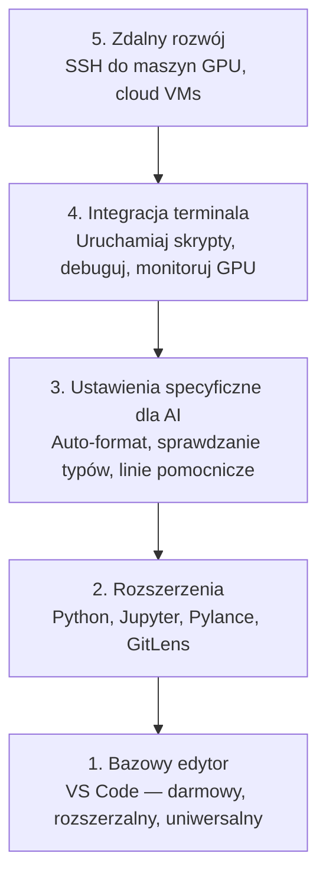

# Konfiguracja edytora

> Twój edytor to Twój drugi pilot. Skonfiguruj go raz, żeby nie przeszkadzał i zaczął pracować na Twoją korzyść.

**Typ:** Zbuduj to
**Języki:** --
**Wymagania wstępne:** Phase 0, Lesson 01
**Czas:** ~20 minut

## Cele uczenia się

- Zainstaluj VS Code z niezbędnymi rozszerzeniami dla Pythona, Jupyter, lintingu i zdalnego SSH
- Skonfiguruj formatowanie przy zapisie, sprawdzanie typów i przewijanie wyników w notebookach dla workflowów AI
- Skonfiguruj Remote SSH, żeby edytować i debugować kod na zdalnych maszynach GPU tak, jakby były lokalne
- Ocen alternatywy edytorów (Cursor, Windsurf, Neovim) i ich kompromisy dla pracy z AI

## Problem

Spędzisz tysiące godzin w edytorze, pisząc Pythona, uruchamiając notebooki, debugując pętle treningowe i łącząc się SSH z maszynami GPU. Źle skonfigurowany edytor zamienia każdą sesję w tarcie: brak autouzupełniania, brak podpowiedzi typów, brak inline'owych błędów, ręczne formatowanie i toporny workflow terminalowy.

Właściwa konfiguracja zajmuje 20 minut. Pominięcie jej kosztuje Cię 20 minut każdego dnia.

## Koncepcja

Konfiguracja edytora dla AI engineering wymaga pięciu rzeczy:



## Zbuduj to

### Krok 1: Zainstaluj VS Code

VS Code to polecany edytor. Jest darmowy, działa na każdym systemie operacyjnym, ma pierwszoklasową obsługę Jupyter notebooków, a ekosystem rozszerzeń obejmuje wszystko, co potrzebujesz do pracy z AI.

Pobierz go ze strony [code.visualstudio.com](https://code.visualstudio.com/).

Zweryfikuj z terminala:

```bash
code --version
```

Jeśli `code` nie jest znaleziony na macOS, otwórz VS Code, naciśnij `Cmd+Shift+P`, wpisz "Shell Command" i wybierz "Install 'code' command in PATH".

### Krok 2: Zainstaluj niezbędne rozszerzenia

Otwórz zintegrowany terminal w VS Code (`` Ctrl+` `` lub `` Cmd+` ``) i zainstaluj rozszerzenia, które mają znaczenie dla pracy z AI:

```bash
code --install-extension ms-python.python
code --install-extension ms-python.vscode-pylance
code --install-extension ms-toolsai.jupyter
code --install-extension eamodio.gitlens
code --install-extension ms-vscode-remote.remote-ssh
code --install-extension ms-python.debugpy
code --install-extension ms-python.black-formatter
code --install-extension charliermarsh.ruff
```

Co każde z nich robi:

| Rozszerzenie | Dlaczego |
|--------------|----------|
| Python | Obsługa języka, wykrywanie środowisk wirtualnych, uruchamianie/debugowanie |
| Pylance | Szybkie sprawdzanie typów, autouzupełnianie, rozpoznawanie importów |
| Jupyter | Uruchamiaj notebooki wewnątrz VS Code, eksplorator zmiennych |
| GitLens | Zobacz, kto co zmienił, inline'owy git blame |
| Remote SSH | Otwórz folder na zdalnej maszynie GPU tak, jakby był lokalny |
| Debugpy | Debugowanie krokowe dla Pythona |
| Black Formatter | Auto-format przy zapisie, spójny styl |
| Ruff | Szybki linting, wyłapuje częste błędy |

Plik `code/.vscode/extensions.json` w tej lekcji zawiera pełną listę rekomendacji. Gdy otworzysz folder projektu, VS Code wyświetli monit o ich instalację.

### Krok 3: Skonfiguruj ustawienia

Skopiuj ustawienia z `code/.vscode/settings.json` w tej lekcji, lub zastosuj je ręcznie przez `Settings > Open Settings (JSON)`.

Kluczowe ustawienia dla pracy z AI:

```jsonc
{
    "python.analysis.typeCheckingMode": "basic",
    "editor.formatOnSave": true,
    "editor.rulers": [88, 120],
    "notebook.output.scrolling": true,
    "files.autoSave": "afterDelay"
}
```

Dlaczego to ma znaczenie:

- **Sprawdzanie typów na basic**: Wyłapuje błędne typy argumentów przed uruchomieniem. Oszczędza czas debugowania przy niezgodności kształtów tensorów i błędnych parametrach API.
- **Formatowanie przy zapisie**: Nigdy więcej nie myśl o formatowaniu. Black się tym zajmie.
- **Linie pomocnicze na 88 i 120**: Black zawija na 88. Marker 120 pokazuje, gdy docstringi i komentarze stają się zbyt długie.
- **Przewijanie wyników w notebookach**: Pętle treningowe drukują tysiące linii. Bez przewijania panel wyników eksploduje.
- **Auto-zapis**: Zapomnisz zapisać. Twój skrypt treningowy uruchomi przestarzały kod. Auto-zapis temu zapobiega.

### Krok 4: Integracja terminala

Zintegrowany terminal VS Code to miejsce, gdzie uruchamiasz skrypty treningowe, monitorujesz GPU i zarządzasz środowiskami.

Skonfiguruj go poprawnie:

```jsonc
{
    "terminal.integrated.defaultProfile.osx": "zsh",
    "terminal.integrated.defaultProfile.linux": "bash",
    "terminal.integrated.fontSize": 13,
    "terminal.integrated.scrollback": 10000
}
```

Przydatne skróty:

| Akcja | macOS | Linux/Windows |
|-------|-------|---------------|
| Przełącz terminal | `` Ctrl+` `` | `` Ctrl+` `` |
| Nowy terminal | `Ctrl+Shift+`` ` | `Ctrl+Shift+`` ` |
| Podziel terminal | `Cmd+\` | `Ctrl+\` |

Podzielone terminale są przydatne: jeden do uruchamiania skryptu, jeden do monitorowania GPU z `nvidia-smi -l 1` lub `watch -n 1 nvidia-smi`.

### Krok 5: Zdalny rozwój (SSH do maszyn GPU)

To najważniejsze rozszerzenie do pracy z AI. Będziesz uruchamiać trening na zdalnych maszynach (cloud VMs, serwery labowe, Lambda, Vast.ai). Remote SSH pozwala otworzyć zdalny system plików, edytować pliki, uruchamiać terminale i debugować tak, jakby wszystko było lokalne.

Konfiguracja:

1. Zainstaluj rozszerzenie Remote SSH (zrobione w Kroku 2).
2. Naciśnij `Ctrl+Shift+P` (lub `Cmd+Shift+P`), wpisz "Remote-SSH: Connect to Host".
3. Wpisz `user@twoj-adres-ip-gpu`.
4. VS Code automatycznie instaluje swój komponent serwerowy na zdalnej maszynie.

Żeby uzyskać dostęp bez hasła, skonfiguruj klucze SSH:

```bash
ssh-keygen -t ed25519 -C "twoj-email@example.com"
ssh-copy-id user@twoj-adres-ip-gpu
```

Dodaj host do `~/.ssh/config` dla wygody:

```
Host gpu-box
    HostName 203.0.113.50
    User ubuntu
    IdentityFile ~/.ssh/id_ed25519
    ForwardAgent yes
```

Teraz `Remote-SSH: Connect to Host > gpu-box` łączy natychmiast.

## Alternatywy

### Cursor

[cursor.com](https://cursor.com) to fork VS Code z wbudowaną generacją kodu AI. Używa tego samego ekosystemu rozszerzeń i formatu ustawień. Jeśli używasz Cursor, wszystko w tej lekcji nadal obowiązuje. Zaimportuj te same `settings.json` i `extensions.json`.

### Windsurf

[windsurf.com](https://windsurf.com) to kolejny fork VS Code zorientowany na AI. Ta sama historia: te same rozszerzenia, ten sam format ustawień, ta sama obsługa Remote SSH.

### Vim/Neovim

Jeśli już używasz Vima lub Neovim i jesteś w nim produktywny, zostań tam. Minimalna konfiguracja do pracy z Python i AI:

- **pyright** lub **pylsp** do sprawdzania typów (przez Mason lub ręczną instalację)
- **nvim-lspconfig** do integracji language server
- **jupyter-vim** lub **molten-nvim** do wykonywania jak w notebookach
- **telescope.nvim** do wyszukiwania plików/symboli
- **none-ls.nvim** z black i ruff do formatowania/lintingu

Jeśli nie używasz już Vima, nie zaczynaj teraz. Krzywa uczenia się będzie konkurować z nauką AI engineering. Użyj VS Code.

## Użyj tego

Z tą konfiguracją Twój codzienny workflow wygląda tak:

1. Otwórz folder projektu w VS Code (lub połącz się przez Remote SSH do maszyny GPU).
2. Pisz Pythona w edytorze z autouzupełnianiem, podpowiedziami typów i inline'owymi błędami.
3. Uruchamiaj Jupyter notebooki inline z rozszerzeniem Jupyter.
4. Używaj zintegrowanego terminala do skryptów treningowych, `uv pip install` i monitorowania GPU.
5. Przeglądaj zmiany z GitLens przed commitowaniem.

## Ćwiczenia

1. Zainstaluj VS Code i wszystkie rozszerzenia wymienione w Kroku 2
2. Skopiuj `settings.json` z tej lekcji do swojej konfiguracji VS Code
3. Otwórz plik Python i zweryfikuj, że Pylance pokazuje podpowiedzi typów, a Black formatuje przy zapisie
4. Jeśli masz dostęp do zdalnej maszyny, skonfiguruj Remote SSH i otwórz folder na niej

## Kluczowe pojęcia

| Pojęcie | Co ludzie mówią | Co to faktycznie oznacza |
|---------|----------------|-------------------------|
| LSP | "Silnik autouzupełniania" | Language Server Protocol: standard dla edytorów, żeby uzyskać informacje o typach, uzupełnienia i diagnostykę z serwera specyficznego dla danego języka |
| Pylance | "Wtyczka Python" | Microsoftowy language server Pythona używający Pyright do sprawdzania typów i IntelliSense |
| Remote SSH | "Praca na serwerze" | Rozszerzenie VS Code, które uruchamia lekki serwer na zdalnej maszynie i streamuje UI do lokalnego edytora |
| Format on save | "Auto-prettier" | Edytor uruchamia formatter (Black, Ruff) za każdym razem, gdy zapisujesz, więc styl kodu jest zawsze spójny |