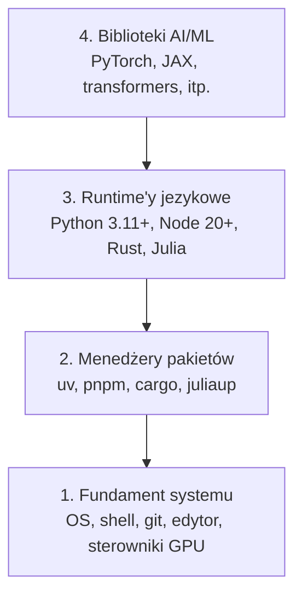

# Srodowisko programistyczne

> Twoje narzędzia kształtują sposób myślenia. Skonfiguruj je raz, skonfiguruj je porządnie.

**Typ:** Budowa
**Języki:** Python, Node.js, Rust
**Wymagania wstępne:** Brak
**Czas:** ~45 minut

## Cele uczenia się

- Skonfiguruj Python 3.11+, Node.js 20+ i Rust od zera
- Skonfiguruj środowiska wirtualne i menedżery pakietów dla powtarzalnych buildów
- Zweryfikuj dostęp do GPU z CUDA/MPS i uruchom testową operację tensorową
- Zrozum czterowarstwową architekturę: system, pakiety, runtime'y, biblioteki AI

## Problem

Zamierzasz uczyć się inżynierii AI przez ponad 200 lekcji używając Pythona, TypeScript, Rust i Julia. Jeśli środowisko jest zepsute, każda lekcja staje się walką z narzędziami zamiast nauką.

Większość ludzi pomija konfigurację środowiska. Potem spędzają godziny na debugowaniu błędów importu, konfliktów wersji i brakujących sterowników CUDA. Zrobimy to raz, porządnie.

## Koncepcja

Środowisko inżynierii AI ma cztery warstwy:



Instalujemy od dołu. Każda warstwa zależy od tej poniżej.

## Zbuduj to

### Krok 1: Fundament systemu

Sprawdź system i zainstaluj podstawy.

```bash
# macOS
xcode-select --install
brew install git curl wget

# Ubuntu/Debian
sudo apt update && sudo apt install -y build-essential git curl wget

# Windows (use WSL2)
wsl --install -d Ubuntu-24.04
```

### Krok 2: Python z uv

Używamy `uv` - jest 10-100x szybszy niż pip i automatycznie obsługuje środowiska wirtualne.

```bash
curl -LsSf https://astral.sh/uv/install.sh | sh

uv python install 3.12

uv venv
source .venv/bin/activate  # or .venv\Scripts\activate on Windows

uv pip install numpy matplotlib jupyter
```

Zweryfikuj:

```python
import sys
print(f"Python {sys.version}")

import numpy as np
print(f"NumPy {np.__version__}")
a = np.array([1, 2, 3])
print(f"Vector: {a}, dot product with itself: {np.dot(a, a)}")
```

### Krok 3: Node.js z pnpm

Dla lekcji TypeScript (agenci, serwery MCP, aplikacje webowe).

```bash
curl -fsSL https://fnm.vercel.app/install | bash
fnm install 22
fnm use 22

npm install -g pnpm

node -e "console.log('Node', process.version)"
```

### Krok 4: Rust

Dla lekcji wymagających wydajności (inferencja, systemy).

```bash
curl --proto '=https' --tlsv1.2 -sSf https://sh.rustup.rs | sh

rustc --version
cargo --version
```

### Krok 5: Julia (opcjonalnie)

Dla lekcji matematycznych gdzie Julia się wyróżnia.

```bash
curl -fsSL https://install.julialang.org | sh

julia -e 'println("Julia ", VERSION)'
```

### Krok 6: Konfiguracja GPU (jesli masz)

```bash
# NVIDIA
nvidia-smi

# Zainstaluj PyTorch z CUDA
uv pip install torch torchvision torchaudio --index-url https://download.pytorch.org/whl/cu124
```

```python
import torch
print(f"CUDA available: {torch.cuda.is_available()}")
if torch.cuda.is_available():
    print(f"GPU: {torch.cuda.get_device_name(0)}")
```

Nie masz GPU? Nie problem. Większość lekcji działa na CPU. Dla intensywnych treningów używaj Google Colab lub chmurowych GPU.

### Krok 7: Zweryfikuj wszystko

Uruchom skrypt weryfikacyjny:

```bash
python phases/00-setup-and-tooling/01-dev-environment/code/verify.py
```

## Użyj tego

Środowisko jest gotowe na każdą lekcję tego kursu. Oto gdzie co użyjesz:

| Język | Używane w | Menedżer pakietów |
|----------|---------|-----------------|
| Python | Fazy 1-12 (ML, DL, NLP, Vision, Audio, LLM) | uv |
| TypeScript | Fazy 13-17 (Tools, Agents, Swarms, Infra) | pnpm |
| Rust | Fazy 12, 15-17 (systemy krytyczne dla wydajności) | cargo |
| Julia | Faza 1 (podstawy matematyki) | Pkg |

## Dystrybuuj to

Ta lekcja wytwarza skrypt weryfikacyjny który każdy może uruchomić żeby sprawdzić swoje środowisko.

Zobacz `outputs/prompt-env-check.md` - prompt który pomaga AI asystentom diagnozować problemy ze środowiskiem.

## Ćwiczenia

1. Uruchom skrypt weryfikacyjny i napraw wszystkie błędy
2. Stwórz środowisko wirtualne Python dla tego kursu i zainstaluj PyTorch
3. Napisz "hello world" w czterech językach i uruchom każdy
