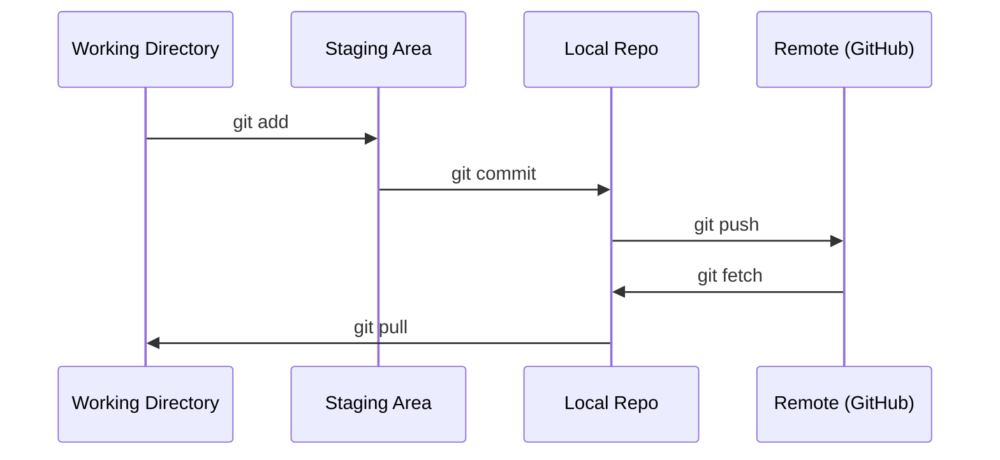

# Git i współpraca

> Kontrola wersji nie jest opcjonalna. Każdy eksperyment, każdy model, każda lekcja którą zbudujesz tutaj jest śledzona.

**Typ:** Nauka
**Języki:** --
**Wymagania wstępne:** Phase 0, Lesson 01
**Czas:** ~30 minut

## Cele uczenia się

- Skonfiguruj tożsamość git i używaj codziennego workflow: add, commit, push
- Twórz i łącz gałęzie dla izolowanych eksperymentów bez psucia maina
- Napisz `.gitignore` który wyklucza checkpointy modeli i duże pliki binarne
- Nawiguj po historii commitów z `git log` żeby zrozumieć ewolucję projektu

## Problem

Zamierzasz pisać setki plików kodowych przez 20 faz. Bez kontroli wersji stracisz pracę, zepsujesz rzeczy których nie możesz cofnąć i nie będziesz miał sposobu na współpracę z innymi.

Git jest narzędziem. GitHub to miejsce gdzie żyje kod. Ta lekcja pokrywa to co potrzebujesz dla tego kursu i nic więcej.

## Koncepcja



Trzy rzeczy do zapamiętania:
1. Commituj często (`git commit`)
2. Wypychaj do remote (`git push`)
3. Twórz gałęzie dla eksperymentów (`git checkout -b experiment`)

## Zbuduj to

### Krok 1: Skonfiguruj git

```bash
git config --global user.name "Twoje Imię"
git config --global user.email "ty@example.com"
```

### Krok 2: Codzienny workflow

```bash
git status
git add plik.py
git commit -m "Dodaj implementację perceptronu"
git push origin main
```

### Krok 3: Gałęzie dla eksperymentów

```bash
git checkout -b eksperyment/nowy-opt

# ... wprowadź zmiany, commituj ...

git checkout main
git merge eksperyment/nowy-opt
```

### Krok 4: Praca z repozytorium kursu

```bash
git clone https://github.com/rohitg00/ai-engineering-from-scratch.git
cd ai-engineering-from-scratch

git checkout -b moj-postep
# przepracuj lekcje, commituj kod
git push origin moj-postep
```

## Użyj tego

Dla tego kursu potrzebujesz dokładnie tych poleceń:

| Polecenie | Kiedy |
|---------|-------|
| `git clone` | Pobierz repozytorium kursu |
| `git add` + `git commit` | Zapisz swoją pracę |
| `git push` | Wyślij do GitHub |
| `git checkout -b` | Wypróbuj coś bez psucia maina |
| `git log --oneline` | Zobacz co zrobiłeś |

To wszystko. Nie potrzebujesz rebase, cherry-pick ani submodules w tym kursie.

## Ćwiczenia

1. Sklonuj repo, utwórz gałąź `moj-postep`, stwórz plik, commituj i wypchnij
2. Stwórz `.gitignore` który wyklucza checkpointy modeli (`.pt`, `.pth`, `.safetensors`)
3. Przejrzyj historię commitów tego repo z `git log --oneline` i przeczytaj jak dodawano lekcje

## Kluczowe pojęcia

| Termin | Co ludzie mówią | Co to naprawdę oznacza |
|--------|-----------------|----------------------|
| Commit | "Zapisywanie" | Migawka całego projektu w danym momencie |
| Branch | "Kopia" | Wskaźnik do commita który przesuwa się wraz z pracą |
| Merge | "Łączenie kodu" | Przeniesienie zmian z jednej gałęzi na drugą |
| Remote | "Chmura" | Kopia repo hostowana gdzieś indziej (GitHub, GitLab) |
