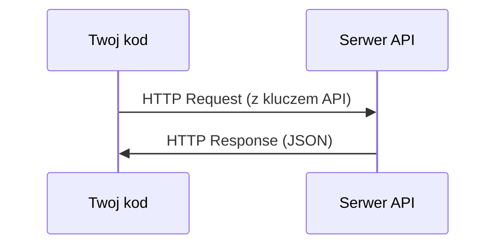

# API i klucze

> Każde AI API działa tak samo: wyślij request, dostajesz response. Szczegóły się zmieniają, wzorzec nie.

**Typ:** Budowa
**Języki:** Python, TypeScript
**Wymagania wstępne:** Phase 0, Lesson 01
**Czas:** ~30 minut

## Cele uczenia się

- Przechowuj klucze API bezpiecznie używając zmiennych środowiskowych i plików `.env`
- Wykonaj wywołanie LLM API używając zarówno Anthropic Python SDK jak i raw HTTP
- Porównaj formaty request/response SDK i raw HTTP dla debugowania
- Identyfikuj i obsługuj typowe błędy API w tym autentykację i rate limity

## Problem

Od Fazy 11 będziesz wywoływać LLM API (Anthropic, OpenAI, Google). W Fazach 13-16 zbudujesz agentów którzy używają tych API w pętlach. Musisz wiedzieć jak działają klucze API, jak je bezpiecznie przechowywać i jak wykonać pierwsze wywołanie API.

## Koncepcja



Każde wywołanie API ma:
1. Endpoint (URL)
2. Klucz API (autentykacja)
3. Ciało requestu (czego chcesz)
4. Ciało response (co dostajesz)

## Zbuduj to

### Krok 1: Bezpiecznie przechowuj klucze API

Nigdy nie umieszczaj kluczy API w kodzie. Używaj zmiennych środowiskowych.

```bash
export ANTHROPIC_API_KEY="sk-ant-..."
export OPENAI_API_KEY="sk-..."
```

Lub użyj pliku `.env` (dodaj go do `.gitignore`):

```
ANTHROPIC_API_KEY=sk-ant-...
OPENAI_API_KEY=sk-...
```

### Krok 2: Pierwsze wywołanie API (Python)

```python
import anthropic

client = anthropic.Anthropic()

response = client.messages.create(
    model="claude-sonnet-4-20250514",
    max_tokens=256,
    messages=[{"role": "user", "content": "What is a neural network in one sentence?"}]
)

print(response.content[0].text)
```

### Krok 3: Pierwsze wywołanie API (TypeScript)

```typescript
import Anthropic from "@anthropic-ai/sdk";

const client = new Anthropic();

const response = await client.messages.create({
  model: "claude-sonnet-4-20250514",
  max_tokens: 256,
  messages: [{ role: "user", content: "What is a neural network in one sentence?" }],
});

console.log(response.content[0].text);
```

### Krok 4: Raw HTTP (bez SDK)

```python
import os
import urllib.request
import json

url = "https://api.anthropic.com/v1/messages"
headers = {
    "Content-Type": "application/json",
    "x-api-key": os.environ["ANTHROPIC_API_KEY"],
    "anthropic-version": "2023-06-01",
}
body = json.dumps({
    "model": "claude-sonnet-4-20250514",
    "max_tokens": 256,
    "messages": [{"role": "user", "content": "What is a neural network in one sentence?"}],
}).encode()

req = urllib.request.Request(url, data=body, headers=headers, method="POST")
with urllib.request.urlopen(req) as resp:
    result = json.loads(resp.read())
    print(result["content"][0]["text"])
```

To jest to co SDK robią "pod maską". Rozumienie raw HTTP pomaga przy debugowaniu.

## Użyj tego

Dla tego kursu:

| API | Kiedy potrzebujesz | Darmowy tier |
|-----|-----------------|-----------|
| Anthropic (Claude) | Fazy 11-16 (agenci, narzędzia) | $5 kredytu przy rejestracji |
| OpenAI | Faza 11 (porównanie) | $5 kredytu przy rejestracji |
| Hugging Face | Fazy 4-10 (modele, datasety) | Darmowe |

Nie potrzebujesz ich wszystkich teraz. Skonfiguruj je gdy lekcja tego wymaga.

## Dystrybuuj to

Ta lekcja wytwarza:
- `outputs/prompt-api-troubleshooter.md` - diagnozuj typowe błędy API

## Ćwiczenia

1. Weź klucz API Anthropic i wykonaj pierwsze wywołanie API
2. Wypróbuj raw HTTP i porównaj format response z wersją SDK
3. Celowo użyj złego klucza API i przeczytaj komunikat błędu

## Kluczowe pojęcia

| Termin | Co ludzie mówią | Co to naprawdę oznacza |
|--------|-----------------|----------------------|
| API key | "Hasło do API" | Unikalny ciąg znaków identyfikujący twoje konto i autoryzujący requesty |
| Rate limit | "Throttling" | Maksymalna liczba requestów na minutę/godzinę żeby zapobiec nadużyciom |
| Token | "Słowo" (w kontekście API) | Jednostka rozliczeniowa: tokeny wejściowe i wyjściowe liczone i rozliczane osobno |
| Streaming | "Odpowiedzi w czasie rzeczywistym" | Otrzymywanie odpowiedzi słowo po słowie zamiast czekać na całą |
