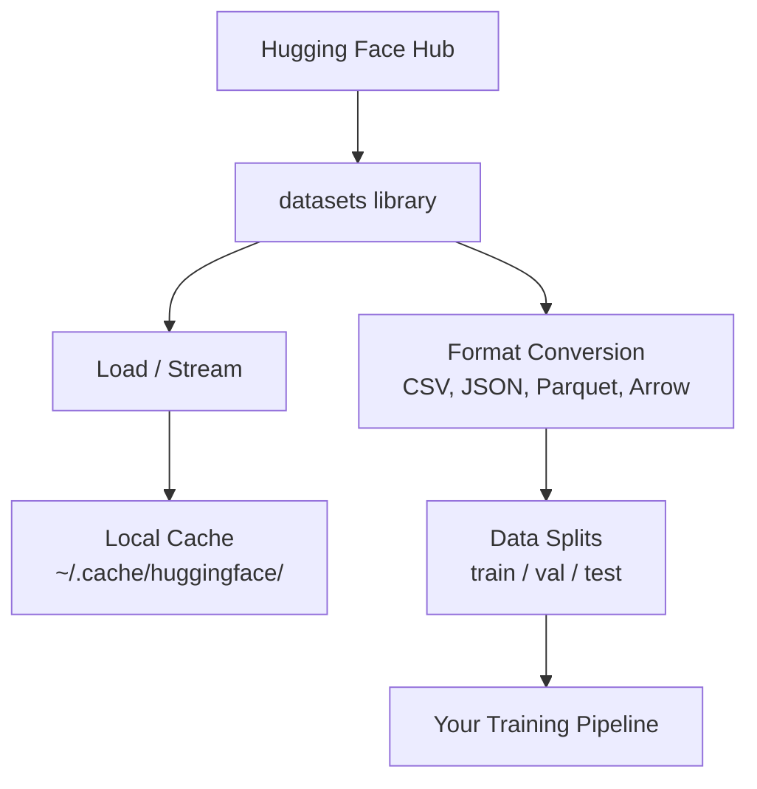

# Zarządzanie danymi

> Dane to paliwo. To, jak nimi zarządzasz, determinuje, jak szybko jedziesz.

**Typ:** Build
**Język:** Python
**Wymagania wstępne:** Phase 0, Lesson 01
**Czas:** ~45 minut

## Cele uczenia się

- Ładowanie, strumieniowanie i cache'owanie zbiorów danych przy użyciu biblioteki `datasets` od Hugging Face
- Konwersja między formatami CSV, JSON, Parquet i Arrow oraz wyjaśnienie ich kompromisów
- Tworzenie odtwarzalnych podziałów train/validation/test z ustalonymi ziarnami losowymi
- Zarządzanie dużymi plikami modeli i zbiorów danych przy użyciu `.gitignore`, Git LFS lub DVC

## Problem

Każdy projekt AI zaczyna się od danych. Musisz znaleźć zbiory danych, pobrać je, konwertować między formatami, dzielić je do treningu i ewaluacji oraz versionować, żeby eksperymenty były odtwarzalne. Robienie tego ręcznie za każdym razem jest wolne i podatne na błędy. Potrzebujesz powtarzalnego workflow.

## Koncepcja



Biblioteka `datasets` od Hugging Face to standardowy sposób na ładowanie danych do pracy z AI. Obsługuje pobieranie, cache'owanie, konwersję formatów i strumieniowanie out of the box.

## Zbuduj to

### Krok 1: Zainstaluj bibliotekę datasets

```bash
pip install datasets huggingface_hub
```

### Krok 2: Załaduj zbiór danych

```python
from datasets import load_dataset

dataset = load_dataset("imdb")
print(dataset)
print(dataset["train"][0])
```

To pobiera zbiór danych z recenzjami filmów IMDB. Po pierwszym pobraniu ładuje się z cache'a w `~/.cache/huggingface/datasets/`.

### Krok 3: Strumieniuj duże zbiory danych

Niektóre zbiory danych są zbyt duże, żeby zmieścić się na dysku. Strumieniowanie ładuje je wiersz po wierszu bez pobierania całości.

```python
dataset = load_dataset("wikipedia", "20220301.en", split="train", streaming=True)

for i, example in enumerate(dataset):
    print(example["title"])
    if i >= 4:
        break
```

Strumieniowanie daje ci `IterableDataset`. Przetwarzasz wiersze w miarę ich napływania. Zużycie pamięci pozostaje stałe niezależnie od rozmiaru zbioru danych.

### Krok 4: Formaty zbiorów danych

Biblioteka `datasets` używa Apache Arrow pod spodem. Możesz konwertować do innych formatów w zależności od potrzeb twojego pipeline'a.

```python
dataset = load_dataset("imdb", split="train")

dataset.to_csv("imdb_train.csv")
dataset.to_json("imdb_train.json")
dataset.to_parquet("imdb_train.parquet")
```

Porównanie formatów:

| Format | Rozmiar | Szybkość odczytu | Najlepszy dla |
|--------|---------|------------------|---------------|
| CSV | Duży | Wolny | Czytelność dla ludzi, arkusze kalkulacyjne |
| JSON | Duży | Wolny | API, dane zagnieżdżone |
| Parquet | Mały | Szybki | Analityka, zapytania kolumnowe |
| Arrow | Mały | Najszybszy | Przetwarzanie w pamięci (to, czego `datasets` używa wewnętrznie) |

Do pracy z AI, Parquet to najlepszy format przechowywania. Arrow to format, z którym pracujesz w pamięci. CSV i JSON są do wymiany.

### Krok 5: Podziały danych

Każdy projekt ML potrzebuje trzech podziałów:

- **Train**: Model uczy się z tych danych (zazwyczaj 80%)
- **Validation**: Sprawdzasz postępy podczas treningu (zazwyczaj 10%)
- **Test**: Końcowa ewaluacja po zakończeniu treningu (zazwyczaj 10%)

Niektóre zbiory danych są już podzielone. Gdy nie są, podziel je samodzielnie:

```python
dataset = load_dataset("imdb", split="train")

split = dataset.train_test_split(test_size=0.2, seed=42)
train_val = split["train"].train_test_split(test_size=0.125, seed=42)

train_ds = train_val["train"]
val_ds = train_val["test"]
test_ds = split["test"]

print(f"Train: {len(train_ds)}, Val: {len(val_ds)}, Test: {len(test_ds)}")
```

Zawsze ustawiaj seed dla odtwarzalności. Ten sam seed produkuje ten sam podział za każdym razem.

### Krok 6: Pobieranie i cache'owanie modeli

Modele to duże pliki. Biblioteka `huggingface_hub` obsługuje pobieranie i cache'owanie.

```python
from huggingface_hub import hf_hub_download, snapshot_download

model_path = hf_hub_download(
    repo_id="sentence-transformers/all-MiniLM-L6-v2",
    filename="config.json"
)
print(f"Cached at: {model_path}")

model_dir = snapshot_download("sentence-transformers/all-MiniLM-L6-v2")
print(f"Full model at: {model_dir}")
```

Modele cache'ują się do `~/.cache/huggingface/hub/`. Po pobraniu ładują się natychmiast przy kolejnych uruchomieniach.

### Krok 7: Obsługa dużych plików

Wagi modeli i duże zbiory danych nie powinny trafiać do git. Trzy opcje:

**Opcja A: .gitignore (najprostsza)**

```
*.bin
*.safetensors
*.pt
*.onnx
data/*.parquet
data/*.csv
models/
```

**Opcja B: Git LFS (śledź duże pliki w git)**

```bash
git lfs install
git lfs track "*.bin"
git lfs track "*.safetensors"
git add .gitattributes
```

Git LFS przechowuje wskaźniki w twoim repozytorium, a rzeczywiste pliki na osobnym serwerze. GitHub daje ci 1 GB za darmo.

**Opcja C: DVC (kontrola wersji danych)**

```bash
pip install dvc
dvc init
dvc add data/training_set.parquet
git add data/training_set.parquet.dvc data/.gitignore
git commit -m "Track training data with DVC"
```

DVC tworzy małe pliki `.dvc`, które wskazują na twoje dane. Dane same w sobie żyją w S3, GCS lub innym zdalnym backendzie storage.

| Podejście | Złożoność | Najlepsze dla |
|-----------|-----------|---------------|
| .gitignore | Niska | Projekty osobiste, pobrane dane, które możesz ponownie pobrać |
| Git LFS | Średnia | Zespoły dzielące wagi modeli przez git |
| DVC | Wysoka | Odtwarzalne eksperymenty, duże zbiory danych, zespoły |

Na potrzeby tego kursu, `.gitignore` wystarczy. Używaj DVC, gdy potrzebujesz odtwarzać dokładne eksperymenty na różnych maszynach.

### Krok 8: Wzorce przechowywania

**Local storage** działa dla zbiorów danych do ~10 GB. HF cache obsługuje to automatycznie.

**Cloud storage** jest dla czegokolwiek większego lub współdzielonego między maszynami:

```python
import os

local_path = os.path.expanduser("~/.cache/huggingface/datasets/")

# s3_path = "s3://my-bucket/datasets/"
# gcs_path = "gs://my-bucket/datasets/"
```

DVC integruje się z S3 i GCS bezpośrednio:

```bash
dvc remote add -d myremote s3://my-bucket/dvc-store
dvc push
```

Na potrzeby tego kursu, local storage wystarczy. Cloud storage staje się istotny, gdy fine-tunujesz na zdalnych instancjach GPU.

## Zbiory danych używane w tym kursie

| Zbiór danych | Lekcje | Rozmiar | Co uczy |
|---------|---------|------|----------------|
| IMDB | Tokenization, classification | 84 MB | Podstawy klasyfikacji tekstu |
| WikiText | Language modeling | 181 MB | Predykcja następnego tokena |
| SQuAD | QA systems | 35 MB | Odpowiadanie na pytania, zakresy |
| Common Crawl (podzbiór) | Embeddings | Różny | Przetwarzanie tekstu na dużą skalę |
| MNIST | Vision basics | 21 MB | Podstawy klasyfikacji obrazów |
| COCO (podzbiór) | Multimodal | Różny | Pary obraz-tekst |

Nie musisz pobierać ich wszystkich teraz. Każda lekcja określa, czego potrzebuje.

## Użyj tego

Uruchom skrypt utility, żeby zweryfikować, że wszystko działa:

```bash
python code/data_utils.py
```

To pobiera mały zbiór danych, konwertuje go, dzieli i drukuje podsumowanie.

## Wyślij to

Ta lekcja produkuje:
- `code/data_utils.py` - wielokrotnie użyteczny utility do ładowania i cache'owania danych
- `outputs/prompt-data-helper.md` - prompt do znajdowania odpowiedniego zbioru danych dla zadania

## Ćwiczenia

1. Załaduj zbiór danych `glue` z konfiguracją `mrpc` i sprawdź pierwsze 5 przykładów
2. Strumieniuj zbiór danych `c4` i policz, ile przykładów możesz przetworzyć w 10 sekund
3. Konwertuj zbiór danych do Parquet i porównaj rozmiar pliku z CSV
4. Stwórz podział 70/15/15 train/val/test z ustalonym seedem i zweryfikuj rozmiary

## Kluczowe terminy

| Termin | Co ludzie mówią | Co to faktycznie oznacza |
|------|----------------|----------------------|
| Dataset split | "Dane treningowe" | Nazwany podzbiór (train/val/test) używany na różnych etapach cyklu życia ML |
| Streaming | "Ładuj leniwie" | Przetwarzanie danych wiersz po wierszu ze źródła zdalnego bez pobierania całego zbioru |
| Parquet | "Skompresowany CSV" | Kolumnowy format plików zoptymalizowany pod kątem zapytań analitycznych i efektywności storage |
| Arrow | "Szybki dataframe" | Format kolumnowy w pamięci używany wewnętrznie przez bibliotekę datasets do odczytu bez kopiowania |
| Git LFS | "Git dla dużych plików" | Rozszerzenie, które przechowuje duże pliki poza repo git, zachowując wskaźniki w kontroli wersji |
| DVC | "Git dla danych" | System kontroli wersji dla zbiorów danych i modeli, który integruje się z cloud storage |
| Cache | "Już pobrane" | Lokalna kopia wcześniej pobranych danych, domyślnie przechowywana w ~/.cache/huggingface/ |