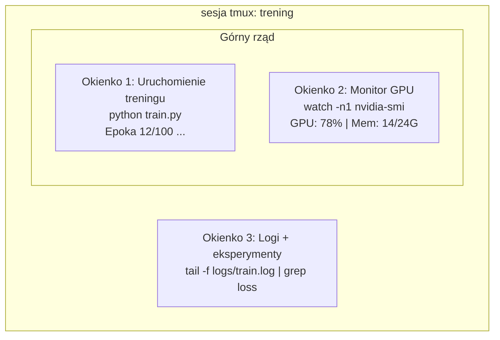

# Terminal i Shell

> Terminal to miejsce, gdzie żyją inżynierowie AI. Przyzwyczajaj się tutaj.

**Typ:** Nauka
**Języki:** --
**Wymagania wstępne:** Faza 0, Lekcja 01
**Czas:** ~35 minut

## Cele uczenia się

- Używaj potoków (piping), przekierowań i `grep` do filtrowania i przetwarzania logów treningowych z linii poleceń
- Twórz trwałe sesje tmux z wieloma okienkami dla równoczesnego treningu i monitorowania GPU
- Monitoruj zasoby systemowe i GPU za pomocą `htop`, `nvtop` i `nvidia-smi`
- Przesyłaj pliki między maszynami lokalnymi i zdalnymi za pomocą SSH, `scp` i `rsync`

## Problem

Będziesz spędzać więcej czasu w terminalu niż w jakimkolwiek edytorze. Uruchomienia treningów, monitorowanie GPU, śledzenie logów, zdalne sesje SSH, zarządzanie środowiskiem. Każdy workflow AI dotyka powłoki. Jeśli jesteś tu wolny, jesteś wolny wszędzie.

Ta lekcja obejmuje umiejętności terminalowe, które mają znaczenie dla pracy z AI. Bez historii Unix. Bez zagłębiania się w skrypty Bash. Tylko to, czego potrzebujesz.

## Koncepcja



Trzy rzeczy działające jednocześnie. Jeden terminal. Możesz się odłączyć, pójść do domu, połączyć się ponownie przez SSH i wrócić. Trening nadal działa.

## Zbuduj to

### Krok 1: Poznaj swoją powłokę

Sprawdź, którą powłokę używasz:

```bash
echo $SHELL
```

Większość systemów używa `bash` lub `zsh`. Obie działają dobrze. Polecenia w tym kursie działają w obu.

Kluczowe rzeczy do zapamiętania:

```bash
# Poruszanie się
cd ~/projects/ai-engineering-from-scratch
pwd
ls -la

# Wyszukiwanie w historii (najbardziej przydatny skrót, jaki się nauczysz)
# Ctrl+R następnie wpisz część poprzedniego polecenia
# Naciśnij Ctrl+R ponownie, aby przewijać dopasowania

# Wyczyść terminal
clear   # lub Ctrl+L

# Anuluj działające polecenie
# Ctrl+C

# Wstrzymaj działające polecenie (wznów z fg)
# Ctrl+Z
```

### Krok 2: Potoki i przekierowania

Potoki łączą polecenia ze sobą. W ten sposób przetwarzasz logi, filtrujesz wyniki i łączysz narzędzia. Będziesz tego używać stale.

```bash
# Policz, ile razy "loss" pojawia się w logu
cat train.log | grep "loss" | wc -l

# Wyciągnij tylko wartości loss z danych treningowych
grep "loss:" train.log | awk '{print $NF}' > losses.txt

# Obserwuj plik logu aktualizowany w czasie rzeczywistym, filtrując błędy
tail -f train.log | grep --line-buffered "ERROR"

# Sortuj eksperymenty według końcowej dokładności
grep "final_accuracy" results/*.log | sort -t= -k2 -n -r

# Przekieruj stdout i stderr do oddzielnych plików
python train.py > output.log 2> errors.log

# Przekieruj oba do tego samego pliku
python train.py > train_full.log 2>&1
```

Trzy przekierowania, które potrzebujesz:

| Symbol | Co robi |
|--------|---------|
| `>` | Zapisz stdout do pliku (nadpisz) |
| `>>` | Dopisz stdout do pliku |
| `2>` | Zapisz stderr do pliku |
| `2>&1` | Wyślij stderr w to samo miejsce co stdout |
| `\|` | Wyślij stdout jednego polecenia jako stdin do następnego |

### Krok 3: Procesy w tle

Uruchomienia treningów trwają godzinami. Nie chcesz trzymać terminala otwartego przez cały czas.

```bash
# Uruchom w tle (wyniki nadal idą do terminala)
python train.py &

# Uruchom w tle, odporne na rozłączenie (zamykanie terminala go nie zabije)
nohup python train.py > train.log 2>&1 &

# Sprawdź, co działa w tle
jobs
ps aux | grep train.py

# Przenieś zadanie z tła na pierwszy plan
fg %1

# Zabij proces w tle
kill %1
# lub znajdź jego PID i zabij to
kill $(pgrep -f "train.py")
```

Różnica między `&`, `nohup` i `screen`/`tmux`:

| Metoda | Przetrwa zamknięcie terminala? | Można się ponownie połączyć? |
|--------|-------------------------|--------------|
| `command &` | Nie | Nie |
| `nohup command &` | Tak | Nie (sprawdź plik logu) |
| `screen` / `tmux` | Tak | Tak |

Dla wszystkiego, co trwa dłużej niż kilka minut, używaj tmux.

### Krok 4: tmux

tmux pozwala tworzyć trwałe sesje terminalowe z wieloma okienkami. To najbardziej przydatne narzędzie do zarządzania uruchomieniami treningów.

```bash
# Instalacja
# macOS
brew install tmux
# Ubuntu
sudo apt install tmux

# Rozpocznij nazwaną sesję
tmux new -s training

# Podziel poziomo
# Ctrl+B następnie "

# Podziel pionowo
# Ctrl+B następnie %

# Nawigacja między okienkami
# Ctrl+B następnie klawisze strzałek

# Odłącz (sesja nadal działa)
# Ctrl+B następnie d

# Ponownie się połącz
tmux attach -t training

# Lista sesji
tmux ls

# Zabij sesję
tmux kill-session -t training
```

Typowy workflow sesji AI:

```bash
tmux new -s train

# Okienko 1: rozpocznij trening
python train.py --epochs 100 --lr 1e-4

# Ctrl+B, " aby podzielić, następnie uruchom monitor GPU
watch -n1 nvidia-smi

# Ctrl+B, % aby podzielić pionowo, sledź logi
tail -f logs/experiment.log

# Teraz odłącz z Ctrl+B, d
# SSH out, idź po kawę, wróć
# tmux attach -t train
```

### Krok 5: Monitorowanie za pomocą htop i nvtop

```bash
# Procesy systemowe (lepsze niż top)
htop

# Procesy GPU (jeśli masz GPU NVIDIA)
# Instalacja: sudo apt install nvtop (Ubuntu) lub brew install nvtop (macOS)
nvtop

# Szybki podgląd GPU bez nvtop
nvidia-smi

# Obserwuj użycie GPU aktualizowane co sekundę
watch -n1 nvidia-smi

# Zobacz, które procesy używają GPU
nvidia-smi --query-compute-apps=pid,name,used_memory --format=csv
```

Klawisze w `htop`, których będziesz używać:
- `F6` lub `>` aby sortować według kolumny (sortuj według pamięci, żeby znaleźć wycieki pamięci)
- `F5` aby przełączyć widok drzewa (zobacz procesy potomne)
- `F9` aby zabić proces
- `/` aby wyszukać nazwę procesu

### Krok 6: SSH dla zdalnych maszyn GPU

Gdy wynajmujesz chmurowe GPU (Lambda, RunPod, Vast.ai), łączysz się przez SSH.

```bash
# Podstawowe połączenie
ssh user@gpu-box-ip

# Z konkretnym kluczem
ssh -i ~/.ssh/my_gpu_key user@gpu-box-ip

# Kopiuj pliki na zdalną maszynę
scp model.pt user@gpu-box-ip:~/models/

# Kopiuj pliki ze zdalnej maszyny
scp user@gpu-box-ip:~/results/metrics.json ./

# Synchronizuj cały katalog (szybsze dla wielu plików)
rsync -avz ./data/ user@gpu-box-ip:~/data/

# Przekierowanie portów (dostęp do zdalnego Jupyter/TensorBoard lokalnie)
ssh -L 8888:localhost:8888 user@gpu-box-ip
# Teraz otwórz localhost:8888 w przeglądarce

# Konfiguracja SSH dla wygody
# Dodaj do ~/.ssh/config:
# Host gpu
#     HostName 192.168.1.100
#     User ubuntu
#     IdentityFile ~/.ssh/gpu_key
#
# Następnie po prostu:
# ssh gpu
```

### Krok 7: Przydatne aliasy do pracy z AI

Dodaj te do swojego `~/.bashrc` lub `~/.zshrc`:

```bash
source phases/00-setup-and-tooling/10-terminal-and-shell/code/shell_aliases.sh
```

Lub skopiuj te, których chcesz. Kluczowe aliasy:

```bash
# Status GPU na pierwszy rzut oka
alias gpu='nvidia-smi --query-gpu=index,name,utilization.gpu,memory.used,memory.total,temperature.gpu --format=csv,noheader'

# Zabij wszystkie procesy treningowe Pythona
alias killtraining='pkill -f "python.*train"'

# Szybka aktywacja środowiska wirtualnego
alias ae='source .venv/bin/activate'

# Obserwuj loss treningowy
alias watchloss='tail -f logs/*.log | grep --line-buffered "loss"'
```

Zobacz `code/shell_aliases.sh` dla pełnego zestawu.

### Krok 8: Częste wzorce terminalowe w pracy z AI

Te pojawiają się wielokrotnie w praktyce:

```bash
# Uruchom trening, loguj wszystko, powiadom gdy skończone
python train.py 2>&1 | tee train.log; echo "DONE" | mail -s "Training complete" you@email.com

# Porównaj dwa logi eksperymentów obok siebie
diff <(grep "accuracy" exp1.log) <(grep "accuracy" exp2.log)

# Znajdź największe pliki modeli (posprzątaj miejsce na dysku)
find . -name "*.pt" -o -name "*.safetensors" | xargs du -h | sort -rh | head -20

# Pobierz model z Hugging Face
wget https://huggingface.co/model/resolve/main/model.safetensors

# Rozpakuj dataset
tar xzf dataset.tar.gz -C ./data/

# Policz linie we wszystkich plikach Pythona (zobacz, jak duży jest twój projekt)
find . -name "*.py" | xargs wc -l | tail -1

# Sprawdź miejsce na dysku (dane treningowe szybko wypełniają dyski)
df -h
du -sh ./data/*

# Sprawdzenie zmiennych środowiskowych przed treningiem
env | grep -i cuda
env | grep -i torch
```

## Użyj tego

Oto, kiedy każde narzędzie jest używane podczas tego kursu:

| Narzędzie | Kiedy go używasz |
|-----------|-----------------|
| tmux | Każde uruchomienie treningu (Fazy 3+) |
| `tail -f` + `grep` | Monitorowanie logów treningowych |
| `nohup` / `&` | Szybkie zadania w tle |
| `htop` / `nvtop` | Debugowanie wolnego treningu, błędy OOM |
| SSH + `rsync` | Praca na chmurowych GPU |
| Potoki + przekierowania | Przetwarzanie wyników eksperymentów |
| Aliasy | Oszczędzanie czasu na powtarzających się poleceniach |

## Ćwiczenia

1. Zainstaluj tmux, utwórz sesję z trzema okienkami i uruchom `htop` w jednym, `watch -n1 date` w drugim, a skrypt Pythona w trzecim. Odłącz się i połącz ponownie.
2. Dodaj aliasy z `code/shell_aliases.sh` do konfiguracji powłoki i przeładuj z `source ~/.zshrc` (lub `~/.bashrc`).
3. Utwórz fałszywy log treningowy z `for i in $(seq 1 100); do echo "epoch $i loss: $(echo "scale=4; 1/$i" | bc)"; sleep 0.1; done > fake_train.log` a następnie użyj `grep`, `tail` i `awk` aby wyciągnąć tylko wartości loss.
4. Skonfiguruj wpis SSH config dla serwera, do którego masz dostęp (lub użyj `localhost` aby poćwiczyć składnię).

## Kluczowe pojęcia

| Termin | Co ludzie mówią | Co to faktycznie oznacza |
|--------|----------------|----------------------|
| Shell | "Terminal" | Program interpretujący twoje polecenia (bash, zsh, fish) |
| tmux | "Multiplekser terminala" | Program pozwalający uruchamiać wiele sesji terminalowych w jednym oknie oraz odłączać i ponownie podłączać |
| Pipe | "Ta kreska" | Operator `\|` wysyłający wyjście jednego polecenia jako wejście do następnego |
| PID | "ID procesu" | Unikalny numer przypisany każdemu uruchomionemu procesowi, używany do monitorowania lub zakończenia |
| nohup | "Bez rozłączenia" | Uruchamia polecenie odporne na sygnał rozłączenia, więc zamknięcie terminala go nie zabije |
| SSH | "Łączenie z serwerem" | Secure Shell, zaszyfrowany protokół do uruchamiania poleceń na zdalnej maszynie |