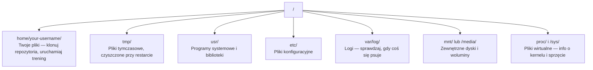

# Linux dla AI

> Większość AI działa na Linux. Musisz znać wystarczająco dużo, żeby się nie zablokować.

**Typ:** Nauka
**Języki:** --
**Wymagania wstępne:** Faza 0, Lekcja 01
**Czas:** ~30 minut

## Cele uczenia się

- Nawiguj po systemie plików Linux i wykonuj podstawowe operacje na plikach z linii poleceń
- Zarządzaj uprawnieniami do plików za pomocą `chmod` i `chown`, aby rozwiązywać błędy "Permission denied"
- Instaluj pakiety systemowe za pomocą `apt` i skonfiguruj świeżą maszynę GPU do pracy z AI
- Rozpoznaj różnice między macOS a Linux, które często sprawiają problemy programistom pracującym na zdalnych maszynach

## Problem

Tworzysz na macOS lub Windows. Ale w chwili, gdy SSH-ujesz się do maszyny GPU w chmurze, wynajmujesz instancję Lambda lub uruchamiasz maszynę EC2, lądujesz w Ubuntu. Terminal jest twoim jedynym interfejsem. Nie ma Findera, nie ma Eksploratora, nie ma GUI. Jeśli nie potrafisz nawigować po systemie plików, instalować pakietów i zarządzać procesami z linii poleceń, utkniesz, płacąc za bezczynne godziny GPU, podczas gdy googlasz "jak rozpakować plik w Linux".

To jest przewodnik przetrwania. Obejmuje dokładnie to, czego potrzebujesz, żeby operować na zdalnej maszynie Linux do pracy z AI. Nic więcej.

## Struktura systemu plików

Linux organizuje wszystko pod jednym root `/`. Nie ma `C:\` ani `/Volumes`. Katalogi, których faktycznie będziesz używać:



Twój katalog domowy to `~` lub `/home/your-username`. Prawie wszystko, co robisz, odbywa się tutaj.

## Podstawowe polecenia

To są 15 poleceń, które pokrywają 95% tego, co będziesz robić na zdalnej maszynie GPU.

### Poruszanie się

```bash
pwd                         # Gdzie jestem?
ls                          # Co tutaj jest?
ls -la                      # Co tutaj jest, łącznie z ukrytymi plikami i szczegółami?
cd /path/to/dir             # Idź tam
cd ~                        # Idź do domu
cd ..                       # Idź o jeden poziom wyżej
```

### Pliki i katalogi

```bash
mkdir my-project            # Utwórz katalog
mkdir -p a/b/c              # Utwórz zagnieżdżone katalogi jednocześnie

cp file.txt backup.txt      # Skopiuj plik
cp -r src/ src-backup/      # Skopiuj katalog (rekursywnie)

mv old.txt new.txt          # Zmień nazwę pliku
mv file.txt /tmp/           # Przenieś plik

rm file.txt                 # Usuń plik (bez kosza, znika)
rm -rf my-dir/              # Usuń katalog i wszystko w nim
```

`rm -rf` jest trwałe. Nie ma cofnięcia. Sprawdź ścieżkę przed naciśnięciem Enter.

### Czytanie plików

```bash
cat file.txt                # Wydrukuj cały plik
head -20 file.txt           # Pierwsze 20 linii
tail -20 file.txt           # Ostatnie 20 linii
tail -f log.txt             # Śledź plik logów w czasie rzeczywistym (Ctrl+C żeby zatrzymać)
less file.txt               # Przewijaj plik (q żeby wyjść)
```

### Wyszukiwanie

```bash
grep "error" training.log           # Znajdź linie zawierające "error"
grep -r "learning_rate" .           # Przeszukaj wszystkie pliki w bieżącym katalogu
grep -i "cuda" config.yaml          # Wyszukiwanie bez rozróżniania wielkości liter

find . -name "*.py"                 # Znajdź wszystkie pliki Python w bieżącym katalogu
find . -name "*.ckpt" -size +1G     # Znajdź pliki checkpoint większe niż 1GB
```

## Uprawnienia

Każdy plik w Linux ma właściciela i bity uprawnień. Spotkasz się z tym, gdy skrypty nie będą się wykonywać lub nie będziesz mógł zapisywać do katalogu.

```bash
ls -l train.py
# -rwxr-xr-- 1 user group 2048 Mar 19 10:00 train.py
#  ^^^             uprawnienia właściciela: odczyt, zapis, wykonanie
#     ^^^          uprawnienia grupy: odczyt, wykonanie
#        ^^        wszyscy inni: tylko odczyt
```

Częste poprawki:

```bash
chmod +x train.sh           # Zrób skrypt wykonywalnym
chmod 755 deploy.sh         # Właściciel: pełne, inni: odczyt+wykonanie
chmod 644 config.yaml       # Właściciel: odczyt+zapis, inni: tylko odczyt

chown user:group file.txt   # Zmień właściciela pliku (wymaga sudo)
```

Gdy pojawia się błąd "Permission denied", prawie zawsze jest to problem z uprawnieniami. `chmod +x` lub `sudo` rozwiąże większość przypadków.

## Zarządzanie pakietami (apt)

Ubuntu używa `apt`. Tak instaluje się oprogramowanie na poziomie systemu.

```bash
sudo apt update             # Odśwież listę pakietów (zawsze rób to najpierw)
sudo apt install -y htop    # Zainstaluj pakiet (-y pomija potwierdzenie)
sudo apt install -y build-essential  # Kompilator C, make itp. Potrzebne przez wiele pakietów Python
sudo apt install -y tmux    # Multiplekser terminala (utrzymuje sesje przy życiu po rozłączeniu)

apt list --installed        # Co jest zainstalowane?
sudo apt remove htop        # Odinstaluj
```

Pakiety, które zazwyczaj instalujesz na świeżej maszynie GPU:

```bash
sudo apt update && sudo apt install -y \
    build-essential \
    git \
    curl \
    wget \
    tmux \
    htop \
    unzip \
    python3-venv
```

## Użytkownicy i sudo

Zazwyczaj jesteś zalogowany jako zwykły użytkownik. Niektóre operacje wymagają dostępu root (admin).

```bash
whoami                      # Jakim użytkownikiem jestem?
sudo command                # Uruchom pojedyncze polecenie jako root
sudo su                     # Zostań root (exit żeby wrócić, używaj oszczędnie)
```

Na instancjach GPU w chmurze zazwyczaj jesteś jedynym użytkownikiem i masz już dostęp sudo. Nie uruchamiaj wszystkiego jako root. Używaj sudo tylko wtedy, gdy jest to potrzebne.

## Procesy i systemd

Gdy twój trening się zawiesi lub musisz sprawdzić, co jest uruchomione:

```bash
htop                        # Interaktywny podgląd procesów (q żeby wyjść)
ps aux | grep python        # Znajdź uruchomione procesy Python
kill 12345                  # Delikatnie zatrzymaj proces z PID 12345
kill -9 12345               # Wymuś zabicie (użyj, gdy delikatne nie działa)
nvidia-smi                  # Procesy GPU i użycie pamięci
```

systemd zarządza usługami (demonami w tle). Użyjesz go, jeśli uruchamiasz serwery inferencji:

```bash
sudo systemctl start nginx          # Uruchom usługę
sudo systemctl stop nginx           # Zatrzymaj ją
sudo systemctl restart nginx        # Zrestartuj ją
sudo systemctl status nginx         # Sprawdź, czy działa
sudo systemctl enable nginx         # Uruchamiaj automatycznie przy starcie
```

## Miejsce na dysku

Maszyny GPU często mają ograniczoną przestrzeń dyskową. Modele i zestawy danych szybko ją wypełniają.

```bash
df -h                       # Użycie dysku dla wszystkich zamontowanych dysków
df -h /home                 # Użycie dysku dla /home konkretnie

du -sh *                    # Rozmiar każdego elementu w bieżącym katalogu
du -sh ~/.cache             # Rozmiar twojej pamięci podręcznej (pip, modele huggingface trafiają tutaj)
du -sh /data/checkpoints/   # Sprawdź, jak duże są twoje checkpoints

# Znajdź największe pożeracze miejsca
du -h --max-depth=1 / 2>/dev/null | sort -hr | head -20
```

Typowe sposoby na oszczędzanie miejsca:

```bash
# Wyczyść pamięćć podręczną pip
pip cache purge

# Wyczyść pamięćć podręczną apt
sudo apt clean

# Usuń stare checkpoints, których nie potrzebujesz
rm -rf checkpoints/epoch_01/ checkpoints/epoch_02/
```

## Sieć

Będziesz pobierać modele, transferować pliki i wywoływać API z linii poleceń.

```bash
# Pobierz pliki
wget https://example.com/model.bin                   # Pobierz plik
curl -O https://example.com/data.tar.gz              # To samo z curl
curl -s https://api.example.com/health | python3 -m json.tool  # Wywołaj API, ładnie sformatuj JSON

# Transferuj pliki między maszynami
scp model.bin user@remote:/data/                     # Kopiuj plik na zdalną maszynę
scp user@remote:/data/results.csv .                  # Kopiuj plik ze zdalnej na lokalną
scp -r user@remote:/data/checkpoints/ ./local-dir/   # Kopiuj katalog

# Synchronizuj katalogi (szybsze niż scp dla dużych transferów, wznawia się po awarii)
rsync -avz --progress ./data/ user@remote:/data/
rsync -avz --progress user@remote:/results/ ./results/
```

Używaj `rsync` zamiast `scp` do czegokolwiek dużego. Przesyła tylko zmienione bajty i obsługuje przerwane połączenia.

## tmux: Utrzymuj sesje przy życiu

Gdy SSH-ujesz się do zdalnej maszyny, zamknięcie laptopa zabija twój trening. tmux temu zapobiega.

```bash
tmux new -s train           # Rozpocznij nową sesję o nazwie "train"
# ... uruchom swój trening, potem:
# Ctrl+B, następnie D            # Odłącz (trening nadal działa)

tmux ls                     # Lista sesji
tmux attach -t train        # Ponownie podłącz do sesji

# Wewnątrz tmux:
# Ctrl+B, następnie %            # Podziel pane wertykalnie
# Ctrl+B, następnie "            # Podziel pane horyzontalnie
# Ctrl+B, następnie klawisze strzałek   # Przełączaj między pane
```

Zawsze uruchamiaj długie treningi w tmux. Zawsze.

## WSL2 dla użytkowników Windows

Jeśli jesteś na Windows, WSL2 daje ci prawdziwe środowisko Linux bez dual-bootu.

```bash
# W PowerShell (admin)
wsl --install -d Ubuntu-24.04

# Po restarcie otwórz Ubuntu z menu Start
sudo apt update && sudo apt upgrade -y
```

WSL2 uruchamia prawdziwy kernel Linux. Wszystko w tej lekcji działa w nim. Twoje pliki Windows są w `/mnt/c/Users/YourName/` z wnętrza WSL.

GPU passthrough działa ze sterownikami NVIDIA zainstalowanymi po stronie Windows. Zainstaluj sterownik NVIDIA dla Windows (nie ten dla Linux), a CUDA będzie dostępna w WSL2.

## Pułapki: macOS do Linux

Rzeczy, które sprawią ci problem, jeśli przechodzisz z macOS:

| macOS | Linux | Uwagi |
|-------|-------|-------|
| `brew install` | `sudo apt install` | Różne nazwy pakietów czasem. `brew install htop` vs `sudo apt install htop` działa tak samo, ale `brew install readline` vs `sudo apt install libreadline-dev` nie. |
| `open file.txt` | `xdg-open file.txt` | Ale nie będziesz mieć GUI na zdalnej maszynie. Użyj `cat` lub `less`. |
| `pbcopy` / `pbpaste` | Niedostępne | Przesyłanie do/ze schowka nie istnieje przez SSH. |
| `~/.zshrc` | `~/.bashrc` | macOS domyślnie używa zsh. Większość serwerów Linux używa bash. |
| `/opt/homebrew/` | `/usr/bin/`, `/usr/local/bin/` | Binarki żyją w różnych miejscach. |
| `sed -i '' 's/a/b/' file` | `sed -i 's/a/b/' file` | sed na macOS wymaga pustego ciągu po `-i`. Linux nie. |
| System plików bez rozróżniania wielkości liter | System plików z rozróżnianiem wielkości liter | `Model.py` i `model.py` to dwa różne pliki na Linux. |
| Końce linii `\n` | Końce linii `\n` | Takie same. Ale Windows używa `\r\n`, co psuje skrypty bash. Uruchom `dos2unix`, żeby naprawić. |

## Karta szybkiego dostępu

```
Nawigacja:     pwd, ls, cd, find
Pliki:         cp, mv, rm, mkdir, cat, head, tail, less
Wyszukiwanie:  grep, find
Uprawnienia:   chmod, chown, sudo
Pakiety:       apt update, apt install
Procesy:       htop, ps, kill, nvidia-smi
Usługi:        systemctl start/stop/restart/status
Dysk:          df -h, du -sh
Sieć:          curl, wget, scp, rsync
Sesje:         tmux new/attach/detach
```

## Ćwiczenia

1. SSH do dowolnej maszyny Linux (lub otwórz WSL2) i przejdź do katalogu domowego. Utwórz folder projektu, utwórz trzy puste pliki w nim za pomocą `touch`, a następnie wyświetl je za pomocą `ls -la`.
2. Zainstaluj `htop` za pomocą apt, uruchom go i zidentyfikuj, który proces zużywa najwięcej pamięci.
3. Rozpocznij sesję tmux, uruchom w niej `sleep 300`, odłącz się, wyświetl listę sesji i ponownie podłącz.
4. Użyj `df -h`, żeby sprawdzić dostępne miejsce na dysku, a następnie użyj `du -sh ~/.cache/*`, żeby znaleźć, co zajmuje miejsce w twojej pamięci podręcznej.
5. Transferuj plik z komputera lokalnego na zdalny za pomocą `scp`, a następnie wykonaj ten sam transfer za pomocą `rsync` i porównaj doświadczenie.