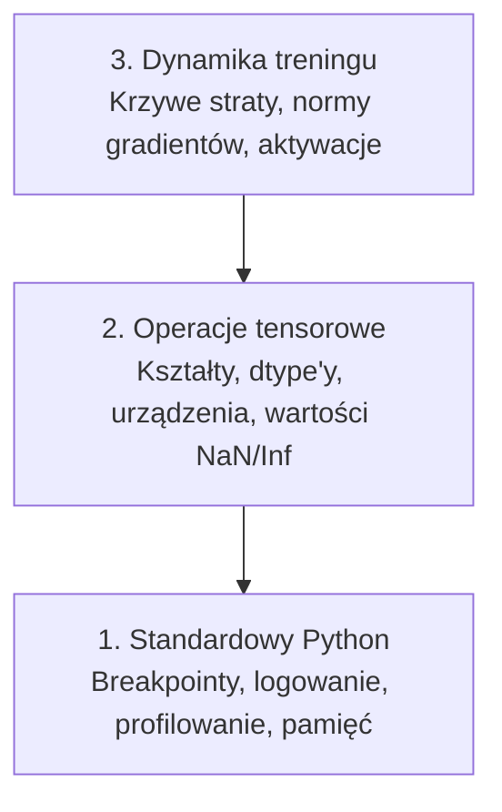

# Debugowanie i Profilowanie

> Najgorsze błędy AI nie powodują crashy. Uczą się po cichu na śmieciach i pokazują piękną krzywą straty.

**Typ:** Build
**Język:** Python
**Wymagania wstępne:** Lekcja 1 (Środowisko deweloperskie), podstawowa znajomość PyTorch
**Czas:** ~60 minut

## Cele uczenia się

- Używać warunkowego `breakpoint()` i `debug_print` do inspekcji kształtów tensorów, dtype'ów i wartości NaN w trakcie treningu
- Profilować pętle treningowe z `cProfile`, `line_profiler` i `tracemalloc`, aby znajdować wąskie gardła
- Wykrywać typowe błędy AI: niezgodność kształtów, stratę NaN, wyciek danych i tensory na złym urządzeniu
- Konfigurować TensorBoard do wizualizacji krzywych straty, histogramów wag i rozkładów gradientów

## Problem

Kod AI zawodzi inaczej niż zwykły kod. Aplikacja webowa crashuje ze stack trace. Błędnie skonfigurowana pętla treningowa działa przez 8 godzin, zużywa 200 dolarów czasu GPU i produkuje model, który przewiduje średnią każdego wejścia. Kod nigdy nie wyrzucił błędu. Bug był tensorem na złym urządzeniu, zapomnianym `.detach()`, albo etykietami przedostającymi się do cech.

Potrzebujesz narzędzi debugowania, które łapią te ciche błędy, zanim zmarnują Twój czas i zasoby obliczeniowe.

## Koncepcja

Debugowanie AI działa na trzech poziomach:



Większość ludzi przeskakuje od razu do poziomu 3 (wpatrując się w TensorBoard). Ale 80% błędów AI żyje na poziomach 1 i 2.

## Zbuduj to

### Część 1: Debugowanie przez print (Tak, działa)

Debugowanie przez print jest lekceważone. Nie powinno być. Dla kodu tensorowego, celowy print przewyższa stepping przez debugger, bo musisz widzieć kształty, dtype'y i zakresy wartości naraz.

```python
def debug_print(name, tensor):
    print(f"{name}: shape={tensor.shape}, dtype={tensor.dtype}, "
          f"device={tensor.device}, "
          f"min={tensor.min().item():.4f}, max={tensor.max().item():.4f}, "
          f"mean={tensor.mean().item():.4f}, "
          f"has_nan={tensor.isnan().any().item()}")
```

Wywołuj to po każdej podejrzanej operacji. Gdy bug zostanie znaleziony, usuń printy. Proste.

### Część 2: Debuger Python (pdb i breakpoint)

Wbudowany debugger jest niedoceniany dla pracy AI. Wstaw `breakpoint()` do pętli treningowej i inspekcj tensorów interaktywnie.

```python
def training_step(model, batch, criterion, optimizer):
    inputs, labels = batch
    outputs = model(inputs)
    loss = criterion(outputs, labels)

    if loss.item() > 100 or torch.isnan(loss):
        breakpoint()

    loss.backward()
    optimizer.step()
```

Gdy debugger Cię zatrzyma, przydatne komendy:

- `p outputs.shape` do sprawdzenia kształtów
- `p loss.item()` do zobaczenia wartości straty
- `p torch.isnan(outputs).sum()` do policzenia NaN'ów
- `p model.fc1.weight.grad` do sprawdzenia gradientów
- `c` aby kontynuować, `q` aby wyjść

To jest warunkowe debugowanie. Zatrzymujesz się tylko wtedy, gdy coś wygląda źle. Dla treningu trwającego 10 000 kroków, to ma znaczenie.

### Część 3: Logowanie Python

Zastąp instrukcje print logowaniem, gdy debugowanie wykracza poza szybki check.

```python
import logging

logging.basicConfig(
    level=logging.INFO,
    format="%(asctime)s [%(levelname)s] %(message)s",
    handlers=[
        logging.FileHandler("training.log"),
        logging.StreamHandler()
    ]
)
logger = logging.getLogger(__name__)

logger.info("Starting training: lr=%.4f, batch_size=%d", lr, batch_size)
logger.warning("Loss spike detected: %.4f at step %d", loss.item(), step)
logger.error("NaN loss at step %d, stopping", step)
```

Logowanie daje Ci znaczniki czasu, poziomy ważności i output do pliku. Gdy trening zawiedzie o 3 w nocy, chcesz plik logu, nie output terminala, który przewinął się poza ekran.

### Część 4: Mierzenie czasu sekcji kodu

Wiedzenie, gdzie ucieka czas, to pierwszy krok do optymalizacji.

```python
import time

class Timer:
    def __init__(self, name=""):
        self.name = name

    def __enter__(self):
        self.start = time.perf_counter()
        return self

    def __exit__(self, *args):
        elapsed = time.perf_counter() - self.start
        print(f"[{self.name}] {elapsed:.4f}s")

with Timer("data loading"):
    batch = next(dataloader_iter)

with Timer("forward pass"):
    outputs = model(batch)

with Timer("backward pass"):
    loss.backward()
```

Częsty wniosek: ładowanie danych zabiera 60% czasu treningu. Rozwiązanie to `num_workers > 0` w DataLoaderze, nie szybszy GPU.

### Część 5: cProfile i line_profiler

Gdy potrzebujesz więcej niż ręczne timery:

```bash
python -m cProfile -s cumtime train.py
```

To pokazuje każde wywołanie funkcji posortowane przez skumulowany czas. Dla profilowania linia po linii:

```bash
pip install line_profiler
```

```python
@profile
def train_step(model, data, target):
    output = model(data)
    loss = F.cross_entropy(output, target)
    loss.backward()
    return loss

# Run with: kernprof -l -v train.py
```

### Część 6: Profilowanie pamięci

#### Pamięć CPU z tracemalloc

```python
import tracemalloc

tracemalloc.start()

# your code here
model = build_model()
data = load_dataset()

snapshot = tracemalloc.take_snapshot()
top_stats = snapshot.statistics("lineno")
for stat in top_stats[:10]:
    print(stat)
```

#### Pamięć CPU z memory_profiler

```bash
pip install memory_profiler
```

```python
from memory_profiler import profile

@profile
def load_data():
    raw = read_csv("data.csv")       # watch memory jump here
    processed = preprocess(raw)       # and here
    return processed
```

Uruchom z `python -m memory_profiler your_script.py`, aby zobaczyć użycie pamięci linia po linii.

#### Pamięć GPU z PyTorch

```python
import torch

if torch.cuda.is_available():
    print(torch.cuda.memory_summary())

    print(f"Allocated: {torch.cuda.memory_allocated() / 1e9:.2f} GB")
    print(f"Cached: {torch.cuda.memory_reserved() / 1e9:.2f} GB")
```

Gdy natrafisz na OOM (Out of Memory):

1. Zmniejsz batch size (pierwsza rzecz do wypróbowania, zawsze)
2. Użyj `torch.cuda.empty_cache()` aby zwolnić cached memory
3. Użyj `del tensor` a potem `torch.cuda.empty_cache()` dla dużych intermediatów
4. Użyj mixed precision (`torch.cuda.amp`) aby zmniejszyć użycie pamięci o połowę
5. Użyj gradient checkpointing dla bardzo głębokich modeli

### Część 7: Typowe błędy AI i jak je wykryć

#### Niezgodność kształtów

Najczęstszy bug. Tensor ma kształt `[batch, features]`, gdy model oczekuje `[batch, channels, height, width]`.

```python
def check_shapes(model, sample_input):
    print(f"Input: {sample_input.shape}")
    hooks = []

    def make_hook(name):
        def hook(module, inp, out):
            in_shape = inp[0].shape if isinstance(inp, tuple) else inp.shape
            out_shape = out.shape if hasattr(out, "shape") else type(out)
            print(f"  {name}: {in_shape} -> {out_shape}")
        return hook

    for name, module in model.named_modules():
        hooks.append(module.register_forward_hook(make_hook(name)))

    with torch.no_grad():
        model(sample_input)

    for h in hooks:
        h.remove()
```

Uruchom to raz z przykładowym batchem. Mapuje każdą transformację kształtu w Twoim modelu.

#### Strata NaN

Strata NaN oznacza, że coś wybuchło. Typowe przyczyny:

- Learning rate za wysoki
- Dzielenie przez zero w custom loss
- Log z zera lub ujemnej liczby
- Wybuchające gradienty w RNN

```python
def detect_nan(model, loss, step):
    if torch.isnan(loss):
        print(f"NaN loss at step {step}")
        for name, param in model.named_parameters():
            if param.grad is not None:
                if torch.isnan(param.grad).any():
                    print(f"  NaN gradient in {name}")
                if torch.isinf(param.grad).any():
                    print(f"  Inf gradient in {name}")
        return True
    return False
```

#### Wyciek danych

Twój model osiąga 99% accuracy na zbiorze testowym. Brzmi świetnie. To jest bug.

```python
def check_data_leakage(train_set, test_set, id_column="id"):
    train_ids = set(train_set[id_column].tolist())
    test_ids = set(test_set[id_column].tolist())
    overlap = train_ids & test_ids
    if overlap:
        print(f"DATA LEAKAGE: {len(overlap)} samples in both train and test")
        return True
    return False
```

Sprawdź też wyciek temporalny: używanie przyszłych danych do przewidywania przeszłości. Sortuj po znaczniku czasu przed podziałem.

#### Złe urządzenie

Tensory na różnych urządzeniach (CPU vs GPU) powodują błędy runtime. Ale czasami tensor po cichu zostaje na CPU, podczas gdy wszystko inne jest na GPU, i trening po prostu działa wolno.

```python
def check_devices(model, *tensors):
    model_device = next(model.parameters()).device
    print(f"Model device: {model_device}")
    for i, t in enumerate(tensors):
        if t.device != model_device:
            print(f"  WARNING: tensor {i} on {t.device}, model on {model_device}")
```

### Część 8: Podstawy TensorBoard

TensorBoard pokazuje Ci, co się dzieje wewnątrz treningu w czasie.

```bash
pip install tensorboard
```

```python
from torch.utils.tensorboard import SummaryWriter

writer = SummaryWriter("runs/experiment_1")

for step in range(num_steps):
    loss = train_step(model, batch)

    writer.add_scalar("loss/train", loss.item(), step)
    writer.add_scalar("lr", optimizer.param_groups[0]["lr"], step)

    if step % 100 == 0:
        for name, param in model.named_parameters():
            writer.add_histogram(f"weights/{name}", param, step)
            if param.grad is not None:
                writer.add_histogram(f"grads/{name}", param.grad, step)

writer.close()
```

Uruchom:

```bash
tensorboard --logdir=runs
```

Na co zwracać uwagę:

- **Strata nie maleje**: Learning rate za niski albo problem z architekturą modelu
- **Strata gwałtownie oscyluje**: Learning rate za wysoki
- **Strata idzie do NaN**: Niestabilność numeryczna (zobacz sekcję o NaN powyżej)
- **Strata treningowa maleje, strata walidacyjna rośnie**: Overfitting
- **Histogramy wag zapadają się do zera**: Zanikające gradienty
- **Histogramy gradientów wybuchają**: Potrzeba gradient clipping

### Część 9: Debuger VS Code

Dla interaktywnego debugowania, skonfiguruj VS Code z `launch.json`:

```json
{
    "version": "0.2.0",
    "configurations": [
        {
            "name": "Debug Training",
            "type": "debugpy",
            "request": "launch",
            "program": "${file}",
            "console": "integratedTerminal",
            "justMyCode": false
        }
    ]
}
```

Ustaw breakpointy klikając na gutter. Użyj pane Variables do inspekcji właściwości tensorów. Debug Console pozwala uruchamiać dowolne wyrażenia Python w połowie wykonania.

Przydatne do steppingowania przez pipeline'y preprocessingu danych, gdzie chcesz widzieć każdą transformację.

## Użyj tego

Oto workflow debugowania, który łapie większość błędów AI:

1. **Przed treningiem**: Uruchom `check_shapes` z przykładowym batchem. Zweryfikuj, że wymiary wejścia i wyjścia odpowiadają oczekiwaniom.
2. **Pierwsze 10 kroków**: Użyj `debug_print` na stracie, outputach i gradientach. Potwierdź, że nic nie jest NaN i wartości są w rozsądnych zakresach.
3. **Podczas treningu**: Loguj stratę, learning rate i normy gradientów. Używaj TensorBoard do wizualizacji.
4. **Gdy coś się psuje**: Wstaw `breakpoint()` w miejscu błędu. Inspekcj tensory interaktywnie.
5. **Dla wydajności**: Mierz czas ładowania danych vs forward vs backward pass. Profiluj pamięć, jeśli jesteś blisko OOM.

## Wyślij to

Uruchom skrypt toolkitu debugowania:

```bash
python phases/00-setup-and-tooling/12-debugging-and-profiling/code/debug_tools.py
```

Zobacz `outputs/prompt-debug-ai-code.md` po prompta, który pomaga diagnozować błędy specyficzne dla AI.

## Ćwiczenia

1. Uruchom `debug_tools.py` i przeczytaj output każdej sekcji. Zmodyfikuj dummy model, aby wprowadzić NaN (podpowiedź: dzielenie przez zero w forward pass) i obserwuj, jak detektor to złapie.
2. Profiluj pętlę treningową z `cProfile` i zidentyfikuj najwolniejszą funkcję.
3. Użyj `tracemalloc`, aby znaleźć, która linia w pipeline'zie ładowania danych alokuje najwięcej pamięci.
4. Skonfiguruj TensorBoard dla prostego treningu i zidentyfikuj, czy model ma overfitting.
5. Użyj `breakpoint()` wewnątrz pętli treningowej. Ćwicz inspekcję kształtów tensorów, urządzeń i wartości gradientów z promptu debugera.