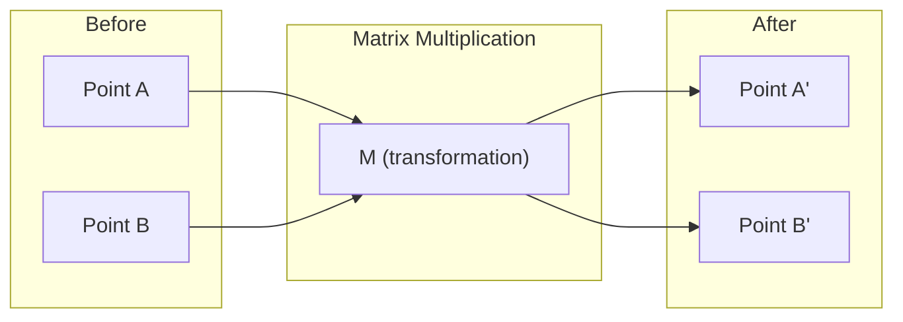
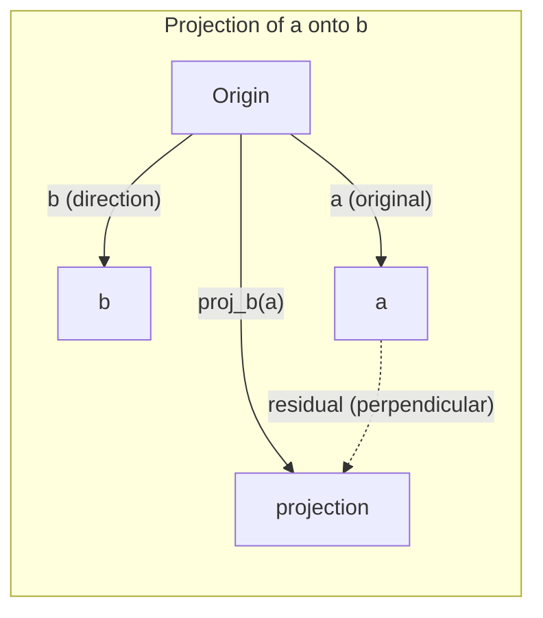

# Intuicja algebry liniowej

> Każdy model AI to po prostu matematyka macierzy w modnym kapeluszu.

**Type:** Learn
**Languages:** Python, Julia
**Prerequisites:** Phase 0
**Time:** ~60 minutes

## Cele uczenia się

- Implementuj operacje na wektorach i macierzach (dodawanie, iloczyn skalarny, mnożenie macierzy) od zera w Pythonie
- Wyjaśnij geometrycznie, co robi iloczyn skalarny, projekcja i proces Grama-Schmidta
- Określaj liniową niezależność, rząd i bazę zbioru wektorów za pomocą redukcji wierszowej
- Połącz koncepcje algebry liniowej z ich zastosowaniami w AI: embeddings, wyniki attention i LoRA

## Problem

Otwórz dowolny artykuł ML. W pierwszej stronie zobaczysz wektory, macierze, iloczyny skalarne i transformacje. Bez intuicji algebraicznej są to tylko symbole. Dzięki niej widzisz, co sieć neuronowa faktycznie robi -- przesuwa punkty w przestrzeni.

Nie musisz być matematykiem. Musisz zobaczyć, co te operacje oznaczają geometrycznie, a potem zakodować je samodzielnie.

## Koncepcja

### Wektory to punkty (i kierunki)

Wektor to po prostu lista liczb. Ale te liczby coś oznaczają -- to współrzędne w przestrzeni.

**Wektor 2D [3, 2]:**

| x | y | Punkt |
|---|---|-------|
| 3 | 2 | Wektor wskazuje z początku (0,0) do (3, 2) na płaszczyźnie |

Wektor ma długość sqrt(3^2 + 2^2) = sqrt(13) i wskazuje w górę i w prawo.

W AI wektory reprezentują wszystko:
- Słowo → wektor 768 liczb (jego "znaczenie" w przestrzeni embeddingów)
- Obraz → wektor milionów wartości pikseli
- Użytkownik → wektor preferencji

### Macierze to transformacje

Macierz przekształca jeden wektor w drugi. Może obracać, skalować, rozciągać lub projektować.



W AI macierze SĄ modelem:
- Wagi sieci neuronowej → macierze przekształcające dane wejściowe w wyjściowe
- Wyniki attention → macierze decydujące, na czym się skupić
- Embeddings → macierze mapujące słowa na wektory

### Iloczyn skalarny mierzy podobieństwo

Iloczyn skalarny dwóch wektorów mówi, jak bardzo są podobne.

```
a · b = a₁×b₁ + a₂×b₂ + ... + aₙ×bₙ

Ten sam kierunek:   a · b > 0  (podobne)
Prostopadłe:       a · b = 0  (niepowiązane)
Przeciwny kierunek: a · b < 0  (niepodobne)
```

To dosłownie jak działają wyszukiwarki, systemy rekomendacji i RAG -- znajdują wektory o wysokim iloczynie skalarnym.

### Liniowa niezależność

Wektory są liniowo niezależne, gdy żaden wektor ze zbioru nie może być zapisany jako kombinacja pozostałych. Jeśli v1, v2, v3 są niezależne, rozpinają przestrzeń 3D. Jeśli jeden jest kombinacją pozostałych, rozpinają tylko płaszczyznę.

Dlaczego to ma znaczenie w AI: macierz cech powinna mieć liniowo niezależne kolumny. Jeśli dwie cechy są idealnie skorelowane (liniowo zależne), model nie może rozróżnić ich wpływów. To powoduje multicollinearity w regresji -- macierz wag staje się niestabilna, a małe zmiany danych wejściowych powodują duże wahania wyjść.

**Konkretny przykład:**

```
v1 = [1, 0, 0]
v2 = [0, 1, 0]
v3 = [2, 1, 0]   # v3 = 2*v1 + v2
```

v1 i v2 są niezależne -- żaden nie jest wielokrotnością ani kombinacją drugiego. Ale v3 = 2*v1 + v2, więc {v1, v2, v3} jest zbiorem zależnym. Te trzy wektory leżą w płaszczyźnie xy. Jakiekolwiek ich połączenie nie da ci dotrzeć do [0, 0, 1]. Masz trzy wektory, ale tylko dwa wymiary swobody.

W zbiorze danych: jeśli feature_3 = 2*feature_1 + feature_2, dodanie feature_3 daje modelowi zero nowej informacji. Co gorsza, powoduje, że równania normalne stają się osobliwe -- nie ma unikalnego rozwiązania dla wag.

### Baza i rząd

Baza to minimalny zbiór liniowo niezależnych wektorów, które rozpinają całą przestrzeń. Liczba wektorów bazowych to wymiar przestrzeni.

Standardowa baza przestrzeni 3D to {[1,0,0], [0,1,0], [0,0,1]}. Ale każde trzy niezależne wektory w 3D tworzą prawidłową bazę. Wybór bazy to wybór układu współrzędnych.

Rząd macierzy = liczba liniowo niezależnych kolumn = liczba liniowo niezależnych wierszy. Jeśli rząd < min(wiersze, kolumny), macierz ma rząd niewystarczający. To oznacza:
- Układ ma nieskończenie wiele rozwiązań (lub brak)
- Informacja jest tracona w transformacji
- Macierzy nie można odwrócić

| Sytuacja | Rząd | Co to oznacza dla ML |
|-----------|------|---------------------|
| Pełny rząd (rząd = min(m, n)) | Maksymalny możliwy | Istnieje unikalne rozwiązanie najmniejszych kwadratów. Model jest dobrze uwarunkowany. |
| Rząd niewystarczający (rząd < min(m, n)) | Poniżej maksimum | Cechy są redundantne. Nieskończenie wiele rozwiązań wag. Wymagana regularizacja. |
| Rząd 1 | 1 | Każda kolumna to skalowana kopia jednego wektora. Wszystkie dane leżą na prostej. |
| Bliski niewystarczającego rzędu (małe wartości osobliwe) | Numerycznie niski | Macierz jest źle uwarunkowana. Mały szum wejściowy powoduje duże zmiany wyjściowe. Użyj obcięcia SVD lub regresji grzbietowej. |

### Projekcja

Projekcja wektora **a** na wektor **b** daje składową **a** w kierunku **b**:

```
proj_b(a) = (a dot b / b dot b) * b
```

Reszta (a - proj_b(a)) jest prostopadła do b. Ta ortogonalna dekompozycja jest fundamentem metody najmniejszych kwadratów.

Projekcja jest wszędzie w ML:
- Regresja liniowa minimalizuje odległość od obserwacji do przestrzeni kolumnowej -- rozwiązanie TO projekcja
- PCA projektuje dane na kierunki maksymalnej wariancji
- Attention w transformerach oblicza projekcje queries na klucze



**Przykład:** a = [3, 4], b = [1, 0]

proj_b(a) = (3*1 + 4*0) / (1*1 + 0*0) * [1, 0] = 3 * [1, 0] = [3, 0]

Projekcja upuszcza składową y. To redukcja wymiaru w najprostszej formie -- odrzucasz kierunki, na których ci nie zależy.

### Proces Grama-Schmidta

Konwersja dowolnego zbioru niezależnych wektorów na bazę ortonormalną. Ortonormalny oznacza, że każdy wektor ma długość 1 i każda para jest prostopadła.

Algorytm:
1. Weź pierwszy wektor, znormalizuj go
2. Weź drugi wektor, odejmij jego projekcję na pierwszy, znormalizuj
3. Weź trzeci wektor, odejmij jego projekcje na wszystkie poprzednie, znormalizuj
4. Powtórz dla pozostałych wektorów

```
Input:  v1, v2, v3, ... (linearly independent)

u1 = v1 / |v1|

w2 = v2 - (v2 dot u1) * u1
u2 = w2 / |w2|

w3 = v3 - (v3 dot u1) * u1 - (v3 dot u2) * u2
u3 = w3 / |w3|

Output: u1, u2, u3, ... (orthonormal basis)
```

Tak działa dekompozycja QR wewnętrznie. Q to baza ortonormalna, R przechowuje współczynniki projekcji. Dekompozycja QR jest używana w:
- Rozwiązywaniu układów liniowych (stabilniejsza niż eliminacja Gaussa)
- Obliczaniu wartości własnych (algorytm QR)
- Regresji metodą najmniejszych kwadratów (standardowa metoda numeryczna)

## Buduj to

### Krok 1: Wektory od zera (Python)

```python
class Vector:
    def __init__(self, components):
        self.components = list(components)
        self.dim = len(self.components)

    def __add__(self, other):
        return Vector([a + b for a, b in zip(self.components, other.components)])

    def __sub__(self, other):
        return Vector([a - b for a, b in zip(self.components, other.components)])

    def dot(self, other):
        return sum(a * b for a, b in zip(self.components, other.components))

    def magnitude(self):
        return sum(x**2 for x in self.components) ** 0.5

    def normalize(self):
        mag = self.magnitude()
        return Vector([x / mag for x in self.components])

    def cosine_similarity(self, other):
        return self.dot(other) / (self.magnitude() * other.magnitude())

    def __repr__(self):
        return f"Vector({self.components})"


a = Vector([1, 2, 3])
b = Vector([4, 5, 6])

print(f"a + b = {a + b}")
print(f"a · b = {a.dot(b)}")
print(f"|a| = {a.magnitude():.4f}")
print(f"cosine similarity = {a.cosine_similarity(b):.4f}")
```

### Krok 2: Macierze od zera (Python)

```python
class Matrix:
    def __init__(self, rows):
        self.rows = [list(row) for row in rows]
        self.shape = (len(self.rows), len(self.rows[0]))

    def __matmul__(self, other):
        if isinstance(other, Vector):
            return Vector([
                sum(self.rows[i][j] * other.components[j] for j in range(self.shape[1]))
                for i in range(self.shape[0])
            ])
        rows = []
        for i in range(self.shape[0]):
            row = []
            for j in range(other.shape[1]):
                row.append(sum(
                    self.rows[i][k] * other.rows[k][j]
                    for k in range(self.shape[1])
                ))
            rows.append(row)
        return Matrix(rows)

    def transpose(self):
        return Matrix([
            [self.rows[j][i] for j in range(self.shape[0])]
            for i in range(self.shape[1])
        ])

    def __repr__(self):
        return f"Matrix({self.rows})"


rotation_90 = Matrix([[0, -1], [1, 0]])
point = Vector([3, 1])

rotated = rotation_90 @ point
print(f"Original: {point}")
print(f"Rotated 90°: {rotated}")
```

### Krok 3: Dlaczego to ma znaczenie dla AI

```python
import random

random.seed(42)
weights = Matrix([[random.gauss(0, 0.1) for _ in range(3)] for _ in range(2)])
input_vector = Vector([1.0, 0.5, -0.3])

output = weights @ input_vector
print(f"Input (3D): {input_vector}")
print(f"Output (2D): {output}")
print("This is what a neural network layer does -- matrix multiplication.")
```

### Krok 4: Wersja Julia

```julia
a = [1.0, 2.0, 3.0]
b = [4.0, 5.0, 6.0]

println("a + b = ", a + b)
println("a · b = ", a ⋅ b)       # Julia supports unicode operators
println("|a| = ", √(a ⋅ a))
println("cosine = ", (a ⋅ b) / (√(a ⋅ a) * √(b ⋅ b)))

# Matrix-vector multiplication
W = [0.1 -0.2 0.3; 0.4 0.5 -0.1]
x = [1.0, 0.5, -0.3]
println("Wx = ", W * x)
println("This is a neural network layer.")
```

### Krok 5: Liniowa niezależność i projekcja od zera (Python)

```python
def is_linearly_independent(vectors):
    n = len(vectors)
    dim = len(vectors[0].components)
    mat = Matrix([v.components[:] for v in vectors])
    rows = [row[:] for row in mat.rows]
    rank = 0
    for col in range(dim):
        pivot = None
        for row in range(rank, len(rows)):
            if abs(rows[row][col]) > 1e-10:
                pivot = row
                break
        if pivot is None:
            continue
        rows[rank], rows[pivot] = rows[pivot], rows[rank]
        scale = rows[rank][col]
        rows[rank] = [x / scale for x in rows[rank]]
        for row in range(len(rows)):
            if row != rank and abs(rows[row][col]) > 1e-10:
                factor = rows[row][col]
                rows[row] = [rows[row][j] - factor * rows[rank][j] for j in range(dim)]
        rank += 1
    return rank == n


def project(a, b):
    scalar = a.dot(b) / b.dot(b)
    return Vector([scalar * x for x in b.components])


def gram_schmidt(vectors):
    orthonormal = []
    for v in vectors:
        w = v
        for u in orthonormal:
            proj = project(w, u)
            w = w - proj
        if w.magnitude() < 1e-10:
            continue
        orthonormal.append(w.normalize())
    return orthonormal


v1 = Vector([1, 0, 0])
v2 = Vector([1, 1, 0])
v3 = Vector([1, 1, 1])
basis = gram_schmidt([v1, v2, v3])
for i, u in enumerate(basis):
    print(f"u{i+1} = {u}")
    print(f"  |u{i+1}| = {u.magnitude():.6f}")

print(f"u1 · u2 = {basis[0].dot(basis[1]):.6f}")
print(f"u1 · u3 = {basis[0].dot(basis[2]):.6f}")
print(f"u2 · u3 = {basis[1].dot(basis[2]):.6f}")
```

## Użyj tego

Teraz to samo z NumPy -- co faktycznie będziesz używać w praktyce:

```python
import numpy as np

a = np.array([1, 2, 3], dtype=float)
b = np.array([4, 5, 6], dtype=float)

print(f"a + b = {a + b}")
print(f"a · b = {np.dot(a, b)}")
print(f"|a| = {np.linalg.norm(a):.4f}")
print(f"cosine = {np.dot(a, b) / (np.linalg.norm(a) * np.linalg.norm(b)):.4f}")

W = np.random.randn(2, 3) * 0.1
x = np.array([1.0, 0.5, -0.3])
print(f"Wx = {W @ x}")
```

### Rząd, projekcja i QR z NumPy

```python
import numpy as np

A = np.array([[1, 2], [2, 4]])
print(f"Rank: {np.linalg.matrix_rank(A)}")

a = np.array([3, 4])
b = np.array([1, 0])
proj = (np.dot(a, b) / np.dot(b, b)) * b
print(f"Projection of {a} onto {b}: {proj}")

Q, R = np.linalg.qr(np.random.randn(3, 3))
print(f"Q is orthogonal: {np.allclose(Q @ Q.T, np.eye(3))}")
print(f"R is upper triangular: {np.allclose(R, np.triu(R))}")
```

### PyTorch -- Tensory to wektory z autodiff

```python
import torch

x = torch.randn(3, requires_grad=True)
y = torch.tensor([1.0, 0.0, 0.0])

similarity = torch.dot(x, y)
similarity.backward()

print(f"x = {x.data}")
print(f"y = {y.data}")
print(f"dot product = {similarity.item():.4f}")
print(f"d(dot)/dx = {x.grad}")
```

Gradient iloczynu skalarnego względem x to po prostu y. PyTorch obliczył to automatycznie. Każda operacja w sieci neuronowej jest zbudowana z takich operacji -- mnożenia macierzy, iloczyny skalarne, projekcje -- a autodiff śledzi gradienty przez nie wszystkie.

Właśnie zbudowałeś od zera to, co NumPy robi w jednej linii. Teraz wiesz, co dzieje się pod maską.

## Wyślij to

Ta lekcja tworzy:
- `outputs/prompt-linear-algebra-tutor.md` -- prompt dla AI assistants do nauczania algebry liniowej przez geometryczną intuicję

## Połączenia

Wszystko w tej lekcji łączy się z konkretnymi częściami nowoczesnego AI:

| Koncepcja | Gdzie się pojawia |
|---------|------------------|
| Iloczyn skalarny | Wyniki attention w transformerach, cosine similarity w RAG |
| Mnożenie macierzy | Każda warstwa sieci neuronowej, każda transformacja liniowa |
| Liniowa niezależność | Selekcja cech, unikanie multicollinearity |
| Rząd | Określanie czy układ jest rozwiązywalny, LoRA (low-rank adaptation) |
| Projekcja | Regresja liniowa (projekcja na przestrzeń kolumnową), PCA |
| Gram-Schmidt / QR | Solwery numeryczne, obliczanie wartości własnych |
| Baza ortonormalna | Stabilne obliczenia numeryczne, transformacje whitening |

LoRA zasługuje na szczególną uwagę. Fine-tunuje duże modele językowe poprzez dekompozycję aktualizacji wag na macierze niskiego rzędu. Zamiast aktualizować macierz wag 4096x4096 (16M parametrów), LoRA aktualizuje dwie macierze 4096x16 i 16x4096 (131K parametrów). Ograniczenie rzędu 16 oznacza, że LoRA zakłada, że aktualizacja wag żyje w podprzestrzeni 16-wymiarowej pełnej przestrzeni 4096-wymiarowej. To algebra liniowa robi realną pracę.

## Ćwiczenia

1. Zaimplementuj `Vector.angle_between(other)` która zwraca kąt w stopniach między dwoma wektorami
2. Stwórz macierz skalowania 2D która podwaja współrzędną x i potraja współrzędną y, a następnie applyuj ją do wektora [1, 1]
3. Mając 5 losowych wektorów podobnych do słów (wymiar 50), znajdź dwa najbardziej podobne używając cosine similarity
4. Zweryfikuj że output Grama-Schmidta jest prawdziwie ortonormalny: sprawdź że każda para ma iloczyn skalarny 0 i każdy wektor ma magnitudę 1
5. Stwórz macierz 3x3 z rzędem 2. Zweryfikuj używając metody `rank()`. Następnie wyjaśnij, jaką figurę geometryczną rozpinają kolumny.
6. Projektuj wektor [1, 2, 3] na [1, 1, 1]. Co wynik reprezentuje geometrycznie?

## Kluczowe terminy

| Termin | Co ludzie mówią | Co to faktycznie oznacza |
|------|----------------|----------------------|
| Wektor | "Strzałka" | Lista liczb reprezentująca punkt lub kierunek w przestrzeni n-wymiarowej |
| Macierz | "Tabela liczb" | Transformacja liniowa mapująca wektory z jednej przestrzeni w drugą |
| Iloczyn skalarny | "Pomnóż i zsumuj" | Miara tego, jak wyrównane są dwa wektory -- rdzeń wyszukiwania podobieństw |
| Embedding | "Jakaś magia AI" | Wektor reprezentujący znaczenie czegoś (słowo, obraz, użytkownik) |
| Liniowa niezależność | "Nie nakładają się" | Żaden wektor ze zbioru nie może być zapisany jako kombinacja pozostałych |
| Rząd | "Ile wymiarów" | Liczba liniowo niezależnych kolumn (lub wierszy) w macierzy |
| Projekcja | "Cień" | Składowa jednego wektora w kierunku drugiego |
| Baza | "Osie współrzędnych" | Minimalny zbiór niezależnych wektorów rozpinających przestrzeń |
| Ortonormalny | "Prostopadłe wektory jednostkowe" | Wektory wzajemnie prostopadłe, każdy o długości 1 |