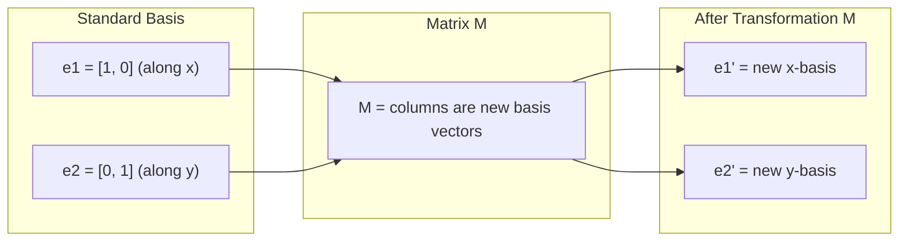
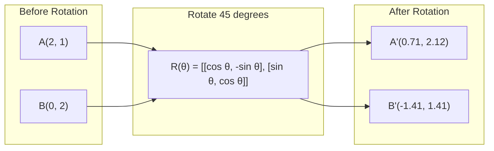
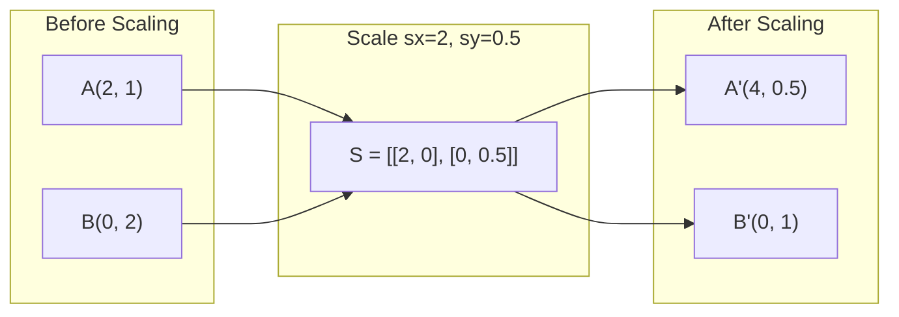
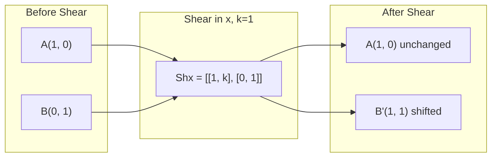
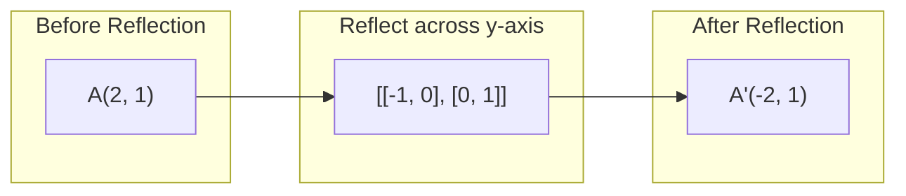
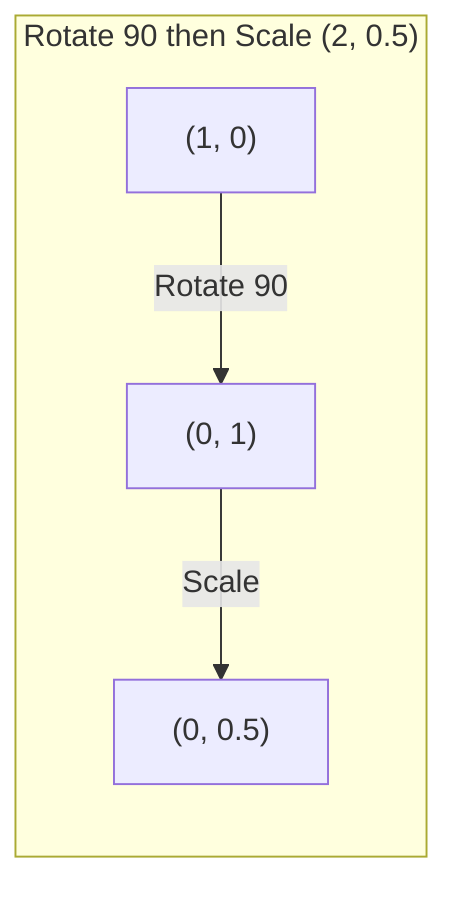
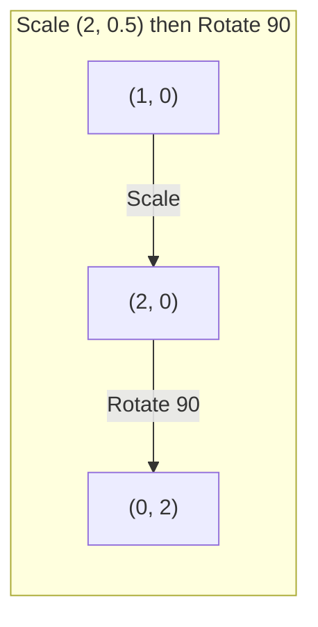

# Transformacje macierzowe

> Macierz to maszyna, która przekształca przestrzeń. Naucz się, co robi z każdym punktem, a zrozumiesz całą transformację.

**Type:** Build
**Languages:** Python, Julia
**Prerequisites:** Phase 1, Lessons 01-02 (Intuicja algebry liniowej, Wektory i operacje macierzowe)
**Time:** ~75 minutes

## Cele uczenia się

- Konstruuj macierze obrotu, skalowania, ścinania i odbicia oraz stosuj je do punktów 2D i 3D
- Składaj wiele transformacji przez mnożenie macierzy i weryfikuj, że kolejność ma znaczenie
- Obliczaj wartości własne i wektory własne macierzy 2x2 z równania charakterystycznego
- Wyjaśnij, dlaczego wartości własne determinują kierunki PCA, stabilność RNN i zachowanie spectral clustering

## Problem

Czytasz o PCA i widzisz "znajdź wektory własne macierzy kowariancji". Czytasz o stabilności modelu i widzisz "sprawdź, czy wszystkie wartości własne mają magnitude mniejszą niż 1". Czytasz o augmentacji danych i widzisz "zastosuj losowy obrót". Nic z tego nie ma sensu, dopóki nie zrozumiesz, co macierze robią geometrycznie z przestrzenią.

Macierze to nie tylko siatki liczb. To maszyny przestrzenne. Macierz obrotu obraca punkty. Macierz skalowania rozciąga je. Macierz ścinania przechyla je. Każda transformacja, którą sieć neuronowa stosuje do danych, to jedna z tych operacji lub ich kombinacja. Ta lekcja czyni te operacje konkretnymi.

## Koncepcja

### Transformacje jako macierze

Każda transformacja liniowa w 2D może być zapisana jako macierz 2x2. Macierz mówi dokładnie, gdzie lądują wektory bazowe [1, 0] i [0, 1]. Wszystko inne wynika z tego.



### Obrót

Obrót 2D o kąt theta zachowuje odległości i kąty. Każdy punkt porusza się po łuku kołowym.



W 3D obracasz wokół osi. Każda oś ma swoją macierz obrotu:

```
Rz(theta) = | cos  -sin  0 |     Obrót wokół osi z
            | sin   cos  0 |     (płaszczyzna x-y wiruje, z zostaje)
            |  0     0   1 |

Rx(theta) = | 1   0     0    |   Obrót wokół osi x
            | 0  cos  -sin   |   (płaszczyzna y-z wiruje, x zostaje)
            | 0  sin   cos   |

Ry(theta) = |  cos  0  sin |     Obrót wokół osi y
            |   0   1   0  |     (płaszczyzna x-z wiruje, y zostaje)
            | -sin  0  cos |
```

### Skalowanie

Skalowanie rozciąga lub ściska niezależnie wzdłuż każdej osi.



### Ścinanie

Ścinanie przechyla jedną oś, trzymając drugą nieruchomą. Zamienia prostokąty w równoległoboki.



Macierze ścinania:
- `Shx = [[1, k], [0, 1]]` przesuwa x o k * y
- `Shy = [[1, 0], [k, 1]]` przesuwa y o k * x

### Odbicie

Odbicie odbija punkty przez oś lub linię.



Macierze odbicia:
- Odbicie przez oś y: `[[-1, 0], [0, 1]]`
- Odbicie przez oś x: `[[1, 0], [0, -1]]`

### Kompozycja: łączenie transformacji

Zastosowanie transformacji A potem B to to samo, co pomnożenie ich macierzy: `result = B @ A @ point`. Kolejność ma znaczenie. Obrót potem skalowanie daje inne wyniki niż skalowanie potem obrót.



Złożona: `S @ R = [[0, -2], [0.5, 0]]`



Złożona: `R @ S = [[0, -0.5], [2, 0]]`

Inne wyniki. Mnożenie macierzy nie jest przemienne.

### Wartości własne i wektory własne

Większość wektorów zmienia kierunek, gdy macierz je uderzy. Wektory własne są specjalne: macierz tylko je skaluje, nigdy nie obraca. Czynnik skalowania to wartość własna.

```
A @ v = lambda * v

v to wektor własny (kierunek który przetrwa)
lambda to wartość własna (jak bardzo rozciąga)

Przykład: A = | 2  1 |
             | 1  2 |

Wektor własny [1, 1] z wartością własną 3:
  A @ [1,1] = [3, 3] = 3 * [1, 1]     (ten sam kierunek, skalowany przez 3)

Wektor własny [1, -1] z wartością własną 1:
  A @ [1,-1] = [1, -1] = 1 * [1, -1]  (ten sam kierunek, bez zmian)
```

Macierz rozciąga przestrzeń 3x wzdłuż [1, 1] i pozostawia [1, -1] bez zmian. Każdy inny kierunek to mieszanka tych dwóch.

### Dekompozycja własna

Jeśli macierz ma n liniowo niezależnych wektorów własnych, może być rozbita:

```
A = V @ D @ V^(-1)

V = macierz, której kolumny są wektorami własnymi
D = macierz diagonalna wartości własnych
V^(-1) = odwrotność V

To mówi: obróć do współrzędnych wektorów własnych, skaluj wzdłuż każdej osi, obróć z powrotem.
```

### Dlaczego wartości własne mają znaczenie

**PCA.** Wektory własne macierzy kowariancji to główne składowe. Wartości własne mówią, ile wariancji każda składowa przechwytuje. Sortuj według wartości własnej, zachowaj top k, i masz redukcję wymiaru.

**Stabilność.** W sieciach rekurencyjnych i układach dynamicznych wartości własne o magnitudzie > 1 powodują, że wyjścia eksplodują. Magnituda < 1 powoduje, że zanikają. To problem zanikających/eksplodujących gradientów w jednym zdaniu.

**Metody spektralne.** Grafowe sieci neuronowe używają wartości własnych macierzy sąsiedztwa. Spectral clustering używa wartości własnych Laplacian. Wektory własne ujawniają strukturę grafu.

### Wyznacznik jako współczynnik skalowania objętości

Wyznacznik macierzy transformacji mówi, jak bardzo skaluje pole (2D) lub objętość (3D).

```
det = 1:   pole zachowane (obrót)
det = 2:   pole podwojone
det = 0:   przestrzeń zgnieciona do niższego wymiaru (osobliwa)
det = -1:  pole zachowane ale orientacja odwrócona (odbicie)

| det(Obrót) | = 1        (zawsze)
| det(Skalowanie sx, sy) | = sx * sy
| det(Ścinanie) | = 1           (pole zachowane)
| det(Odbicie) | = -1     (orientacja odwrócona)
```

## Buduj to

### Krok 1: Macierze transformacji od zera (Python)

```python
import math

def rotation_2d(theta):
    c, s = math.cos(theta), math.sin(theta)
    return [[c, -s], [s, c]]

def scaling_2d(sx, sy):
    return [[sx, 0], [0, sy]]

def shearing_2d(kx, ky):
    return [[1, kx], [ky, 1]]

def reflection_x():
    return [[1, 0], [0, -1]]

def reflection_y():
    return [[-1, 0], [0, 1]]

def mat_vec_mul(matrix, vector):
    return [
        sum(matrix[i][j] * vector[j] for j in range(len(vector)))
        for i in range(len(matrix))
    ]

def mat_mul(a, b):
    rows_a, cols_b = len(a), len(b[0])
    cols_a = len(a[0])
    return [
        [sum(a[i][k] * b[k][j] for k in range(cols_a)) for j in range(cols_b)]
        for i in range(rows_a)
    ]

point = [1.0, 0.0]
angle = math.pi / 4

rotated = mat_vec_mul(rotation_2d(angle), point)
print(f"Rotate (1,0) by 45 deg: ({rotated[0]:.4f}, {rotated[1]:.4f})")

scaled = mat_vec_mul(scaling_2d(2, 3), [1.0, 1.0])
print(f"Scale (1,1) by (2,3): ({scaled[0]:.1f}, {scaled[1]:.1f})")

sheared = mat_vec_mul(shearing_2d(1, 0), [1.0, 1.0])
print(f"Shear (1,1) kx=1: ({sheared[0]:.1f}, {sheared[1]:.1f})")

reflected = mat_vec_mul(reflection_y(), [2.0, 1.0])
print(f"Reflect (2,1) across y: ({reflected[0]:.1f}, {reflected[1]:.1f})")
```

### Krok 2: Kompozycja transformacji

```python
R = rotation_2d(math.pi / 2)
S = scaling_2d(2, 0.5)

rotate_then_scale = mat_mul(S, R)
scale_then_rotate = mat_mul(R, S)

point = [1.0, 0.0]
result1 = mat_vec_mul(rotate_then_scale, point)
result2 = mat_vec_mul(scale_then_rotate, point)

print(f"Rotate 90 then scale: ({result1[0]:.2f}, {result1[1]:.2f})")
print(f"Scale then rotate 90: ({result2[0]:.2f}, {result2[1]:.2f})")
print(f"Same? {result1 == result2}")
```

### Krok 3: Wartości własne od zera (2x2)

Dla macierzy 2x2 `[[a, b], [c, d]]`, wartości własne rozwiązują równanie charakterystyczne: `lambda^2 - (a+d)*lambda + (ad - bc) = 0`.

```python
def eigenvalues_2x2(matrix):
    a, b = matrix[0]
    c, d = matrix[1]
    trace = a + d
    det = a * d - b * c
    discriminant = trace ** 2 - 4 * det
    if discriminant < 0:
        real = trace / 2
        imag = (-discriminant) ** 0.5 / 2
        return (complex(real, imag), complex(real, -imag))
    sqrt_disc = discriminant ** 0.5
    return ((trace + sqrt_disc) / 2, (trace - sqrt_disc) / 2)

def eigenvector_2x2(matrix, eigenvalue):
    a, b = matrix[0]
    c, d = matrix[1]
    if abs(b) > 1e-10:
        v = [b, eigenvalue - a]
    elif abs(c) > 1e-10:
        v = [eigenvalue - d, c]
    else:
        if abs(a - eigenvalue) < 1e-10:
            v = [1, 0]
        else:
            v = [0, 1]
    mag = (v[0] ** 2 + v[1] ** 2) ** 0.5
    return [v[0] / mag, v[1] / mag]

A = [[2, 1], [1, 2]]
vals = eigenvalues_2x2(A)
print(f"Matrix: {A}")
print(f"Eigenvalues: {vals[0]:.4f}, {vals[1]:.4f}")

for val in vals:
    vec = eigenvector_2x2(A, val)
    result = mat_vec_mul(A, vec)
    scaled = [val * vec[0], val * vec[1]]
    print(f"  lambda={val:.1f}, v={[round(x,4) for x in vec]}")
    print(f"    A@v = {[round(x,4) for x in result]}")
    print(f"    l*v = {[round(x,4) for x in scaled]}")
```

### Krok 4: Wyznacznik jako współczynnik skalowania objętości

```python
def det_2x2(matrix):
    return matrix[0][0] * matrix[1][1] - matrix[0][1] * matrix[1][0]

print(f"det(rotation 45) = {det_2x2(rotation_2d(math.pi/4)):.4f}")
print(f"det(scale 2,3)   = {det_2x2(scaling_2d(2, 3)):.1f}")
print(f"det(shear kx=1)  = {det_2x2(shearing_2d(1, 0)):.1f}")
print(f"det(reflect y)   = {det_2x2(reflection_y()):.1f}")

singular = [[1, 2], [2, 4]]
print(f"det(singular)     = {det_2x2(singular):.1f}")
print("Singular: columns are proportional, space collapses to a line.")
```

## Użyj tego

NumPy obsługuje to wszystko ze zoptymalizowanymi procedurami.

```python
import numpy as np

theta = np.pi / 4
R = np.array([[np.cos(theta), -np.sin(theta)],
              [np.sin(theta),  np.cos(theta)]])

point = np.array([1.0, 0.0])
print(f"Rotate (1,0) by 45 deg: {R @ point}")

S = np.diag([2.0, 3.0])
composed = S @ R
print(f"Scale(2,3) after Rotate(45): {composed @ point}")

A = np.array([[2, 1], [1, 2]], dtype=float)
eigenvalues, eigenvectors = np.linalg.eig(A)
print(f"\nEigenvalues: {eigenvalues}")
print(f"Eigenvectors (columns):\n{eigenvectors}")

for i in range(len(eigenvalues)):
    v = eigenvectors[:, i]
    lam = eigenvalues[i]
    print(f"  A @ v{i} = {A @ v}, lambda * v{i} = {lam * v}")

print(f"\ndet(R) = {np.linalg.det(R):.4f}")
print(f"det(S) = {np.linalg.det(S):.1f}")

B = np.array([[3, 1], [0, 2]], dtype=float)
vals, vecs = np.linalg.eig(B)
D = np.diag(vals)
V = vecs
reconstructed = V @ D @ np.linalg.inv(V)
print(f"\nEigendecomposition A = V @ D @ V^-1:")
print(f"Original:\n{B}")
print(f"Reconstructed:\n{reconstructed}")
```

### Obróty 3D z NumPy

```python
def rotation_3d_z(theta):
    c, s = np.cos(theta), np.sin(theta)
    return np.array([[c, -s, 0], [s, c, 0], [0, 0, 1]])

def rotation_3d_x(theta):
    c, s = np.cos(theta), np.sin(theta)
    return np.array([[1, 0, 0], [0, c, -s], [0, s, c]])

point_3d = np.array([1.0, 0.0, 0.0])
rotated_z = rotation_3d_z(np.pi / 2) @ point_3d
rotated_x = rotation_3d_x(np.pi / 2) @ point_3d

print(f"\n3D point: {point_3d}")
print(f"Rotate 90 around z: {np.round(rotated_z, 4)}")
print(f"Rotate 90 around x: {np.round(rotated_x, 4)}")
```

## Wyślij to

Ta lekcja buduje geometryczny fundament dla PCA (Faza 2) i analizy wag sieci neuronowych. Kod wartości własnych/wektorów własnych zbudowany tutaj to ten sam algorytm, który napędza redukcję wymiaru, spectral clustering i analizę stabilności w produkcyjnych systemach ML.

## Ćwiczenia

1. Zastosuj obrót, skalowanie i ścinanie do kwadratu jednostkowego (wierzchołki w [0,0], [1,0], [1,1], [0,1]). Wydrukuj przekształcone wierzchołki dla każdego. Zweryfikuj, że obrót zachowuje odległości między wierzchołkami.

2. Znajdź wartości własne macierzy [[4, 2], [1, 3]] ręcznie używając równania charakterystycznego. Następnie zweryfikuj z funkcją od zera i z NumPy.

3. Stwórz kompozycję trzech transformacji (obrót o 30 stopni, skalowanie przez [1.5, 0.8], ścinanie z kx=0.3) i zastosuj do 8 punktów ułożonych w okrąg. Wydrukuj współrzędne przed i po. Oblicz wyznacznik złożonej macierzy i zweryfikuj, że equals iloczynowi indywidualnych wyznaczników.

## Kluczowe terminy

| Termin | Co ludzie mówią | Co to faktycznie oznacza |
|------|----------------|----------------------|
| Macierz obrotu | "Obraca rzeczy" | Macierz ortogonalna, która porusza punkty po łukach kołowych, zachowując odległości i kąty. Wyznacznik zawsze 1. |
| Macierz skalowania | "Powiększa rzeczy" | Macierz diagonalna, która rozciąga lub ściska niezależnie wzdłuż każdej osi. Wyznacznik to iloczyn czynników skalowania. |
| Macierz ścinania | "Pochyla rzeczy" | Macierz, która przesuwa jedną współrzędną proporcjonalnie do drugiej, zamieniając prostokąty w równoległoboki. Wyznacznik to 1. |
| Odbicie | "Odbija rzeczy" | Macierz, która odbija przestrzeń przez oś lub płaszczyznę. Wyznacznik to -1. |
| Kompozycja | "Zrób dwa rzeczy" | Mnożenie macierzy transformacji, żeby łączyć operacje. Kolejność ma znaczenie: B @ A oznacza zastosuj A pierwsze, potem B. |
| Wektor własny | "Specjalny kierunek" | Kierunek, który macierz tylko skaluje, nigdy nie obraca. Odcisk palca transformacji. |
| Wartość własna | "Jak bardzo rozciąga" | Czynnik skalarny, przez który macierz skaluje swój wektor własny. Może być ujemny (odbicie) lub zespolony (obrót). |
| Dekompozycja własna | "Rozbij macierz na części" | Zapisywanie macierzy jako V @ D @ V^(-1), rozdzielanie na jej fundamentalne kierunki i magnitudy skalowania. |
| Wyznacznik | "Pojedyncza liczba z macierzy" | Czynnik, przez który transformacja skaluje pole (2D) lub objętość (3D). Zero oznacza, że transformacja jest nieodwracalna. |
| Równanie charakterystyczne | "Skąd pochodzą wartości własne" | det(A - lambda * I) = 0. Wielomian, którego pierwiastkami są wartości własne. |

## Dalsze czytanie

- [3Blue1Brown: Linear Transformations](https://www.3blue1brown.com/lessons/linear-transformations) -- wizualna intuicja dla tego, jak macierze przekształcają przestrzeń
- [3Blue1Brown: Eigenvectors and Eigenvalues](https://www.3blue1brown.com/lessons/eigenvalues) -- najlepsze wizualne wyjaśnienie, co wektory własne oznaczają geometrycznie
- [MIT 18.06 Lecture 21: Eigenvalues and Eigenvectors](https://ocw.mit.edu/courses/18-06-linear-algebra-spring-2010/) -- klasyczne potraktowanie Gilberta Stranga