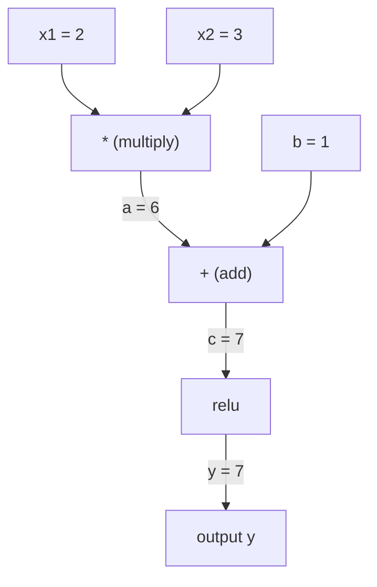
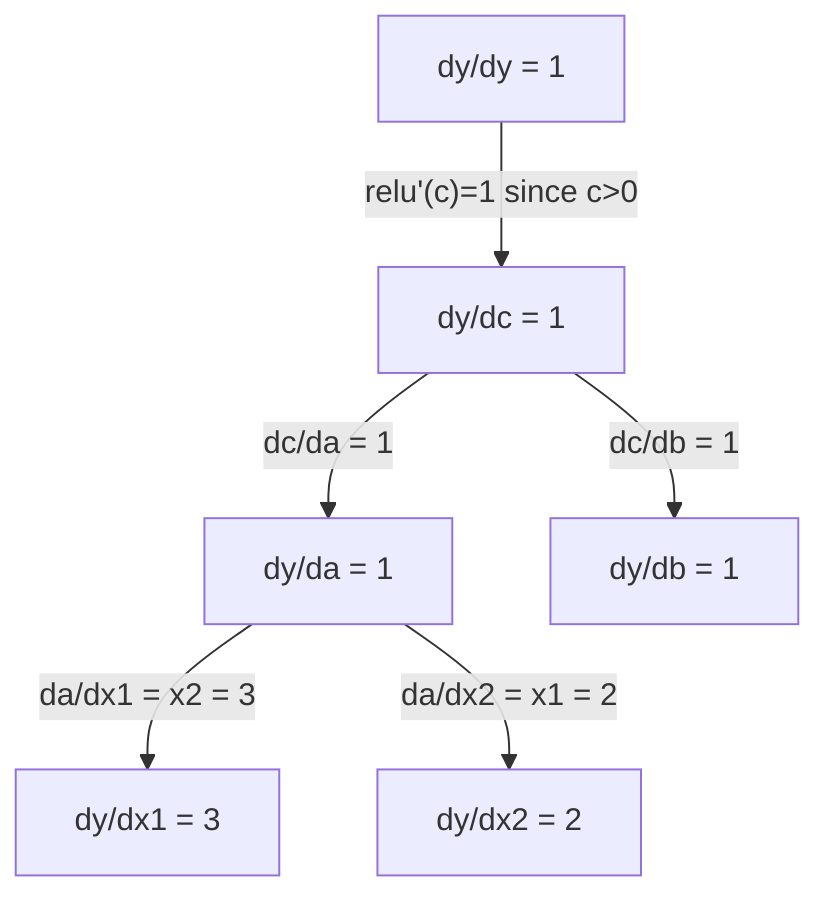

# Reguła łańcuchowa i automatyczna dyferencjacja

> Reguła łańcuchowa to silnik stojący za każdą siecią neuronową, która się uczy.

**Type:** Build
**Language:** Python
**Prerequisites:** Phase 1, Lesson 04 (Pochodne i gradienty)
**Time:** ~90 minutes

## Cele uczenia się

- Zbuduj minimalny silnik autograd (klasa Value) który rejestruje operacje i oblicza gradienty przez reverse-mode autodiff
- Implementuj forward i backward pass przez graf obliczeniowy używając sortowania topologicznego
- Skonstruuj i trenuj multi-layer perceptron na XOR używając tylko silnika autograd od zera
- Zweryfikuj poprawność autodiff używając gradient checking przeciwko numerycznym różnicom skończonym

## Problem

Możesz obliczać pochodne prostych funkcji. Ale sieć neuronowa to nie prosta funkcja. To setki funkcji złożonych razem: mnożenie macierzy, dodawanie biasu, applyowanie aktywacji, mnożenie macierzy again, softmax, cross-entropy loss. Wyjście to funkcja funkcji funkcji.

Żeby trenować sieć, potrzebujesz gradientu straty względem każdej pojedynczej wagi. Robienie tego ręcznie jest niemożliwe dla milionów parametrów. Robienie tego numerycznie (różnice skończone) jest za wolne.

Reguła łańcuchowa daje ci matematykę. Automatyczna dyferencjacja daje ci algorytm. Razem pozwalają obliczać dokładne gradienty przez dowolne kompozycje funkcji w czasie proporcjonalnym do pojedynczego forward passa.

Tak działają PyTorch, TensorFlow i JAX. Zbudujesz miniaturową wersję od zera.

## Koncepcja

### Reguła łańcuchowa

Jeśli `y = f(g(x))`, pochodna `y` względem `x` to:

```
dy/dx = dy/dg * dg/dx = f'(g(x)) * g'(x)
```

Pomnóż pochodne wzdłuż łańcucha. Każde ogniwo przyczynia się swoją lokalną pochodną.

Przykład: `y = sin(x^2)`

```
g(x) = x^2       g'(x) = 2x
f(g) = sin(g)     f'(g) = cos(g)

dy/dx = cos(x^2) * 2x
```

Dla głębszych kompozycji, łańcuch się wydłuża:

```
y = f(g(h(x)))

dy/dx = f'(g(h(x))) * g'(h(x)) * h'(x)
```

Każda warstwa w sieci neuronowej to jedno ogniwo w tym łańcuchu.

### Grafy obliczeniowe

Graf obliczeniowy czyni regułę łańcuchową wizualną. Każda operacja staje się węzłem. Dane przepływają forward przez graf. Gradienty przepływają backward.

**Forward pass (oblicz wartości):**



**Backward pass (oblicz gradienty):**



Backward pass stosuje regułę łańcuchową w każdym węźle, propagując gradienty od wyjścia do wejść.

### Forward mode vs Reverse mode

Istnieją dwa sposoby stosowania reguły łańcuchowej przez graf.

**Forward mode** zaczyna od wejść i pcha pochodne forward. Oblicza `dx/dx = 1` i propaguje przez każdą operację. Dobry, gdy masz mało wejść i wiele wyjść.

```
Forward mode: seed dx/dx = 1, propagate forward

  x = 2       (dx/dx = 1)
  a = x^2     (da/dx = 2x = 4)
  y = sin(a)  (dy/dx = cos(a) * da/dx = cos(4) * 4 = -2.615)
```

**Reverse mode** zaczyna od wyjścia i ciągnie gradienty wstecz. Oblicza `dy/dy = 1` i propaguje przez każdą operację w odwrotnej kolejności. Dobry, gdy masz wiele wejść i mało wyjść.

```
Reverse mode: seed dy/dy = 1, propagate backward

  y = sin(a)  (dy/dy = 1)
  a = x^2     (dy/da = cos(a) = cos(4) = -0.654)
  x = 2       (dy/dx = dy/da * da/dx = -0.654 * 4 = -2.615)
```

Sieci neuronowe mają miliony wejść (wag) i jedno wyjście (strata). Reverse mode oblicza wszystkie gradienty w jednym backward pass. Dlatego backpropagation używa reverse mode.

| Tryb | Seed | Kierunek | Najlepszy gdy |
|------|------|-----------|-----------|
| Forward | `dx_i/dx_i = 1` | Wejście do wyjścia | Mało wejść, wiele wyjść |
| Reverse | `dy/dy = 1` | Wyjście do wejścia | Wiele wejść, mało wyjść (sieci neuronowe) |

### Liczby dualne dla forward mode

Forward mode może być elegancko zaimplementowany z liczbami dualnymi. Liczba dualna ma formę `a + b*epsilon` gdzie `epsilon^2 = 0`.

```
Liczba dualna: (value, derivative)

(2, 1) oznacza: wartość to 2, pochodna względem x to 1

Reguły arytmetyczne:
  (a, a') + (b, b') = (a+b, a'+b')
  (a, a') * (b, b') = (a*b, a'*b + a*b')
  sin(a, a')         = (sin(a), cos(a)*a')
```

Zasiej zmienną wejściową z pochodną 1. Pochodna automatycznie propaguje przez każdą operację.

### Budowanie silnika Autograd

Silnik autograd potrzebuje trzech rzeczy:

1. **Owinięcie wartości.** Owiń każdą liczbę w obiekt przechowujący jej wartość i gradient.
2. **Rejestracja grafu.** Każda operacja rejestruje swoje wejścia i lokalną funkcję gradientu.
3. **Backward pass.** Sortuj topologicznie graf, potem chodź wstecz, stosując regułę łańcuchową w każdym węźle.

To jest dokładnie to, co robi `autograd` PyTorch. Klasa `torch.Tensor` owija wartości, rejestruje operacje gdy `requires_grad=True`, i oblicza gradienty gdy wywołujesz `.backward()`.

### Jak działa autograd PyTorch pod maską

Gdy piszesz kod PyTorch:

```python
x = torch.tensor(2.0, requires_grad=True)
y = x ** 2 + 3 * x + 1
y.backward()
print(x.grad)  # 7.0 = 2*x + 3 = 2*2 + 3
```

PyTorch wewnętrznie:

1. Tworzy węzeł `Tensor` dla `x` z `requires_grad=True`
2. Każda operacja (`**`, `*`, `+`) tworzy nowy węzeł i rejestruje funkcję backward
3. `y.backward()` triggeruje reverse-mode autodiff przez zarejestrowany graf
4. Każda funkcja `grad_fn` oblicza lokalne gradienty i przekazuje je do węzłów nadrzędnych
5. Gradienty akumulują się w atrybutach `.grad` przez dodawanie (nie zastępowanie)

Graf jest dynamiczny (define-by-run). Nowy graf jest budowany przy każdym forward pass. Dlatego PyTorch wspiera control flow (if/else, pętle) wewnątrz modeli.

## Buduj to

### Krok 1: Klasa Value

```python
class Value:
    def __init__(self, data, children=(), op=''):
        self.data = data
        self.grad = 0.0
        self._backward = lambda: None
        self._prev = set(children)
        self._op = op

    def __repr__(self):
        return f"Value(data={self.data:.4f}, grad={self.grad:.4f})"
```

Każdy `Value` przechowuje swoje dane numeryczne, swój gradient (początkowo zero), funkcję backward i wskaźniki do węzłów potomnych, które go wyprodukowały.

### Krok 2: Operacje arytmetyczne ze śledzeniem gradientów

```python
    def __add__(self, other):
        other = other if isinstance(other, Value) else Value(other)
        out = Value(self.data + other.data, (self, other), '+')
        def _backward():
            self.grad += out.grad
            other.grad += out.grad
        out._backward = _backward
        return out

    def __mul__(self, other):
        other = other if isinstance(other, Value) else Value(other)
        out = Value(self.data * other.data, (self, other), '*')
        def _backward():
            self.grad += other.data * out.grad
            other.grad += self.data * out.grad
        out._backward = _backward
        return out

    def relu(self):
        out = Value(max(0, self.data), (self,), 'relu')
        def _backward():
            self.grad += (1.0 if out.data > 0 else 0.0) * out.grad
        out._backward = _backward
        return out
```

Każda operacja tworzy closure, który wie, jak obliczyć lokalne gradienty i pomnożyć przez upstream gradient (`out.grad`). `+=` obsługuje przypadek, gdy wartość jest używana w wielu operacjach.

### Krok 3: Backward pass

```python
    def backward(self):
        topo = []
        visited = set()
        def build_topo(v):
            if v not in visited:
                visited.add(v)
                for child in v._prev:
                    build_topo(child)
                topo.append(v)
        build_topo(self)

        self.grad = 1.0
        for v in reversed(topo):
            v._backward()
```

Sortowanie topologiczne zapewnia, że gradient każdego węzła jest w pełni obliczony przed propagacją do jego dzieci. Seed gradient to 1.0 (dy/dy = 1).

### Krok 4: Więcej operacji dla kompletnego silnika

Podstawowa klasa Value obsługuje dodawanie, mnożenie i relu. Prawdziwy silnik autograd potrzebuje więcej. Oto operacje, których potrzebujesz do budowania sieci neuronowych:

```python
    def __neg__(self):
        return self * -1

    def __sub__(self, other):
        return self + (-other)

    def __radd__(self, other):
        return self + other

    def __rmul__(self, other):
        return self * other

    def __rsub__(self, other):
        return other + (-self)

    def __pow__(self, n):
        out = Value(self.data ** n, (self,), f'**{n}')
        def _backward():
            self.grad += n * (self.data ** (n - 1)) * out.grad
        out._backward = _backward
        return out

    def __truediv__(self, other):
        return self * (other ** -1) if isinstance(other, Value) else self * (Value(other) ** -1)

    def exp(self):
        import math
        e = math.exp(self.data)
        out = Value(e, (self,), 'exp')
        def _backward():
            self.grad += e * out.grad
        out._backward = _backward
        return out

    def log(self):
        import math
        out = Value(math.log(self.data), (self,), 'log')
        def _backward():
            self.grad += (1.0 / self.data) * out.grad
        out._backward = _backward
        return out

    def tanh(self):
        import math
        t = math.tanh(self.data)
        out = Value(t, (self,), 'tanh')
        def _backward():
            self.grad += (1 - t ** 2) * out.grad
        out._backward = _backward
        return out
```

**Dlaczego każda operacja ma znaczenie:**

| Operacja | Reguła backward | Używana w |
|-----------|--------------|---------|
| `__sub__` | Używa ponownie add + neg | Obliczanie straty (pred - target) |
| `__pow__` | n * x^(n-1) | Wielomianowe aktywacje, MSE (error^2) |
| `__truediv__` | Używa ponownie mul + pow(-1) | Normalizacja, skalowanie learning rate |
| `exp` | exp(x) * upstream | Softmax, log-likelihood |
| `log` | (1/x) * upstream | Funkcja straty cross-entropy, log-probabilities |
| `tanh` | (1 - tanh^2) * upstream | Klasyczna funkcja aktywacji |

Sprytna część: `__sub__` i `__truediv__` są zdefiniowane w terminach istniejących operacji. Dostają poprawne gradienty za darmo, bo reguła łańcuchowa komponuje przez podstawowe operacje add/mul/pow.

### Krok 5: Mini MLP od zera

Z kompletną klasą Value możesz zbudować sieć neuronową. Bez PyTorch. Bez NumPy. Tylko Values i reguła łańcuchowa.

```python
import random

class Neuron:
    def __init__(self, n_inputs):
        self.w = [Value(random.uniform(-1, 1)) for _ in range(n_inputs)]
        self.b = Value(0.0)

    def __call__(self, x):
        act = sum((wi * xi for wi, xi in zip(self.w, x)), self.b)
        return act.tanh()

    def parameters(self):
        return self.w + [self.b]

class Layer:
    def __init__(self, n_inputs, n_outputs):
        self.neurons = [Neuron(n_inputs) for _ in range(n_outputs)]

    def __call__(self, x):
        return [n(x) for n in self.neurons]

    def parameters(self):
        return [p for n in self.neurons for p in n.parameters()]

class MLP:
    def __init__(self, sizes):
        self.layers = [Layer(sizes[i], sizes[i+1]) for i in range(len(sizes)-1)]

    def __call__(self, x):
        for layer in self.layers:
            x = layer(x)
        return x[0] if len(x) == 1 else x

    def parameters(self):
        return [p for layer in self.layers for p in layer.parameters()]
```

`Neuron` oblicza `tanh(w1*x1 + w2*x2 + ... + b)`. `Layer` to lista neuronów. `MLP` stackuje warstwy. Każda waga to `Value`, więc wywołanie `loss.backward()` propaguje gradienty do każdego parametru.

**Trenowanie na XOR:**

```python
random.seed(42)
model = MLP([2, 4, 1])  # 2 wejścia, 4 ukryte neurony, 1 wyjście

xs = [[0, 0], [0, 1], [1, 0], [1, 1]]
ys = [-1, 1, 1, -1]  # wzorzec XOR (używając -1/1 dla tanh)

for step in range(100):
    preds = [model(x) for x in xs]
    loss = sum((p - y) ** 2 for p, y in zip(preds, ys))

    for p in model.parameters():
        p.grad = 0.0
    loss.backward()

    lr = 0.05
    for p in model.parameters():
        p.data -= lr * p.grad

    if step % 20 == 0:
        print(f"step {step:3d}  loss = {loss.data:.4f}")

print("\nPredictions after training:")
for x, y in zip(xs, ys):
    print(f"  input={x}  target={y:2d}  pred={model(x).data:6.3f}")
```

To jest micrograd. Kompletna pętla trenowania sieci neuronowej w czystym Pythonie z automatyczną dyferencjacją. Każdy komercyjny framework deep learning robi to samo na masową skalę.

### Krok 6: Gradient checking

Skąd wiesz, że twój autodiff jest poprawny? Porównaj z pochodnymi numerycznymi. To gradient checking.

```python
def gradient_check(build_expr, x_val, h=1e-7):
    x = Value(x_val)
    y = build_expr(x)
    y.backward()
    autodiff_grad = x.grad

    y_plus = build_expr(Value(x_val + h)).data
    y_minus = build_expr(Value(x_val - h)).data
    numerical_grad = (y_plus - y_minus) / (2 * h)

    diff = abs(autodiff_grad - numerical_grad)
    return autodiff_grad, numerical_grad, diff
```

Przetestuj to na złożonym wyrażeniu:

```python
def expr(x):
    return (x ** 3 + x * 2 + 1).tanh()

ad, num, diff = gradient_check(expr, 0.5)
print(f"Autodiff:  {ad:.8f}")
print(f"Numerical: {num:.8f}")
print(f"Difference: {diff:.2e}")
# Różnica powinna być < 1e-5
```

Gradient checking jest niezbędny przy implementacji nowych operacji. Jeśli twój backward pass ma błąd, numeryczny check to złapie. Każda poważna implementacja deep learning uruchamia gradient checks podczas developmentu.

**Kiedy używać gradient checking:**

| Sytuacja | Robić gradient check? |
|-----------|-------------------|
| Dodawanie nowej operacji do autograd | Tak, zawsze |
| Debugowanie pętli trenowania która nie zbiega | Tak, najpierw sprawdź gradienty |
| Produkcyjne trenowanie | Nie, za wolne (2x forward passes per parametr) |
| Testy jednostkowe dla kodu autograd | Tak, zautomatyzuj to |

### Krok 7: Weryfikacja przeciwko ręcznym obliczeniom

```python
x1 = Value(2.0)
x2 = Value(3.0)
a = x1 * x2          # a = 6.0
b = a + Value(1.0)    # b = 7.0
y = b.relu()          # y = 7.0

y.backward()

print(f"y = {y.data}")          # 7.0
print(f"dy/dx1 = {x1.grad}")   # 3.0 (= x2)
print(f"dy/dx2 = {x2.grad}")   # 2.0 (= x1)
```

Ręczna weryfikacja: `y = relu(x1*x2 + 1)`. Ponieważ `x1*x2 + 1 = 7 > 0`, relu to identity.
`dy/dx1 = x2 = 3`. `dy/dx2 = x1 = 2`. Silnik się zgadza.

## Użyj tego

### Zweryfikuj przeciwko PyTorch

```python
import torch

x1 = torch.tensor(2.0, requires_grad=True)
x2 = torch.tensor(3.0, requires_grad=True)
a = x1 * x2
b = a + 1.0
y = torch.relu(b)
y.backward()

print(f"PyTorch dy/dx1 = {x1.grad.item()}")  # 3.0
print(f"PyTorch dy/dx2 = {x2.grad.item()}")  # 2.0
```

Te same gradienty. Twój silnik oblicza ten sam wynik co PyTorch, bo matematyka jest ta sama: reverse-mode autodiff przez regułę łańcuchową.

### Bardziej złożone wyrażenie

```python
a = Value(2.0)
b = Value(-3.0)
c = Value(10.0)
f = (a * b + c).relu()  # relu(2*(-3) + 10) = relu(4) = 4

f.backward()
print(f"df/da = {a.grad}")  # -3.0 (= b)
print(f"df/db = {b.grad}")  #  2.0 (= a)
print(f"df/dc = {c.grad}")  #  1.0
```

## Wyślij to

Ta lekcja tworzy:
- `outputs/skill-autodiff.md` -- skill do budowania i debugowania systemów autograd
- `code/autodiff.py` -- minimalny silnik autograd, który możesz rozszerzać

Klasa Value zbudowana tutaj to fundament dla pętli trenowania sieci neuronowej w Fazie 3.

## Ćwiczenia

1. Dodaj `__pow__` do klasy Value, żebyś mógł obliczać `x ** n`. Zweryfikuj, że `d/dx(x^3)` przy `x=2` equals `12.0`.

2. Dodaj `tanh` jako funkcję aktywacji. Zweryfikuj, że `tanh'(0) = 1` i `tanh'(2) = 0.0707` (approx).

3. Zbuduj graf obliczeniowy dla pojedynczego neuronu: `y = relu(w1*x1 + w2*x2 + b)`. Oblicz wszystkie pięć gradientów i zweryfikuj przeciwko PyTorch.

4. Zaimplementuj forward-mode autodiff używając liczb dualnych. Stwórz klasę `Dual` i zweryfikuj, że daje te same pochodne co twój silnik reverse-mode.

## Kluczowe terminy

| Termin | Co ludzie mówią | Co to faktycznie oznacza |
|------|----------------|----------------------|
| Reguła łańcuchowa | "Pomnóż pochodne" | Pochodna złożonych funkcji równa się iloczynowi pochodnych każdej funkcji, ewaluowanych w prawidłowym punkcie |
| Graf obliczeniowy | "Diagram sieci" | Skierowany graf acykliczny, gdzie węzły to operacje, a krawędzie niosą wartości (forward) lub gradienty (backward) |
| Forward mode | "Pcha pochodne forward" | Autodiff który propaguje pochodne od wejść do wyjść. Jeden pass per zmienna wejściowa. |
| Reverse mode | "Backpropagation" | Autodiff który propaguje gradienty od wyjść do wejść. Jeden pass per zmienna wyjściowa. |
| Autograd | "Automatyczne gradienty" | System który rejestruje operacje na wartościach, buduje graf i oblicza dokładne gradienty przez regułę łańcuchową |
| Liczby dualne | "Wartość plus pochodna" | Liczby postaci a + b*epsilon (epsilon^2 = 0) które niosą informację o pochodnej przez arytmetykę |
| Sortowanie topologiczne | "Kolejność zależności" | Porządkowanie węzłów grafu tak, żeby każdy węzeł był po wszystkich swoich zależnościach. Wymagane dla poprawnej propagacji gradientów. |
| Akumulacja gradientu | "Dodawaj, nie zastępuj" | Gdy wartość wchodzi do wielu operacji, jej gradient to suma wszystkich przychodzących wkładów gradientowych |
| Dynamiczny graf | "Define by run" | Graf obliczeniowy odbudowany przy każdym forward pass, pozwalający na Python control flow wewnątrz modeli (styl PyTorch) |
| Gradient checking | "Weryfikacja numeryczna" | Porównywanie gradientów autodiff z numerycznymi gradientami różnic skończonych dla weryfikacji poprawności. Niezbędne dla debugowania. |
| MLP | "Multi-layer perceptron" | Sieć neuronowa z jedną lub więcej ukrytymi warstwami neuronów. Każdy neuron oblicza sumę ważoną plus bias, potem applyuje funkcję aktywacji. |
| Neuron | "Suma ważona + aktywacja" | Podstawowa jednostka: output = activation(w1*x1 + w2*x2 + ... + b). Wagi i bias to parametry learnable. |

## Dalsze czytanie

- [3Blue1Brown: Backpropagation calculus](https://www.youtube.com/watch?v=tIeHLnjs5U8) -- wizualne wyjaśnienie reguły łańcuchowej w sieciach neuronowych
- [PyTorch Autograd mechanics](https://pytorch.org/docs/stable/notes/autograd.html) -- jak działa prawdziwy system
- [Baydin et al., Automatic Differentiation in Machine Learning: a Survey](https://arxiv.org/abs/1502.05767) -- kompleksowe odniesienie