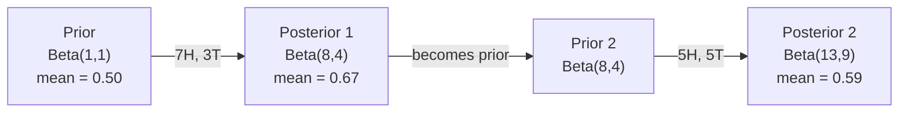

# Twierdzenie Bayesa

> Prawdopodobieństwo dotyczy tego, czego oczekujesz. Twierdzenie Bayesa dotyczy tego, czego się uczysz.

**Typ:** Build
**Język:** Python
**Wymagania wstępne:** Phase 1, Lesson 06 (Podstawy Prawdopodobieństwa)
**Czas:** ~75 minut

## Cele uczenia się

- Zastosować twierdzenie Bayesa do obliczania prawdopodobieństw posterior z priors, likelihoods i evidence
- Zbudować od zera klasyfikator tekstowy Naive Bayes z wygładzaniem Laplace'a i obliczeniami w przestrzeni logarytmicznej
- Porównać estymację MLE i MAP oraz wyjaśnić, jak MAP odpowiada regularyzacji L2
- Zaimplementować sekwencyjną aktualizację bayesowską przy użyciu sprzężonych priorów Beta-Binomial do testowania A/B

## Problem

Test medyczny ma dokładność 99%. Otrzymujesz wynik pozytywny. Jakie są szanse, że naprawdę masz chorobę?

Większość ludzi mówi 99%. Prawdziwa odpowiedź zależy od tego, jak rzadka jest choroba. Jeśli 1 na 10 000 osób ją ma, pozytywny wynik daje ci tylko około 1% szans na chorobę. Pozostałe 99% pozytywnych wyników to fałszywe alarmy od zdrowych ludzi.

To nie jest podchwytliwe pytanie. To twierdzenie Bayesa. Każdy filtr spamu, każda diagnoza medyczna, każdy model uczenia maszynowego, który kwantyfikuje niepewność, używa dokładnie tego rozumowania. Zaczynasz od przekonania. Widzisz dowód. Aktualizujesz.

Jeśli budujesz systemy ML bez zrozumienia tego, będziesz błędnie interpretować wyniki modeli, ustawiać złe progi i wysyłać zbyt pewne prognozy.

## Koncepcja

### Od prawdopodobieństwa łącznego do Bayesa

Wiesz już z Lesson 06, że prawdopodobieństwo warunkowe to:

```
P(A|B) = P(A and B) / P(B)
```

I symetrycznie:

```
P(B|A) = P(A and B) / P(A)
```

Oba wyrażenia mają ten sam licznik: P(A and B). Przyrównaj je i przekształć:

```
P(A and B) = P(A|B) * P(B) = P(B|A) * P(A)

Dlatego:

P(A|B) = P(B|A) * P(A) / P(B)
```

To jest twierdzenie Bayesa. Cztery wielkości, jedno równanie.

### Cztery części

| Część | Nazwa | Co to oznacza |
|------|------|--------------------|
| P(A|B) | Posterior | Twoja zaktualizowana wiedza o A po zobaczeniu dowodu B. |
| P(B|A) | Likelihood | Jak prawdopodobny jest dowód B, jeśli A jest prawdziwe |
| P(A) | Prior | Twoja wiedza o A przed zobaczeniem jakichkolwiek dowodów |
| P(B) | Evidence | Całkowite prawdopodobieństwo zobaczenia B przy wszystkich możliwościach |

Termin evidence P(B) działa jako normalizator. Możesz go rozwinąć używając prawa całkowitego prawdopodobieństwa:

```
P(B) = P(B|A) * P(A) + P(B|not A) * P(not A)
```

### Przykład testu medycznego

Choroba dotyka 1 na 10 000 osób. Test ma dokładność 99% (wykrywa 99% chorych, daje fałszywe pozytywy w 1% przypadków).

```
P(sick)          = 0.0001     (prior: choroba jest rzadka)
P(positive|sick) = 0.99       (likelihood: test ją wykrywa)
P(positive|healthy) = 0.01    (współczynnik fałszywych pozytywów)

P(positive) = P(positive|sick) * P(sick) + P(positive|healthy) * P(healthy)
            = 0.99 * 0.0001 + 0.01 * 0.9999
            = 0.000099 + 0.009999
            = 0.010098

P(sick|positive) = P(positive|sick) * P(sick) / P(positive)
                 = 0.99 * 0.0001 / 0.010098
                 = 0.0098
                 = 0.98%
```

Mniej niż 1%. Prior dominuje. Gdy stan jest rzadki, nawet dokładne testy produkują głównie fałszywe pozytywy. Dlatego lekarze zlecają testy potwierdzające.

### Przykład filtra spamu

Czy to spam? Otrzymujesz e-mail zawierający słowo "lottery". Czy to spam?

```
P(spam)                = 0.3      (30% e-maili to spam)
P("lottery"|spam)      = 0.05     (5% spam e-maili zawiera "lottery")
P("lottery"|not spam)  = 0.001    (0.1% legalnych e-maili zawiera "lottery")

P("lottery") = 0.05 * 0.3 + 0.001 * 0.7
             = 0.015 + 0.0007
             = 0.0157

P(spam|"lottery") = 0.05 * 0.3 / 0.0157
                  = 0.955
                  = 95.5%
```

Jedno słowo przesuwa prawdopodobieństwo z 30% do 95.5%. Prawdziwy filtr spamu stosuje Bayesa jednocześnie do setek słów.

### Naive Bayes: założenie niezależności

Naive Bayes rozszerza to na wiele cech zakładając, że wszystkie cechy są warunkowo niezależne przy danej klasie:

```
P(class | feature_1, feature_2, ..., feature_n)
  = P(class) * P(feature_1|class) * P(feature_2|class) * ... * P(feature_n|class)
    / P(feature_1, feature_2, ..., feature_n)
```

"Cząstkowa" (naive) część to założenie niezależności. W tekście wystąpienia słów nie są niezależne przy danej klasie ("New" i "York" są skorelowane). Ale założenie działa zaskakująco dobrze w praktyce, ponieważ klasyfikator musi tylko klasyfikować klasy, a nie produkować **skalibrowane** prawdopodobieństwa.

Ponieważ mianownik jest taki sam dla wszystkich klas, możesz go pominąć i porównywać tylko liczniki:

```
score(class) = P(class) * iloczyn P(feature_i | class)
```

Wybierz klasę z najwyższym wynikiem.

### Maximum Likelihood Estimation (MLE)

Skąd wziąć P(feature|class) z danych treningowych? Policz.

```
P("free"|spam) = (liczba spam e-maili zawierających "free") / (wszystkie spam e-maile)
```

To jest MLE: wybierz wartości parametrów, które czynią obserwowane dane najbardziej prawdopodobnymi. Maksymalizujesz funkcję likelihood, która dla dyskretnych zliczeń redukuje się do częstości względnej.

Problem: jeśli słowo nigdy nie pojawi się w spamie podczas treningu, MLE daje mu prawdopodobieństwo zero. Jedno nieznane słowo zabija cały iloczyn. Napraw to wygładzaniem Laplace'a:

```
P(word|class) = (count(word, class) + 1) / (total_words_in_class + vocabulary_size)
```

Dodanie 1 do każdego zliczenia zapewnia, że żadne prawdopodobieństwo nie będzie nigdy zero.

### Maximum A Posteriori (MAP)

MLE pyta: jakie parametry maksymalizują P(data|parameters)?

MAP pyta: jakie parametry maksymalizują P(parameters|data)?

Z twierdzenia Bayesa:

```
P(parameters|data) proportional to P(data|parameters) * P(parameters)
```

MAP dodaje prior nad parametrami. Jeśli wierzysz, że parametry powinny być małe, kodujesz to jako prior, który kara za duże wartości. Jest to identyczne z regularyzacją L2 w ML.

| Estymacja | Optymalizuje | Odpowiednik ML |
|------------|-----------|---------------|
| MLE | P(data|params) | Netrening bez regularyzacji |
| MAP | P(data|params) * P(params) | Regularyzacja L2 / L1 |

### Podejście bayesowskie vs. częstościowe: praktyczna różnica

Częstościowcy traktują parametry jako ustalone nieznane. Pytają: gdybyś powtórzył ten eksperyment wiele razy, co by się stało?

Bayesianie traktują parametry jako rozkłady. Pytają: "Biorąc pod uwagę to, co zaobserwowałem, co wierzę o parametrach?"

Praktyczna różnica dla budowania systemów ML:

| Aspekt | Częstościowy | Bayesowski |
|--------|-------------|-------------|
| Wynik | Pojedyncza estymacja | Rozkład nad wartościami |
| Niepewność | Przedziały ufności (o procedurze) | Przedziały wiarygodne (o parametrze) |
| Małe dane | Może przeuczać | Prior działa jak regularyzacja |
| Obliczenia | Zwykle szybsze | Często wymaga próbkowania (MCMC) |

Większość produkcyjnego ML jest częstościowa (SGD, pojedyncze estymacje). Metody bayesowskie błyszczą, gdy potrzebujesz **skalibrowanej** niepewności (decyzje medyczne, systemy krytyczne dla bezpieczeństwa) lub gdy danych jest mało (few-shot learning, cold start).

### Dlaczego myślenie bayesowskie ma znaczenie dla ML

Powiązanie jest głębsze niż analogia:

**Prior to regularyzacja.** Prior Gaussowski na wagach to regularyzacja L2. Prior Laplace'a to L1. Za każdym razem, gdy dodajesz termin regularyzacyjny, składasz bayesowskie oświadczenie o tym, jakich wartości parametrów oczekujesz.

**Posterior to niepewność.** Pojedyncze przewidywane prawdopodobieństwo nie mówi ci nic o tym, jak pewny jest model tej estymacji. Metody bayesowskie dają ci rozkład: "Myślę, że P(spam) jest między 0.8 a 0.95."

**Aktualizacje Bayesa to online learning.** Dzisiejszy posterior staje się jutrzejszym priorem. Gdy twój model widzi nowe dane, aktualizuje swoje przekonania inkrementalnie zamiast uczyć od zera.

**Porównywanie modeli jest bayesowskie.** Kryterium informacyjne Bayesa (BIC), marginal likelihood i czynniki Bayesa wszystkie używają rozumowania bayesowskiego do wybierania między modelami bez przeuczania.

## Zbuduj to

### Krok 1: Funkcja twierdzenia Bayesa

```python
def bayes(prior, likelihood, false_positive_rate):
    evidence = likelihood * prior + false_positive_rate * (1 - prior)
    posterior = likelihood * prior / evidence
    return posterior

result = bayes(prior=0.0001, likelihood=0.99, false_positive_rate=0.01)
print(f"P(sick|positive) = {result:.4f}")
```

### Krok 2: Klasyfikator Naive Bayes

```python
import math
from collections import defaultdict

class NaiveBayes:
    def __init__(self, smoothing=1.0):
        self.smoothing = smoothing
        self.class_counts = defaultdict(int)
        self.word_counts = defaultdict(lambda: defaultdict(int))
        self.class_word_totals = defaultdict(int)
        self.vocab = set()

    def train(self, documents, labels):
        for doc, label in zip(documents, labels):
            self.class_counts[label] += 1
            words = doc.lower().split()
            for word in words:
                self.word_counts[label][word] += 1
                self.class_word_totals[label] += 1
                self.vocab.add(word)

    def predict(self, document):
        words = document.lower().split()
        total_docs = sum(self.class_counts.values())
        vocab_size = len(self.vocab)
        best_class = None
        best_score = float("-inf")
        for cls in self.class_counts:
            score = math.log(self.class_counts[cls] / total_docs)
            for word in words:
                count = self.word_counts[cls].get(word, 0)
                total = self.class_word_totals[cls]
                score += math.log((count + self.smoothing) / (total + self.smoothing * vocab_size))
            if score > best_score:
                best_score = score
                best_class = cls
        return best_class
```

Logarytmy prawdopodobieństw zapobiegają underflow. Mnożenie wielu małych prawdopodobieństw produkuje liczby zbyt małe dla floating point. Sumowanie logarytmów prawdopodobieństw jest numerycznie stabilne i matematycznie równoważne.

### Krok 3: Trenuj na danych spam

```python
train_docs = [
    "win free money now",
    "free lottery ticket winner",
    "claim your prize today free",
    "urgent offer free cash",
    "congratulations you won free",
    "meeting tomorrow at noon",
    "project update attached",
    "can we schedule a call",
    "quarterly report review",
    "lunch on thursday sounds good",
    "team standup notes attached",
    "please review the pull request",
]

train_labels = [
    "spam", "spam", "spam", "spam", "spam",
    "ham", "ham", "ham", "ham", "ham", "ham", "ham",
]

classifier = NaiveBayes()
classifier.train(train_docs, train_labels)

test_messages = [
    "free money waiting for you",
    "meeting rescheduled to friday",
    "you won a free prize",
    "please review the attached report",
]

for msg in test_messages:
    print(f"  '{msg}' -> {classifier.predict(msg)}")
```

### Krok 4: Sprawdź nauczone prawdopodobieństwa

```python
def show_top_words(classifier, cls, n=5):
    vocab_size = len(classifier.vocab)
    total = classifier.class_word_totals[cls]
    probs = {}
    for word in classifier.vocab:
        count = classifier.word_counts[cls].get(word, 0)
        probs[word] = (count + classifier.smoothing) / (total + classifier.smoothing * vocab_size)
    sorted_words = sorted(probs.items(), key=lambda x: x[1], reverse=True)
    for word, prob in sorted_words[:n]:
        print(f"    {word}: {prob:.4f}")

print("\nTop spam words:")
show_top_words(classifier, "spam")
print("\nTop ham words:")
show_top_words(classifier, "ham")
```

## Użyj tego

Scikit-learn dostarcza produkcyjne implementacje naive Bayes:

```python
from sklearn.feature_extraction.text import CountVectorizer
from sklearn.naive_bayes import MultinomialNB
from sklearn.metrics import classification_report

vectorizer = CountVectorizer()
X_train = vectorizer.fit_transform(train_docs)
clf = MultinomialNB()
clf.fit(X_train, train_labels)

X_test = vectorizer.transform(test_messages)
predictions = clf.predict(X_test)
for msg, pred in zip(test_messages, predictions):
    print(f"  '{msg}' -> {pred}")
```

Ten sam algorytm. CountVectorizer zajmuje się tokenizacją i budowaniem słownika. MultinomialNB zajmuje się wygładzaniem i logarytmami prawdopodobieństw wewnętrznie. Twoja wersja od zera robi to samo w 40 liniach.

## Wdroż to

Klasa NaiveBayes zbudowana tutaj demonstruje pełny pipeline: tokenizację, estymację prawdopodobieństw z wygładzaniem Laplace'a, predykcję w przestrzeni logarytmicznej. Kod w `code/bayes.py` działa end-to-end bez zależności poza standardową biblioteką Pythona.

### Sprzężone Priory (Conjugate Priors)

Gdy prior i posterior należą do tej samej rodziny rozkładów, prior nazywa się "sprzężonym". To sprawia, że aktualizacja bayesowska jest algebraicznie czysta -- otrzymujesz posterior w formie zamkniętej bez całkowania numerycznego.

| Likelihood | Sprzężony Prior | Posterior | Przykład |
|-----------|----------------|-----------|----------|
| Bernoulli | Beta(a, b) | Beta(a + successes, b + failures) | Estymacja obciążenia rzutu monetą |
| Normalny (znana wariancja) | Normal(mu_0, sigma_0) | Normal(ważona średnia, mniejsza wariancja) | Kalibracja czujników |
| Poisson | Gamma(a, b) | Gamma(a + suma zliczeń, b + n) | Modelowanie współczynników przybycia |
| Multinomial | Dirichlet(alpha) | Dirichlet(alpha + zliczenia) | Topic modeling, modele językowe |

Dlaczego to ma znaczenie: bez sprzężonych priorów potrzebujesz próbkowania Monte Carlo lub wnioskowania wariacyjnego, aby przybliżyć posterior. Ze sprzężonymi priorami wystarczy zaktualizować dwie liczby.

Rozkład Beta jest najczęściej używanym sprzężonym priorem w praktyce. Beta(a, b) reprezentuje twoje przekonanie o parametrze prawdopodobieństwa. Średnia to a/(a+b). Im większe a+b, tym bardziej skoncentrowany (pewny) rozkład.

Specjalne przypadki Beta prior:
- Beta(1, 1) = jednostajny. Nie masz opinii o parametrze.
- Beta(10, 10) = szczyt przy 0.5. Silnie wierzysz, że parametr jest bliski 0.5.
- Beta(1, 10) = skośna w stronę 0. Wierzysz, że parametr jest mały.

Reguła aktualizacji jest prosta:

```
Prior:     Beta(a, b)
Dane:      s sukcesów, f niepowodzeń
Posterior: Beta(a + s, b + f)
```

Brak całek. Brak próbkowania. Tylko dodawanie.

### Sekwencyjna Aktualizacja Bayesowska

Wnioskowanie bayesowskie jest naturalnie sekwencyjne. Dzisiejszy posterior staje się jutrzejszym priorem. Tak uczą się prawdziwe systemy inkrementalnie bez przetwarzania wszystkich danych historycznych.

Konkretny przykład: estymacja, czy moneta jest uczciwa.

**Dzień 1: Brak danych.**
Zacznij od Beta(1, 1) -- prior jednostajny. Nie masz opinii.
- Średnia prior: 0.5
- Prior jest płaski na [0, 1]

**Dzień 2: Obserwuj 7 orłów, 3 reszki.**
Posterior = Beta(1 + 7, 1 + 3) = Beta(8, 4)
- Średnia posterior: 8/12 = 0.667
- Dowody sugerują, że moneta jest stronnicza w stronę orłów

**Dzień 3: Obserwuj dodatkowe 5 orłów, 5 reszek.**
Użyj wczorajszego posterior jako dzisiejszego prior.
Posterior = Beta(8 + 5, 4 + 5) = Beta(13, 9)
- Średnia posterior: 13/22 = 0.591
- Zrównoważone nowe dane pociągnęły estymację z powrotem w stronę 0.5



Kolejność obserwacji nie ma znaczenia. Beta(1,1) zaktualizowana wszystkimi 12 orłami i 8 reszkami naraz daje Beta(13, 9) -- ten sam wynik. Aktualizacja sekwencyjna i wsadowa są matematycznie równoważne. Ale aktualizacja sekwencyjna pozwala podejmować decyzje na każdym kroku bez przechowywania surowych danych.

To jest fundament online learning w produkcyjnych systemach ML. Thompson sampling dla banditów, inkrementalne systemy rekomendacji i detektory anomalii w strumieniu, wszystkie używają tego wzorca.

### Powiązanie z Testowaniem A/B

Testowanie A/B to wnioskowanie bayesowskie w przebraniu.

Konfiguracja: testujesz dwa kolory przycisku. Wariant A (niebieski) i wariant B (zielony). Chcesz wiedzieć, który dostaje więcej kliknięć.

Bayesowski test A/B:

1. **Prior.** Zacznij od Beta(1, 1) dla obu wariantów. Brak preferencji prior.
2. **Dane.** Wariant A: 50 kliknięć z 1000 wyświetleń. Wariant B: 65 kliknięć z 1000 wyświetleń.
3. **Posterior.**
   - A: Beta(1 + 50, 1 + 950) = Beta(51, 951). Średnia = 0.051
   - B: Beta(1 + 65, 1 + 935) = Beta(66, 936). Średnia = 0.066
4. **Decyzja.** Oblicz P(B > A) -- prawdopodobieństwo, że prawdziwa stopa konwersji B jest wyższa niż A.

Obliczanie P(B > A) analitycznie jest trudne. Ale Monte Carlo czyni to trywialnym:

```
1. Pobierz 100,000 próbek z Beta(51, 951)  -> samples_A
2. Pobierz 100,000 próbek z Beta(66, 936)  -> samples_B
3. P(B > A) = frakcja próbek gdzie B > A
```

Jeśli P(B > A) > 0.95, wysyłasz wariant B. Jeśli jest między 0.05 a 0.95, nadal zbierasz dane. Jeśli P(B > A) < 0.05, wysyłasz wariant A.

Zalety nad częstościowym testem A/B:
- Dostajesz bezpośrednie prawdopodobieństwo: "jest 97% szans, że B jest lepszy"
- Brak zamieszania z p-value. Brak "nie udało się odrzucić hipotezy zerowej".
- Możesz sprawdzać wyniki w dowolnym momencie bez zawyżania false positive rates (brak "problemu podglądania").
- Możesz włączyć wiedzę prior (np. poprzednie testy sugerują, że stopy konwersji są zwykle 3-8%)

| Aspekt | Częstościowy A/B | Bayesowski A/B |
|--------|----------------|--------------|
| Wynik | p-value | P(B > A) |
| Interpretacja | "Jak zaskakujące są te dane jeśli A=B?" | "Jak prawdopodobne jest, że B jest lepsze od A?" |
| Wczesne zatrzymanie | Zawyża false positives | Bezpieczne w dowolnym momencie (przy dobrze dobranym prior i poprawnie określonym modelu) |
| Wiedza prior | Nieużywana | Zakodowana jako Beta prior |
| Reguła decyzyjna | p < 0.05 | P(B > A) > próg |

## Ćwiczenia

1. **Wiele testów.** Pacjent testuje pozytywnie dwukrotnie na niezależnych testach (oba 99% dokładne, prevalencja choroby 1 na 10 000). Jakie jest P(sick) po obu testach? Użyj posterior z pierwszego testu jako prior dla drugiego.

2. **Wpływ wygładzania.** Uruchom klasyfikator spam z wartościami wygładzania 0.01, 0.1, 1.0 i 10.0. Jak zmieniają się najwyższe prawdopodobieństwa słów? Co się dzieje z wygładzaniem=0 i słowem, które pojawia się tylko w ham?

3. **Dodaj cechy.** Rozszerz klasę NaiveBayes o używanie długości wiadomości (krótka/długa) jako cechy obok zliczeń słów. Estymuj P(short|spam) i P(short|ham) z danych treningowych i włącz to do wyniku predykcji.

4. **MAP ręcznie.** Mając 7 orłów w 10 rzutach monetą, oblicz estymatę MAP obciążenia używając prior Beta(2,2). Porównaj ją z estymatą MLE (7/10).

## Kluczowe terminy

| Termin | Co ludzie mówią | Co to faktycznie oznacza |
|------|----------------|----------------------|
| Prior | "Moja początkowa hipoteza" | P(hypothesis) przed obserwacją dowodów. W ML: termin regularyzacyjny. |
| Likelihood | "Jak dobrze dane pasują" | P(evidence|hypothesis), jak prawdopodobne są obserwowane dane przy konkretnej hipotezie. |
| Posterior | "Moja zaktualizowana hipoteza" | P(hypothesis|evidence), prior pomnożony przez likelihood, potem znormalizowany. |
| Evidence | "Stała normalizująca" | P(data) dla wszystkich hipotez. Zapewnia, że posterior sumuje się do 1. |
| Naive Bayes | "Ten prosty klasyfikator tekstowy" | Klasyfikator zakładający, że cechy są niezależne przy danej klasie, działa dobrze mimo fałszywego założenia. |
| Laplace smoothing | "Wygładzanie add-one" | Dodawanie małego zliczenia do każdej cechy, aby zapobiec zerowym prawdopodobieństwom z nieznanych danych. |
| MLE | "Po prostu użyj częstości" | Wybierz parametry maksymalizujące P(data|parameters), bez prior. Może przeuczać przy małych danych. |
| MAP | "MLE z prior" | Wybierz parametry maksymalizujące P(data|parameters) * P(parameters), równoważne regularyzowanemu MLE. |
| Calibrated probabilities | "Skalibrowane prawdopodobieństwa" | Prawdopodobieństwa które odzwierciedlają rzeczywiste częstości. Model mówiący "90% szans" jest skalibrowany, jeśli rzeczywiście zdarza się w ~90% przypadków. |
| Log-probability | "Pracuj w przestrzeni log" | Używanie log(P) zamiast P, aby uniknąć floating-point underflow przy mnożeniu wielu małych liczb. |
| False positive | "Zły alarm" | Test mówi pozytywnie, ale prawdziwy stan jest negatywny. Napędza sofizmat częstości bazowej. |

## Dalsza lektura

- [3Blue1Brown: Bayes' theorem](https://www.youtube.com/watch?v=HZGCoVF3YvM) - wizualne wyjaśnienie z przykładem testu medycznego
- [Stanford CS229: Generative Learning Algorithms](https://cs229.stanford.edu/notes2022fall/cs229-notes2.pdf) - naive Bayes i jego powiązanie z modelami dyskryminatywnymi
- [Think Bayes](https://greenteapress.com/wp/think-bayes/) - darmowa książka, statystyka bayesowska z kodem Python
- [scikit-learn Naive Bayes](https://scikit-learn.org/stable/modules/naive_bayes.html) - produkcyjne implementacje i kiedy używać każdego wariantu