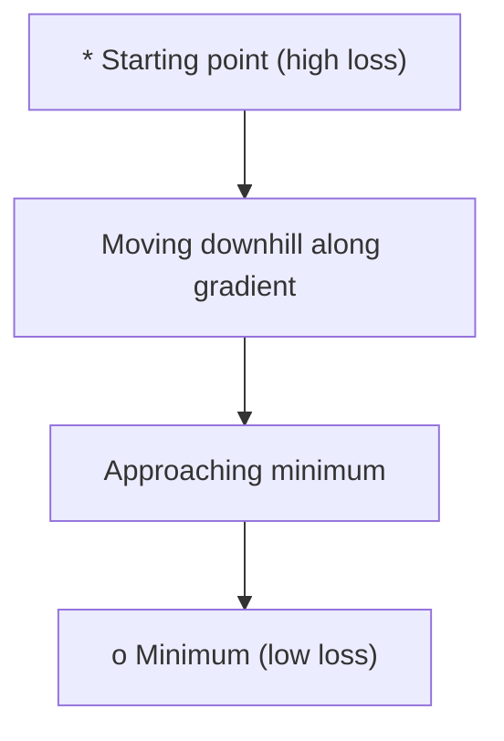
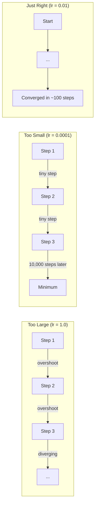
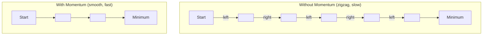
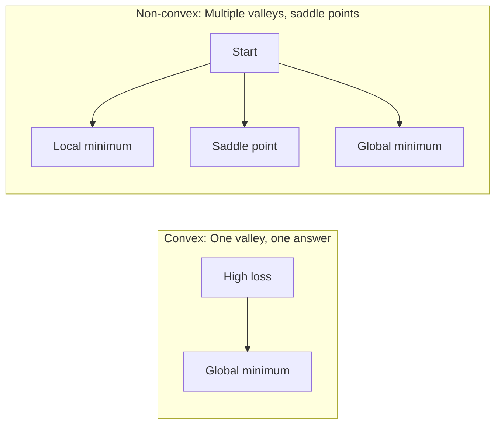
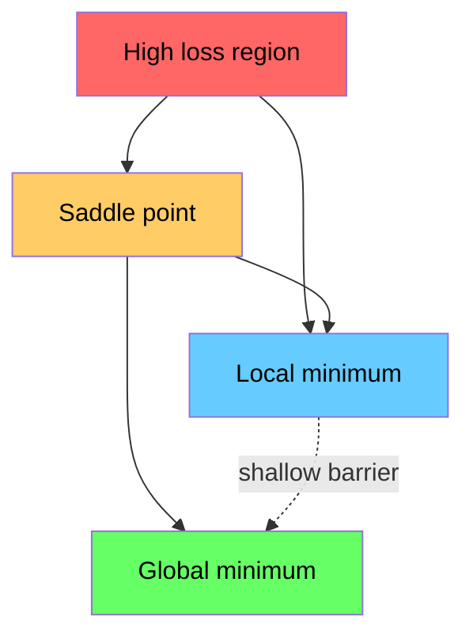

# Optymalizacja

> Trenowanie sieci neuronowej to nic innego jak znalezienie dna doliny.

**Typ:** Buduj
**Język:** Python
**Wymagania wstępne:** Faza 1, Lekcje 04-05 (Pochodne, Gradienty)
**Czas:** ~75 minut

## Cele uczenia się

- Zaimplementuj zwykły spadek gradientu, SGD z pędem oraz Adama od zera
- Porównaj zbieżność optymalizatorów na funkcji Rosenbrocka i wyjaśnij, dlaczego Adam dostosowuje szybkość uczenia dla każdej wagi
- Rozróżnij wypukłe i niewypukłe krajobrazy strat oraz wyjaśnij rolę punktów siodłowych w wysokich wymiarach
- Skonfiguruj harmonogramy szybkości uczenia (spadek krokowy, wyżarzanie cosinusowe, rozgrzewanie) dla stabilności treningu

## Problem

Masz funkcję straty. Mówi ci, jak bardzo niepoprawny jest twój model. Masz gradienty. Mówią ci, który kierunek sprawia, że strata rośnie. Teraz potrzebujesz strategii schodzenia w dół.

Naiwne podejście jest proste: idź w przeciwnym kierunku gradientu. Skaluj krok przez pewną liczbę zwaną szybkością uczenia. Powtarzaj. To jest spadek gradientu i działa. Ale "działa" ma zastrzeżenia. Zbyt duża szybkość uczenia i przekraczasz dolinę całkowicie, odbijaając się między ścianami. Zbyt mała i czołgasz się ku odpowiedzi przez tysiące niepotrzebnych kroków. Trafisz w punkt siodłowy i przestajesz się poruszać, mimo że nie znalazłeś minimum.

Każdy optymalizator w uczeniu głębokim jest odpowiedzią na to samo pytanie: jak dotrzeć na dno doliny szybciej i bardziej niezawodnie?

## Koncepcja

### Co oznacza optymalizacja

Optymalizacja to znajdowanie wartości wejściowych, które minimalizują (lub maksymalizują) funkcję. W uczeniu maszynowym funkcją jest strata. Wejściami są wagi modelu. Trenowanie to optymalizacja.

```
minimize L(w) where:
  L = loss function
  w = model weights (could be millions of parameters)
```

### Spadek gradientu (zwykły)

Najprostszy optymalizator. Oblicz gradient straty względem każdej wagi. Przesuń każdą wagę w przeciwnym kierunku jej gradientu. Skaluj krok przez szybkość uczenia.

```
w = w - lr * gradient
```

To jest cały algorytm. Jedna linia.



### Szybkość uczenia: najważniejszy hiperparametr

Szybkość uczenia kontroluje rozmiar kroku. Określa wszystko dotyczące zbieżności.



Nie ma wzoru na właściwą szybkość uczenia. Znajdujesz ją eksperymentalnie. Częste punkty wyjścia: 0.001 dla Adama, 0.01 dla SGD z pędem.

### SGD vs wsadowy vs mini-wsadowy

Zwykły spadek gradientu oblicza gradient dla całego zestawu danych przed wykonaniem jednego kroku. To nazywa się wsadowym spadkiem gradientu. Jest stabilny, ale wolny.

Stochastyczny spadek gradientu (SGD) oblicza gradient na pojedynczej losowej próbce i natychmiast wykonuje krok. Jest zaszumiony, ale szybki.

Mini-wsadowy spadek gradientu znajduje się pomiędzy. Oblicz gradient na małej partii (32, 64, 128, 256 próbek), następnie wykonaj krok. To jest to, czego wszyscy faktycznie używają.

| Wariant | Rozmiar partii | Jakość gradientu | Szybkość na krok | Szum |
|---------|-----------|-----------------|---------------|-------|
| Wsadowy GD | Cały zestaw danych | Dokładny | Wolny | Brak |
| SGD | 1 próbka | Bardzo zaszumiony | Szybki | Wysoki |
| Mini-wsadowy | 32-256 | Dobre przybliżenie | Zrównoważony | Umiarkowany |

Szum w SGD i mini-wsadowym nie jest błędem. Pomaga uciec z płytkich lokalnych minimów i punktów siodłowych.

### Momentum: piłka tocząca się w dół

Zwykły spadek gradientu patrzy tylko na aktualny gradient. Jeśli gradient zygzakuje (częste w wąskich dolinach), postęp jest wolny. Momentum to naprawia, akumulując przeszłe gradienty w termin prędkości.

```
v = beta * v + gradient
w = w - lr * v
```

Analogia: piłka tocząca się w dół. Nie zatrzymuje się i nie restartuje przy każdym wypięciu. Nabiera prędkości w spójnych kierunkach i tłumi oscylacje.



`beta` (zazwyczaj 0.9) kontroluje, ile historii zachować. Wyższy beta oznacza więcej momentum, gładsze ścieżki, ale wolniejszą reakcję na zmiany kierunku.

### Adam: adaptacyjne szybkości uczenia

Różne wagi potrzebują różnych szybkości uczenia. Waga, która rzadko otrzymuje duże gradienty, powinna wykonywać większe kroki, gdy w końcu to robi. Waga, która stale otrzymuje ogromne gradienty, powinna wykonywać mniejsze kroki.

Adam (Adaptive Moment Estimation) śledzi dwie rzeczy dla każdej wagi:

1. Pierwszy moment (m): bieżąca średnia gradientów (jak momentum)
2. Drugi moment (v): bieżąca średnia kwadratów gradientów (wielkość gradientu)

```
m = beta1 * m + (1 - beta1) * gradient
v = beta2 * v + (1 - beta2) * gradient^2

m_hat = m / (1 - beta1^t)    bias correction
v_hat = v / (1 - beta2^t)    bias correction

w = w - lr * m_hat / (sqrt(v_hat) + epsilon)
```

Dzielenie przez `sqrt(v_hat)` jest kluczowym spostrzeżeniem. Wagi z dużymi gradientami są dzielone przez dużą liczbę (mały efektywny krok). Wagi z małymi gradientami są dzielone przez małą liczbę (duży efektywny krok). Każda waga otrzymuje własną adaptacyjną szybkość uczenia.

Domyślne hiperparametry: `lr=0.001, beta1=0.9, beta2=0.999, epsilon=1e-8`. Te domyślne wartości dobrze działają w większości problemów.

### Harmonogramy szybkości uczenia

Stała szybkość uczenia to kompromis. Na początku treningu chcesz dużych kroków, aby szybko poczynić postępy. Pod koniec treningu chcesz małych kroków, aby precyzyjnie dostroić w pobliżu minimum.

Częste harmonogramy:

| Harmonogram | Formuła | Przypadek użycia |
|----------|---------|----------|
| Spadek krokowy | lr = lr * współczynnik co N epok | Prosty, ręczna kontrola |
| Spadek wykładniczy | lr = lr_0 * decay^t | Gładka redukcja |
| Wyżarzanie cosinusowe | lr = lr_min + 0.5 * (lr_max - lr_min) * (1 + cos(pi * t / T)) | Transformery, nowoczesny trening |
| Rozgrzewanie + spadek | Liniowy wzrost, następnie spadek | Duże modele, zapobiega wczesnej niestabilności |

### Wypukłe vs niewypukłe

Funkcja wypukła ma jedno minimum. Spadek gradientu zawsze je znajduje. Kwadratowa jak `f(x) = x^2` jest wypukła.

Funkcje strat sieci neuronowych są niewypukłe. Mają wiele lokalnych minimów, punktów siodłowych i płaskich regionów.



W praktyce lokalne minima w wysokowymiarowych sieciach neuronowych rzadko stanowią problem. Większość lokalnych minimów ma wartości strat bliskie globalnemu minimum. Punkty siodłowe (płaskie w niektórych kierunkach, zakrzywione w innych) są prawdziwą przeszkodą. Momentum i szum z mini-partii pomagają z nich uciec.

### Wizualizacja krajobrazu strat

Strata jest funkcją wszystkich wag. Dla modelu z 1 milionem wag, krajobraz strat istnieje w przestrzeni 1 000 001-wymiarowej. Wizualizujemy go, wybierając dwa losowe kierunki w przestrzeni wag i wykreślając stratę wzdłuż tych kierunków, tworząc powierzchnię 2D.



Ostre minima źle się uogólniają. Płaskie minima dobrze się uogólniają. To jeden z powodów, dla których SGD z pędem często przewyższa Adama w końcowej dokładności testowej: jego szum zapobiega osiadaniu w ostrych minimach.

## Zbuduj to

### Krok 1: Zdefiniuj funkcję testową

Funkcja Rosenbrocka to klasyczny punkt odniesienia optymalizacji. Jej minimum znajduje się w (1, 1) wewnątrz wąskiej zakrzywionej doliny, którą łatwo znaleźć, ale trudno podążać.

```
f(x, y) = (1 - x)^2 + 100 * (y - x^2)^2
```

```python
def rosenbrock(params):
    x, y = params
    return (1 - x) ** 2 + 100 * (y - x ** 2) ** 2

def rosenbrock_gradient(params):
    x, y = params
    df_dx = -2 * (1 - x) + 200 * (y - x ** 2) * (-2 * x)
    df_dy = 200 * (y - x ** 2)
    return [df_dx, df_dy]
```

### Krok 2: Zwykły spadek gradientu

```python
class GradientDescent:
    def __init__(self, lr=0.001):
        self.lr = lr

    def step(self, params, grads):
        return [p - self.lr * g for p, g in zip(params, grads)]
```

### Krok 3: SGD z pędem

```python
class SGDMomentum:
    def __init__(self, lr=0.001, momentum=0.9):
        self.lr = lr
        self.momentum = momentum
        self.velocity = None

    def step(self, params, grads):
        if self.velocity is None:
            self.velocity = [0.0] * len(params)
        self.velocity = [
            self.momentum * v + g
            for v, g in zip(self.velocity, grads)
        ]
        return [p - self.lr * v for p, v in zip(params, self.velocity)]
```

### Krok 4: Adam

```python
class Adam:
    def __init__(self, lr=0.001, beta1=0.9, beta2=0.999, epsilon=1e-8):
        self.lr = lr
        self.beta1 = beta1
        self.beta2 = beta2
        self.epsilon = epsilon
        self.m = None
        self.v = None
        self.t = 0

    def step(self, params, grads):
        if self.m is None:
            self.m = [0.0] * len(params)
            self.v = [0.0] * len(params)

        self.t += 1

        self.m = [
            self.beta1 * m + (1 - self.beta1) * g
            for m, g in zip(self.m, grads)
        ]
        self.v = [
            self.beta2 * v + (1 - self.beta2) * g ** 2
            for v, g in zip(self.v, grads)
        ]

        m_hat = [m / (1 - self.beta1 ** self.t) for m in self.m]
        v_hat = [v / (1 - self.beta2 ** self.t) for v in self.v]

        return [
            p - self.lr * mh / (vh ** 0.5 + self.epsilon)
            for p, mh, vh in zip(params, m_hat, v_hat)
        ]
```

### Krok 5: Uruchom i porównaj

```python
def optimize(optimizer, func, grad_func, start, steps=5000):
    params = list(start)
    history = [params[:]]
    for _ in range(steps):
        grads = grad_func(params)
        params = optimizer.step(params, grads)
        history.append(params[:])
    return history

start = [-1.0, 1.0]

gd_history = optimize(GradientDescent(lr=0.0005), rosenbrock, rosenbrock_gradient, start)
sgd_history = optimize(SGDMomentum(lr=0.0001, momentum=0.9), rosenbrock, rosenbrock_gradient, start)
adam_history = optimize(Adam(lr=0.01), rosenbrock, rosenbrock_gradient, start)

for name, history in [("GD", gd_history), ("SGD+M", sgd_history), ("Adam", adam_history)]:
    final = history[-1]
    loss = rosenbrock(final)
    print(f"{name:6s} -> x={final[0]:.6f}, y={final[1]:.6f}, loss={loss:.8f}")
```

Oczekiwane wyjście: Adam zbiega najszybciej. SGD z pędem podąża gładszą ścieżką. Zwykły GD robi wolny postęp wzdłuż wąskiej doliny.

## Użyj tego

W praktyce używaj optymalizatorów PyTorch lub JAX. Obsługują grupy parametrów, decaweight decay, obcinanie gradientów i przyspieszenie GPU.

```python
import torch

model = torch.nn.Linear(784, 10)

sgd = torch.optim.SGD(model.parameters(), lr=0.01, momentum=0.9)
adam = torch.optim.Adam(model.parameters(), lr=0.001)
adamw = torch.optim.AdamW(model.parameters(), lr=0.001, weight_decay=0.01)

scheduler = torch.optim.lr_scheduler.CosineAnnealingLR(adam, T_max=100)
```

Zasady kciuka:

- Zaczynaj od Adama (lr=0.001). Działa w większości problemów bez dostrajania.
- Przełącz na SGD z pędem (lr=0.01, momentum=0.9) gdy potrzebujesz najlepszej końcowej dokładności i możesz poświęcić więcej czasu na dostrajanie.
- Używaj AdamW (Adam z odłączonym weight decay) dla transformerów.
- Zawsze używaj harmonogramu szybkości uczenia dla treningów dłuższych niż kilka epok.
- Jeśli trening jest niestabilny, zmniejsz szybkość uczenia. Jeśli trening jest zbyt wolny, zwiększ ją.

## Wyślij to

Ta lekcja generuje prompt do wyboru właściwego optymalizatora. Zobacz `outputs/prompt-optimizer-guide.md`.

Klasy optymalizatorów zbudowane tutaj pojawią się ponownie w Fazie 3, gdy będziemy trenować sieć neuronową od zera.

## Ćwiczenia

1. **Przeszukiwanie szybkości uczenia.** Uruchom zwykły spadek gradientu na funkcji Rosenbrocka z szybkościami uczenia [0.0001, 0.0005, 0.001, 0.005, 0.01]. Wykreśl lub wydrukuj końcową stratę po 5000 krokach dla każdej. Znajdź największą szybkość uczenia, która nadal zbiega.

2. **Porównanie momentum.** Uruchom SGD z wartościami momentum [0.0, 0.5, 0.9, 0.99] na funkcji Rosenbrocka. Śledź stratę na każdym kroku. Która wartość momentum zbiega najszybciej? Która przekracza cel?

3. **Ucieczka z punktu siodłowego.** Zdefiniuj funkcję `f(x, y) = x^2 - y^2` (punkt siodłowy w początku). Zacznij w (0.01, 0.01). Porównaj zachowanie zwykłego GD, SGD z pędem i Adama. Który ucieka z punktu siodłowego?

4. **Zaimplementuj spadek szybkości uczenia.** Dodaj harmonogram wykładniczego spadku do klasy GradientDescent: `lr = lr_0 * 0.999^step`. Porównaj zbieżność z i bez spadku na funkcji Rosenbrocka.

## Kluczowe terminy

| Termin | Co ludzie mówią | Co to faktycznie oznacza |
|------|----------------|----------------------|
| Gradient descent | "Schodź w dół" | Aktualizuj wagi poprzez odjęcie gradientu skalowanego przez szybkość uczenia. Najbardziej podstawowy optymalizator. |
| Learning rate | "Rozmiar kroku" | Skalar kontrolujący, jak daleko każda aktualizacja przesuwa wagi. Zbyt duży powoduje dywergencję. Zbyt mały marnuje obliczenia. |
| Momentum | "Keep rolling" | Akumuluj przeszłe gradienty w wektor prędkości. Tłumi oscylacje i przyspiesza ruch przez spójne kierunki. |
| SGD | "Losowe próbkowanie" | Stochastyczny spadek gradientu. Oblicz gradient na losowym podzbiorze zamiast na całym zestawie danych. Prawie zawsze oznacza mini-wsadowy SGD w praktyce. |
| Mini-batch | "Kawałek danych" | Mały podzbiór danych treningowych (32-256 próbek) używany do oszacowania gradientu. Równoważy szybkość i dokładność gradientu. |
| Adam | "Domyślny optymalizator" | Adaptive Moment Estimation. Śledzi dla każdej wagi bieżące średnie gradientów i kwadratów gradientów, aby dać każdej wadze własną szybkość uczenia. |
| Bias correction | "Napraw zimny start" | Pierwszy i drugi moment Adama są inicjalizowane do zera. Korekcja obciążenia dzieli przez (1 - beta^t), aby zrekompensować we wczesnych krokach. |
| Learning rate schedule | "Zmień lr w czasie" | Funkcja, która dostosowuje szybkość uczenia podczas treningu. Duże kroki wcześnie, małe kroki późno. |
| Convex function | "Jedna dolina" | Funkcja, w której każde lokalne minimum jest globalnym minimum. Spadek gradientu zawsze je znajduje. Straty sieci neuronowych nie są wypukłe. |
| Saddle point | "Płaskie, ale nie minimum" | Punkt, gdzie gradient wynosi zero, ale jest minimum w niektórych kierunkach, a maksimum w innych. Częste w wysokich wymiarach. |
| Loss landscape | "Teren" | Funkcja straty wykreślona nad przestrzenią wag. Wizualizowana przez przecięcie wzdłuż dwóch losowych kierunków. |
| Convergence | "Docieranie" | Optymalizator osiągnął punkt, w którym dalsze kroki nie zmniejszają już znacząco straty. |

## Dalsze czytanie

- [Sebastian Ruder: An overview of gradient descent optimization algorithms](https://ruder.io/optimizing-gradient-descent/) - kompleksowy przegląd wszystkich głównych optymalizatorów
- [Why Momentum Really Works (Distill)](https://distill.pub/2017/momentum/) - interaktywna wizualizacja dynamiki momentum
- [Adam: A Method for Stochastic Optimization (Kingma & Ba, 2014)](https://arxiv.org/abs/1412.6980) - oryginalny artykuł o Adamie, czytelny i krótki
- [Visualizing the Loss Landscape of Neural Nets (Li et al., 2018)](https://arxiv.org/abs/1712.09913) - artykuł pokazujący ostre vs płaskie minima