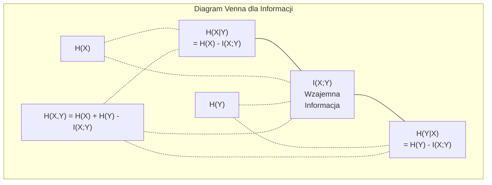

# Teoria Informacji

> Teoria informacji mierzy zaskoczenie. Funkcje straty są na niej zbudowane.

**Typ:** Nauka
**Język:** Python
**Wymagania wstępne:** Faza 1, Lekcja 06 (Prawdopodobieństwo)
**Czas:** ~60 minut

## Cele uczenia się

- Obliczaj entropię, entropię krzyżową i dywergencję KL od podstaw i wyjaśniaj ich zależności
- Wyprowadź, dlaczego minimalizacja straty entropii krzyżowej jest równoważna maksymalizacji wiarygodności logarytmicznej
- Obliczaj wzajemną informację między cechami a celem, aby rankować ważność cech
- Wyjaśniaj perplexity (perpleksję) jako efektywny rozmiar słownika, z którego wybiera model językowy

## Problem

Wywołujesz `CrossEntropyLoss()` w każdym modelu klasyfikacyjnym, który trenujesz. Widzisz "perplexity" w każdym artykule o modelach językowych. Czytasz o dywergencji KL w VAEs, destylacji i RLHF. To nie są oderwane koncepcje. To ta sama idea w różnych przebraniach.

Teoria informacji daje ci język do rozumowania o niepewności, kompresji i przewidywaniu. Claude Shannon wymyślił ją w 1948 roku, aby rozwiązać problemy komunikacyjne. Okazuje się, że trenowanie sieci neuronowej to problem komunikacyjny: model próbuje przesłać poprawną etykietę przez zaszumiony kanał wyuczonych wag.

Ta lekcja buduje każdy wzór od podstaw, abyś zobaczył, skąd się biorą i dlaczego działają.

## Koncepcja

### Zawartość informacyjna (Zaskoczenie)

Gdy dzieje się coś mało prawdopodobnego, niesie to więcej informacji. Moneta wypada reszką? Niezaskakujące. Wygrana na loterii? Bardzo zaskakujące.

Zawartość informacyjna zdarzenia o prawdopodobieństwie p wynosi:

```
I(x) = -log(p(x))
```

Używając logarytmu o podstawie 2, otrzymujesz bity. Używając logarytmu naturalnego, otrzymujesz naty. Ta sama idea, różne jednostki.

```
Zdarzenie              Prawdopodobieństwo    Zaskoczenie (bity)
Reszka uczciwej monety 0.5                  1.0
Wyrzucenie 6           0.167                2.58
Zdarzenie 1 na 1000   0.001                9.97
Zdarzenie pewne        1.0                 0.0
```

Pewne zdarzenia niosą zero informacji. Już wiedziałeś, że się wydarzą.

### Entropia (Średnie zaskoczenie)

Entropia to oczekiwane zaskoczenie we wszystkich możliwych wynikach rozkładu.

```
H(P) = -sum( p(x) * log(p(x)) )  dla wszystkich x
```

Uczciwa moneta ma maksymalną entropię dla zmiennej binarnej: 1 bit. Moneta obciążona (99% reszek) ma niską entropię: 0.08 bitów. Już wiesz, co się stanie, więc każdy rzut mówi ci prawie nic.

```
Uczciwa moneta:  H = -(0.5 * log2(0.5) + 0.5 * log2(0.5)) = 1.0 bit
Obciążona:      H = -(0.99 * log2(0.99) + 0.01 * log2(0.01)) = 0.08 bitów
```

Entropia mierzy nieusuwalną niepewność w rozkładzie. Nie możesz skompresować poniżej niej.

### Entropia krzyżowa (Funkcja straty, której używasz codziennie)

Entropia krzyżowa mierzy średnie zaskoczenie, gdy używasz rozkładu Q do kodowania zdarzeń, które faktycznie pochodzą z rozkładu P.

```
H(P, Q) = -sum( p(x) * log(q(x)) )  dla wszystkich x
```

P to prawdziwy rozkład (etykiety). Q to predykcje twojego modelu. Jeśli Q idealnie odpowiada P, entropia krzyżowa równa się entropii. Każde niedopasowanie powoduje, że jest większa.

W klasyfikacji, P to wektor one-hot (prawdziwa klasa ma prawdopodobieństwo 1, wszystkie inne 0). To upraszcza entropię krzyżową do:

```
H(P, Q) = -log(q(prawdziwa_klasa))
```

To jest cały wzór straty entropii krzyżowej dla klasyfikacji. Maksymalizuj przewidywane prawdopodobieństwo poprawnej klasy.

### Dywergencja KL (Odległość między rozkładami)

Dywergencja KL mierzy, ile dodatkowego zaskoczenia otrzymujesz od używania Q zamiast P.

```
D_KL(P || Q) = sum( p(x) * log(p(x) / q(x)) )  dla wszystkich x
              = H(P, Q) - H(P)
```

Entropia krzyżowa to entropia plus dywergencja KL. Ponieważ entropia prawdziwego rozkładu jest stała podczas treningu, minimalizacja entropii krzyżowej jest tym samym co minimalizacja dywergencji KL. Pchasz rozkład swojego modelu w kierunku prawdziwego rozkładu.

Dywergencja KL nie jest symetryczna: D_KL(P || Q) != D_KL(Q || P). Nie jest prawdziwą metryką odległości.

### Wzajemna informacja

Wzajemna informacja mierzy, ile informacji o jednej zmiennej mówi ci o drugiej.

```
I(X; Y) = H(X) - H(X|Y)
        = H(X) + H(Y) - H(X, Y)
```

Jeśli X i Y są niezależne, wzajemna informacja wynosi zero. Znajomość jednej nie mówi ci nic o drugiej. Jeśli są idealnie skorelowane, wzajemna informacja równa się entropii którejkolwiek zmiennej.

W selekcji cech, wysoka wzajemna informacja między cechą a celem oznacza, że cecha jest użyteczna. Niska wzajemna informacja oznacza, że to szum.

### Entropia warunkowa

H(Y|X) mierzy, ile niepewności o Y pozostaje po obserwacji X.

```
H(Y|X) = H(X,Y) - H(X)
```

Dwa ekstrema:
- Jeśli X całkowicie determinuje Y, to H(Y|X) = 0. Znajomość X eliminuje całą niepewność o Y. Przykład: X = temperatura w stopniach Celsjusza, Y = temperatura w stopniach Fahrenheita.
- Jeśli X nie mówi ci nic o Y, to H(Y|X) = H(Y). Znajomość X nie redukuje twojej niepewności w ogóle. Przykład: X = rzut monetą, Y = jutrzejsza pogoda.

Entropia warunkowa jest zawsze nieujemna i nigdy nie przekracza H(Y):

```
0 <= H(Y|X) <= H(Y)
```

W uczeniu maszynowym, entropia warunkowa pojawia się w drzewach decyzyjnych. Przy każdym podziale, algorytm wybiera cechę X, która minimalizuje H(Y|X) -- cechę, która usuwa najwięcej niepewności o etykiecie Y.

### Entropia łączna

H(X,Y) to entropia łącznego rozkładu X i Y razem.

```
H(X,Y) = -sum sum p(x,y) * log(p(x,y))   dla wszystkich x, y
```

Kluczowa właściwość:

```
H(X,Y) <= H(X) + H(Y)
```

Równość zachodzi, gdy X i Y są niezależne. Jeśli dzielą informację, entropia łączna jest mniejsza niż suma indywidualnych entropii. "Brakująca" entropia to dokładnie wzajemna informacja.



Zależności:
- H(X,Y) = H(X) + H(Y|X) = H(Y) + H(X|Y)
- I(X;Y) = H(X) - H(X|Y) = H(Y) - H(Y|X)
- H(X,Y) = H(X) + H(Y) - I(X;Y)

### Wzajemna informacja (Dogłębna analiza)

Wzajemna informacja I(X;Y) kwantyfikuje, ile znajomość jednej zmiennej redukuje niepewność o drugiej.

```
I(X;Y) = H(X) - H(X|Y)
       = H(Y) - H(Y|X)
       = H(X) + H(Y) - H(X,Y)
       = sum sum p(x,y) * log(p(x,y) / (p(x) * p(y)))
```

Właściwości:
- I(X;Y) >= 0 zawsze. Nigdy nie tracisz informacji, obserwując coś.
- I(X;Y) = 0 wtedy i tylko wtedy, gdy X i Y są niezależne.
- I(X;Y) = I(Y;X). Jest symetryczna, w przeciwieństwie do dywergencji KL.
- I(X;X) = H(X). Zmienna dzieli całą swoją informację ze sobą.

**Wzajemna informacja do selekcji cech.** W ML, chcesz cech, które są informacyjne o celu. Wzajemna informacja daje ci zasadniczy sposób rankowania cech:

1. Dla każdej cechy X_i, oblicz I(X_i; Y), gdzie Y to zmienna celu.
2. Rankuj cechy według wyniku MI.
3. Zachowaj top k cech.

To działa dla każdej relacji między cechą a celem -- liniowej, nieliniowej, monotonicznej lub nie. Korelacja łapie tylko relacje liniowe. MI łapie wszystko.

| Metoda | Wykrywa | Koszt obliczeniowy | Obsługuje kategoryczne? |
|--------|---------|-------------------|---------------------|
| Korelacja Pearsona | Relacje liniowe | O(n) | Nie |
| Korelacja Spearmana | Relacje monotoniczne | O(n log n) | Nie |
| Wzajemna informacja | Każda zależność statystyczna | O(n log n) z binningiem | Tak |

### Wygładzanie etykiet i entropia krzyżowa

Standardowa klasyfikacja używa twardych celów: [0, 0, 1, 0]. Prawdziwa klasa ma prawdopodobieństwo 1, wszystko inne dostaje 0. Wygładzanie etykiet zastępuje to miękkimi celami:

```
soft_target = (1 - epsilon) * hard_target + epsilon / num_classes
```

Z epsilon = 0.1 i 4 klasami:
- Twardy cel:  [0, 0, 1, 0]
- Miękki cel:  [0.025, 0.025, 0.925, 0.025]

Z perspektywy teorii informacji, wygładzanie etykiet zwiększa entropię rozkładu celu. Twarde cele one-hot mają entropię 0 -- nie ma niepewności. Miękkie cele mają dodatnią entropię.

Dlaczego to pomaga:
- Zapobiega modelowi napędzaniu logitów do ekstremalnych wartości (nieskończone logity byłyby potrzebne do idealnego dopasowania celu one-hot pod entropią krzyżową)
- Działa jako regularyzacja: model nie może być w 100% pewny
- Poprawia kalibrację: przewidywane prawdopodobieństwa lepiej odzwierciedlają prawdziwą niepewność
- Zmniejsza lukę między zachowaniem podczas treningu a wnioskowania

Strata entropii krzyżowej z wygładzaniem etykiet staje się:

```
L = (1 - epsilon) * CE(hard_target, prediction) + epsilon * H_uniform(prediction)
```

Drugi człon penalizuje predykcje, które są dalekie od jednorodnego -- bezpośrednia regularyzacja pewności.

### Dlaczego entropia krzyżowa jest TĄ funkcją straty klasyfikacyjnej

Trzy perspektywy, ten sam wniosek.

**Perspektywa teorii informacji.** Entropia krzyżowa mierzy, ile bitów marnujesz, używając rozkładu swojego modelu zamiast prawdziwego rozkładu. Minimalizując ją, twój model staje się najbardziej efektywnym enkoderem rzeczywistości.

**Perspektywa maksymalnej wiarygodności.** Dla N próbek treningowych z prawdziwymi klasami y_i:

```
Wiarygodność     = iloczyn( q(y_i) )
Log-wiarygodność = suma( log(q(y_i)) )
Ujemna log-wiarygodność = -suma( log(q(y_i)) )
```

Ta ostatnia linia to strata entropii krzyżowej. Minimalizacja entropii krzyżowej = maksymalizacja wiarygodności danych treningowych pod twoim modelem.

**Perspektywa gradientu.** Gradient entropii krzyżowej względem logitów to po prostu (przewidywane - prawdziwe). Czyste, stabilne i szybkie do obliczenia. Dlatego paruje się idealnie z softmax.

### Bity vs Naty

Jedyna różnica to podstawa logarytmu.

```
log o podstawie 2   -> bity      (tradycja teorii informacji)
log o podstawie e   -> naty      (konwencja uczenia maszynowego)
log o podstawie 10  -> hartleye  (rzadko używane)
```

1 nat = 1/ln(2) bitów = 1.4427 bitów. PyTorch i TensorFlow domyślnie używają logarytmu naturalnego (naty).

### Perpleksja

Perpleksja to eksponenta entropii krzyżowej. Mówi ci efektywną liczbę równie prawdopodobnych wyborów, między którymi model jest niepewny.

```
Perpleksja = 2^H(P,Q)   (jeśli używasz bitów)
Perpleksja = e^H(P,Q)   (jeśli używasz natów)
```

Model językowy z perplexity 50 jest średnio tak zdezorientowany, jakby musiał wybierać jednolicie z 50 możliwych następnych tokenów. Niższy wynik jest lepszy.

GPT-2 osiągnął perplexity ~30 na common benchmarks. Współczesne modele są w pojedynczych cyfrach dla dobrze reprezentowanych domen.

## Zbuduj to

### Krok 1: Zawartość informacyjna i entropia

```python
import math

def information_content(p, base=2):
    if p <= 0 or p > 1:
        return float('inf') if p <= 0 else 0.0
    return -math.log(p) / math.log(base)

def entropy(probs, base=2):
    return sum(
        p * information_content(p, base)
        for p in probs if p > 0
    )

fair_coin = [0.5, 0.5]
biased_coin = [0.99, 0.01]
fair_die = [1/6] * 6

print(f"Fair coin entropy:   {entropy(fair_coin):.4f} bits")
print(f"Biased coin entropy: {entropy(biased_coin):.4f} bits")
print(f"Fair die entropy:    {entropy(fair_die):.4f} bits")
```

### Krok 2: Entropia krzyżowa i dywergencja KL

```python
def cross_entropy(p, q, base=2):
    total = 0.0
    for pi, qi in zip(p, q):
        if pi > 0:
            if qi <= 0:
                return float('inf')
            total += pi * (-math.log(qi) / math.log(base))
    return total

def kl_divergence(p, q, base=2):
    return cross_entropy(p, q, base) - entropy(p, base)

true_dist = [0.7, 0.2, 0.1]
good_model = [0.6, 0.25, 0.15]
bad_model = [0.1, 0.1, 0.8]

print(f"Entropy of true dist:     {entropy(true_dist):.4f} bits")
print(f"CE (good model):          {cross_entropy(true_dist, good_model):.4f} bits")
print(f"CE (bad model):           {cross_entropy(true_dist, bad_model):.4f} bits")
print(f"KL divergence (good):     {kl_divergence(true_dist, good_model):.4f} bits")
print(f"KL divergence (bad):      {kl_divergence(true_dist, bad_model):.4f} bits")
```

### Krok 3: Entropia krzyżowa jako strata klasyfikacyjna

```python
def softmax(logits):
    max_logit = max(logits)
    exps = [math.exp(z - max_logit) for z in logits]
    total = sum(exps)
    return [e / total for e in exps]

def cross_entropy_loss(true_class, logits):
    probs = softmax(logits)
    return -math.log(probs[true_class])

logits = [2.0, 1.0, 0.1]
true_class = 0

probs = softmax(logits)
loss = cross_entropy_loss(true_class, logits)

print(f"Logits:      {logits}")
print(f"Softmax:     {[f'{p:.4f}' for p in probs]}")
print(f"True class:  {true_class}")
print(f"Loss:        {loss:.4f} nats")
print(f"Perplexity:  {math.exp(loss):.2f}")
```

### Krok 4: Entropia krzyżowa równa się ujemnej log-wiarygodności

```python
import random

random.seed(42)

n_samples = 1000
n_classes = 3
true_labels = [random.randint(0, n_classes - 1) for _ in range(n_samples)]
model_logits = [[random.gauss(0, 1) for _ in range(n_classes)] for _ in range(n_samples)]

ce_loss = sum(
    cross_entropy_loss(label, logits)
    for label, logits in zip(true_labels, model_logits)
) / n_samples

nll = -sum(
    math.log(softmax(logits)[label])
    for label, logits in zip(true_labels, model_logits)
) / n_samples

print(f"Cross-entropy loss:      {ce_loss:.6f}")
print(f"Negative log-likelihood: {nll:.6f}")
print(f"Difference:              {abs(ce_loss - nll):.2e}")
```

### Krok 5: Wzajemna informacja

```python
def mutual_information(joint_probs, base=2):
    rows = len(joint_probs)
    cols = len(joint_probs[0])

    margin_x = [sum(joint_probs[i][j] for j in range(cols)) for i in range(rows)]
    margin_y = [sum(joint_probs[i][j] for i in range(rows)) for j in range(cols)]

    mi = 0.0
    for i in range(rows):
        for j in range(cols):
            pxy = joint_probs[i][j]
            if pxy > 0:
                mi += pxy * math.log(pxy / (margin_x[i] * margin_y[j])) / math.log(base)
    return mi

independent = [[0.25, 0.25], [0.25, 0.25]]
dependent = [[0.45, 0.05], [0.05, 0.45]]

print(f"MI (independent): {mutual_information(independent):.4f} bits")
print(f"MI (dependent):   {mutual_information(dependent):.4f} bits")
```

## Użyj tego

Te same koncepcje używając NumPy, w sposób, w jaki będziesz ich używać w praktyce:

```python
import numpy as np

def np_entropy(p):
    p = np.asarray(p, dtype=float)
    mask = p > 0
    result = np.zeros_like(p)
    result[mask] = p[mask] * np.log(p[mask])
    return -result.sum()

def np_cross_entropy(p, q):
    p, q = np.asarray(p, dtype=float), np.asarray(q, dtype=float)
    mask = p > 0
    return -(p[mask] * np.log(q[mask])).sum()

def np_kl_divergence(p, q):
    return np_cross_entropy(p, q) - np_entropy(p)

true = np.array([0.7, 0.2, 0.1])
pred = np.array([0.6, 0.25, 0.15])
print(f"Entropy:    {np_entropy(true):.4f} nats")
print(f"Cross-ent:  {np_cross_entropy(true, pred):.4f} nats")
print(f"KL div:     {np_kl_divergence(true, pred):.4f} nats")
```

Zbudowałeś od podstaw to, co `torch.nn.CrossEntropyLoss()` robi wewnętrznie. Teraz wiesz, dlaczego strata spada podczas treningu: przewidywany rozkład twojego modelu zbliża się do prawdziwego rozkładu, mierzony w natach zmarnowanej informacji.

## Ćwiczenia

1. Oblicz entropię alfabetu angielskiego zakładając równomierny rozkład (26 liter). Następnie oszacuj ją używając rzeczywistych częstotliwości liter. Która jest wyższa i dlaczego?

2. Model zwraca logity [5.0, 2.0, 0.5] dla próbki z prawdziwą klasą 1. Oblicz stratę entropii krzyżowej ręcznie, następnie zweryfikuj z swoją funkcją `cross_entropy_loss`. Jakie logity dałyby stratę zero?

3. Pokaż, że dywergencja KL nie jest symetryczna. Wybierz dwa rozkłady P i Q i oblicz D_KL(P || Q) oraz D_KL(Q || P). Wyjaśnij, dlaczego się różnią.

4. Zbuduj funkcję obliczającą perplexity dla sekwencji predykcji tokenów. Mając listę par (indeks_prawdziwego_tokenu, przewidywane_logity), zwróć perplexity sekwencji.

## Kluczowe terminy

| Termin | Co ludzie mówią | Co to faktycznie oznacza |
|--------|----------------|----------------------|
| Zawartość informacyjna | "Zaskoczenie" | Liczba bitów (lub natów) potrzebnych do zakodowania zdarzenia: -log(p) |
| Entropia | "Losowość" | Średnie zaskoczenie we wszystkich wynikach rozkładu. Mierzy nieusuwalną niepewność. |
| Entropia krzyżowa | "Funkcja straty" | Średnie zaskoczenie przy używaniu rozkładu modelu Q do kodowania zdarzeń z prawdziwego rozkładu P. |
| Dywergencja KL | "Odległość między rozkładami" | Dodatkowe bity zmarnowane przez używanie Q zamiast P. Równa się entropii krzyżowej minus entropia. Niesymetryczna. |
| Wzajemna informacja | "Jak powiązane są X i Y" | Redukcja niepewności o X z znajomości Y. Zero oznacza niezależność. |
| Softmax | "Zamiana logitów na prawdopodobieństwa" | Wykładniczo i normalizuj. Odwzorowuje dowolny wektor rzeczywisty na prawidłowy rozkład prawdopodobieństwa. |
| Perpleksja | "Jak zdezorientowany jest model" | Eksponenta entropii krzyżowej. Efektywny rozmiar słownika, z którego model wybiera przy każdym kroku. |
| Bity | "Jednostka Shannona" | Informacja mierzona logarytmem o podstawie 2. Jeden bit rozstrzyga jeden uczciwy rzut monetą. |
| Naty | "Jednostka ML" | Informacja mierzona logarytmem naturalnym. Używane domyślnie przez PyTorch i TensorFlow. |
| Ujemna log-wiarygodność | "Strata NLL" | Identyczna ze stratą entropii krzyżowej dla etykiet one-hot. Minimalizując ją, maksymalizujesz prawdopodobieństwo poprawnych predykcji. |

## Dalsza lektura

- [Shannon 1948: A Mathematical Theory of Communication](https://people.math.harvard.edu/~ctm/home/text/others/shannon/entropy/entropy.pdf) - oryginalny artykuł, wciąż czytelny
- [Visual Information Theory (Chris Olah)](https://colah.github.io/posts/2015-09-Visual-Information/) - najlepsze wizualne wyjaśnienie entropii i dywergencji KL
- [PyTorch CrossEntropyLoss docs](https://pytorch.org/docs/stable/generated/torch.nn.CrossEntropyLoss.html) - jak framework implementuje to, co właśnie zbudowałeś