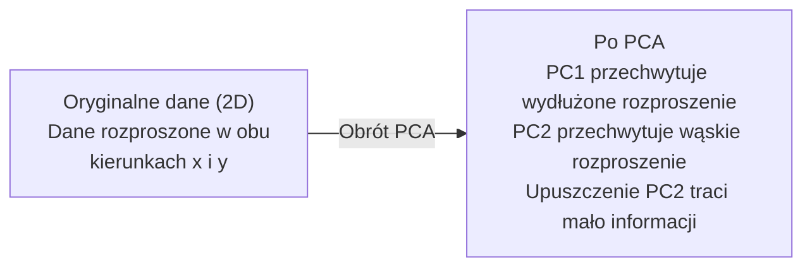

# Redukcja wymiarowości

> Dane wysokowymiarowe mają strukturę. Znajdziesz ją, patrząc pod odpowiednim kątem.

**Typ:** Budowanie
**Język:** Python
**Wymagania wstępne:** Phase 1, Lekcje 01 (Intuicja algebry liniowej), 02 (Wektory, Macierze & Operacje), 03 (Wartości własne & Wektory własne), 06 (Prawdopodobieństwo & Rozkłady)
**Czas:** ~90 minut

## Cele uczenia się

- Implementuj PCA od podstaw: centruj dane, oblicz macierz kowariancji, przeprowadź dekompozycję własną i projektuj
- Używaj współczynnika wyjaśnionej wariancji i metody łokcia, aby wybrać liczbę głównych składowych
- Porównaj PCA, t-SNE i UMAP do wizualizacji cyfr MNIST w 2D i wyjaśnij ich kompromisy
- Zastosuj jądrowe PCA z jądrem RBF, aby rozdzielić nieliniowe struktury danych, których standardowe PCA nie może obsłużyć

## Problem

Masz zbiór danych z 784 cechami na próbkę. Może to być wartości pikseli odręcznych cyfr. Może to być poziomy ekspresji genów. Może to być sygnały zachowań użytkowników. Nie możesz wizualizować 784 wymiarów. Nie możesz ich wykreślić. Nie możesz nawet o nich myśleć.

Ale większość tych 784 cech jest redundantna. Rzeczywista informacja znajduje się na znacznie mniejszej powierzchni. Odręczna "7" nie potrzebuje 784 niezależnych liczb do jej opisania. Potrzebuje tylko kilku: kąta pociągnięcia, długości poprzeczki, jak bardzo się przechyla. Reszta to szum.

Redukcja wymiarowości znajduje tę mniejszą powierzchnię. Pobiera twoje dane 784-wymiarowe i kompresuje je do 2, 10 lub 50 wymiarów, zachowując strukturę, która ma znaczenie.

## Koncepcja

### Przekleństwo wymiarowości

Przestrzenie wysokowymiarowe są nieintuicyjne. Trzy rzeczy się psują, gdy wymiary rosną.

**Odległość staje się bez znaczenia.** W wysokich wymiarach, odległość między dowolnymi dwoma losowymi punktami zbiega do tej samej wartości. Jeśli każdy punkt jest w przybliżeniu w równej odległości od każdego innego punktu, wyszukiwanie najbliższego sąsiada przestaje działać.

```
Wymiar    Średni stosunek odległości (maks/min między losowymi punktami)
2            ~5.0
10           ~1.8
100          ~1.2
1000         ~1.02
```

**Objętość koncentruje się w rogach.** Hiperkostka jednostkowa w d wymiarach ma 2^d rogów. W 100 wymiarach prawie cała objętość znajduje się w rogach, daleko od centrum. Punkty danych rozprzestrzeniają się do krawędzi, a twoje modele głodują danych w środku.

**Potrzebujesz wykładniczo więcej danych.** Aby utrzymać tę samą gęstość próbek w przestrzeni, przejście z 2D do 20D oznacza, że potrzebujesz 10^18 razy więcej danych. Nigdy nie masz wystarczająco dużo. Zmniejszenie wymiarów przywraca gęstość danych do czegoś wykonalnego.

### PCA: znajdź kierunki, które mają znaczenie

Analiza głównych składowych (PCA) znajduje osie, wzdłuż których twoje dane najbardziej się zmieniają. Obraca twój układ współrzędnych tak, że pierwsza oś przechwytuje największą wariancję, druga przechwytuje następną co do wielkości, i tak dalej.

Algorytm:

```
1. Wycentruj dane        (odejmij średnią od każdej cechy)
2. Oblicz kowariancję    (jak cechy poruszają się razem)
3. Dekompozycja własna   (znajdź główne kierunki)
4. Sortuj według wartości własnych (największa wariancja pierwsza)
5. Projektuj             (zachowaj górne k wektorów własnych, upuść resztę)
```

Dlaczego dekompozycja własna? Macierz kowariancji jest symetryczna i półokreślona dodatnio. Jej wektory własne są ortogonalnymi kierunkami w przestrzeni cech. Wartości własne mówią ci, ile wariancji przechwytuje każdy kierunek. Wektor własny z największą wartością własną wskazuje kierunek maksymalnej wariancji.



- **Przed PCA:** Chmura danych rozpostarta po przekątnej na obu osiach x i y
- **Po PCA:** Układ współrzędnych jest obrócony tak, że PC1 wyrównuje się z kierunkiem maksymalnej wariancji (wydłużone rozproszenie), a PC2 wyrównuje się z kierunkiem minimalnej wariancji (wąskie rozproszenie)
- **Redukcja wymiarowości:** Upuszczenie PC2 projektuje dane na PC1, tracąc bardzo mało informacji

### Współczynnik wyjaśnionej wariancji

Każda główna składowa przechwytuje ułamek całkowitej wariancji. Współczynnik wyjaśnionej wariancji mówi ci, ile.

```
Składowa    Wartość własna    Wyjaśniony ułamek    Skumulowany
PC1          4.73          0.473              0.473
PC2          2.51          0.251              0.724
PC3          1.12          0.112              0.836
PC4          0.89          0.089              0.925
...
```

Gdy skumulowana wyjaśniona wariancja osiąga 0.95, wiesz, że wiele składowych przechwytuje 95% informacji. Wszystko po tym to głównie szum.

### Wybór liczby składowych

Trzy strategie:

1. **Próg.** Zachowaj wystarczającą liczbę składowych, aby wyjaśnić 90-95% wariancji.
2. **Metoda łokcia.** Wykreśl wyjaśnioną wariancję na składową. Szukaj ostrego spadku.
3. **Wydajność downstream.** Użyj PCA jako preprocessingu. Przeglądaj k i mierz dokładność modelu. Najlepsze k jest tam, gdzie dokładność się stabilizuje.

### t-SNE: zachowaj sąsiedztwa

t-Distributed Stochastic Neighbor Embedding (t-SNE) jest zaprojektowane do wizualizacji. Mapuje dane wysokowymiarowe do 2D (lub 3D), zachowując, które punkty są blisko siebie.

Intuicja: w oryginalnej przestrzeni oblicz rozkład prawdopodobieństwa nad parami punktów na podstawie ich odległości. Bliskie punkty dostają wysokie prawdopodobieństwo. Dalekie punkty dostają niskie prawdopodobieństwo. Następnie znajdź układ 2D, gdzie ten sam rozkład prawdopodobieństwa zachodzi. Punkty, które były sąsiadami w 784 wymiarach, pozostają sąsiadami w 2D.

Kluczowe właściwości t-SNE:
- Nieliniowe. Może rozwinąć złożone rozmaitości, których PCA nie może.
- Stochastyczne. Różne uruchomienia produkują różne układy.
- Parametr perplexity kontroluje, ilu sąsiadów rozważać (typowy zakres: 5-50).
- Odległości między klastrami w wyniku nie są znaczące. Tylko same klastry są.
- Wolne na dużych zbiorach danych. O(n^2) domyślnie.

### UMAP: szybsze, lepsza globalna struktura

Uniform Manifold Approximation and Projection (UMAP) działa podobnie do t-SNE, ale z dwoma zaletami:
- Szybsze. Używa przybliżonych grafów najbliższych sąsiadów zamiast obliczać wszystkie parami odległości.
- Lepsza globalna struktura. Względne pozycje klastrów w wyniku mają tendencję do bycia bardziej znaczącymi niż w t-SNE.

UMAP buduje ważony graf w przestrzeni wysokowymiarowej ("rozmyta reprezentacja topologiczna"), a następnie znajduje układ niskowymiarowy, który zachowuje ten graf jak najlepiej.

Kluczowe parametry:
- `n_neighbors`: ilu sąsiadów definiuje lokalną strukturę (podobnie do perplexity). Wyższe wartości zachowują więcej globalnej struktury.
- `min_dist`: jak ciasno punkty upakowują się w wyniku. Niższe wartości tworzą gęstsze klastry.

### Kiedy używać czego

| Metoda | Przypadek użycia | Zachowuje | Szybkość |
|--------|----------|-----------|-------|
| PCA | Preprocessing przed treningiem | Globalną wariancję | Szybka (dokładna), działa na milionach próbek |
| PCA | Szybka eksploracyjna wizualizacja | Liniową strukturę | Szybka |
| t-SNE | Publikacyjnej jakości wykresy 2D | Lokalne sąsiedztwa | Wolna (< 10k próbek idealna) |
| UMAP | Wizualizacja 2D na dużą skalę | Lokalną + pewną globalną strukturę | Średnia (obsługuje miliony) |
| PCA | Redukcja cech dla modeli | Cecha rangowane wariancją | Szybka |
| t-SNE / UMAP | Rozumienie struktury klastrów | Separację klastrów | Średnia do wolnej |

Zasada kciuka: używaj PCA do preprocessingu i kompresji danych. Używaj t-SNE lub UMAP, gdy potrzebujesz wizualizować strukturę w 2D.

### Jądrowe PCA

Standardowe PCA znajduje liniowe podprzestrzenie. Obraca twój układ współrzędnych i upuszcza osie. Ale co, jeśli dane leżą na nieliniowej rozmaitości? Okrąg w 2D nie może być oddzielony żadną linią. Standardowe PCA nie pomoże.

Jądrowe PCA stosuje PCA w przestrzeni cech wysokowymiarowej indukowanej przez funkcję jądra, bez jawnego obliczania współrzędnych w tej przestrzeni. To jest sztuczka jądra -- ta sama idea stojąca za SVMami.

Algorytm:
1. Oblicz macierz jądra K, gdzie K_ij = k(x_i, x_j)
2. Wycentruj macierz jądra w przestrzeni cech
3. Przeprowadź dekompozycję własną wycentrowanej macierzy jądra
4. Górne wektory własne (skalowane przez 1/sqrt(wartość własna)) są projekcjami

Popularne funkcje jądra:

| Jądro | Formuła | Dobre dla |
|--------|---------|----------|
| RBF (Gaussowskie) | exp(-gamma * \|\|x - y\|\|^2) | Większość nieliniowych danych, gładkie rozmaitości |
| Wielomianowe | (x . y + c)^d | Wielomianowe relacje |
| Sigmoidalne | tanh(alpha * x . y + c) | Mapowania podobne do sieci neuronowych |

Kiedy używać jądrowego PCA vs standardowego PCA:

| Kryterium | Standardowe PCA | Jądrowe PCA |
|-----------|-------------|------------|
| Struktura danych | Liniowa podprzestrzeń | Nieliniowa rozmaitość |
| Szybkość | O(min(n^2 d, d^2 n)) | O(n^2 d + n^3) |
| Interpretowalność | Składowe są liniowymi kombinacjami cech | Składowe nie mają bezpośredniej interpretacji cech |
| Skalowalność | Działa na milionach próbek | Macierz jądra jest n x n, ograniczona pamięcią |
| Rekonstrukcja | Bezpośrednia odwrotna transformacja | Wymaga przybliżenia pre-obrazu |

Klasyczny przykład: współśrodkowe okręgi w 2D. Dwa pierścienie punktów, jeden wewnątrz drugiego. Standardowe PCA projektuje oba na tę samą linię -- bezużyteczne dla klasyfikacji. Jądrowe PCA z jądrem RBF mapuje wewnętrzny i zewnętrzny okrąg do różnych regionów, czyniąc je liniowo separowalnymi.

### Błąd rekonstrukcji

Jak dobra jest twoja redukcja wymiarowości? Skompresowałeś 784 wymiary do 50. Co straciłeś?

Zmierz błąd rekonstrukcji:
1. Projektuj dane do k wymiarów: X_reduced = X @ W_k
2. Rekonstruuj: X_hat = X_reduced @ W_k^T
3. Oblicz MSE: mean((X - X_hat)^2)

Dla PCA, błąd rekonstrukcji ma czysty związek z wyjaśnioną wariancją:

```
Błąd rekonstrukcji = suma wartości własnych NIE uwzględnionych
Całkowita wariancja = suma WSZYSTKICH wartości własnych
Utracony ułamek = (suma upuszczonych wartości własnych) / (suma wszystkich wartości własnych)
```

Współczynnik wyjaśnionej wariancji dla każdej składowej to:

```
explained_ratio_k = eigenvalue_k / sum(all eigenvalues)
```

Wykres skumulowanej wyjaśnionej wariancji w zależności od liczby składowych daje krzywą "łokcia". Właściwa liczba składowych jest tam, gdzie:
- Krzywa spłaszcza się (malejące korzyści)
- Skumulowana wariancja przekracza twój próg (zwykle 0.90 lub 0.95)
- Wydajność downstream zadania się stabilizuje

Błąd rekonstrukcji jest użyteczny poza wyborem k. Możesz go użyć do wykrywania anomalii: próbki z wysokim błędem rekonstrukcji to wartości odstające, które nie pasują do nauczonej podprzestrzeni. To jest podstawa wykrywania anomalii opartego na PCA w systemach produkcyjnych.

## Zbuduj to

### Krok 1: PCA od podstaw

```python
import numpy as np

class PCA:
    def __init__(self, n_components):
        self.n_components = n_components
        self.components = None
        self.mean = None
        self.eigenvalues = None
        self.explained_variance_ratio_ = None

    def fit(self, X):
        self.mean = np.mean(X, axis=0)
        X_centered = X - self.mean

        cov_matrix = np.cov(X_centered, rowvar=False)

        eigenvalues, eigenvectors = np.linalg.eigh(cov_matrix)

        sorted_idx = np.argsort(eigenvalues)[::-1]
        eigenvalues = eigenvalues[sorted_idx]
        eigenvectors = eigenvectors[:, sorted_idx]

        self.components = eigenvectors[:, :self.n_components].T
        self.eigenvalues = eigenvalues[:self.n_components]
        total_var = np.sum(eigenvalues)
        self.explained_variance_ratio_ = self.eigenvalues / total_var

        return self

    def transform(self, X):
        X_centered = X - self.mean
        return X_centered @ self.components.T

    def fit_transform(self, X):
        self.fit(X)
        return self.transform(X)
```

### Krok 2: Testuj na danych syntetycznych

```python
np.random.seed(42)
n_samples = 500

t = np.random.uniform(0, 2 * np.pi, n_samples)
x1 = 3 * np.cos(t) + np.random.normal(0, 0.2, n_samples)
x2 = 3 * np.sin(t) + np.random.normal(0, 0.2, n_samples)
x3 = 0.5 * x1 + 0.3 * x2 + np.random.normal(0, 0.1, n_samples)

X_synthetic = np.column_stack([x1, x2, x3])

pca = PCA(n_components=2)
X_reduced = pca.fit_transform(X_synthetic)

print(f"Original shape: {X_synthetic.shape}")
print(f"Reduced shape:  {X_reduced.shape}")
print(f"Explained variance ratios: {pca.explained_variance_ratio_}")
print(f"Total variance captured: {sum(pca.explained_variance_ratio_):.4f}")
```

### Krok 3: Cyfry MNIST w 2D

```python
from sklearn.datasets import fetch_openml

mnist = fetch_openml("mnist_784", version=1, as_frame=False, parser="auto")
X_mnist = mnist.data[:5000].astype(float)
y_mnist = mnist.target[:5000].astype(int)

pca_mnist = PCA(n_components=50)
X_pca50 = pca_mnist.fit_transform(X_mnist)
print(f"50 components capture {sum(pca_mnist.explained_variance_ratio_):.2%} of variance")

pca_2d = PCA(n_components=2)
X_pca2d = pca_2d.fit_transform(X_mnist)
print(f"2 components capture {sum(pca_2d.explained_variance_ratio_):.2%} of variance")
```

### Krok 4: Porównaj ze sklearn

```python
from sklearn.decomposition import PCA as SklearnPCA
from sklearn.manifold import TSNE

sklearn_pca = SklearnPCA(n_components=2)
X_sklearn_pca = sklearn_pca.fit_transform(X_mnist)

print(f"\nOur PCA explained variance:     {pca_2d.explained_variance_ratio_}")
print(f"Sklearn PCA explained variance: {sklearn_pca.explained_variance_ratio_}")

diff = np.abs(np.abs(X_pca2d) - np.abs(X_sklearn_pca))
print(f"Max absolute difference: {diff.max():.10f}")

tsne = TSNE(n_components=2, perplexity=30, random_state=42)
X_tsne = tsne.fit_transform(X_mnist)
print(f"\nt-SNE output shape: {X_tsne.shape}")
```

### Krok 5: Porównanie UMAP

```python
try:
    from umap import UMAP

    reducer = UMAP(n_components=2, n_neighbors=15, min_dist=0.1, random_state=42)
    X_umap = reducer.fit_transform(X_mnist)
    print(f"UMAP output shape: {X_umap.shape}")
except ImportError:
    print("Install umap-learn: pip install umap-learn")
```

## Użyj tego

PCA jako preprocessing przed klasyfikatorem:

```python
from sklearn.decomposition import PCA as SklearnPCA
from sklearn.linear_model import LogisticRegression
from sklearn.model_selection import train_test_split
from sklearn.metrics import accuracy_score

X_train, X_test, y_train, y_test = train_test_split(
    X_mnist, y_mnist, test_size=0.2, random_state=42
)

results = {}
for k in [10, 30, 50, 100, 200]:
    pca_k = SklearnPCA(n_components=k)
    X_tr = pca_k.fit_transform(X_train)
    X_te = pca_k.transform(X_test)

    clf = LogisticRegression(max_iter=1000, random_state=42)
    clf.fit(X_tr, y_train)
    acc = accuracy_score(y_test, clf.predict(X_te))
    var_captured = sum(pca_k.explained_variance_ratio_)
    results[k] = (acc, var_captured)
    print(f"k={k:>3d}  accuracy={acc:.4f}  variance={var_captured:.4f}")
```

Wydajność stabilizuje się daleko przed 784 wymiarami. Ten punkt stabilizacji to twoje miejsce operacyjne.

## Wdróż to

Ta lekcja tworzy:
- `outputs/skill-dimensionality-reduction.md` - umiejętność wyboru właściwej techniki redukcji wymiarowości dla danego zadania

## Ćwiczenia

1. Zmodyfikuj klasę PCA, aby obsługiwała `inverse_transform`. Zrekonstruuj cyfry MNIST z 10, 50 i 200 składowych. Wydrukuj błąd rekonstrukcji (średnią kwadratową różnicę od oryginału) dla każdej.

2. Uruchom t-SNE na tym samym podzbiorze MNIST z wartościami perplexity 5, 30 i 100. Opisz, jak zmienia się wynik. Dlaczego perplexity wpływa na ciasność klastrów?

3. Weź zbiór danych z 50 cechami, gdzie tylko 5 jest informacyjnych (wygeneruj jeden za pomocą `sklearn.datasets.make_classification`). Zastosuj PCA i sprawdź, czy krzywa wyjaśnionej wariancji poprawnie identyfikuje, że dane są efektywnie 5-wymiarowe.

## Kluczowe terminy

| Termin | Co ludzie mówią | Co to faktycznie oznacza |
|------|----------------|----------------------|
| Przekleństwo wymiarowości | "Zbyt wiele cech" | Odległości, objętości i gęstość danych zachowują się all counterintuitive w miarę wzrostu wymiarów. Modele potrzebują wykładniczo więcej danych, aby to zrekompensować. |
| PCA | "Zmniejsz wymiary" | Obróć swój układ współrzędnych tak, aby osie wyrównały się z kierunkami maksymalnej wariancji, a następnie upuść osie niskiej wariancji. |
| Główna składowa | "Ważny kierunek" | Wektor własny macierzy kowariancji. Kierunek w przestrzeni cech, wzdłuż którego dane najbardziej się zmieniają. |
| Współczynnik wyjaśnionej wariancji | "Ile informacji ma ta składowa" | Ułamek całkowitej wariancji przechwycony przez jedną główną składową. Zsumuj górne k współczynniki, aby zobaczyć, ile k składowych zachowuje. |
| Macierz kowariancji | "Jak cechy korelują" | Symetryczna macierz, gdzie wpis (i,j) mierzy, jak cecha i i cecha j poruszają się razem. Wpisy diagonalne to indywidualne wariancje. |
| t-SNE | "Ten wykres klastrów" | Nieliniowa metoda, która mapuje dane wysokowymiarowe do 2D, zachowując prawdopodobieństwa sąsiedztwa parami. Dobre do wizualizacji, nie do preprocessingu. |
| UMAP | "Szybsze t-SNE" | Nieliniowa metoda oparta na topologicznej analizie danych. Zachowuje zarówno lokalną, jak i pewną globalną strukturę. Skaluje się lepiej niż t-SNE. |
| Perplexity | "Pokrętło t-SNE" | Kontroluje efektywną liczbę sąsiadów, których każdy punkt rozważa. Niska perplexity skupia się na bardzo lokalnej strukturze. Wysoka perplexity przechwytuje szersze wzorce. |
| Rozmaitość | "Powierzchnia, na której żyją dane" | Powierzchnia niskowymiarowa osadzona w przestrzeni wyżej wymiarowej. Kartka papieru zgnieciona w 3D to rozmaitość 2D. |

## Dalsze czytanie

- [A Tutorial on Principal Component Analysis](https://arxiv.org/abs/1404.1100) (Shlens) - jasne wyprowadzenie PCA od podstaw
- [How to Use t-SNE Effectively](https://distill.pub/2016/misread-tsne/) (Wattenberg et al.) - interaktywny przewodnik po pułapkach t-SNE i wyborze parametrów
- [UMAP documentation](https://umap-learn.readthedocs.io/) - teoria i praktyczne wskazówki od autorów UMAP