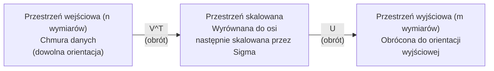
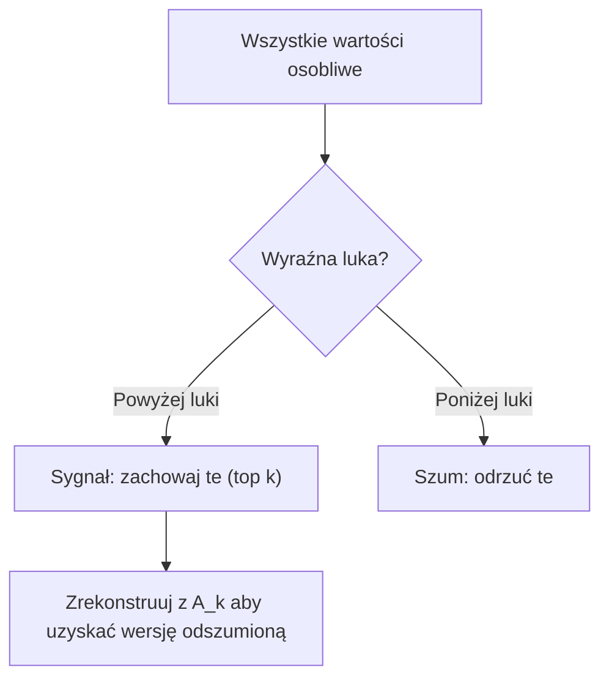

<think>The user wants me to translate this markdown document about Singular Value Decomposition (SVD) from English to Polish. I need to follow the strict rules provided:

1. Minimal intervention - translate faithfully, don't improve, don't shorten, don't change tone
2. Keep English: API, GPU, CPU, RAM, SQL, Python, PyTorch, TensorFlow, NumPy, BLAS, etc.
3. Keep English: machine learning, deep learning, neural network, transformer, attention, embedding, vector, matrix, tensor, gradient, loss function, optimizer, hyperparameter
4. Keep English: forward, backward, reshape, transpose, broadcast, softmax, einsum, etc.
5. "Learning Objectives" -> "Cele uczenia się"
6. "The Problem" -> "Problem"
7. "The Concept" -> "Koncepcja"
8. "Build It" -> "Zbuduj to"
9. "Use It" -> "Użyj tego"
10. "Ship It" -> "Dostarcz to"
11. "Exercises" -> "Ćwiczenia"
12. "Key Terms" -> "Kluczowe pojęcia"
13. "Further Reading" -> "Dalsza lektura"
14. CODE BLOCKS - DON'T TRANSLATE (leave as they are)
15. COMMAS before: że, bo, żeby, i (two independent sentences), który/która/które, a (contrast), więc, aż, zanim, gdy, albo, lub
16. POLISH DIACRITICS: fix all typos in Polish characters
17. URLs - leave unchanged

Let me translate this document carefully, maintaining all formatting and following the rules.</think>

# Rozkład według wartości osobliwych

> SVD to szwajcarski scyzoryk algebry liniowej. Każda macierz go ma. Każdy data scientist go potrzebuje.

**Typ:** Zbuduj to
**Języki:** Python, Julia
**Wymagania wstępne:** Faza 1, Lekcje 01 (Intuicja algebry liniowej), 02 (Operacje na wektorach i macierzach), 03 (Przekształcenia macierzowe)
**Czas:** ~120 minut

## Cele uczenia się

- Zaimplementuj SVD za pomocą iteracji potęgowej i wyjaśnij geometryczne znaczenie U, Sigma i V^T
- Zastosuj obcięty SVD do kompresji obrazu i zmierz współczynnik kompresji w porównaniu z błędem rekonstrukcji
- Oblicz pseudoodwrotność Moore'a-Penrose'a przez SVD, aby rozwiązać nadokreślone układy metodą najmniejszych kwadratów
- Połącz SVD z PCA, systemami rekomendacji (ukryte czynniki) i Ukrytą Analizą Semantyczną w NLP

## Problem

Masz macierz 1000x2000. Może to są oceny użytkowników dla filmów. Może to jest tablica częstości termin-dokument. Może to są wartości pikseli obrazu. Musisz ją skompresować, usunąć szum, znaleźć ukrytą strukturę lub rozwiązać układ równań metodą najmniejszych kwadratów. Rozkład według wartości własnych działa tylko dla macierzy kwadratowych. Nawet wtedy wymaga, aby macierz miała pełny zbiór liniowo niezależnych wektorów własnych.

SVD działa dla każdej macierzy. Dowolny kształt. Dowolny rząd. Bez warunków. Rozkłada macierz na trzy czynniki, które ujawniają geometrię tego, co macierz robi z przestrzenią. To najbardziej ogólny i najbardziej użyteczny rozkład w całej algebrze liniowej.

## Koncepcja

### Co SVD robi geometrycznie

Każda macierz, niezależnie od kształtu, wykonuje trzy operacje po kolei: obróć, skaluj, obróć. SVD czyni ten rozkład jawnym.

```
A = U * Sigma * V^T

      m x n     m x m    m x n    n x n
     (dowolna) (obrót)   (skala)  (obrót)
```

Dla dowolnej macierzy A, SVD rozkłada ją na:
- V^T obracza wektory w przestrzeni wejściowej (n-wymiarowej)
- Sigma skaluje wzdłuż każdej osi (rozciąga lub ściska)
- U obracza wynik w przestrzeni wyjściowej (m-wymiarowej)



Pomyśl o tym w ten sposób. Przekazujesz SVD macierz. Ono ci mówi: "Ta macierz bierze sferę wejść, najpierw obraca ją przez V^T, następnie rozciąga w elipsoidę przez Sigma, potem obraca elipsoidę przez U." Wartości osobliwe to długości osi elipsoidy.

### Pełny rozkład

Dla macierzy A o kształcie m x n:

```
A = U * Sigma * V^T

gdzie:
  U     jest m x m, ortogonalna (U^T U = I)
  Sigma jest m x n, diagonalna (wartości osobliwe na przekątnej)
  V     jest n x n, ortogonalna (V^T V = I)

Wartości osobliwe sigma_1 >= sigma_2 >= ... >= sigma_r > 0
gdzie r = rząd(A)
```

Kolumny U nazywamy lewymi wektorami osobliwymi. Kolumny V nazywamy prawymi wektorami osobliwymi. Elementy diagonalne Sigmy nazywamy wartościami osobliwymi. Zawsze są nieujemne i konwencjonalnie posortowane w kolejności malejącej.

### Lewwe wektory osobliwe, wartości osobliwe, prawe wektory osobliwe

Każda składowa SVD ma distinct geometryczne znaczenie.

**Prawe wektory osobliwe (kolumny V):** Te tworzą bazę ortonormalną przestrzeni wejściowej (R^n). To są kierunki w przestrzeni wejściowej, które macierz odwzorowuje na ortogonalne kierunki w przestrzeni wyjściowej. Myśl o nich jako o naturalnym układzie współrzędnych dla dziedziny.

**Wartości osobliwe (przekątna Sigmy):** To są współczynniki skalowania. i-ta wartość osobliwa mówi ci, ile macierz rozciąga wektory wzdłuż i-tego prawego wektora osobliwego. Wartość osobliwa równa zero oznacza, że macierz całkowicie zgniata ten kierunek.

**Lewe wektory osobliwe (kolumny U):** Te tworzą bazę ortonormalną przestrzeni wyjściowej (R^m). i-ty lewy wektor osobliwy to kierunek w przestrzeni wyjściowej, gdzie i-ty prawy wektor osobliwy trafia (po skalowaniu).

Związek między nimi:

```
A * v_i = sigma_i * u_i

Macierz A bierze i-ty prawy wektor osobliwy v_i,
skaluje go przez sigma_i i odwzorowuje na i-ty lewy wektor osobliwy u_i.
```

To daje ci obraz tego, co każda macierz robi, współrzędna po współrzędnej.

### Forma iloczynów zewnętrznych

SVD można zapisać jako sumę macierzy rzędu 1:

```
A = sigma_1 * u_1 * v_1^T + sigma_2 * u_2 * v_2^T + ... + sigma_r * u_r * v_r^T

Każdy składnik sigma_i * u_i * v_i^T to macierz rzędu 1 (iloczyn zewnętrzny).
Pełna macierz to suma r takich macierzy, gdzie r to rząd.
```

Ta forma jest fundamentem aproksymacji niskiego rzędu. Każdy składnik dodaje jedną warstwę struktury. Pierwszy składnik chwyta najważniejszy wzorzec. Drugi chwyta następny najważniejszy. I tak dalej. Obcięcie tej sumy daje najlepszą możliwą aproksymację przy dowolnym rzędzie.

```
Aproksymacja rzędu 1:   A_1 = sigma_1 * u_1 * v_1^T
                         (chwyta dominujący wzorzec)

Aproksymacja rzędu 2:   A_2 = sigma_1 * u_1 * v_1^T + sigma_2 * u_2 * v_2^T
                         (chwyta dwa najważniejsze wzorce)

Aproksymacja rzędu k:   A_k = suma top k składników
                         (optymalna według twierdzenia Eckarta-Younga)
```

### Związek z rozkładem według wartości własnych

SVD i rozkład według wartości własnych są głęboko połączone. Wartości osobliwe i wektory osobliwe A pochodzą bezpośrednio z wartości własnych i wektorów własnych A^T A i A A^T.

```
A^T A = V * Sigma^T * U^T * U * Sigma * V^T
      = V * Sigma^T * Sigma * V^T
      = V * D * V^T

gdzie D = Sigma^T * Sigma to macierz diagonalna z sigma_i^2 na przekątnej.

Więc:
- Prawe wektory osobliwe (V) to wektory własne A^T A
- Kwadraty wartości osobliwych (sigma_i^2) to wartości własne A^T A

Podobnie:
A A^T = U * Sigma * V^T * V * Sigma^T * U^T
      = U * Sigma * Sigma^T * U^T

Więc:
- Lewe wektory osobliwe (U) to wektory własne A A^T
- Wartości własne A A^T to również sigma_i^2
```

Ten związek mówi ci trzy rzeczy:
1. Wartości osobliwe są zawsze rzeczywiste i nieujemne (są pierwiastkami kwadratowymi wartości własnych macierzy półokreślonej dodatnio).
2. Możesz obliczyć SVD przez rozkład według wartości własnych A^T A, ale to podnosi do kwadratu wskaźnik uwarunkowania i traci precyzję numeryczną. Dedykowane algorytmy SVD tego unikają.
3. Gdy A jest kwadratowa i symetryczna półokreślona dodatnio, SVD i rozkład według wartości własnych to to samo.

### Obcięty SVD: aproksymacja niskiego rzędu

Twierdzenie Eckarta-Younga-Mirsky'ego mówi, że najlepsza aproksymacja rzędu k dla A (zarówno w normie Frobeniusa, jak i spektralnej) jest uzyskiwana przez zachowanie tylko top k wartości osobliwych i odpowiadających im wektorów:

```
A_k = U_k * Sigma_k * V_k^T

gdzie:
  U_k     to m x k  (pierwsze k kolumn U)
  Sigma_k to k x k  (lewy górny blok k x k Sigmy)
  V_k     to n x k  (pierwsze k kolumn V)

Błąd aproksymacji = sigma_{k+1}  (w normie spektralnej)
                  = sqrt(sigma_{k+1}^2 + ... + sigma_r^2)  (w normie Frobeniusa)
```

To nie jest "dobrą" aproksymacją. To jest udowodnialnie najlepsza możliwa aproksymacja rzędu k. Żadna inna macierz rzędu k nie jest bliższa A.

| Składowa | Względna wielkość | Zachowana w aproksymacji rzędu 3? |
|-----------|-------------------|-----------------------------------|
| sigma_1 | Największa | Tak |
| sigma_2 | Duża | Tak |
| sigma_3 | Średnio-duża | Tak |
| sigma_4 | Średnia | Nie (błąd) |
| sigma_5 | Średnio-mała | Nie (błąd) |
| sigma_6 | Mała | Nie (błąd) |
| sigma_7 | Bardzo mała | Nie (błąd) |
| sigma_8 |Minimalna | Nie (błąd) |

Zachowaj top 3: A_3 chwyta trzy największe wartości osobliwe. Błąd = pozostałe wartości (sigma_4 przez sigma_8).

Jeśli wartości osobliwe szybko zanikają, małe k chwyta większość macierzy. Jeśli zanikają wolno, macierz nie ma struktury niskiego rzędu.

### Kompresja obrazu z SVD

Obraz w skali szarości to macierz intensywności pikseli. Obraz 800x600 ma 480 000 wartości. SVD pozwala aproksymować go znacznie mniejszą liczbą.

```
Oryginalny obraz: 800 x 600 = 480 000 wartości

SVD z rzędem k:
  U_k:      800 x k wartości
  Sigma_k:  k wartości
  V_k:      600 x k wartości
  Suma:     k * (800 + 600 + 1) = k * 1401 wartości

  k=10:   14 010 wartości   (2,9% oryginału)
  k=50:   70 050 wartości  (14,6% oryginału)
  k=100: 140 100 wartości  (29,2% oryginału)

  Współczynnik kompresji poprawia się wraz ze zmniejszaniem k,
  ale jakość wizualna się pogarsza.
```

Kluczowy wgląd: naturalne obrazy mają szybko zanikające wartości osobliwe. Pierwsze kilka wartości osobliwych chwytają ogólną strukturę (kształty, gradienty). Późniejsze chwytają drobne szczegóły i szum. Obcięcie przy rzędzie 50 często produkuje obraz, który wygląda prawie identycznie jak oryginalny, przy użyciu 85% mniej pamięci.

### SVD dla systemów rekomendacji

To spopularyzował Netflix Prize. Masz macierz ocen użytkownik-film, gdzie większość wpisów brakuje.

```
             Film1   Film2   Film3   Film4   Film5
  Użytkownik1 [  5      ?       3       ?       1  ]
  Użytkownik2 [  ?      4       ?       2       ?  ]
  Użytkownik3 [  3      ?       5       ?       ?  ]
  Użytkownik4 [  ?      ?       ?       4       3  ]

  ? = nieznana ocena
```

Idea: ta macierz ocen ma niski rząd. Użytkownicy nie mają całkowicie niezależnych gustów. Jest garść ukrytych czynników (akcja vs. dramat, stary vs. nowy, intelektualny vs. wizceralny), które wyjaśniają większość preferencji.

SVD na (wypełnionej) macierzy ocen rozkłada ją na:
- U: profile użytkowników w przestrzeni ukrytych czynników
- Sigma: ważność każdego ukrytego czynnika
- V^T: profile filmów w przestrzeni ukrytych czynników

Przewidywana ocena użytkownika dla filmu to iloczyn skalarny profilu użytkownika z profilem filmu (ważony wartościami osobliwymi). Aproksymacja niskiego rzędu wypełnia brakujące wpisy.

W praktyce używa się wariantów jak inkrementalny SVD Simona Funka lub ALS (naprzemienne najmniejsze kwadraty), które obsługują brakujące dane bezpośrednio. Ale główna idea jest ta sama: rozkład na ukryte czynniki przez SVD.

### SVD w NLP: Ukryta Analiza Semantyczna

Ukryta Analiza Semantyczna (LSA), zwana też Indeksowaniem Semantycznym Ukrytym (LSI), stosuje SVD do macierzy termin-dokument.

```
             Dok1   Dok2   Dok3   Dok4
  "kot"      [  3      0      1      0  ]
  "pies"     [  2      0      0      1  ]
  "ryba"     [  0      4      1      0  ]
  "zwierzę"  [  1      1      1      1  ]
  "ocean"    [  0      3      0      0  ]

Po SVD z rzędem k=2:

  Każdy dokument staje się punktem w 2D "przestrzeni koncepcji."
  Każdy termin staje się punktem w tej samej 2D przestrzeni.
  Dokumenty o podobnych tematach grupują się razem.
  Terminy o podobnych znaczeniach grupują się razem.

  "kot" i "pies" kończą blisko siebie (zwierzęta lądowe).
  "ryba" i "ocean" kończą blisko siebie (koncepcje wodne).
  Dok1 i Dok3 grupują się jeśli mają podobne tematy.
```

LSA była jedną z pierwszych udanych metod chwytania podobieństwa semantycznego z surowego tekstu. Działa, bo terminy synonimiczne mają tendencję do pojawiania się w podobnych dokumentach, więc SVD grupuje je w te same ukryte wymiary. Nowoczesne osadzenia słów (Word2Vec, GloVe) można postrzegać jako potomków tej idei.

### SVD do redukcji szumu

Zaszumione dane mają sygnał skoncentrowany w top wartościach osobliwych i szum rozłożony na wszystkie wartości osobliwe. Obcięcie usuwa podłogę szumu.

**Czyste wartości osobliwe sygnału:**

| Składowa | Wielkość | Typ |
|-----------|-----------|------|
| sigma_1 | Bardzo duża | Sygnał |
| sigma_2 | Duża | Sygnał |
| sigma_3 | Średnia | Sygnał |
| sigma_4 | Blisko zera | Znikome |
| sigma_5 | Blisko zera | Znikome |

**Zaszumione wartości osobliwe sygnału (szum dodaje do wszystkich):**

| Składowa | Wielkość | Typ |
|-----------|-----------|------|
| sigma_1 | Bardzo duża | Sygnał |
| sigma_2 | Duża | Sygnał |
| sigma_3 | Średnia | Sygnał |
| sigma_4 | Mała | Szum |
| sigma_5 | Mała | Szum |
| sigma_6 | Mała | Szum |
| sigma_7 | Mała | Szum |



To jest używane w przetwarzaniu sygnałów, pomiarach naukowych i czyszczeniu danych. Kiedykolwiek masz macierz skorumpowaną przez szum addytywny, obcięty SVD to zasadowy sposób separacji sygnału od szumu.

### Pseudoodwrotność przez SVD

Pseudoodwrotność Moore'a-Penrose'a A+ uogólnia odwracanie macierzy na macierze niekwadratowe i osobliwe. SVD czyni jej obliczanie trywialnym.

```
Jeśli A = U * Sigma * V^T, to:

A+ = V * Sigma+ * U^T

gdzie Sigma+ jest tworzona przez:
  1. Transponuj Sigma (zamień wiersze i kolumny)
  2. Zastąp każdy niezerowy wpis diagonalny sigma_i przez 1/sigma_i
  3. Zostaw zera jako zera

Dla A (m x n):      A+ jest (n x m)
Dla Sigma (m x n):  Sigma+ jest (n x m)
```

Pseudoodwrotność rozwiązuje problemy najmniejszych kwadratów. Jeśli Ax = b nie ma dokładnego rozwiązania (nadokreślony układ), to x = A+ b jest rozwiązaniem metodą najmniejszych kwadratów (minimalizuje ||Ax - b||).

```
Nadokreślony układ (więcej równań niż niewiadomych):

  [1  1]         [3]
  [2  1] x   =   [5]       Dokładne rozwiązanie nie istnieje.
  [3  1]         [6]

  x_ls = A+ b = V * Sigma+ * U^T * b

  To daje x który minimalizuje sumę kwadratów residuów.
  Ten sam wynik co normalne równania (A^T A)^(-1) A^T b,
  ale numerycznie bardziej stabilny.
```

### Zalety stabilności numerycznej

Obliczanie rozkładu według wartości własnych A^T A podnosi do kwadratu wartości osobliwe (wartości własne A^T A to sigma_i^2). To podnosi do kwadratu wskaźnik uwarunkowania, amplifikując błędy numeryczne.

```
Przykład:
  A ma wartości osobliwe [1000, 1, 0,001]
  Wskaźnik uwarunkowania A: 1000 / 0,001 = 10^6

  A^T A ma wartości własne [10^6, 1, 10^{-6}]
  Wskaźnik uwarunkowania A^T A: 10^6 / 10^{-6} = 10^{12}

  Obliczanie SVD bezpośrednio: działa ze wskaźnikiem uwarunkowania 10^6
  Obliczanie przez A^T A:      działa ze wskaźnikiem uwarunkowania 10^{12}
                                (6 dodatkowych cyfr precyzji stracone)
```

Nowoczesne algorytmy SVD (dwukierunkowa diagonalizacja Goluba-Kahana) działają bezpośrednio na A, nigdy nie tworząc A^T A. Dlatego powinieneś zawsze woleć `np.linalg.svd(A)` niż `np.linalg.eig(A.T @ A)`.

### Połączenie z PCA

PCA TO SVD na scentrowanych danych. To nie jest analogia. To dosłownie te same obliczenia.

```
Dana macierz danych X (n_próbek x n_cech), scentrowana (średnia odjęta):

Macierz kowariancji: C = (1/(n-1)) * X^T X

PCA znajduje wektory własne C. Ale:

  X = U * Sigma * V^T    (SVD X)

  X^T X = V * Sigma^2 * V^T

  C = (1/(n-1)) * V * Sigma^2 * V^T

Więc główne składowe to dokładnie prawe wektory osobliwe V.
Wariancja wyjaśniona dla każdej składowej to sigma_i^2 / (n-1).

W sklearn, PCA jest implementowane używając SVD, nie rozkładu według wartości własnych.
Jest szybsze i numerycznie bardziej stabilne.
```

To oznacza, że wszystko czego się nauczyłeś o redukcji wymiarowości w Lekcji 10 to SVD pod maską. PCA to najczęstsze zastosowanie SVD w machine learning.

## Zbuduj to

### Krok 1: SVD od zera używając iteracji potęgowej

Idea: aby znaleźć największą wartość osobliwą i jej wektory, użyj iteracji potęgowej na A^T A (lub A A^T). Następnie zdefluj macierz i powtórz dla następnej wartości osobliwej.

```python
import numpy as np

def power_iteration(M, num_iters=100):
    n = M.shape[1]
    v = np.random.randn(n)
    v = v / np.linalg.norm(v)

    for _ in range(num_iters):
        Mv = M @ v
        v = Mv / np.linalg.norm(Mv)

    eigenvalue = v @ M @ v
    return eigenvalue, v

def svd_from_scratch(A, k=None):
    m, n = A.shape
    if k is None:
        k = min(m, n)

    sigmas = []
    us = []
    vs = []

    A_residual = A.copy().astype(float)

    for _ in range(k):
        AtA = A_residual.T @ A_residual
        eigenvalue, v = power_iteration(AtA, num_iters=200)

        if eigenvalue < 1e-10:
            break

        sigma = np.sqrt(eigenvalue)
        u = A_residual @ v / sigma

        sigmas.append(sigma)
        us.append(u)
        vs.append(v)

        A_residual = A_residual - sigma * np.outer(u, v)

    U = np.column_stack(us) if us else np.empty((m, 0))
    S = np.array(sigmas)
    V = np.column_stack(vs) if vs else np.empty((n, 0))

    return U, S, V
```

### Krok 2: Testuj i porównaj z NumPy

```python
np.random.seed(42)
A = np.random.randn(5, 4)

U_ours, S_ours, V_ours = svd_from_scratch(A)
U_np, S_np, Vt_np = np.linalg.svd(A, full_matrices=False)

print("Nasze wartości osobliwe:", np.round(S_ours, 4))
print("NumPy wartości osobliwe:", np.round(S_np, 4))

A_reconstructed = U_ours @ np.diag(S_ours) @ V_ours.T
print(f"Błąd rekonstrukcji: {np.linalg.norm(A - A_reconstructed):.8f}")
```

### Krok 3: Demo kompresji obrazu

```python
def compress_image_svd(image_matrix, k):
    U, S, Vt = np.linalg.svd(image_matrix, full_matrices=False)
    compressed = U[:, :k] @ np.diag(S[:k]) @ Vt[:k, :]
    return compressed

image = np.random.seed(42)
rows, cols = 200, 300
image = np.random.randn(rows, cols)

for k in [1, 5, 10, 20, 50]:
    compressed = compress_image_svd(image, k)
    error = np.linalg.norm(image - compressed) / np.linalg.norm(image)
    original_size = rows * cols
    compressed_size = k * (rows + cols + 1)
    ratio = compressed_size / original_size
    print(f"k={k:>3d}  error={error:.4f}  storage={ratio:.1%}")
```

### Krok 4: Redukcja szumu

```python
np.random.seed(42)
clean = np.outer(np.sin(np.linspace(0, 4*np.pi, 100)),
                 np.cos(np.linspace(0, 2*np.pi, 80)))
noise = 0.3 * np.random.randn(100, 80)
noisy = clean + noise

U, S, Vt = np.linalg.svd(noisy, full_matrices=False)
denoised = U[:, :5] @ np.diag(S[:5]) @ Vt[:5, :]

print(f"Błąd przy szumie:      {np.linalg.norm(noisy - clean):.4f}")
print(f"Błąd po odszumieniu:  {np.linalg.norm(denoised - clean):.4f}")
print(f"Poprawa:             {(1 - np.linalg.norm(denoised - clean) / np.linalg.norm(noisy - clean)):.1%}")
```

### Krok 5: Pseudoodwrotność

```python
A = np.array([[1, 1], [2, 1], [3, 1]], dtype=float)
b = np.array([3, 5, 6], dtype=float)

U, S, Vt = np.linalg.svd(A, full_matrices=False)
S_inv = np.diag(1.0 / S)
A_pinv = Vt.T @ S_inv @ U.T

x_svd = A_pinv @ b
x_lstsq = np.linalg.lstsq(A, b, rcond=None)[0]
x_pinv = np.linalg.pinv(A) @ b

print(f"Rozwiązanie SVD pseudoodwrotności:  {x_svd}")
print(f"Rozwiązanie np.linalg.lstsq:       {x_lstsq}")
print(f"Rozwiązanie np.linalg.pinv:         {x_pinv}")
```

## Użyj tego

Pełne działające dema są w `code/svd.py`. Uruchom je, aby zobaczyć SVD zastosowane do kompresji obrazu, systemów rekomendacji, ukrytej analizy semantycznej i redukcji szumu.

```bash
python svd.py
```

Wersja w Julii w `code/svd.jl` demonstruje te same koncepcje używając macierzystej funkcji `svd()` i pakietu `LinearAlgebra`.

```bash
julia svd.jl
```

## Dostarcz to

Ta lekcja wytwarza:
- `outputs/skill-svd.md` - umiejętność wiedzenia kiedy i jak stosować SVD w prawdziwych projektach

## Ćwiczenia

1. Zaimplementuj pełny SVD od zera bez używania iteracji potęgowej. Zamiast tego oblicz rozkład według wartości własnych A^T A aby uzyskać V i wartości osobliwe, następnie oblicz U = A V Sigma^{-1}. Porównaj dokładność numeryczną z twoją wersją iteracji potęgowej i z NumPy.

2. Wczytaj prawdziwy obraz w skali szarości (lub przekonwertuj kolorowy). Skompresuj go przy rzędach 1, 5, 10, 25, 50, 100. Dla każdego rzędu oblicz współczynnik kompresji i błąd względny. Znajdź rząd, przy którym obraz staje się wizualnie akceptowalny.

3. Zbuduj mały system rekomendacji. Stwórz macierz ocen użytkownik-film 10x8 z kilkoma znanymi wpisami. Wypełnij brakujące wpisy średnimi wierszy. Oblicz SVD i zrekonstruuj aproksymację rzędu 3. Użyj zrekonstruowanej macierzy do przewidywania brakujących ocen. Zweryfikuj, że przewidywania są rozsądne.

4. Stwórz macierz termin-dokument 100x50 z 3 syntetycznymi tematami. Każdy temat ma 5 powiązanych terminów. Dodaj szum. Zastosuj SVD i zweryfikuj, że top 3 wartości osobliwe są znacznie większe niż pozostałe. Projektuj dokumenty w 3D przestrzeni ukrytej i sprawdź, czy dokumenty z tego samego tematu grupują się razem.

5. Wygeneruj czystą macierz niskiego rzędu (rząd 3, rozmiar 50x40) i dodaj szum Gaussowski przy różnych poziomach (sigma = 0,1, 0,5, 1,0, 2,0). Dla każdego poziomu szumu znajdź optymalny rząd obcięcia przez przeskanowanie k od 1 do 40 i mierzenie błędu rekonstrukcji względem czystej macierzy. Narysuj wykres jak optymalne k zmienia się wraz z poziomem szumu.

## Kluczowe pojęcia

| Termin | Co ludzie mówią | Co to faktycznie oznacza |
|--------|----------------|----------------------|
| SVD | "Rozłóż dowolną macierz" | Rozłóż A na U Sigma V^T gdzie U i V są ortogonalne, a Sigma jest diagonalna z nieujemnymi wpisami. Działa dla każdej macierzy dowolnego kształtu. |
| Wartość osobliwa | "Jak ważna jest ta składowa" | i-ty wpis diagonalny Sigmy. Mierzy ile macierz rozciąga wzdłuż i-tego głównego kierunku. Zawsze nieujemna, posortowana w kolejności malejącej. |
| Lewy wektor osobliwy | "Kierunek wyjściowy" | Kolumna U. Kierunek w przestrzeni wyjściowej, gdzie i-ty prawy wektor osobliwy trafia (po skalowaniu przez sigma_i). |
| Prawy wektor osobliwy | "Kierunek wejściowy" | Kolumna V. Kierunek w przestrzeni wejściowej, który macierz odwzorowuje na i-ty lewy wektor osobliwy (po skalowaniu przez sigma_i). |
| Obcięty SVD | "Aproksymacja niskiego rzędu" | Zachowaj tylko top k wartości osobliwych i ich wektory. Produkuje udowodnialnie najlepszą aproksymację rzędu k dla oryginalnej macierzy (twierdzenie Eckarta-Younga). |
| Rząd | "Prawdziwa wymiarowość" | Liczba niezerowych wartości osobliwych. Mówi ile niezależnych kierunków macierz faktycznie używa. |
| Pseudoodwrotność | "Uogólniona odwrotność" | V Sigma+ U^T. Odwraca niezerowe wartości osobliwe, zera zostawia jako zera. Rozwiązuje problemy najmniejszych kwadratów dla macierzy niekwadratowych lub osobliwych. |
| Wskaźnik uwarunkowania | "Jak wrażliwa na błędy" | sigma_max / sigma_min. Duży wskaźnik uwarunkowania oznacza, że małe zmiany wejściowe powodują duże zmiany wyjściowe. SVD ujawnia to bezpośrednio. |
| Ukryty czynnik | "Ukryta zmienna" | Wymiar w przestrzeni niskiego rzędu odkryty przez SVD. W rekomendacjach ukryty czynnik może odpowiadać preferencji gatunku. W NLP może odpowiadać tematowi. |
| Norma Frobeniusa | "Całkowity rozmiar macierzy" | Pierwiastek kwadratowy z sumy kwadratów wpisów. Równa się pierwiastkowi kwadratowemu z sumy kwadratów wartości osobliwych. Używana do mierzenia błędu aproksymacji. |
| Twierdzenie Eckarta-Younga | "SVD daje najlepszą kompresję" | Dla dowolnego docelowego rzędu k, obcięty SVD minimalizuje błąd aproksymacji spośród wszystkich możliwych macierzy rzędu k. |
| Iteracja potęgowa | "Znajdź największy wektor własny" | Wielokrotnie mnożenie losowego wektora przez macierz i normalizacja. Zbiega do wektora własnego z największą wartością własną. Element budujący wielu algorytmów SVD. |

## Dalsza lektura

- [Gilbert Strang: Linear Algebra and Its Applications, Chapter 7](https://math.mit.edu/~gs/linearalgebra/) - wyczerpujące omówienie SVD z zastosowaniami
- [3Blue1Brown: But what is the SVD?](https://www.youtube.com/watch?v=vSczTbgc8Rc) - geometryczna intuicja SVD
- [We Recommend a Singular Value Decomposition](https://www.ams.org/publicoutreach/feature-column/fcarc-svd) - przystępny przegląd od American Mathematical Society
- [Netflix Prize and Matrix Factorization](https://sifter.org/~simon/journal/20061211.html) - oryginalny post blogowy Simona Funka o SVD dla rekomendacji
- [Latent Semantic Analysis](https://en.wikipedia.org/wiki/Latent_semantic_analysis) - oryginalne zastosowanie SVD w NLP
- [Numerical Linear Algebra by Trefethen and Bau](https://people.maths.ox.ac.uk/trefethen/text.html) - złoty standard dla zrozumienia algorytmów SVD i ich właściwości numerycznych