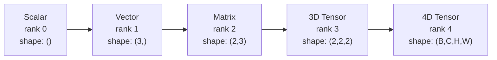
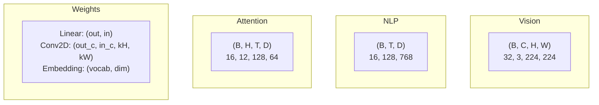
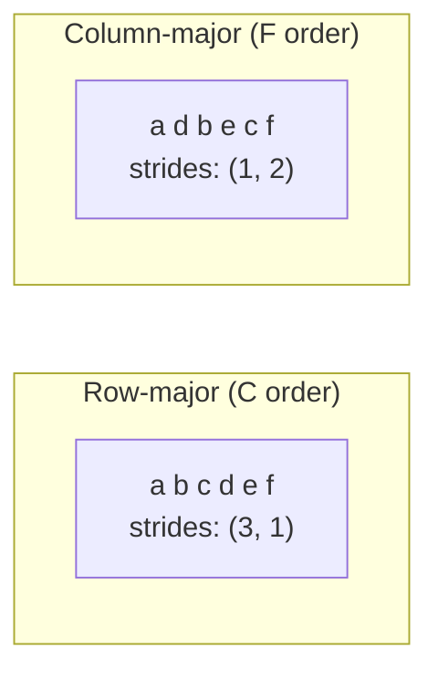
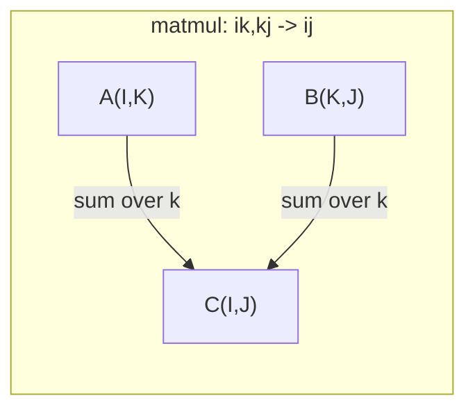

<think>The user wants me to translate this technical document about tensor operations from English to Polish. I need to follow the rules provided:

1. MINIMAL INTERVENTION - translate faithfully, don't improve, shorten, or change tone
2. Keep technical terms in English: API, GPU, CPU, RAM, SQL, Python, PyTorch, TensorFlow, NumPy, BLAS, machine learning, deep learning, neural network, transformer, attention, embedding, vector, matrix, tensor, gradient, loss function, optimizer, hyperparameter, forward, backward, reshape, transpose, broadcast, softmax, einsum, etc.
3. Translate specific phrases: "Learning Objectives" -> "Cele uczenia sie", "The Problem" -> "Problem", "The Concept" -> "Koncepcja", "Build It" -> "Zbuduj to", "Use It" -> "Uzyj tego", "Ship It" -> "Dostarcz to", "Exercises" -> "Cwiczenia", "Key Terms" -> "Kluczowe pojecia", "Further Reading" -> "Dalsza lektura"
4. Keep code blocks as-is (don't translate)
5. Polish commas before: ze, bo, zeby, i (two independent sentences), ktory/ktora/ktore, a (contrast), wiec, az, zanim, gdy, albo, lub
6. Polish diacritics - fix typos in Polish characters
7. Keep URLs unchanged

Let me translate this carefully.</think>

# Operacje na tensorach

> Tensory sa wspolnym jezykiem pomiedzy danymi a deep learning. Kazdy obraz, kazde zdanie, kazdy gradient przeplywa przez nie.

**Typ:** Zbuduj
**Jezyk:** Python
**Wymagania wstepne:** Phase 1, Lesson 01 (Intuicja algebry liniowej), 02 (Wektory, Macierze i Operacje)
**Czas:** ~90 minut

## Cele uczenia sie

- Zaimplementuj klase tensor z ksztaltem, skokami, reshape, transpose i operacjami elementowym od zera
- Zastosuj reguly broadcastingu do operowania na tensorach roznych ksztaltow bez kopiowania danych
- Napisz wyrazenia einsum dla iloczynow skalarnych, mnozenia macierzy, produktow zewnetrznych i operacji wsadowych
- Sledz dokladne ksztalty tensorow przez kazdy krok multi-head attention

## Problem

Budujesz transformer. Forward pass wyglada czysto. Uruchamiasz i dostajesz: `RuntimeError: mat1 and mat2 shapes cannot be multiplied (32x768 and 512x768)`. Wpatrujesz sie w ksztalty. Probujesz transpose. Teraz mowi `Expected 4D input (got 3D input)`. Dodajesz unsqueeze. Cos innego sie psuje.

Bledy ksztaltow to najczestsze bugi w kodzie deep learning. Nie sa trudne koncepcyjnie -- kazda operacja ma kontrakt ksztaltu -- ale mnoza sie szybko. Transformer ma dziesiatki reshape, transpose i broadcastow wsiazanych ze soba. Jeden zly axis i blad sie kaskaduje. Co gorsza, niektore bledy ksztaltow w ogole nie rzucaja bledow. Cicho produkuj smieci przez broadcasting po zlym wymiarze lub sumowanie po zlym axis.

Macierze obsluguja parewise relationships miedzy dwoma zbiorami rzeczy. Rzeczywiste dane nie mieszcza sie w dwoch wymiarach. Batch 32 obrazow RGB w 224x224 to tensor 4D: `(32, 3, 224, 224)`. Self-attention z 12 heads to tez 4D: `(batch, heads, seq_len, head_dim)`. Potrzebujesz struktury danych, ktora uogolnia sie na dowolna liczbe wymiarow, z operacjami, ktore skladaja sie czysto przez wszystkie. Ta struktura to tensor. Zapanuj nad jego operacjami i bledy ksztaltow staja sie trywialnie debugowalne.

## Koncepcja

### Czym jest tensor

Tensor to wielowymiarowa tablica liczb o jednolitym typie danych. Liczba wymiarow to **rank** (lub **order**). Kazdy wymiar to **axis**. **Shape** to krotka okreslajaca rozmiar wzdluz kazdego axis.



Calkowita liczba elementow = iloczyn wszystkich rozmiarow. Shape `(2, 3, 4)` trzyma `2 * 3 * 4 = 24` elementow.

### Ksztalty tensorow w deep learning

Rozne typy danych mapuja do konkretnych ksztaltow tensorow konwencjonalnie.



PyTorch uzywa NCHW (channels-first). TensorFlow domyslnie NHWC (channels-last). Niezgodne layouty powoduja ciche spowolnienia lub bledy.

### Jak dziala pamiec layout

Tablica 2D w pamieci to 1D sekwencja bajtow. **Strides** mowia ile elementow przeskoczyc, zeby przesunac sie o jeden krok wzdluz kazdego axis.



Transpose nie przesuwa danych. Zamienia strides, co czyni tensor **non-contiguous** -- elementy wiersza nie sa juz przylegle w pamieci.

### Reguly broadcastingu

Broadcasting pozwala operowac na tensorach roznych ksztaltow bez kopiowania danych. Wyrównaj ksztalty od prawej. Dwa wymiary sa kompatybilne gdy sa rowne lub jeden to 1. Mniej wymiarow dostaje padding z 1 po lewej.

```
Tensor A:     (8, 1, 6, 1)
Tensor B:        (7, 1, 5)
Padded B:     (1, 7, 1, 5)
Result:       (8, 7, 6, 5)
```

### Einsum: uniwersalna operacja tensorowa

Einstein summation etykietuje kazdy axis litera. Axes w input ale nie w output sa sumowane. Axes w obu sa zachowane.



Kluczowe wzorce: `i,i->` (iloczyn skalarny), `i,j->ij` (produkt zewnetrzny), `ii->` (trace), `ij->ji` (transpose), `bij,bjk->bik` (batch matmul), `bhtd,bhsd->bhts` (attention scores).

## Zbuduj to

Kod zyje w `code/tensors.py`. Kazdy krok odwoluje sie do implementacji tam.

### Krok 1: Tensor storage i strides

Tensor przechowuje plaska liste liczb plus metadata ksztaltu. Strides mowia logice indeksowania jak mapowac wielowymiarowe indeksy na plaskie pozycje.

```python
class Tensor:
    def __init__(self, data, shape=None):
        if isinstance(data, (list, tuple)):
            self._data, self._shape = self._flatten_nested(data)
        elif isinstance(data, np.ndarray):
            self._data = data.flatten().tolist()
            self._shape = tuple(data.shape)
        else:
            self._data = [data]
            self._shape = ()

        if shape is not None:
            total = reduce(lambda a, b: a * b, shape, 1)
            if total != len(self._data):
                raise ValueError(
                    f"Cannot reshape {len(self._data)} elements into shape {shape}"
                )
            self._shape = tuple(shape)

        self._strides = self._compute_strides(self._shape)

    @staticmethod
    def _compute_strides(shape):
        if len(shape) == 0:
            return ()
        strides = [1] * len(shape)
        for i in range(len(shape) - 2, -1, -1):
            strides[i] = strides[i + 1] * shape[i + 1]
        return tuple(strides)
```

Dla shape `(3, 4)`, strides to `(4, 1)` -- przeskocz 4 elementy, zeby przesunac sie o jeden wiersz, przeskocz 1 element, zeby przesunac sie o jedna kolumne.

### Krok 2: Reshape, squeeze, unsqueeze

Reshape zmienia shape bez zmiany kolejnosci elementow. Calkowita liczba elementow musi pozostac ta sama. Uzyj `-1` dla jednego wymiaru, zeby wywnioskowac jego rozmiar.

```python
t = Tensor(list(range(12)), shape=(2, 6))
r = t.reshape((3, 4))
r = t.reshape((-1, 3))
```

Squeeze usuwa axes rozmiaru 1. Unsqueeze wstawia jeden. Unsqueezing jest krytyczny dla broadcastingu -- wektor bias `(D,)` dodany do batch `(B, T, D)` potrzebuje unsqueeze do `(1, 1, D)`.

```python
t = Tensor(list(range(6)), shape=(1, 3, 1, 2))
s = t.squeeze()
v = Tensor([1, 2, 3])
u = v.unsqueeze(0)
```

### Krok 3: Transpose i permute

Transpose zamienia dwa axes. Permute zmienia kolejnosc wszystkich axes. To jak konwertujesz miedzy NCHW a NHWC.

```python
mat = Tensor(list(range(6)), shape=(2, 3))
tr = mat.transpose(0, 1)

t4d = Tensor(list(range(24)), shape=(1, 2, 3, 4))
perm = t4d.permute((0, 2, 3, 1))
```

Po transpose lub permute tensor jest non-contiguous w pamieci. W PyTorch `view` failuje na non-contiguous tensorach -- uzyj `reshape` lub wywolaj `.contiguous()` najpierw.

### Krok 4: Operacje elementowe i redukcje

Operacje elementowe (add, multiply, subtract) stosuja sie niezaleznie do kazdego elementu i preservuja shape. Redukcje (sum, mean, max) kolapsuja jeden lub wiecej axes.

```python
a = Tensor([[1, 2], [3, 4]])
b = Tensor([[10, 20], [30, 40]])
c = a + b
d = a * 2
s = a.sum(axis=0)
```

Global average pooling w CNN: `(B, C, H, W).mean(axis=[2, 3])` produkuje `(B, C)`. Sequence mean pooling w NLP: `(B, T, D).mean(axis=1)` produkuje `(B, D)`.

### Krok 5: Broadcasting z NumPy

Funkcja `demo_broadcasting_numpy()` w `tensors.py` pokazuje core patterns.

```python
activations = np.random.randn(4, 3)
bias = np.array([0.1, 0.2, 0.3])
result = activations + bias

images = np.random.randn(2, 3, 4, 4)
scale = np.array([0.5, 1.0, 1.5]).reshape(1, 3, 1, 1)
result = images * scale

a = np.array([1, 2, 3]).reshape(-1, 1)
b = np.array([10, 20, 30, 40]).reshape(1, -1)
outer = a * b
```

Pairwise distance przez broadcasting: reshape `(M, 2)` do `(M, 1, 2)` i `(N, 2)` do `(1, N, 2)`, odejmij, podnies do kwadratu, sum po ostatnim axis, wez pierwiastek kwadratowy. Result: `(M, N)`.

### Krok 6: Operacje einsum

Funkcje `demo_einsum()` i `demo_einsum_gallery()` przechodza przez kazdy common pattern.

```python
a = np.array([1.0, 2.0, 3.0])
b = np.array([4.0, 5.0, 6.0])
dot = np.einsum("i,i->", a, b)

A = np.array([[1, 2], [3, 4], [5, 6]], dtype=float)
B = np.array([[7, 8, 9], [10, 11, 12]], dtype=float)
matmul = np.einsum("ik,kj->ij", A, B)

batch_A = np.random.randn(4, 3, 5)
batch_B = np.random.randn(4, 5, 2)
batch_mm = np.einsum("bij,bjk->bik", batch_A, batch_B)
```

Koszt obliczeniowy kontraacji to iloczyn wszystkich rozmiarow indeksow (kept i summed). Dla `bij,bjk->bik` z B=32, I=128, J=64, K=128: `32 * 128 * 64 * 128 = 33,554,432` mnozen-dodawan.

### Krok 7: Mechanizm attention przez einsum

Funkcja `demo_attention_einsum()` implementuje multi-head attention end to end.

```python
B, H, T, D = 2, 4, 8, 16
E = H * D

X = np.random.randn(B, T, E)
W_q = np.random.randn(E, E) * 0.02

Q = np.einsum("bte,ek->btk", X, W_q)
Q = Q.reshape(B, T, H, D).transpose(0, 2, 1, 3)

scores = np.einsum("bhtd,bhsd->bhts", Q, K) / np.sqrt(D)
weights = softmax(scores, axis=-1)
attn_output = np.einsum("bhts,bhsd->bhtd", weights, V)

concat = attn_output.transpose(0, 2, 1, 3).reshape(B, T, E)
output = np.einsum("bte,ek->btk", concat, W_o)
```

Kazdy krok to operacja tensorowa: projekcja (matmul przez einsum), head splitting (reshape + transpose), attention scores (batch matmul przez einsum), weighted sum (batch matmul przez einsum), head merging (transpose + reshape), output projekcja (matmul przez einsum).

## Uzyj tego

### Scratch vs NumPy

| Operacja | Scratch (klasa Tensor) | NumPy |
|---|---|---|
| Create | `Tensor([[1,2],[3,4]])` | `np.array([[1,2],[3,4]])` |
| Reshape | `t.reshape((3,4))` | `a.reshape(3,4)` |
| Transpose | `t.transpose(0,1)` | `a.T` lub `a.transpose(0,1)` |
| Squeeze | `t.squeeze(0)` | `np.squeeze(a, 0)` |
| Sum | `t.sum(axis=0)` | `a.sum(axis=0)` |
| Einsum | N/A | `np.einsum("ij,jk->ik", a, b)` |

### Scratch vs PyTorch

```python
import torch

t = torch.tensor([[1, 2, 3], [4, 5, 6]], dtype=torch.float32)
t.shape
t.stride()
t.is_contiguous()

t.reshape(3, 2)
t.unsqueeze(0)
t.transpose(0, 1)
t.transpose(0, 1).contiguous()

torch.einsum("ik,kj->ij", A, B)
```

PyTorch dodaje autograd, GPU support i zoptymalizowane jadra BLAS. Semantyka ksztaltow jest identyczna. Jesli rozumiesz wersje scratch, bledy ksztaltow PyTorch staja sie czytelne.

### Kazda warstwa sieci neuronowej jako operacja tensorowa

| Operacja | Forma Tensor | Einsum |
|---|---|---|
| Warstwa liniowa | `Y = X @ W.T + b` | `"bd,od->bo"` + bias |
| Attention QKV | `Q = X @ W_q` | `"btd,dh->bth"` |
| Attention scores | `Q @ K.T / sqrt(d)` | `"bhtd,bhsd->bhts"` |
| Attention output | `softmax(scores) @ V` | `"bhts,bhsd->bhtd"` |
| Batch norm | `(X - mu) / sigma * gamma` | element-wise + broadcast |
| Softmax | `exp(x) / sum(exp(x))` | element-wise + reduction |

## Dostarcz to

Ta lekcja produkuje dwa reusable prompts:

1. **`outputs/prompt-tensor-shapes.md`** -- Systematyczny prompt do debugowania niezgodnosci ksztaltow tensorow. Zawiera tabele decyzyjne dla kazdej common operacji (matmul, broadcast, cat, Linear, Conv2d, BatchNorm, softmax) i tabele lookup poprawek.

2. **`outputs/prompt-tensor-debugger.md`** -- Krok po kroku debugging prompt, ktory wklejasz do dowolnego AI assistant gdy blad ksztaltu cie blokuje. Wrzuć komunikat bledu i ksztalty tensorow, dostan z powrotem dokladna poprawke.

## Cwiczenia

1. **Latwe -- Reshape round-trip.** Wez tensor shape `(2, 3, 4)`. Zreshapeuj do `(6, 4)`, potem do `(24,)`, potem z powrotem do `(2, 3, 4)`. Zweryfikuj ze kolejnosc elementow jest preservowana w kazdym kroku przez wydrukowanie plaskich danych.

2. **Srednie -- Zaimplementuj broadcasting.** Rozszerz klase `Tensor` o metode `broadcast_to(shape)` ktora rozszerza wymiary rozmiaru 1 zeby dopasowac docelowy shape. Potem zmodyfikuj `_elementwise_op` zeby automatic broadcast przed operacja. Testuj z ksztaltami `(3, 1)` i `(1, 4)` produkujac `(3, 4)`.

3. **Trudne -- Zbuduj einsum od zera.** Zaimplementuj podstawowa funkcje `einsum(subscripts, *tensors)` ktora obsluguje co najmniej: iloczyn skalarny (`i,i->`), mnozenie macierzy (`ij,jk->ik`), produkt zewnetrzny (`i,j->ij`) i transpose (`ij->ji`). Parsuj string subscript, zidentyfikuj contracted indices i petlaj przez wszystkie kombinacje indeksow. Porownaj wyniki z `np.einsum`.

4. **Trudne -- Attention shape tracker.** Napisz funkcje ktora przyjmuje `batch_size`, `seq_len`, `embed_dim` i `num_heads` jako inputs i drukuje dokladny shape w kazdym kroku multi-head attention: input, Q/K/V projekcja, head split, attention scores, softmax weights, weighted sum, head merge, output projekcja. Zweryfikuj przeciwko output `demo_attention_einsum()`.

## Kluczowe pojecia

| Termin | Co ludzie mowia | Co to faktycznie znaczy |
|---|---|---|
| Tensor | "Macierz ale wiecej wymiarow" | Wielowymiarowa tablica z jednolitym typem i zdefiniowanym shape, strides i operacjami |
| Rank | "Liczba wymiarow" | Liczba axes. Macierz ma rank 2, nie rank rowny jej matrix rank |
| Shape | "Rozmiar tensora" | Krotka listujaca rozmiar wzdluz kazdego axis. `(2, 3)` oznacza 2 wiersze, 3 kolumny |
| Stride | "Jak pamiec jest ulozona" | Liczba elementow do przeskoczenia zeby przesunac sie o jedna pozycje wzdluz kazdego axis |
| Broadcasting | "To po prostu dziala gdy ksztalty sie roznia" | Scisly zbior reguł: wyrównaj od prawej, wymiary musza byc rowne lub jeden musi byc 1 |
| Contiguous | "Tensor jest normalny" | Elementy przechowywane sekwencyjnie w pamieci bez przerw lub zmiany kolejnosci z logical layout |
| Einsum | "Fajny sposob na napisanie matmul" | Generalna notacja ktora wyraza dowolna kontraacje tensora, produkt zewnetrzny, trace lub transpose w jednej linii |
| View | "To samo co reshape" | Tensor dzielacy ten sam bufor pamieci ale z inna shape/stride metadata. Failuje na non-contiguous danych |
| Contraction | "Sumowanie po indeksie" | Generalna operacja gdzie wspolny indeks miedzy tensorami jest mnozony i sumowany, produkujac wynik nizszego ranku |
| NCHW / NHWC | "Format PyTorch vs TensorFlow" | Konwencje layout pamieci dla obrazow tensorow. NCHW wklada kanały przed spatial dims, NHWC po |

## Dalsza lektura

- [NumPy Broadcasting](https://numpy.org/doc/stable/user/basics.broadcasting.html) -- Kanoniczne reguly z wizualnymi przykladami
- [PyTorch Tensor Views](https://pytorch.org/docs/stable/tensor_view.html) -- Kiedy views dzialaja a kiedy kopiuja
- [einops](https://github.com/arogozhnikov/einops) -- Biblioteka ktora czyni tensor reshaping czytelnym i bezpiecznym
- [The Illustrated Transformer](https://jalammar.github.io/illustrated-transformer/) -- Wizualizuje ksztalty tensorow przeplywajace przez attention
- [Einstein Summation in NumPy](https://numpy.org/doc/stable/reference/generated/numpy.einsum.html) -- Pelna dokumentacja einsum z przykladami