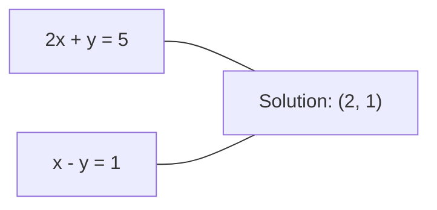
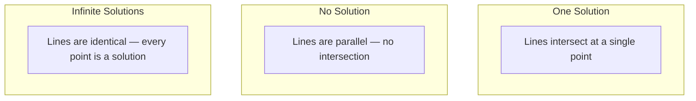

# Układy równań liniowych

> Rozwiązywanie Ax = b to najstarszy problem matematyczny, który wciąż obsługuje Twoją sieć neuronową.

**Typ:** Zbuduj to
**Język:** Python
**Wymagania wstępne:** Phase 1, Lessons 01 (Intuicja algebry liniowej), 02 (Wektory i macierze), 03 (Transformacje macierzowe)
**Czas:** ~120 minut

## Cele uczenia się

- Rozwiąż Ax = b używając eliminacji Gaussa z częściowym piwotowaniem i podstawianiem wstecznym
- Faktoryzuj macierze za pomocą rozkładów LU, QR i Cholesky'ego i wyjaśnij, kiedy każdy z nich jest odpowiedni
- Wyprowadź równania normalne dla najmniejszych kwadratów i połącz je z regresją liniową i grzbietową
- Diagnozuj źle uwarunkowane układy używając wskaźnika uwarunkowania i zastosuj regularyzację, aby je ustabilizować

## Problem

Za każdym razem, gdy trenujesz regresję liniową, rozwiązujesz układ równań liniowych. Za każdym razem, gdy obliczasz dopasowanie metodą najmniejszych kwadratów, rozwiązujesz układ równań liniowych. Za każdym razem, gdy warstwa sieci neuronowej oblicza `y = Wx + b`, ocenia jedną stronę układu równań liniowych. Gdy dodajesz regularyzację, modyfikujesz układ. Gdy używasz procesów Gaussa, faktoryzujesz macierz. Gdy odwracasz macierz kowariancji dla odległości Mahalanobisa, rozwiązujesz układ równań liniowych.

Równanie Ax = b pojawia się wszędzie. A to macierz znanych współczynników. b to wektor znanych wyjść. x to wektor niewiadomych, który chcesz znaleźć. W regresji liniowej A to Twoja macierz danych, b to Twój wektor celów, a x to wektor wag. Cały model sprowadza się do: znajdź x tak, żeby Ax było jak najbliższe b.

Ta lekcja buduje od podstaw każdą główną metodę rozwiązywania tego równania. Zrozumiesz, dlaczego niektóre metody są szybkie, a inne stabilne, dlaczego niektóre działają tylko dla kwadratowych układów, a inne radzą sobie z nadokreślonymi, oraz dlaczego wskaźnik uwarunkowania Twojej macierzy determinuje, czy Twoja odpowiedź w ogóle coś znaczy.

## Koncepcja

### Co Ax = b oznacza geometrycznie

Układ równań liniowych ma interpretację geometryczną. Każde równanie definiuje hiperpłaszczyznę. Rozwiązanie to punkt (lub zbiór punktów), gdzie wszystkie hiperpłaszczyzny się przecinają.

```
2x + y = 5          Dwie proste w 2D.
x - y  = 1          Przecinają się w x=2, y=1.
```



Mogą się wydarzyć trzy rzeczy:



W formie macierzowej „jedno rozwiązanie" oznacza, że A jest odwracalna. „Brak rozwiązania" oznacza, że układ jest sprzeczny. „Nieskończenie wiele rozwiązań" oznacza, że A ma przestrzeń zerową. Większość problemów ML znajduje się w kategorii „brak dokładnego rozwiązania", ponieważ masz więcej równań (punktów danych) niż niewiadomych (parametrów). Tam właśnie pojawiają się najmniejsze kwadraty.

### Obraz kolumnowy vs obraz wierszowy

Istnieją dwa sposoby odczytywania Ax = b.

**Obraz wierszowy.** Każdy wiersz A definiuje jedno równanie. Każde równanie jest hiperpłaszczyzną. Rozwiązanie to miejsce, gdzie wszystkie się przecinają.

**Obraz kolumnowy.** Każda kolumna A jest wektorem. Pytanie brzmi: jaka kombinacja liniowa kolumn A daje w rezultacie b?

```
A = | 2  1 |    b = | 5 |
    | 1 -1 |        | 1 |

Obraz wierszowy: rozwiąż równocześnie 2x + y = 5 i x - y = 1.

Obraz kolumnowy: znajdź x1, x2 takie, że:
  x1 * [2, 1] + x2 * [1, -1] = [5, 1]
  2 * [2, 1] + 1 * [1, -1] = [4+1, 2-1] = [5, 1]   sprawdzenie.
```

Obraz kolumnowy jest bardziej fundamentalny. Jeśli b należy do przestrzeni kolumnowej A, układ ma rozwiązanie. Jeśli b nie należy, znajdujesz najbliższy punkt w przestrzeni kolumnowej. Ten najbliższy punkt to rozwiązanie metodą najmniejszych kwadratów.

### Eliminacja Gaussa

Eliminacja Gaussa przekształca Ax = b w górny trójkątny układ Ux = c, który rozwiązujesz przez podstawianie wsteczne. To najbardziej bezpośrednia metoda.

Algorytm:

```
1. Dla każdej kolumny k (kolumna piwotowa):
   a. Znajdź największy element w kolumnie k na lub poniżej wiersza k (częściowe piwotowanie).
   b. Zamień ten wiersz z wierszem k.
   c. Dla każdego wiersza i poniżej k:
      - Oblicz mnożnik m = A[i][k] / A[k][k]
      - Odejmij m razy wiersz k od wiersza i.
2. Podstawianie wsteczne: rozwiąż od ostatniego równania ku górze.
```

Przykład:

```
Oryginalny:
| 2  1  1 | 8 |       R2 = R2 - (2)R1     | 2  1   1 |  8 |
| 4  3  3 |20 |  -->  R3 = R3 - (1)R1 --> | 0  1   1 |  4 |
| 2  3  1 |12 |                            | 0  2   0 |  4 |

                       R3 = R3 - (2)R2     | 2  1   1 |  8 |
                                       --> | 0  1   1 |  4 |
                                           | 0  0  -2 | -4 |

Podstawianie wsteczne:
  -2 * x3 = -4    -->  x3 = 2
  x2 + 2  = 4     -->  x2 = 2
  2*x1 + 2 + 2 = 8 --> x1 = 2
```

Eliminacja Gaussa kosztuje O(n^3) operacji. Dla układu 1000x1000 to około miliarda operacji zmiennoprzecinkowych. Szybkie, ale możesz zrobić lepiej, jeśli musisz rozwiązać wiele układów z tą samą A.

### Częściowe piwotowanie: dlaczego ma znaczenie

Bez piwotowania eliminacja Gaussa może się nie udać lub dać bzdury. Jeśli element piwotowy jest zerem, dzielisz przez zero. Jeśli jest mały, wzmacniasz błędy zaokrąglenia.

```
Zły piwot:                       Z częściowym piwotowaniem:
| 0.001  1 | 1.001 |            Najpierw zamień wiersze:
| 1      1 | 2     |            | 1      1 | 2     |
                                 | 0.001  1 | 1.001 |
m = 1/0.001 = 1000              m = 0.001/1 = 0.001
R2 = R2 - 1000*R1               R2 = R2 - 0.001*R1
| 0.001  1     | 1.001   |      | 1      1     | 2     |
| 0     -999   | -999.0  |      | 0      0.999 | 0.999 |

x2 = 1.000 (poprawne)            x2 = 1.000 (poprawne)
x1 = (1.001 - 1)/0.001          x1 = (2 - 1)/1 = 1.000 (poprawne)
   = 0.001/0.001 = 1.000        Stabilne, bo mnożnik jest mały.
```

W arytmetyce zmiennoprzecinkowej z ograniczoną precyzją wersja bez piwotowania może stracić znaczące cyfry. Częściowe piwotowanie zawsze wybiera największy dostępny piwot, żeby zminimalizować wzmacnianie błędów.

### Rozkład LU

Rozkład LU faktoryzuje A na dolną trójkątną macierz L i górną trójkątną macierz U: A = LU. Macierz L przechowuje mnożniki z eliminacji Gaussa. Macierz U to wynik eliminacji.

```
A = L @ U

| 2  1  1 |   | 1  0  0 |   | 2  1   1 |
| 4  3  3 | = | 2  1  0 | @ | 0  1   1 |
| 2  3  1 |   | 1  2  1 |   | 0  0  -2 |
```

Dlaczego faktoryzować zamiast po prostu eliminować? Bo gdy już masz L i U, rozwiązanie Ax = b dla dowolnego nowego b kosztuje tylko O(n^2):

```
Ax = b
LUx = b
Niech y = Ux:
  Ly = b    (podstawianie w przód, O(n^2))
  Ux = y    (podstawianie wsteczne, O(n^2))
```

Koszt O(n^3) ponosisz raz podczas faktoryzacji. Każde kolejne rozwiązanie kosztuje O(n^2). Jeśli musisz rozwiązać 1000 układów z tą samą A, ale różnymi wektorami b, LU oszczędza czynnik 1000/3 całkowitej pracy.

Z częściowym piwotowaniem dostajesz PA = LU, gdzie P to macierz permutacji记录ująca zamiany wierszy.

### Rozkład QR

Rozkład QR faktoryzuje A na ortogonalną macierz Q i górną trójkątną macierz R: A = QR.

Ortogonalna macierz ma właściwość Q^T Q = I. Jej kolumny to wektory ortonormalne. Mnożenie przez Q zachowuje długości i kąty.

```
A = Q @ R

Q ma kolumny ortonormalne: Q^T Q = I
R jest górna trójkątna

Żeby rozwiązać Ax = b:
  QRx = b
  Rx = Q^T b    (po prostu pomnóż przez Q^T, bez odwracania)
  Podstawiaj wstecz, żeby dostać x.
```

QR jest numerycznie bardziej stabilny niż LU do rozwiązywania problemów najmniejszych kwadratów. Proces Grama-Schmidta buduje Q kolumnę po kolumnie:

```
Majac kolumny a1, a2, ... z A:

q1 = a1 / ||a1||

q2 = a2 - (a2 . q1) * q1        (odejmij rzut na q1)
q2 = q2 / ||q2||                (znormalizuj)

q3 = a3 - (a3 . q1) * q1 - (a3 . q2) * q2
q3 = q3 / ||q3||

R[i][j] = qi . aj    dla i <= j
```

Każdy krok usuwa składową wzdłuż wszystkich poprzednich wektorów q, zostawiając tylko nowy kierunek ortogonalny.

### Rozkład Cholesky'ego

Gdy A jest symetryczna (A = A^T) i dodatnio określona (wszystkie wartości własne dodatnie), możesz ją faktoryzować jako A = L L^T, gdzie L jest dolna trójkątna. To rozkład Cholesky'ego.

```
A = L @ L^T

| 4  2 |   | 2  0 |   | 2  1 |
| 2  5 | = | 1  2 | @ | 0  2 |

L[i][i] = sqrt(A[i][i] - sum(L[i][k]^2 for k < i))
L[i][j] = (A[i][j] - sum(L[i][k]*L[j][k] for k < j)) / L[j][j]    dla i > j
```

Cholesky jest dwukrotnie szybszy niż LU i wymaga połowy pamięci. Działa tylko dla macierzy symetrycznych dodatnio określonych, ale te pojawiają się stale:

- Macierze kowariancji są symetryczne półokreślone dodatnio (dodatnio określone z regularyzacją).
- Macierz jądra w procesach Gaussa jest symetryczna dodatnio określona.
- Hesjan funkcji wypukłej w minimum jest symetryczny dodatnio określony.
- A^T A jest zawsze symetryczny półokreślony dodatnio.

W procesach Gaussa faktoryzujesz macierz jądra K za pomocą Cholesky'ego, potem rozwiązujesz K alpha = y, żeby dostać średnią predykcyjną. Czynnik Cholesky'ego daje też log-wyznacznik dla wiarygodności brzegowej: log det(K) = 2 * sum(log(diag(L))).

### Najmniejsze kwadraty: gdy Ax = b nie ma dokładnego rozwiązania

Jeśli A jest m x n z m > n (więcej równań niż niewiadomych), układ jest nadokreślony. Nie ma dokładnego rozwiązania. Zamiast tego minimalizujesz błąd kwadratowy:

```
zminimalizuj ||Ax - b||^2

To suma kwadratów residuów:
  sum((A[i,:] @ x - b[i])^2 for i in range(m))
```

Minimum spełnia równania normalne:

```
A^T A x = A^T b
```

Wyprowadzenie: rozwiń ||Ax - b||^2 = (Ax - b)^T (Ax - b) = x^T A^T A x - 2 x^T A^T b + b^T b. Weź gradient względem x, przyrównaj do zera: 2 A^T A x - 2 A^T b = 0.

```
Oryginalny układ (nadokreślony, 4 równania, 2 niewiadome):
| 1  1 |         | 3 |
| 1  2 | x     = | 5 |       Żaden x nie spełnia dokładnie wszystkich 4 równań.
| 1  3 |         | 6 |
| 1  4 |         | 8 |

Równania normalne:
A^T A = | 4  10 |    A^T b = | 22 |
        | 10 30 |            | 63 |

Rozwiąż: x = [1.5, 1.7]

To jest regresja liniowa. x[0] to wyraz wolny, x[1] to nachylenie.
```

### Równania normalne = regresja liniowa

Pojęcie jest ściśle powiązane. W regresji liniowej Twoja macierz danych X ma jeden wiersz na próbkę i jedną kolumnę na cechę. Twój wektor celów y ma jeden wpis na próbkę. Wektor wag w spełnia:

```
X^T X w = X^T y
w = (X^T X)^(-1) X^T y
```

To jest rozwiązanie w postaci zamkniętej dla regresji liniowej. Każde wywołanie `sklearn.linear_model.LinearRegression.fit()` to oblicza (lub równoważnie przez QR lub SVD).

Dodaj wyraz regularyzacyjny lambda * I do macierzy i dostajesz regresję grzbietową:

```
(X^T X + lambda * I) w = X^T y
w = (X^T X + lambda * I)^(-1) X^T y
```

Regularyzacja poprawia uwarunkowanie macierzy (łatwiej odwrócić dokładnie) i zapobiega przeuczeniu przez ściąganie wag ku zeru. Macierz X^T X + lambda * I jest zawsze symetryczna dodatnio określona, gdy lambda > 0, więc możesz użyć Cholesky'ego do rozwiązania.

### Pseudoinwersja (Moore'a-Penrose'a)

Pseudoinwersja A+ uogólnia odwracanie macierzy na macierze niekwadratowe i osobliwe. Dla dowolnej macierzy A:

```
x = A+ b

gdzie A+ = V Sigma+ U^T    (obliczone przez SVD)
```

Sigma+ powstaje przez wzięcie odwrotności każdej niezerowej wartości osobliwej i transpozycję wyniku. Jeśli A = U Sigma V^T, to A+ = V Sigma+ U^T.

```
A = U Sigma V^T        (SVD)

Sigma = | 5  0 |       Sigma+ = | 1/5  0  0 |
        | 0  2 |                | 0  1/2  0 |
        | 0  0 |

A+ = V Sigma+ U^T
```

Pseudoinwersja daje rozwiązanie najmniejszych kwadratów o minimalnej normie. Jeśli układ ma:
- Jedno rozwiązanie: A+ b je daje.
- Brak rozwiązania: A+ b daje rozwiązanie najmniejszych kwadratów.
- Nieskończenie wiele rozwiązań: A+ b daje to o najmniejszej ||x||.

NumPy's `np.linalg.lstsq` i `np.linalg.pinv` obie używają SVD wewnętrznie.

### Wskaźnik uwarunkowania

Wskaźnik uwarunkowania mierzy, jak wrażliwe jest rozwiązanie na małe zmiany w wejściu. Dla macierzy A wskaźnik uwarunkowania wynosi:

```
kappa(A) = ||A|| * ||A^(-1)|| = sigma_max / sigma_min
```

gdzie sigma_max i sigma_min to największa i najmniejsza wartość osobliwa.

```
Dobrze uwarunkowana (kappa ~ 1):        Żle uwarunkowana (kappa ~ 10^15):
Mała zmiana w b -->                     Mała zmiana w b -->
mała zmiana w x                         ogromna zmiana w x

| 2  0 |   kappa = 2/1 = 2          | 1   1          |   kappa ~ 10^15
| 0  1 |   bezpiecznie rozwiązać   | 1   1+10^(-15) |   rozwiązanie to śmieci
```

Zasady kciukowe:
- kappa < 100: bezpiecznie, rozwiązanie jest dokładne.
- kappa ~ 10^k: tracisz około k cyfr precyzji z arytmetyki zmiennoprzecinkowej.
- kappa ~ 10^16 (dla float64): rozwiązanie jest bez znaczenia. Macierz jest efektywnie osobliwa.

W ML złe uwarunkowanie występuje, gdy cechy są niemal współliniowe. Regularyzacja (dodanie lambda * I) poprawia wskaźnik uwarunkowania z sigma_max / sigma_min na (sigma_max + lambda) / (sigma_min + lambda).

### Metody iteracyjne: gradient sprzężony

Dla bardzo dużych rzadkich układów (miliony niewiadomych) metody bezpośrednie jak LU czy Cholesky są zbyt drogie. Metody iteracyjne przybliżają rozwiązanie, poprawiając przypuszczenie przez wiele iteracji.

Gradient sprzężony (CG) rozwiązuje Ax = b, gdy A jest symetryczna dodatnio określona. Znajduje dokładne rozwiązanie w co najwyżej n iteracjach (w arytmetyce dokładnej), ale typowo zbiega się znacznie szybciej, jeśli wartości własne A są skupione.

```
Szkic algorytmu:
  x0 = początkie przypuszczenie (często zero)
  r0 = b - A x0           (residium)
  p0 = r0                 (kierunek poszukiwań)

  Dla k = 0, 1, 2, ...:
    alpha = (rk . rk) / (pk . A pk)
    x_{k+1} = xk + alpha * pk
    r_{k+1} = rk - alpha * A pk
    beta = (r_{k+1} . r_{k+1}) / (rk . rk)
    p_{k+1} = r_{k+1} + beta * pk
    jeśli ||r_{k+1}|| < tolerancja: stop
```

CG jest używany w:
- Optymalizacji na dużą skalę (metoda Newton-CG)
- Rozwiązywaniu dyskretyzacji PDE
- Metodach jądra, gdzie macierz jądra jest zbyt duża do faktoryzacji
- Prediwarunkianiu dla innych solverów iteracyjnych

Tempo zbieżności zależy od wskaźnika uwarunkowania. Lepsze uwarunkowanie oznacza szybszą zbieżność, co jest kolejnym powodem, dla którego regularyzacja pomaga.

### Pełny obraz: którą metodę kiedy

| Metoda | Wymagania | Koszt | Przypadek użycia |
|--------|-------------|------|----------|
| Eliminacja Gaussa | Kwadratowa, nieosobliwa A | O(n^3) | Jednorazowe rozwiązanie układu kwadratowego |
| Rozkład LU | Kwadratowa, nieosobliwa A | O(n^3) faktoryzacja + O(n^2) rozwiązanie | Wiele rozwiązań z tą samą A |
| Rozkład QR | Dowolna A (m >= n) | O(mn^2) | Najmniejsze kwadraty, numerycznie stabilna |
| Cholesky | Symetryczna dodatnio określona A | O(n^3/3) | Macierze kowariancji, procesy Gaussa, regresja grzbietowa |
| Równania normalne | Nadokreślony (m > n) | O(mn^2 + n^3) | Regresja liniowa (małe n) |
| SVD / pseudoinwersja | Dowolna A | O(mn^2) | Układy z deficytem rzędu, rozwiązania o minimalnej normie |
| Gradient sprzężony | Symetryczna dodatnio określona, rzadka A | O(n * k * nnz) | Duże rzadkie układy, k = iteracje |

### Połączenie z ML

Każda metoda w tej lekcji pojawia się w produkcyjnym ML:

**Regresja liniowa.** Rozwiązanie w postaci zamkniętej rozwiązuje równania normalne X^T X w = X^T y. Odbywa się to przez Cholesky (jeśli n jest małe) lub QR (jeśli liczy się stabilność numeryczna) lub SVD (jeśli macierz może mieć deficyt rzędu).

**Regresja grzbietowa.** Dodaje lambda * I do X^T X. Regularyzowany układ (X^T X + lambda * I) w = X^T y jest zawsze rozwiązywalny przez Cholesky, bo X^T X + lambda * I jest symetryczna dodatnio określona dla lambda > 0.

**Procesy Gaussa.** Średnia predykcyjna wymaga rozwiązania K alpha = y, gdzie K to macierz jądra. Faktoryzacja Cholesky'ego K to standardowe podejście. Log-wiarygodność brzegowa używa log det(K) = 2 sum(log(diag(L))).

**Inicjalizacja sieci neuronowych.** Ortogonalna inicjalizacja używa rozkładu QR do tworzenia macierzy wag, których kolumny są ortonormalne. To zapobiega zapaści sygnału w głębokich sieciach.

**Prediwarunkianie.** Optymalizatory na dużą skalę używają niekompletnego Cholesky'ego lub niekompletnego LU jako prediwarunkików dla solverów gradientu sprzężonego.

**Inżynieria cech.** Wskaźnik uwarunkowania X^T X mówi Ci, czy Twoje cechy są współliniowe. Jeśli kappa jest duża, usuń cechy lub dodaj regularyzację.

## Zbuduj to

### Krok 1: Eliminacja Gaussa z częściowym piwotowaniem

```python
import numpy as np

def gaussian_elimination(A, b):
    n = len(b)
    Ab = np.hstack([A.astype(float), b.reshape(-1, 1).astype(float)])

    for k in range(n):
        max_row = k + np.argmax(np.abs(Ab[k:, k]))
        Ab[[k, max_row]] = Ab[[max_row, k]]

        if abs(Ab[k, k]) < 1e-12:
            raise ValueError(f"Matrix is singular or nearly singular at pivot {k}")

        for i in range(k + 1, n):
            m = Ab[i, k] / Ab[k, k]
            Ab[i, k:] -= m * Ab[k, k:]

    x = np.zeros(n)
    for i in range(n - 1, -1, -1):
        x[i] = (Ab[i, -1] - Ab[i, i+1:n] @ x[i+1:n]) / Ab[i, i]

    return x
```

### Krok 2: Rozkład LU

```python
def lu_decompose(A):
    n = A.shape[0]
    L = np.eye(n)
    U = A.astype(float).copy()
    P = np.eye(n)

    for k in range(n):
        max_row = k + np.argmax(np.abs(U[k:, k]))
        if max_row != k:
            U[[k, max_row]] = U[[max_row, k]]
            P[[k, max_row]] = P[[max_row, k]]
            if k > 0:
                L[[k, max_row], :k] = L[[max_row, k], :k]

        for i in range(k + 1, n):
            L[i, k] = U[i, k] / U[k, k]
            U[i, k:] -= L[i, k] * U[k, k:]

    return P, L, U

def lu_solve(P, L, U, b):
    n = len(b)
    Pb = P @ b.astype(float)

    y = np.zeros(n)
    for i in range(n):
        y[i] = Pb[i] - L[i, :i] @ y[:i]

    x = np.zeros(n)
    for i in range(n - 1, -1, -1):
        x[i] = (y[i] - U[i, i+1:] @ x[i+1:]) / U[i, i]

    return x
```

### Krok 3: Rozkład Cholesky'ego

```python
def cholesky(A):
    n = A.shape[0]
    L = np.zeros_like(A, dtype=float)

    for i in range(n):
        for j in range(i + 1):
            s = A[i, j] - L[i, :j] @ L[j, :j]
            if i == j:
                if s <= 0:
                    raise ValueError("Matrix is not positive definite")
                L[i, j] = np.sqrt(s)
            else:
                L[i, j] = s / L[j, j]

    return L
```

### Krok 4: Najmniejsze kwadraty przez równania normalne

```python
def least_squares_normal(A, b):
    AtA = A.T @ A
    Atb = A.T @ b
    return gaussian_elimination(AtA, Atb)

def ridge_regression(A, b, lam):
    n = A.shape[1]
    AtA = A.T @ A + lam * np.eye(n)
    Atb = A.T @ b
    L = cholesky(AtA)
    y = np.zeros(n)
    for i in range(n):
        y[i] = (Atb[i] - L[i, :i] @ y[:i]) / L[i, i]
    x = np.zeros(n)
    for i in range(n - 1, -1, -1):
        x[i] = (y[i] - L.T[i, i+1:] @ x[i+1:]) / L.T[i, i]
    return x
```

### Krok 5: Wskaźnik uwarunkowania

```python
def condition_number(A):
    U, S, Vt = np.linalg.svd(A)
    return S[0] / S[-1]
```

## Użyj tego

Łączenie kawałków razem dla regresji liniowej i grzbietowej na prawdziwych danych:

```python
np.random.seed(42)
X_raw = np.random.randn(100, 3)
w_true = np.array([2.0, -1.0, 0.5])
y = X_raw @ w_true + np.random.randn(100) * 0.1

X = np.column_stack([np.ones(100), X_raw])

w_ols = least_squares_normal(X, y)
print(f"OLS weights (ours):    {w_ols}")

w_np = np.linalg.lstsq(X, y, rcond=None)[0]
print(f"OLS weights (numpy):   {w_np}")
print(f"Max difference: {np.max(np.abs(w_ols - w_np)):.2e}")

w_ridge = ridge_regression(X, y, lam=1.0)
print(f"Ridge weights (ours):  {w_ridge}")

from sklearn.linear_model import Ridge
ridge_sk = Ridge(alpha=1.0, fit_intercept=False)
ridge_sk.fit(X, y)
print(f"Ridge weights (sklearn): {ridge_sk.coef_}")
```

## Wdróż to

Ta lekcja wytwarza:
- `code/linear_systems.py` zawierający implementacje od podstaw eliminacji Gaussa, rozkładu LU, rozkładu Cholesky'ego, najmniejszych kwadratów i regresji grzbietowej
- Działającą demonstrację, że równania normalne i LinearRegression ze sklearn dają te same wagi

## Ćwiczenia

1. Rozwiąż układ `[[1,2,3],[4,5,6],[7,8,10]] x = [6, 15, 27]` używając Twojej eliminacji Gaussa, Twojego solvera LU i `np.linalg.solve`. Sprawdź, czy wszystkie trzy dają to samo w granicach tolerancji zmiennoprzecinkowej.

2. Wygeneruj losową macierz X 50x5 i cel y = X @ w_true + szum. Rozwiąż dla w używając równań normalnych, QR (przez `np.linalg.qr`), SVD (przez `np.linalg.svd`) i `np.linalg.lstsq`. Porównaj wszystkie cztery rozwiązania. Zmierz wskaźnik uwarunkowania X^T X i wyjaśnij, jak wpływa na to, której metodzie ufasz.

3. Stwórz niemal osobliwą macierz przez uczynienie dwóch kolumn niemal identycznymi (np. kolumna 2 = kolumna 1 + 1e-10 * szum). Oblicz jej wskaźnik uwarunkowania. Rozwiąż Ax = b z i bez regularyzacji (dodaj 0.01 * I). Porównaj rozwiązania i residua. Wyjaśnij, dlaczego regularyzacja pomaga.

4. Zaimplementuj algorytm gradientu sprzężonego dla losowej macierzy 100x100 symetrycznej dodatnio określonej. Policz, ile iteracji potrzeba do zbieżności przy tolerancji 1e-8. Porównaj z teoretycznym maksimum n iteracji.

5. Zmierz czas działania Twojego solvera Cholesky vs Twój solver LU vs `np.linalg.solve` na macierzach symetrycznych dodatnio określonych o rozmiarach 10, 50, 200, 500. Wykreśl wyniki. Sprawdź, czy Cholesky jest mniej więcej 2x szybszy niż LU.

## Kluczowe pojęcia

| Pojęcie | Co ludzie mówią | Co to faktycznie oznacza |
|------|----------------|----------------------|
| Układ równań liniowych | "Rozwiąż dla x" | Zbiór równań liniowych Ax = b. Znalezienie x oznacza znalezienie wejścia, które produkuje wyjście b pod transformacją A. |
| Eliminacja Gaussa | "Redukcja wierszowa" | Systematyczne zerowanie wpisów poniżej przekątnej używając operacji wierszowych, produkując górny trójkątny układ rozwiązywalny przez podstawianie wsteczne. O(n^3). |
| Częściowe piwotowanie | "Zamiana wierszy dla stabilności" | Przed eliminacją w kolumnie k zamień wiersz z największą wartością bezwzględną w tej kolumnie na pozycję piwotową. Zapobiega dzieleniu przez małe liczby. |
| Rozkład LU | "Faktoryzacja na trójkąty" | Zapisz A = LU, gdzie L jest dolna trójkątna (przechowuje mnożniki) i U jest górna trójkątna (macierz po eliminacji). Amortyzuje koszt O(n^3) na wiele rozwiązań. |
| Rozkład QR | "Faktoryzacja ortogonalna" | Zapisz A = QR, gdzie Q ma kolumny ortonormalne i R jest górna trójkątna. Bardziej stabilny niż LU dla najmniejszych kwadratów. |
| Rozkład Cholesky'ego | "Pierwiastek kwadratowy z macierzy" | Dla symetrycznej dodatnio określonej A zapisz A = LL^T. Połowa kosztu LU. Używany dla macierzy kowariancji, macierzy jądra i regresji grzbietowej. |
| Najmniejsze kwadraty | "Najlepsze dopasowanie, gdy dokładne jest niemożliwe" | Zminimalizuj sumę kwadratów residuów \|\|Ax - b\|\|^2, gdy układ jest nadokreślony (więcej równań niż niewiadomych). |
| Równania normalne | "Skrót rachunkowy" | A^T A x = A^T b. Przyrównanie gradientu \|\|Ax - b\|\|^2 do zera. To JEST rozwiązanie w postaci zamkniętej dla regresji liniowej. |
| Pseudoinwersja | "Odwracanie dla macierzy niekwadratowych" | A+ = V Sigma+ U^T przez SVD. Daje rozwiązanie najmniejszych kwadratów o minimalnej normie dla dowolnej macierzy, kwadratowej lub prostokątnej, osobliwej lub nie. |
| Wskaźnik uwarunkowania | "Jak wiarygodna jest ta odpowiedź" | kappa = sigma_max / sigma_min. Mierzy wrażliwość na zaburzenia wejścia. Tracisz około log10(kappa) cyfr precyzji. |
| Regresja grzbietowa | "Regularyzowane najmniejsze kwadraty" | Rozwiąż (X^T X + lambda I) w = X^T y. Dodanie lambda I poprawia uwarunkowanie i ściąga wagi ku zeru. Zapobiega przeuczeniu. |
| Gradient sprzężony | "Iteracyjne Ax=b dla dużych macierzy" | Iteracyjny solver dla symetrycznych dodatnio określonych układów. Zbiega się w co najwyżej n krokach. Praktyczny dla dużych rzadkich układów, gdzie faktoryzacja jest zbyt droga. |
| Układ nadokreślony | "Więcej danych niż parametrów" | m > n w układzie m-na-n. Nie istnieje dokładne rozwiązanie. Najmniejsze kwadraty znajdują najlepsze przybliżenie. To jest każdy problem regresji. |
| Podstawianie wsteczne | "Rozwiązuj od dołu" | Mając górny trójkątny układ, rozwiąż ostatnie równanie pierwsze, potem podstawiaj wstecz. O(n^2). |
| Podstawianie w przód | "Rozwiązuj od góry" | Mając dolny trójkątny układ, rozwiąż pierwsze równanie pierwsze, potem podstawiaj w przód. O(n^2). Używane w kroku L solverów LU. |