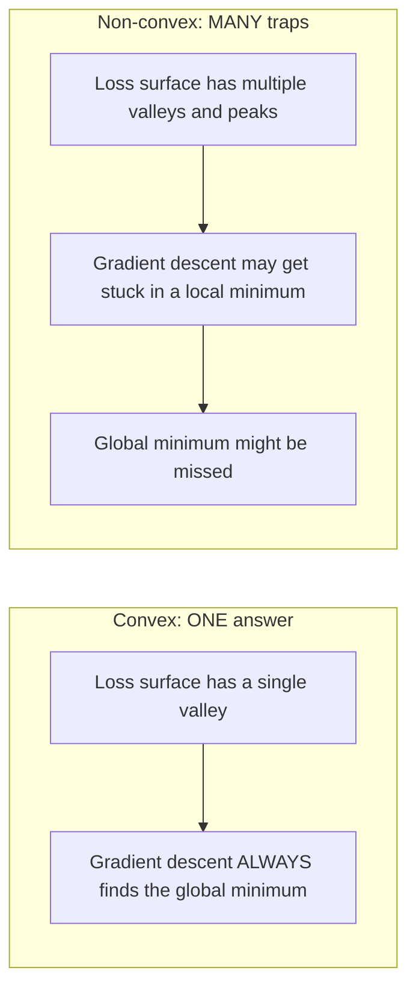
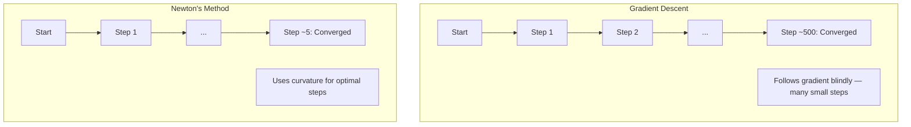
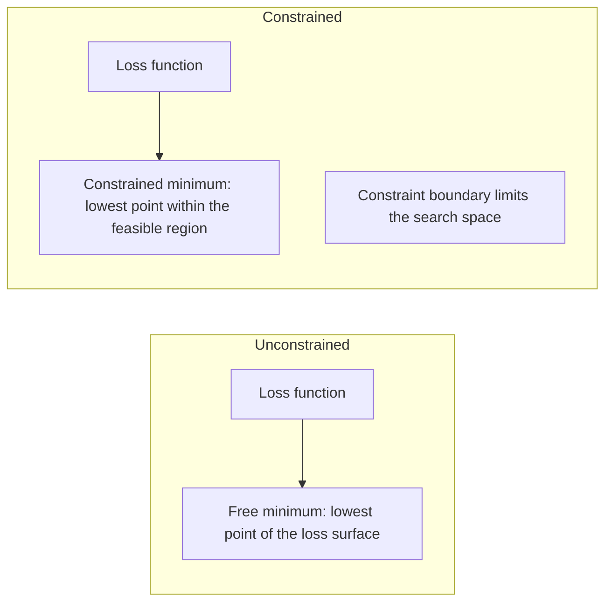
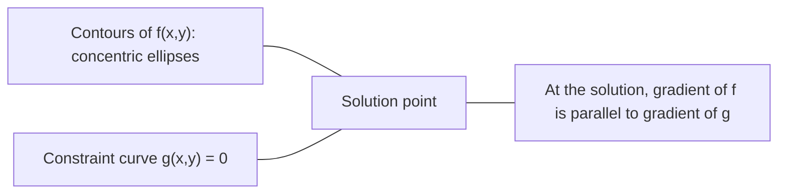

# Optymalizacja wypukła

> Problemy wypukłe mają jedną dolinę. Sieci neuronowe mają ich miliony. Wiedza o różnicy ma znaczenie.

**Typ:** Zbuduj
**Język:** Python
**Wymagania wstępne:** Phase 1, Lesson 04 (Rachunek różniczkowy dla ML), Lesson 08 (Optymalizacja)
**Czas:** ~90 minut

## Cele uczenia się

- Testuj, czy funkcja jest wypukła, używając definicji, drugiej pochodnej i kryterium hesjanowego
- Implementuj metodę Newtona i porównaj jej kwadratową zbieżność ze spadkiem gradientu
- Rozwiązuj problemy optymalizacji z ograniczeniami za pomocą mnożników Lagrange'a i interpretuj warunki KKT
- Wyjaśnij, dlaczego krajobraz strat sieci neuronowych jest niewypukły, a mimo to SGD znajduje dobre rozwiązania

## Problem

Lesson 08 przedstawiła ci spadek gradientu, momentum i Adam. Te optymalizatory schodzą w dół po dowolnej powierzchni. Nie mają jednak żadnych gwarancji. Spadek gradientu na niewypukłym krajobrazie może wylądować w złym minimum lokalnym, utknąć w punkcie siodłowym lub oscylować w nieskończoność. Używałeś go mimo to, ponieważ sieci neuronowe są niewypukłe i nie ma alternatywy.

Ale wiele problemów w uczeniu maszynowym jest wypukłych. Regresja liniowa, regresja logistyczna, SVM, LASSO, regresja grzbietowa. Dla tych istnieje coś mocniejszego: optymalizacja z matematycznymi gwarancjami. Problem wypukły ma dokładnie jedną dolinę. Każdy algorytm schodzący w dół osiągnie globalne minimum. Bez restartów. Bez harmonogramów współczynnika uczenia. Bez modlitw.

Zrozumienie wypukłości robi trzy rzeczy. Po pierwsze, mówi ci, kiedy twój problem jest łatwy (wypukły) versus trudny (niewypukły). Po drugie, daje ci szybsze narzędzia jak metoda Newtona dla problemów wypukłych. Po trzecie, wyjaśnia pojęcia, które pojawiają się w całym ML: regularyzację jako ograniczenie, dualność w SVM i dlaczego głębokie uczenie działa, mimo że łamie każdą miłą właściwość, którą daje wypukłość.

## Koncepcja

### Zbiory wypukłe

Zbiór S jest wypukły, jeśli dla każdych dwóch punktów w S odcinek między nimi również leży całkowicie w S.

| Zbiory wypukłe | Niewypukłe |
|---|---|
| **Prostokąt**: każde dwa punkty wewnątrz można połączyć odcinkiem, który pozostaje wewnątrz | **Gwiazda/księżyc**: odcinek między dwoma punktami wewnętrznymi może wyjść poza zbiór |
| **Trójkąt**: ta sama właściwość zachodzi dla wszystkich punktów wewnętrznych | **Pączek/obrączka**: dziura oznacza, że niektóre odcinki opuszczają zbiór |
| Odcinek między dowolnymi dwoma punktami pozostaje w zbiorze | Odcinek między niektórymi parami punktów wychodzi ze zbioru |

Test formalny: dla dowolnych punktów x, y w S i dowolnego t w [0, 1], punkt tx + (1-t)y również należy do S.

Przykłady zbiorów wypukłych:
- Linia, płaszczyzna, całe R^n
- Kula (koło, sfera, hipersfera)
- Półprzestrzeń: {x : a^T x <= b}
- Przecięcie dowolnej liczby zbiorów wypukłych

Przykłady zbiorów niewypukłych:
- Pączek (obrączka)
- Suma dwóch rozłącznych kół
- Dowolny zbiór z wgłębieniem lub dziurą

### Funkcje wypukłe

Funkcja f jest wypukła, jeśli jej dziedzina jest zbiorem wypukłym i dla dowolnych dwóch punktów x, y w jej dziedzinie i dowolnego t w [0, 1]:

```
f(tx + (1-t)y) <= t*f(x) + (1-t)*f(y)
```

Geometrycznie: odcinek między dowolnymi dwoma punktami na wykresie leży powyżej lub na wykresie.

| Właściwość | Funkcja wypukła | Funkcja niewypukła |
|---|---|---|
| **Test odcinka** | Odcinek między dowolnymi dwoma punktami na wykresie leży **powyżej lub na** krzywej | Odcinek między niektórymi punktami na wykresie schodzi **poniżej** krzywej |
| **Kształt** | Pojedyncza misa/dolina wyginająca się w górę | Wiele szczytów i dolin z mieszaną krzywizną |
| **Minima lokalne** | Każde minimum lokalne jest minimum globalnym | Może istnieć wiele minimów lokalnych na różnych wysokościach |

Typowe funkcje wypukłe:
- f(x) = x^2 (parabola)
- f(x) = |x| (wartość bezwzględna)
- f(x) = e^x (funkcja wykładnicza)
- f(x) = max(0, x) (ReLU, choć częściowo liniowa)
- f(x) = -log(x) dla x > 0 (logarytm ujemny)
- Każda funkcja liniowa f(x) = a^T x + b (jednocześnie wypukła i wklęsła)

### Testowanie wypukłości

Trzy praktyczne testy, od najłatwiejszego do najbardziej rygorystycznego.

**Test 1: Test drugiej pochodnej (1D).** Jeśli f''(x) >= 0 dla wszystkich x, to f jest wypukła.

- f(x) = x^2: f''(x) = 2 >= 0. Wypukła.
- f(x) = x^3: f''(x) = 6x. Ujemne dla x < 0. Niewypukła.
- f(x) = e^x: f''(x) = e^x > 0. Wypukła.

**Test 2: Test hesjanowy (wielowariantowy).** Jeśli macierz hesjanowa H(x) jest półokreślona dodatnio dla wszystkich x, to f jest wypukła. Hesjan to macierz drugich pochodnych cząstkowych.

**Test 3: Test definicji.** Sprawdź nierówność f(tx + (1-t)y) <= t*f(x) + (1-t)*f(y) bezpośrednio. Przydatny dla funkcji, gdzie trudno obliczyć pochodne.

### Dlaczego wypukłość ma znaczenie

Centralne twierdzenie optymalizacji wypukłej:

**Dla funkcji wypukłej każde minimum lokalne jest minimum globalnym.**

To oznacza, że spadek gradientu nie może utknąć. Każda ścieżka w dół prowadzi do tego samego wyniku. Algorytm jest gwarantowany do zbieżności do optymalnego rozwiązania.



Konsekwencje:
- Nie trzeba losowych restartów
- Nie trzeba wyrafinowanych harmonogramów współczynnika uczenia
- Dowody zbieżności są możliwe (szybkość zależy od właściwości funkcji)
- Rozwiązanie jest unikalne (z dokładnością do płaskich regionów)

### Wypukła vs niewypukła w ML

| Problem | Wypukły? | Dlaczego |
|---------|----------|----------|
| Regresja liniowa (MSE) | Tak | Funkcja straty jest kwadratowa względem wag |
| Regresja logistyczna | Tak | Log-strata jest wypukła względem wag |
| SVM (hinge loss) | Tak | Maksimum funkcji liniowych |
| LASSO (regresja L1) | Tak | Suma funkcji wypukłych jest wypukła |
| Regresja grzbietowa (L2) | Tak | Kwadratowa + kwadratowa = wypukła |
| Sieć neuronowa (dowolna strata) | Nie | Nieliniowe aktywacje tworzą niewypukły krajobraz |
| K-means clustering | Nie | Dyskretny krok przypisania |
| Faktoryzacja macierzy | Nie | Iloczyn niewiadomych |

Modele liniowe z wypukłymi stratami są wypukłe. W momencie dodania ukrytych warstw z nieliniowymi aktywacjami wypukłość się łamie.

### Macierz hesjanowa

Hesjan H funkcji f: R^n -> R to macierz n x n drugich pochodnych cząstkowych.

```
H[i][j] = d^2 f / (dx_i dx_j)
```

Dla f(x, y) = x^2 + 3xy + y^2:

```
df/dx = 2x + 3y       d^2f/dx^2 = 2      d^2f/dxdy = 3
df/dy = 3x + 2y       d^2f/dydx = 3      d^2f/dy^2 = 2

H = [ 2  3 ]
    [ 3  2 ]
```

Hesjan mówi o krzywiznie:
- Wszystkie wartości własne dodatnie: funkcja krzywi się w górę w każdym kierunku (wypukła w tym punkcie)
- Wszystkie wartości własne ujemne: krzywi się w dół w każdym kierunku (wklęsła, maksimum lokalne)
- Mieszane znaki: punkt siodłowy (krzywi się w górę w niektórych kierunkach, w dół w innych)
- Wartość własna zero: płaska w tym kierunku (zdegenerowana)

Dla wypukłości hesjan musi być półokreślony dodatnio (wszystkie wartości własne >= 0) wszędzie, nie tylko w jednym punkcie.

### Metoda Newtona

Spadek gradientu używa informacji pierwszego rzędu (gradient). Metoda Newtona używa informacji drugiego rzędu (hesjan). Dopasowuje przybliżenie kwadratowe w bieżącym punkcie i skacze bezpośrednio do minimum tego przybliżenia.

```
Reguła aktualizacji:
  x_new = x - H^(-1) * gradient

Porównaj ze spadkiem gradientu:
  x_new = x - lr * gradient
```

Metoda Newtona zastępuje skalar współczynnika uczenia odwrotnością hesjanu. Automatycznie dostosowuje rozmiar kroku i kierunek na podstawie lokalnej krzywizny.



Zalety:
- Kwadratowa zbieżność w pobliżu minimum (błąd kwadratuje się każdego kroku)
- Nie trzeba dostrajać współczynnika uczenia
- Niezmienniczość skali (działa niezależnie od sparametryzowania problemu)

Wady:
- Obliczenie hesjanu kosztuje O(n^2) pamięci i O(n^3) na odwrócenie
- Dla sieci neuronowej z 1 milionem wag to 10^12 wpisów i 10^18 operacji
- Niepraktyczne dla głębokiego uczenia

### Optymalizacja z ograniczeniami

Optymalizacja bez ograniczeń: minimalizuj f(x) dla wszystkich x.
Optymalizacja z ograniczeniami: minimalizuj f(x) przy ograniczeniach.

Rzeczywiste problemy mają ograniczenia. Chcesz zminimalizować koszt, ale masz ograniczony budżet. Chcesz zminimalizować błąd, ale złożoność twojego modelu jest ograniczona.



### Mnożniki Lagrange'a

Metoda mnożników Lagrange'a przekształca problem z ograniczeniami w problem bez ograniczeń.

Problem: minimalizuj f(x) przy ograniczeniu g(x) = 0.

Rozwiązanie: wprowadź nową zmienną (mnożnik Lagrange'a lambda) i rozwiąż problem bez ograniczeń:

```
L(x, lambda) = f(x) + lambda * g(x)
```

W rozwiązaniu gradient L wynosi zero:

```
dL/dx = df/dx + lambda * dg/dx = 0
dL/dlambda = g(x) = 0
```

Intuicja geometryczna: w ograniczonym minimum gradient f musi być równoległy do gradientu ograniczenia g. Gdyby nie były równoległe, moglibyśmy poruszać się wzdłuż powierzchni ograniczenia i dalej zmniejszać f.



Przykład: minimalizuj f(x,y) = x^2 + y^2 przy ograniczeniu x + y = 1.

```
L = x^2 + y^2 + lambda(x + y - 1)

dL/dx = 2x + lambda = 0  =>  x = -lambda/2
dL/dy = 2y + lambda = 0  =>  y = -lambda/2
dL/dlambda = x + y - 1 = 0

Z pierwszych dwóch: x = y
Podstawiając: 2x = 1, więc x = y = 0.5, lambda = -1
```

Najbliższy punkt na prostej x + y = 1 do początku to (0.5, 0.5).

### Warunki KKT

Warunki Karush-Kuhn-Tucker rozszerzają mnożniki Lagrange'a na ograniczenia nierównościowe.

Problem: minimalizuj f(x) przy ograniczeniach g_i(x) <= 0 dla i = 1, ..., m.

Warunki KKT (konieczne dla optymalności):

```
1. Stacjonarność:    df/dx + sum(lambda_i * dg_i/dx) = 0
2. Wykonalność prymalna:  g_i(x) <= 0  dla wszystkich i
3. Wykonalność dualna:    lambda_i >= 0  dla wszystkich i
4. Komplementarna luźność:  lambda_i * g_i(x) = 0  dla wszystkich i
```

Komplementarna luźność to kluczowy wgląd: albo ograniczenie jest aktywne (g_i = 0, rozwiązanie leży na granicy), albo mnożnik jest zero (ograniczenie nie ma znaczenia). Ograniczenie, które nie wpływa na rozwiązanie, ma lambda = 0.

Warunki KKT są centralne dla SVM. Wektory nośne to punkty danych, gdzie ograniczenie jest aktywne (lambda > 0). Wszystkie inne punkty danych mają lambda = 0 i nie wpływają na granicę decyzyjną.

### Regularyzacja jako optymalizacja z ograniczeniami

Regularyzacja L1 i L2 to nie arbitralne triki. To problemy optymalizacji z ograniczeniami w przebraniu.

**Regularyzacja L2 (Ridge):**

```
minimalizuj  Loss(w)  przy ograniczeniu  ||w||^2 <= t

Równoważna forma bez ograniczeń:
minimalizuj  Loss(w) + lambda * ||w||^2
```

Ograniczenie ||w||^2 <= t definiuje kulę (koło w 2D, sferę w 3D). Rozwiązanie to miejsce, gdzie kontury straty pierwszy raz dotykają tej kuli.

**Regularyzacja L1 (LASSO):**

```
minimalizuj  Loss(w)  przy ograniczeniu  ||w||_1 <= t

Równoważna forma bez ograniczeń:
minimalizuj  Loss(w) + lambda * ||w||_1
```

Ograniczenie ||w||_1 <= t definiuje diament (obrócony kwadrat w 2D).

| Właściwość | Ograniczenie L2 (koło) | Ograniczenie L1 (diament) |
|---|---|---|
| **Kształt ograniczenia** | Koło (sfera w wyższych wymiarach) | Diament (obrócony kwadrat w 2D) |
| **Gdzie kontur straty dotyka** | Gładka granica — dowolny punkt na kole | Narożnik — wyrównany z osią |
| **Zachowanie rozwiązania** | Wagi są małe, ale niezerowe | Niektóre wagi są dokładnie zero (rzadkie) |
| **Rezultat** | Kurczenie wag | Selekcja cech |

To wyjaśnia, dlaczego L1 tworzy rzadkie modele (selekcja cech), a L2 tylko kurczy wagi. Diament ma narożniki wyrównane z osiami. Kontury straty częściej dotykają narożnika, ustawiając jedną lub więcej wag dokładnie na zero.

### Dualność

Każdy problem optymalizacji z ograniczeniami (prymal) ma problem towarzyszący (dual). Dla problemów wypukłych prymal i dual mają tę samą wartość optymalną. To silna dualność.

Dualna funkcja Lagrange'a:

```
Primal: minimalizuj f(x) przy ograniczeniu g(x) <= 0
Lagrangian: L(x, lambda) = f(x) + lambda * g(x)
Dualna funkcja: d(lambda) = min_x L(x, lambda)
Dualny problem: maksymalizuj d(lambda) przy ograniczeniu lambda >= 0
```

Dlaczego dualność ma znaczenie:
- Dualny problem jest czasem łatwiejszy do rozwiązania niż prymalny
- SVM są rozwiązywane w formie dualnej, gdzie problem zależy od iloczynów skalarnych między punktami danych (umożliwiając kernel trick)
- Dual daje dolne ograniczenie na optymalną wartość prymalną, przydatne do sprawdzania jakości rozwiązania

Dla SVM konkretnie:

```
Primal: znajdź w, b które maksymalizują margines 2/||w|| przy ograniczeniu
        y_i(w^T x_i + b) >= 1 dla wszystkich i

Dual:   maksymalizuj sum(alpha_i) - 0.5 * sum_ij(alpha_i * alpha_j * y_i * y_j * x_i^T x_j)
        przy ograniczeniach alpha_i >= 0 i sum(alpha_i * y_i) = 0

Dual zawiera tylko iloczyny skalarne x_i^T x_j.
Zastąp x_i^T x_j przez K(x_i, x_j), aby otrzymać kernel trick.
```

### Dlaczego głębokie uczenie działa mimo niewypukłości

Funkcje straty sieci neuronowych są skrajnie niewypukłe. Zgodnie z każdą klasyczną miarą optymalizacja powinna się nie powieść. A jednak stochastyczny spadek gradientu znajduje dobre rozwiązania regularnie. Kilka czynników to wyjaśnia.

**Większość minimów lokalnych jest wystarczająco dobrych.** W przestrzeniach wysokowymiarowych losowe punkty krytyczne (gdzie gradient wynosi zero) są w przytłaczającej większości punktami siodłowymi, nie minimami lokalnymi. Nieliczne minima lokalne, które istnieją, mają wartości strat bliskie globalnemu minimum. Ugrzęźnięcie w okropnym minimum lokalnym jest niezwykle mało prawdopodobne, gdy przestrzeń parametrów ma miliony wymiarów.

**Punkty siodłowe, nie minima lokalne, są prawdziwą przeszkodą.** W funkcji z n parametrami punkt siodłowy ma mieszankę dodatnich i ujemnych kierunków krzywizny. Dla losowego punktu krytycznego w wysokich wymiarach prawdopodobieństwo, że wszystkie n wartości własnych są dodatnie (minimum lokalne), wynosi w przybliżeniu 2^(-n). Prawie wszystkie punkty krytyczne to punkty siodłowe. Szum SGD pomaga z nich uciekać.

**Nadparametryzacja wygładza krajobraz.** Sieci z większą liczbą parametrów niż przykładów treningowych mają gładsze, bardziej połączone powierzchnie strat. Szersze sieci mają mniej złych minimów lokalnych. To jest nieintuicyjne, ale empirycznie spójne.

**Struktura krajobrazu strat:**

| Właściwość | Przestrzeń niskowymiarowa | Przestrzeń wysokowymiarowa |
|---|---|---|
| **Krajobraz** | Wiele izolowanych szczytów i dolin | Gładko połączone doliny |
| **Minima** | Wiele izolowanych minimów lokalnych | Niewiele złych minim lokalnych; większość jest blisko-optymalna |
| **Nawigacja** | Trudno znaleźć globalne minimum | Wiele ścieżek prowadzi do dobrych rozwiązań |
| **Punkty krytyczne** | Mieszanka minimów lokalnych i punktów siodłowych | Zdecydowanie punkty siodłowe, nie minima lokalne |

**Stochastyczny szum działa jako niejawna regularyzacja.** Mini-batch SGD dodaje szum, który zapobiega osiadaniu w ostrych minimach. Ostre minima przeuczają się; płaskie minima uogólniają. Szum kieruje optymalizację w stronę płaskich regionów krajobrazu strat.

### Metody drugiego rzędu w praktyce

Czysta metoda Newtona jest niepraktyczna dla dużych modeli. Kilka przybliżeń czyni informację drugiego rzędu użyteczną.

**L-BFGS (Limited-memory BFGS):** Przybliża odwrotność hesjanu używając ostatnich m różnic gradientu. Wymaga O(mn) pamięci zamiast O(n^2). Dobrze działa dla problemów do ~10 000 parametrów. Używane w klasycznym ML (regresja logistyczna, CRF), ale nie w głębokim uczeniu.

**Gradient naturalny:** Używa macierzy informacji Fishera (oczekiwanego hesjanu log-wiarygodności) zamiast standardowego hesjanu. To uwzględnia geometrię rozkładów prawdopodobieństwa. K-FAC (Kronecker-Factored Approximate Curvature) przybliża macierz Fishera jako iloczyn Kroneckera, czyniąc to praktycznym dla sieci neuronowych.

**Optymalizacja bez hesjanu (Hessian-free):** Używa gradientu sprzężonego do rozwiązania Hx = g bez tworzenia H. Wymaga tylko iloczynów wektor-hesjan, które można obliczyć w czasie O(n) przez automatyczne różniczkowanie.

**Przybliżenia diagonalne:** Drugi moment w Adam to diagonalne przybliżenie diagonalnych elementów hesjanu. AdaHessian rozszerza to używając rzeczywistych diagonalnych elementów hesjanu przez estimator Hutchinsona.

| Metoda | Pamięć | Koszt na krok | Kiedy używać |
|--------|--------|--------------|--------------|
| Spadek gradientu | O(n) | O(n) | Linia bazowa, duże modele |
| Metoda Newtona | O(n^2) | O(n^3) | Małe problemy wypukłe |
| L-BFGS | O(mn) | O(mn) | Średnie problemy wypukłe |
| Adam | O(n) | O(n) | Domyślnie w głębokim uczeniu |
| K-FAC | O(n) | O(n) na warstwę | Badania, trenowanie z dużymi batchami |

## Zbuduj to

### Krok 1: Sprawdzanie wypukłości

Zbuduj funkcję, która empirycznie testuje wypukłość przez próbkowanie punktów i sprawdzanie definicji.

```python
import random
import math

def check_convexity(f, dim, bounds=(-5, 5), samples=1000):
    violations = 0
    for _ in range(samples):
        x = [random.uniform(*bounds) for _ in range(dim)]
        y = [random.uniform(*bounds) for _ in range(dim)]
        t = random.uniform(0, 1)
        mid = [t * xi + (1 - t) * yi for xi, yi in zip(x, y)]
        lhs = f(mid)
        rhs = t * f(x) + (1 - t) * f(y)
        if lhs > rhs + 1e-10:
            violations += 1
    return violations == 0, violations
```

### Krok 2: Metoda Newtona dla 2D

Zaimplementuj metodę Newtona używając jawnego hesjanu. Porównaj szybkość zbieżności ze spadkiem gradientu.

```python
def newtons_method(f, grad_f, hessian_f, x0, steps=50, tol=1e-12):
    x = list(x0)
    history = [x[:]]
    for _ in range(steps):
        g = grad_f(x)
        H = hessian_f(x)
        det = H[0][0] * H[1][1] - H[0][1] * H[1][0]
        if abs(det) < 1e-15:
            break
        H_inv = [
            [H[1][1] / det, -H[0][1] / det],
            [-H[1][0] / det, H[0][0] / det],
        ]
        dx = [
            H_inv[0][0] * g[0] + H_inv[0][1] * g[1],
            H_inv[1][0] * g[0] + H_inv[1][1] * g[1],
        ]
        x = [x[0] - dx[0], x[1] - dx[1]]
        history.append(x[:])
        if sum(gi ** 2 for gi in g) < tol:
            break
    return history
```

### Krok 3: Solver mnożników Lagrange'a

Rozwiąż optymalizację z ograniczeniami używając spadku gradientu na Lagrangianie.

```python
def lagrange_solve(f_grad, g_val, g_grad, x0, lr=0.01,
                   lr_lambda=0.01, steps=5000):
    x = list(x0)
    lam = 0.0
    history = []
    for _ in range(steps):
        fg = f_grad(x)
        gv = g_val(x)
        gg = g_grad(x)
        x = [
            xi - lr * (fgi + lam * ggi)
            for xi, fgi, ggi in zip(x, fg, gg)
        ]
        lam = lam + lr_lambda * gv
        history.append((x[:], lam, gv))
    return history
```

### Krok 4: Porównaj metody pierwszego i drugiego rzędu

Uruchom spadek gradientu i metodę Newtona na tej samej funkcji kwadratowej. Policz liczbę kroków do zbieżności.

```python
def quadratic(x):
    return 5 * x[0] ** 2 + x[1] ** 2

def quadratic_grad(x):
    return [10 * x[0], 2 * x[1]]

def quadratic_hessian(x):
    return [[10, 0], [0, 2]]
```

Metoda Newtona zbiegnie w 1 kroku (jest dokładna dla funkcji kwadratowych). Spadek gradientu zajmie setki kroków, ponieważ wartości własne hesjanu różnią się czynnikiem 5, tworząc wydłużoną dolinę.

## Użyj tego

Analiza wypukłości stosuje się bezpośrednio przy wyborze modeli ML i solverów.

Dla problemów wypukłych (regresja logistyczna, SVM, LASSO):
- Używaj dedykowanych solverów (liblinear, CVXPY, scipy.optimize.minimize z method='L-BFGS-B')
- Oczekuj unikalnego globalnego rozwiązania
- Metody drugiego rzędu są praktyczne i szybkie

Dla problemów niewypukłych (sieci neuronowe):
- Używaj metod pierwszego rzędu (SGD, Adam)
- Akceptuj, że rozwiązanie zależy od inicjalizacji i losowości
- Używaj nadparametryzacji, szumu i harmonogramów współczynnika uczenia jako niejawnej regularyzacji
- Nie marnuj czasu na szukanie globalnego minimum. Dobre minimum lokalne wystarczy.

```python
from scipy.optimize import minimize

result = minimize(
    fun=lambda w: sum((y - X @ w) ** 2) + 0.1 * sum(w ** 2),
    x0=np.zeros(d),
    method='L-BFGS-B',
    jac=lambda w: -2 * X.T @ (y - X @ w) + 0.2 * w,
)
```

Dla SVM formuła dualna pozwala użyć kernel trick:

```python
from sklearn.svm import SVC

svm = SVC(kernel='rbf', C=1.0)
svm.fit(X_train, y_train)
print(f"Support vectors: {svm.n_support_}")
```

## Ćwiczenia

1. **Galeria wypukłości.** Testuj te funkcje pod kątem wypukłości używając checkera: f(x) = x^4, f(x) = sin(x), f(x,y) = x^2 + y^2, f(x,y) = x*y, f(x) = max(x, 0). Wyjaśnij, dlaczego każdy wynik ma sens.

2. **Wyścig Newton vs spadek gradientu.** Uruchom obie metody na f(x,y) = 50*x^2 + y^2 z punktu startowego (10, 10). Ile kroków potrzebuje każda, aby osiągnąć stratę < 1e-10? Co się dzieje ze spadkiem gradientu, gdy wskaźnik uwarunkowania (stosunek największej do najmniejszej wartości własnej hesjanu) rośnie?

3. **Geometria mnożników Lagrange'a.** Minimalizuj f(x,y) = (x-3)^2 + (y-3)^2 przy ograniczeniu x + 2y = 4. Zweryfikuj rozwiązanie sprawdzając, że gradient f jest równoległy do gradientu g w rozwiązaniu.

4. **Ograniczenie regularyzacji.** Zaimplementuj optymalizację z ograniczeniem L1: minimalizuj (x-3)^2 + (y-2)^2 przy ograniczeniu |x| + |y| <= 1. Pokaż, że rozwiązanie ma jedną współrzędną równą zero (rzadkość z diamentowego ograniczenia).

5. **Analiza wartości własnych hesjanu.** Oblicz hesjan funkcji Rosenbrocka w (1,1) i w (-1,1). Oblicz wartości własne w obu punktach. Co wartości własne mówią o krzywiźnie w minimum versus daleko od niego?

## Kluczowe pojęcia

| Pojęcie | Co oznacza |
|---------|------------|
| Zbiór wypukły | Zbiór, gdzie odcinek między dowolnymi dwoma punktami w zbiorze pozostaje wewnątrz zbioru |
| Funkcja wypukła | Funkcja, gdzie odcinek między dowolnymi dwoma punktami na jej wykresie leży powyżej lub na wykresie. Równoważnie, hesjan jest półokreślony dodatnio wszędzie |
| Minimum lokalne | Punkt niższy niż wszystkie pobliskie punkty. Dla funkcji wypukłych każde minimum lokalne jest minimum globalnym |
| Minimum globalne | Najniższy punkt funkcji w całej jej dziedzinie |
| Macierz hesjanowa | Macierz wszystkich drugich pochodnych cząstkowych. Zawiera informację o krzywiźnie |
| Półokreślony dodatnio | Macierz, której wszystkie wartości własne są nieujemne. Odpowiednik wielowymiarowy "druga pochodna >= 0" |
| Wskaźnik uwarunkowania | Stosunek największej do najmniejszej wartości własnej hesjanu. Wysoki wskaźnik uwarunkowania oznacza wydłużone doliny i wolny spadek gradientu |
| Metoda Newtona | Optymalizator drugiego rzędu, który używa odwrotności hesjanu do wyznaczenia kierunku i rozmiaru kroku. Kwadratowa zbieżność w pobliżu minimum |
| Mnożnik Lagrange'a | Zmienna wprowadzona, aby przekształcić problem optymalizacji z ograniczeniami w problem bez ograniczeń |
| Warunki KKT | Warunki konieczne dla optymalności z ograniczeniami nierównościowymi. Uogólniają mnożniki Lagrange'a |
| Komplementarna luźność | W rozwiązaniu albo ograniczenie jest aktywne, albo jego mnożnik jest zero. Nigdy oba niezerowe |
| Dualność | Każdy problem z ograniczeniami ma towarzyszący problem dualny. Dla problemów wypukłych oba mają tę samą wartość optymalną |
| Silna dualność | Optymalne wartości prymalna i dualna są równe. Zachodzi dla problemów wypukłych spełniających warunek Slatera |
| L-BFGS | Przybliżona metoda drugiego rzędu, która przechowuje ostatnie m różnic gradientu zamiast pełnego hesjanu |
| Punkt siodłowy | Punkt, gdzie gradient wynosi zero, ale jest minimum w niektórych kierunkach i maksimum w innych |
| Nadparametryzacja | Używanie większej liczby parametrów niż przykładów treningowych. Wygładza krajobraz strat i zmniejsza liczbę złych minimów lokalnych |

## Dalsza lektura

- Boyd & Vandenberghe: Convex Optimization - standardowy podręcznik, dostępny bezpłatnie online
- Bottou, Curtis, Nocedal: Optimization Methods for Large-Scale Machine Learning (2018) - łączy teorię optymalizacji wypukłej z praktyką głębokiego uczenia
- Choromanska et al.: The Loss Surfaces of Multilayer Networks (2015) - dlaczego niewypukłe krajobrazy strat sieci neuronowych nie są tak złe, jak się wydają
- Nocedal & Wright: Numerical Optimization - kompleksowe źródło na temat metody Newtona, L-BFGS i optymalizacji z ograniczeniami