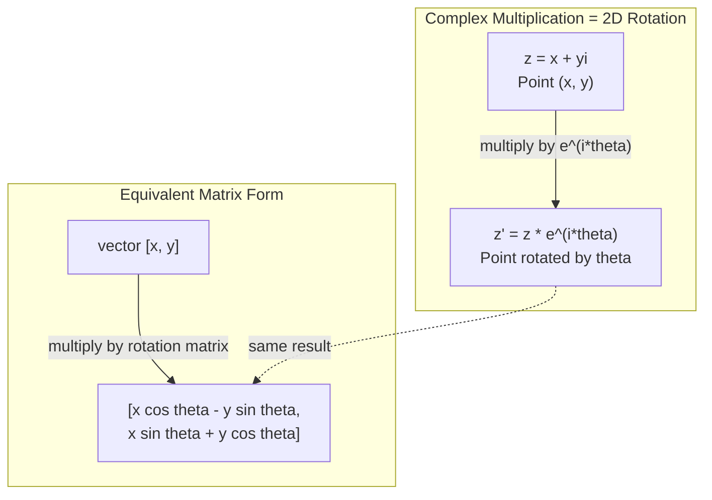
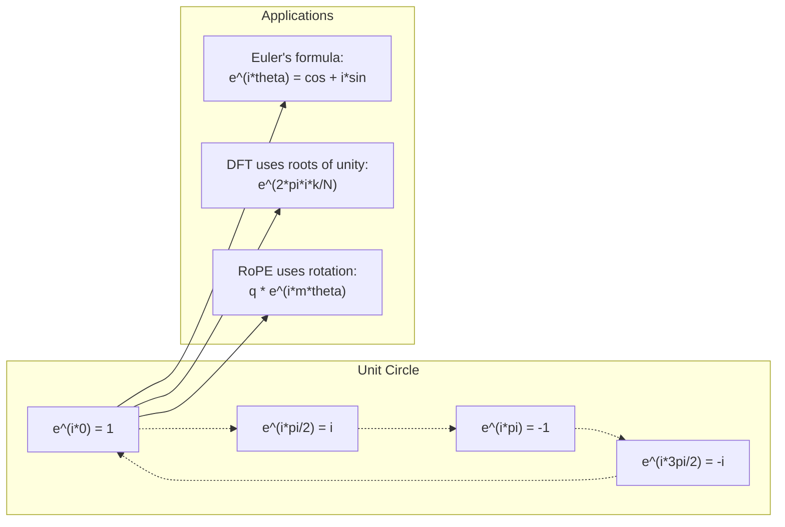

# Liczby zespolone dla AI

> Pierwiastek kwadratowy z -1 nie jest urojony. Jest kluczem do obrotów, częstotliwości i połowy przetwarzania sygnałów.

**Typ:** Nauka
**Język:** Python
**Wymagania wstępne:** Phase 1, Lessons 01-04 (algebra liniowa, rachunek różniczkowy)
**Czas:** ~60 minut

## Cele uczenia się

- Wykonuj operacje arytmetyczne na liczbach zespolonych (dodawanie, mnożenie, dzielenie, sprzężenie) zarówno w formie prostokątnej, jak i biegunowej
- Stosuj wzór Eulera do konwersji między zespolonymi funkcjami wykładniczymi a funkcjami trygonometrycznymi
- Implementuj Dyskretną Transformację Fouriera używając zespolonych pierwiastków z jedności
- Wyjaśnij, jak zespolone obroty leżą u podstaw RoPE i sinusoidalnego kodowania pozycyjnego w transformerach

## Problem

Otwierasz artykuł o transformatach Fouriera i wszędzie widzisz `i`. Patrzysz na kodowania pozycyjne transformerów i widzisz `sin` i `cos` przy różnych częstotliwościach -- części rzeczywiste i urojone zespolonych funkcji wykładniczych. Czytasz o obliczeniach kwantowych i znajdujesz wszystko wyrażone w zespolonych przestrzeniach wektorowych.

Liczby zespolone wydają się abstrakcyjne. System liczbowy oparty na pierwiastku kwadratowym z -1 brzmi jak matematyczna sztuczka. Ale to nie jest sztuczka. To naturalny język obrotów i oscylacji. Za każdym razem, gdy coś się obraca, wibruje lub oscyluje, liczby zespolone są właściwym narzędziem.

Bez zrozumienia liczb zespolonych nie możesz zrozumieć Dyskretnej Transformacji Fouriera. Nie możesz zrozumieć FFT. Nie możesz zrozumieć, jak działa RoPE (Rotary Position Embedding) w nowoczesnych modelach językowych. Nie możesz zrozumieć, dlaczego sinusoidalne kodowania pozycyjne w oryginalnej pracy o Transformerze używają właśnie tych częstotliwości.

Ta lekcja buduje arytmetykę zespoloną od podstaw, łączy ją z geometrią i pokazuje dokładnie, gdzie liczby zespolone pojawiają się w uczeniu maszynowym.

## Koncepcja

### Czym jest liczba zespolona?

Liczba zespolona ma dwie części: część rzeczywistą i część urojoną.

```
z = a + bi

gdzie:
  a to część rzeczywista
  b to część urojona
  i to jednostka urojona, zdefiniowana przez i^2 = -1
```

To wszystko. Rozszerzasz oś liczbową na płaszczyznę. Liczby rzeczywiste leżą na jednej osi. Liczby urojone leżą na drugiej. Każda liczba zespolona jest punktem na tej płaszczyźnie.

### Arytmetyka zespolona

**Dodawanie.** Dodaj części rzeczywiste do siebie, dodaj części urojone do siebie.

```
(a + bi) + (c + di) = (a + c) + (b + d)i

Przykład: (3 + 2i) + (1 + 4i) = 4 + 6i
```

**Mnożenie.** Użyj prawa rozdzielności i pamiętaj, że i^2 = -1.

```
(a + bi)(c + di) = ac + adi + bci + bdi^2
                 = ac + adi + bci - bd
                 = (ac - bd) + (ad + bc)i

Przykład: (3 + 2i)(1 + 4i) = 3 + 12i + 2i + 8i^2
                            = 3 + 14i - 8
                            = -5 + 14i
```

**Sprzężenie.** Zmień znak części urojonej.

```
sprzężenie z (a + bi) = a - bi
```

Iloczyn liczby zespolonej i jej sprzężenia jest zawsze rzeczywisty:

```
(a + bi)(a - bi) = a^2 + b^2
```

**Dzielenie.** Pomnóż licznik i mianownik przez sprzężenie mianownika.

```
(a + bi) / (c + di) = (a + bi)(c - di) / (c^2 + d^2)
```

To eliminuje część urojoną z mianownika, dając ci czystą liczbę zespoloną.

### Płaszczyzna zespolona

Płaszczyzna zespolona mapuje każdą liczbę zespoloną na punkt 2D. Oś pozioma to oś rzeczywista, oś pionowa to oś urojona.

```
z = 3 + 2i  odpowiada punktowi (3, 2)
z = -1 + 0i odpowiada punktowi (-1, 0) na osi rzeczywistej
z = 0 + 4i  odpowiada punktowi (0, 4) na osi urojonej
```

Liczba zespolona jest jednocześnie punktem i wektorem od początku układu. Ta podwójna interpretacja sprawia, że liczby zespolone są przydatne w geometrii.

### Forma biegunowa

Każdy punkt na płaszczyźnie można opisać przez jego odległość od początku układu i kąt od dodatniej osi rzeczywistej.

```
z = r * (cos(theta) + i*sin(theta))

gdzie:
  r = |z| = sqrt(a^2 + b^2)     (moduł, czyli wartość bezwzględna)
  theta = atan2(b, a)             (faza, czyli argument)
```

Forma prostokątna (a + bi) jest dobra do dodawania. Forma biegunowa (r, theta) jest dobra do mnożenia.

**Mnożenie w formie biegunowej.** Pomnóż moduły, dodaj kąty.

```
z1 = r1 * e^(i*theta1)
z2 = r2 * e^(i*theta2)

z1 * z2 = (r1 * r2) * e^(i*(theta1 + theta2))
```

Dlatego liczby zespolone są idealne do obrotów. Mnożenie przez liczbę zespoloną o module 1 to czysty obrót.

### Wzór Eulera

Most między zespolonymi funkcjami wykładniczymi a trygonometrią:

```
e^(i*theta) = cos(theta) + i*sin(theta)
```

To najważniejszy wzór w tej lekcji. Gdy theta = pi:

```
e^(i*pi) = cos(pi) + i*sin(pi) = -1 + 0i = -1

Dlatego: e^(i*pi) + 1 = 0
```

Pięć podstawowych stałych (e, i, pi, 1, 0) połączonych w jednym równaniu.

### Dlaczego wzór Eulera ma znaczenie dla ML

Wzór Eulera mówi, że `e^(i*theta)` zakreśla okrąg jednostkowy wraz ze zmianą theta. Gdy theta = 0, jesteś w punkcie (1, 0). Gdy theta = pi/2, jesteś w punkcie (0, 1). Gdy theta = pi, jesteś w punkcie (-1, 0). Gdy theta = 3*pi/2, jesteś w punkcie (0, -1). Pełny obrót to theta = 2*pi.

To oznacza, że zespolone funkcje wykładnicze TO obroty. A obroty są wszędzie w przetwarzaniu sygnałów i ML.

### Związek z obrotami 2D

Mnożenie liczby zespolonej (x + yi) przez e^(i*theta) obraca punkt (x, y) o kąt theta wokół początku układu.

```
Obrót przez mnożenie zespolone:
  (x + yi) * (cos(theta) + i*sin(theta))
  = (x*cos(theta) - y*sin(theta)) + (x*sin(theta) + y*cos(theta))i

Obrót przez mnożenie macierzy:
  [cos(theta)  -sin(theta)] [x]   [x*cos(theta) - y*sin(theta)]
  [sin(theta)   cos(theta)] [y] = [x*sin(theta) + y*cos(theta)]
```

Dają identyczne wyniki. Mnożenie zespolone TO obrót 2D. Macierz obrotu to po prostu mnożenie zespolone zapisane w notacji macierzowej.



### Fazory i obracające się sygnały

Zespolona funkcja wykładnicza e^(i*omega*t) to punkt obracający się wokół okręgu jednostkowego z częstotliwością kątową omega. Gdy t rośnie, punkt zakreśla okrąg.

Część rzeczywista tego obracającego się punktu to cos(omega*t). Część urojona to sin(omega*t). Sygnał sinusoidalny to cień obracającej się liczby zespolonej.

```
e^(i*omega*t) = cos(omega*t) + i*sin(omega*t)

Część rzeczywista:      cos(omega*t)    -- fala cosinus
Część urojona: sin(omega*t)    -- fala sinus
```

To jest reprezentacja fazorowa. Zamiast śledzić falisty sinusoidę, śledzisz gładko obracającą się strzałkę. Przesunięcia fazowe stają się offsetami kątowymi. Zmiany amplitudy stają się zmianami modułu. Dodawanie sygnałów staje się dodawaniem wektorów.

### Pierwiastki z jedności

N-te pierwiastki z jedności to N punktów równo rozmieszczonych na okręgu jednostkowym:

```
w_k = e^(2*pi*i*k/N)    dla k = 0, 1, 2, ..., N-1
```

Dla N = 4, pierwiastki to: 1, i, -1, -i (cztery główne kierunki).
Dla N = 8, otrzymujesz cztery główne kierunki plus cztery przekątne.

Pierwiastki z jedności są fundamentem Dyskretnej Transformacji Fouriera. DFT rozkłada sygnał na składowe przy tych N równo rozmieszczonych częstotliwościach.

### Związek z DFT

Dyskretna Transformacja Fouriera sygnału x[0], x[1], ..., x[N-1] to:

```
X[k] = sum_{n=0}^{N-1} x[n] * e^(-2*pi*i*k*n/N)
```

Każde X[k] mierzy, jak bardzo sygnał koreluje z k-tym pierwiastkiem z jedności -- zespolonym sinusoidą przy częstotliwości k. DFT rozkłada sygnał na N obracających się fazorów i mówi ci amplitudę i fazę każdego z nich.

### Dlaczego i nie jest urojone

Słowo "urojony" to historyczny przypadek. Kartezjusz użył go lekceważąco. Ale i nie jest bardziej urojone niż liczby ujemne były, gdy ludzie je początkowo odrzucali. Liczby ujemne odpowiadają na pytanie "co otrzymujesz, gdy odejmujesz 5 od 3?" Jednostka urojona odpowiada na pytanie "co podnosisz do kwadratu, aby otrzymać -1?"

Bardziej użytecznie: i jest operatorem obrotu o 90 stopni. Pomnóż liczbę rzeczywistą przez i raz, obracasz się o 90 stopni do osi urojonej. Pomnóż przez i ponownie (i^2), obracasz się kolejne 90 stopni -- teraz wskazujesz w ujemnym kierunku rzeczywistym. Dlatego i^2 = -1. To nie jest tajemnicze. To pół-obrót zbudowany z dwóch ćwierć-obrotów.

Dlatego liczby zespolone są wszędzie w inżynierii. Wszystko, co się obraca -- fale elektromagnetyczne, stany kwantowe, oscylacje sygnałów, kodowania pozycyjne -- jest naturalnie opisywane przez liczby zespolone.

### Zespolone funkcje wykładnicze a funkcje trygonometryczne

Przed wzorem Eulera inżynierowie zapisywali sygnały jako A*cos(omega*t + phi) -- amplituda A, częstotliwość omega, faza phi. To działa, ale arytmetyka jest bolesna. Dodawanie dwóch cosinusów z różnymi fazami wymaga tożsamości trygonometrycznych.

Z zespolonymi funkcjami wykładniczymi ten sam sygnał to A*e^(i*(omega*t + phi)). Dodawanie dwóch sygnałów to po prostu dodawanie dwóch liczb zespolonych. Mnożenie (modulacja) to po prostu mnożenie modułów i dodawanie kątów. Przesunięcia fazowe stają się dodawaniem kątów. Przesunięcia częstotliwości stają się mnożeniem przez fazory.

Cała dziedzina przetwarzania sygnałów przeszła na notację zespolonych funkcji wykładniczych, ponieważ matematyka jest czystsza. "Sygnał rzeczywisty" to zawsze część rzeczywista reprezentacji zespolonej. Część urojona jest prowadzona jako księgowość, sprawiając, że cała algebra działa naturalnie.

### Związek z transformerami

**Sinusoidalne kodowania pozycyjne** (oryginalna praca o Transformerze):

```
PE(pos, 2i) = sin(pos / 10000^(2i/d))
PE(pos, 2i+1) = cos(pos / 10000^(2i/d))
```

Pary sin i cos to części rzeczywiste i urojone zespolonych funkcji wykładniczych przy różnych częstotliwościach. Każda częstotliwość zapewnia inną "rozdzielczość" kodowania pozycji. Niskie częstotliwości zmieniają się wolno (gruba pozycja). Wysokie częstotliwości zmieniają się szybko (drobna pozycja). Razem dają każdej pozycji unikalny "odcisk palca" częstotliwościowy.

**RoPE (Rotary Position Embedding)** rozwija to dalej. Jawnie mnoży wektory query i key przez macierze zespolonych obrotów. Względna pozycja między dwoma tokenami staje się kątem obrotu. Attention jest obliczane używając tych obróconych wektorów, sprawiając, że model jest wrażliwy na pozycję względną przez mnożenie zespolone.

| Operacja | Forma algebraiczna | Znaczenie geometryczne |
|-----------|---------------|-------------------|
| Dodawanie | (a+c) + (b+d)i | Dodawanie wektorów na płaszczyźnie |
| Mnożenie | (ac-bd) + (ad+bc)i | Obracanie i skalowanie |
| Sprzężenie | a - bi | Odbicie względem osi rzeczywistej |
| Moduł | sqrt(a^2 + b^2) | Odległość od początku układu |
| Faza | atan2(b, a) | Kąt od dodatniej osi rzeczywistej |
| Dzielenie | mnożenie przez sprzężenie | Odwrócenie obrotu i przeskalowanie |
| Potęgowanie | r^n * e^(i*n*theta) | Obrót n razy, skalowanie przez r^n |



## Zbuduj to

### Krok 1: Klasa Complex

Zbuduj klasę liczb zespolonych Complex, która obsługuje arytmetykę, moduł, fazę i konwersję między formą prostokątną a biegunową.

```python
import math

class Complex:
    def __init__(self, real, imag=0.0):
        self.real = real
        self.imag = imag

    def __add__(self, other):
        return Complex(self.real + other.real, self.imag + other.imag)

    def __mul__(self, other):
        r = self.real * other.real - self.imag * other.imag
        i = self.real * other.imag + self.imag * other.real
        return Complex(r, i)

    def __truediv__(self, other):
        denom = other.real ** 2 + other.imag ** 2
        r = (self.real * other.real + self.imag * other.imag) / denom
        i = (self.imag * other.real - self.real * other.imag) / denom
        return Complex(r, i)

    def magnitude(self):
        return math.sqrt(self.real ** 2 + self.imag ** 2)

    def phase(self):
        return math.atan2(self.imag, self.real)

    def conjugate(self):
        return Complex(self.real, -self.imag)
```

### Krok 2: Konwersja biegunowa i wzór Eulera

```python
def to_polar(z):
    return z.magnitude(), z.phase()

def from_polar(r, theta):
    return Complex(r * math.cos(theta), r * math.sin(theta))

def euler(theta):
    return Complex(math.cos(theta), math.sin(theta))
```

Zweryfikuj: `euler(theta).magnitude()` powinno zawsze być 1.0. `euler(0)` powinno dać (1, 0). `euler(pi)` powinno dać (-1, 0).

### Krok 3: Obrót

Obrót punktu (x, y) o kąt theta to jedno mnożenie zespolone:

```python
point = Complex(3, 4)
rotated = point * euler(math.pi / 4)
```

Moduł pozostaje taki sam. Tylko kąt się zmienia.

### Krok 4: DFT z arytmetyki zespolonej

```python
def dft(signal):
    N = len(signal)
    result = []
    for k in range(N):
        total = Complex(0, 0)
        for n in range(N):
            angle = -2 * math.pi * k * n / N
            total = total + Complex(signal[n], 0) * euler(angle)
        result.append(total)
    return result
```

To jest DFT O(N^2). Każde wyjście X[k] to suma próbek sygnału pomnożonych przez pierwiastki z jedności.

### Krok 5: Odwrotna DFT

Odwrotna DFT rekonstruuje oryginalny sygnał z jego widma. Jedyne zmiany względem DFT w przód: zmień znak w wykładniku i podziel przez N.

```python
def idft(spectrum):
    N = len(spectrum)
    result = []
    for n in range(N):
        total = Complex(0, 0)
        for k in range(N):
            angle = 2 * math.pi * k * n / N
            total = total + spectrum[k] * euler(angle)
        result.append(Complex(total.real / N, total.imag / N))
    return result
```

To daje ci idealną rekonstrukcję. Zastosuj DFT, potem IDFT, a otrzymasz oryginalny sygnał z dokładnością do precyzji maszynowej. Żadna informacja nie jest tracona.

### Krok 6: Pierwiastki z jedności

```python
def roots_of_unity(N):
    return [euler(2 * math.pi * k / N) for k in range(N)]
```

Zweryfikuj dwie właściwości:
- Każdy pierwiastek ma moduł dokładnie 1.
- Suma wszystkich N pierwiastków to zero (znoszą się przez symetrię).

Te właściwości sprawiają, że DFT jest odwracalna. Pierwiastki z jedności tworzą ortogonalną bazę dla dziedziny częstotliwości.

## Użyj tego

Python ma wbudowaną obsługę liczb zespolonych. Literał `j` reprezentuje jednostkę urojoną.

```python
z = 3 + 2j
w = 1 + 4j

print(z + w)
print(z * w)
print(abs(z))

import cmath
print(cmath.phase(z))
print(cmath.exp(1j * cmath.pi))
```

Dla tablic, numpy natywnie obsługuje liczby zespolone:

```python
import numpy as np

z = np.array([1+2j, 3+4j, 5+6j])
print(np.abs(z))
print(np.angle(z))
print(np.conj(z))
print(np.real(z))
print(np.imag(z))

signal = np.sin(2 * np.pi * 5 * np.linspace(0, 1, 128))
spectrum = np.fft.fft(signal)
freqs = np.fft.fftfreq(128, d=1/128)
```

## Wdróż to

Uruchom `code/complex_numbers.py`, aby wygenerować `outputs/skill-complex-arithmetic.md`.

## Ćwiczenia

1. **Arytmetyka zespolona ręcznie.** Oblicz (2 + 3i) * (4 - i) i zweryfikuj z kodem. Potem oblicz (5 + 2i) / (1 - 3i). Narysuj oba wyniki na płaszczyźnie zespolonej i sprawdź, że mnożenie obróciło i przeskalowało pierwszą liczbę.

2. **Sekwencja obrotów.** Zacznij od punktu (1, 0). Pomnóż przez e^(i*pi/6) dwanaście razy. Zweryfikuj, że wracasz do (1, 0) po 12 mnożeniach. Wydrukuj współrzędne na każdym kroku i potwierdź, że zakreślają regularny 12-kąt.

3. **DFT znanego sygnału.** Utwórz sygnał, który jest sumą sin(2*pi*3*t) i 0.5*sin(2*pi*7*t) próbkowany w 32 punktach. Uruchom DFT. Zweryfikuj, że widmo amplitud ma szczyty przy częstotliwościach 3 i 7, przy czym szczyt przy 7 ma połowę wysokości szczytu przy 3.

4. **Wizualizacja pierwiastków z jedności.** Oblicz 8-me pierwiastki z jedności. Zweryfikuj, że sumują się do zera. Zweryfikuj, że mnożenie dowolnego pierwiastka przez pierwiastek pierwotny e^(2*pi*i/8) daje następny pierwiastek.

5. **Równoważność macierzy obrotu.** Dla 10 losowych kątów i 10 losowych punktów zweryfikuj, że mnożenie zespolone daje taki sam wynik jak mnożenie macierzowo-wektorowe z macierzą obrotu 2x2. Wydrukuj maksymalną różnicę numeryczną.

## Kluczowe pojęcia

| Pojęcie | Co oznacza |
|------|---------------|
| Liczba zespolona | Liczba a + bi, gdzie a to część rzeczywista, b to część urojona, a i^2 = -1 |
| Jednostka urojona | Liczba i, zdefiniowana przez i^2 = -1. Nie jest urojona w sensie filozoficznym -- jest operatorem obrotu |
| Płaszczyzna zespolona | Płaszczyzna 2D, gdzie oś x jest rzeczywista, a oś y jest urojona. Nazywana też płaszczyzną Arganda |
| Moduł | Odległość od początku układu: sqrt(a^2 + b^2). Zapisywany jako \|z\| |
| Faza (argument) | Kąt od dodatniej osi rzeczywistej: atan2(b, a). Zapisywany jako arg(z) |
| Sprzężenie | Lustro względem osi rzeczywistej: sprzężenie a + bi to a - bi |
| Forma biegunowa | Wyrażanie z jako r * e^(i*theta) zamiast a + bi. Ułatwia mnożenie |
| Wzór Eulera | e^(i*theta) = cos(theta) + i*sin(theta). Łączy funkcje wykładnicze z trygonometrią |
| Fazor | Obracająca się liczba zespolona e^(i*omega*t) reprezentująca sygnał sinusoidalny |
| Pierwiastki z jedności | N liczb zespolonych e^(2*pi*i*k/N) dla k = 0 do N-1. N równo rozmieszczonych punktów na okręgu jednostkowym |
| DFT | Dyskretna Transformacja Fouriera. Rozkłada sygnał na zespolone składowe sinusoidalne używając pierwiastków z jedności |
| RoPE | Rotary Position Embedding. Używa mnożenia zespolonego do kodowania pozycji względnej w attention transformerów |

## Dalsza lektura

- [Visual Introduction to Euler's Formula](https://betterexplained.com/articles/intuitive-understanding-of-eulers-formula/) - buduje geometryczną intuicję bez ciężkich oznaczeń
- [Su et al.: RoFormer (2021)](https://arxiv.org/abs/2104.09864) - praca wprowadzająca Rotary Position Embedding używając zespolonych obrotów
- [Vaswani et al.: Attention Is All You Need (2017)](https://arxiv.org/abs/1706.03762) - oryginalna praca o Transformerze z sinusoidalnymi kodowaniami pozycyjnymi
- [3Blue1Brown: Euler's formula with introductory group theory](https://www.youtube.com/watch?v=mvmuCPvRoWQ) - wizualne wyjaśnienie, dlaczego e^(i*pi) = -1
- [Needham: Visual Complex Analysis](https://global.oup.com/academic/product/visual-complex-analysis-9780198534464) - najlepsze wizualne opracowanie liczb zespolonych, pełne geometrycznych wglądów
- [Strang: Introduction to Linear Algebra, Ch. 10](https://math.mit.edu/~gs/linearalgebra/) - liczby zespolone w kontekście algebry liniowej i wartości własnych