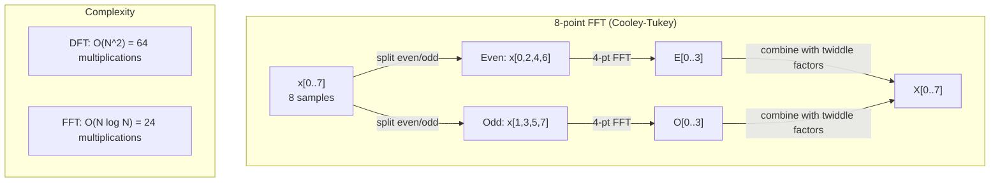
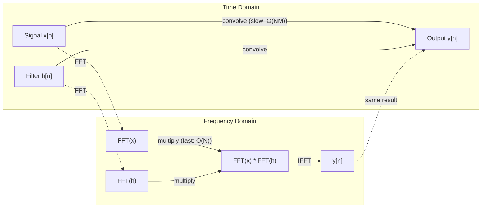

# Transformacja Fouriera

> Każdy sygnał jest sumą fal sinusoidalnych. Transformacja Fouriera mówi ci, które z nich.

**Type:** Build
**Language:** Python
**Prerequisites:** Phase 1, Lessons 01-04, 19 (complex numbers)
**Time:** ~90 minut

## Cele uczenia się

- Zaimplementuj DFT od podstaw i zweryfikuj je wobec Cooley-Tukey FFT o złożoności O(N log N)
- Zinterpretuj współczynniki częstotliwości: wyekstrahuj amplitudę, fazę i widmo mocy z sygnału
- Zastosuj twierdzenie o splocie, aby wykonać splot poprzez mnożenie FFT
- Połącz dekompozycję częstotliwości Fouriera z kodowaniem pozycyjnym transformatorów i warstwami splotowymi CNN

## Problem

Nagranie audio to ciąg pomiarów ciśnienia w czasie. Cena akcji to ciąg wartości w dniach. Obraz to siatka intensywności pikseli w przestrzeni. Wszystkie te dane znajdują się w dziedzinie czasu (lub przestrzeni). Widzisz wartości zmieniające się wzdłuż jakiegoś indeksu.

Ale wiele wzorców jest niewidocznych w dziedzinie czasu. Czy ten sygnał audio jest czystym tonem, czy akordem? Czy cena akcji ma cykl tygodniowy? Czy ten obraz ma powtarzającą się teksturę? Te pytania dotyczą zawartości częstotliwościowej, a dziedzina czasu ją ukrywa.

Transformacja Fouriera konwertuje dane z dziedziny czasu do dziedziny częstotliwości. Pobiera sygnał i rozkłada go na fale sinusoidalne o różnych częstotliwościach. Każda fala sinusoidalna ma amplitudę (jak silna jest) i fazę (gdzie się zaczyna). Transformacja Fouriera podaje ci obie.

To ma znaczenie dla ML, ponieważ myślenie w dziedzinie częstotliwości pojawia się wszędzie. Splotowe sieci neuronowe wykonują splot, który jest mnożeniem w dziedzinie częstotliwości. Kodowania pozycyjne transformatorów używają dekompozycji częstotliwościowej do reprezentowania pozycji. Modele audio (rozpoznawanie mowy, generowanie muzyki) operują na spektrogramach — reprezentacjach częstotliwościowych dźwięku. Modele szeregów czasowych szukają wzorców periodycznych. Zrozumienie transformacji Fouriera daje ci słownictwo do pracy ze wszystkimi tymi metodami.

## Koncepcja

### Definicja DFT

Mając N próbek x[0], x[1], ..., x[N-1], Dyskretna Transformacja Fouriera (DFT) produkuje N współczynników częstotliwości X[0], X[1], ..., X[N-1]:

```
X[k] = sum_{n=0}^{N-1} x[n] * e^(-2*pi*i*k*n/N)

for k = 0, 1, ..., N-1
```

Każde X[k] jest liczbą zespoloną. Jej wartość bezwzględna |X[k]| mówi ci o amplitudzie częstotliwości k. Jej kąt fazowy angle(X[k]) mówi ci o przesunięciu fazowym tej częstotliwości.

Kluczowy wgląd: `e^(-2*pi*i*k*n/N)` jest wirującym wektorem fazowym o częstotliwości k. DFT oblicza korelację między sygnałem a każdą z N równomiernie rozmieszczonych częstotliwości. Jeśli sygnał zawiera energię przy częstotliwości k, korelacja jest duża. Jeśli nie, jest bliska zeru.

### Co oznacza każdy współczynnik

**X[0]: składowa DC.** To suma wszystkich próbek — proporcjonalna do średniej. Reprezentuje stałe (zerowa częstotliwość) przesunięcie sygnału.

```
X[0] = sum_{n=0}^{N-1} x[n] * e^0 = suma wszystkich próbek
```

**X[k] dla 1 <= k <= N/2: częstotliwości dodatnie.** X[k] reprezentuje k cykli na N próbek. Wyższe k oznacza wyższą częstotliwość (szybsze oscylacje).

**X[N/2]: częstotliwość Nyquista.** Najwyższa częstotliwość, jaką możesz reprezentować z N próbkami. Powyżej tej częstotliwości pojawia się aliasing — wysokie częstotliwości udające niskie.

**X[k] dla N/2 < k < N: częstotliwości ujemne.** Dla sygnałów rzeczywistych X[N-k] = conj(X[k]). Częstotliwości ujemne są lustrzanym odbiciem dodatnich. Dlatego użyteczna informacja znajduje się w pierwszych N/2 + 1 współczynnikach.

### Odwrotna DFT

Odwrotna DFT rekonstruuje oryginalny sygnał ze swoich współczynników częstotliwości:

```
x[n] = (1/N) * sum_{k=0}^{N-1} X[k] * e^(2*pi*i*k*n/N)

for n = 0, 1, ..., N-1
```

Jedyne różnice w stosunku do DFT w przód: znak w wykładniku jest dodatni (nie ujemny), i jest współczynnik normalizacji 1/N.

Odwrotna DFT daje doskonałą rekonstrukcję. Żadna informacja nie jest tracona. Możesz przejść z dziedziny czasu do dziedziny częstotliwości i z powrotem bez żadnego błędu. DFT jest zmianą bazy — wyraża te same informacje w innym układzie współrzędnych.

### FFT: przyspieszenie obliczeń

DFT zdefiniowana powyżej ma złożoność O(N^2): dla każdego z N współczynników wyjściowych sumujesz po N próbkach wejściowych. Dla N = 1 milion, to jest 10^12 operacji.

Szybka Transformacja Fouriera (FFT) oblicza ten sam wynik w O(N log N). Dla N = 1 milion, to jest około 20 milionów operacji zamiast biliona. To jest to, co sprawia, że analiza częstotliwościowa jest praktyczna.

Algorytm Cooley-Tukey (najczęstszy FFT) działa metodą dziel i zwyciężaj:

1. Podziel sygnał na próbki o parzystych i nieparzystych indeksach.
2. Oblicz DFT każdej połowy rekurencyjnie.
3. Połącz dwie połówkowe DFT używając "czynników obrotnych" e^(-2*pi*i*k/N).

```
X[k] = E[k] + e^(-2*pi*i*k/N) * O[k]          for k = 0, ..., N/2 - 1
X[k + N/2] = E[k] - e^(-2*pi*i*k/N) * O[k]    for k = 0, ..., N/2 - 1

where E = DFT of even-indexed samples
      O = DFT of odd-indexed samples
```

Symetria oznacza, że każdy poziom rekursji wykonuje O(N) pracy, a jest log2(N) poziomów. Razem: O(N log N).



FFT wymaga, aby długość sygnału była potęgą dwóch. W praktyce sygnały są dopełniane zerami do następnej potęgi dwóch.

### Analiza spektralna

**Widmo mocy** to |X[k]|^2 — kwadrat wartości bezwzględnej każdego współczynnika częstotliwości. Pokazuje, ile energii jest przy każdej częstotliwości.

**Widmo fazowe** to angle(X[k]) — przesunięcie fazowe każdej częstotliwości. Dla większości zadań analitycznych interesuje cię widmo mocy, a fazę ignorujesz.

```
Moc przy częstotliwości k:  P[k] = |X[k]|^2 = X[k].real^2 + X[k].imag^2
Faza przy częstotliwości k:  phi[k] = atan2(X[k].imag, X[k].real)
```

### Rozdzielczość częstotliwościowa

Rozdzielczość częstotliwościowa DFT zależy od liczby próbek N i częstotliwości próbkowania fs.

```
Częstotliwość kosza k:      f_k = k * fs / N
Rozdzielczość częstotliwościowa:    delta_f = fs / N
Maksymalna częstotliwość:       f_max = fs / 2  (Nyquist)
```

Aby rozróżnić dwie bliskie sobie częstotliwości, potrzebujesz więcej próbek. Aby uchwycić wysokie częstotliwości, potrzebujesz wyższej częstotliwości próbkowania.

### Twierdzenie o splocie

To jedno z najważniejszych wyników w przetwarzaniu sygnałów i ma bezpośredni związek z CNN.

**Splot w dziedzinie czasu równa się mnożeniu punktowemu w dziedzinie częstotliwości.**

```
x * h = IFFT(FFT(x) . FFT(h))

where * is convolution and . is element-wise multiplication
```

Dlaczego to ma znaczenie:

- Bezpośredni splot dwóch sygnałów o długości N i M wymaga O(N*M) operacji.
- Splot oparty na FFT wymaga O(N log N): transformuj oba, pomnóż, transformuj z powrotem.
- Dla dużych jąder splot FFT jest dramatycznie szybszy.
- To dokładnie to, co dzieje się w warstwach splotowych z dużymi polami odbiorczymi.

Uwaga: DFT oblicza splot cykliczny (sygnał się zawija). Dla splotu liniowego (bez zawijania), dopełnij oba sygnały zerami do długości N + M - 1 przed obliczeniem.



### Okienkowanie

DFT zakłada, że sygnał jest okresowy — traktuje N próbek jako jeden okres nieskończenie powtarzającego się sygnału. Jeśli sygnał nie zaczyna i nie kończy tą samą wartością, tworzy to nieciągłość na granicy, która pojawia się jako pozorny sygnał wysokoczęstotliwościowy. To nazywa się przeciekaniem widmowym.

Okienkowanie redukuje przeciekanie przez zwężenie sygnału do zera na obu końcach przed obliczeniem DFT.

Popularne okna:

| Okno | Kształt | Szerokość płata głównego | Poziom płata bocznego | Przypadek użycia |
|------|---------|------------------------|---------------------|------------------|
| Prostokątne | Płaskie (bez okna) | Najwęższe | Najwyższy (-13 dB) | Gdy sygnał jest dokładnie okresowy w N próbkach |
| Hann | Podniesiony cosinus | Umiarkowana | Niski (-31 dB) | Ogólna analiza spektralna |
| Hamming | Zmodyfikowany cosinus | Umiarkowana | Niższy (-42 dB) | Przetwarzanie audio, analiza mowy |
| Blackman | Potrójny cosinus | Szerokie | Bardzo niski (-58 dB) | Gdy tłumienie płata bocznego jest krytyczne |

```
Okno Hann:    w[n] = 0.5 * (1 - cos(2*pi*n / (N-1)))
Okno Hamming: w[n] = 0.54 - 0.46 * cos(2*pi*n / (N-1))
```

Zastosuj okno mnożąc je elementowo z sygnałem przed DFT: `X = DFT(x * w)`.

### Właściwości DFT

| Właściwość | Dziedzina czasu | Dziedzina częstotliwości |
|------------|-----------------|-------------------------|
| Liniowość | a*x + b*y | a*X + b*Y |
| Przesunięcie czasowe | x[n - k] | X[f] * e^(-2*pi*i*f*k/N) |
| Przesunięcie częstotliwości | x[n] * e^(2*pi*i*f0*n/N) | X[f - f0] |
| Splot | x * h | X * H (punktowo) |
| Mnożenie | x * h (punktowo) | X * H (splot cykliczny, skalowany przez 1/N) |
| Twierdzenie Parsevala | suma |x[n]|^2 | (1/N) * suma |X[k]|^2 |
| Symetria sprzężona (sygnał rzeczywisty) | x[n] rzeczywiste | X[k] = conj(X[N-k]) |

Twierdzenie Parsevala mówi, że całkowita energia jest taka sama w obu dziedzinach. Energia jest zachowana przez transformację.

### Związek z kodowaniami pozycyjnymi

Oryginalny Transformer używa sinusoidialnych kodowań pozycyjnych:

```
PE(pos, 2i)   = sin(pos / 10000^(2i/d_model))
PE(pos, 2i+1) = cos(pos / 10000^(2i/d_model))
```

Każda para wymiarów (2i, 2i+1) oscyluje przy innej częstotliwości. Częstotliwości są rozmieszczone geometrycznie od wysokich (wymiary 0,1) do niskich (ostatnie wymiary). To daje każdej pozycji unikalny wzorzec we wszystkich pasmach częstotliwościowych — podobnie jak współczynniki Fouriera jednoznacznie identyfikują sygnał.

Kluczowe właściwości, które to zapewnia:

- **Unikalność:** Żadne dwie pozycje nie mają tego samego kodowania.
- **Ograniczone wartości:** sin i cos są zawsze w [-1, 1].
- **Pozycja względna:** Kodowanie pozycji p+k można wyrazić jako funkcję liniową kodowania w pozycji p. Model może nauczyć się przykładać uwagę do pozycji względnych.

### Związek z CNN

Warstwa splotowa stosuje nauczony filtr (jądro) do wejścia przesuwając go przez sygnał lub obraz. Matematycznie jest to operacja splotu.

Na mocy twierdzenia o splocie jest to równoważne:
1. Wykonaj FFT wejścia
2. Wykonaj FFT jądra
3. Pomnóż w dziedzinie częstotliwości
4. Wykonaj IFFT wyniku

Standardowe implementacje CNN używają bezpośredniego splotu (szybsze dla małych jąder 3x3). Ale dla dużych jąder lub splotu globalnego podejścia oparte na FFT są znacznie szybsze. Niektóre architektury (jak FNet) zastępują attention całkowicie FFT, osiągając konkurencyjną dokładność z złożonością O(N log N) zamiast O(N^2).

### Spektrogramy i Krótkoczasowa Transformacja Fouriera

Pojedyncze FFT daje ci zawartość częstotliwościową całego sygnału, ale nie mówi nic o tym, kiedy te częstotliwości występują. Sygnał chirp (sygnał, którego częstotliwość rośnie w czasie) i akord (wszystkie częstotliwości obecne jednocześnie) mogą mieć to samo widmo amplitudowe.

Krótkoczasowa Transformacja Fouriera (STFT) rozwiązuje to przez obliczanie FFT na zachodzących na siebie oknach sygnału. Wynikiem jest spektrogram: reprezentacja 2D z czasem na jednej osi i częstotliwością na drugiej. Intensywność w każdym punkcie pokazuje energię przy tej częstotliwości w tym czasie.

```
Procedura STFT:
1. Wybierz rozmiar okna (np. 1024 próbki)
2. Wybierz rozmiar przeskoku (np. 256 próbek — 75% nakładki)
3. Dla każdej pozycji okna:
   a. Wyekstrahuj segment okienkowany
   b. Zastosuj okno Hann/Hamming
   c. Oblicz FFT
   d. Zapisz widmo amplitudowe jako jedną kolumnę spektrogramu
```

Spektrogramy są standardową reprezentacją wejściową dla modeli ML audio. Modele rozpoznawania mowy (Whisper, DeepSpeech) operują na mel-spektrogramach — spektrogramach z częstotliwościami odwzorowanymi na skalę mel, która lepiej odpowiada percepcji wysokości dźwięku przez ludzi.

### Aliasing

Jeśli sygnał zawiera częstotliwości powyżej fs/2 (częstotliwość Nyquista), próbkowanie z szybkością fs stworzy kopię aliasową. Sygnał 90 Hz próbkowany przy 100 Hz wygląda identycznie jak sygnał 10 Hz. Nie ma sposobu, aby odróżnić je od samych próbek.

```
Przykład:
  Rzeczywisty sygnał: fala sinusoidalna 90 Hz
  Częstotliwość próbkowania: 100 Hz
  Pozorna częstotliwość: 100 - 90 = 10 Hz

  Próbki z sygnału 90 Hz przy częstotliwości próbkowania 100 Hz
  są identyczne jak próbki z sygnału 10 Hz.
  Żadna ilość matematyki nie może odzyskać oryginalnego 90 Hz.
```

Dlatego przetworniki analogowo-cyfrowe zawierają filtry antyaliasingowe, które usuwają częstotliwości powyżej Nyquista przed próbkowaniem. W ML aliasing pojawia się przy downsamplowaniu map cech bez właściwego filtrowania dolnoprzepustowego — niektóre architektury adresują to warstwami poolingu antyaliasingowego.

### Dopełnianie zerami nie zwiększa rozdzielczości

Powszechny mit: dopełnianie sygnału zerami przed FFT poprawia rozdzielczość częstotliwościową. Nie poprawia. Dopełnianie zerami interpoluje między istniejącymi koszami częstotliwości, dając ci gładsze widmo. Ale nie może ujawnić szczegółów częstotliwościowych, które nie były obecne w oryginalnych próbkach.

Prawdziwa rozdzielczość częstotliwościowa zależy tylko od czasu obserwacji T = N / fs. Aby rozróżnić dwie częstotliwości oddzielone o delta_f, potrzebujesz co najmniej T = 1 / delta_f sekund danych. Żadna ilość dopełniania zerami nie zmienia tego fundamentalnego ograniczenia.

## Zbuduj to

### Krok 1: DFT od podstaw

DFT o złożoności O(N^2) wynika bezpośrednio z definicji.

```python
import math

class Complex:
    ...

def dft(x):
    N = len(x)
    result = []
    for k in range(N):
        total = Complex(0, 0)
        for n in range(N):
            angle = -2 * math.pi * k * n / N
            w = Complex(math.cos(angle), math.sin(angle))
            xn = x[n] if isinstance(x[n], Complex) else Complex(x[n])
            total = total + xn * w
        result.append(total)
    return result
```

### Krok 2: Odwrotna DFT

Ta sama struktura, dodatni wykładnik, podziel przez N.

```python
def idft(X):
    N = len(X)
    result = []
    for n in range(N):
        total = Complex(0, 0)
        for k in range(N):
            angle = 2 * math.pi * k * n / N
            w = Complex(math.cos(angle), math.sin(angle))
            total = total + X[k] * w
        result.append(Complex(total.real / N, total.imag / N))
    return result
```

### Krok 3: FFT (Cooley-Tukey)

Rekurencyjny FFT wymaga długości będącej potęgą dwóch. Podziel na parzyste i nieparzyste, rekuruj, połącz z czynnikami obrotowymi.

```python
def fft(x):
    N = len(x)
    if N <= 1:
        return [x[0] if isinstance(x[0], Complex) else Complex(x[0])]
    if N % 2 != 0:
        return dft(x)

    even = fft([x[i] for i in range(0, N, 2)])
    odd = fft([x[i] for i in range(1, N, 2)])

    result = [Complex(0)] * N
    for k in range(N // 2):
        angle = -2 * math.pi * k / N
        twiddle = Complex(math.cos(angle), math.sin(angle))
        t = twiddle * odd[k]
        result[k] = even[k] + t
        result[k + N // 2] = even[k] - t
    return result
```

### Krok 4: Funkcje pomocnicze do analizy spektralnej

```python
def power_spectrum(X):
    return [xk.real ** 2 + xk.imag ** 2 for xk in X]

def convolve_fft(x, h):
    N = len(x) + len(h) - 1
    padded_N = 1
    while padded_N < N:
        padded_N *= 2

    x_padded = x + [0.0] * (padded_N - len(x))
    h_padded = h + [0.0] * (padded_N - len(h))

    X = fft(x_padded)
    H = fft(h_padded)

    Y = [xk * hk for xk, hk in zip(X, H)]

    y = idft(Y)
    return [y[n].real for n in range(N)]
```

## Użyj tego

Do prawdziwej pracy używaj numpy FFT, która jest wspierana przez wysoce zoptymalizowane biblioteki C.

```python
import numpy as np

signal = np.sin(2 * np.pi * 5 * np.arange(256) / 256)
spectrum = np.fft.fft(signal)
freqs = np.fft.fftfreq(256, d=1/256)

power = np.abs(spectrum) ** 2

positive_freqs = freqs[:len(freqs)//2]
positive_power = power[:len(power)//2]
```

Do okienkowania i bardziej zaawansowanej analizy spektralnej:

```python
from scipy.signal import windows, stft

window = windows.hann(256)
windowed = signal * window
spectrum = np.fft.fft(windowed)
```

Do splotu:

```python
from scipy.signal import fftconvolve

result = fftconvolve(signal, kernel, mode='full')
```

Do spektrogramów:

```python
from scipy.signal import stft

frequencies, times, Zxx = stft(signal, fs=sample_rate, nperseg=256)
spectrogram = np.abs(Zxx) ** 2
```

Macierz spektrogramu ma kształt (n_frequencies, n_time_frames). Każda kolumna to widmo mocy w jednym oknie czasowym. To jest to, co modele ML audio konsumują jako wejście.

## Wdróż to

Uruchom `code/fourier.py`, aby wygenerować `outputs/prompt-spectral-analyzer.md`.

## Ćwiczenia

1. **Identyfikacja czystego tonu.** Stwórz sygnał z pojedynczą falą sinusoidalną o nieznanej częstotliwości (między 1 a 50 Hz), próbkowany przy 128 Hz przez 1 sekundę. Użyj DFT, aby zidentyfikować częstotliwość. Zweryfikuj, że odpowiedź się zgadza. Teraz dodaj szum Gaussowski o odchyleniu standardowym 0.5 i powtórz. Jak szum wpływa na widmo?

2. **Weryfikacja FFT vs DFT.** Wygeneruj losowy sygnał o długości 64. Oblicz zarówno DFT (O(N^2)), jak i FFT. Zweryfikuj, że wszystkie współczynniki są zgodne w granicach 1e-10. Zmierz czas obu funkcji dla sygnałów o długości 256, 512, 1024 i 2048. Narysuj wykres stosunku czasu DFT do czasu FFT.

3. **Dowód twierdzenia o splocie na przykładzie.** Stwórz sygnał x = [1, 2, 3, 4, 0, 0, 0, 0] i filtr h = [1, 1, 1, 0, 0, 0, 0, 0]. Oblicz ich splot cykliczny bezpośrednio (zagnieżdżona pętla). Następnie oblicz go przez FFT (transformuj, pomnóż, odwrotnie transformuj). Zweryfikuj, że wyniki się zgadzają. Teraz wykonaj splot liniowy przez odpowiednie dopełnienie zerami.

4. **Efekty okienkowania.** Stwórz sygnał, który jest sumą dwóch fal sinusoidalnych przy 10 Hz i 12 Hz (bardzo bliskie). Próbkuj przy 128 Hz przez 1 sekundę. Oblicz widmo mocy bez okna, z oknem Hann i oknem Hamming. Które okno najłatwiej pozwala rozróżnić dwa szczyty? Dlaczego?

5. **Analiza kodowania pozycyjnego.** Wygeneruj sinusoidialne kodowania pozycyjne dla d_model = 128 i max_pos = 512. Dla każdej pary pozycji (p1, p2) oblicz iloczyn skalarny ich kodowań. Pokaż, że iloczyn skalarny zależy tylko od |p1 - p2|, a nie od bezwzględnych pozycji. Co się dzieje z iloczynem skalarnym w miarę wzrostu odległości?

## Kluczowe pojęcia

| Pojęcie | Co oznacza |
|--------|------------|
| DFT (Dyskretna Transformacja Fouriera) | Konwertuje N próbek z dziedziny czasu na N współczynników w dziedzinie częstotliwości. Każdy współczynnik jest korelacją z zespoloną sinusoidą przy tej częstotliwości |
| FFT (Szybka Transformacja Fouriera) | Algorytm O(N log N) do obliczania DFT. Algorytm Cooley-Tukey dzieli rekurencyjnie indeksy parzyste/nieparzyste |
| Odwrotna DFT | Rekonstruuje sygnał z dziedziny czasu ze współczynników częstotliwości. Ten sam wzór co DFT ze zmienionym znakiem wykładnika i skalowaniem 1/N |
| Kosz częstotliwości | Każdy indeks k w wyjściu DFT reprezentuje częstotliwość k*fs/N Hz. "Kosz" to dyskretne gniazdo częstotliwości |
| Składowa DC | X[0], współczynnik o zerowej częstotliwości. Proporcjonalny do średniej sygnału |
| Częstotliwość Nyquista | fs/2, maksymalna częstotliwość reprezentowalna przy częstotliwości próbkowania fs. Częstotliwości powyżej tej ulegają aliasingowi |
| Widmo mocy | \|X[k]\|^2, kwadrat wartości bezwzględnej każdego współczynnika częstotliwości. Pokazuje rozkład energii wzdłuż częstotliwości |
| Widmo fazowe | angle(X[k]), przesunięcie fazowe każdej składowej częstotliwościowej. Często ignorowane w analizie |
| Przeciekanie widmowe | Pozorna zawartość częstotliwościowa spowodowana traktowaniem sygnału nieokresowego jako okresowego. Redukowane przez okienkowanie |
| Funkcja okna | Funkcja zwężająca (Hann, Hamming, Blackman) stosowana przed DFT w celu redukcji przeciekania widmowego |
| Czynnik obrotowy | Zespolony wykładnik e^(-2*pi*i*k/N) używany do łączenia pod-DFT w obliczeniach motylkowych FFT |
| Twierdzenie o splocie | Splot w dziedzinie czasu równa się mnożeniu punktowemu w dziedzinie częstotliwości. Fundamentalne dla przetwarzania sygnałów i CNN |
| Splot cykliczny | Splot, gdzie sygnał się zawija. To jest to, co DFT naturalnie oblicza |
| Splot liniowy | Standardowy splot bez zawijania. Osiągany przez dopełnienie zerami przed DFT |
| Twierdzenie Parsevala | Całkowita energia jest zachowana przez transformację Fouriera. suma |x[n]|^2 = (1/N) suma |X[k]|^2 |
| Aliasing | Gdy częstotliwości powyżej Nyquista pojawiają się jako niższe częstotliwości z powodu niewystarczającej częstotliwości próbkowania |

## Dalsza lektura

- [Cooley & Tukey: An Algorithm for the Machine Calculation of Complex Fourier Series (1965)](https://www.ams.org/journals/mcom/1965-19-090/S0025-5718-1965-0178586-1/) - oryginalny artykuł o FFT, który zmienił oblicze obliczeń
- [3Blue1Brown: But what is the Fourier Transform?](https://www.youtube.com/watch?v=spUNpyF58BY) - najlepsze wizualne wprowadzenie do transformacji Fouriera
- [Lee-Thorp et al.: FNet: Mixing Tokens with Fourier Transforms (2021)](https://arxiv.org/abs/2105.03824) - zastępuje self-attention przez FFT w transformatorach
- [Smith: The Scientist and Engineer's Guide to Digital Signal Processing](http://www.dspguide.com/) - darmowy podręcznik online obejmujący FFT, okienkowanie i analizę spektralną w szczegółach
- [Vaswani et al.: Attention Is All You Need (2017)](https://arxiv.org/abs/1706.03762) - sinusoidialne kodowania pozycyjne wyprowadzone z dekompozycji częstotliwościowej Fouriera
- [Radford et al.: Whisper (2022)](https://arxiv.org/abs/2212.04356) - rozpoznawanie mowy używające mel-spektrogramów jako reprezentacji wejściowej