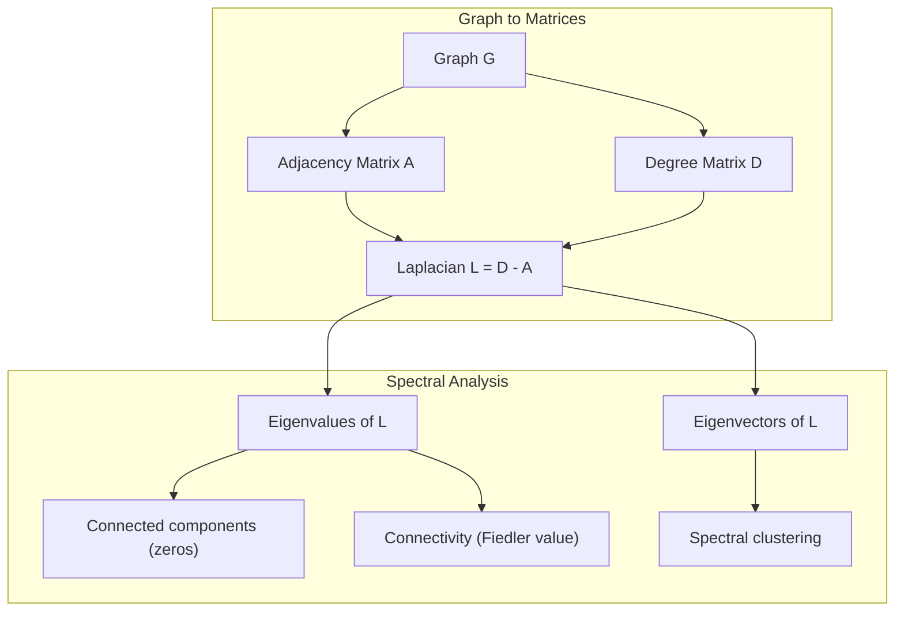
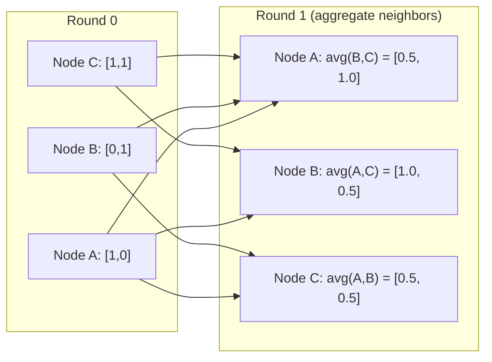

# Teoria grafów dla uczenia maszynowego

> Grafy to struktura danych relacji. Jeśli twoje dane mają połączenia, potrzebujesz teorii grafów.

**Typ:** Buduj
**Język:** Python
**Wymagania wstępne:** Phase 1, Lessons 01-03 (algebra liniowa, macierze)
**Czas:** ~90 minut

## Cele uczenia się

- Zbuduj klasę grafu z reprezentacjami macierzy sąsiedztwa/listy i zaimplementuj przechodzenie BFS i DFS
- Oblicz laplasjan grafu i użyj jego wartości własnych do wykrywania spójnych składowych i grupowania węzłów
- Zaimplementuj jedną rundę przekazywania wiadomości w stylu GNN jako normalizowane mnożenie macierzy sąsiedztwa
- Zastosuj grupowanie spektralne do podziału grafu przy użyciu wektora Fiedlera

## Problem

Sieci społecznościowe, cząsteczki, bazy wiedzy, sieci cytowań, mapy drogowe -- wszystkie to grafy. Tradycyjne uczenie maszynowe traktuje dane jako płaskie tabele. Każdy wiersz jest niezależny. Każda cecha to kolumna. Ale gdy struktura połączeń ma znaczenie, tabele zawodzą.

Rozważ sieć społecznościową. Chcesz przewidzieć, jaki produkt użytkownik kupi. Jego historia zakupów ma znaczenie. Ale historia zakupów jego znajomych ma większe znaczenie. Połączenia niosą sygnał.

Albo rozważ cząsteczkę. Chcesz przewidzieć, czy wiąże się z białkiem. Atomy mają znaczenie, ale to, co naprawdę ma znaczenie, to sposób, w jaki atomy są ze sobą połączone. Struktura to dane.

Grafowe sieci neuronowe (GNN) to najszybciej rozwijający się obszar głębokiego uczenia. Zasilają odkrywanie leków, rekomendacje społecznościowe, wykrywanie oszustw i wnioskowanie na grafach wiedzy. Każda GNN opiera się na tej samej podstawie: podstawowej teorii grafów.

Potrzebujesz czterech rzeczy:
1. Sposobu reprezentacji grafów jako macierzy, żeby można było je mnożyć
2. Algorytmów przechodzenia do eksploracji struktury grafu
3. Laplasjan, najważniejsza macierz w spektralnej teorii grafów
4. Przekazywanie wiadomości, operacja, która sprawia, że GNN działają

## Koncepcja

### Grafy: Węzły i krawędzie

Graf G = (V, E) składa się z wierzchołków (węzłów) V i krawędzi E. Każda krawędź łączy dwa węzły.

**Skierowane vs nieskierowane.** W grafie nieskierowanym krawędź (u, v) oznacza, że u łączy się z v ORAZ v łączy się z u. W grafie skierowanym (digrafie) krawędź (u, v) oznacza, że u wskazuje na v, ale niekoniecznie odwrotnie.

**Z wagami vs bez wag.** W grafie bez wag krawędzie albo istnieją, albo nie. W grafie z wagami każda krawędź ma wagę liczbową: odległość, koszt, siłę.

| Typ grafu | Przykład |
|-----------|---------|
| Nieskierowany, bez wag | Sieć znajomości na Facebooku |
| Skierowany, bez wag | Sieć obserwacji na Twitterze |
| Nieskierowany, z wagami | Mapa drogowa (odległości) |
| Skierowany, z wagami | Linki między stronami (wyniki PageRank) |

### Macierz sąsiedztwa

Macierz sąsiedztwa A to podstawowa reprezentacja. Dla grafu z n węzłami:

```
A[i][j] = 1    jeśli istnieje krawędź od węzła i do węzła j
A[i][j] = 0    w przeciwnym razie
```

Dla grafów nieskierowanych A jest symetryczna: A[i][j] = A[j][i]. Dla grafów z wagami A[i][j] = waga krawędzi (i, j).

**Przykład -- trójkąt:**

```
Węzły: 0, 1, 2
Krawędzie: (0,1), (1,2), (0,2)

A = [[0, 1, 1],
     [1, 0, 1],
     [1, 1, 0]]
```

Macierz sąsiedztwa to wejście do każdej GNN. Operacje macierzowe na A odpowiadają operacjom na grafie.

### Stopień

Stopień węzła to liczba krawędzi połączonych z nim. Dla grafów skierowanych masz stopień wejściowy (krawędzie wchodzące) i stopień wyjściowy (krawędzie wychodzące).

Macierz stopni D jest diagonalna:

```
D[i][i] = stopień węzła i
D[i][j] = 0    dla i != j
```

Dla przykładu trójkąta: D = diag(2, 2, 2), ponieważ każdy węzeł łączy się z dwoma innymi.

Stopień informuje o ważności węzła. Wysoki stopień oznacza węzeł centralny. Rozkład stopni w sieci ujawnia jej strukturę. Sieci społecznościowe podlegają prawu potęgowemu (niewiele węzłów centralnych, wiele liści). Losowe grafy mają rozkład Poissona stopni.

### BFS i DFS

Dwa podstawowe algorytmy przechodzenia grafu. Potrzebujesz obu.

**Przeszukiwanie wszerz (BFS):** Eksploruj wszystkich sąsiadów najpierw, potem sąsiadów sąsiadów. Używa kolejki (FIFO).

```
BFS od węzła 0:
  Odwiedź 0
  Kolejka: [1, 2]        (sąsiedzi 0)
  Odwiedź 1
  Kolejka: [2, 3]        (dodaj sąsiadów 1)
  Odwiedź 2
  Kolejka: [3]           (sąsiedzi 2 już odwiedzeni)
  Odwiedź 3
  Kolejka: []            (koniec)
```

BFS znajduje najkrótsze ścieżki w grafach nieważonych. Odległość od startu do dowolnego węzła równa się poziomowi BFS, na którym ten węzeł jest odkrywany po raz pierwszy. Dlatego BFS jest używany do odległości liczonych w skokach w sieciach społecznościowych.

**Przeszukiwanie w głąb (DFS):** Idź tak głęboko, jak to możliwe przed cofnięciem się. Używa stosu (LIFO) lub rekursji.

```
DFS od węzła 0:
  Odwiedź 0
  Stos: [1, 2]        (sąsiedzi 0)
  Odwiedź 2               (zdejmij ze stosu)
  Stos: [1, 3]         (dodaj sąsiadów 2)
  Odwiedź 3               (zdejmij ze stosu)
  Stos: [1]
  Odwiedź 1               (zdejmij ze stosu)
  Stos: []             (koniec)
```

DFS jest przydatny do:
- Znajdowania spójnych składowych (uruchom DFS z nieodwiedzonych węzłów)
- Wykrywania cykli (krawędzie cofania w drzewie DFS)
- Sortowania topologicznego (odwrócony porządek zakończenia DFS)

| Algorytm | Struktura danych | Znajduje | Przypadek użycia |
|-----------|---------------|-------|----------|
| BFS | Kolejka | Najkrótsze ścieżki | Odległość w sieci społecznościowej, przechodzenie grafu wiedzy |
| DFS | Stos | Składowe, cykle | Spójność, sortowanie topologiczne |

### Laplasjan grafu

L = D - A. Najważniejsza macierz w spektralnej teorii grafów.

```
D = [[2, 0, 0],    A = [[0, 1, 1],    L = [[2, -1, -1],
     [0, 2, 0],         [1, 0, 1],         [-1, 2, -1],
     [0, 0, 2]]         [1, 1, 0]]         [-1, -1,  2]]
```

Laplasjan ma niezwykłe właściwości:

1. **L jest półokreślony dodatnio.** Wszystkie wartości własne są >= 0.

2. **Liczba zerowych wartości własnych równa się liczbie spójnych składowych.** Graf spójny ma dokładnie jedną zerową wartość własną. Graf z 3 niespójnymi składowymi ma trzy zerowe wartości własne.

3. **Najmniejsza niezerowa wartość własna (wartość Fiedlera) mierzy spójność.** Duża wartość Fiedlera oznacza, że graf jest dobrze połączony. Mała wartość Fiedlera oznacza, że graf ma słaby punkt, wąskie gardło.

4. **Wektor własny wartości Fiedlera (wektor Fiedlera) ujawnia najlepszy podział.** Węzły z dodatnimi wartościami idą do jednej grupy, węzły z ujemnymi wartościami do drugiej. To jest grupowanie spektralne.



### Właściwości spektralne

Wartości własne macierzy sąsiedztwa i laplasjanu ujawniają właściwości strukturalne bez żadnego przechodzenia.

**Grupowanie spektralne** działa tak:
1. Oblicz laplasjan L
2. Znajdź k najmniejszych wektorów własnych L (pomiń pierwszy, który jest jedynek dla grafów spójnych)
3. Użyj tych wektorów własnych jako nowych współrzędnych dla każdego węzła
4. Uruchom k-means na tych współrzędnych

Dlaczego to działa? Wektory własne L kodują "najgładsze" funkcje na grafie. Węzły, które są dobrze połączone, otrzymują podobne wartości wektorów własnych. Węzły oddzielone wąskim gardłem otrzymują różne wartości. Wektory własne naturalnie separują klastry.

**Związek z błądzeniem losowym.** Znormalizowany laplasjan wiąże się z błądzeniem losowym na grafie. Stacjonarny rozkład błądzenia losowego jest proporcjonalny do stopnia węzła. Czas mieszania, czyli jak szybko błądzenie zbiega, zależy od przerwy spektralnej.

### Przekazywanie wiadomości

Podstawowa operacja Grafowych Sieci Neuronowych. Każdy węzeł zbiera wiadomości od swoich sąsiadów, agreguje je i aktualizuje swój własny stan.

```
h_v^(k+1) = UPDATE(h_v^(k), AGGREGATE({h_u^(k) : u in neighbors(v)}))
```

W najprostszej formie AGGREGATE = średnia, a UPDATE = transformacja liniowa + aktywacja:

```
h_v^(k+1) = sigma(W * mean({h_u^(k) : u in neighbors(v)}))
```

To jest zamaskowane mnożenie macierzy. Jeśli H to macierz wszystkich cech węzłów, a A to macierz sąsiedztwa:

```
H^(k+1) = sigma(A_norm * H^(k) * W)
```

gdzie A_norm to znormalizowana macierz sąsiedztwa (każdy wiersz sumuje się do 1).

Jedna runda przekazywania wiadomości pozwala każdemu węzłowi "zobaczyć" swoich bezpośrednich sąsiadów. Dwie rundy pozwalają zobaczyć sąsiadów sąsiadów. K rund daje każdemu węzłowi informacje z jego K-sąsiedztwa.



### Koncepcje i zastosowania ML

| Koncepcja | Zastosowanie ML |
|---------|---------------|
| Macierz sąsiedztwa | Reprezentacja wejściowa GNN |
| Laplasjan grafu | Grupowanie spektralne, wykrywanie społeczności |
| BFS/DFS | Przechodzenie grafu wiedzy, znajdowanie ścieżek |
| Rozkład stopni | Ważność węzła, inżynieria cech |
| Przekazywanie wiadomości | Warstwy GNN (GCN, GAT, GraphSAGE) |
| Wartości własne L | Wykrywanie społeczności, podział grafów |
| Grupowanie spektralne | Grupowanie węzłów bez nadzoru |
| PageRank | Ważność węzła, wyszukiwanie w internecie |

## Zbuduj to

### Krok 1: Klasa grafu od podstaw

```python
class Graph:
    def __init__(self, n_nodes, directed=False):
        self.n = n_nodes
        self.directed = directed
        self.adj = {i: {} for i in range(n_nodes)}

    def add_edge(self, u, v, weight=1.0):
        self.adj[u][v] = weight
        if not self.directed:
            self.adj[v][u] = weight

    def neighbors(self, node):
        return list(self.adj[node].keys())

    def degree(self, node):
        return len(self.adj[node])

    def adjacency_matrix(self):
        import numpy as np
        A = np.zeros((self.n, self.n))
        for u in range(self.n):
            for v, w in self.adj[u].items():
                A[u][v] = w
        return A

    def degree_matrix(self):
        import numpy as np
        D = np.zeros((self.n, self.n))
        for i in range(self.n):
            D[i][i] = self.degree(i)
        return D

    def laplacian(self):
        return self.degree_matrix() - self.adjacency_matrix()
```

Lista sąsiedztwa (`self.adj`) przechowuje sąsiadów wydajnie. Konwersja na macierz sąsiedztwa używa numpy, ponieważ wszystkie operacje spektralne tego wymagają.

### Krok 2: BFS i DFS

```python
from collections import deque

def bfs(graph, start):
    visited = set()
    order = []
    distances = {}
    queue = deque([(start, 0)])
    visited.add(start)
    while queue:
        node, dist = queue.popleft()
        order.append(node)
        distances[node] = dist
        for neighbor in graph.neighbors(node):
            if neighbor not in visited:
                visited.add(neighbor)
                queue.append((neighbor, dist + 1))
    return order, distances


def dfs(graph, start):
    visited = set()
    order = []
    stack = [start]
    while stack:
        node = stack.pop()
        if node in visited:
            continue
        visited.add(node)
        order.append(node)
        for neighbor in reversed(graph.neighbors(node)):
            if neighbor not in visited:
                stack.append(neighbor)
    return order
```

BFS używa deque (kolejki dwustronnej) dla O(1) popleft. DFS używa listy jako stosu. Oba odwiedzają każdy węzeł dokładnie raz, czas O(V + E).

### Krok 3: Spójne składowe i wartości własne laplasjanu

```python
def connected_components(graph):
    visited = set()
    components = []
    for node in range(graph.n):
        if node not in visited:
            order, _ = bfs(graph, node)
            visited.update(order)
            components.append(order)
    return components


def laplacian_eigenvalues(graph):
    import numpy as np
    L = graph.laplacian()
    eigenvalues = np.linalg.eigvalsh(L)
    return eigenvalues
```

`eigvalsh` jest dla macierzy symetrycznych, laplasjan jest zawsze symetryczny dla grafów nieskierowanych. Zwraca wartości własne w porządku rosnącym. Policz zera, żeby znaleźć liczbę spójnych składowych.

### Krok 4: Grupowanie spektralne

```python
def spectral_clustering(graph, k=2):
    import numpy as np
    L = graph.laplacian()
    eigenvalues, eigenvectors = np.linalg.eigh(L)
    features = eigenvectors[:, 1:k+1]

    labels = np.zeros(graph.n, dtype=int)
    for i in range(graph.n):
        if features[i, 0] >= 0:
            labels[i] = 0
        else:
            labels[i] = 1
    return labels
```

Dla k=2 znak wektora Fiedlera dzieli graf na dwa klastry. Dla k>2 uruchomiłbyś k-means na pierwszych k wektorach własnych, z wyjątkiem trywialnego wektora jedynek.

### Krok 5: Przekazywanie wiadomości

```python
def message_passing(graph, features, weight_matrix):
    import numpy as np
    A = graph.adjacency_matrix()
    row_sums = A.sum(axis=1, keepdims=True)
    row_sums[row_sums == 0] = 1
    A_norm = A / row_sums
    aggregated = A_norm @ features
    output = aggregated @ weight_matrix
    return output
```

To jest jedna runda przekazywania wiadomości GNN. Nowe cechy każdego węzła to średnia ważona cech jego sąsiadów, przekształcona przez macierz wag. Ułóż wiele rund, żeby propagać informację dalej.

## Użyj tego

Z networkx i numpy te same operacje to jednolinijkowce:

```python
import networkx as nx
import numpy as np

G = nx.karate_club_graph()

A = nx.adjacency_matrix(G).toarray()
L = nx.laplacian_matrix(G).toarray()

eigenvalues = np.linalg.eigvalsh(L.astype(float))
print(f"Smallest eigenvalues: {eigenvalues[:5]}")
print(f"Connected components: {nx.number_connected_components(G)}")

communities = nx.community.greedy_modularity_communities(G)
print(f"Communities found: {len(communities)}")

pr = nx.pagerank(G)
top_nodes = sorted(pr.items(), key=lambda x: x[1], reverse=True)[:5]
print(f"Top 5 PageRank nodes: {top_nodes}")
```

networkx obsługuje grafy dowolnej wielkości dzięki zoptymalizowanym backendom C. Używaj tego w produkcji. Używaj swojej implementacji od podstaw, żeby zrozumieć, co robi.

### Analiza spektralna numpy

```python
import numpy as np

A = np.array([
    [0, 1, 1, 0, 0],
    [1, 0, 1, 0, 0],
    [1, 1, 0, 1, 0],
    [0, 0, 1, 0, 1],
    [0, 0, 0, 1, 0]
])

D = np.diag(A.sum(axis=1))
L = D - A

eigenvalues, eigenvectors = np.linalg.eigh(L)
print(f"Eigenvalues: {np.round(eigenvalues, 4)}")
print(f"Fiedler value: {eigenvalues[1]:.4f}")
print(f"Fiedler vector: {np.round(eigenvectors[:, 1], 4)}")

fiedler = eigenvectors[:, 1]
group_a = np.where(fiedler >= 0)[0]
group_b = np.where(fiedler < 0)[0]
print(f"Cluster A: {group_a}")
print(f"Cluster B: {group_b}")
```

Wektor Fiedlera wykonuje ciężką pracę. Dodatnie wpisy w jednym klastrze, ujemne w drugim. Nie potrzeba optymalizacji iteracyjnej, tylko jedna dekompozycja własna.

## Wdróż to

Ta lekcja tworzy:
- `outputs/skill-graph-analysis.md` -- referencyjny przewodnik umiejętności do analizy danych o strukturze grafowej

## Połączenia

| Koncepcja | Gdzie się pojawia |
|---------|------------------|
| Macierz sąsiedztwa | Wejście GCN, GAT, GraphSAGE |
| Laplasjan | Grupowanie spektralne, filtry ChebNet |
| BFS | Przechodzenie grafu wiedzy, zapytania o najkrótsze ścieżki |
| Przekazywanie wiadomości | Każda warstwa GNN, neuronowe przekazywanie wiadomości |
| Przerwa spektralna | Spójność grafu, czas mieszania błądzenia losowego |
| Rozkład stopni | Sieci z prawem potęgowym, inżynieria cech węzłów |
| Spójne składowe | Przetwarzanie wstępne, obsługa grafów niespójnych |
| PageRank | Ranking ważności węzłów, inicjalizacja atencji |

GNN zasługują na szczególną wzmiankę. Operacja splotu grafowego w GCN (Kipf & Welling, 2017) używa macierzy sąsiedztwa z dodanymi pętlami własnymi, A_hat = A + I:

```text
H^(l+1) = sigma(D_hat^(-1/2) * A_hat * D_hat^(-1/2) * H^(l) * W^(l))
```

gdzie A_hat = A + I (sąsiedztwo plus pętle własne), a D_hat to macierz stopni A_hat. Pętle własne zapewniają, że każdy węzeł uwzględnia swoje własne cechy podczas agregacji. To jest dokładnie przekazywanie wiadomości z normalizacją symetryczną. D_hat^(-1/2) * A_hat * D_hat^(-1/2) to znormalizowana macierz sąsiedztwa. Laplasjan pojawia się, bo ta normalizacja wiąże się z L_sym = I - D^(-1/2) * A * D^(-1/2). Zrozumienie laplasjanu oznacza zrozumienie, dlaczego GCN działają.

## Ćwiczenia

1. **Zaimplementuj PageRank od podstaw.** Zacznij od równych wyników. W każdym kroku: score(v) = (1-d)/n + d * sum(score(u)/out_degree(u)) dla wszystkich u wskazujących na v. Użyj d=0.85. Uruchom do zbieżności (zmiana < 1e-6). Testuj na małym grafie sieciowym.

2. **Znajdź społeczności używając grupowania spektralnego.** Stwórz graf z dwoma wyraźnie oddzielonymi klastrami, np. dwie kliki połączone jedną krawędzią. Uruchom grupowanie spektralne i sprawdź, czy znajduje właściwy podział. Co się dzieje, gdy dodajesz więcej krawędzi między klastrami?

3. **Zaimplementuj algorytm Dijkstry** do najkrótszych ścieżek w grafach ważonych. Porównaj wyniki z BFS na tym samym grafie z równymi wagami.

4. **Zbuduj dwuwarstwową sieć przekazywania wiadomości.** Zastosuj przekazywanie wiadomości dwukrotnie z różnymi macierzami wag. Pokaż, że po 2 rundach każdy węzeł ma informacje ze swojego 2-sąsiedztwa.

5. **Przeanalizuj rzeczywisty graf.** Użyj grafu Karate Club (34 węzły, 78 krawędzi). Oblicz rozkład stopni, wartości własne laplasjanu i grupowanie spektralne. Porównaj wynik grupowania spektralnego ze znaną prawdą podstawową.

## Kluczowe pojęcia

| Termin | Co ludzie mówią | Co to faktycznie oznacza |
|------|----------------|----------------------|
| Graf | "Węzły i krawędzie" | Struktura matematyczna G=(V,E) kodująca relacje parami |
| Macierz sąsiedztwa | "Tabela połączeń" | Macierz n x n, gdzie A[i][j] = 1, jeśli węzły i i j są połączone |
| Stopień | "Jak połączony jest węzeł" | Liczba krawędzi dotykających węzła |
| Laplasjan | "D minus A" | L = D - A, macierz, której wartości własne ujawniają strukturę grafu |
| Wartość Fiedlera | "Łączność algebraiczna" | Najmniejsza niezerowa wartość własna L, mierząca, jak dobrze połączony jest graf |
| BFS | "Przeszukiwanie poziomami" | Przechodzenie, które odwiedza wszystkich sąsiadów przed zagłębieniem się, znajduje najkrótsze ścieżki |
| DFS | "Najpierw w głąb" | Przechodzenie, które podąża jedną ścieżką do końca przed cofnięciem się |
| Przekazywanie wiadomości | "Węzły rozmawiają z sąsiadami" | Każdy węzeł agreguje informacje od swoich sąsiadów, rdzeń GNN |
| Grupowanie spektralne | "Grupowanie przez wektory własne" | Podziel graf używając wektorów własnych jego laplasjanu |
| Spójna składowa | "Osobny kawałek" | Maksymalny podgraf, gdzie każdy węzeł może dotrzeć do każdego innego węzła |

## Dalsza lektura

- **Kipf & Welling (2017)** -- "Semi-Supervised Classification with Graph Convolutional Networks." Artykuł, który zapoczątkował nowoczesne GNN. Pokazuje, że sploty spektralne upraszczają się do przekazywania wiadomości.
- **Spielman (2012)** -- "Spectral Graph Theory" notatki z wykładów. Definitywne wprowadzenie do laplasjanów, przerw spektralnych i podziału grafów.
- **Hamilton (2020)** -- "Graph Representation Learning." Książka obejmująca GNN od podstaw do zastosowań.
- **Bronstein et al. (2021)** -- "Geometric Deep Learning: Grids, Groups, Graphs, Geodesics, and Gauges." Artykuł o ujednolicającym frameworku.
- **Veličković et al. (2018)** -- "Graph Attention Networks." Rozszerza przekazywanie wiadomości o mechanizmy atencji.