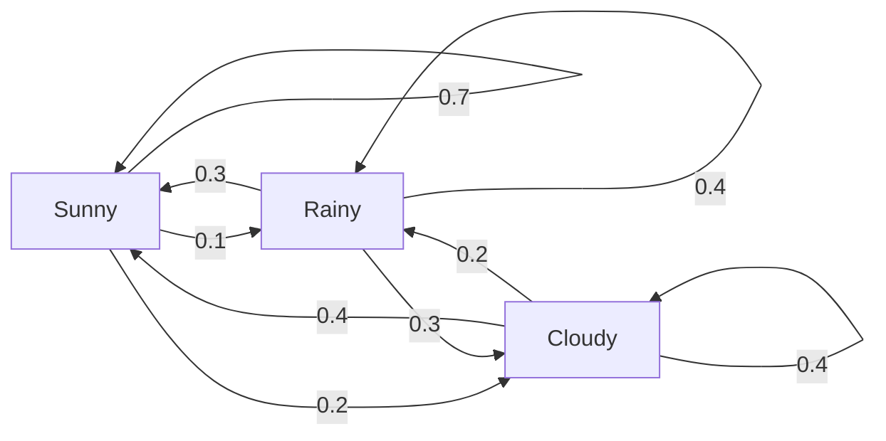
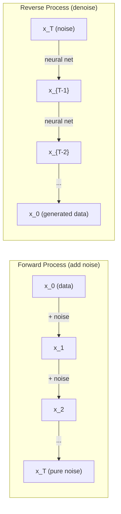

# Procesy Stochastyczne

> Losowość z strukturą. Matematyka stojąca za losowymi błądzeniami, łańcuchami Markowa i modelami dyfuzji.

**Typ:** Nauka
**Język:** Python
**Wymagania wstępne:** Phase 1, Ukończenie lekcji 06-07 (prawdopodobieństwo, twierdzenie Bayesa)
**Czas:** ~75 minut

## Cele uczenia się

- Symuluj jednowymiarowe i dwuwymiarowe losowe błądzenia i sprawdź skalowanie sqrt(n) dla przemieszczenia
- Zbuduj symulator łańcucha Markowa i oblicz jego rozkład stacjonarny poprzez dekompozycję własną
- Zaimplementuj Metropolis-Hastings MCMC i dynamikę Langevina do próbkowania z docelowych rozkładów
- Połącz proces dyfuzji w przód z ruchem Browna i wyjaśnij, jak proces odwrotny generuje dane

## Problem

Wiele systemów AI obejmuje losowość, która ewoluuje w czasie. Nie statyczną losowość, lecz ustrukturyzowaną, sekwencyjną losowość, gdzie każdy krok zależy od tego, co było przed nim.

Modele językowe generują tokeny jeden po drugim. Każdy token zależy od poprzedniego kontekstu. Model wyprowadza rozkład prawdopodobieństwa, próbkuje z niego i przechodzi dalej. To jest proces stochastyczny.

Modele dyfuzji dodają szum do obrazu krok po kroku, aż stanie się on czystą statyką. Następnie odwracają proces, odszumowując krok po kroku, aż pojawi się nowy obraz. Proces w przód jest łańcuchem Markowa. Proces odwrotny jest nauczonym łańcuchem Markowa uruchomionym wstecz.

Agenci uczenia ze wzmocnieniem podejmują działania w środowisku. Każde działanie prowadzi do nowego stanu z pewnym prawdopodobieństwem. Agent podąża za losową polityką w losowym świecie. Całość jest procesem decyzyjnym Markowa.

Próbkowanie MCMC - podstawa wnioskowania bayesowskiego - konstruuje łańcuch Markowa, którego rozkład stacjonarny jest posteriorem, z którego chcesz próbkować.

Wszystkie te techniki opierają się na czterech podstawowych koncepcjach:

1. Losowe błądzenia - najprostszy proces stochastyczny
2. Łańcuchy Markowa - ustrukturyzowana losowość z macierzą przejścia
3. Dynamika Langevina - spadek gradientowy z szumem
4. Metropolis-Hastings - próbkowanie z dowolnego rozkładu

## Koncepcja

### Losowe błądzenia

Zacznij od pozycji 0. Przy każdym kroku rzuć uczciwą monetą. Reszka: idź w prawo (+1). Orzeł: idź w lewo (-1).

Po n krokach twoja pozycja jest sumą n losowych wartości +/-1. Oczekiwana pozycja to 0 (błądzenie jest bezstronne). Ale oczekiwana odległość od początku rośnie jak sqrt(n).

To jest sprzeczne z intuicją. Błądzenie jest uczciwe - brak dryfu w żadnym kierunku. Ale z czasem błądzi coraz dalej od miejsca, w którym się zaczęło. Odchylenie standardowe po n krokach to sqrt(n).

```
Step 0:  Position = 0
Step 1:  Position = +1 or -1
Step 2:  Position = +2, 0, or -2
...
Step 100: Expected distance from origin ~ 10 (sqrt(100))
Step 10000: Expected distance from origin ~ 100 (sqrt(10000))
```

**W 2D** błądzenie porusza się w górę, w dół, w lewo lub w prawo z równym prawdopodobieństwem. To samo skalowanie sqrt(n) dotyczy odległości od początku. Ścieżka rysuje fraktalny wzór.

**Dlaczego sqrt(n)?** Każdy krok to +1 lub -1 z równym prawdopodobieństwem. Po n krokach pozycja S_n = X_1 + X_2 + ... + X_n, gdzie każde X_i to +/-1. Wariancja każdego kroku to 1, a kroki są niezależne, więc Var(S_n) = n. Odchylenie standardowe = sqrt(n). Na mocy centralnego twierdzenia granicznego S_n / sqrt(n) zbiega do standardowego rozkładu normalnego.

To skalowanie sqrt(n) pojawia się wszędzie w ML. Szum SGD skaluje się jak 1/sqrt(batch_size). Wymiary embeddingów skalują się jak sqrt(d). Pierwiastek kwadratowy jest sygnaturą niezależnych losowych dodatków.

**Połączenie z ruchem Browna.** Weź losowe błądzenie z rozmiarem kroku 1/sqrt(n) i n krokami na jednostkę czasu. Gdy n dąży do nieskończoności, błądzenie zbiega do ruchu Browna B(t) - procesu w czasie ciągłym, gdzie B(t) ma rozkład normalny ze średnią 0 i wariancją t.

Ruch Browna jest matematycznym fundamentem dyfuzji. Modeluje losowe podrygiwanie cząstek w płynie, fluktuacje cen akcji i - co kluczowe - proces szumu w modelach dyfuzji.

**Ruinujący się hazardzista.** Losowy przechodzień startujący z pozycji k, z barierami absorbującymi w 0 i N. Jakie jest prawdopodobieństwo dotarcia do N przed 0? Dla uczciwego błądzenia: P(dotarcie N) = k/N. To zaskakująco proste i eleganckie. Łączy się z teorią martyngałów - uczciwe losowe błądzenie jest martyngałem (oczekiwana przyszła wartość = obecna wartość).

### Łańcuchy Markowa

Łańcuch Markowa to system, który przechodzi między stanami zgodnie z ustalonymi prawdopodobieństwami. Kluczowa właściwość: następny stan zależy tylko od obecnego stanu, nie od historii.

```
P(X_{t+1} = j | X_t = i, X_{t-1} = ...) = P(X_{t+1} = j | X_t = i)
```

To jest właściwość Markowa. Oznacza to, że możesz opisać całą dynamikę za pomocą macierzy przejścia P:

```
P[i][j] = probability of going from state i to state j
```

Każdy wiersz P sumuje się do 1 (musisz gdzieś przejść).

**Przykład - Pogoda:**

```
States: Sunny (0), Rainy (1), Cloudy (2)

P = [[0.7, 0.1, 0.2],    (if sunny: 70% sunny, 10% rainy, 20% cloudy)
     [0.3, 0.4, 0.3],    (if rainy: 30% sunny, 40% rainy, 30% cloudy)
     [0.4, 0.2, 0.4]]    (if cloudy: 40% sunny, 20% rainy, 40% cloudy)
```

Zacznij w dowolnym stanie. Po wielu przejściach rozkład stanów zbiega do rozkładu stacjonarnego pi, gdzie pi * P = pi. To jest lewy wektor własny P z wartością własną 1.

Dla łańcucha pogodowego rozkład stacjonarny może być [0.53, 0.18, 0.29] - w długim okresie jest słonecznie przez 53% czasu niezależnie od stanu początkowego.



**Obliczanie rozkładu stacjonarnego.** Są dwa podejścia:

1. **Metoda potęgowa**: pomnóż dowolny początkowy rozkład przez P wielokrotnie. Po wystarczającej liczbie iteracji zbiega.
2. **Metoda wartości własnych**: znajdź lewy wektor własny P z wartością własną 1. To jest wektor własny P^T z wartością własną 1.

Oba podejścia wymagają, aby łańcuch spełniał warunki zbieżności.

**Warunki zbieżności.** Łańcuch Markowa zbiega do jedynego rozkładu stacjonarnego, jeśli jest:

- **Nieprzywodzony**: każdy stan jest osiągalny z każdego innego stanu
- **Nieokresowy**: łańcuch nie cykluje z ustalonym okresem

Większość łańcuchów spotykanych w ML spełnia oba warunki.

**Stany absorbujące.** Stan jest absorbujący, jeśli gdy raz do niego wejdziesz, nigdy go nie opuszczasz (P[i][i] = 1). Absorbujące łańcuchy Markowa modelują procesy ze stanami terminalnymi - grę, która się kończy, klienta, który odchodzi, sekwencję tokenów, która trafia na token end-of-text.

**Czas mieszania.** Ile kroków, aż łańcuch będzie "blisko" rozkładu stacjonarnego? Formalnie, liczba kroków, aż odległość w całkowitej wariacji od stacjonarności spadnie poniżej pewnego progu. Szybkie mieszanie = potrzeba niewiele kroków. Przerwa spektralna P (1 minus druga co do wielkości wartość własna) kontroluje czas mieszania. Większa przerwa = szybsze mieszanie.

### Połączenie z modelami językowymi

Generowanie tokenów w modelu językowym jest w przybliżeniu procesem Markowa. Mając obecny kontekst, model wyprowadza rozkład nad następnym tokenem. Temperatura kontroluje ostrość:

```
P(token_i) = exp(logit_i / temperature) / sum(exp(logit_j / temperature))
```

- Temperatura = 1.0: standardowy rozkład
- Temperatura < 1.0: ostrzejszy (bardziej deterministyczny)
- Temperatura > 1.0: bardziej płaski (bardziej losowy)
- Temperatura -> 0: argmax (chciwy)

Próbkowanie top-k obcina do k tokenów o najwyższym prawdopodobieństwie. Próbkowanie top-p (nucleus) obcina do najmniejszego zestawu tokenów, których skumulowane prawdopodobieństwo przekracza p. Oba modyfikują prawdopodobieństwa przejścia Markowa.

### Ruch Browna

Granica w czasie ciągłym losowego błądzenia. Pozycja B(t) ma trzy właściwości:

1. B(0) = 0
2. B(t) - B(s) ma rozkład normalny ze średnią 0 i wariancją t - s (dla t > s)
3. Przyrosty na nie nakładających się przedziałach są niezależne

Ruch Browna jest ciągły, ale nigdzie nie różniczkowalny - podryguje na każdej skali. Ścieżka ma wymiar fraktalny 2 na płaszczyźnie.

W dyskretnej symulacji przybliżasz ruch Browna przez:

```
B(t + dt) = B(t) + sqrt(dt) * z,    where z ~ N(0, 1)
```

To skalowanie sqrt(dt) jest ważne. Pochodzi z centralnego twierdzenia granicznego zastosowanego do losowych błądzeń.

### Dynamika Langevina

Spadek gradientowy znajduje minimum funkcji. Dynamika Langevina znajduje rozkład prawdopodobieństwa proporcjonalny do exp(-U(x)/T), gdzie U jest funkcją energii, a T jest temperaturą.

```
x_{t+1} = x_t - dt * gradient(U(x_t)) + sqrt(2 * T * dt) * z_t
```

Dwie siły działają na cząstkę:

1. **Siła gradientu** (-dt * gradient(U)): popycha w kierunku niskiej energii (jak spadek gradientowy)
2. **Siła losowa** (sqrt(2*T*dt) * z): popycha w losowych kierunkach (eksploracja)

Przy temperaturze T = 0 to czysty spadek gradientowy. Przy wysokiej temperaturze to prawie losowe błądzenie. Przy odpowiedniej temperaturze cząstka eksploruje krajobraz energii i spędza więcej czasu w regionach niskiej energii.

**Połączenie z modelami dyfuzji.** Proces w przód modelu dyfuzji to:

```
x_t = sqrt(alpha_t) * x_{t-1} + sqrt(1 - alpha_t) * noise
```

To jest łańcuch Markowa, który stopniowo miesza dane z szumem. Po wystarczającej liczbie kroków x_T to czysty szum Gaussian.

Proces odwrotny - od szumu z powrotem do danych - też jest łańcuchem Markowa, ale jego prawdopodobieństwa przejścia są nauczone przez sieć neuronową. Sieć uczy się przewidywać szum dodany na każdym kroku, a następnie go odejmuje.



### MCMC: Markov Chain Monte Carlo

Czasami musisz próbkować z rozkładu p(x), który możesz ocenić (do stałej), ale nie możesz próbkować bezpośrednio. Bayesowskie posteriora są klasycznym przykładem - znasz wiarygodność razy wcześniejsze, ale stała normalizująca jest nierozwiązywalna.

**Metropolis-Hastings** konstruuje łańcuch Markowa, którego rozkład stacjonarny to p(x):

1. Zacznij od jakiejś pozycji x
2. Zaproponuj nową pozycję x' z rozkładu propozycji Q(x'|x)
3. Oblicz współczynnik akceptacji: a = p(x') * Q(x|x') / (p(x) * Q(x'|x))
4. Zaakceptuj x' z prawdopodobieństwem min(1, a). W przeciwnym razie zostań przy x.
5. Powtórz.

Jeśli Q jest symetryczny (np. Q(x'|x) = Q(x|x') = N(x, sigma^2)), współczynnik upraszcza się do a = p(x') / p(x). Potrzebujesz tylko stosunku prawdopodobieństw - stała normalizująca się skraca.

Łańcuch jest gwarantowany do zbieżności do p(x) przy łagodnych warunkach. Ale zbieżność może być wolna, jeśli propozycja jest za mała (losowe błądzenie) lub za duża (wysokie odrzucenie). Dostrajanie propozycji to sztuka MCMC.

**Dlaczego to działa.** Współczynnik akceptacji zapewnia szczegółową równowagę: prawdopodobieństwo bycia w x i przejścia do x' równa się prawdopodobieństwu bycia w x' i przejścia do x. Szczegółowa równowaga implikuje, że p(x) jest rozkładem stacjonarnym łańcucha. Więc po wystarczającej liczbie kroków próbki pochodzą z p(x).

**Praktyczne rozważania:**

- **Burn-in**: odrzuć pierwsze N próbek. Łańcuch potrzebuje czasu, aby dotrzeć do rozkładu stacjonarnego od punktu startowego.
- **Thinning**: zachowuj co k-tą próbkę, aby zmniejszyć autokorelację.
- **Wiele łańcuchów**: uruchom kilka łańcuchów z różnych punktów startowych. Jeśli zbiegają do tego samego rozkładu, masz dowód zbieżności.
- **Wskaźnik akceptacji**: dla Gaussian propozycji w d wymiarach optymalny wskaźnik akceptacji to około 23% (Roberts & Rosenthal, 2001). Za wysoki oznacza, że łańcuch prawie się nie porusza. Za niski oznacza, że odrzuca wszystko.

### Procesy stochastyczne w AI

| Proces | Zastosowanie AI |
|--------|-----------------|
| Losowe błądzenie | Eksploracja w RL, embeddingy Node2Vec |
| Łańcuch Markowa | Generowanie tekstu, próbkowanie MCMC |
| Ruch Browna | Modele dyfuzji (proces w przód) |
| Dynamika Langevina | Modele generatywne oparte na wyniku, SGLD |
| Proces decyzyjny Markowa | Uczenie ze wzmocnieniem |
| Metropolis-Hastings | Wnioskowanie bayesowskie, próbkowanie posteriora |

## Zbuduj to

### Krok 1: Symulator losowego błądzenia

```python
import numpy as np

def random_walk_1d(n_steps, seed=None):
    rng = np.random.RandomState(seed)
    steps = rng.choice([-1, 1], size=n_steps)
    positions = np.concatenate([[0], np.cumsum(steps)])
    return positions


def random_walk_2d(n_steps, seed=None):
    rng = np.random.RandomState(seed)
    directions = rng.choice(4, size=n_steps)
    dx = np.zeros(n_steps)
    dy = np.zeros(n_steps)
    dx[directions == 0] = 1   # right
    dx[directions == 1] = -1  # left
    dy[directions == 2] = 1   # up
    dy[directions == 3] = -1  # down
    x = np.concatenate([[0], np.cumsum(dx)])
    y = np.concatenate([[0], np.cumsum(dy)])
    return x, y
```

Jednowymiarowe błądzenie przechowuje sumy skumulowane. Każdy krok to +1 lub -1. Po n krokach pozycja to suma. Wariancja rośnie liniowo z n, więc odchylenie standardowe rośnie jak sqrt(n).

### Krok 2: Łańcuch Markowa

```python
class MarkovChain:
    def __init__(self, transition_matrix, state_names=None):
        self.P = np.array(transition_matrix, dtype=float)
        self.n_states = len(self.P)
        self.state_names = state_names or [str(i) for i in range(self.n_states)]

    def step(self, current_state, rng=None):
        if rng is None:
            rng = np.random.RandomState()
        probs = self.P[current_state]
        return rng.choice(self.n_states, p=probs)

    def simulate(self, start_state, n_steps, seed=None):
        rng = np.random.RandomState(seed)
        states = [start_state]
        current = start_state
        for _ in range(n_steps):
            current = self.step(current, rng)
            states.append(current)
        return states

    def stationary_distribution(self):
        eigenvalues, eigenvectors = np.linalg.eig(self.P.T)
        idx = np.argmin(np.abs(eigenvalues - 1.0))
        stationary = np.real(eigenvectors[:, idx])
        stationary = stationary / stationary.sum()
        return np.abs(stationary)
```

Rozkład stacjonarny to lewy wektor własny P z wartością własną 1. Znajdujemy go, obliczając wektory własne P^T (transpozycja zamienia lewe wektory własne na prawe).

### Krok 3: Dynamika Langevina

```python
def langevin_dynamics(grad_U, x0, dt, temperature, n_steps, seed=None):
    rng = np.random.RandomState(seed)
    x = np.array(x0, dtype=float)
    trajectory = [x.copy()]
    for _ in range(n_steps):
        noise = rng.randn(*x.shape)
        x = x - dt * grad_U(x) + np.sqrt(2 * temperature * dt) * noise
        trajectory.append(x.copy())
    return np.array(trajectory)
```

Gradient popycha x w kierunku niskiej energii. Szum zapobiega utknięciu. W równowadze rozkład próbek jest proporcjonalny do exp(-U(x)/temperature).

### Krok 4: Metropolis-Hastings

```python
def metropolis_hastings(target_log_prob, proposal_std, x0, n_samples, seed=None):
    rng = np.random.RandomState(seed)
    x = np.array(x0, dtype=float)
    samples = [x.copy()]
    accepted = 0
    for _ in range(n_samples - 1):
        x_proposed = x + rng.randn(*x.shape) * proposal_std
        log_ratio = target_log_prob(x_proposed) - target_log_prob(x)
        if np.log(rng.rand()) < log_ratio:
            x = x_proposed
            accepted += 1
        samples.append(x.copy())
    acceptance_rate = accepted / (n_samples - 1)
    return np.array(samples), acceptance_rate
```

Algorytm proponuje nowy punkt, sprawdza, czy ma wyższe prawdopodobieństwo (lub akceptuje z prawdopodobieństwem proporcjonalnym do stosunku), i powtarza. Wskaźnik akceptacji powinien wynosić około 23-50% dla dobrego mieszania.

## Użyj tego

W praktyce używasz sprawdzonych bibliotek dla tych algorytmów. Ale rozumienie mechaniki jest ważne dla debugowania i dostrajania.

```python
import numpy as np

rng = np.random.RandomState(42)
walk = np.cumsum(rng.choice([-1, 1], size=10000))
print(f"Final position: {walk[-1]}")
print(f"Expected distance: {np.sqrt(10000):.1f}")
print(f"Actual distance: {abs(walk[-1])}")
```

### numpy dla macierzy przejścia

```python
import numpy as np

P = np.array([[0.7, 0.1, 0.2],
              [0.3, 0.4, 0.3],
              [0.4, 0.2, 0.4]])

distribution = np.array([1.0, 0.0, 0.0])
for _ in range(100):
    distribution = distribution @ P

print(f"Stationary distribution: {np.round(distribution, 4)}")
```

Pomnóż początkowy rozkład przez P wielokrotnie. Po wystarczającej liczbie iteracji zbiega do rozkładu stacjonarnego niezależnie od punktu startowego. To jest metoda potęgowa znajdowania dominującego lewego wektora własnego.

### Połączenia z prawdziwymi frameworkami

- **PyTorch diffusion:** `DDPMScheduler` w Hugging Face `diffusers` implementuje procesy w przód i wstecz Markowa
- **NumPyro / PyMC:** Używają MCMC (próbkownik NUTS, który poprawia Metropolis-Hastings) do wnioskowania bayesowskiego
- **Gymnasium (RL):** Funkcja step środowiska definiuje proces decyzyjny Markowa

### Weryfikacja zbieżności łańcucha Markowa

```python
import numpy as np

P = np.array([[0.9, 0.1], [0.3, 0.7]])

eigenvalues = np.linalg.eigvals(P)
spectral_gap = 1 - sorted(np.abs(eigenvalues))[-2]
print(f"Eigenvalues: {eigenvalues}")
print(f"Spectral gap: {spectral_gap:.4f}")
print(f"Approximate mixing time: {1/spectral_gap:.1f} steps")
```

Przerwa spektralna mówi, jak szybko łańcuch zapomina swój początkowy stan. Przerwa 0.2 oznacza mniej więcej 5 kroków do wymieszania. Przerwa 0.01 oznacza mniej więcej 100 kroków. Zawsze to sprawdzaj przed uruchomieniem długich symulacji - wolno mieszający się łańcuch marnuje obliczenia.

## Wdróż to

Ta lekcja tworzy:

- `outputs/prompt-stochastic-process-advisor.md` - prompt, który pomaga zidentyfikować, który framework procesów stochastycznych ma zastosowanie do danego problemu

## Powiązania

| Koncepcja | Gdzie się pojawia |
|-----------|-------------------|
| Losowe błądzenie | Embeddingi grafów Node2Vec, eksploracja w RL |
| Łańcuch Markowa | Generowanie tokenów w LLM, próbkowanie MCMC |
| Ruch Browna | Proces dyfuzji w przód w DDPM, modele oparte na SDE |
| Dynamika Langevina | Modele generatywne oparte na wyniku, stochastyczna dynamika gradientowa Langevina (SGLD) |
| Rozkład stacjonarny | Cel zbieżności MCMC, PageRank |
| Metropolis-Hastings | Próbkowanie posteriora bayesowskiego, symulowane wyżarzanie |
| Temperatura | Próbkowanie LLM, eksploracja Boltzmanna w RL, symulowane wyżarzanie |
| Czas mieszania | Szybkość zbieżności MCMC, analiza przerwy spektralnej |
| Stan absorbujący | Token end-of-sequence, stany terminalne w RL |
| Szczegółowa równowaga | Gwarancja poprawności dla próbkowników MCMC |

Modele dyfuzji zasługują na szczególną uwagę. DDPM (Ho et al., 2020) definiuje proces w przód Markowa:

```
q(x_t | x_{t-1}) = N(x_t; sqrt(1-beta_t) * x_{t-1}, beta_t * I)
```

gdzie beta_t to harmonogram szumu. Po T krokach x_T to w przybliżeniu N(0, I). Proces odwrotny jest sparametryzowany przez sieć neuronową, która przewiduje szum:

```
p_theta(x_{t-1} | x_t) = N(x_{t-1}; mu_theta(x_t, t), sigma_t^2 * I)
```

Każdy krok generowania jest krokiem w nauczonym łańcuchu Markowa. Rozumienie łańcuchów Markowa oznacza rozumienie, jak i dlaczego modele dyfuzji generują dane.

SGLD (Stochastyczna Dynamika Gradientowa Langevina) łączy spadek gradientowy mini-batch z szumem Langevina. Zamiast obliczać pełny gradient, używasz oszacowania stochastycznego i dodajesz skalibrowany szum. Gdy współczynnik uczenia się maleje, SGLD przechodzi od optymalizacji do próbkowania - otrzymujesz przybliżone próbki posteriora bayesowskiego za darmo. To jeden z najprostszych sposobów uzyskania oszacowań niepewności z sieci neuronowej.

Kluczowy wgląd we wszystkich tych powiązaniach: procesy stochastyczne to nie tylko narzędzia teoretyczne. To mechanizmy obliczeniowe wewnątrz nowoczesnych systemów AI. Gdy dostrajasz temperaturę LLM, dostosowujesz łańcuch Markowa. Gdy trenujesz model dyfuzji, uczysz się odwracać proces podobny do ruchu Browna. Gdy przeprowadzasz wnioskowanie bayesowskie, konstruujesz łańcuch, który zbiega do posteriora.

## Ćwiczenia

1. **Symuluj 1000 losowych błądzeń po 10000 kroków.** Narysuj rozkład pozycji końcowych. Sprawdź, że jest w przybliżeniu Gaussian z średnią 0 i odchyleniem standardowym sqrt(10000) = 100.

2. **Zbuduj generator tekstu używając łańcucha Markowa.** Trenuj na małym korpusie: dla każdego słowa policz przejścia do następnego słowa. Zbuduj macierz przejścia. Generuj nowe zdania, próbkując z łańcucha.

3. **Zaimplementuj symulowane wyżarzanie** używając Metropolis-Hastings. Zacznij od wysokiej temperatury (akceptuj prawie wszystko) i stopniowo chłodź (akceptuj tylko poprawy). Użyj tego do znalezienia minimum funkcji z wieloma minimami lokalnymi.

4. **Porównaj dynamikę Langevina przy różnych temperaturach.** Próbkuj z potencjałem dwu-dołkowym U(x) = (x^2 - 1)^2. Przy niskiej temperaturze próbki grupują się w jednym dołku. Przy wysokiej temperaturze rozprzestrzeniają się po obu. Znajdź temperaturę krytyczną, przy której łańcuch miesza się między dołkami.

5. **Zaimplementuj proces dyfuzji w przód.** Zacznij od sygnału 1D (np. sinusoidy). Dodawaj szum stopniowo przez 100 kroków z liniowym harmonogramem szumu. Pokaż, jak sygnał degraduje się do czystego szumu. Następnie zaimplementuj prosty odszumiacz, który odwraca proces (nawet naiwny, który po prostu odejmuje szacowany szum).

## Kluczowe pojęcia

| Termin | Co ludzie mówią | Co to faktycznie oznacza |
|--------|----------------|--------------------------|
| Losowe błądzenie | "Ruch rzutu monetą" | Proces, gdzie pozycja zmienia się o losowe przyrosty przy każdym kroku |
| Właściwość Markowa | "Bezpamięciowy" | Przyszłość zależy tylko od obecnego stanu, nie od historii |
| Macierz przejścia | "Tabela prawdopodobieństw" | P[i][j] = prawdopodobieństwo przejścia ze stanu i do stanu j |
| Rozkład stacjonarny | "Długoterminowa średnia" | Rozkład pi, gdzie pi*P = pi - równowaga łańcucha |
| Ruch Browna | "Losowe podrygiwanie" | Granica w czasie ciągłym losowego błądzenia, B(t) ~ N(0, t) |
| Dynamika Langevina | "Spadek gradientowy z szumem" | Reguła aktualizacji łącząca deterministyczny gradient i losowe zaburzenie |
| MCMC | "Błądzenie w kierunku celu" | Konstruowanie łańcucha Markowa, którego rozkład stacjonarny jest tym, którego chcesz |
| Metropolis-Hastings | "Zaproponuj i zaakceptuj/odrzuć" | Algorytm MCMC, który używa współczynników akceptacji, aby zapewnić zbieżność |
| Temperatura | "Pokrętło losowości" | Parametr kontrolujący kompromis między eksploracją a eksploatacją |
| Proces dyfuzji | "Szum w, szum out" | W przód: stopniowo dodawaj szum. Wstecz: stopniowo go usuwaj. Generuje dane. |

## Dalsza lektura

- **Ho, Jain, Abbeel (2020)** -- "Denoising Diffusion Probabilistic Models." Artykuł DDPM, który zapoczątkował rewolucję modeli dyfuzji. Jasne wyprowadzenie procesów Markowa w przód i wstecz.
- **Song & Ermon (2019)** -- "Generative Modeling by Estimating Gradients of the Data Distribution." Podejście oparte na wyniku używające dynamiki Langevina do próbkowania.
- **Roberts & Rosenthal (2004)** -- "General state space Markov chains and MCMC algorithms." Teoria kryjąca się za tym, kiedy i dlaczego MCMC działa.
- **Norris (1997)** -- "Markov Chains." Standardowy podręcznik. Obejmuje zbieżność, rozkłady stacjonarne i czasy dotarcia.
- **Welling & Teh (2011)** -- "Bayesian Learning via Stochastic Gradient Langevin Dynamics." Łączy SGD z dynamiką Langevina dla skalowalnego wnioskowania bayesowskiego.