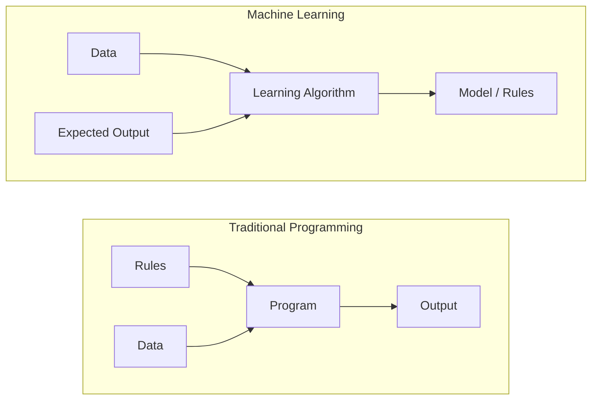
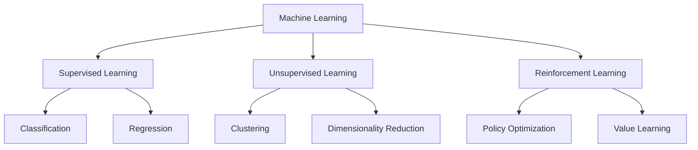
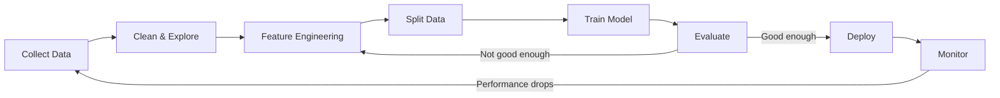
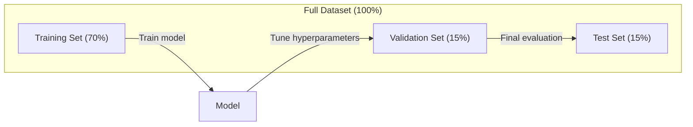
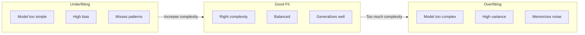
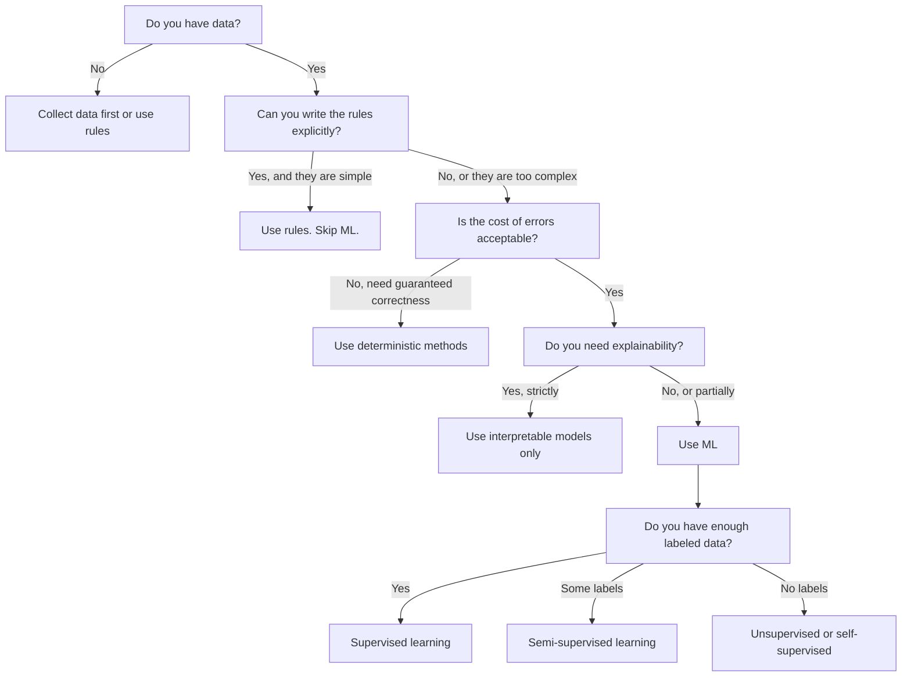

# Czym jest uczenie maszynowe

> Uczenie maszynowe to uczenie komputerów znajdowania wzorców w danych zamiast pisania reguł ręcznie.

**Typ:** Nauka
**Języki:** Python
**Wymagania wstępne:** Faza 1 (Podstawy matematyczne)
**Czas:** ~45 minut

## Cele uczenia się

- Wyjaśnić różnicę między uczeniem nadzorowanym, nienadzorowanym i przez wzmacnianie oraz zidentyfikować, który typ ma zastosowanie do danego problemu
- Zaimplementować klasyfikator najbliższego centroidu od podstaw i ocenić go w porównaniu z losowym baseline'em
- Rozróżnić zadania klasyfikacji i regresji oraz wybrać odpowiednią funkcję straty dla każdego z nich
- Ocenić, czy dany problem biznesowy nadaje się do ML lub czy lepiej rozwiązać go za pomocą deterministycznych reguł

## Problem

Chcesz zbudować filtr spamu. Tradycyjne podejście: siadasz i piszesz setki reguł. "Jeśli e-mail zawiera 'DARMOWE PIENIĄDZE', oznacz jako spam. Jeśli ma więcej niż 3 znaki wykrzyknika, oznacz jako spam." Spędzasz tygodnie pisząc reguły. Potem spamerzy zmieniają sformułowania. Twoje reguły się psują. Piszesz więcej reguł. Cykl nigdy się nie kończy.

Uczenie maszynowe odwraca to. Zamiast pisać reguły, dajesz komputerowi tysiące oznaczonych e-maili ("spam" lub "nie spam") i pozwalasz mu samodzielnie odkryć reguły. Komputer znajduje wzorce, o których nigdy byś nie pomyślał. Gdy spamerzy zmieniają taktykę, trenujesz na nowych danych zamiast przepisywać kod.

Ta zmiana z "programowania reguł" na "uczenie się z danych" jest sednem uczenia maszynowego. Każdy system rekomendacyjny, asystent głosowy, samojezdny samochód i model językowy działa w ten sposób.

## Koncepcja

### Uczenie się z danych, nie z reguł

Tradycyjne programowanie i uczenie maszynowe rozwiązują problemy w przeciwnych kierunkach.



Tradycyjne programowanie: piszesz reguły. Program stosuje je do danych, aby wygenerować wynik.

Uczenie maszynowe: dostarczasz dane i oczekiwane wyniki. Algorytm odkrywa reguły.

"Model", który wynika z treningu, TO są reguły, zakodowane jako liczby (wagi, parametry). Uogólnia on na przykłady, które widział, aby prognozować na danych, których nigdy nie widział.

### Trzy typy uczenia maszynowego



**Uczenie nadzorowane (Supervised Learning)**: Masz pary wejście-wyjście. Model uczy się odwzorowywać wejścia na wyjścia.
- "Oto 10 000 zdjęć oznaczonych jako kot lub pies. Naucz się je rozróżniać."
- "Oto cechy domów i ceny. Naucz się przewidywać cenę."

**Uczenie nienadzorowane (Unsupervised Learning)**: Masz tylko wejścia. Bez etykiet. Model znajduje strukturę samodzielnie.
- "Oto 10 000 historii zakupów klientów. Znajdź naturalne grupowania."
- "Oto 1 000 punktów danych o wysokiej wymiarowości. Zredukuj do 2 wymiarów, zachowując strukturę."

**Uczenie przez wzmacnianie (Reinforcement Learning)**: Agent podejmuje działania w środowisku i otrzymuje nagrody lub kary. Uczy się strategii (polityki), aby zmaksymalizować całkowitą nagrodę.
- "Zagraj w tę grę. +1 za wygraną, -1 za przegraną. Wymyśl strategię."
- "Kontroluj to ramię robota. +1 za podniesienie obiektu, -0.01 za każdą zmarnowaną sekundę."

Większość tego, co będziesz budować w praktyce, wykorzystuje uczenie nadzorowane. Uczenie nienadzorowane jest powszechne w przetwarzaniu wstępnym i eksploracji. Uczenie przez wzmacnianie napędza AI gier, robotykę i RLHF dla modeli językowych.

### Poza wielką trójką

Trzy powyższe kategorie są przejrzyste, ale rzeczywiste ML często zaciera granice.

**Uczenie półnadzorowane** wykorzystuje mały zbiór danych z etykietami i duży zbiór bez etykiet. Możesz mieć 100 oznaczonych obrazów medycznych i 100 000 nieoznaczonych. Techniki obejmują:

- **Propagację etykiet:** Zbuduj graf łączący podobne punkty danych. Etykiety rozprzestrzeniają się od oznaczonych węzłów do nieoznaczonych sąsiadów przez graf.
- **Pseudo-etykietowanie:** Trenuj model na danych z etykietami, użyj go do przewidywania etykiet dla danych bez etykiet, a następnie trenuj ponownie na wszystkim. Model sam buduje swój zbiór treningowy.
- **Regularyzację spójności:** Model powinien dawać tę samą prognozę dla wejścia i lekko zaburzonej wersji tego wejścia. To działa nawet bez etykiet.

**Uczenie samonadzorowane** tworzy nadzór z samych danych. Nie potrzeba żadnych etykiet od ludzi. Model tworzy własne zadanie predykcyjne z struktury danych.

- **Masked language modeling (BERT):** Ukryj 15% słów w zdaniu, trenuj model do przewidywania brakujących słów. "Etykiety" pochodzą z oryginalnego tekstu.
- **Contrastive learning (SimCLR):** Weź obraz, stwórz dwie wzmocnione wersje. Trenuj model, aby rozpoznawał, że pochodzą z tego samego obrazu, jednocześnie odróżniając je od wzmocnionych wersji innych obrazów.
- **Next-token prediction (GPT):** Przewiduj następne słowo, mając wszystkie poprzednie słowa. Każdy dokument tekstowy staje się przykładem treningowym.

To nie są oddzielne kategorie od wielkiej trójki. To strategie łączące pomysły nadzorowane i nienadzorowane. Uczenie samonadzorowane jest technicznie nadzorowane (model coś przewiduje), ale etykiety są generowane automatycznie, nie przez ludzi.

### Klasyfikacja czy regresja

To są dwa główne zadania uczenia nadzorowanego.

| Aspekt | Klasyfikacja | Regresja |
|--------|---------------|------------|
| Wynik | Dyskretne kategorie | Ciągłe liczby |
| Przykład | "Czy ten e-mail jest spamem?" | "Jaka będzie cena domu?" |
| Przestrzeń wyników | {kot, pies, ptak} | Dowolna liczba rzeczywista |
| Funkcja straty | Cross-entropy, accuracy | Mean squared error, MAE |
| Decyzja | Granice między klasami | Krzywa dopasowana do danych |

Klasyfikacja odpowiada na pytanie "która kategoria?" Regresja odpowiada na pytanie "ile?"

Niektóre problemy można sformułować w obu sposobach. Przewidywanie, czy akcja pójdzie w górę czy w dół, to klasyfikacja. Przewidywanie dokładnej ceny to regresja.

### Workflow ML

Każdy projekt uczenia maszynowego podąża tą samą ścieżką, niezależnie od algorytmu.



**Zbieranie danych**: Zbierz surowe dane. Więcej danych jest prawie zawsze lepsze, ale jakość ma większe znaczenie niż ilość.

**Czyszczenie i eksploracja**: Obsłuż brakujące wartości, usuń duplikaty, wizualizuj rozkłady, wychwyć anomalie. Ten krok często zajmuje 60-80% całkowitego czasu projektu.

**Inżynieria cech**: Przekształć surowe dane na cechy, których model może używać. Zamień daty na dzień tygodnia. Normalizuj kolumny numeryczne. Koduj zmienne kategorialne. Dobre cechy mają większe znaczenie niż wyrafinowane algorytmy.

**Podział danych**: Podziel na zbiory treningowy, walidacyjny i testowy. Model trenuje na danych treningowych, dostrajasz hiperparametry na danych walidacyjnych, a końcową wydajność raportujesz na danych testowych.

**Trenowanie modelu**: Wprowadź dane treningowe do algorytmu. Algorytm dostosowuje wewnętrzne parametry, aby zminimalizować funkcję straty.

**Ocena**: Zmierz wydajność na danych walidacyjnych/testowych. Jeśli wydajność jest nieakceptowalna, wróć i wypróbuj różne cechy, algorytmy lub hiperparametry.

**Wdrożenie**: Umieść model w produkcji, gdzie generuje prognozy na nowych danych.

**Monitorowanie**: Śledź wydajność w czasie. Rozkłady danych się zmieniają (data drift), a modele degradują. Gdy wydajność spada, przetrenuj.

### Podziały treningowy, walidacyjny i testowy

To jest najważniejsza koncepcja, którą początkujący mylą. Musisz oceniać swój model na danych, których nigdy nie widział podczas treningu. W przeciwnym razie mierzysz zapamiętywanie, nie uczenie.



| Podział | Cel | Kiedy używany | Typowy rozmiar |
|---------|---------|-----------|-------------|
| Treningowy | Model uczy się z tych danych | Podczas treningu | 60-80% |
| Walidacyjny | Dostrajanie hiperparametrów, porównywanie modeli | Po każdym przebiegu treningowym | 10-20% |
| Testowy | Końcowa nieobciążona ocena wydajności | Raz, na samym końcu | 10-20% |

Zbiór testowy jest święty. Patrzysz na niego dokładnie raz. Jeśli ciągle dostosowujesz swój model na podstawie wyników testowych, efektywnie trenujesz na zbiorze testowym, a twoje raportowane liczby są bez znaczenia.

W przypadku małych zbiorów danych używaj k-krotnej walidacji krzyżowej: podziel dane na k części, trenuj na k-1 częściach, waliduj na pozostałej części, rotuj i uśredniaj wyniki.

### Overfitting vs Underfitting



**Underfitting**: Model jest zbyt prosty, aby uchwycić wzorce w danych. Prosta linia próbująca dopasować krzywą zależność. Błąd treningowy jest wysoki. Błąd testowy jest wysoki.

**Overfitting**: Model jest zbyt złożony i zapamiętuje dane treningowe, włącznie z szumem. Kręta krzywa przechodząca przez każdy punkt treningowy, ale zawodząca na nowych danych. Błąd treningowy jest niski. Błąd testowy jest wysoki.

**Dobre dopasowanie**: Model uchwyca prawdziwe wzorce bez zapamiętywania szumu. Błąd treningowy i testowy są oba dość niskie.

Oznaki overfittingu:
- Dokładność treningowa jest znacznie wyższa niż walidacyjna
- Model dobrze działa na danych treningowych, ale słabo na nowych danych
- Dodanie większej ilości danych treningowych poprawia wydajność (model zapamiętywał, nie uczył się)

Naprawy overfittingu:
- Zdobądź więcej danych treningowych
- Zmniejsz złożoność modelu (mniej parametrów, prostsza architektura)
- Regularyzacja (dodaj karę za duże wagi)
- Dropout (losowo zeruj neurony podczas treningu)
- Early stopping (przestań trenować, gdy błąd walidacyjny zaczyna rosnąć)

Naprawy underfittingu:
- Użyj bardziej złożonego modelu
- Dodaj więcej cech
- Zmniejsz regularyzację
- Trenuj dłużej

### Kompromis między bias a wariancją

To jest matematyczne ramy stojące za overfittingiem i underfittingiem.

**Bias**: Błąd wynikający z błędnych założeń w modelu. Model liniowy ma wysoki bias, gdy prawdziwa zależność jest nieliniowa. Wysoki bias prowadzi do underfittingu.

**Wariancja**: Błąd wynikający z wrażliwości na małe wahania w danych treningowych. Model z wysoką wariancją daje bardzo różne prognozy, gdy jest trenowany na różnych podzbiorach danych. Wysoka wariancja prowadzi do overfittingu.

| Złożoność modelu | Bias | Wariancja | Rezultat |
|-----------------|------|----------|--------|
| Zbyt niska (model liniowy dla krzywych danych) | Wysoki | Niska | Underfitting |
| W sam raz | Średni | Średni | Dobre uogólnienie |
| Zbyt wysoka (wielomian stopnia 20 dla 10 punktów) | Niski | Wysoki | Overfitting |

Całkowity błąd = Bias^2 + Wariancja + Niepodzielny szum

Nie możesz zmniejszyć niepodzielnego szumu (to losowość w samych danych). Chcesz znaleźć optymalny punkt, gdzie bias^2 + wariancja jest zminimalizowane.

### Twierdzenie o braku darmowego lunchu

Nie istnieje pojedynczy algorytm, który działa najlepiej dla każdego problemu. Algorytm, który dobrze radzi sobie z jedną klasą problemów, będzie słabo działał z inną. Dlatego naukowcy danych wypróbowują wiele algorytmów i porównują wyniki.

W praktyce wybór zależy od:
- Ile masz danych
- Ile jest cech
- Czy zależność jest liniowa czy nieliniowa
- Czy potrzebujesz interpretowalności
- Ile mocy obliczeniowej możesz sobie pozwolić

### Kiedy NIE używać uczenia maszynowego

ML jest potężne, ale nie zawsze jest właściwym narzędziem. Zanim sięgniesz po model, zapytaj, czy naprawdę go potrzebujesz.

**Nie używaj ML, gdy:**

- **Reguły są proste i dobrze zdefiniowane.** Obliczenia podatkowe, algorytmy sortowania, konwersje jednostek. Jeśli możesz zapisać logikę w kilku instrukcjach if, model dodaje złożoność bez korzyści.
- **Nie masz danych lub masz bardzo mało danych.** ML potrzebuje przykładów do nauki. Z 10 punktami danych nie możesz wytrenować niczego sensownego. Najpierw zbierz dane.
- **Koszt pomyłki jest katastrofalny i potrzebujesz gwarantowanej poprawności.** Obliczanie dawek leków, kontrola reaktora jądrowego, weryfikacja kryptograficzna. Modele ML są probabilistyczne. Czasem będą się mylić. Jeśli "czasem się mylić" jest nieakceptowalne, używaj metod deterministycznych.
- **Tabela wyszukiwania lub heurystyka rozwiązuje problem.** Jeśli prosty próg lub tabela pokrywa 99% przypadków, dodanie ML zwiększa koszt utrzymania bez znaczącej poprawy.
- **Nie możesz wyjaśnić decyzji, a wymagana jest wyjaśnialność.** Regulowane branże (kredyty, ubezpieczenia, wymiar sprawiedliwości) czasem wymagają, aby każda decyzja była w pełni wyjaśnialna. Niektóre modele ML są interpretowalne (regresja liniowa, małe drzewa decyzyjne). Większość nie jest.
- **Problem zmienia się szybciej niż możesz przetrenować.** Jeśli reguły zmieniają się codziennie, a przetrenowanie trwa tydzień, model jest zawsze nieaktualny.

Użyj tego schematu decyzyjnego:



## Zbuduj to

Kod w `code/ml_intro.py` implementuje klasyfikator najbliższego centroidu od podstaw, najprostszy możliwy algorytm ML. Demonstruje podstawową ideę: ucz się z danych, a potem prognozuj na nowych danych.

### Krok 1: Klasyfikator najbliższego centroidu od podstaw

Klasyfikator najbliższego centroidu oblicza środek (średnią) każdej klasy w danych treningowych. Aby prognozować, przypisuje każdy nowy punkt do klasy, której środek jest najbliższy.

```python
class NearestCentroid:
    def fit(self, X, y):
        self.classes = np.unique(y)
        self.centroids = np.array([
            X[y == c].mean(axis=0) for c in self.classes
        ])

    def predict(self, X):
        distances = np.array([
            np.sqrt(((X - c) ** 2).sum(axis=1))
            for c in self.centroids
        ])
        return self.classes[distances.argmin(axis=0)]
```

To jest cały algorytm. Fit oblicza dwie średnie. Predict oblicza odległości. Bez gradient descent, bez iteracji, bez hiperparametrów.

### Krok 2: Trenuj na syntetycznych danych

Generujemy 2D zbiór danych klasyfikacyjny z dwiema klasami, które lekko się nakładają. Klasyfikator centroidu rysuje liniową granicę decyzyjną między środkami klas.

```python
rng = np.random.RandomState(42)
X_class0 = rng.randn(100, 2) + np.array([1.0, 1.0])
X_class1 = rng.randn(100, 2) + np.array([-1.0, -1.0])
X = np.vstack([X_class0, X_class1])
y = np.array([0] * 100 + [1] * 100)
```

### Krok 3: Porównaj z baseline'em

Każdy model ML powinien być porównany z trywialnym baseline'em. Tutaj baseline prognozuje losową klasę. Jeśli twój model ML nie pokonuje losowego zgadywania, coś jest nie tak.

```python
baseline_preds = rng.choice([0, 1], size=len(y_test))
baseline_acc = np.mean(baseline_preds == y_test)
```

Klasyfikator centroidu powinien uzyskać około 90%+ dokładności na tym czystym zbiorze danych. Losowy baseline uzyskuje około 50%.

### Dlaczego to ma znaczenie

Klasyfikator najbliższego centroidu jest trywialnie prosty. Nie ma hiperparametrów, nie ma iteracji, nie ma gradient descent. A jednak uchwyca fundamentalny wzorzec ML:

1. **Uczenie się** reprezentacji z danych treningowych (centroidy)
2. **Prognozowanie** na nowych danych używając tej reprezentacji (najbliższa odległość)
3. **Ocena** w porównaniu z baseline'em (losowe zgadywanie)

Każdy algorytm ML, od regresji logistycznej po transformatory, podąża tym samym wzorcem trzech kroków. Reprezentacja staje się bardziej złożona, ale workflow pozostaje taki sam.

### Krok 4: Czego klasyfikator centroidu nie potrafi

Klasyfikator najbliższego centroidu zakłada, że każda klasa tworzy pojedynczą grupę. Rysuje liniowe granice decyzyjne. Zawodzi, gdy:

- Klasy mają wiele klastrów (np. cyfra "1" może być napisana na kilka różnych sposobów)
- Granica decyzyjna jest nieliniowa (np. jedna klasa owija się wokół drugiej)
- Cechy mają bardzo różne skale (odległość jest zdominowana przez cechę o największej skali)

Te ograniczenia motywują każdy inny algorytm, który poznasz. K-najbliżssi sąsiedzi radzą sobie z wieloma klastrami. Drzewa decyzyjne radzą sobie z nieliniowymi granicami. Skalowanie cech naprawia problem skali. Każda lekcja buduje na ograniczeniach poprzedniej.

## Użyj tego

sklearn dostarcza `NearestCentroid` i generatory syntetycznych danych:

```python
from sklearn.neighbors import NearestCentroid
from sklearn.datasets import make_classification
from sklearn.model_selection import train_test_split

X, y = make_classification(
    n_samples=500, n_features=2, n_redundant=0,
    n_clusters_per_class=1, random_state=42
)
X_train, X_test, y_train, y_test = train_test_split(X, y, test_size=0.3)

clf = NearestCentroid()
clf.fit(X_train, y_train)
print(f"Accuracy: {clf.score(X_test, y_test):.3f}")
```

## Wyślij to

Ta lekcja tworzy `outputs/prompt-ml-problem-framer.md` -- prompt, który zamienia mętne problemy biznesowe w konkretne zadania ML. Podaj opis problemu ("chcemy zmniejszyć odpływ klientów" lub "przewidzieć popyt na następny kwartał"), a zidentyfikuje typ uczenia, zdefiniuje cel predykcji, wymieni kandydackie cechy, wybierze metrykę sukcesu, ustali baseline i wskaże pułapki, takie jak wyciek danych lub nierównowaga klas. Użyj tego na początku każdego projektu ML, aby uniknąć budowania niewłaściwej rzeczy.

## Kluczowe terminy

| Termin | Co ludzie mówią | Co to faktycznie oznacza |
|------|----------------|----------------------|
| Model | "Sztuczna inteligencja" | Funkcja matematyczna z parametrami do nauczenia, która odwzorowuje wejścia na wyjścia |
| Trening | "Uczyć AI" | Uruchamianie algorytmu optymalizacji w celu dostosowania parametrów modelu, aby prognozy odpowiadały znanym wynikom |
| Cecha (Feature) | "Kolumna wejściowa" | Mierzalna właściwość danych, którą model wykorzystuje do prognozowania |
| Etykieta (Label) | "Odpowiedź" | Znany wynik dla przykładu treningowego, używany do obliczenia sygnału błędu |
| Hiperparametr | "Ustawienie, które dostosowujesz" | Parametr ustawiany przed treningiem, który kontroluje proces uczenia (learning rate, liczba warstw) |
| Funkcja straty | "Jak bardzo model się myli" | Funkcja mierząca lukę między prognozowanymi a rzeczywistymi wynikami, którą trening stara się zminimalizować |
| Overfitting | "Zapamiętał test" | Model nauczył się szumu specyficznego dla treningu zamiast ogólnych wzorców, więc zawodzi na nowych danych |
| Underfitting | "Nic się nie nauczył" | Model jest zbyt prosty, aby uchwycić prawdziwe wzorce w danych |
| Uogólnienie | "Działa na nowych danych" | Zdolność modelu do dokładnych prognoz na danych, na których nie był trenowany |
| Walidacja krzyżowa | "Testowanie na różnych fragmentach" | Wielokrotne dzielenie danych na foldery train/test i uśrednianie wyników, dające bardziej robustną ocenę wydajności |
| Regularyzacja | "Utrzymywanie wag małymi" | Dodawanie terminu kary do funkcji straty, który zniechęca do nadmiernie złożonych modeli |
| Data drift | "Świat się zmienił" | Statystyczny rozkład napływających danych przesuwa się w czasie, pogarszając wydajność modelu |

## Ćwiczenia

1. Weź dowolny zbiór danych (np. Iris, Titanic). Podziel go 70/15/15 na train/validation/test. Wyjaśnij, dlaczego nie powinieneś dostrajać hiperparametrów na zbiorze testowym.
2. Wymień trzy rzeczywiste problemy. Dla każdego z nich zidentyfikuj, czy jest to klasyfikacja, regresja czy klasteryzacja, oraz czy jest nadzorowane czy nienadzorowane.
3. Model uzyskuje 99% dokładności na danych treningowych, ale 60% na danych testowych. Zdiagnozuj problem i wymień trzy rzeczy, które spróbowałbyś zrobić, aby to naprawić.

## Dalsza lektura

- [An Introduction to Statistical Learning](https://www.statlearning.com/) - darmowy podręcznik obejmujący wszystkie klasyczne metody ML z praktycznymi przykładami
- [Google's Machine Learning Crash Course](https://developers.google.com/machine-learning/crash-course) - zwięzłe wizualne wprowadzenie do koncepcji ML
- [Scikit-learn User Guide](https://scikit-learn.org/stable/user_guide.html) - praktyczne odniesienie do implementacji ML w Pythonie