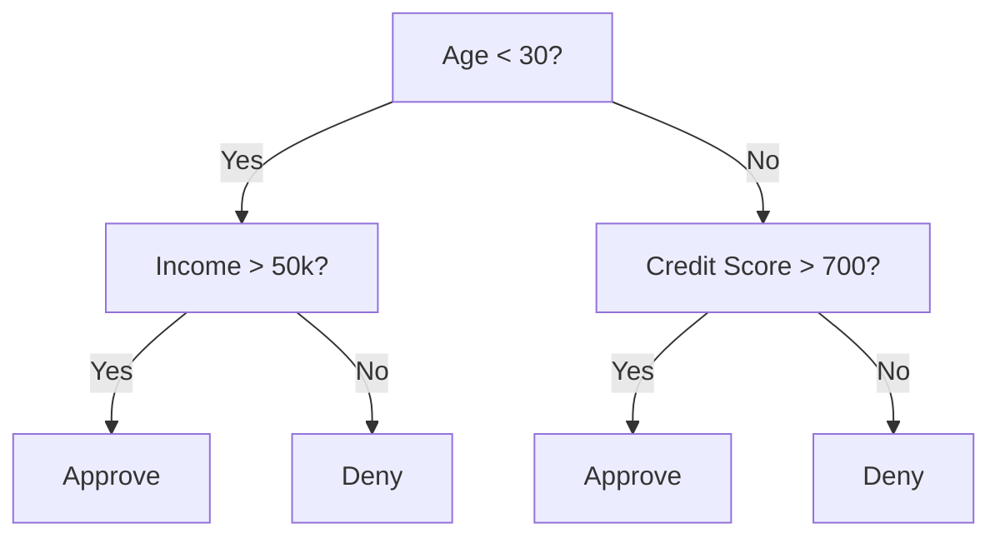
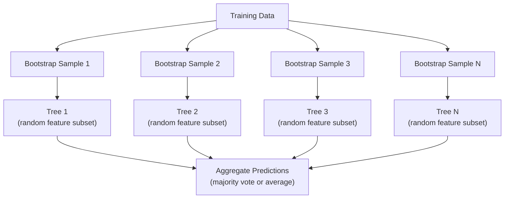

# Drzewa decyzyjne i lasy losowe

> Drzewo decyzyjne to po prostu schemat blokowy. Ale las z nich to jedno z najpotężniejszych narzędzi w ML.

**Typ:** Budowanie
**Język:** Python
**Wymagania wstępne:** Faza 1 (Lekcje 09 Teoria informacji, 06 Prawdopodobieństwo)
**Czas:** ~90 minut

## Cele uczenia się

- Implementacja obliczeń domieszki Gini, entropii i zysku informacyjnego w celu znalezienia optymalnych podziałów drzewa decyzyjnego
- Zbudowanie klasyfikatora drzewa decyzyjnego od zera z kontrolami przycinania wstępnego (maksymalna głębokość, minimalna liczba próbek)
- Konstrukcja lasu losowego przy użyciu próbkowania bootstrap i randomizacji cech oraz wyjaśnienie, dlaczego redukuje on wariancję
- Porównanie ważności cech MDI z ważnością permutacyjną oraz identyfikacja, kiedy MDI jest stronnicze

## Problem

Masz dane tabelaryczne. Wiersze to próbki, kolumny to cechy, a kolumna docelowa to wartość, którą chcesz przewidzieć. Mógłbyś rzucić na to sieć neuronową. Ale dla danych tabelarycznych modele oparte na drzewach (drzewa decyzyjne, lasy losowe, drzewa wzmacniane gradientowo) konsekwentnie przewyższają głębokie uczenie. Konkursy Kaggle na danych strukturalnych są zdominowane przez XGBoost i LightGBM, a nie transformery.

Dlaczego? Drzewa obsługują mieszane typy cech (numeryczne i kategorialne) bez wstępnego przetwarzania. Obsługują nieliniowe zależności bez inżynierii cech. Są interpretowalne: możesz spojrzeć na drzewo i dokładnie zobaczyć, dlaczego została podjęta dana predykcja. A lasy losowe, które uśredniają wiele drzew, są wysoce odporne na nadmierne dopasowanie w zbiorach danych o umiarkowanej wielkości.

Ta lekcja buduje drzewa decyzyjne od zera przy użyciu rekursywnego dzielenia, a następnie buduje las losowy na tym. Zaimplementujesz matematykę stojącą za kryteriami podziału (domieszka Gini, entropia, zysk informacyjny) i zrozumiesz, dlaczego ansambl słabych uczących się staje się silnym.

## Koncepcja

### Co robi drzewo decyzyjne

Drzewo decyzyjne dzieli przestrzeń cech na prostokątne regiony poprzez zadawanie sekwencji pytań tak/nie.



Każdy wewnętrzny węzeł testuje cechę względem progu. Każdy liść wykonuje predykcję. Aby sklasyfikować nowy punkt danych, zaczynasz od korzenia i podążasz za gałęziami, aż dotrzesz do liścia.

Drzewo jest budowane od góry poprzez wybieranie, w każdym węźle, cechy i progu, które najlepiej separują dane. "Najlepiej" jest definiowane przez kryterium podziału.

### Kryteria podziału: pomiar domieszki

W każdym węźle mamy zbiór próbek. Chcemy je podzielić tak, aby wynikowe węzły potomne były jak najbardziej "czyste", co oznacza, że każdy potomek zawiera głównie jedną klasę.

**Domieszka Gini** mierzy prawdopodobieństwo, że losowo wybrana próbka zostałaby błędnie sklasyfikowana, gdyby została oznaczona zgodnie z rozkładem klas w tym węźle.

```
Gini(S) = 1 - sum(p_k^2)

gdzie p_k to proporcja klasy k w zbiorze S.
```

Dla czystego węzła (wszystkie jednej klasy), Gini = 0. Dla binarnego podziału z klasami 50/50, Gini = 0.5. Niższy jest lepszy.

```
Przykład: 6 kotów, 4 psy

Gini = 1 - (0.6^2 + 0.4^2) = 1 - (0.36 + 0.16) = 0.48
```

**Entropia** mierzy zawartość informacji (nieuporządkowanie) w węźle. Omówiona w Lekcji 09 Fazy 1.

```
Entropy(S) = -sum(p_k * log2(p_k))
```

Dla czystego węzła, entropia = 0. Dla binarnego podziału 50/50, entropia = 1.0. Niższa jest lepsza.

```
Przykład: 6 kotów, 4 psy

Entropy = -(0.6 * log2(0.6) + 0.4 * log2(0.4))
        = -(0.6 * -0.737 + 0.4 * -1.322)
        = 0.442 + 0.529
        = 0.971 bits
```

**Zysk informacyjny** to redukcja domieszki (entropii lub Gini) po podziale.

```
IG(S, feature, threshold) = Impurity(S) - weighted_avg(Impurity(S_left), Impurity(S_right))

gdzie wagi to proporcje próbek w każdym potomku.
```

Zachłanny algorytm w każdym węźle: wypróbuj każdą cechę i każdy możliwy próg. Wybierz parę (cecha, próg), która maksymalizuje zysk informacyjny.

### Jak działa dzielenie

Dla zbioru danych z n cechami i m próbkami w bieżącym węźle:

1. Dla każdej cechy j (j = 1 do n):
   - Posortuj próbki według cechy j
   - Wypróbuj każdy punkt środkowy między kolejnymi distinct wartościami jako próg
   - Oblicz zysk informacyjny dla każdego progu
2. Wybierz cechę i próg z najwyższym zyskiem informacyjnym
3. Podziel dane na lewo (cecha <= próg) i prawo (cecha > próg)
4. Rekuruj na każdym potomku

To zachłanne podejście nie gwarantuje globalnie optymalnego drzewa. Znalezienie optymalnego drzewa jest NP-trudne. Ale zachłanne dzielenie działa dobrze w praktyce.

### Warunki zatrzymania

Bez warunków zatrzymania drzewo rośnie, aż każdy liść będzie czysty (jedna próbka na liść). To doskonale zapamiętuje dane treningowe i generalizuje tragicznie.

**Przycinanie wstępne** zatrzymuje drzewo, zanim w pełni wyrośnie:
- Maksymalna głębokość: przestań dzielić, gdy drzewo osiągnie ustawioną głębokość
- Minimalna liczba próbek na liść: przestań, jeśli węzeł ma mniej niż k próbek
- Minimalny zysk informacyjny: przestań, jeśli najlepszy podział poprawia domieszkę o mniej niż próg
- Maksymalna liczba liści: ogranicz całkowitą liczbę liści

**Przycinanie końcowe** rośnie pełne drzewo, a następnie przycina je:
- Przycinanie złożoności kosztowej (używane przez scikit-learn): dodaje karę proporcjonalną do liczby liści. Zwiększ karę, aby uzyskać mniejsze drzewa
- Przycinanie zredukowanym błędem: usuń poddrzewo, jeśli błąd walidacji nie wzrasta

Przycinanie wstępne jest prostsze i szybsze. Przycinanie końcowe często produkuje lepsze drzewa, bo nie zatrzymuje przedwcześnie podziałów, które mogłyby prowadzić do użytecznych dalszych podziałów.

### Drzewa decyzyjne dla regresji

Dla regresji predykcja liścia to średnia wartości docelowych w tym liściu. Kryterium podziału również się zmienia:

**Redukcja wariancji** zastępuje zysk informacyjny:

```
VR(S, feature, threshold) = Var(S) - weighted_avg(Var(S_left), Var(S_right))
```

Wybierz podział, który najbardziej redukuje wariancję. Drzewo dzieli przestrzeń wejściową na regiony i przewiduje stałą (średnią) w każdym regionie.

### Lasy losowe: siła ansambli

Pojedyncze drzewo decyzyjne ma wysoką wariancję. Małe zmiany w danych mogą produkować całkowicie różne drzewa. Lasy losowe to naprawiają poprzez uśrednianie wielu drzew.



Dwa źródła losowości czynią drzewa zróżnicowanymi:

**Bagging (agregacja bootstrap):** Każde drzewo jest trenowane na próbce bootstrap, losowej próbce z powtórzeniami z danych treningowych. Około 63% oryginalnych próbek pojawia się w każdej próbce bootstrap (reszta to próbki out-of-bag, które mogą być używane do walidacji).

**Randomizacja cech:** W każdym podziale rozważana jest tylko losowy podzbiór cech. Dla klasyfikacji domyślnie sqrt(n_features). Dla regresji n_features/3. To zapobiega wszystkim drzewom dzielącym na tej samej dominującej cesze.

Kluczowy wgląd: uśrednianie wielu zdekorelowanych drzew redukuje wariancję bez zwiększania obciążenia. Każde pojedyncze drzewo może być przeciętne. Ansambl jest silny.

### Ważność cech

Lasy losowe naturalnie dostarczają wyniki ważności cech. Najczęstsza metoda:

**Średni spadek domieszki (MDI):** Dla każdej cechy sumuj całkowitą redukcję domieszki we wszystkich drzewach i węzłach, gdzie ta cecha jest używana. Cechy produkujące większe redukcje domieszki we wcześniejszych podziałach są ważniejsze.

```
importance(feature_j) = suma po wszystkich węzłach gdzie feature_j jest używane:
    (n_samples_at_node / n_total_samples) * impurity_decrease
```

To jest szybkie (obliczane podczas treningu), ale stronnicze wobec cech o wysokiej kardynalności i cech z wieloma możliwymi punktami podziału.

**Ważność permutacji** to alternatywa: tasuj wartości jednej cechy i zmierz, jak bardzo spada dokładność modelu. Bardziej wiarygodne, ale wolniejsze.

### Kiedy drzewa biją sieci neuronowe

Drzewa i lasy dominują sieci neuronowe na danych tabelarycznych. Kilka powodów:

| Czynnik | Drzewa | Sieci neuronowe |
|--------|-------|----------------|
| Mieszane typy (numeryczne + kategorialne) | Natywne wsparcie | Wymaga kodowania |
| Małe zbiory danych (< 10k wierszy) | Działają dobrze | Nadmierne dopasowanie |
| Interakcje cech | Znajdywane przez dzielenie | Wymaga projektowania architektury |
| Interpretowalność | Pełna transparentność | Czarna skrzynka |
| Czas treningu | Minuty | Godziny |
| Wrażliwość na hiperparametry | Niska | Wysoka |

Sieci neuronowe wygrywają, gdy dane mają strukturę przestrzenną lub sekwencyjną (obrazy, tekst, audio). Dla płaskich tabel cech drzewa są domyślne.

## Zbuduj to

### Krok 1: Domieszka Gini i entropia

Zbuduj oba kryteria podziału od zera i zweryfikuj, że zgadzają się co do tego, które podziały są dobre.

```python
import math

def gini_impurity(labels):
    n = len(labels)
    if n == 0:
        return 0.0
    counts = {}
    for label in labels:
        counts[label] = counts.get(label, 0) + 1
    return 1.0 - sum((c / n) ** 2 for c in counts.values())

def entropy(labels):
    n = len(labels)
    if n == 0:
        return 0.0
    counts = {}
    for label in labels:
        counts[label] = counts.get(label, 0) + 1
    return -sum(
        (c / n) * math.log2(c / n) for c in counts.values() if c > 0
    )
```

### Krok 2: Znajdź najlepszy podział

Wypróbuj każdą cechę i każdy próg. Zwróć ten z najwyższym zyskiem informacyjnym.

```python
def information_gain(parent_labels, left_labels, right_labels, criterion="gini"):
    measure = gini_impurity if criterion == "gini" else entropy
    n = len(parent_labels)
    n_left = len(left_labels)
    n_right = len(right_labels)
    if n_left == 0 or n_right == 0:
        return 0.0
    parent_impurity = measure(parent_labels)
    child_impurity = (
        (n_left / n) * measure(left_labels) +
        (n_right / n) * measure(right_labels)
    )
    return parent_impurity - child_impurity
```

### Krok 3: Zbuduj klasę DecisionTree

Rekursywne dzielenie, predykcja i śledzenie ważności cech.

```python
class DecisionTree:
    def __init__(self, max_depth=None, min_samples_split=2,
                 min_samples_leaf=1, criterion="gini",
                 max_features=None):
        self.max_depth = max_depth
        self.min_samples_split = min_samples_split
        self.min_samples_leaf = min_samples_leaf
        self.criterion = criterion
        self.max_features = max_features
        self.tree = None
        self.feature_importances_ = None

    def fit(self, X, y):
        self.n_features = len(X[0])
        self.feature_importances_ = [0.0] * self.n_features
        self.n_samples = len(X)
        self.tree = self._build(X, y, depth=0)
        total = sum(self.feature_importances_)
        if total > 0:
            self.feature_importances_ = [
                fi / total for fi in self.feature_importances_
            ]

    def predict(self, X):
        return [self._predict_one(x, self.tree) for x in X]
```

### Krok 4: Zbuduj klasę RandomForest

Próbkowanie bootstrap, randomizacja cech i głosowanie większościowe.

```python
class RandomForest:
    def __init__(self, n_trees=100, max_depth=None,
                 min_samples_split=2, max_features="sqrt",
                 criterion="gini"):
        self.n_trees = n_trees
        self.max_depth = max_depth
        self.min_samples_split = min_samples_split
        self.max_features = max_features
        self.criterion = criterion
        self.trees = []

    def fit(self, X, y):
        n = len(X)
        for _ in range(self.n_trees):
            indices = [random.randint(0, n - 1) for _ in range(n)]
            X_boot = [X[i] for i in indices]
            y_boot = [y[i] for i in indices]
            tree = DecisionTree(
                max_depth=self.max_depth,
                min_samples_split=self.min_samples_split,
                max_features=self.max_features,
                criterion=self.criterion,
            )
            tree.fit(X_boot, y_boot)
            self.trees.append(tree)

    def predict(self, X):
        all_preds = [tree.predict(X) for tree in self.trees]
        predictions = []
        for i in range(len(X)):
            votes = {}
            for preds in all_preds:
                v = preds[i]
                votes[v] = votes.get(v, 0) + 1
            predictions.append(max(votes, key=votes.get))
        return predictions
```

Zobacz `code/trees.py` po kompletną implementację ze wszystkimi metodami pomocniczymi.

## Użyj tego

Z scikit-learn trening lasu losowego to trzy linie:

```python
from sklearn.ensemble import RandomForestClassifier
from sklearn.datasets import load_iris
from sklearn.model_selection import train_test_split

X, y = load_iris(return_X_y=True)
X_train, X_test, y_train, y_test = train_test_split(X, y, random_state=42)

rf = RandomForestClassifier(n_estimators=100, random_state=42)
rf.fit(X_train, y_train)
print(f"Accuracy: {rf.score(X_test, y_test):.4f}")
print(f"Feature importances: {rf.feature_importances_}")
```

W praktyce drzewa wzmacniane gradientowo (XGBoost, LightGBM, CatBoost) są często silniejsze niż lasy losowe, ponieważ budują drzewa sekwencyjnie, z każdym drzewem korygującym błędy poprzednich. Ale lasy losowe są trudniejsze do błędnego skonfigurowania i wymagają prawie żadnego dostrajania hiperparametrów.

## Dostarcz to

Ta lekcja produkuje `outputs/prompt-tree-interpreter.md` -- prompt, który interpretuje podziały drzewa decyzyjnego dla interesariuszy biznesowych. Podaj strukturę wytrenowanego drzewa (głębokość, cechy, progi podziału, dokładność), a przetłumaczy model w reguły w prostym języku, uszereguje ważność cech, oznaczy nadmierne dopasowanie lub przeciek oraz zaproponuje następne kroki. Używaj go za każdym razem, gdy musisz wyjaśnić model oparty na drzewach komuś, kto nie czyta kodu.

## Ćwiczenia

1. Trenuj pojedyncze drzewo decyzyjne na zbiorze 2D z 3 klasami. Ręcznie prześledź podziały i narysuj prostokątne granice decyzyjne. Porównaj granice przy max_depth=2 vs max_depth=10.

2. Zaimplementuj podziały z redukcją wariancji dla drzew regresyjnych. Generuj y = sin(x) + szum dla 200 punktów i dopasuj swoje drzewo regresyjne. Wykreśl predykcje drzewa jako funkcję przedziałową względem prawdziwej krzywej.

3. Zbuduj las losowy z 1, 5, 10, 50 i 200 drzewami. Wykreśl dokładność treningową i testową vs liczbę drzew. Zaobserwuj, że dokładność testowa się plateauje, ale nie maleje (lasy są odporne na nadmierne dopasowanie).

4. Porównaj domieszkę Gini vs entropię jako kryteria podziału na 5 różnych zbiorach danych. Zmierz dokładność i głębokość drzewa. W większości przypadków produkują niemal identyczne wyniki. Wyjaśnij dlaczego.

5. Zaimplementuj ważność permutacji. Porównaj ją z ważnością MDI na zbiorze danych, gdzie jedna cecha to losowy szum, ale ma wysoką kardynalność. MDI uszereguje cechę szumową wysoko. Ważność permutacji nie.

## Kluczowe terminy

| Termin | Co ludzie mówią | Co to faktycznie oznacza |
|------|----------------|----------------------|
| Drzewo decyzyjne | "Schemat blokowy do predykcji" | Model dzielący przestrzeń cech na prostokątne regiony poprzez naukę sekwencji podziałów if/else |
| Domieszka Gini | "Jak zmieszany jest węzeł" | Prawdopodobieństwo błędnej klasyfikacji losowej próbki w węźle. 0 = czysty, 0.5 = maksymalna domieszka dla binarnego |
| Entropia | "Nieuporządkowanie w węźle" | Zawartość informacji w węźle. 0 = czysty, 1.0 = maksymalna niepewność dla binarnego. Z teorii informacji |
| Zysk informacyjny | "Jak dobry jest podział" | Redukcja domieszki po podziale. Zachłanne kryterium wyboru podziałów |
| Przycinanie wstępne | "Zatrzymaj drzewo wcześnie" | Wczesne zatrzymanie wzrostu drzewa przez ustawienie maksymalnej głębokości, minimalnej liczby próbek lub minimalnego progu zysku |
| Przycinanie końcowe | "Przycinaj drzewo potem" | Wzrost pełnego drzewa, następnie usunięcie poddrzew, które nie poprawiają wydajności walidacji |
| Bagging | "Trenuj na losowych podzbiorach" | Agregacja bootstrap. Trenuj każdy model na innym losowym podzbiorze z powtórzeniami |
| Las losowy | "Bunch of trees" | Ansambl drzew decyzyjnych, każde trenowane na próbce bootstrap z losowymi podzbiorami cech w każdym podziale |
| Ważność cech (MDI) | "Które cechy mają znaczenie" | Całkowity spadek domieszki wniesiony przez każdą cechę, sumowany po wszystkich drzewach i węzłach |
| Ważność permutacji | "Tasuj i sprawdź" | Spadek dokładności, gdy wartości cechy są losowo tasowane. Bardziej wiarygodna niż MDI dla szumowych cech |
| Redukcja wariancji | "Wersja regresyjna zysku informacyjnego" | Odpowiednik drzewa regresyjnego dla zysku informacyjnego. Wybiera podział redukujący wariancję zmiennej docelowej najbardziej |
| Próbka bootstrap | "Losowa próbka z powtórzeniami" | Losowa próbka pobrana z powtórzeniami z oryginalnego zbioru danych. Ten sam rozmiar, ale z duplikatami |

## Dalsze czytanie

- [Breiman: Random Forests (2001)](https://link.springer.com/article/10.1023/A:1010933404324) - oryginalny artykuł o lasach losowych
- [Grinsztajn et al.: Why do tree-based models still outperform deep learning on tabular data? (2022)](https://arxiv.org/abs/2207.08815) - rygorystyczne porównanie drzew i sieci neuronowych na zadaniach tabelarycznych
- [scikit-learn Decision Trees documentation](https://scikit-learn.org/stable/modules/tree.html) - praktyczny przewodnik z narzędziami wizualizacji
- [XGBoost: A Scalable Tree Boosting System (Chen & Guestrin, 2016)](https://arxiv.org/abs/1603.02754) - artykuł o wzmacnianiu gradientowym, który dominuje na Kaggle