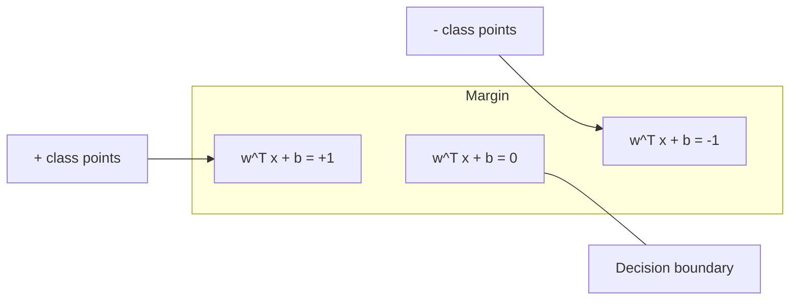
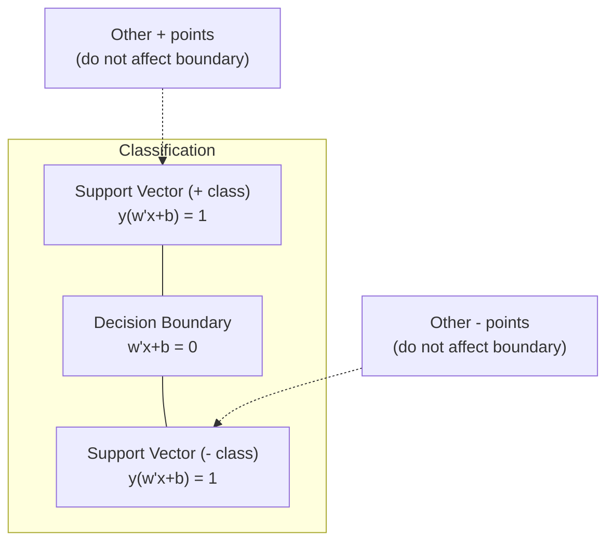
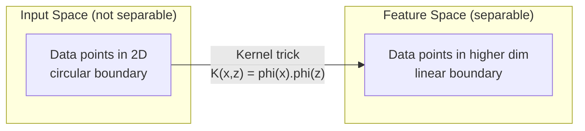

# Maszyny Wektorów Nośnych

> Znajdź najszerszą ulicę między dwiema klasami. To jest cała idea.

**Typ:** Budowanie
**Język:** Python
**Wymagania wstępne:** Faza 1 (Lekcje 08 Optymalizacja, 14 Normy i Odległości, 18 Optymalizacja Wypukła)
**Czas:** około 90 minut

## Cele uczenia się

- Zaimplementuj liniowy SVM od podstaw używając funkcji straty hinge i spadku gradientu na formulacji prymalnej
- Wyjaśnij zasadę maksymalnego marginesu i identyfikuj wektory nośne z wytrenowanego modelu
- Porównaj jądra liniowe, wielomianowe i RBF oraz wyjaśnij, jak sztuczka jądrowa pozwala uniknąć jawnego odwzorowania w przestrzeń wysokowymiarową
- Oceń kompromis kontrolowany przez parametr C między szerokością marginesu a błędami klasyfikacji

## Problem

Masz dwie klasy punktów danych i musisz narysować linię (lub hiperplaszczyznę) je rozdzielającą. Nieskończenie wiele linii może się sprawdzić. Którą powinieneś wybrać?

Tę z największym marginesem. Margines to odległość między granicą decyzyjną a najbliższymi punktami danych po obu stronach. Szerszy margines oznacza, że klasyfikator jest bardziej pewny siebie i lepiej uogólnia na niewidziane dane.

Ta intuicja prowadzi do Maszyn Wektorów Nośnych (SVM), jednego z najbardziej matematycznie eleganckich algorytmów w ML. SVM-y były dominującą metodą klasyfikacji przed erą głębokiego uczenia i pozostają najlepszym wyborem dla małych zbiorów danych, danych wysokowymiarowych oraz problemów, gdzie potrzebujesz principled, dobrze zrozumianego modelu z teoretycznymi gwarancjami.

SVM-y łączą się bezpośrednio z Fazą 1: optymalizacja jest wypukła (Lekcja 18), margines jest mierzony normami (Lekcja 14), a sztuczka jądrowa wykorzystuje iloczyny skalarne do obsługi nieliniowych granic bez nigdy wykonywania obliczeń w przestrzeni wysokowymiarowej.

## Koncepcja

### Klasyfikator maksymalnego marginesu

Mając liniowo separowalne dane z etykietami y_i w zbiorze {-1, +1} i wektorami cech x_i, chcemy hiperplaszczyznę w^T x + b = 0, która rozdziela klasy.

Odległość punktu x_i od hiperplaszczyzny wynosi:

```
distance = |w^T x_i + b| / ||w||
```

Dla poprawnie sklasyfikowanego punktu: y_i * (w^T x_i + b) > 0. Margines to dwukrotność odległości od hiperplaszczyzny do najbliższego punktu po każdej stronie.



Problem optymalizacyjny:

```
maximize    2 / ||w||     (the margin width)
subject to  y_i * (w^T x_i + b) >= 1  for all i
```

Równoważnie (minimalizowanie ||w||^2 jest łatwiejsze do optymalizacji):

```
minimize    (1/2) ||w||^2
subject to  y_i * (w^T x_i + b) >= 1  for all i
```

To jest wypukły problem kwadratowy. Ma jedyne globalne rozwiązanie. Punkty danych, które leżą dokładnie na granicach marginesu (gdzie y_i * (w^T x_i + b) = 1) są wektorami nośnymi. To jedyne punkty, które determinują granicę decyzyjną. Przesuń lub usuń dowolny punkt niebędący wektorem nośnym, a granica się nie zmieni.

### Wektory nośne: krytyczna niewielka część



Większość punktów treningowych jest nieistotna. Tylko wektory nośne mają znaczenie. Dlatego SVM-y są efektywne pamięciowo podczas predykcji: musisz przechowywać tylko wektory nośne, a nie cały zbiór treningowy.

Liczba wektorów nośnych daje również ograniczenie na błąd uogólnienia. Mniej wektorów nośnych w stosunku do rozmiaru zbioru danych oznacza lepsze uogólnienie.

### Miękki margines: obsługa szumu z parametrem C

Prawdziwe dane rzadko są idealnie separowalne. Niektóre punkty mogą być po złej stronie granicy lub wewnątrz marginesu. Formulacja miękkiego marginesu pozwala na naruszenia przez wprowadzenie zmiennych relaksacyjnych.

```
minimize    (1/2) ||w||^2 + C * sum(xi_i)
subject to  y_i * (w^T x_i + b) >= 1 - xi_i
            xi_i >= 0  for all i
```

Zmienna relaksacyjna xi_i mierzy, ile punkt i narusza margines. C kontroluje kompromis:

| Wartość C | Zachowanie |
|---------|----------|
| Duże C | Silnie karze za naruszenia. Wąski margines, mniej błędów klasyfikacji. Przeuczenie |
| Małe C | Pozwala na więcej naruszeń. Szeroki margines, więcej błędów klasyfikacji. Niedouczenie |

C to siła regularyzacji odwrócona. Duże C = mniej regularyzacji. Małe C = więcej regularyzacji.

### Funkcja straty hinge: funkcja straty SVM

Miękki margines SVM może być przepisany jako optymalizacja bez ograniczeń:

```
minimize    (1/2) ||w||^2 + C * sum(max(0, 1 - y_i * (w^T x_i + b)))
```

Term max(0, 1 - y_i * f(x_i)) to funkcja straty hinge. Jest zerowa, gdy punkt jest poprawnie sklasyfikowany i poza marginesem. Jest liniowa, gdy punkt jest wewnątrz marginesu lub błędnie sklasyfikowany.

```
Funkcja straty hinge dla pojedynczego punktu:

loss
  |
  | \
  |  \
  |   \
  |    \
  |     \_______________
  |
  +-----|-----|-------->  y * f(x)
       0     1

Strata zero gdy y*f(x) >= 1 (poprawnie sklasyfikowany, poza marginesem).
Kara liniowa gdy y*f(x) < 1.
```

Porównaj z funkcją straty logistyczną (regresja logistyczna):

```
Hinge:     max(0, 1 - y*f(x))          Ostre odcięcie na marginesie
Logistic:  log(1 + exp(-y*f(x)))        Gładka, nigdy dokładnie zero
```

Funkcja straty hinge tworzy rzadkie rozwiązania (tylko wektory nośne mają niezerowy wkład). Funkcja straty logistyczna używa wszystkich punktów danych. To czyni SVM-y bardziej efektywnymi pamięciowo podczas predykcji.

### Trenowanie liniowego SVM-a spadkiem gradientu

Możesz trenować liniowy SVM używając spadku gradientu na funkcji straty hinge plus regularyzacja L2, bez rozwiązywania ograniczonego QP:

```
L(w, b) = (lambda/2) * ||w||^2 + (1/n) * sum(max(0, 1 - y_i * (w^T x_i + b)))

Gradient względem w:
  Jeśli y_i * (w^T x_i + b) >= 1:  dL/dw = lambda * w
  Jeśli y_i * (w^T x_i + b) < 1:   dL/dw = lambda * w - y_i * x_i

Gradient względem b:
  Jeśli y_i * (w^T x_i + b) >= 1:  dL/db = 0
  Jeśli y_i * (w^T x_i + b) < 1:   dL/db = -y_i
```

To nazywa się formulacją prymalną. Działa w O(n * d) na epokę, gdzie n to liczba próbek, a d to liczba cech. Dla dużych, rzadkich, wysokowymiarowych danych (klasyfikacja tekstu), to jest szybkie.

### Formulacja dualna i sztuczka jądrowa

Dual Lagrangian problemu SVM (z Fazy 1 Lekcja 18, warunki KKT) to:

```
maximize    sum(alpha_i) - (1/2) * sum_ij(alpha_i * alpha_j * y_i * y_j * (x_i . x_j))
subject to  0 <= alpha_i <= C
            sum(alpha_i * y_i) = 0
```

Dualny dotyczy tylko iloczynów skalarnych x_i . x_j między punktami danych. To jest kluczowy wgląd. Zastąp każdy iloczyn skalarny funkcją jądrową K(x_i, x_j), a SVM może uczyć się nieliniowych granic bez nigdy jawnego obliczania transformacji.

```
Liniowe jądro:      K(x, z) = x . z
Wielomianowe jądro:  K(x, z) = (x . z + c)^d
RBF (Gaussowskie):     K(x, z) = exp(-gamma * ||x - z||^2)
```

Jądro RBF mapuje dane w przestrzeń nieskończenie wymiarową. Punkty bliskie w przestrzeni wejściowej mają wartość jądra bliską 1. Punkty odległe mają wartość jądra bliską 0. Może nauczyć się dowolnej gładkiej granicy decyzyjnej.



Sztuczka jądrowa oblicza iloczyn skalarny w przestrzeni wysokowymiarowej bez nigdy tam wchodzenia. Dla jądra wielomianowego stopnia d w wymiarze D, jawna przestrzeń cech ma O(D^d) wymiarów. Ale K(x, z) jest obliczane w czasie O(D).

### SVM dla regresji (SVR)

Regresja Wektorów Nośnych dopasowuje rurkę o szerokości epsilon wokół danych. Punkty wewnątrz rurki mają stratę zero. Punkty poza rurką są karane liniowo.

```
minimize    (1/2) ||w||^2 + C * sum(xi_i + xi_i*)
subject to  y_i - (w^T x_i + b) <= epsilon + xi_i
            (w^T x_i + b) - y_i <= epsilon + xi_i*
            xi_i, xi_i* >= 0
```

Parametr epsilon kontroluje szerokość rurki. Szersza rurka = mniej wektorów nośnych = gładsze dopasowanie. Węższa rurka = więcej wektorów nośnych = ciaśniejsze dopasowanie.

### Dlaczego SVM-y przegrały z głębokim uczeniem (i kiedy nadal wygrywają)

SVM-y dominowały w ML od końca lat 90. do początku lat 2010. Głębokie uczenie je przegoniło z kilku powodów:

| Czynnik | SVM-y | Głębokie uczenie |
|--------|------|---------------|
| Inżynieria cech | Wymaga jej | Uczy się cech |
| Skalowalność | O(n^2) do O(n^3) dla jądra | O(n) na epokę z SGD |
| Obrazy/tekst/audio | Wymaga ręcznie tworzonych cech | Uczy się z surowych danych |
| Duże zbiory danych (>100k) | Wolne | Skaluje się dobrze |
| Przyspieszenie GPU | Ograniczone korzyści | Ogromne przyspieszenie |

SVM-y nadal wygrywają w tych sytuacjach:
- Małe zbiory danych (setki do niskich tysięcy próbek)
- Wysokowymiarowe rzadkie dane (tekst z cechami TF-IDF)
- Gdy potrzebujesz matematycznych gwarancji (ograniczenia marginesu)
- Gdy czas treningu musi być minimalny (liniowy SVM jest bardzo szybki)
- Klasyfikacja binarna z wyraźną strukturą marginesu
- Wykrywanie anomalii (SVM jednoklasowy)

## Zbuduj to

### Krok 1: Funkcja straty hinge i gradient

Fundament. Oblicz funkcję straty hinge dla wsadu i jej gradient.

```python
def hinge_loss(X, y, w, b):
    n = len(X)
    total_loss = 0.0
    for i in range(n):
        margin = y[i] * (dot(w, X[i]) + b)
        total_loss += max(0.0, 1.0 - margin)
    return total_loss / n
```

### Krok 2: Liniowy SVM przez spadek gradientu

Trenuj przez minimalizację regularyzowanej funkcji straty hinge. Nie potrzebujesz solvera QP.

```python
class LinearSVM:
    def __init__(self, lr=0.001, lambda_param=0.01, n_epochs=1000):
        self.lr = lr
        self.lambda_param = lambda_param
        self.n_epochs = n_epochs
        self.w = None
        self.b = 0.0

    def fit(self, X, y):
        n_features = len(X[0])
        self.w = [0.0] * n_features
        self.b = 0.0

        for epoch in range(self.n_epochs):
            for i in range(len(X)):
                margin = y[i] * (dot(self.w, X[i]) + self.b)
                if margin >= 1:
                    self.w = [wj - self.lr * self.lambda_param * wj
                              for wj in self.w]
                else:
                    self.w = [wj - self.lr * (self.lambda_param * wj - y[i] * X[i][j])
                              for j, wj in enumerate(self.w)]
                    self.b -= self.lr * (-y[i])

    def predict(self, X):
        return [1 if dot(self.w, x) + self.b >= 0 else -1 for x in X]
```

### Krok 3: Funkcje jądrowe

Zaimplementuj jądra liniowe, wielomianowe i RBF.

```python
def linear_kernel(x, z):
    return dot(x, z)

def polynomial_kernel(x, z, degree=3, c=1.0):
    return (dot(x, z) + c) ** degree

def rbf_kernel(x, z, gamma=0.5):
    diff = [xi - zi for xi, zi in zip(x, z)]
    return math.exp(-gamma * dot(diff, diff))
```

### Krok 4: Identyfikacja marginesu i wektorów nośnych

Po treningu zidentyfikuj, które punkty są wektorami nośnymi i oblicz szerokość marginesu.

```python
def find_support_vectors(X, y, w, b, tol=1e-3):
    support_vectors = []
    for i in range(len(X)):
        margin = y[i] * (dot(w, X[i]) + b)
        if abs(margin - 1.0) < tol:
            support_vectors.append(i)
    return support_vectors
```

Zobacz `code/svm.py` dla pełnej implementacji ze wszystkimi demonstracjami.

## Użyj tego

Z scikit-learn:

```python
from sklearn.svm import SVC, LinearSVC, SVR
from sklearn.preprocessing import StandardScaler
from sklearn.pipeline import Pipeline

clf = Pipeline([
    ("scaler", StandardScaler()),
    ("svm", SVC(kernel="rbf", C=1.0, gamma="scale")),
])
clf.fit(X_train, y_train)
print(f"Accuracy: {clf.score(X_test, y_test):.4f}")
print(f"Support vectors: {clf['svm'].n_support_}")
```

Ważne: zawsze skaluj cechy przed treningiem SVM-a. SVM-y są wrażliwe na wielkości cech, bo margines zależy od ||w||, a nieskalowane cechy zniekształcają geometrię.

Dla dużych zbiorów danych używaj `LinearSVC` (formulacja prymalna, O(n) na epokę) zamiast `SVC` (formulacja dualna, O(n^2) do O(n^3)):

```python
from sklearn.svm import LinearSVC

clf = Pipeline([
    ("scaler", StandardScaler()),
    ("svm", LinearSVC(C=1.0, max_iter=10000)),
])
```

## Ćwiczenia

1. Wygeneruj dwuwymiarowy liniowo separowalny zbiór danych. Wytrenuj swój liniowy SVM i zidentyfikuj wektory nośne. Zweryfikuj, że wektory nośne to punkty najbliższe granicy decyzyjnej.

2. Zmieniaj C od 0.001 do 1000 na zaszumionym zbiorze danych. Zrób wykres granicy decyzyjnej dla każdej wartości C. Obserwuj przejście od szerokiego marginesu (niedouczenie) do wąskiego marginesu (przeuczenie).

3. Stwórz zbiór danych, gdzie granice klas są koliste (nieliniowe). Pokaż, że liniowy SVM zawodzi. Oblicz macierz jądra RBF i pokaż, że klasy stają się separowalne w przestrzeni cech indukowanej przez jądro.

4. Porównaj funkcję straty hinge z funkcją straty logistyczną na tym samym zbiorze danych. Wytrenuj liniowy SVM i regresję logistyczną. Policz, ile punktów treningowych przyczynia się do granicy decyzyjnej każdego modelu (wektory nośne vs wszystkie punkty).

5. Zaimplementuj SVR (strata epsilon-niewrażliwa). Dopasuj do y = sin(x) + szum. Zrób wykres rurki epsilon wokół predykcji i podświetl wektory nośne (punkty poza rurką).

## Kluczowe terminy

| Termin | Co to faktycznie oznacza |
|------|----------------------|
| Wektory nośne | Punkty treningowe najbliższe granicy decyzyjnej. Jedyne punkty determinujące hiperplaszczyznę |
| Margines | Odległość między granicą decyzyjną a najbliższymi wektorami nośnymi. SVM-y to maksymalizują |
| Funkcja straty hinge | max(0, 1 - y*f(x)). Zero gdy poprawnie sklasyfikowany i poza marginesem. Kara liniowa w przeciwnym razie |
| Parametr C | Kompromis między szerokością marginesu a błędami klasyfikacji. Duże C = wąski margines, małe C = szeroki margines |
| Miękki margines | Formulacja SVM pozwalająca na naruszenia marginesu przez zmienne relaksacyjne. Obsługuje dane nieseparowalne |
| Sztuczka jądrowa | Obliczanie iloczynów skalarnych w przestrzeni cech wysokowymiarowej bez jawnego odwzorowania do tej przestrzeni |
| Liniowe jądro | K(x, z) = x . z. Równoważne standardowemu iloczynowi skalarnemu. Dla liniowo separowalnych danych |
| Jądro RBF | K(x, z) = exp(-gamma * \|\|x-z\|\|^2). Mapuje do wymiaru nieskończonego. Uczy się dowolnej gładkiej granicy |
| Wielomianowe jądro | K(x, z) = (x . z + c)^d. Mapuje do przestrzeni cech kombinacji wielomianowych |
| Formulacja dualna | Przeformułowanie problemu SVM zależne tylko od iloczynów skalarnych między punktami danych. Umożliwia jądra |
| SVR | Regresja Wektorów Nośnych. Dopasowuje rurkę epsilon wokół danych. Punkty wewnątrz rurki mają stratę zero |
| Zmienne relaksacyjne | xi_i: mierzy, ile punkt narusza margines. Zero dla poprawnie sklasyfikowanych punktów poza marginesem |
| Maksymalny margines | Zasada wybierania hiperplaszczyzny maksymalizującej odległość do najbliższych punktów każdej klasy |

## Dalsze czytanie

- [Vapnik: The Nature of Statistical Learning Theory (1995)](https://link.springer.com/book/10.1007/978-1-4757-3264-1) - fundamentalny tekst o SVM-ach i statystycznym uczeniu
- [Cortes & Vapnik: Support-vector networks (1995)](https://link.springer.com/article/10.1007/BF00994018) - oryginalny artykuł o SVM
- [Platt: Sequential Minimal Optimization (1998)](https://www.microsoft.com/en-us/research/publication/sequential-minimal-optimization-a-fast-algorithm-for-training-support-vector-machines/) - algorytm SMO, który uczynił trening SVM praktycznym
- [dokumentacja SVM scikit-learn](https://scikit-learn.org/stable/modules/svm.html) - praktyczny przewodnik z szczegółami implementacji
- [LIBSVM: Biblioteka dla Maszyn Wektorów Nośnych](https://www.csie.ntu.edu.tw/~cjlin/libsvm/) - biblioteka C++ stojąca za większością implementacji SVM