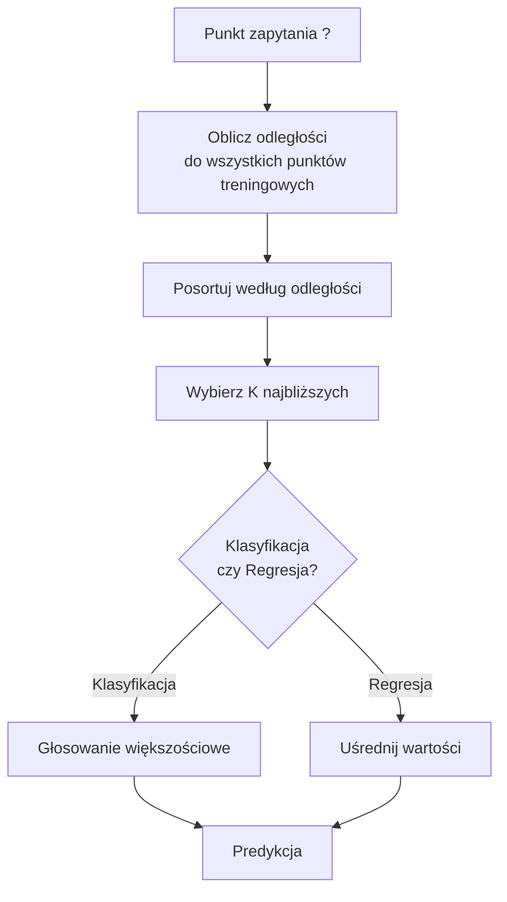
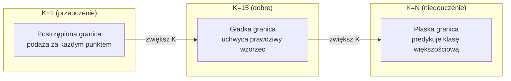
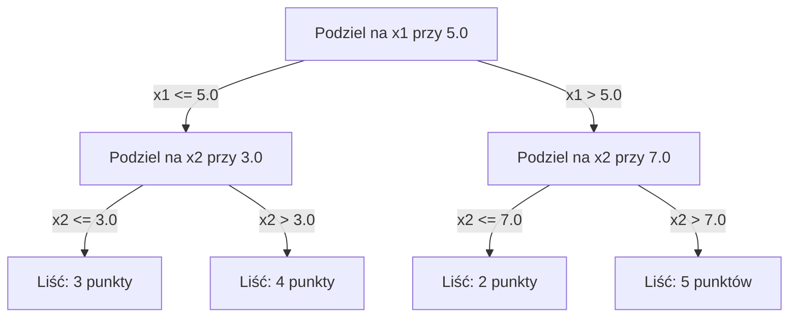

---
# K-Najbliższych Sąsiadów i Odległości

> Przechowuj wszystko. Predykcja poprzez spojrzenie na sąsiadów. Najprostszy algorytm, który faktycznie działa.

**Typ:** Zbuduj
**Język:** Python
**Wymagania wstępne:** Faza 1 (Lekcja 14 Normy i Odległości)
**Czas:** ~90 minut

## Cele uczenia się

- Zaimplementuj klasyfikację i regresję KNN od zera z konfigurowalnym K oraz głosowaniem ważonym odległością
- Porównaj metryki odległości L1, L2, cosinusową i Minkowskiego oraz wybierz odpowiednią dla danego typu danych
- Wyjaśnij przekleństwo wymiarowości i zademonstruj, dlaczego KNN degraduje w przestrzeniach wysokowymiarowych
- Zbuduj KD-drzewo dla efektywnego wyszukiwania najbliższego sąsiada i przeanalizuj, kiedy przewyższa metodę pełnego przeszukiwania

## Problem

Masz zbiór danych. Pojawia się nowy punkt danych. Musisz go sklasyfikować lub przewidzieć jego wartość. Zamiast uczyć się parametrów z danych (jak w regresji liniowej czy SVM), po prostu znajdujesz K punktów treningowych najbliższych nowemu punktowi i pozwalasz im głosować.

To jest K-najbliższych sąsiadów. Nie ma fazy treningowej. Nie ma parametrów do nauczenia. Nie ma funkcji straty do minimalizacji. Przechowujesz cały zbiór treningowy i obliczasz odległości w czasie predykcji.

To brzmi zbyt prosto, żeby działało. Ale KNN jest zaskakująco konkurencyjny dla wielu problemów, zwłaszcza przy małych i średnich zbiorach danych, a głębokie zrozumienie tego algorytmu ujawnia fundamentalne koncepcje: wybór metryki odległości (łączy się z Lekcją 14 Fazy 1), przekleństwo wymiarowości oraz różnicę między leniwym a chciwym uczeniem.

KNN pojawia się również wszędzie w nowoczesnym AI, tylko pod innymi nazwami. Wektorowe bazy danych wykonują wyszukiwanie KNN na reprezentacjach wektorowych. Retrieval-augmented generation (RAG) znajduje K najbliższych fragmentów dokumentów. Systemy rekomendacji znajdują podobnych użytkowników lub elementy. Algorytm jest ten sam. Skala i struktury danych są inne.

## Koncepcja

### Jak działa KNN

Mając zbiór danych z etykietowanymi punktami i nowy punkt zapytania:

1. Oblicz odległość od zapytania do każdego punktu w zbiorze danych
2. Posortuj według odległości
3. Weź K najbliższych punktów
4. Dla klasyfikacji: głosowanie większościowe wśród K sąsiadów
5. Dla regresji: średnia (lub średnia ważona) wartości K sąsiadów



To jest cały algorytm. Bez dopasowywania. Bez gradientu. Bez epok.

### Wybór K

K jest jedynym hiperparametrem. Kontroluje kompromis między obciążeniem a wariancją:

| K | Zachowanie |
|---|------------|
| K = 1 | Granica decyzyjna podąża za każdym punktem. Zerowy błąd treningowy. Wysoka wariancja. Przeuczenie |
| Małe K (3-5) | Wrażliwe na lokalną strukturę. Może uchwycić złożone granice |
| Duże K | Gładsze granice. Bardziej odporne na szum. Może niedouczać |
| K = N | Predykuje klasę większościową dla każdego punktu. Maksymalny bias |

Typowym punktem wyjścia jest K = sqrt(N) dla zbioru danych z N punktów. Używaj nieparzystego K dla klasyfikacji binarnej, aby uniknąć remisów.



### Metryki odległości

Funkcja odległości definiuje, co oznacza "bliski". Różne metryki produkują różnych sąsiadów, różne predykcje.

**L2 (euklidesowa)** jest domyślna. Odległość w linii prostej.

```
d(a, b) = sqrt(sum((a_i - b_i)^2))
```

Wrażliwa na skalę cech. Zawsze standaryzuj cechy przed użyciem L2 z KNN.

**L1 (manhattańska)** sumuje bezwzględne różnice. Bardziej odporna na wartości odstające niż L2, bo nie podnosi różnic do kwadratu.

```
d(a, b) = sum(|a_i - b_i|)
```

**Odległość cosinusowa** mierzy kąt między wektorami, ignorując wielkość. Niezbędna dla tekstu i reprezentacji wektorowych.

```
d(a, b) = 1 - (a . b) / (||a|| * ||b||)
```

**Minkowski** uogólnia L1 i L2 z parametrem p.

```
d(a, b) = (sum(|a_i - b_i|^p))^(1/p)

p=1: Manhattan
p=2: Euklidesowa
p->inf: Czebyszew (maksymalna bezwzględna różnica)
```

Którą metrykę użyć zależy od danych:

| Typ danych | Najlepsza metryka | Dlaczego |
|-----------|-------------------|----------|
| Cechy numeryczne, podobna skala | L2 (euklidesowa) | Domyślna, działa dla danych przestrzennych |
| Cechy numeryczne, wartości odstające | L1 (manhattańska) | Odporna, nie amplifikuje dużych różnic |
| Reprezentacje tekstowe | Cosine | Magnituda to szum, kierunek to znaczenie |
| Wysoko wymiarowe, rzadkie | Cosine lub L1 | L2 cierpi od przekleństwa wymiarowości |
| Mieszane typy | Niestandardowa odległość | Łącz metryki per typ cechy |

### Ważony KNN

Standardowy KNN daje równą wagę wszystkim K sąsiadom. Ale sąsiad w odległości 0.1 powinien mieć większe znaczenie niż ten w odległości 5.0.

**KNN ważony odległością** nadaje wagę każdemu sąsiadowi odwrotnie proporcjonalnie do odległości:

```
weight_i = 1 / (distance_i + epsilon)

Dla klasyfikacji: głosowanie ważone
Dla regresji:     średnia ważona = sum(w_i * y_i) / sum(w_i)
```

Epsilon zapobiega dzieleniu przez zero, gdy punkt zapytania dokładnie pasuje do punktu treningowego.

Ważony KNN jest mniej wrażliwy na wybór K, bo odlegli sąsiedzi wnoszą bardzo mało niezależnie od K.

### Przekleństwo wymiarowości

Wydajność KNN degraduje w wysokich wymiarach. To nie jest mgliste zmartwienie. To jest matematyczny fakt.

**Problem 1: odległości zbiegają.** Wraz ze wzrostem wymiarowości, stosunek maksymalnej odległości do minimalnej odległości zbliża się do 1. Wszystkie punkty stają się równie "dalekie" od zapytania.

```
W d wymiarach, dla losowych jednorodnych punktów:

d=2:    max_dist / min_dist = bardzo różne
d=100:  max_dist / min_dist ~ 1.01
d=1000: max_dist / min_dist ~ 1.001

Gdy wszystkie odległości są prawie równe, "najbliższy" nie ma sensu.
```

**Problem 2: objętość eksploduje.** Aby uchwycić K sąsiadów w ustalonej frakcji danych, musisz rozszerzyć promień wyszukiwania, aby objąć znacznie większą frakcję przestrzeni cech. "Sąsiedztwo" w wysokich wymiarach obejmuje większość przestrzeni.

**Problem 3: narożniki dominują.** W jednostkowym hiperkostce w d wymiarach, większość objętości jest skoncentrowana blisko narożników, nie środka. Sfera wpisana w kostkę zawiera zanikającą frakcję objętości w miarę wzrostu d.

Praktyczna konsekwencja: KNN działa dobrze do około 20-50 cech. Powyżej tego potrzebujesz redukcji wymiarowości (PCA, UMAP, t-SNE) przed zastosowaniem KNN, lub musisz użyć struktur wyszukiwania opartych na drzewach, które wykorzystują wewnętrzną niższą wymiarowość danych.

### KD-drzewa: szybkie wyszukiwanie najbliższego sąsiada

KNN metodą pełnego przeszukiwania oblicza odległość od zapytania do każdego punktu treningowego. To jest O(n * d) na zapytanie. Dla dużych zbiorów danych, to zbyt wolne.

KD-drzewo rekursywnie partitionuje przestrzeń wzdłuż osi cech. Na każdym poziomie dzieli wzdłuż jednego wymiaru przy medianie.



Aby znaleźć najbliższego sąsiada, przechodź drzewo do liścia zawierającego zapytanie, następnie wracaj i sprawdzaj sąsiednie partycje tylko jeśli mogą zawierać bliższe punkty.

Średni czas zapytania: O(log n) dla niskich wymiarów. Ale KD-drzewa degradują do O(n) w wysokich wymiarach (d > 20), bo cofanie eliminuje coraz mniej gałęzi.

### Ball trees: lepsze dla umiarkowanych wymiarów

Ball trees partitionują dane na zagnieżdżone hipersfery zamiast pudełek wyrównanych do osi. Każdy węzeł definiuje kulę (środek + promień), która zawiera wszystkie punkty w tym poddrzewie.

Zalety nad KD-drzewami:
- Działają lepiej w umiarkowanych wymiarach (do ~50)
- Obsługują strukturę niewyrównaną do osi
- Ciaśniejsze objętości ograniczające oznaczają więcej gałęzi jest przycinanych podczas wyszukiwania

Oba KD-drzewa i drzewa kuliste są algorytmami dokładnymi. Dla naprawdę dużej skali wyszukiwania (miliony punktów, setki wymiarów), używane są przybliżone metody najbliższego sąsiada (HNSW, IVF, kwantyzacja iloczynowa). Te są omówione w Lekcji 14 Fazy 1.

### Leniwe uczenie vs chciwe uczenie

KNN jest leniwym uczniem: nie wykonuje pracy w czasie treningu i całą pracę w czasie predykcji. Większość innych algorytmów (regresja liniowa, SVMy, sieci neuronowe) to chciwi uczniowie: wykonują ciężkie obliczenia w czasie treningu, aby zbudować kompaktowy model, potem predykcje są szybkie.

| Aspekt | Leniwy (KNN) | Chciwy (SVM, sieć neuronowa) |
|--------|------------|---------------------------|
| Czas treningu | O(1) tylko przechowuj dane | O(n * epoki) |
| Czas predykcji | O(n * d) na zapytanie | O(d) lub O(parametry) |
| Pamięć przy predykcji | Przechowuj cały zbiór treningowy | Przechowuj tylko parametry modelu |
| Adaptacja do nowych danych | Dodawaj punkty natychmiast | Przeucz model |
| Granica decyzyjna | Niejawna, obliczana w locie | Jawna, ustalona po treningu |

Leniwe uczenie jest idealne gdy:
- Zbiór danych zmienia się często (dodawaj/usuwaj punkty bez przeuczania)
- Potrzebujesz predykcji dla bardzo małej liczby zapytań
- Chcesz zerowy czas treningu
- Zbiór danych jest na tyle mały, że wyszukiwanie metodą pełnego przeszukiwania jest szybkie

### KNN dla regresji

Zamiast głosowania większościowego, KNN dla regresji uśrednia wartości docelowe K sąsiadów.

```
prediction = (1/K) * sum(y_i for i in K nearest neighbors)

Lub z wagowaniem odległości:
prediction = sum(w_i * y_i) / sum(w_i)
where w_i = 1 / distance_i
```

KNN regresja produkuje predykcje stałe odcinkowo (lub gładkie odcinkowo z wagowaniem). Nie może extrapolować poza zakres danych treningowych. Jeśli cele treningowe są wszystkie między 0 a 100, KNN nigdy nie predykuje 200.

## Zbuduj to

### Krok 1: Funkcje odległości

Zaimplementuj L1, L2, cosinusową i Minkowskiego. Te łączą się bezpośrednio z Lekcją 14 Fazy 1.

```python
import math

def l2_distance(a, b):
    return math.sqrt(sum((ai - bi) ** 2 for ai, bi in zip(a, b)))

def l1_distance(a, b):
    return sum(abs(ai - bi) for ai, bi in zip(a, b))

def cosine_distance(a, b):
    dot_val = sum(ai * bi for ai, bi in zip(a, b))
    norm_a = math.sqrt(sum(ai ** 2 for ai in a))
    norm_b = math.sqrt(sum(bi ** 2 for bi in b))
    if norm_a == 0 or norm_b == 0:
        return 1.0
    return 1.0 - dot_val / (norm_a * norm_b)

def minkowski_distance(a, b, p=2):
    if p == float('inf'):
        return max(abs(ai - bi) for ai, bi in zip(a, b))
    return sum(abs(ai - bi) ** p for ai, bi in zip(a, b)) ** (1 / p)
```

### Krok 2: Klasyfikator i regresor KNN

Zbuduj pełny KNN z konfigurowalnym K, metryką odległości i opcjonalnym wagowaniem odległości.

```python
class KNN:
    def __init__(self, k=5, distance_fn=l2_distance, weighted=False,
                 task="classification"):
        self.k = k
        self.distance_fn = distance_fn
        self.weighted = weighted
        self.task = task
        self.X_train = None
        self.y_train = None

    def fit(self, X, y):
        self.X_train = X
        self.y_train = y

    def predict(self, X):
        return [self._predict_one(x) for x in X]
```

### Krok 3: KD-drzewo dla efektywnego wyszukiwania

Zbuduj KD-drzewo od zera, które rekursywnie dzieli na medianie każdego wymiaru.

```python
class KDTree:
    def __init__(self, X, indices=None, depth=0):
        # Rekursywnie dziel dane
        self.axis = depth % len(X[0])
        # Podziel na medianie bieżącej osi
        ...

    def query(self, point, k=1):
        # Przejdź do liścia, potem wracaj
        ...
```

Zobacz `code/knn.py` dla pełnej implementacji ze wszystkimi metodami pomocniczymi i demo.

### Krok 4: Skalowanie cech

KNN wymaga skalowania cech, bo odległości są wrażliwe na magnitudy cech. Cecha mieszcząca się w zakresie 0 do 1000 zdominuje cechę mieszczącą się w zakresie 0 do 1.

```python
def standardize(X):
    n = len(X)
    d = len(X[0])
    means = [sum(X[i][j] for i in range(n)) / n for j in range(d)]
    stds = [
        max(1e-10, (sum((X[i][j] - means[j]) ** 2 for i in range(n)) / n) ** 0.5)
        for j in range(d)
    ]
    return [[((X[i][j] - means[j]) / stds[j]) for j in range(d)] for i in range(n)], means, stds
```

## Użyj tego

Z scikit-learn:

```python
from sklearn.neighbors import KNeighborsClassifier
from sklearn.preprocessing import StandardScaler
from sklearn.pipeline import Pipeline

clf = Pipeline([
    ("scaler", StandardScaler()),
    ("knn", KNeighborsClassifier(n_neighbors=5, metric="euclidean")),
])
clf.fit(X_train, y_train)
print(f"Accuracy: {clf.score(X_test, y_test):.4f}")
```

Scikit-learn automatycznie używa KD-drzew lub ball trees, gdy dataset jest wystarczająco duży, a wymiarowość wystarczająco niska. Dla danych wysokowymiarowych wraca do metody pełnego przeszukiwania. Możesz kontrolować to parametrem `algorithm`.

Dla wysokiej skali wyszukiwania najbliższego sąsiada (miliony wektorów), użyj FAISS, Annoy lub wektorowej bazy danych:

```python
import faiss

index = faiss.IndexFlatL2(dimension)
index.add(embeddings)
distances, indices = index.search(query_vectors, k=5)
```

## Ćwiczenia

1. Zaimplementuj klasyfikację KNN na 2D dataset z 3 klasami. Narysuj granicę decyzyjną dla K=1, K=5, K=15 i K=N. Obserwuj przejście od przeuczenia do niedouczenia.

2. Wygeneruj 1000 losowych punktów w 2, 5, 10, 50, 100 i 500 wymiarach. Dla każdej wymiarowości oblicz stosunek maksymalnej parowej odległości do minimalnej parowej odległości. Narysuj wykres stosunku vs wymiarowość, aby zwizualizować przekleństwo wymiarowości.

3. Porównaj L1, L2 i cosinusową odległość dla KNN na problemie klasyfikacji tekstu (użyj wektorów TF-IDF). Która metryka daje najlepszą accuracy? Dlaczego cosine zwykle wygrywa dla tekstu?

4. Zaimplementuj KD-drzewo i zmierz czas zapytania vs metoda pełnego przeszukiwania dla zbiorów danych 1k, 10k i 100k punktów w 2D, 10D i 50D. Przy jakiej wymiarowości KD-drzewo przestaje być szybsze od metody pełnego przeszukiwania?

5. Zbuduj ważony regresor KNN dla y = sin(x) + noise. Porównaj go z nieważonym KNN dla K=3, 10, 30. Pokaż, że wagowanie produkuje gładsze predykcje, zwłaszcza dla dużego K.

## Kluczowe pojęcia

| Termin | Co to faktycznie oznacza |
|--------|----------------------|
| K-nearest neighbors | Algorytm nieparametryczny, który predysuje przez znalezienie K najbliższych punktów treningowych do zapytania |
| Lazy learning | Brak obliczeń w czasie treningu. Cała praca dzieje się w czasie predykcji. KNN to kanoniczny przykład |
| Eager learning | Ciężkie obliczenia w czasie treningu, aby zbudować kompaktowy model. Większość algorytmów ML to eager |
| Curse of dimensionality | W wysokich wymiarach odległości zbiegają, a sąsiedztwa rozszerzają się, aby objąć większość przestrzeni, czyniąc KNN nieskutecznym |
| KD-tree | Drzewo binarne, które rekursywnie dzieli przestrzeń wzdłuż osi cech. O(log n) zapytań w niskich wymiarach |
| Ball tree | Drzewo zagnieżdżonych hipersfer. Działa lepiej niż KD-drzewa w umiarkowanych wymiarach (do ~50) |
| Weighted KNN | Sąsiedzie ważeni odwrotnie do odległości. Bliżsi sąsiedzi mają większy wpływ na predykcję |
| Skalowanie cech | Normalizacja cech do porównywalnych zakresów. Wymagane dla metod opartych na odległości jak KNN |
| Majority vote | Klasyfikacja przez zliczenie, która klasa jest najczęstsza wśród K sąsiadów |
| Metoda pełnego przeszukiwania | Obliczanie odległości do każdego punktu treningowego. O(n*d) na zapytanie. Dokładne, ale wolne dla dużego n |
| Approximate nearest neighbor | Algorytmy (HNSW, LSH, IVF), które znajdują przybliżone najbliższe punkty znacznie szybciej niż dokładne wyszukiwanie |
| Voronoi diagram | Podział przestrzeni, gdzie każdy region zawiera wszystkie punkty bliższe jednemu punktowi treningowemu niż jakemukolwiek innemu. K=1 KNN produkuje granice Voronoi |

## Dalsze czytanie

- [Cover & Hart: Nearest Neighbor Pattern Classification (1967)](https://ieeexplore.ieee.org/document/1053964) - fundamentalny artykuł o KNN dowodzący, że ma stopę błędu co najwyżej dwukrotnie większą od optymalnego Bayesa
- [Friedman, Bentley, Finkel: An Algorithm for Finding Best Matches in Logarithmic Expected Time (1977)](https://dl.acm.org/doi/10.1145/355744.355745) - oryginalny artykuł o KD-drzewie
- [Beyer et al.: When Is "Nearest Neighbor" Meaningful? (1999)](https://link.springer.com/chapter/10.1007/3-540-49257-7_15) - formalna analiza przekleństwa wymiarowości dla najbliższego sąsiada
- [scikit-learn Nearest Neighbors documentation](https://scikit-learn.org/stable/modules/neighbors.html) - praktyczny przewodnik z wyborem algorytmu
- [FAISS: A Library for Efficient Similarity Search](https://github.com/facebookresearch/faiss) - biblioteka Meta do wyszukiwania najbliższego sąsiada w skali miliardów

---