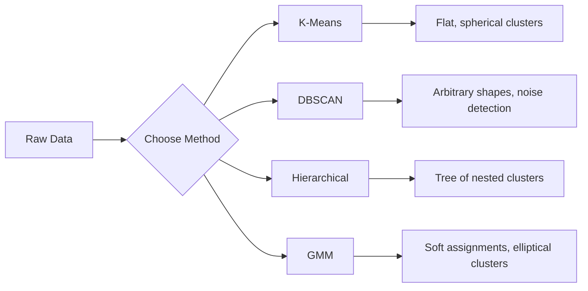

# Uczenie bez nadzoru

>Bez etykiet, bez nauczyciela. Algorytm znajduje strukturę samodzielnie.

**Typ:** Zbuduj
**Języki:** Python
**Wymagania wstępne:** Phase 1 (Normy i odległości, Prawdopodobieństwo i rozkłady), Phase 2 Lekcje 1-6
**Czas:** ~90 minut

## Cele uczenia się

- Zaimplementuj K-Means, DBSCAN i Gaussian Mixture Models od zera i porównaj ich zachowanie clusteringowe
- Oceń jakość klastrów za pomocą silhouette score i metody łokcia, aby wybrać optymalne K
- Wyjaśnij, kiedy DBSCAN przewyższa K-Means i określ, który algorytm radzi sobie z klastrami o kształtach innych niż sferyczne oraz z outlierami
- Zbuduj pipeline wykrywania anomalii z użyciem metod clusteringowych do flagowania punktów odbiegających od normalnych wzorców

## Problem

Każda lekcja ML do tej pory zakładała dane z etykietami: "oto wejście, oto poprawny wynik". W prawdziwym świecie etykiety są drogie. Szpital ma miliony rekordów pacjentów, ale nikt ręcznie nie oznaczył każdego z nich kategorią choroby. Sklep e-commerce ma miliony sesji użytkowników, ale nikt nie oznaczył ręcznie segmentów klientów. Zespół bezpieczeństwa ma logi sieciowe, ale nikt nie zflagował każdej anomalii.

Uczenie bez nadzoru znajduje wzorce bez bycia poinstruowanym, czego szukać. Grupuje podobne punkty danych, odkrywa ukryte struktury i wyławia anomalie. Jeśli uczenie z nadzorem to nauka z podręcznika z kluczem odpowiedzi, uczenie bez nadzoru to wpatrywanie się w surowe dane, aż wzorce się ujawnią.

Zastrzeżenie: bez etykiet nie można bezpośrednio mierzyć "poprawnego" lub "błędnego". Potrzebujesz innych narzędzi, aby ocenić, czy struktura znaleziona przez algorytm jest znacząca.

## Koncepcja

### Clustering: grupowanie podobnych rzeczy razem

Clustering przypisuje każdy punkt danych do grupy (klastra), tak aby punkty w tej samej grupie były bardziej podobne do siebie niż do punktów w innych grupach. Pytanie zawsze brzmi: co oznacza "podobny"?



### K-Means: Koń roboczy

K-Means dzieli dane na dokładnie K klastrów. Każdy klaster ma centroid (swój środek masy), a każdy punkt należy do najbliższego centroidu.

Algorytm Lloyd'a:

1. Wybierz K losowych punktów jako początkowe centroidy
2. Przypisz każdy punkt danych do najbliższego centroidu
3. Przelicz każdy centroid jako średnią swoich przypisanych punktów
4. Powtarzaj kroki 2-3, aż przypisania przestaną się zmieniać

Funkcja celu (inertia) mierzy sumę kwadratów odległości od każdego punktu do jego przypisanego centroidu. K-Means minimalizuje to, ale znajduje tylko minimum lokalne. Różne inicjalizacje mogą dawać różne wyniki.

### Wybieranie K

Dwie standardowe metody:

**Metoda łokcia:** Uruchom K-Means dla K = 1, 2, 3, ..., n. Narysuj wykres inertia vs K. Szukaj "łokcia", gdzie dodanie większej liczby klastrów przestaje znacząco redukować inertię.

**Silhouette score:** Dla każdego punktu zmierz, jak podobny jest do swojego klastra (a) versus najbliższego innego klastra (b). Współczynnik silhouette to (b - a) / max(a, b), w zakresie od -1 (zły klaster) do +1 (dobrze pogrupowany). Uśrednij dla wszystkich punktów, aby uzyskać globalny wynik.

### DBSCAN: Clustering oparty na gęstości

K-Means zakłada, że klastry są sferyczne i wymaga wybrania K z góry. DBSCAN nie robi żadnego z tych założeń. Znajduje klastry jako gęste regiony oddzielone przez rzadkie regiony.

Dwa parametry:
- **eps**: promień sąsiedztwa
- **min_samples**: minimalna liczba punktów potrzebna do utworzenia gęstego regionu

Trzy typy punktów:
- **Core point**: ma co najmniej min_samples punktów w odległości eps
- **Border point**: w odległości eps od core point, ale sam nie jest core point
- **Noise point**: ani core, ani border. To outliery.

DBSCAN łączy core points, które są w odległości eps od siebie, w ten sam klaster. Border points dołączają do klastra pobliskiego core point. Noise points nie należą do żadnego klastra.

Zalety: znajduje klastry dowolnego kształtu, automatycznie określa liczbę klastrów, identyfikuje outliery. Słabość: ma problemy z klastrami o różnych gęstościach.

### Hierarchical Clustering

Buduje drzewo (dendrogram) zagnieżdżonych klastrów.

Agglomeracyjny (bottom-up):
1. Zacznij z każdym punktem jako własnym klastrem
2. Połącz dwa najbliższe klastry
3. Powtarzaj, aż zostanie tylko jeden klaster
4. Przetnij dendrogram na pożądanym poziomie, aby uzyskać K klastrów

"Bliskość" między klastrami może być mierzona jako:
- **Single linkage**: minimalna odległość między dowolnymi dwoma punktami w dwóch klastrach
- **Complete linkage**: maksymalna odległość między dowolnymi dwoma punktami
- **Average linkage**: średnia odległość między wszystkimi parami
- **Ward's method**: połączenie powodujące najmniejszy wzrost całkowitej wariancji wewnątrz klastra

### Gaussian Mixture Models (GMM)

K-Means daje twarde przypisania: każdy punkt należy dokładnie do jednego klastra. GMM daje miękkie przypisania: każdy punkt ma prawdopodobieństwo przynależności do każdego klastra.

GMM zakłada, że dane są generowane z mieszaniny K rozkładów Gaussa, z których każdy ma własną średnią i kowariancję. Algorytm Expectation-Maximization (EM) naprzemiennie:

- **E-step**: oblicz prawdopodobieństwo przynależności każdego punktu do każdego Gaussa
- **M-step**: zaktualizuj średnią, kowariancję i wagę mieszanki każdego Gaussa, aby zmaksymalizować wiarygodność danych

GMM może modelować eliptyczne klastry (nie tylko sferyczne jak K-Means) i naturalnie radzi sobie z nakładającymi się klastrami.

### Kiedy używać czego

| Metoda | Najlepsza dla | Unikaj gdy |
|--------|--------------|------------|
| K-Means | Duże zbiory danych, sferyczne klastry, znane K | Nieregularne kształty, obecne outliery |
| DBSCAN | Nieznane K, dowolne kształty, wykrywanie outlierów | Różne gęstości, bardzo wysokie wymiary |
| Hierarchical | Małe zbiory danych, potrzebny dendrogram, nieznane K | Duże zbiory danych (pamięć O(n^2)) |
| GMM | Nakładające się klastry, potrzebne miękkie przypisania | Bardzo duże zbiory danych, zbyt wiele wymiarów |

### Wykrywanie anomalii z clusteringiem

Clustering naturalnie wspiera wykrywanie anomalii:
- **K-Means**: punkty daleko od jakiegokolwiek centroidu to anomalie
- **DBSCAN**: punkty szumu to anomalie z definicji
- **GMM**: punkty z niskim prawdopodobieństwem pod wszystkimi Gaussami to anomalie

## Zbuduj to

### Krok 1: K-Means od zera

```python
import math
import random


def euclidean_distance(a, b):
    return math.sqrt(sum((ai - bi) ** 2 for ai, bi in zip(a, b)))


def kmeans(data, k, max_iterations=100, seed=42):
    random.seed(seed)
    n_features = len(data[0])

    centroids = random.sample(data, k)

    for iteration in range(max_iterations):
        clusters = [[] for _ in range(k)]
        assignments = []

        for point in data:
            distances = [euclidean_distance(point, c) for c in centroids]
            nearest = distances.index(min(distances))
            clusters[nearest].append(point)
            assignments.append(nearest)

        new_centroids = []
        for cluster in clusters:
            if len(cluster) == 0:
                new_centroids.append(random.choice(data))
                continue
            centroid = [
                sum(point[j] for point in cluster) / len(cluster)
                for j in range(n_features)
            ]
            new_centroids.append(centroid)

        if all(
            euclidean_distance(old, new) < 1e-6
            for old, new in zip(centroids, new_centroids)
        ):
            print(f"  Converged at iteration {iteration + 1}")
            break

        centroids = new_centroids

    return assignments, centroids
```

### Krok 2: Metoda łokcia i silhouette score

```python
def compute_inertia(data, assignments, centroids):
    total = 0.0
    for point, cluster_id in zip(data, assignments):
        total += euclidean_distance(point, centroids[cluster_id]) ** 2
    return total


def silhouette_score(data, assignments):
    n = len(data)
    if n < 2:
        return 0.0

    clusters = {}
    for i, c in enumerate(assignments):
        clusters.setdefault(c, []).append(i)

    if len(clusters) < 2:
        return 0.0

    scores = []
    for i in range(n):
        own_cluster = assignments[i]
        own_members = [j for j in clusters[own_cluster] if j != i]

        if len(own_members) == 0:
            scores.append(0.0)
            continue

        a = sum(euclidean_distance(data[i], data[j]) for j in own_members) / len(own_members)

        b = float("inf")
        for cluster_id, members in clusters.items():
            if cluster_id == own_cluster:
                continue
            avg_dist = sum(euclidean_distance(data[i], data[j]) for j in members) / len(members)
            b = min(b, avg_dist)

        if max(a, b) == 0:
            scores.append(0.0)
        else:
            scores.append((b - a) / max(a, b))

    return sum(scores) / len(scores)


def find_best_k(data, max_k=10):
    print("Elbow method:")
    inertias = []
    for k in range(1, max_k + 1):
        assignments, centroids = kmeans(data, k)
        inertia = compute_inertia(data, assignments, centroids)
        inertias.append(inertia)
        print(f"  K={k}: inertia={inertia:.2f}")

    print("\nSilhouette scores:")
    for k in range(2, max_k + 1):
        assignments, centroids = kmeans(data, k)
        score = silhouette_score(data, assignments)
        print(f"  K={k}: silhouette={score:.4f}")

    return inertias
```

### Krok 3: DBSCAN od zera

```python
def dbscan(data, eps, min_samples):
    n = len(data)
    labels = [-1] * n
    cluster_id = 0

    def region_query(point_idx):
        neighbors = []
        for i in range(n):
            if euclidean_distance(data[point_idx], data[i]) <= eps:
                neighbors.append(i)
        return neighbors

    visited = [False] * n

    for i in range(n):
        if visited[i]:
            continue
        visited[i] = True

        neighbors = region_query(i)

        if len(neighbors) < min_samples:
            labels[i] = -1
            continue

        labels[i] = cluster_id
        seed_set = list(neighbors)
        seed_set.remove(i)

        j = 0
        while j < len(seed_set):
            q = seed_set[j]

            if not visited[q]:
                visited[q] = True
                q_neighbors = region_query(q)
                if len(q_neighbors) >= min_samples:
                    for nb in q_neighbors:
                        if nb not in seed_set:
                            seed_set.append(nb)

            if labels[q] == -1:
                labels[q] = cluster_id

            j += 1

        cluster_id += 1

    return labels
```

### Krok 4: Gaussian Mixture Model (algorytm EM)

```python
def gmm(data, k, max_iterations=100, seed=42):
    random.seed(seed)
    n = len(data)
    d = len(data[0])

    indices = random.sample(range(n), k)
    means = [list(data[i]) for i in indices]
    variances = [1.0] * k
    weights = [1.0 / k] * k

    def gaussian_pdf(x, mean, variance):
        d = len(x)
        coeff = 1.0 / ((2 * math.pi * variance) ** (d / 2))
        exponent = -sum((xi - mi) ** 2 for xi, mi in zip(x, mean)) / (2 * variance)
        return coeff * math.exp(max(exponent, -500))

    for iteration in range(max_iterations):
        responsibilities = []
        for i in range(n):
            probs = []
            for j in range(k):
                probs.append(weights[j] * gaussian_pdf(data[i], means[j], variances[j]))
            total = sum(probs)
            if total == 0:
                total = 1e-300
            responsibilities.append([p / total for p in probs])

        old_means = [list(m) for m in means]

        for j in range(k):
            r_sum = sum(responsibilities[i][j] for i in range(n))
            if r_sum < 1e-10:
                continue

            weights[j] = r_sum / n

            for dim in range(d):
                means[j][dim] = sum(
                    responsibilities[i][j] * data[i][dim] for i in range(n)
                ) / r_sum

            variances[j] = sum(
                responsibilities[i][j]
                * sum((data[i][dim] - means[j][dim]) ** 2 for dim in range(d))
                for i in range(n)
            ) / (r_sum * d)
            variances[j] = max(variances[j], 1e-6)

        shift = sum(
            euclidean_distance(old_means[j], means[j]) for j in range(k)
        )
        if shift < 1e-6:
            print(f"  GMM converged at iteration {iteration + 1}")
            break

    assignments = []
    for i in range(n):
        assignments.append(responsibilities[i].index(max(responsibilities[i])))

    return assignments, means, weights, responsibilities
```

### Krok 5: Generuj dane testowe i uruchom wszystko

```python
def make_blobs(centers, n_per_cluster=50, spread=0.5, seed=42):
    random.seed(seed)
    data = []
    true_labels = []
    for label, (cx, cy) in enumerate(centers):
        for _ in range(n_per_cluster):
            x = cx + random.gauss(0, spread)
            y = cy + random.gauss(0, spread)
            data.append([x, y])
            true_labels.append(label)
    return data, true_labels


def make_moons(n_samples=200, noise=0.1, seed=42):
    random.seed(seed)
    data = []
    labels = []
    n_half = n_samples // 2
    for i in range(n_half):
        angle = math.pi * i / n_half
        x = math.cos(angle) + random.gauss(0, noise)
        y = math.sin(angle) + random.gauss(0, noise)
        data.append([x, y])
        labels.append(0)
    for i in range(n_half):
        angle = math.pi * i / n_half
        x = 1 - math.cos(angle) + random.gauss(0, noise)
        y = 1 - math.sin(angle) - 0.5 + random.gauss(0, noise)
        data.append([x, y])
        labels.append(1)
    return data, labels


if __name__ == "__main__":
    centers = [[2, 2], [8, 3], [5, 8]]
    data, true_labels = make_blobs(centers, n_per_cluster=50, spread=0.8)

    print("=== K-Means on 3 blobs ===")
    assignments, centroids = kmeans(data, k=3)
    print(f"  Centroids: {[[round(c, 2) for c in cent] for cent in centroids]}")
    sil = silhouette_score(data, assignments)
    print(f"  Silhouette score: {sil:.4f}")

    print("\n=== Elbow Method ===")
    find_best_k(data, max_k=6)

    print("\n=== DBSCAN on 3 blobs ===")
    db_labels = dbscan(data, eps=1.5, min_samples=5)
    n_clusters = len(set(db_labels) - {-1})
    n_noise = db_labels.count(-1)
    print(f"  Found {n_clusters} clusters, {n_noise} noise points")

    print("\n=== GMM on 3 blobs ===")
    gmm_assignments, gmm_means, gmm_weights, _ = gmm(data, k=3)
    print(f"  Means: {[[round(m, 2) for m in mean] for mean in gmm_means]}")
    print(f"  Weights: {[round(w, 3) for w in gmm_weights]}")
    gmm_sil = silhouette_score(data, gmm_assignments)
    print(f"  Silhouette score: {gmm_sil:.4f}")

    print("\n=== DBSCAN on moons (non-spherical clusters) ===")
    moon_data, moon_labels = make_moons(n_samples=200, noise=0.1)
    moon_db = dbscan(moon_data, eps=0.3, min_samples=5)
    n_moon_clusters = len(set(moon_db) - {-1})
    n_moon_noise = moon_db.count(-1)
    print(f"  Found {n_moon_clusters} clusters, {n_moon_noise} noise points")

    print("\n=== K-Means on moons (will fail to separate) ===")
    moon_km, moon_centroids = kmeans(moon_data, k=2)
    moon_sil = silhouette_score(moon_data, moon_km)
    print(f"  Silhouette score: {moon_sil:.4f}")
    print("  K-Means splits moons poorly because they are not spherical")

    print("\n=== Anomaly detection with DBSCAN ===")
    anomaly_data = list(data)
    anomaly_data.append([20.0, 20.0])
    anomaly_data.append([-5.0, -5.0])
    anomaly_data.append([15.0, 0.0])
    anomaly_labels = dbscan(anomaly_data, eps=1.5, min_samples=5)
    anomalies = [
        anomaly_data[i]
        for i in range(len(anomaly_labels))
        if anomaly_labels[i] == -1
    ]
    print(f"  Detected {len(anomalies)} anomalies")
    for a in anomalies[-3:]:
        print(f"    Point {[round(v, 2) for v in a]}")
```

## Użyj tego

Z scikit-learn te same algorytmy to jednolinijkowce:

```python
from sklearn.cluster import KMeans, DBSCAN, AgglomerativeClustering
from sklearn.mixture import GaussianMixture
from sklearn.metrics import silhouette_score as sklearn_silhouette

km = KMeans(n_clusters=3, random_state=42).fit(data)
db = DBSCAN(eps=1.5, min_samples=5).fit(data)
agg = AgglomerativeClustering(n_clusters=3).fit(data)
gmm_model = GaussianMixture(n_components=3, random_state=42).fit(data)
```

Wersje od zera pokazują dokładnie, co te biblioteki obliczają. K-Means iteruje między przypisywaniem a przeliczaniem. DBSCAN rozszerza klastry z gęstych zalążków. GMM naprzemiennie między expectation a maximization. Wersje biblioteczne dodają stabilność numeryczną, mądrzejszą inicjalizację (K-Means++), i akcelerację GPU, ale podstawowa logika jest taka sama.

## Wyślij to

Ta lekcja produkuje działające implementacje K-Means, DBSCAN i GMM od zera. Kod clusteringowy może być użyty jako fundament dla bardziej zaawansowanych metod bez nadzoru.

## Ćwiczenia

1. Zaimplementuj inicjalizację K-Means++: zamiast wybierać losowe centroidy, wybierz pierwszy losowo, a każdy kolejny centroid z prawdopodobieństwem proporcjonalnym do kwadratu jego odległości od najbliższego istniejącego centroidu. Porównaj szybkość zbieżności z inicjalizacją losową.
2. Dodaj hierarchiczny clustering agglomeracyjny do kodu. Zaimplementuj Ward's linkage i wygeneruj dendrogram (jako zagnieżdżona lista połączeń). Przetnij go na różnych poziomach i porównaj z wynikami K-Means.
3. Zbuduj prosty pipeline wykrywania anomalii: uruchom DBSCAN i GMM na tych samych danych, flaguj punkty, co do których obie metody zgadzają się, że są outlierami (szum w DBSCAN, niskie prawdopodobieństwo w GMM). Zmierz overlap i omów, kiedy metody się nie zgadzają.

## Kluczowe pojęcia

| Pojęcie | Co ludzie mówią | Co to faktycznie oznacza |
|--------|----------------|----------------------|
| Clustering | "Grupowanie podobnych rzeczy" | Dzielenie danych na podzbiory, gdzie podobieństwo wewnątrzgrupowe przewyższa międzygrupowe, mierzone określoną metryką odległości |
| Centroid | "Środek klastra" | Średnia wszystkich punktów przypisanych do klastra; używana przez K-Means jako reprezentant klastra |
| Inertia | "Jak ciaste są klastry" | Suma kwadratów odległości od każdego punktu do jego przypisanego centroidu; niższa oznacza ciaśniejsze klastry |
| Silhouette score | "Jak dobrze rozdzielone są klastry" | Dla każdego punktu, (b - a) / max(a, b), gdzie a to średnia odległość wewnątrz klastra, a b to średnia odległość do najbliższego klastra |
| Core point | "Punkt w gęstym regionie" | Punkt mający co najmniej min_samples sąsiadów w odległości eps, w DBSCAN |
| EM algorithm | "Miękki K-Means" | Expectation-Maximization: iteracyjnie obliczaj prawdopodobieństwa przynależności (E-step) i aktualizuj parametry rozkładu (M-step) |
| Dendrogram | "Drzewo klastrów" | Diagram drzewa pokazujący kolejność i odległość, przy których klastry zostały połączone w hierarchicznym clusteringu |
| Anomalia | "Outlier" | Punkt danych, który nie jest zgodny z oczekiwanym wzorcem, identyfikowany jako szum przez DBSCAN lub niskie prawdopodobieństwo przez GMM |

## Dalsze czytanie

- [Stanford CS229 - Uczenie bez nadzoru](https://cs229.stanford.edu/notes2022fall/main_notes.pdf) - notatki z wykładów Andrew Ng o clusteringu i EM
- [Przewodnik po clusteringu scikit-learn](https://scikit-learn.org/stable/modules/clustering.html) - praktyczne porównanie wszystkich algorytmów clusteringu z wizualnymi przykładami
- [Oryginalny artykuł o DBSCAN (Ester i in., 1996)](https://www.aaai.org/Papers/KDD/1996/KDD96-037.pdf) - artykuł, który wprowadził clustering oparty na gęstości