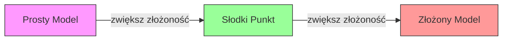
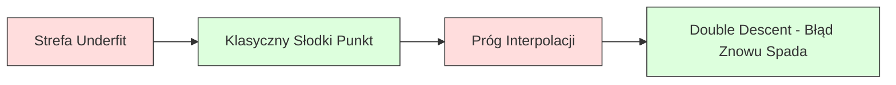
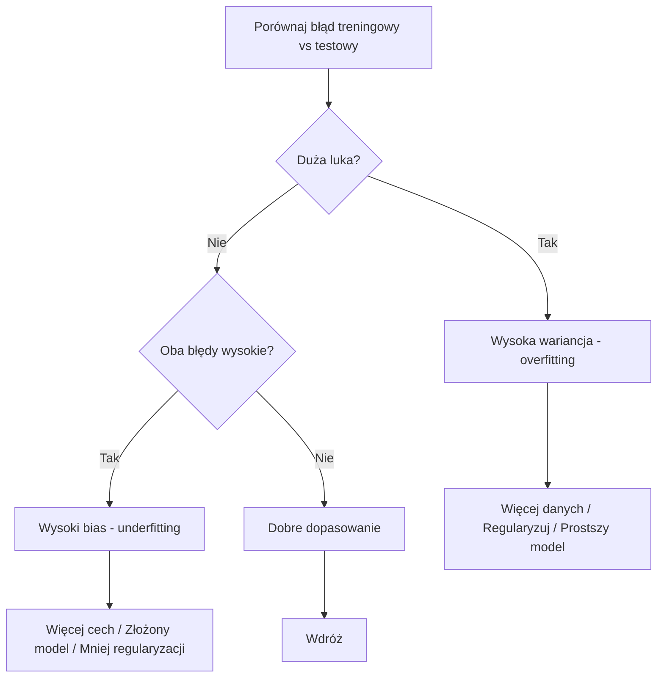
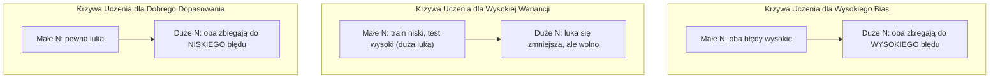
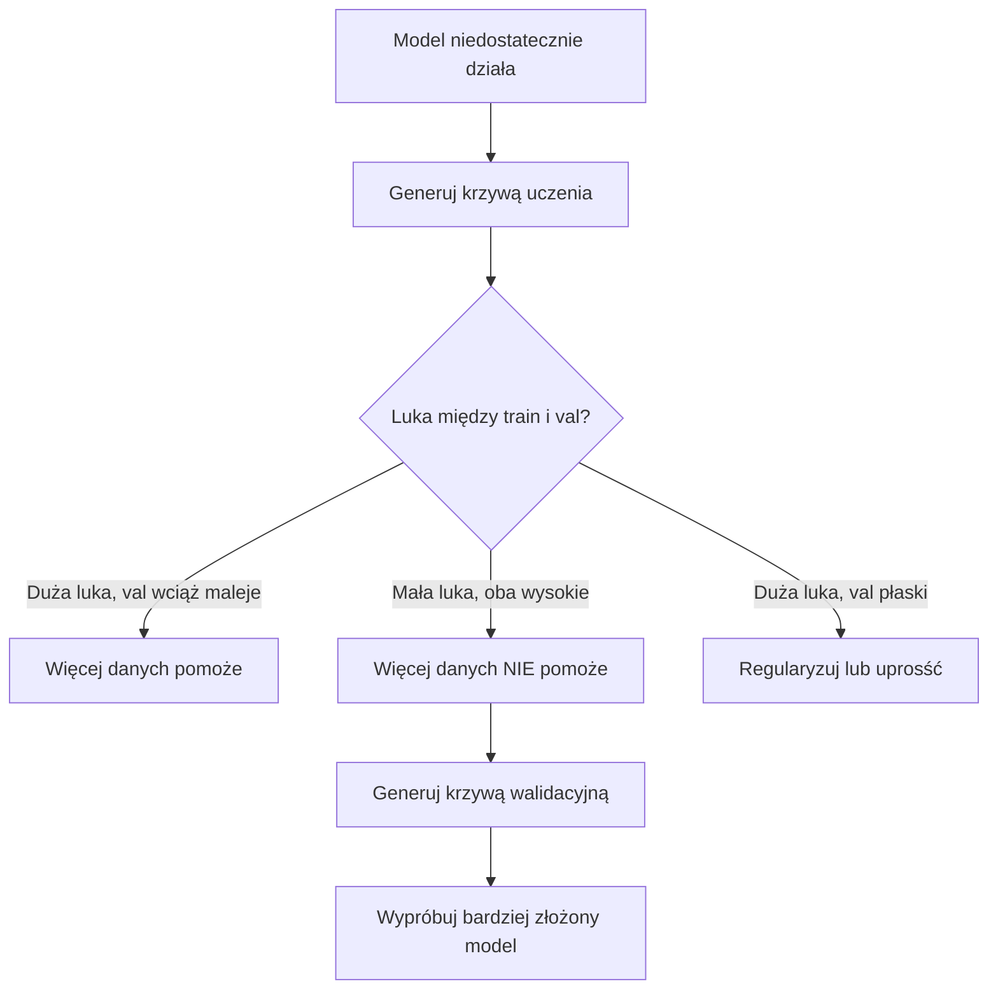

---
# Bias-Variance Tradeoff

> Każdy błąd modelu pochodzi od jednego z trzech źródeł: bias, variance lub szumu. Możesz kontrolować tylko pierwsze dwa.

**Type:** Nauka
**Language:** Python
**Prerequisites:** Faza 2, Lekcje 01-09 (podstawy ML, regresja, klasyfikacja, ewaluacja)
**Time:** ~75 minut

## Cele uczenia się

- Wyprowadzić rozkład bias-variance oczekiwanego błędu predykcji i wyjaśnić rolę szumu iredukowalnego
- Zdiagnozować, czy model cierpi na wysoki bias czy wysoką wariancję, używając wzorców błędu treningowego i testowego
- Wyjaśnić, jak techniki regularyzacji (L1, L2, dropout, early stopping) wymieniają bias na wariancję
- Zaimplementować eksperymenty wizualizujące tradeoff bias-variance dla modeli o rosnącej złożoności

## Problem

Wytrenowałeś model. Ma pewien błąd na danych testowych. Skąd ten błąd się bierze?

Jeśli twój model jest zbyt prosty (regresja liniowa na zakrzywionym zbiorze danych), konsekwentnie będzie tracić prawdziwy wzorzec. To bias. Jeśli twój model jest zbyt złożony (wielomian stopnia 20 na 15 punktach danych), idealnie dopasuje dane treningowe, ale daje radykalnie różne predykcje na nowych danych. To wariancja.

Nie możesz zminimalizować obu jednocześnie przy ustalonej pojemności modelu. Zmniejszysz bias, wariancja rośnie. Zmniejszysz wariancję, bias rośnie. Zrozumienie tego tradeoff jest najbardziej użyteczną umiejętnością diagnostyczną w machine learning. Mówi ci, czy uczynić model bardziej złożonym, czy mniej, czy zdobyć więcej danych, czy lepiej zaprojektować cechy, czy regularyzować bardziej, czy mniej.

## Koncepcja

### Bias: Błąd Systematyczny

Bias mierzy, jak daleko średnia predykcja twojego modelu jest od prawdziwej wartości. Gdybyś trenował ten sam model na wielu różnych zestawach treningowych z tej samej dystrybucji i uśrednił predykcje, bias to luka między tą średnią a prawdą.

Wysoki bias oznacza, że model jest zbyt sztywny, by uchwycić prawdziwy wzorzec. Prosta linia dopasowana do paraboli zawsze ominie krzywiznę, niezależnie od ilości danych. To underfitting.

```
Wysoki bias (underfitting):
  Model zawsze prognozuje mniej więcej tę samą złą wartość.
  Błąd treningowy: WYSOKI
  Błąd testowy: WYSOKI
  Luka między nimi: MAŁA
```

### Wariancja: Wrażliwość na Dane Treningowe

Wariancja mierzy, jak bardzo zmieniają się twoje predykcje, gdy trenujesz na różnych podzbiorach danych. Jeśli małe zmiany w zestawie treningowym powodują duże zmiany w modelu, wariancja jest wysoka.

Wysoka wariancja oznacza, że model dopasowuje szum w danych treningowych, a nie sygnał podstawowy. Wielomian stopnia 20 przeciągnie przez każdy punkt treningowy, ale będzie oscylować dziko między nimi, co prowadzi do overfittingu.

```
Wysoka wariancja (overfitting):
  Model idealnie dopasowuje dane treningowe, ale zawodzi na nowych.
  Błąd treningowy: NISKI
  Błąd testowy: WYSOKI
  Luka między nimi: DUŻA
```

### Rozkład

Dla dowolnego punktu x, oczekiwany błąd predykcji przy kwadratowej funkcji straty rozkłada się dokładnie:

```
Oczekiwany Błąd = Bias^2 + Wariancja + Szum Iredukowalny

gdzie:
  Bias^2   = (E[f_hat(x)] - f(x))^2
  Wariancja = E[(f_hat(x) - E[f_hat(x)])^2]
  Szum    = E[(y - f(x))^2]             (sigma^2)
```

- `f(x)` to prawdziwa funkcja
- `f_hat(x)` to predykcja twojego modelu
- `E[...]` to wartość oczekiwana po różnych zestawach treningowych
- `y` to obserwowana etykieta (prawdziwa funkcja plus szum)

Termin szumu jest iredukowalny. Żaden model nie może zrobić lepiej niż sigma^2 na zaszumionych danych. Twoja praca polega na tym, by znaleźć właściwą równowagę między bias^2 a wariancją.

### Złożoność Modelu a Błąd



Klasyczna krzywa w kształcie litery U:

| Złożoność | Bias | Wariancja | Całkowity Błąd |
|-----------|------|----------|----------------|
| Zbyt niska | WYSOKI | NISKA | WYSOKI (underfitting) |
| W sam raz | UMIARKOWANY | UMIARKOWANA | NAJNIŻSZY |
| Zbyt wysoka | NISKI | WYSOKA | WYSOKI (overfitting) |

### Regularyzacja jako Kontrola Bias-Variance

Regularyzacja celowo zwiększa bias, by zmniejszyć wariancję. Ogranicza model, więc nie może gonić za szumem.

- **L2 (Ridge):** Kurczy wszystkie wagi ku zeru. Utrzymuje wszystkie cechy, ale zmniejsza ich wpływ.
- **L1 (Lasso):** Pcha niektóre wagi dokładnie do zera. Wykonuje selekcję cech.
- **Dropout:** Losowo wyłącza neurony podczas treningu. Wymusza nadmiarowe reprezentacje.
- **Early stopping:** Zatrzymuje trening, zanim model w pełni dopasuje dane treningowe.

Siła regularyzacji (lambda, dropout rate, liczba epoch) bezpośrednio kontroluje, gdzie znajdujesz się na krzywej bias-variance. Więcej regularyzacji oznacza więcej bias, mniej wariancji.

### Double Descent: Nowoczesna Perspektywa

Klasyczna teoria mówi: po słodkim punkcie, większa złożoność zawsze szkodzi. Ale badania od 2019 roku pokazały coś nieoczekiwanego. Jeśli będziesz zwiększać pojemność modelu daleko poza próg interpolacji (gdzie model ma wystarczająco parametrów, by idealnie dopasować dane treningowe), błąd testowy może ponownie spaść.



To zjawisko "double descent" wyjaśnia, dlaczego masywnie przepełnione sieci neuronowe (z daleko większą liczbą parametrów niż przykładów treningowych) nadal dobrze uogólniają. Klasyczny tradeoff bias-variance nie jest błędny, ale jest niekompletny dla nowoczesnego reżimu.

Kluczowe obserwacje dotyczące double descent:
- Dzieje się to w modelach liniowych, drzewach decyzyjnych i sieciach neuronowych
- Więcej danych może faktycznie zaszkodzić w strefie interpolacji, gdzie występuje double descent próbkowany
- Więcej epoch treningowych też może to spowodować (double descent próbkowany po epoch)
- Regularyzacja wygładza szczyt, ale go nie eliminuje

Dlaczego tak się dzieje? Na progu interpolacji model ma dokładnie wystarczającą pojemność, by dopasować wszystkie punkty treningowe. Jest zmuszony do bardzo specyficznego rozwiązania, które przechodzi przez każdy punkt, a małe zaburzenia w danych powodują duże zmiany w dopasowaniu, co powoduje, że wariancja osiąga szczyt. Poza progiem model ma wiele możliwych rozwiązań, które idealnie dopasowują dane. Algorytm uczenia (np. gradient descent z implicytną regularyzacją) ma tendencję wybierać najprostsze z nich. Ta implicytna skłonność do prostych rozwiązań tłumaczy, dlaczego przepełnione modele uogólniają.

| Reżim | Parametry vs Próbki | Zachowanie |
|--------|----------------------|------------|
| Underparameterized | p << n | Klasyczny tradeoff ma zastosowanie |
| Próg interpolacji | p ~ n | Wariancja szczytuje, błąd testowy skacze |
| Overparameterized | p >> n | Implicytna regularyzacja się włącza, błąd testowy spada |

Dla celów praktycznych: jeśli używasz sieci neuronowych lub dużych zespołów drzew, nie zatrzymuj się na progu interpolacji. Albo zostań daleko poniżej (z explicytną regularyzacją), albo idź daleko powyżej. Najgorsze miejsce to być dokładnie na progu.

### Diagnozowanie Twojego Modelu



| Objaw | Diagnoza | Rozwiązanie |
|---------|-----------|-------------|
| Wysoki błąd treningowy, wysoki błąd testowy | Bias | Więcej cech, złożony model, mniej regularyzacji |
| Niski błąd treningowy, wysoki błąd testowy | Wariancja | Więcej danych, regularyzacja, prostszy model, dropout |
| Niski błąd treningowy, niski błąd testowy | Dobre dopasowanie | Wdróż |
| Błąd treningowy maleje, błąd testowy rośnie | Overfitting w trakcie | Early stopping |

### Strategie Praktyczne

**Gdy bias jest problemem:**
- Dodaj cechy wielomianowe lub interakcyjne
- Użyj bardziej elastycznego modelu (las drzew zamiast liniowego)
- Zmniejsz siłę regularyzacji
- Trenuj dłużej (jeśli jeszcze nie zbieżne)

**Gdy wariancja jest problemem:**
- Zdobądź więcej danych treningowych
- Użyj bagging (random forests)
- Zwiększ regularyzację (wyższa lambda, więcej dropout)
- Selekcja cech (usuń cechy zaszumione)
- Użyj cross-validation do wczesnego wykrycia

### Metody Zespołowe i Redukcja Wariancji

Metody zespołowe to najbardziej praktyczne narzędzie do walki z wariancją.

**Bagging (Bootstrap Aggregating)** trenuje wiele modeli na różnych próbkach bootstrap, a następnie uśrednia ich predykcje. Każdy indywidualny model ma wysoką wariancję, ale średnia ma znacznie niższą wariancję. Random forests to bagging zastosowany do drzew decyzyjnych.

Dlaczego to działa matematycznie: jeśli uśrednisz N niezależnych predykcji, każda z wariancją sigma^2, wariancja średniej to sigma^2 / N. Modele nie są prawdziwie niezależne (wszystkie widzą podobne dane), więc redukcja jest mniejsza niż 1/N, ale nadal znacząca.

**Boosting** redukuje bias poprzez sekwencyjne budowanie modeli, gdzie każdy nowy model koncentruje się na błędach dotychczasowego zespołu. Gradient boosting i AdaBoost to główne przykłady. Boosting może overfitować, jeśli dodasz zbyt wiele modeli, więc potrzebujesz early stopping lub regularyzacji.

| Metoda | Główny Efekt | Zmiana Bias | Zmiana Wariancji |
|--------|---------------|-------------|-----------------|
| Bagging | Redukuje wariancję | Bez zmian | Zmniejsza się |
| Boosting | Redukuje bias | Zmniejsza się | Może wzrosnąć |
| Stacking | Redukuje oba | Zależy od meta-learner | Zależy od modeli bazowych |
| Dropout | Implicytny bagging | Niewielki wzrost | Zmniejsza się |

**Zasada praktyczna:** jeśli twój model bazowy ma wysoką wariancję (głębokie drzewa, wielomiany wysokiego stopnia), użyj bagging. Jeśli twój model bazowy ma wysoki bias (płytkie pnie, proste modele liniowe), użyj boosting.

### Krzywe Uczenia

Krzywe uczenia przedstawiają błąd treningowy i walidacyjny jako funkcję rozmiaru zestawu treningowego. To najbardziej praktyczne narzędzie diagnostyczne, jakie masz. W przeciwieństwie do pojedynczego porównania train/test, krzywe uczenia pokazują trajektorię twojego modelu i mówią, czy więcej danych pomoże.



Jak je czytać:

| Scenariusz | Błąd Treningowy | Błąd Walidacyjny | Luka | Co to znaczy | Co robić |
|----------|---------------|-----------------|-----|---------------|------------|
| Wysoki bias | Wysoki | Wysoki | Mała | Model nie może uchwycić wzorca | Więcej cech, złożony model, mniej regularyzacji |
| Wysoka wariancja | Niski | Wysoki | Duża | Model zapamiętuje dane treningowe | Więcej danych, regularyzacja, prostszy model |
| Dobre dopasowanie | Umiarkowany | Umiarkowany | Mała | Model dobrze uogólnia | Wdróż |
| Wysoka wariancja, poprawiająca się | Niski | Zmniejsza się z większą ilością danych | Zmniejszająca się | Problem wariancji, który dane mogą naprawić | Zbierz więcej danych |
| Wysoki bias, płaski | Wysoki | Wysoki i płaski | Mała i płaska | Więcej danych NIE pomoże | Zmień architekturę modelu |

Krytyczny wgląd: jeśli obie krzywe się spłaszczyły i luka jest mała, ale oba błędy są wysokie, więcej danych jest bezużyteczne. Potrzebujesz lepszego modelu. Jeśli luka jest duża i wciąż się zmniejsza, więcej danych pomoże.

### Jak Generować Krzywe Uczenia

Dwa podejścia:

**Podejście 1: Zmień rozmiar zestawu treningowego, stały model.** Utrzymaj model i hiperparametry stałe. Trenuj na coraz większych podzbiorach danych treningowych. Mierz błąd treningowy i walidacyjny przy każdym rozmiarze. To standardowa krzywa uczenia.

**Podejście 2: Zmień złożoność modelu, stałe dane.** Utrzymaj dane stałe. Przeskanuj parametr złożoności (stopień wielomianu, głębokość drzewa, liczbę warstw). Mierz błąd treningowy i walidacyjny przy każdej złożoności. To krzywa walidacyjna i pokazuje tradeoff bias-variance bezpośrednio.

Oba podejścia się uzupełniają. Pierwsze mówi, czy więcej danych pomoże. Drugie mówi, czy inny model pomoże, więc uruchom oba przed podjęciem decyzji o następnym kroku.



## Zbuduj to

Kod w `code/bias_variance.py` uruchamia pełny eksperyment rozkładu bias-variance. Oto podejście krok po kroku.

### Krok 1: Generuj Dane Syntetyczne z Znanej Funkcji

Używamy `f(x) = sin(1.5x) + 0.5x` z szumem Gaussa. Znajomość prawdziwej funkcji pozwala nam obliczyć dokładny bias i wariancję.

```python
def true_function(x):
    return np.sin(1.5 * x) + 0.5 * x

def generate_data(n_samples=30, noise_std=0.5, x_range=(-3, 3), seed=None):
    rng = np.random.RandomState(seed)
    x = rng.uniform(x_range[0], x_range[1], n_samples)
    y = true_function(x) + rng.normal(0, noise_std, n_samples)
    return x, y
```

### Krok 2: Bootstrap Sampling i Dopasowanie Wielomianu

Dla każdego stopnia wielomianu losujemy wiele zestawów treningowych bootstrap, dopasowujemy wielomian i zapisujemy predykcje na stałej siatce testowej. To daje nam dystrybucję predykcji w każdym punkcie testowym.

```python
def fit_polynomial(x_train, y_train, degree, lam=0.0):
    X = np.column_stack([x_train ** d for d in range(degree + 1)])
    if lam > 0:
        penalty = lam * np.eye(X.shape[1])
        penalty[0, 0] = 0
        w = np.linalg.solve(X.T @ X + penalty, X.T @ y_train)
    else:
        w = np.linalg.lstsq(X, y_train, rcond=None)[0]
    return w
```

Dopasowujemy na 200 różnych próbkach bootstrap. Każda próbka bootstrap jest losowana z tej samej podstawowej dystrybucji, ale zawiera różne punkty.

### Krok 3: Obliczanie Rozkładu Bias^2 i Wariancji

Maj 200 zestawów predykcji w każdym punkcie testowym, możemy obliczyć rozkład bezpośrednio z definicji:

```python
mean_pred = predictions.mean(axis=0)
bias_sq = np.mean((mean_pred - y_true) ** 2)
variance = np.mean(predictions.var(axis=0))
total_error = np.mean(np.mean((predictions - y_true) ** 2, axis=1))
```

- `mean_pred` to E[f_hat(x)] oszacowane z próbek bootstrap
- `bias_sq` to kwadrat luki między średnią predykcją a prawdą
- `variance` to średni rozrzut predykcji między próbkami bootstrap
- `total_error` powinno w przybliżeniu równać się bias^2 + variance + noise

### Krok 4: Krzywe Uczenia

Krzywe uczenia przesuwają rozmiar zestawu treningowego przy stałej złożoności modelu. Pokazują, czy twój model jest ograniczony danymi czy pojemnością.

```python
def demo_learning_curves():
    sizes = [10, 15, 20, 30, 50, 75, 100, 150, 200, 300]
    degree = 5

    for n in sizes:
        train_errors = []
        test_errors = []
        for seed in range(50):
            x_train, y_train = generate_data(n_samples=n, seed=seed * 100)
            w = fit_polynomial(x_train, y_train, degree)
            train_pred = predict_polynomial(x_train, w)
            train_mse = np.mean((train_pred - y_train) ** 2)
            test_pred = predict_polynomial(x_test, w)
            test_mse = np.mean((test_pred - y_test) ** 2)
            train_errors.append(train_mse)
            test_errors.append(test_mse)
        # Uśrednienie po przebiegach daje punkt krzywej uczenia
```

Dla modelu o wysokiej wariancji (stopień 5 z małymi danymi) widzisz:
- Błąd treningowy zaczyna się niski i rośnie, gdy więcej danych utrudnia zapamiętywanie
- Błąd testowy zaczyna się wysoki i maleje, gdy model otrzymuje więcej sygnału
- Luka zmniejsza się z większą ilością danych

Dla modelu o wysokim bias (stopień 1), oba błędy szybko zbiegają do tej samej wysokiej wartości i więcej danych nie pomaga.

### Krok 5: Przeskanuj Regularyzację

Kod zawiera też `demo_regularization_sweep()`, który ustala wielomian wysokiego stopnia (stopień 15) i przesuwa siłę regularyzacji Ridge od 0.001 do 100. To pokazuje tradeoff bias-variance z innej perspektywy: zamiast zmieniać złożoność modelu, zmieniamy siłę ograniczenia.

```python
def demo_regularization_sweep():
    alphas = [0.001, 0.005, 0.01, 0.05, 0.1, 0.5, 1.0, 5.0, 10.0, 50.0, 100.0]
    for alpha in alphas:
        results = bias_variance_decomposition([15], lam=alpha)
        r = results[15]
        print(f"alpha={alpha:.3f}  bias={r['bias_sq']:.4f}  var={r['variance']:.4f}")
```

Przy niskim alpha wielomian stopnia 15 jest prawie nieograniczony. Wariancja dominuje, bo model goni za szumem w każdej próbce bootstrap. Przy wysokim alpha kara jest tak silna, że model efektywnie staje się funkcją niemal stałą. Bias dominuje. Optymalne alpha znajduje się między tymi skrajnościami.

To ta sama krzywa U z wariantu zmiennego stopnia wielomianu, ale kontrolowana ciągłym pokrętłem zamiast dyskretnym. W praktyce regularyzacja to preferowany sposób kontrolowania tradeoff, bo pozwala na precyzyjną kontrolę bez zmiany zestawu cech.

## Użyj tego

sklearn udostępnia `learning_curve` i `validation_curve` do automatyzacji tych diagnostyk bez pisania pętli bootstrap.

### Krzywa Walidacyjna: Przeskanuj Złożoność Modelu

```python
from sklearn.model_selection import validation_curve
from sklearn.pipeline import make_pipeline
from sklearn.preprocessing import PolynomialFeatures
from sklearn.linear_model import Ridge

degrees = list(range(1, 16))
train_scores_all = []
val_scores_all = []

for d in degrees:
    pipe = make_pipeline(PolynomialFeatures(d), Ridge(alpha=0.01))
    train_scores, val_scores = validation_curve(
        pipe, X, y, param_name="polynomialfeatures__degree",
        param_range=[d], cv=5, scoring="neg_mean_squared_error"
    )
    train_scores_all.append(-train_scores.mean())
    val_scores_all.append(-val_scores.mean())
```

To daje ci krzywą tradeoff bias-variance bezpośrednio. Gdzie wynik walidacyjny jest najgorszy względem train, wariancja dominuje. Gdzie oba są złe, bias dominuje.

### Krzywa Uczenia: Przeskanuj Rozmiar Zestawu Treningowego

```python
from sklearn.model_selection import learning_curve

pipe = make_pipeline(PolynomialFeatures(5), Ridge(alpha=0.01))
train_sizes, train_scores, val_scores = learning_curve(
    pipe, X, y, train_sizes=np.linspace(0.1, 1.0, 10),
    cv=5, scoring="neg_mean_squared_error"
)
train_mse = -train_scores.mean(axis=1)
val_mse = -val_scores.mean(axis=1)
```

Nanieś `train_mse` i `val_mse` przeciwko `train_sizes`. Kształt mówi wszystko o twoim modelu.

### Cross-Validation z Przeskanowaną Regularyzacją

```python
from sklearn.model_selection import cross_val_score

alphas = [0.001, 0.01, 0.1, 1.0, 10.0, 100.0]
for alpha in alphas:
    pipe = make_pipeline(PolynomialFeatures(10), Ridge(alpha=alpha))
    scores = cross_val_score(pipe, X, y, cv=5, scoring="neg_mean_squared_error")
    print(f"alpha={alpha:>7.3f}  MSE={-scores.mean():.4f} +/- {scores.std():.4f}")
```

To przesuwa siłę regularyzacji dla stałej złożoności modelu. Zobaczysz ten sam tradeoff bias-variance: niskie alpha oznacza wysoką wariancję, wysokie alpha oznacza wysoki bias.

### Połączenie Wszystkiego: Kompletny Workflow Diagnostyczny

W praktyce uruchamiasz te diagnostyki sekwencyjnie:

1. Wytrenuj swój model. Oblicz błąd train i test.
2. Jeśli oba są wysokie: masz problem z bias. Przejdź do kroku 4.
3. Jeśli train jest niski, ale test jest wysoki: masz problem z wariancją. Wygeneruj krzywą uczenia, by sprawdzić, czy więcej danych pomoże. Jeśli nie, regularyzuj.
4. Wygeneruj krzywą walidacyjną przesuwającą twój główny parametr złożoności. Znajdź słodki punkt.
5. W słodkim punkcie wygeneruj krzywą uczenia. Jeśli luka jest wciąż duża, potrzebujesz więcej danych lub regularyzacji.
6. Wypróbuj Ridge/Lasso z różnymi wartościami alpha używając `cross_val_score`. Wybierz alpha, gdzie błąd cross-validation jest najniższy.

To zajmuje 10-15 minut obliczeń dla większości tabelarycznych zbiorów danych i oszczędza godziny zgadywania.

## Wyślij to

Ta lekcja produkuje: `outputs/prompt-model-diagnostics.md`

## Ćwiczenia

1. Uruchom rozkład z `noise_std=0` (bez szumu). Co się dzieje z terminem błędu iredukowalnego? Czy optymalna złożoność się zmienia?

2. Zwiększ rozmiar zestawu treningowego z 30 do 300. Jak to wpływa na składnik wariancji? Czy optymalny stopień wielomianu się przesuwa?

3. Dodaj regularyzację L2 (regresja Ridge) do eksperymentu. Dla stałego wielomianu wysokiego stopnia (stopień 15), przeskanuj lambda od 0 do 100. Nanieś bias^2 i wariancję jako funkcje lambda.

4. Zmień prawdziwą funkcję z wielomianu na `sin(x)`. Jak zmienia się rozkład bias-variance? Czy nadal istnieje wyraźny optymalny stopień?

5. Zaimplementuj prosty wrapper bagging: trenuj 10 modeli na próbkach bootstrap i uśredniaj predykcje. Pokaż, że to redukuje wariancję bez znacznego zwiększania bias.

## Kluczowe Pojęcia

| Pojęcie | Co ludzie mówią | Co to faktycznie oznacza |
|------|----------------|----------------------|
| Bias | "Model jest zbyt prosty" | Błąd systematyczny z błędnych założeń. Luka między średnią predykcją modelu a prawdą. |
| Wariancja | "Model overfituje" | Błąd z wrażliwości na dane treningowe. Jak bardzo predykcje zmieniają się między różnymi zestawami treningowymi. |
| Błąd iredukowalny | "Szum w danych" | Błąd z losowości w prawdziwym procesie generowania danych. Żaden model nie może go wyeliminować. |
| Underfitting | "Nie uczy się wystarczająco" | Model ma wysoki bias. Traci prawdziwy wzorzec nawet na danych treningowych. |
| Overfitting | "Zapamiętuje dane" | Model ma wysoką wariancję. Dopasowuje szum w danych treningowych, który się nie uogólnia. |
| Regularyzacja | "Ogranicza model" | Dodanie kary dla zmniejszenia złożoności modelu, wymieniając bias na niższą wariancję. |
| Double descent | "Więcej parametrów może pomóc" | Błąd testowy ponownie spada, gdy pojemność modelu daleko przekracza próg interpolacji. |
| Złożoność modelu | "Jak elastyczny jest model" | Pojemność modelu do dopasowania dowolnych wzorców. Kontrolowana przez architekturę, cechy lub regularyzację. |

## Dalsze Czytanie

- [Hastie, Tibshirani, Friedman: Elements of Statistical Learning, Ch. 7](https://hastie.su.domains/ElemStatLearn/) -- definitywne omówienie rozkładu bias-variance
- [Belkin et al., Reconciling modern machine learning practice and the bias-variance trade-off (2019)](https://arxiv.org/abs/1812.11118) -- artykuł o double descent
- [Nakkiran et al., Deep Double Descent (2019)](https://arxiv.org/abs/1912.02292) -- double descent próbkowany i po epoch
- [Scott Fortmann-Roe: Understanding the Bias-Variance Tradeoff](http://scott.fortmann-roe.com/docs/BiasVariance.html) -- jasne wizualne wyjaśnienie

---