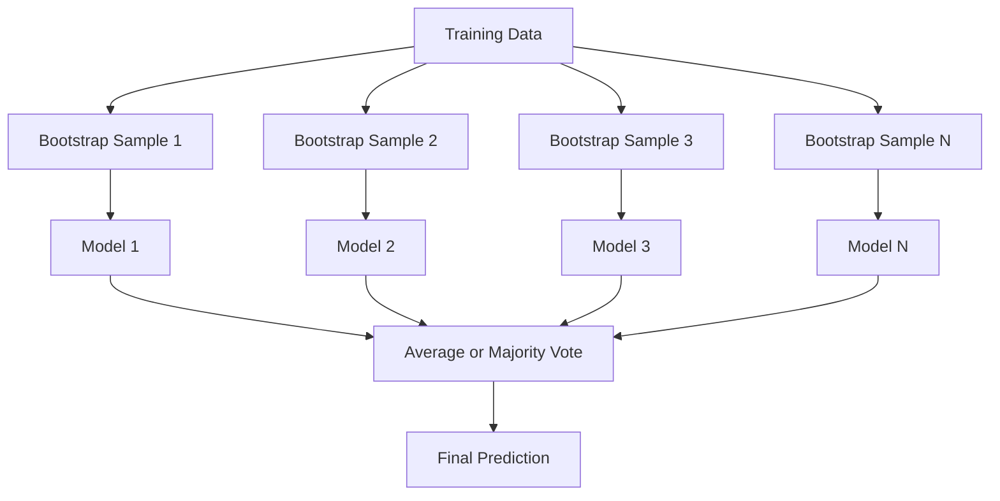
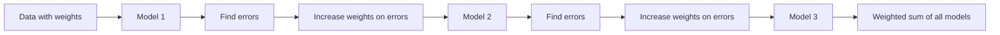
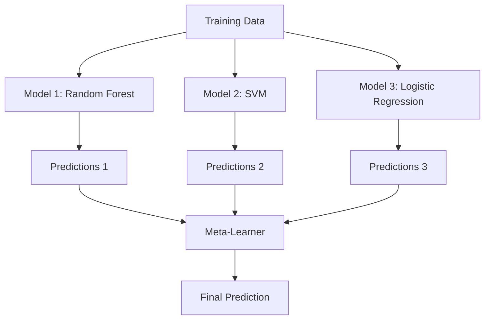

<think>
The user wants me to translate this lesson about Ensemble Methods from English to Polish. I need to follow the translation rules provided:

1. Stay in English for IT/AI terms, function names, variables, imports, etc.
2. Translate section headers like Learning Objectives, Summary, Exercise, etc.
3. Don't translate code blocks
4. Add commas before "że", "bo", "który", etc.
5. Polish diacritics must be correct
6. Minimal intervention - don't improve or shorten
7. Polish characters must be correct (no Chinese/Cyrillic)

Let me translate this carefully, section by section.
</think>

# Metody Ansamblowe

> Grupa słabych uczestników, połączona poprawnie, staje się silnym uczestnikiem. To nie metafora. To twierdzenie.

**Typ:** Build
**Język:** Python
**Wymagania wstępne:** Faza 2, Lekcja 10 (Tradeoff Bias-Wariancja)
**Czas:** ~120 minut

## Cele uczenia się

- Zaimplementuj AdaBoost i gradient boosting od zera i wyjaśnij, jak boosting sekwencyjnie redukuje bias
- Zbuduj ansambl bagging i demonstruj, jak uśrednianie dekorelowanych modeli redukuje wariancję bez zwiększania bias
- Porównaj bagging, boosting i stacking pod względem tego, który składnik błędu każda metoda celuje
- Oceń różnorodność ansamblu i wyjaśnij, dlaczego dokładność głosowania większościowego poprawia się wraz z większą liczbą niezależnych słabych uczestników

## Problem

Pojedyncze drzewo decyzyjne jest szybkie w trenowaniu i łatwe do interpretacji, ale przeucza się. Pojedynczy model liniowy niedoucza się na złożonych granicach. Możesz spędzić dni na inżynierowaniu idealnej architektury modelu. Albo możesz połączyć grupę niedoskonałych modeli i uzyskać coś lepszego niż cokolwiek indywidualnie.

Metody ansamblowe robią dokładnie to. Są najbardziej niezawodną techniką wygrywania konkursów Kaggle na danych tabelarycznych, napędzają większość produkcyjnych systemów ML i ilustrują tradeoff bias-wariancja w działaniu. Bagging redukuje wariancję. Boosting redukuje bias. Stacking uczy się, którym modelom ufać przy których danych wejściowych.

## Koncepcja

### Dlaczego ansamble działają

Załóżmy, że masz N niezależnych klasyfikatorów, z których każdy ma dokładność p > 0.5. Głosowanie większościowe ma dokładność:

```
P(majority correct) = sum over k > N/2 of C(N,k) * p^k * (1-p)^(N-k)
```

Dla 21 klasyfikatorów, każdy z dokładnością 60%, dokładność głosowania większościowego wynosi około 74%. Przy 101 klasyfikatorach rośnie do 84%. Błędy znoszą się, gdy modele popełniają różne błędy.

Kluczowym wymaganiem jest **różnorodność**. Jeśli wszystkie modele popełniają te same błędy, łączenie ich nic nie daje. Ansamble działają, ponieważ produkują zróżnicowane modele poprzez:

- Różne podzbiory treningowe (bagging)
- Różne podzbiory cech (lasy losowe)
- Sekwencyjną korekcję błędów (boosting)
- Różne rodziny modeli (stacking)

### Bagging (Bootstrap Aggregating)

Bagging tworzy różnorodność poprzez trenowanie każdego modelu na innym bootstrapowym przykładzie danych treningowych.



Bootstrap sample jest losowany z powtórzeniami z oryginalnych danych, w tym samym rozmiarze co oryginalne. Około 63.2% unikalnych próbek pojawia się w każdym bootstrapie. Pozostałe 36.8% (próbki out-of-bag) zapewniają darmowy zbiór walidacyjny.

Bagging redukuje wariancję bez znacznego zwiększania bias. Każde pojedyncze drzewo przeucza się do swojego bootstrapowego próbki, ale przeuczanie jest różne dla każdego drzewa, więc uśrednianie znosi szum.

**Lasy Losowe** to bagging z dodatkowym trikiem: przy każdym podziale rozważany jest tylko losowy podzbiór cech. To wymusza jeszcze większą różnorodność między drzewami. Typowa liczba kandydujących cech to `sqrt(n_features)` dla klasyfikacji i `n_features / 3` dla regresji.

### Boosting (Sekwencyjna Korekcja Błędów)

Boosting trenuje modele sekwencyjnie. Każdy nowy model koncentruje się na przykładach, które poprzednie modele źle zaklasyfikowały.



Boosting redukuje bias. Każdy nowy model koryguje systematyczne błędy ansamblu do tej pory. Ostateczna predykcja to ważona suma wszystkich modeli, gdzie lepsze modele otrzymują wyższe wagi.

Kompromis: boosting może przeuczyć się, jeśli uruchomisz zbyt wiele rund, ponieważ ciągle dopasowuje trudniejsze przykłady, z których niektóre mogą być szumem.

### AdaBoost

AdaBoost (Adaptive Boosting) był pierwszym praktycznym algorytmem boosting. Działa z dowolnym bazowym uczestnikiem, typowo pniaczkami decyzyjnymi (drzewa głębokości 1).

Algorytm:

```
1. Initialize sample weights: w_i = 1/N for all i

2. For t = 1 to T:
   a. Train weak learner h_t on weighted data
   b. Compute weighted error:
      err_t = sum(w_i * I(h_t(x_i) != y_i)) / sum(w_i)
   c. Compute model weight:
      alpha_t = 0.5 * ln((1 - err_t) / err_t)
   d. Update sample weights:
      w_i = w_i * exp(-alpha_t * y_i * h_t(x_i))
   e. Normalize weights to sum to 1

3. Final prediction: H(x) = sign(sum(alpha_t * h_t(x)))
```

Modele z niższym błędem otrzymują wyższe alpha. Błędnie zaklasyfikowane próbki otrzymują wyższe wagi, więc następny model się na nich koncentruje.

### Gradient Boosting

Gradient boosting uogólnia boosting na dowolne funkcje straty. Zamiast przeważać próbki, dopasowuje każdy nowy model do residuów (ujemny gradient funkcji straty) aktualnego ansamblu.

```
1. Initialize: F_0(x) = argmin_c sum(L(y_i, c))

2. For t = 1 to T:
   a. Compute pseudo-residuals:
      r_i = -dL(y_i, F_{t-1}(x_i)) / dF_{t-1}(x_i)
   b. Fit a tree h_t to the residuals r_i
   c. Find optimal step size:
      gamma_t = argmin_gamma sum(L(y_i, F_{t-1}(x_i) + gamma * h_t(x_i)))
   d. Update:
      F_t(x) = F_{t-1}(x) + learning_rate * gamma_t * h_t(x)

3. Final prediction: F_T(x)
```

Dla funkcji straty błędu średniokwadratowego, pseudo-residua to po prostu rzeczywiste residua: `r_i = y_i - F_{t-1}(x_i)`. Każde drzewo dosłownie dopasowuje błędy poprzedniego ansamblu.

Learning rate (skurcz) kontroluje, ile każde drzewo wnosi. Mniejsze learning rate wymagają więcej drzew, ale lepiej uogólniają. Typowe wartości: 0.01 do 0.3.

### XGBoost: Dlaczego Dominuje w Danych Tabelarycznych

XGBoost (eXtreme Gradient Boosting) to gradient boosting z optymalizacjami inżynieryjnymi, które czynią go szybkim, dokładnym i odpornym na przeuczanie:

- **Zregularizowana funkcja celu:** Kary L1 i L2 na wagach liści zapobiegają temu, by pojedyncze drzewa były zbyt pewne
- **Aproksymacja drugiego rzędu:** Używa zarówno pierwszej, jak i drugiej pochodnej funkcji straty, dając lepsze decyzje podziału
- **Podziały świadome rzadkości:** Natywnie obsługuje brakujące wartości poprzez uczenie się najlepszego kierunku dla brakujących danych przy każdym podziale
- **Subsampling kolumn:** Jak w lasach losowych, próbkuje cechy przy każdym podziale dla różnorodności
- **Weighted quantile sketch:** Efektywnie znajduje punkty podziału dla ciągłych cech na danych rozproszonych
- **Cache-aware block structure:** Układ pamięci zoptymalizowany dla linii cache CPU

Dla danych tabelarycznych, XGBoost (i jego następca LightGBM) konsekwentnie przewyższa sieci neuronowe. To się nie zmieni w najbliższym czasie. Jeśli twoje dane pasują do tabeli z wierszami i kolumnami, zacznij od gradient boosting.

### Stacking (Meta-Uczenie)

Stacking używa predykcji wielu bazowych modeli jako cech dla meta-ucznia.



Meta-learner uczy się, który bazowy model ufać dla których danych wejściowych. Jeśli las losowy jest lepszy w pewnych regionach, a SVM w innych, meta-learner nauczy się odpowiednio kierować.

Aby uniknąć przecieku danych, predykcje bazowego modelu muszą być generowane przez cross-validation na zbiorze treningowym. Nigdy nie trenujesz bazowych modeli i nie generujesz meta-cech na tych samych danych.

### Voting

Najprostszy ansambl. Po prostu łączy predykcje bezpośrednio.

- **Hard voting:** Głosowanie większościowe na etykietach klas.
- **Soft voting:** Uśrednianie przewidywanych prawdopodobieństw, wybór klasy z najwyższym średnim prawdopodobieństwem. Zwykle lepsze, ponieważ używa informacji o pewności.

## Zbuduj To

### Krok 1: Pień Decyzyjny (Bazowy Uczestnik)

Kod w `code/ensembles.py` implementuje wszystko od zera. Zaczynamy od pnia decyzyjnego: drzewa z pojedynczym podziałem.

```python
class DecisionStump:
    def __init__(self):
        self.feature_idx = None
        self.threshold = None
        self.polarity = 1
        self.alpha = None

    def fit(self, X, y, weights):
        n_samples, n_features = X.shape
        best_error = float("inf")

        for f in range(n_features):
            thresholds = np.unique(X[:, f])
            for thresh in thresholds:
                for polarity in [1, -1]:
                    pred = np.ones(n_samples)
                    pred[polarity * X[:, f] < polarity * thresh] = -1
                    error = np.sum(weights[pred != y])
                    if error < best_error:
                        best_error = error
                        self.feature_idx = f
                        self.threshold = thresh
                        self.polarity = polarity

    def predict(self, X):
        n = X.shape[0]
        pred = np.ones(n)
        idx = self.polarity * X[:, self.feature_idx] < self.polarity * self.threshold
        pred[idx] = -1
        return pred
```

### Krok 2: AdaBoost od Zera

```python
class AdaBoostScratch:
    def __init__(self, n_estimators=50):
        self.n_estimators = n_estimators
        self.stumps = []
        self.alphas = []

    def fit(self, X, y):
        n = X.shape[0]
        weights = np.full(n, 1 / n)

        for _ in range(self.n_estimators):
            stump = DecisionStump()
            stump.fit(X, y, weights)
            pred = stump.predict(X)

            err = np.sum(weights[pred != y])
            err = np.clip(err, 1e-10, 1 - 1e-10)

            alpha = 0.5 * np.log((1 - err) / err)
            weights *= np.exp(-alpha * y * pred)
            weights /= weights.sum()

            stump.alpha = alpha
            self.stumps.append(stump)
            self.alphas.append(alpha)

    def predict(self, X):
        total = sum(a * s.predict(X) for a, s in zip(self.alphas, self.stumps))
        return np.sign(total)
```

### Krok 3: Gradient Boosting od Zera

```python
class GradientBoostingScratch:
    def __init__(self, n_estimators=100, learning_rate=0.1, max_depth=3):
        self.n_estimators = n_estimators
        self.lr = learning_rate
        self.max_depth = max_depth
        self.trees = []
        self.initial_pred = None

    def fit(self, X, y):
        self.initial_pred = np.mean(y)
        current_pred = np.full(len(y), self.initial_pred)

        for _ in range(self.n_estimators):
            residuals = y - current_pred
            tree = SimpleRegressionTree(max_depth=self.max_depth)
            tree.fit(X, residuals)
            update = tree.predict(X)
            current_pred += self.lr * update
            self.trees.append(tree)

    def predict(self, X):
        pred = np.full(X.shape[0], self.initial_pred)
        for tree in self.trees:
            pred += self.lr * tree.predict(X)
        return pred
```

### Krok 4: Porównaj z sklearn

Kod weryfikuje, że nasze implementacje od zera produkują podobną dokładność do sklearn's `AdaBoostClassifier` i `GradientBoostingClassifier`, i porównuje wszystkie metody obok siebie.

## Użyj To

### Kiedy Używać Każdej Metody

| Method | Reduces | Best for | Watch out for |
|--------|---------|----------|---------------|
| Bagging / Random Forest | Variance | Noisy data, many features | Does not help with bias |
| AdaBoost | Bias | Clean data, simple base learners | Sensitive to outliers and noise |
| Gradient Boosting | Bias | Tabular data, competitions | Slow to train, easy to overfit without tuning |
| XGBoost / LightGBM | Both | Production tabular ML | Many hyperparameters |
| Stacking | Both | Getting last 1-2% accuracy | Complex, risk of overfitting meta-learner |
| Voting | Variance | Quick combination of diverse models | Only helps if models are diverse |

### Stack Produkcji dla Danych Tabelarycznych

Dla większości problemów predykcji tabelarycznej, oto kolejność do wypróbowania:

1. **LightGBM lub XGBoost** z domyślnymi parametrami
2. Dostrój n_estimators, learning_rate, max_depth, min_child_weight
3. Jeśli potrzebujesz ostatnich 0.5%, zbuduj ansambl stacking z 3-5 zróżnicowanymi modelami
4. Używaj cross-validation throughout

Sieci neuronowe na danych tabelarycznych są prawie zawsze gorsze niż gradient boosting, mimo ciągłych prób badawczych. TabNet, NODE i podobne architektury sporadycznie dorównują, ale rzadko przewyższają dobrze dostrojony XGBoost.

## Wyślij To

Ta lekcja tworzy `outputs/prompt-ensemble-selector.md` -- prompt, który pomaga wybrać właściwą metodę ansamblową dla danego zbioru danych. Opisz swoje dane (rozmiar, typy cech, poziom szumu, balans klas) i problem, który rozwiązujesz. Prompt przechodzi przez listę kontrolną decyzji, zaleca metodę, sugeruje starting hyperparameters i ostrzega o typowych błędach dla tej metody. Tworzy również `outputs/skill-ensemble-builder.md` z pełnym przewodnikiem wyboru.

## Ćwiczenia

1. Zmodyfikuj implementację AdaBoost, aby śledziła dokładność treningu po każdej rundzie. Wykreśl dokładność vs. liczbę estimatorów. Kiedy się zbiega?

2. Zaimplementuj las losowy od zera, dodając losowy subsampling cech do drzewa regresji. Trenuj 100 drzew z `max_features=sqrt(n_features)` i uśredniaj predykcje. Porównaj redukcję wariancji do pojedynczego drzewa.

3. W implementacji gradient boosting dodaj early stopping: śledź loss walidacyjny po każdej rundzie i zatrzymaj, gdy nie poprawił się przez 10 kolejnych rund. Ile drzew faktycznie potrzebuje?

4. Zbuduj ansambl stacking z trzema bazowymi modelami (regresja logistyczna, drzewo decyzyjne, k-najbliższych sąsiadów) i meta-learnerem regresji logistycznej. Użyj 5-fold cross-validation do generowania meta-cech. Porównaj do każdego bazowego modelu osobno.

5. Uruchom XGBoost na tym samym zbiorze danych z domyślnymi parametrami. Porównaj jego dokładność do twojego gradient boosting od zera. Zmierz czas obu. Jak duża jest różnica prędkości?

## Kluczowe Terminy

| Term | What people say | What it actually means |
|------|----------------|----------------------|
| Bagging | "Train on random subsets" | Bootstrap aggregating: train models on bootstrap samples, average predictions to reduce variance |
| Boosting | "Focus on hard examples" | Train models sequentially, each correcting errors of the ensemble so far, to reduce bias |
| AdaBoost | "Reweight the data" | Boosting via sample weight updates; misclassified points get higher weight for the next learner |
| Gradient boosting | "Fit the residuals" | Boosting via fitting each new model to the negative gradient of the loss function |
| XGBoost | "The Kaggle weapon" | Gradient boosting with regularization, second-order optimization, and systems-level speed tricks |
| Stacking | "Models on top of models" | Use predictions of base models as input features for a meta-learner |
| Random forest | "Many randomized trees" | Bagging with decision trees, adding random feature subsampling at each split for diversity |
| Ensemble diversity | "Make different mistakes" | Models must be uncorrelated in their errors for the ensemble to improve over individuals |
| Out-of-bag error | "Free validation" | Samples not in a bootstrap draw (~36.8%) serve as a validation set without needing a holdout |

## Dalsze Czytanie

- [Schapire & Freund: Boosting: Foundations and Algorithms](https://mitpress.mit.edu/9780262526036/) -- książka twórców AdaBoost
- [Friedman: Greedy Function Approximation: A Gradient Boosting Machine (2001)](https://statweb.stanford.edu/~jhf/ftp/trebst.pdf) -- oryginalny artykuł o gradient boosting
- [Chen & Guestrin: XGBoost (2016)](https://arxiv.org/abs/1603.02754) -- artykuł o XGBoost
- [Wolpert: Stacked Generalization (1992)](https://www.sciencedirect.com/science/article/abs/pii/S0893608005800231) -- oryginalny artykuł o stacking
- [scikit-learn Ensemble Methods](https://scikit-learn.org/stable/modules/ensemble.html) -- praktyczne odniesienie