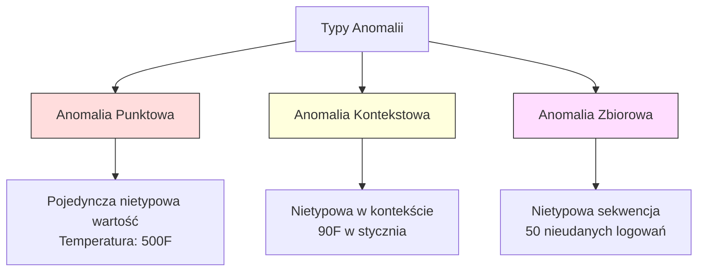
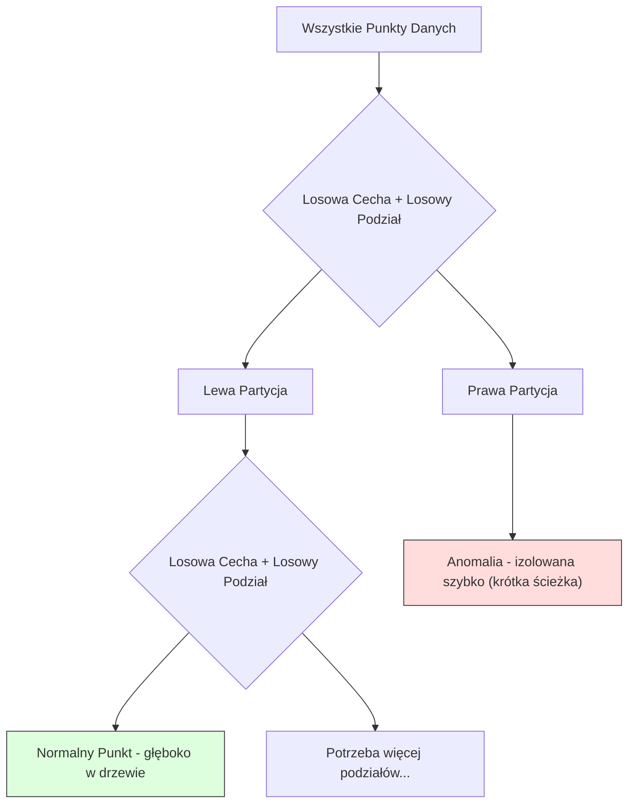
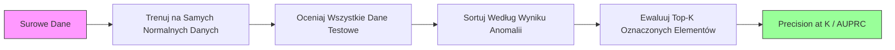

# Wykrywanie Anomalii

> Normalne jest łatwe do zdefiniowania. Nienormalne to wszystko, co nie pasuje.

**Typ:** Budowanie
**Język:** Python
**Wymagania wstępne:** Faza 2, Lekcje 01-09
**Czas:** ~75 minut

## Cele uczenia się

- Zaimplementować od podstaw metody wykrywania anomalii Z-score, IQR i Isolation Forest
- Rozróżniać anomalie punktowe, kontekstowe i zbiorowe oraz wybierać odpowiednią metodę wykrywania dla każdej z nich
- Wyjaśnić, dlaczego wykrywanie anomalii jest formułowane jako modelowanie normalnych danych, a nie klasyfikacja anomalii
- Porównać nienadzorowane wykrywanie anomalii z nadzorowaną klasyfikacją i ocenić kompromis między zasięgiem nowych anomalii a precyzją

## Problem

Karta kredytowa jest używana w Nowym Jorku o 14:00, a następnie w Tokio o 14:05. Czujnik fabryczny odczytuje 150 stopni, gdy normalny zakres to 80-120. Serwer wysyła 50 000 żądań na sekundę, gdy dzienna średnia to 200.

To są anomalie. Znalezienie ich ma znaczenie. Oszustwa kosztują miliardy. Awarie sprzętu kosztują przestoje. Włamania do sieci kosztują dane.

Wyzwanie: rzadko masz oznaczone przykłady anomalii. Oszustwa stanowią 0,1% transakcji. Awarie sprzętu zdarzają się kilka razy w roku. Nie możesz trenować standardowego klasyfikatora, ponieważ w klasie "anomalii" nie ma prawie nic do nauczenia. Nawet jeśli masz pewne etykiety, anomalie, które widziałeś, nie są jedynymi typami, które napotkasz. Jutrzejszy schemat oszustwa wygląda inaczej niż dzisiejszy.

Wykrywanie anomalii odwraca problem. Zamiast uczyć się, co jest nienormalne, naucz się, co jest normalne. Wszystko, co odbiega od normy, jest podejrzane. To działa bez etykiet, adaptuje się do nowych typów anomalii i skaluje się do masywnych zbiorów danych.

## Koncepcja

### Typy anomalii

Nie wszystkie anomalie są takie same:

- **Anomalie punktowe.** Pojedynczy punkt danych, który jest nietypowy niezależnie od kontekstu. Odczyt temperatury 500 stopni. Transakcja 50 000 $ z konta, które normalnie wydaje 50 $.
- **Anomalie kontekstowe.** Punkt danych, który jest nietypowy w danym kontekście. Temperatura 90 stopni jest normalna latem, anomalią zimą. Ta sama wartość, inny kontekst.
- **Anomalie zbiorowe.** Sekwencja punktów danych, która jest nietypowa jako grupa, nawet jeśli każdy pojedynczy punkt może być normalny. Pięć nieudanych logowań jest normalnych. Pięćdziesiąt z rzędu to atak siłowy.

Większość metod wykrywa anomalie punktowe. Anomalie kontekstowe wymagają cech czasowych lub lokalizacyjnych. Anomalie zbiorowe wymagają metod uwzględniających sekwencje.



### Nienadzorowane sformułowanie

W standardowej klasyfikacji masz etykiety dla obu klas. W wykrywaniu anomalii typowo masz jedną z trzech sytuacji:

1. **W pełni nienadzorowane.** Brak etykiet w ogóle. Dopasowujesz detektor do wszystkich danych i masz nadzieję, że anomalie są na tyle rzadkie, że nie skażą modelu "normalny".
2. **Półnadzorowane.** Masz czysty zbiór danych tylko z normalnymi danymi. Dopasowujesz do tego czystego zestawu i oceniasz wszystko inne. To najsilniejsza konfiguracja, gdy jest to możliwe.
3. **Słabo nadzorowane.** Masz kilka oznaczonych anomalii. Używaj ich do ewaluacji, nie do treningu. Trenuj nienadzorowanie, a następnie mierz precyzję/recall na oznaczonym podzbiorze.

Kluczowy wgląd: wykrywanie anomalii jest fundamentalnie różne od klasyfikacji. Modelujesz rozkład normalnych danych, a nie granicę decyzyjną między dwiema klasami.

### Nadzorowane vs Nienadzorowane: Kompromis

Jeśli masz oznaczone anomalie, czy powinieneś użyć ich do treningu (nadzorowana klasyfikacja) czy tylko do ewaluacji (nienadzorowane wykrywanie)?

**Nadzorowane (traktuj jako klasyfikację):**
- Przechwytuje dokładnie te typy anomalii, które widziałeś wcześniej
- Wyższa precyzja na znanych typach anomalii
- Całkowicie pomija nowe typy anomalii
- Wymaga ponownego treningu, gdy pojawiają się nowe typy anomalii
- Potrzebuje wystarczająco dużo przykładów anomalii (często za mało)

**Nienadzorowane (modeluj normalne, oznaczaj odchylenia):**
- Przechwytuje każde odchylenie od normy, w tym nowe typy
- Nie wymaga oznaczonych anomalii
- Wyższy współczynnik fałszywych alarmów (nie wszystko nietypowe jest złe)
- Bardziej odporne na przesunięcie rozkładu

W praktyce najlepsze systemy łączą oba podejścia: nienadzorowane wykrywanie dla szerokiego zasięgu, nadzorowane modele dla znanych wysokopriorytetowych typów anomalii oraz przegląd ludzki dla niejednoznacznych przypadków.

### Metoda Z-Score

Najprostsze podejście. Oblicz średnią i odchylenie standardowe każdej cechy. Oznacz każdy punkt oddalony o więcej niż k odchyleń standardowych od średniej.

```text
z_score = (x - mean) / std
anomalia jeśli |z_score| > próg
```

Domyślny próg to 3.0 (99.7% normalnych danych mieści się w 3 odchyleniach standardowych dla rozkładu Gaussa).

**Zalety:** Prosty. Szybki. Interpretowalny ("ta wartość jest 4.5 odchylenia standardowego od normy").

**Wady:** Zakłada normalny rozkład danych. Wrażliwy na wartości odstające w danych treningowych (wartości odstające przesuwają średnią i zawyżają odchylenie, co utrudnia ich wykrycie). Nie działa na rozkładach multimodalnych.

**Kiedy dobrze działa:** Monitorowanie jednoczynnikowe, gdzie dane mają w przybliżeniu kształt dzwonu. Czasy odpowiedzi serwerów, tolerancje produkcyjne, odczyty czujników ze stabilnymi bazowymi wartościami.

**Kiedy zawodzi:** Dane wieloklastrowe (dwa biura z różnymi bazowymi temperaturami), dane skośne (kwoty transakcji, gdzie 1000 $ jest rzadkie, ale nie anomalne), dane z wartościami odstającymi w zestawie treningowym.

### Metoda IQR

Bardziej odporna niż Z-score. Używa rozstępu międzykwartylowego zamiast średniej i odchylenia standardowego.

```
Q1 = 25. percentyl
Q3 = 75. percentyl
IQR = Q3 - Q1
dolna_granica = Q1 - współczynnik * IQR
górna_granica = Q3 + współczynnik * IQR
anomalia jeśli x < dolna_granica lub x > górna_granica
```

Domyślny współczynnik to 1.5.

**Zalety:** Odporna na wartości odstające (percentyle nie są dotknięte przez wartości skrajne). Działa na rozkładach skośnych. Brak założenia normalności.

**Wady:** Tylko jednowymiarowa (stosowana na cechę niezależnie). Nie może wykrywać anomalii, które są nietypowe tylko gdy cechy są rozpatrywane łącznie (punkt może być normalny w każdej cechze indywidualnie, ale anomalia w przestrzeni łącznej).

**Praktyczna uwaga:** Współczynnik 1.5 w IQR odpowiada wąsom na wykresie pudełkowym. Punkty poza wąsami to potencjalne wartości odstające. Użycie 3.0 zamiast 1.5 sprawia, że detektor jest bardziej konserwatywny (mniej oznaczeń, mniej fałszywych alarmów). Właściwy współczynnik zależy od twojej tolerancji na fałszywe alarmy.

### Isolation Forest

Kluczowy wgląd: anomalii jest niewiele i są inne. W losowym partycjonowaniu danych, anomalie są łatwiejsze do izolacji -- potrzebują mniej losowych podziałów, aby zostać oddzielone od reszty.



**Jak to działa:**
1. Zbuduj wiele losowych drzew (las izolacji)
2. W każdym węźle wybierz losową cechę i losową wartość podziału między min a max cechy
3. Kontynuuj podziały, aż każdy punkt zostanie izolowany (w swoim węźle liściowym)
4. Anomalie mają krótszą średnią długość ścieżki we wszystkich drzewach

**Dlaczego to działa:** Normalne punkty znajdują się w gęstych regionach. Potrzeba wielu losowych podziałów, aby izolować jeden od jego sąsiadów. Anomalie znajdują się w rzadkich regionach. Jeden lub dwa losowe podziały wystarczą do ich izolacji.

Wynik anomalii opiera się na średniej długości ścieżki we wszystkich drzewach, znormalizowanej przez oczekiwaną długość ścieżki losowego binarnego drzewa wyszukiwania:

```
score(x) = 2^(-average_path_length(x) / c(n))
```

Gdzie `c(n)` to oczekiwana długość ścieżki dla n próbek. Wynik bliski 1 oznacza anomalię. Wynik bliski 0.5 oznacza normalne. Wynik bliski 0 oznacza bardzo normalne (głęboko w gęstych klastrach).

**Zalety:** Brak założeń dotyczących rozkładu. Działa w wysokich wymiarach. Dobrze się skaluje (podliniowo w wielkości próbki, ponieważ każde drzewo używa podpróbki). Obsługuje mieszane typy cech.

**Wady:** Trudności z anomaliami w gęstych regionach (efekt maskowania). Losowe partycjonowanie jest mniej skuteczne, gdy wiele cech jest nieistotnych.

**Kluczowe hiperparametry:**
- `n_estimators`: Liczba drzew. 100 jest zwykle wystarczająca. Więcej drzew daje bardziej stabilne wyniki, ale wolniejsze obliczenia.
- `max_samples`: Liczba próbek na drzewo. 256 to domyślna wartość w oryginalnej pracy. Mniejsze wartości sprawiają, że pojedyncze drzewa są mniej dokładne, ale zwiększają różnorodność. To próbkowanie sprawia, że Isolation Forest jest szybki -- każde drzewo widzi małą część danych.
- `contamination`: Oczekiwany ułamek anomalii. Używany tylko do ustawiania progu. Nie wpływa na same wyniki.

### Local Outlier Factor (LOF)

LOF porównuje lokalną gęstość wokół punktu z gęstością wokół jego sąsiadów. Punkt w rzadkim regionie otoczony gęstymi regionami jest anomalią.

**Jak to działa:**
1. Dla każdego punktu znajdź jego k najbliższych sąsiadów
2. Oblicz lokalną gęstość osiągalności (jak gęste jest sąsiedztwo)
3. Porównaj gęstość każdego punktu z gęstością jego sąsiadów
4. Jeśli punkt ma znacznie niższą gęstość niż jego sąsiedzi, jest to wartość odstająca

**Wynik LOF:**
- LOF bliski 1.0 oznacza podobną gęstość jak sąsiedzi (normalne)
- LOF większy niż 1.0 oznacza niższą gęstość niż sąsiedzi (potencjalnie anomalia)
- LOF znacznie większy niż 1.0 (np. 2.0+) oznacza znacznie niższą gęstość (prawdopodobnie anomalia)

Część "lokalna" jest krytyczna. Rozważ zbiór danych z dwoma klastrami: gęsty klaster 1000 punktów i rzadki klaster 50 punktów. Punkt na krawędzi rzadkiego klastra nie jest globalnie nietypowy -- ma 50 sąsiadów. Ale jest lokalnie nietypowy, jeśli jego bezpośredni sąsiedzi są gęściejsi niż on. LOF chwyta tę niuansę, której globalne metody nie zauważają.

**Zalety:** Wykrywa lokalne anomalie (punkty, które są nietypowe w swoim sąsiedztwie, nawet jeśli nie są globalnie nietypowe). Działa na klastrach o różnych gęstościach.

**Wady:** Wolne na dużych zbiorach danych (O(n^2) dla naiwnej implementacji). Wrażliwe na wybór k. Nie działa dobrze w bardzo wysokich wymiarach (klątwa wymiarowości wpływa na obliczenia odległości).

### Porównanie

| Metoda | Założenia | Szybkość | Obsługuje Wysokie Wymiary | Wykrywa Lokalne Anomalie |
|--------|------------|-------|-------------------|------------------------|
| Z-score | Rozkład normalny | Bardzo szybkie | Tak (na cechę) | Nie |
| IQR | Brak (na cechę) | Bardzo szybkie | Tak (na cechę) | Nie |
| Isolation Forest | Brak | Szybkie | Tak | Częściowo |
| LOF | Odległość jest znacząca | Wolne | Słabo | Tak |

### Wyzwania w Ewaluacji

Ewaluacja detektorów anomalii jest trudniejsza niż ewaluacja klasyfikatorów:

- **Ekstremalny brak równowagi klas.** Przy 0.1% anomalii, przewidywanie "normalne" dla wszystkiego daje 99.9% dokładności. Dokładność jest bezużyteczna.
- **AUROC jest mylący.** Przy silnym braku równowagi, AUROC może wyglądać dobrze, nawet gdy model pomija większość anomalii przy praktycznych progach.
- **Lepsze metryki:** Precision@k (z najwyższych k oznaczonych elementów, ile jest prawdziwymi anomaliami), AUPRC (pole pod krzywą precision-recall) oraz recall przy ustalonym współczynniku fałszywych alarmów.



### Pipeline Wykrywania Anomalii

W praktyce wykrywanie anomalii podąża za tym workflow:

1. **Zbierz dane bazowe.** Idealnie, okres, o którym wiesz, że nie ma (lub jest bardzo mało) anomalii.
2. **Inżynieria cech.** Surowe cechy plus cechy pochodne (statystyki kroczące, cechy czasowe, współczynniki).
3. **Trenuj detektor.** Dopasuj do danych bazowych. Model uczy się, jak wygląda "normalne".
4. **Oceniaj nowe dane.** Każda nowa obserwacja otrzymuje wynik anomalii.
5. **Wybór progu.** Wybierz odcięcie wyniku. To jest decyzja biznesowa: wyższy próg oznacza mniej fałszywych alarmów, ale więcej pominiętych anomalii.
6. **Alertuj i badaj.** Oznaczone punkty idą do przeglądu ludzkiego lub zautomatyzowanej reakcji.
7. **Zbieranie informacji zwrotnej.** Rejestruj, czy oznaczone elementy były prawdziwymi anomaliami czy fałszywymi alarmami. Użyj tych danych do ewaluacji detektora i dostrajania progu w czasie.

Pipeline nigdy nie jest "gotowy." Rozkłady danych się przesuwają, nowe typy anomalii się pojawiają, progi wymagają korekty. Traktuj wykrywanie anomalii jako żywy system, nie jednorazowy model.

## Zbuduj to

Kod w `code/anomaly_detection.py` implementuje Z-score, IQR i Isolation Forest od podstaw.

### Detektor Z-Score

```python
def zscore_detect(X, threshold=3.0):
    mean = X.mean(axis=0)
    std = X.std(axis=0)
    std[std == 0] = 1.0
    z = np.abs((X - mean) / std)
    return z.max(axis=1) > threshold
```

Proste i wektoryzowane. Oznacza punkt, jeśli jakakolwiek cecha przekracza próg.

### Detektor IQR

```python
def iqr_detect(X, factor=1.5):
    q1 = np.percentile(X, 25, axis=0)
    q3 = np.percentile(X, 75, axis=0)
    iqr = q3 - q1
    iqr[iqr == 0] = 1.0
    lower = q1 - factor * iqr
    upper = q3 + factor * iqr
    outside = (X < lower) | (X > upper)
    return outside.any(axis=1)
```

### Isolation Forest od podstaw

Implementacja od podstaw buduje drzewa izolacji, które losowo partycjonują przestrzeń cech:

```python
class IsolationTree:
    def __init__(self, max_depth):
        self.max_depth = max_depth

    def fit(self, X, depth=0):
        n, p = X.shape
        if depth >= self.max_depth or n <= 1:
            self.is_leaf = True
            self.size = n
            return self
        self.is_leaf = False
        self.feature = np.random.randint(p)
        x_min = X[:, self.feature].min()
        x_max = X[:, self.feature].max()
        if x_min == x_max:
            self.is_leaf = True
            self.size = n
            return self
        self.threshold = np.random.uniform(x_min, x_max)
        left_mask = X[:, self.feature] < self.threshold
        self.left = IsolationTree(self.max_depth).fit(X[left_mask], depth + 1)
        self.right = IsolationTree(self.max_depth).fit(X[~left_mask], depth + 1)
        return self
```

Długość ścieżki do izolacji punktu determinuje jego wynik anomalii. Krótsze ścieżki oznaczają bardziej anomalię.

Klasa `IsolationForest` opakowuje wiele drzew:

```python
class IsolationForest:
    def __init__(self, n_estimators=100, max_samples=256, seed=42):
        self.n_estimators = n_estimators
        self.max_samples = max_samples

    def fit(self, X):
        sample_size = min(self.max_samples, X.shape[0])
        max_depth = int(np.ceil(np.log2(sample_size)))
        for _ in range(self.n_estimators):
            idx = rng.choice(X.shape[0], size=sample_size, replace=False)
            tree = IsolationTree(max_depth=max_depth)
            tree.fit(X[idx])
            self.trees.append(tree)

    def anomaly_score(self, X):
        avg_path = average path length across all trees
        scores = 2.0 ** (-avg_path / c(max_samples))
        return scores
```

Współczynnik normalizacji `c(n)` to oczekiwana długość ścieżki nieudanego wyszukiwania w binarnym drzewie wyszukiwania z n elementami. Równa się `2 * H(n-1) - 2*(n-1)/n` gdzie `H` to liczba harmoniczna. Ta normalizacja zapewnia, że wyniki są porównywalne między zbiorami danych o różnych rozmiarach.

### Scenariusze demonstracyjne

Kod generuje wiele scenariuszy testowych:

1. **Pojedynczy klaster z wartościami odstającymi.** Klaster Gaussa 2D z wstrzykniętymi anomaliami daleko od centrum. Wszystkie metody powinny tu działać.
2. **Dane multimodalne.** Trzy klastry o różnych rozmiarach i gęstościach. Punkty między klastrami są anomaliami. Z-score ma trudności, ponieważ zakresy na cechę są szerokie.
3. **Dane wysokowymiarowe.** 50 cech, ale anomalie różnią się tylko w 5 z nich. Testuje, czy metody mogą znaleźć anomalie w podzbiorze cech.

Każda demo porównuje wszystkie metody używając precision, recall, F1 i Precision@k.

## Użyj tego

Z sklearn (używając implementacji bibliotecznych, nie od podstaw):

```python
from sklearn.ensemble import IsolationForest
from sklearn.neighbors import LocalOutlierFactor

iso = IsolationForest(n_estimators=100, contamination=0.05, random_state=42)
iso.fit(X_train)
predictions = iso.predict(X_test)

lof = LocalOutlierFactor(n_neighbors=20, contamination=0.05, novelty=True)
lof.fit(X_train)
predictions = lof.predict(X_test)
```

Uwaga: `contamination` ustawia oczekiwany ułamek anomalii. Poprawne ustawienie ma znaczenie -- za niskie pomija anomalie, za wysokie tworzy fałszywe alarmy.

Kod w `anomaly_detection.py` porównuje implementacje od podstaw ze sklearn na tych samych danych.

### Parametr Contamination w sklearn

Parametr `contamination` w sklearn określa próg konwersji ciągłych wyników anomalii na binarne predykcje. Nie zmienia podstawowych wyników.

```python
iso_5 = IsolationForest(contamination=0.05)
iso_10 = IsolationForest(contamination=0.10)
```

Oba produkują te same wyniki anomalii. Ale `iso_5` oznacza górne 5%, podczas gdy `iso_10` oznacza górne 10%. Jeśli nie znasz prawdziwego współczynnika anomalii (zwykle nie znasz), ustaw contamination na "auto" i pracuj bezpośrednio z surowymi wynikami. Ustaw własny próg na podstawie kompromisu kosztowego między fałszywymi pozytywami a fałszywymi negatywami.

### One-Class SVM

Kolejny nienadzorowany detektor anomalii warto poznać. One-Class SVM dopasowuje granicę wokół normalnych danych w przestrzeni wysokowymiarowej cech (używając triku z jądrem).

```python
from sklearn.svm import OneClassSVM

oc_svm = OneClassSVM(kernel="rbf", gamma="auto", nu=0.05)
oc_svm.fit(X_train)
predictions = oc_svm.predict(X_test)
```

Parametr `nu` przybliża ułamek anomalii. One-Class SVM dobrze działa na małych do średnich zbiorach danych, ale nie skaluje się do bardzo dużych danych (macierz jądra rośnie kwadratowo).

### Podejście z Autoencoderem (Podgląd)

Autoenkodery to sieci neuronowe, które uczą się kompresować i rekonstruować dane. Trenuj na normalnych danych. W czasie testowania anomalie mają wysoki błąd rekonstrukcji, ponieważ sieć nauczyła się rekonstruować tylko normalne wzorce.

To jest omówione w Fazie 3 (Deep Learning), ale zasada jest ta sama: modeluj, co jest normalne, oznaczaj, co odbiega.

### Zestawianie Detektorów Anomalii

Tak jak metody zespołowe poprawiają klasyfikację (Lekcja 11), łączenie wielu detektorów anomalii poprawia wykrywanie. Najprostsze podejście:

1. Uruchom wiele detektorów (Z-score, IQR, Isolation Forest, LOF)
2. Znormalizuj wyniki każdego detektora do [0, 1]
3. Uśrednij znormalizowane wyniki
4. Oznacz punkty powyżej progu na średnim wyniku

To redukuje fałszywe pozytywy, ponieważ różne metody mają różne tryby awarii. Punkt oznaczony przez wszystkie cztery metody jest prawie na pewno anomalią. Punkt oznaczony tylko przez jedną może być dziwactwem tej metody.

Bardziej wyrafinowane zestawianie waży każdy detektor przez jego szacowaną niezawodność (zmierzoną na zbiorze walidacyjnym z znanymi anomaliami, jeśli jest dostępny).

### Uwagi Produkcjne

1. **Dryft progu.** Gdy rozkład danych się przesuwa, stały próg staje się nieaktualny. Monitoruj rozkład wyników anomalii i dostosowuj okazjonalnie.
2. **Zmęczenie alertami.** Zbyt wiele fałszywych alarmów i operatorzy przestają zwracać uwagę. Zaczynaj od wysokiego progu (mniej, bardziej wiarygodne alerty) i obniżaj go w miarę budowania zaufania.
3. **Podejście zestawowe.** W produkcji łącz wiele detektorów. Oznaczaj punkt tylko jeśli wiele metod zgadza się, że jest anomalią. To znacząco redukuje fałszywe pozytywy.
4. **Inżynieria cech.** Surowe cechy rzadko są wystarczające. Dodawaj statystyki kroczące, współczynniki, czas-od-ostatniego-zdarzenia i cechy specyficzne dla domeny. Dobry zestaw cech ma większe znaczenie niż wybór detektora.
5. **Pętla sprzężenia zwrotnego.** Gdy operatorzy badają oznaczone elementy i potwierdzają lub odrzucają je, przekazuj to z powrotem do systemu. Gromadź oznaczone dane w czasie, aby ewaluować i ulepszać detektor.

## Wysyłaj to

Ta lekcja produkuje:
- `outputs/skill-anomaly-detector.md` -- umiejętność decyzyjna dla wyboru właściwego detektora
- `code/anomaly_detection.py` -- Z-score, IQR i Isolation Forest od podstaw, z porównaniem sklearn

### Wybór Progu

Wynik anomalii jest ciągły. Potrzebujesz progu do podejmowania binarnych decyzji. To jest decyzja biznesowa, nie techniczna.

Rozważ dwa scenariusze:
- **Wykrywanie oszustw.** Pominięcie oszustwa jest kosztowne (chargebacki, zaufanie klientów). Fałszywe alarmy kosztują 5 minut pracy analityka ludzkiego na zbadanie. Ustaw próg nisko, aby wyłapać więcej oszustw, zaakceptuj więcej fałszywych alarmów.
- **Utrzymanie sprzętu.** Fałszywy alarm oznacza niepotrzebne zamknięcie kosztujące 50 000 $. Pominięta awaria oznacza naprawę za 500 000 $. Ustaw próg, aby zbalansować te koszty.

W obu przypadkach optymalny próg zależy od współczynnika kosztów między fałszywymi pozytywami a fałszywymi negatywami. Zrób wykres precyzji i recall przy różnych progach, nałóż funkcję kosztów i wybierz punkt minimum kosztu.

### Skalowanie do Produkcji

Dla detekcji anomalii w czasie rzeczywistym w produkcji:

1. **Trening wsadowy, scoring online.** Trenuj model okresowo (dziennie, co tydzień) na niedawnych normalnych danych. Oceniaj każdą nową obserwację w miarę jej przybywania.
2. **Obliczanie cech musi się zgadzać.** Jeśli trenowałeś ze statystykami kroczącymi z 30 dni, potrzebujesz 30 dni historii do obliczenia cech dla nowej obserwacji. Buforuj wymaganą historię.
3. **Monitorowanie rozkładu wyników.** Śledź rozkład wyników anomalii w czasie. Jeśli mediana wyniku dryfuje w górę, albo dane się zmieniają, albo model jest przestarzały.
4. **Wyjaśnialność.** Gdy oznaczasz anomalię, powiedz dlaczego. Z-score: "Cecha X jest 4.2 odchylenia standardowego powyżej normy." Isolation Forest: "Ten punkt był izolowany w średnio 3.1 podziałach (normalne punkty potrzebują 8.5)."

## Ćwiczenia

1. ** dostrajanie progu.** Uruchom detektor Z-score z progami od 1.0 do 5.0 co 0.5. Zrób wykres precyzji i recall przy każdym progu. Gdzie jest optymalny punkt dla twoich danych?

2. **Wielowymiarowe anomalie.** Stwórz dane 2D, gdzie każda cecha indywidualnie wygląda normalnie, ale kombinacja jest anomalią (np. punkty daleko od głównej przekątnej klastra). Pokaż, że Z-score na cechę pomija te anomalie, ale Isolation Forest je wyłapuje.

3. **LOF od podstaw.** Zaimplementuj Local Outlier Factor używając k-najbliższych sąsiadów. Porównaj ze sklearn's LocalOutlierFactor na tych samych danych. Użyj k=10 i k=50 -- jak wybór k wpływa na wyniki?

4. **Strumieniowe wykrywanie anomalii.** Zmodyfikuj detektor Z-score do pracy w trybie strumieniowym: aktualizuj bieżącą średnią i wariancję w miarę przybywania nowych punktów (internetowy algorytm Weldforda). Porównaj z wsadowym Z-score na tych samych danych.

5. **Rzeczywista ewaluacja.** Weź zbiór danych z znanymi anomaliami (oszustwa kart kredytowych z Kaggle, na przykład). Ewaluuj wszystkie cztery metody używając precision@100, precision@500 i AUPRC. Która metoda działa najlepiej? Dlaczego?

## Kluczowe Terminy

| Termin | Co ludzie mówią | Co to faktycznie oznacza |
|------|----------------|----------------------|
| Anomalia | "Wartość odstająca, nietypowy punkt" | Punkt danych, który znacząco odbiega od oczekiwanego wzorca normalnych danych |
| Anomalia punktowa | "Pojedyncza dziwna wartość" | Indywidualna obserwacja, która jest nietypowa niezależnie od kontekstu |
| Anomalia kontekstowa | "Normalna wartość, zły kontekst" | Obserwacja, która jest nietypowa w danym kontekście (czas, lokalizacja itp.), ale może być normalna w innym kontekście |
| Isolation Forest | "Losowe podziały do znajdowania wartości odstających" | Zestaw losowych drzew, które izolują anomalie mniejszą liczbą podziałów niż normalne punkty |
| Local Outlier Factor | "Porównaj gęstość do sąsiadów" | Metoda, która oznacza punkty, których lokalna gęstość jest znacznie niższa niż gęstość ich sąsiadów |
| Z-score | "Odchylenia standardowe od średniej" | (x - mean) / std, mierzące, jak daleko punkt jest od centrum w jednostkach odchylenia standardowego |
| IQR | "Rozstęp międzykwartylowy" | Q3 - Q1, mierzące rozproszenie środkowych 50% danych, używane do odpornego wykrywania wartości odstających |
| Contamination | "Oczekiwany ułamek anomalii" | Hiperparametr mówiący detektorowi, jaki procent danych powinien oznaczyć jako anomalię |
| Precision@k | "Z top k oznaczeń, ile jest prawdziwych" | Precyzja obliczona tylko na k najbardziej podejrzanych punktach, użyteczna dla niezrównoważonego wykrywania anomalii |
| AUPRC | "Pole pod krzywą precision-recall" | Metryka podsumowująca wydajność precision-recall przy wszystkich progach, lepsza niż AUROC dla niezrównoważonych danych |

## Dalsze Czytanie

- [Liu et al., Isolation Forest (2008)](https://cs.nju.edu.cn/zhouzh/zhouzh.files/publication/icdm08b.pdf) -- oryginalna praca o Isolation Forest
- [Breunig et al., LOF: Identifying Density-Based Local Outliers (2000)](https://dl.acm.org/doi/10.1145/342009.335388) -- oryginalna praca o LOF
- [scikit-learn Outlier Detection docs](https://scikit-learn.org/stable/modules/outlier_detection.html) -- przegląd wszystkich detektorów anomalii sklearn
- [Chandola et al., Anomaly Detection: A Survey (2009)](https://dl.acm.org/doi/10.1145/1541880.1541882) -- kompleksowy przegląd metod wykrywania anomalii
- [Goldstein and Uchida, A Comparative Evaluation of Unsupervised Anomaly Detection Algorithms (2016)](https://journals.plos.org/plosone/article?id=10.1371/journal.pone.0152173) -- empiryczne porównanie 10 metod na rzeczywistych zbiorach danych