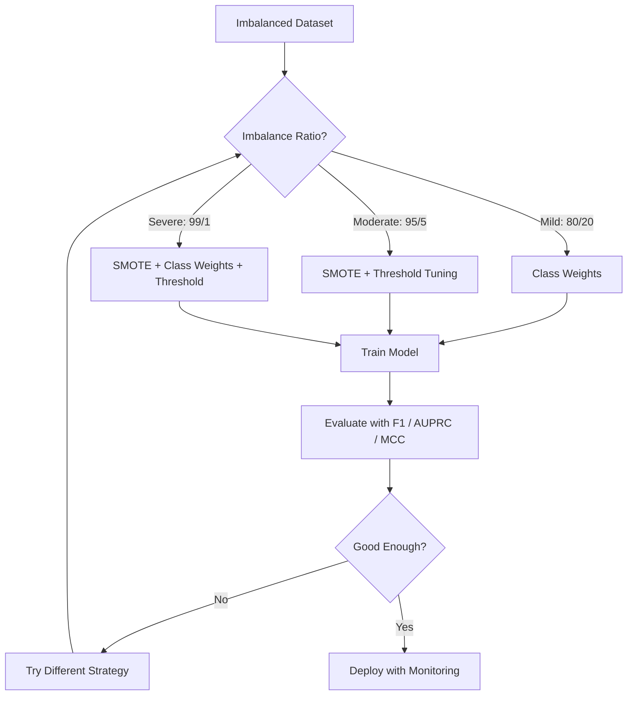
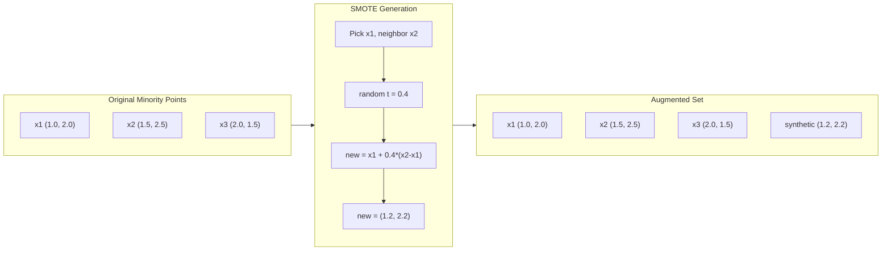
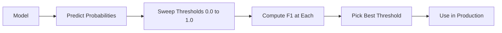
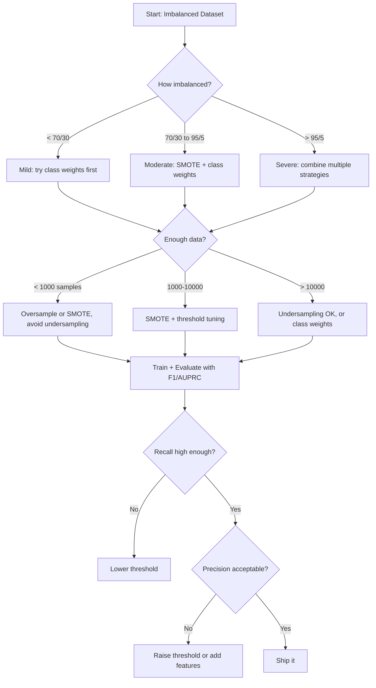

# Obsługa Niezbalansowanych Danych

> Gdy 99% twoich danych to "normalne," dokładność jest kłamstwem.

**Typ:** Build
**Język:** Python
**Wymagania wstępne:** Phase 2, Lessons 01-09 (szczególnie metryki ewaluacji)
**Czas:** ~90 minut

## Cele uczenia się

- Implementacja SMOTE od zera i wyjaśnienie, czym syntetyczne nad próbkowanie różni się od losowego duplikowania
- Ewaluacja klasyfikatorów z niezbalansowanymi danymi przy użyciu F1, AUPRC i współczynnika korelacji Matthewsa zamiast dokładności
- Porównanie wag klas, strojenia progu i strategii ponownego próbkowania oraz wybór odpowiedniego podejścia dla danego współczynnika niezbalansowania
- Zbudowanie kompletnego potoku danych z niezbalansowanymi danymi łączącego SMOTE, wagi klas i optymalizację progu

## Problem

Budujesz model wykrywania oszustw. Osiąga 99,9% dokładności. Świętujesz. Potem uświadamiasz sobie, że przewiduje "nie oszustwo" dla każdej pojedynczej transakcji.

To nie jest błąd. To racjonalna rzecz do zrobienia, gdy tylko 0,1% transakcji jest oszukańczych. Model uczy się, że zawsze zgadywanie klasy większościowej minimalizuje całkowity błąd. Jest technicznie poprawny i całkowicie bezużyteczny.

To dzieje się wszędzie tam, gdzie liczy się prawdziwa klasyfikacja. Diagnoza choroby: 1% pozytywny wynik. Włamanie do sieci: 0,01% ataków. Wady produkcyjne: 0,5% wadliwych. Filtrowanie spamu: 20% spamu. Predykcja rezygnacji: 5% rezygnacji. Im bardziej znacząca jest mniejszościowa klasa, tym rzadziej występuje.

Dokładność zawodzi, ponieważ traktuje wszystkie poprawne predykcje jednakowo. Poprawne oznaczenie legitymacyjnej transakcji i poprawne wykrycie oszustwa oba liczą się jako jeden punkt dokładności. Ale wykrycie oszustwa jest całym powodem istnienia modelu. Potrzebujemy metryk, technik i strategii treningowych, które zmuszą model do zwrócenia uwagi na rzadką, ale ważną klasę.

## Koncepcja

### Dlaczego dokładność zawodzi

Rozważ zbiór danych z 1000 próbek: 990 negatywnych, 10 pozytywnych. Model, który zawsze przewiduje negatywne:

|  | Przewidziano Pozytywne | Przewidziano Negatywne |
|--|---|---|
| Faktycznie Pozytywne | 0 (TP) | 10 (FN) |
| Faktycznie Negatywne | 0 (FP) | 990 (TN) |

Dokładność = (0 + 990) / 1000 = 99,0%

Model nie wykrywa żadnego oszustwa. Żadnej choroby. Żadnych wad. Ale dokładność mówi 99%. Dlatego dokładność jest niebezpieczna dla niezbalansowanych problemów.

### Lepsze metryki

**Precyzja** = TP / (TP + FP). Z wszystkiego oznaczonego jako pozytywne, ile faktycznie jest pozytywnych? Wysoka precyzja oznacza mało fałszywych alarmów.

**Pełność** = TP / (TP + FN). Z wszystkiego faktycznie pozytywnego, ile wykryliśmy? Wysoka pełność oznacza mało przeoczonych pozytywów.

**Wynik F1** = 2 * precyzja * pełność / (precyzja + pełność). Średnia harmoniczna. Kara za ekstremalną nierównowagę między precyzją a pełnością jest większa niż w przypadku średniej arytmetycznej.

**Wynik F-beta** = (1 + beta^2) * precyzja * pełność / (beta^2 * precyzja + pełność). Gdy beta > 1, pełność ma większe znaczenie. Gdy beta < 1, precyzja ma większe znaczenie. F2 jest powszechna w wykrywaniu oszustw (przeoczenie oszustwa jest gorsze niż fałszywy alarm).

**AUPRC** (Pole pod krzywą Precyzja-Pełność). Jak AUC-ROC, ale bardziej informacyjne dla niezbalansowanych danych. Losowy klasyfikator ma AUPRC równy współczynnikowi klasy pozytywnej (nie 0,5 jak ROC). To sprawia, że ulepszenia są łatwiejsze do zaobserwowania.

**Współczynnik korelacji Matthewsa** = (TP * TN - FP * FN) / sqrt((TP+FP)(TP+FN)(TN+FP)(TN+FN)). Zwraca wartości od -1 do +1. Daje wysoki wynik tylko wted, gdy model dobrze radzi sobie z obiema klasami. Zbalansowany nawet gdy klasy mają bardzo różne rozmiary.

Dla modelu "zawsze przewiduj negatywne" powyżej: precyzja = 0/0 (niezdefiniowana, często ustawiana na 0), pełność = 0/10 = 0, F1 = 0, MCC = 0. Te metryki poprawnie identyfikują model jako bezwartościowy.

### Potok danych z niezbalansowanymi danymi



### SMOTE: Syntetyczna technika nad próbkowania mniejszości

Losowe nad próbkowanie duplikuje istniejące próbki mniejszości. To działa, ale grozi przeuczeniem, ponieważ model widzi identyczne punkty wielokrotnie.

SMOTE tworzy nowe syntetyczne próbki mniejszości, które są prawdopodobne, ale nie są kopiami. Algorytm:

1. Dla każdej próbki mniejszości x, znajdź jej k najbliższych sąsiadów wśród innych próbek mniejszości
2. Wybierz jednego sąsiada losowo
3. Utwórz nową próbkę na linii między x a tym sąsiadem

Wzór: `new_sample = x + random(0, 1) * (neighbor - x)`

To interpoluje między prawdziwymi punktami mniejszości, tworząc próbki w tym samym regionie przestrzeni cech bez po prostu kopiowania istniejących danych.



### Porównanie strategii próbkowania

**Losowe nad próbkowanie**: duplikuj próbki mniejszości, aby dopasować liczbę większości.
- Zalety: proste, brak utraty informacji
- Wady: dokładne duplikaty powodują przeuczenie, zwiększa czas treningu

**Losowe pod próbkowanie**: usuń próbki większości, aby dopasować liczbę mniejszości.
- Zalety: szybki trening, proste
- Wady: odrzuca potencjalnie użyteczne dane większości, wyższa wariancja

**SMOTE**: twórz syntetyczne próbki mniejszości przez interpolację.
- Zalety: generuje nowe punkty danych, zmniejsza przeuczenie w porównaniu z losowym nad próbkowaniem
- Wady: może tworzyć szumne próbki blisko granicy decyzyjnej, nie uwzględnia rozkładu klasy większości

| Strategia | Zmienione dane | Ryzyko | Kiedy używać |
|----------|-------------|------|-------------|
| Nad próbkowanie | Mniejszość duplikowana | Przeuczenie | Małe zbiory danych, umiarkowane niezbalansowanie |
| Pod próbkowanie | Większość usunięta | Utrata informacji | Duże zbiory danych, chcesz szybki trening |
| SMOTE | Syntetyczna mniejszość dodana | Szum graniczny | Umiarkowane niezbalansowanie, wystarczająco dużo próbek mniejszości dla k-NN |

### Wagi klas

Zamiast zmieniać dane, zmień sposób, w jaki model traktuje błędy. Przypisz wyższą wagę do błędnie sklasyfikowanej mniejszości.

Dla problemu binarnego z 950 negatywnymi i 50 pozytywnymi próbkami:
- Waga dla klasy negatywnej = n_próbek / (2 * n_negatywnych) = 1000 / (2 * 950) = 0,526
- Waga dla klasy pozytywnej = n_próbek / (2 * n_pozytywnych) = 1000 / (2 * 50) = 10,0

Klasa pozytywna ma 19 razy większą wagę. Błędnie sklasyfikowanie jednej próbki pozytywnej kosztuje tyle, co błędnie sklasyfikowanie 19 próbek negatywnych. Model jest zmuszony zwracać uwagę na klasę mniejszości.

W regresji logistycznej modyfkuje to funkcję straty:

```
weighted_loss = -sum(w_i * [y_i * log(p_i) + (1-y_i) * log(1-p_i)])
```

gdzie w_i zależy od klasy próbki i.

Wagi klas są matematycznie równoważne nad próbkowaniu w oczekiwaniu, ale bez tworzenia nowych punktów danych. To sprawia, że są szybsze i unikają ryzyka przeuczenia z powodu zduplikowanych próbek.

### Strojenie progu

Większość klasyfikatorów wyprowadza prawdopodobieństwo. Domyślny próg to 0,5: jeśli P(pozytywne) >= 0,5, przewiduj pozytywne. Ale 0,5 jest arbitralne. Gdy klasy są niezbalansowane, optymalny próg jest zwykle znacznie niższy.

Proces:
1. Trenuj model
2. Pobierz przewidywane prawdopodobieństwa na zbiorze walidacyjnym
3. Przeglądaj progi od 0,0 do 1,0
4. Oblicz F1 (lub wybraną metrykę) dla każdego progu
5. Wybierz próg, który maksymalizuje twoją metrykę



Model może wyprowadzać P(oszustwo) = 0,15 dla oszukańczej transakcji. Przy progu 0,5 jest to klasyfikowane jako nie oszustwo. Przy progu 0,10 jest poprawnie wykryte. Kalibracja prawdopodobieństwa ma mniejsze znaczenie niż ranking -- o ile oszustwo dostaje wyższe prawdopodobieństwa niż nie-oszustwo, istnieje próg, który je rozdziela.

### Nauka wrażliwa na koszty

Uogólnienie wag klas. Zamiast jednolitych kosztów, przypisz specyficzne koszty błędnej klasyfikacji:

| | Przewidziano Pozytywne | Przewidziano Negatywne |
|--|---|---|
| Faktycznie Pozytywne | 0 (poprawne) | C_FN = 100 |
| Faktycznie Negatywne | C_FP = 1 | 0 (poprawne) |

Pominięcie oszukańczej transakcji (FN) kosztuje 100 razy więcej niż fałszywy alarm (FP). Model optymalizuje całkowity koszt, nie całkowitą liczbę błędów.

To najbardziej zasadne podejście, gdy możesz oszacować rzeczywiste koszty. Przeoczona diagnoza raka ma bardzo inny koszt niż fałszywy alarm prowadzący do dodatkowej biopsji. Jawne określenie tych kosztów wymusza właściwe kompromisy.

### Schemat decyzyjny



## Zbuduj to

### Krok 1: Generowanie niezbalansowanego zbioru danych

```python
import numpy as np


def make_imbalanced_data(n_majority=950, n_minority=50, seed=42):
    rng = np.random.RandomState(seed)

    X_maj = rng.randn(n_majority, 2) * 1.0 + np.array([0.0, 0.0])
    X_min = rng.randn(n_minority, 2) * 0.8 + np.array([2.5, 2.5])

    X = np.vstack([X_maj, X_min])
    y = np.concatenate([np.zeros(n_majority), np.ones(n_minority)])

    shuffle_idx = rng.permutation(len(y))
    return X[shuffle_idx], y[shuffle_idx]
```

### Krok 2: SMOTE od zera

```python
def euclidean_distance(a, b):
    return np.sqrt(np.sum((a - b) ** 2))


def find_k_neighbors(X, idx, k):
    distances = []
    for i in range(len(X)):
        if i == idx:
            continue
        d = euclidean_distance(X[idx], X[i])
        distances.append((i, d))
    distances.sort(key=lambda x: x[1])
    return [d[0] for d in distances[:k]]


def smote(X_minority, k=5, n_synthetic=100, seed=42):
    rng = np.random.RandomState(seed)
    n_samples = len(X_minority)
    k = min(k, n_samples - 1)
    synthetic = []

    for _ in range(n_synthetic):
        idx = rng.randint(0, n_samples)
        neighbors = find_k_neighbors(X_minority, idx, k)
        neighbor_idx = neighbors[rng.randint(0, len(neighbors))]
        t = rng.random()
        new_point = X_minority[idx] + t * (X_minority[neighbor_idx] - X_minority[idx])
        synthetic.append(new_point)

    return np.array(synthetic)
```

### Krok 3: Losowe nad próbkowanie i pod próbkowanie

```python
def random_oversample(X, y, seed=42):
    rng = np.random.RandomState(seed)
    classes, counts = np.unique(y, return_counts=True)
    max_count = counts.max()

    X_resampled = list(X)
    y_resampled = list(y)

    for cls, count in zip(classes, counts):
        if count < max_count:
            cls_indices = np.where(y == cls)[0]
            n_needed = max_count - count
            chosen = rng.choice(cls_indices, size=n_needed, replace=True)
            X_resampled.extend(X[chosen])
            y_resampled.extend(y[chosen])

    X_out = np.array(X_resampled)
    y_out = np.array(y_resampled)
    shuffle = rng.permutation(len(y_out))
    return X_out[shuffle], y_out[shuffle]


def random_undersample(X, y, seed=42):
    rng = np.random.RandomState(seed)
    classes, counts = np.unique(y, return_counts=True)
    min_count = counts.min()

    X_resampled = []
    y_resampled = []

    for cls in classes:
        cls_indices = np.where(y == cls)[0]
        chosen = rng.choice(cls_indices, size=min_count, replace=False)
        X_resampled.extend(X[chosen])
        y_resampled.extend(y[chosen])

    X_out = np.array(X_resampled)
    y_out = np.array(y_resampled)
    shuffle = rng.permutation(len(y_out))
    return X_out[shuffle], y_out[shuffle]
```

### Krok 4: Regresja logistyczna z wagami klas

```python
def sigmoid(z):
    return 1.0 / (1.0 + np.exp(-np.clip(z, -500, 500)))


def logistic_regression_weighted(X, y, weights, lr=0.01, epochs=200):
    n_samples, n_features = X.shape
    w = np.zeros(n_features)
    b = 0.0

    for _ in range(epochs):
        z = X @ w + b
        pred = sigmoid(z)
        error = pred - y
        weighted_error = error * weights

        gradient_w = (X.T @ weighted_error) / n_samples
        gradient_b = np.mean(weighted_error)

        w -= lr * gradient_w
        b -= lr * gradient_b

    return w, b


def compute_class_weights(y):
    classes, counts = np.unique(y, return_counts=True)
    n_samples = len(y)
    n_classes = len(classes)
    weight_map = {}
    for cls, count in zip(classes, counts):
        weight_map[cls] = n_samples / (n_classes * count)
    return np.array([weight_map[yi] for yi in y])
```

### Krok 5: Strojenie progu

```python
def find_optimal_threshold(y_true, y_probs, metric="f1"):
    best_threshold = 0.5
    best_score = -1.0

    for threshold in np.arange(0.05, 0.96, 0.01):
        y_pred = (y_probs >= threshold).astype(int)
        tp = np.sum((y_pred == 1) & (y_true == 1))
        fp = np.sum((y_pred == 1) & (y_true == 0))
        fn = np.sum((y_pred == 0) & (y_true == 1))

        if metric == "f1":
            precision = tp / (tp + fp) if (tp + fp) > 0 else 0.0
            recall = tp / (tp + fn) if (tp + fn) > 0 else 0.0
            score = 2 * precision * recall / (precision + recall) if (precision + recall) > 0 else 0.0
        elif metric == "recall":
            score = tp / (tp + fn) if (tp + fn) > 0 else 0.0
        elif metric == "precision":
            score = tp / (tp + fp) if (tp + fp) > 0 else 0.0

        if score > best_score:
            best_score = score
            best_threshold = threshold

    return best_threshold, best_score
```

### Krok 6: Funkcje ewaluacyjne

```python
def confusion_matrix_values(y_true, y_pred):
    tp = np.sum((y_pred == 1) & (y_true == 1))
    tn = np.sum((y_pred == 0) & (y_true == 0))
    fp = np.sum((y_pred == 1) & (y_true == 0))
    fn = np.sum((y_pred == 0) & (y_true == 1))
    return tp, tn, fp, fn


def compute_metrics(y_true, y_pred):
    tp, tn, fp, fn = confusion_matrix_values(y_true, y_pred)
    accuracy = (tp + tn) / (tp + tn + fp + fn)
    precision = tp / (tp + fp) if (tp + fp) > 0 else 0.0
    recall = tp / (tp + fn) if (tp + fn) > 0 else 0.0
    f1 = 2 * precision * recall / (precision + recall) if (precision + recall) > 0 else 0.0

    denom = np.sqrt(float((tp + fp) * (tp + fn) * (tn + fp) * (tn + fn)))
    mcc = (tp * tn - fp * fn) / denom if denom > 0 else 0.0

    return {
        "accuracy": accuracy,
        "precision": precision,
        "recall": recall,
        "f1": f1,
        "mcc": mcc,
    }
```

### Krok 7: Porównanie wszystkich podejść

```python
X, y = make_imbalanced_data(950, 50, seed=42)
split = int(0.8 * len(y))
X_train, X_test = X[:split], X[split:]
y_train, y_test = y[:split], y[split:]

# Baseline: no treatment
w_base, b_base = logistic_regression_weighted(
    X_train, y_train, np.ones(len(y_train)), lr=0.1, epochs=300
)
probs_base = sigmoid(X_test @ w_base + b_base)
preds_base = (probs_base >= 0.5).astype(int)

# Oversampled
X_over, y_over = random_oversample(X_train, y_train)
w_over, b_over = logistic_regression_weighted(
    X_over, y_over, np.ones(len(y_over)), lr=0.1, epochs=300
)
preds_over = (sigmoid(X_test @ w_over + b_over) >= 0.5).astype(int)

# SMOTE
minority_mask = y_train == 1
X_minority = X_train[minority_mask]
synthetic = smote(X_minority, k=5, n_synthetic=len(y_train) - 2 * int(minority_mask.sum()))
X_smote = np.vstack([X_train, synthetic])
y_smote = np.concatenate([y_train, np.ones(len(synthetic))])
w_sm, b_sm = logistic_regression_weighted(
    X_smote, y_smote, np.ones(len(y_smote)), lr=0.1, epochs=300
)
preds_smote = (sigmoid(X_test @ w_sm + b_sm) >= 0.5).astype(int)

# Class weights
sample_weights = compute_class_weights(y_train)
w_cw, b_cw = logistic_regression_weighted(
    X_train, y_train, sample_weights, lr=0.1, epochs=300
)
probs_cw = sigmoid(X_test @ w_cw + b_cw)
preds_cw = (probs_cw >= 0.5).astype(int)

# Threshold tuning (tune on held-out validation set, not test set)
probs_val = sigmoid(X_val @ w_cw + b_cw)
best_thresh, best_f1 = find_optimal_threshold(y_val, probs_val, metric="f1")
preds_thresh = (probs_cw >= best_thresh).astype(int)
```

Ten skrypt uruchamia wszystko w jednym pliku i drukuje wyniki.

## Zastosuj to

Z scikit-learn i imbalanced-learn, te techniki to jednolinijkowce:

```python
from sklearn.linear_model import LogisticRegression
from sklearn.metrics import classification_report, f1_score
from sklearn.model_selection import train_test_split
from imblearn.over_sampling import SMOTE
from imblearn.under_sampling import RandomUnderSampler
from imblearn.pipeline import Pipeline

X_train, X_test, y_train, y_test = train_test_split(X, y, stratify=y)

model_weighted = LogisticRegression(class_weight="balanced")
model_weighted.fit(X_train, y_train)
print(classification_report(y_test, model_weighted.predict(X_test)))

smote = SMOTE(random_state=42)
X_resampled, y_resampled = smote.fit_resample(X_train, y_train)
model_smote = LogisticRegression()
model_smote.fit(X_resampled, y_resampled)
print(classification_report(y_test, model_smote.predict(X_test)))

pipeline = Pipeline([
    ("smote", SMOTE()),
    ("model", LogisticRegression(class_weight="balanced")),
])
pipeline.fit(X_train, y_train)
print(classification_report(y_test, pipeline.predict(X_test)))
```

Implementacje od zera pokazują dokładnie, co każda technika robi. SMOTE to tylko interpolacja k-NN na klasie mniejszości. Wagi klas mnożą stratę. Strojenie progu to pętla for przez progi odcięcia. Bez magii.

## Wdrożenie

Ta lekcja produkuje:
- `outputs/skill-imbalanced-data.md` -- lista kontrolna decyzji do obsługi problemów klasyfikacji z niezbalansowanymi danymi

## Ćwiczenia

1. **Borderline-SMOTE**: Zmodyfikuj implementację SMOTE, aby generować syntetyczne próbki tylko dla punktów mniejszości blisko granicy decyzyjnej (tych, których k-najbliższych sąsiadów obejmuje próbki klasy większości). Porównaj wyniki ze standardowym SMOTE na zbiorze danych, gdzie klasy się nakładają.

2. **Optymalizacja macierzy kosztów**: Zaimplementuj naukę wrażliwą na koszty, gdzie macierz kosztów jest parametrem. Stwórz funkcję, która przyjmuje macierz kosztów i zwraca optymalne predykcje minimalizujące oczekiwany koszt. Testuj z różnymi współczynnikami kosztów (1:10, 1:100, 1:1000) i wykreśl, jak zmienia się kompromis precyzja-pełność.

3. **Kalibracja progu**: Zaimplementuj skalowanie Platta (dopasuj regresję logistyczną na surowych wyjściach modelu, aby produkować skalibrowane prawdopodobieństwa). Porównaj krzywą precyzja-pełność przed i po kalibracji. Pokaż, że kalibracja nie zmienia rankingu (AUC pozostaje takie samo), ale czyni prawdopodobieństwa bardziej znaczącymi.

4. **Ensembling z zbalansowanym baggingiem**: Trenuj wiele modeli, każdy na zbalansowanej próbce bootstrap (wszystkie mniejszości + losowy podzbiór większości). Uśrednij ich predykcje. Porównaj to podejście z pojedynczym modelem z SMOTE. Mierz zarówno wydajność, jak i wariancję między uruchomieniami.

5. **Eksperyment ze współczynnikiem niezbalansowania**: Weź zbalansowany zbiór danych i progresywnie zwiększaj współczynnik niezbalansowania (50/50, 70/30, 90/10, 95/5, 99/1). Dla każdego współczynnika trenuj z i bez SMOTE. Wykreśl F1 vs współczynnik niezbalansowania dla obu podejść. Przy jakim współczynniku SMOTE zaczyna mieć znaczącą różnicę?

## Kluczowe pojęcia

| Term | Co ludzie mówią | Co to faktycznie oznacza |
|------|----------------|----------------------|
| Class imbalance | "Jedna klasa ma dużo więcej próbek" | Rozkład klas w zbiorze danych jest znacząco skośny, powodując, że modele faworyzują klasę większościową |
| SMOTE | "Syntetyczne nad próbkowanie" | Tworzy nowe próbki mniejszości przez interpolację między istniejącymi próbkami mniejszości a ich k-najbliższymi sąsiadami mniejszości |
| Class weights | "Błędy na rzadkich klasach są droższe" | Mnożenie funkcji straty przez wagi specyficzne dla klas, aby model karał błędną klasyfikację mniejszości bardziej |
| Threshold tuning | "Przesuwanie granicy decyzyjnej" | Zmiana progu prawdopodobieństwa dla klasyfikacji z domyślnego 0,5 na wartość optymalizującą pożądaną metrykę |
| Precision-recall tradeoff | "Nie możesz mieć obu" | Obniżenie progu wykrywa więcej pozytywów (wyższa pełność), ale także oznacza więcej fałszywych pozytywów (niższa precyzja), i odwrotnie |
| AUPRC | "Pole pod krzywą PR" | Sumaryzuje krzywą precyzja-pełność w jedną liczbę; bardziej informacyjne niż AUC-ROC, gdy klasy są mocno niezbalansowane |
| Matthews Correlation Coefficient | "Zbalansowana metryka" | Korelacja między przewidywanymi a rzeczywistymi etykietami, która produkuje wysoki wynik tylko wted, gdy model dobrze radzi sobie z obiema klasami |
| Cost-sensitive learning | "Różne błędy kosztują różne kwoty" | Włączanie rzeczywistych kosztów błędnej klasyfikacji do celu treningowego, aby model optymalizował całkowity koszt, nie liczbę błędów |
| Random oversampling | "Duplikuj mniejszość" | Powtarzanie próbek klasy mniejszości, aby zbalansować liczby klas; proste, ale grozi przeuczeniem na zduplikowanych punktach |

## Dalsze materiały do czytania

- [SMOTE: Synthetic Minority Over-sampling Technique (Chawla et al., 2002)](https://arxiv.org/abs/1106.1813) -- oryginalny artykuł o SMOTE, wciąż najczęściej cytowana praca o niezbalansowanej nauce
- [Learning from Imbalanced Data (He & Garcia, 2009)](https://ieeexplore.ieee.org/document/5128907) -- kompleksowy przegląd obejmujący próbkowanie, podejścia wrażliwe na koszty i algorytmiczne
- [imbalanced-learn documentation](https://imbalanced-learn.org/stable/) -- biblioteka Python z wariantami SMOTE, strategiami pod próbkowania i integracją potoków
- [The Precision-Recall Plot Is More Informative than the ROC Plot (Saito & Rehmsmeier, 2015)](https://journals.plos.org/plosone/article?id=10.1371/journal.pone.0118432) -- kiedy i dlaczego preferować krzywe PR nad krzywymi ROC dla niezbalansowanych problemów