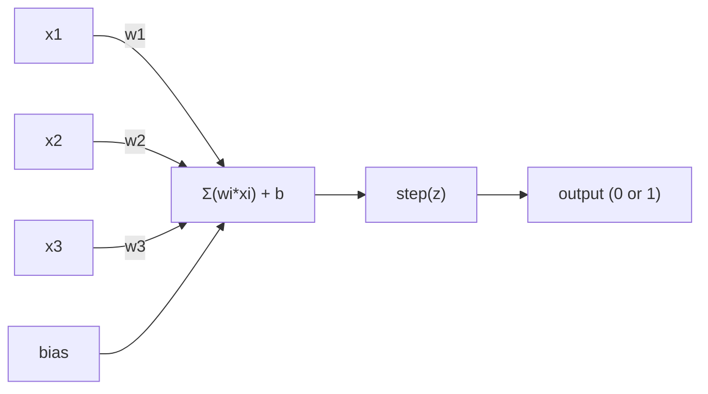
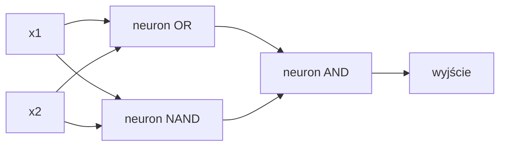

# Perceptron

> Perceptron jest atomem sieci neuronowych. Rozłup go, a znajdziesz wagi, bias i decyzję.

**Typ:** Build
**Języki:** Python
**Wymagania wstępne:** Phase 1 (Intuicja algebry liniowej)
**Szacowany czas:** ~60 minut

## Cele uczenia się

- Zaimplementuj perceptron od zera w Pythonie, w tym regułę aktualizacji wag i funkcję aktywacji step
- Wyjaśnij, dlaczego pojedynczy perceptron może rozwiązywać tylko problemy liniowo separowalne i zademonstruj przypadek niepowodzenia XOR
- Skonstruuj wielowarstwowy perceptron poprzez kompozycję bramek OR, NAND i AND, aby rozwiązać XOR
- Wytrenuj dwuwarstwową sieć z aktywacją sigmoid i backpropagation, aby automatycznie nauczyć się XOR

## Problem

Wiesz, czym są wektory i iloczyny skalarne. Wiesz, że macierz przekształca wejścia w wyjścia. Ale jak maszyna *uczy się*, które przekształcenie zastosować?

Perceptron na to odpowiada. To najprostsza możliwa maszyna ucząca się: weź pewne wejścia, pomnóż przez wagi, dodaj bias, podejmij binarną decyzję. Potem dostosuj. I tyle. Każda sieć neuronowa kiedykolwiek zbudowana to warstwy tego pomysłu ułożone razem.

Zrozumienie perceptronu oznacza zrozumienie, co "uczenie się" faktycznie oznacza w kodzie: dostosowywanie liczb, aż wyjście będzie zgodne z rzeczywistością.

## Koncepcja

### Jeden neuron, jedna decyzja

Perceptron przyjmuje n wejść, mnoży każde przez wagę, sumuje je, dodaje bias i przepuszcza wynik przez funkcję aktywacji.



Funkcja step jest brutalna: jeśli suma ważona plus bias jest >= 0, wyjście to 1. W przeciwnym razie 0.

```
step(z) = 1  if z >= 0
           0  if z < 0
```

To jest klasyfikator liniowy. Wagi i bias definiują linię (lub hiperpłaszczyznę w wyższych wymiarach), która dzieli przestrzeń wejściową na dwa regiony.

### Granica decyzji

Dla dwóch wejść, perceptron rysuje linię przez przestrzeń 2D:

```
  x2
  ┤
  │  Klasa 1        /
  │    (0)          /
  │                /
  │               / w1·x1 + w2·x2 + b = 0
  │              /
  │             /     Klasa 2
  │            /        (1)
  ┼───────────/──────────── x1
```

Wszystko po jednej stronie linii daje wyjście 0. Wszystko po drugiej stronie daje wyjście 1. Trenowanie przesuwa tę linię, aż poprawnie separuje klasy.

### Reguła uczenia

Reguła uczenia perceptronu jest prosta:

```
Dla każdego przykładu treningowego (x, y_true):
    y_pred = predict(x)
    error = y_true - y_pred

    Dla każdej wagi:
        w_i = w_i + learning_rate * error * x_i
    bias = bias + learning_rate * error
```

Jeśli predykcja jest poprawna, error = 0, nic się nie zmienia. Jeśli przewiduje 0, a powinno być 1, wagi rosną. Jeśli przewiduje 1, a powinno być 0, wagi maleją. Learning rate kontroluje, jak duża jest każda korekta.

### Problem XOR

Oto gdzie to się psuje. Spójrz na te bramki logiczne:

```
Bramka AND:         Bramka OR:          Bramka XOR:
x1  x2  wyj         x1  x2  wyj         x1  x2  wyj
0   0   0           0   0   0           0   0   0
0   1   0           0   1   1           0   1   1
1   0   0           1   0   1           1   0   1
1   1   1           1   1   1           1   1   0
```

AND i OR są liniowo separowalne: możesz narysować pojedynczą linię, aby oddzielić 0 od 1. XOR nie jest. Żadna pojedyncza linia nie może oddzielić [0,1] i [1,0] od [0,0] i [1,1].

```
AND (separowalne):      XOR (nie separowalne):

  x2                      x2
  1 ┤  0     1            1 ┤  1     0
    │     /                 │
  0 ┤  0 / 0              0 ┤  0     1
    ┼──/──────── x1         ┼──────────── x1
       linia działa!        żadna pojedyncza linia nie działa!
```

To jest fundamentalne ograniczenie. Pojedynczy perceptron może rozwiązywać tylko liniowo separowalne problemy. Minsky i Papert udowodnili to w 1969 i to prawie zabiło badania nad sieciami neuronowymi na dekadę.

Rozwiązanie: układaj perceptrony w warstwy. Wielowarstwowy perceptron może rozwiązać XOR poprzez połączenie dwóch liniowych decyzji w jedną nieliniową.

## Zbuduj to

### Krok 1: Klasa Perceptron

```python
class Perceptron:
    def __init__(self, n_inputs, learning_rate=0.1):
        self.weights = [0.0] * n_inputs
        self.bias = 0.0
        self.lr = learning_rate

    def predict(self, inputs):
        total = sum(w * x for w, x in zip(self.weights, inputs))
        total += self.bias
        return 1 if total >= 0 else 0

    def train(self, training_data, epochs=100):
        for epoch in range(epochs):
            errors = 0
            for inputs, target in training_data:
                prediction = self.predict(inputs)
                error = target - prediction
                if error != 0:
                    errors += 1
                    for i in range(len(self.weights)):
                        self.weights[i] += self.lr * error * inputs[i]
                    self.bias += self.lr * error
            if errors == 0:
                print(f"Zbieżność w epoce {epoch + 1}")
                return
        print(f"Nie zbieżono po {epochs} epokach")
```

### Krok 2: Trenuj na bramkach logicznych

```python
and_data = [
    ([0, 0], 0),
    ([0, 1], 0),
    ([1, 0], 0),
    ([1, 1], 1),
]

or_data = [
    ([0, 0], 0),
    ([0, 1], 1),
    ([1, 0], 1),
    ([1, 1], 1),
]

not_data = [
    ([0], 1),
    ([1], 0),
]

print("=== Bramka AND ===")
p_and = Perceptron(2)
p_and.train(and_data)
for inputs, _ in and_data:
    print(f"  {inputs} -> {p_and.predict(inputs)}")

print("\n=== Bramka OR ===")
p_or = Perceptron(2)
p_or.train(or_data)
for inputs, _ in or_data:
    print(f"  {inputs} -> {p_or.predict(inputs)}")

print("\n=== Bramka NOT ===")
p_not = Perceptron(1)
p_not.train(not_data)
for inputs, _ in not_data:
    print(f"  {inputs} -> {p_not.predict(inputs)}")
```

### Krok 3: Obserwuj jak XOR zawodzi

```python
xor_data = [
    ([0, 0], 0),
    ([0, 1], 1),
    ([1, 0], 1),
    ([1, 1], 0),
]

print("\n=== Bramka XOR (pojedynczy perceptron) ===")
p_xor = Perceptron(2)
p_xor.train(xor_data, epochs=1000)
for inputs, expected in xor_data:
    result = p_xor.predict(inputs)
    status = "OK" if result == expected else "ŹLE"
    print(f"  {inputs} -> {result} (oczekiwano {expected}) {status}")
```

Nigdy nie zbiegnie. To jest twardy dowód, że pojedynczy perceptron nie może nauczyć się XOR.

### Krok 4: Rozwiąż XOR z dwoma warstwami

Sztuczka: XOR = (x1 LUB x2) ORAZ NIE (x1 AND x2). Połącz trzy perceptrony:



```python
def xor_network(x1, x2):
    or_neuron = Perceptron(2)
    or_neuron.weights = [1.0, 1.0]
    or_neuron.bias = -0.5

    nand_neuron = Perceptron(2)
    nand_neuron.weights = [-1.0, -1.0]
    nand_neuron.bias = 1.5

    and_neuron = Perceptron(2)
    and_neuron.weights = [1.0, 1.0]
    and_neuron.bias = -1.5

    hidden1 = or_neuron.predict([x1, x2])
    hidden2 = nand_neuron.predict([x1, x2])
    output = and_neuron.predict([hidden1, hidden2])
    return output


print("\n=== Bramka XOR (sieć wielowarstwowa) ===")
for inputs, expected in xor_data:
    result = xor_network(inputs[0], inputs[1])
    print(f"  {inputs} -> {result} (oczekiwano {expected})")
```

Wszystkie cztery przypadki poprawne. Układanie perceptronów w warstwy tworzy granice decyzji, których żaden pojedynczy perceptron nie może wygenerować.

### Krok 5: Wytrenuj dwuwarstwową sieć

Krok 4 ręcznie podłączył wagi. To działa dla XOR, ale nie dla prawdziwych problemów, gdzie nie znasz wag z góry. Rozwiązanie: zastąp funkcję step sigmoidalną i ucz wagi automatycznie poprzez backpropagation.

```python
class TwoLayerNetwork:
    def __init__(self, learning_rate=0.5):
        import random
        random.seed(0)
        self.w_hidden = [[random.uniform(-1, 1), random.uniform(-1, 1)] for _ in range(2)]
        self.b_hidden = [random.uniform(-1, 1), random.uniform(-1, 1)]
        self.w_output = [random.uniform(-1, 1), random.uniform(-1, 1)]
        self.b_output = random.uniform(-1, 1)
        self.lr = learning_rate

    def sigmoid(self, x):
        import math
        x = max(-500, min(500, x))
        return 1.0 / (1.0 + math.exp(-x))

    def forward(self, inputs):
        self.inputs = inputs
        self.hidden_outputs = []
        for i in range(2):
            z = sum(w * x for w, x in zip(self.w_hidden[i], inputs)) + self.b_hidden[i]
            self.hidden_outputs.append(self.sigmoid(z))
        z_out = sum(w * h for w, h in zip(self.w_output, self.hidden_outputs)) + self.b_output
        self.output = self.sigmoid(z_out)
        return self.output

    def train(self, training_data, epochs=10000):
        for epoch in range(epochs):
            total_error = 0
            for inputs, target in training_data:
                output = self.forward(inputs)
                error = target - output
                total_error += error ** 2

                d_output = error * output * (1 - output)

                saved_w_output = self.w_output[:]
                hidden_deltas = []
                for i in range(2):
                    h = self.hidden_outputs[i]
                    hd = d_output * saved_w_output[i] * h * (1 - h)
                    hidden_deltas.append(hd)

                for i in range(2):
                    self.w_output[i] += self.lr * d_output * self.hidden_outputs[i]
                self.b_output += self.lr * d_output

                for i in range(2):
                    for j in range(len(inputs)):
                        self.w_hidden[i][j] += self.lr * hidden_deltas[i] * inputs[j]
                    self.b_hidden[i] += self.lr * hidden_deltas[i]
```

```python
net = TwoLayerNetwork(learning_rate=2.0)
net.train(xor_data, epochs=10000)
for inputs, expected in xor_data:
    result = net.forward(inputs)
    predicted = 1 if result >= 0.5 else 0
    print(f"  {inputs} -> {result:.4f} (zaokrąglone: {predicted}, oczekiwano {expected})")
```

Dwie kluczowe różnice w stosunku do Kroku 4. Po pierwsze, sigmoid zastępuje funkcję step — jest gładka, więc istnieją gradienty. Po drugie, metoda `train` propaguje błąd wstecz od wyjścia do warstwy ukrytej, dostosowując każdą wagę proporcjonalnie do jej wkładu w błąd. To jest backpropagation w 20 liniach.

To jest most do Lekcji 03. Matematyka stojąca za `d_output` i `hidden_deltas` to reguła łańcuchowa zastosowana do grafu sieci. Wyprowadzimy to tam właściwie.

## Użyj tego

Wszystko, co właśnie zbudowałeś od zera, istnieje w jednym imporcie:

```python
from sklearn.linear_model import Perceptron as SkPerceptron
import numpy as np

X = np.array([[0,0],[0,1],[1,0],[1,1]])
y = np.array([0, 0, 0, 1])

clf = SkPerceptron(max_iter=100, tol=1e-3)
clf.fit(X, y)
print([clf.predict([x])[0] for x in X])
```

Pięć linii. Twoja klasa Perceptron z 30 liniami robi to samo. Wersja sklearn dodaje sprawdzanie zbieżności, wiele funkcji strat i obsługę rzadkich danych wejściowych — ale główna pętla jest identyczna: suma ważona, funkcja step, aktualizacja wag przy błędzie.

Prawdziwa różnica pokazuje się przy skali. Co się zmienia w produkcyjnych sieciach:

- Funkcja step staje się sigmoid, ReLU lub innymi gładkimi aktywacjami
- Wagi są uczone automatycznie poprzez backpropagation (Lekcja 03)
- Warstwy stają się głębsze: 3, 10, 100+ warstw
- Ta sama zasada obowiązuje: każda warstwa tworzy nowe cechy z wyjść poprzedniej warstwy

Pojedynczy perceptron może rysować tylko proste linie. Ułóż je w stos, a możesz narysować dowolny kształt.

## Wyślij to

Ta lekcja tworzy:
- `outputs/skill-perceptron.md` — skill obejmujący przypadki, gdy potrzebne są architektury jednowarstwowe vs wielowarstwowe

## Ćwiczenia

1. Wytrenuj perceptron na bramce NAND (bramka uniwersalna — każdy obwód logiczny może być zbudowany z NAND). Zweryfikuj, że jego wagi i bias tworzą prawidłową granicę decyzji.
2. Zmodyfikuj klasę Perceptron, aby śledziła granicę decyzji (w1*x1 + w2*x2 + b = 0) w każdej epoce. Wydrukuj, jak linia przesuwa się podczas treningu na bramce AND.
3. Zbuduj perceptron z 3 wejściami, który wyprowadza 1 tylko wtedy, gdy co najmniej 2 z 3 wejść to 1 (funkcja głosowania większościowego). Czy to jest liniowo separowalne? Dlaczego?

## Kluczowe terminy

| Termin | Co ludzie mówią | Co to faktycznie oznacza |
|--------|----------------|----------------------|
| Perceptron | "Sztuczny neuron" | Klasyfikator liniowy: iloczyn skalarny wejść i wag, plus bias, przez funkcję step |
| Weight (waga) | "Jak ważne jest wejście" | Mnożnik, który skaluje wkład każdego wejścia w decyzję |
| Bias | "Próg" | Stała, która przesuwa granicę decyzji, pozwalając perceptronowi "strzelić" nawet przy zerowych wejściach |
| Funkcja aktywacji | "To, co ściska wartości" | Funkcja stosowana po sumie ważonej — funkcja step dla perceptronów, sigmoid/ReLU dla nowoczesnych sieci |
| Liniowo separowalny | "Możesz narysować między nimi linię" | Dataset, gdzie pojedyncza hiperpłaszczyzna może idealnie separować klasy |
| Problem XOR | "To, czego perceptrony nie potrafią" | Dowód, że sieci jednowarstwowe nie mogą uczyć się funkcji nieliniowo separowalnych |
| Granica decyzji | "Gdzie klasyfikator się przełącza" | Hiperpłaszczyzna w*x + b = 0, która dzieli przestrzeń wejściową na dwie klasy |
| Wielowarstwowy perceptron | "Prawdziwa sieć neuronowa" | Perceptrony ułożone w warstwy, gdzie wyjście każdej warstwy zasila wejście następnej warstwy |

## Dalsze czytanie

- Frank Rosenblatt, "The Perceptron: A Probabilistic Model for Information Storage and Organization in the Brain" (1958) — oryginalny artykuł, który to wszystko zaczął
- Minsky & Papert, "Perceptrons" (1969) — książka, która udowodniła, że XOR jest nierozwiązywalne przez sieci jednowarstwowe i zabiła badania nad perceptronami na dekadę
- Michael Nielsen, "Neural Networks and Deep Learning", Chapter 1 — darmowe online, najlepsze wizualne wytłumaczenie, jak perceptrony składają się w sieci