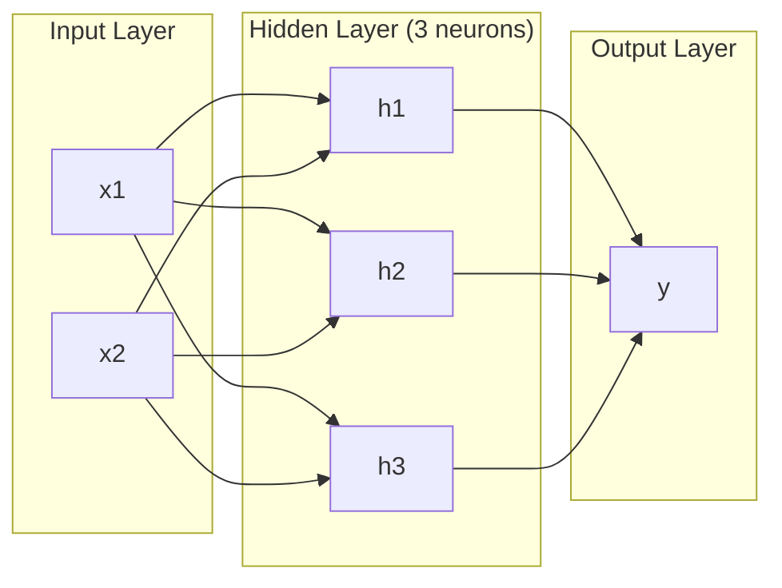
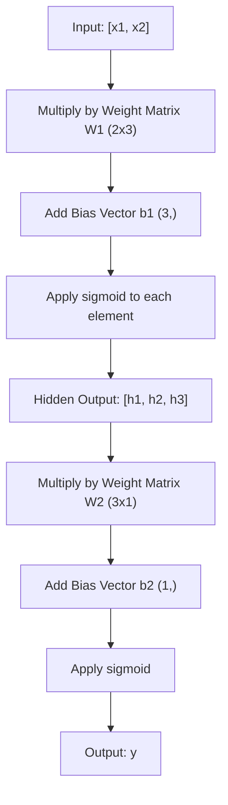
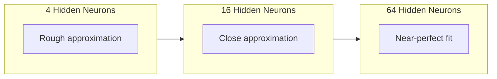

# Sieci wielowarstwowe i forward pass

> Jeden neuron rysuje linię. Ułóż je w stos, a narysujesz wszystko.

**Typ:** Build
**Języki:** Python
**Wymagania wstępne:** Phase 01 (Math Foundations), Lesson 03.01 (The Perceptron)
**Szacowany czas:** ~90 minut

## Cele uczenia się

- Zbudować sieć wielowarstwową od podstaw z klasami Layer i Network, które wykonują kompletny forward pass
- Śledzić wymiary macierzy przez każdą warstwę sieci i identyfikować niezgodności kształtów
- Wyjaśnić, jak nakładanie nieliniowych aktywacji umożliwia sieci naukę krzywych granic decyzyjnych
- Rozwiązać problem XOR używając architektury 2-2-1 z ręcznie dostrojonymi wagami sigmoidalnymi

## Problem

Pojedynczy neuron rysuje linię. I tyle. Jedną prostą linię przez twoje dane. Każdy prawdziwy problem w AI -- rozpoznawanie obrazów, rozumienie języka, granie w Go -- wymaga krzywych. Składanie neuronów w warstwy to sposób, w jaki uzyskujesz krzywe.

W 1969 roku Minsky i Papert udowodnili, że to ograniczenie było fatalne: sieć jednowarstwowa nie może nauczyć się XOR. Nie "trudno się uczy" -- matematycznie nie jest to możliwe. Tablica prawdy XOR umieszcza [0,1] i [1,0] po jednej stronie, [0,0] i [1,1] po drugiej. Żadna pojedyncza linia ich nie rozdziela.

To zabiło finansowanie sieci neuronowych na ponad dekadę. Rozwiązanie było oczywiste z perspektywy czasu: przestać używać jednej warstwy. Składać neurony w warstwy. Pozwolić, by pierwsza warstwa dzieliła przestrzeń wejściową na nowe cechy, a druga warstwa łączyła te cechy w decyzje, których żadna pojedyncza linia nie mogłaby podjąć.

Ten stos to sieć wielowarstwowa. Jest ona fundamentem każdego modelu deep learningu w produkcji dzisiaj. Forward pass -- dane przepływające od wejścia przez warstwy ukryte do wyjścia -- to pierwsza rzecz, którą musisz zbudować, zanim cokolwiek innego zadziała.

## Koncepcja

### Warstwy: Wejście, Ukryte, Wyjście

Sieć wielowarstwowa ma trzy typy warstw:

**Warstwa wejściowa** -- właściwie nie jest warstwą. Przechowuje twoje surowe dane. Dwie cechy oznaczają dwa węzły wejściowe. Żadna kalkulacja tu nie zachodzi.

**Warstwy ukryte** -- tutaj odbywa się praca. Każdy neuron pobiera każde wyjście z poprzedniej warstwy, stosuje wagi i bias, a następnie przepuszcza wynik przez funkcję aktywacji. "Ukryte" bo nigdy nie widzisz tych wartości bezpośrednio w danych treningowych.

**Warstwa wyjściowa** -- ostateczna odpowiedź. Dla binary classification, jeden neuron z sigmoidą. Dla multi-class, jeden neuron na klasę.



To jest sieć 2-3-1. Dwa wejścia, trzy neurony ukryte, jedno wyjście. Każde połączenie niesie wagę. Każdy neuron (oprócz wejściowego) niesie bias.

Każda warstwa produkuje wektor liczb zwany hidden state. Dla tekstu, hidden states zwiększają wymiarowość -- kodując słowo jako 768 liczb, by uchwycić semantyczne znaczenie. Dla obrazów, zmniejszają wymiarowość -- kompresując miliony pikseli do zwięzłej reprezentacji. Hidden state to miejsce, gdzie żyje nauka.

### Neurony i aktywacje

Każdy neuron wykonuje trzy rzeczy:

1. Mnoży każde wejście przez jego odpowiadającą wagę
2. Sumuje wszystkie iloczyny i dodaje bias
3. Przepuszcza sumę przez funkcję aktywacji

Na razie aktywacja to sigmoida:

```
sigmoid(z) = 1 / (1 + e^(-z))
```

Sigmoida ściska dowolną liczbę w zakres (0, 1). Duże wartości dodatnie pchają toward 1. Duże wartości ujemne pchają toward 0. Zero mapuje do 0.5. Ta gładka krzywa jest tym, co umożliwia naukę -- w przeciwieństwie do twardego skoku perceptronu, sigmoida ma gradient wszędzie.

### Forward pass: jak przepływają dane

Forward pass przepycha dane wejściowe przez sieć, warstwa po warstwie, aż dotrą do wyjścia. Podczas forward passa nie zachodzi żadna nauka. To czysta kalkulacja: mnożenie, dodawanie, aktywacja, powtórzenie.



W każdej warstwie zachodzą trzy operacje sekwencyjnie:

```
z = W * input + b       (linear transformation)
a = sigmoid(z)           (activation)
```

Wyjście jednej warstwy staje się wejściem następnej. To jest cały forward pass.

### Wymiary macierzy

Śledzenie wymiarów to najważniejsza umiejętność debugowania w deep learningu. Oto sieć 2-3-1:

| Krok | Operacja | Wymiary | Kształt wyniku |
|------|----------|---------|----------------|
| Wejście | x | -- | (2,) |
| Ukryta liniowa | W1 * x + b1 | W1: (3, 2), b1: (3,) | (3,) |
| Ukryta aktywacja | sigmoid(z1) | -- | (3,) |
| Wyjście liniowe | W2 * h + b2 | W2: (1, 3), b2: (1,) | (1,) |
| Wyjście aktywacja | sigmoid(z2) | -- | (1,) |

Reguła: macierz wag W w warstwie k ma kształt (neurons_in_layer_k, neurons_in_layer_k_minus_1). Wiersze odpowiadają bieżącej warstwie. Kolumny odpowiadają poprzedniej warstwie. Jeśli kształty się nie zgadzają, masz bug.

### Twierdzenie o uniwersalnej aproksymacji

W 1989 roku George Cybenko udowodnił coś niezwykłego: sieć neuronowa z jedną warstwą ukrytą i wystarczającą liczbą neuronów może aproksymować dowolną ciągłą funkcję do dowolnej żądanej dokładności.

To nie oznacza, że jedna warstwa ukryta jest zawsze najlepsza. Oznacza to, że architektura jest teoretycznie zdolna. W praktyce głębsze sieci (więcej warstw, mniej neuronów na warstwę) uczą się tych samych funkcji z znacznie mniejszą całkowitą liczbą parametrów niż płaskie-szerokie sieci. Dlatego deep learning działa.

Intuicja: każdy neuron w warstwie ukrytej uczy się jednego "garbu" lub cechy. Wystarczająco dużo garbów umieszczonych we właściwych lokalizacjach może aproksymować dowolną gładką krzywą. Więcej neuronów, więcej garbów, lepsza aproksymacja.



### Składność

Sieci neuronowe są składne. Możesz je stackować, łączyć w łańcuchy, uruchamiać równolegle. Model Whisper używa sieci enkoderowej do przetwarzania audio i osobnej sieci dekoderowej do generowania tekstu. Nowoczesne LLM-y to dekodery-only. BERT to enkoder-only. T5 to enkoder-dekoder. Wybór architektury definiuje, co model może robić.

## Zbuduj to

Czysty Python. Bez numpy. Każda operacja macierzowa napisana od zera.

### Krok 1: Funkcja aktywacji sigmoid

```python
import math

def sigmoid(x):
    x = max(-500.0, min(500.0, x))
    return 1.0 / (1.0 + math.exp(-x))
```

Clamp do [-500, 500] zapobiega overflow. `math.exp(500)` jest duże, ale skończone. `math.exp(1000)` to nieskończoność.

### Krok 2: Klasa Layer

Najważniejsza operacja w całym deep learningu to mnożenie macierzy. Każda warstwa, każda głowa attention, każdy forward pass -- to matmule całą drogę w dół. Warstwa liniowa pobiera wektor wejściowy, mnoży go przez macierz wag i dodaje wektor bias: y = Wx + b. To pojedyncze równanie to 90% obliczeń w sieci neuronowej.

Warstwa trzyma macierz wag i wektor bias. Jej metoda forward pobiera wektor wejściowy i zwraca aktywowane wyjście.

```python
class Layer:
    def __init__(self, n_inputs, n_neurons, weights=None, biases=None):
        if weights is not None:
            self.weights = weights
        else:
            import random
            self.weights = [
                [random.uniform(-1, 1) for _ in range(n_inputs)]
                for _ in range(n_neurons)
            ]
        if biases is not None:
            self.biases = biases
        else:
            self.biases = [0.0] * n_neurons

    def forward(self, inputs):
        self.last_input = inputs
        self.last_output = []
        for neuron_idx in range(len(self.weights)):
            z = sum(
                w * x for w, x in zip(self.weights[neuron_idx], inputs)
            )
            z += self.biases[neuron_idx]
            self.last_output.append(sigmoid(z))
        return self.last_output
```

Macierz wag ma kształt (n_neurons, n_inputs). Każdy wiersz to wagi jednego neuronu dla wszystkich wejść. Metoda forward przechodzi przez neurony, oblicza ważoną sumę plus bias, stosuje sigmoidę i zbiera wyniki.

### Krok 3: Klasa Network

Sieć to lista warstw. Forward pass łączy je w łańcuch: wyjście warstwy k zasila wejście warstwy k+1.

```python
class Network:
    def __init__(self, layers):
        self.layers = layers

    def forward(self, inputs):
        current = inputs
        for layer in self.layers:
            current = layer.forward(current)
        return current
```

To jest cały forward pass. Cztery linie logiki. Dane wchodzą, przepływają przez każdą warstwę, wychodzą z drugiej strony.

### Krok 4: XOR z ręcznie dostrojonymi wagami

W Lesson 01 rozwiązaliśmy XOR, łącząc perceptrony OR, NAND i AND. Teraz zrób to samo z klasami Layer i Network. Architektura 2-2-1: dwa wejścia, dwa neurony ukryte, jedno wyjście.

```python
hidden = Layer(
    n_inputs=2,
    n_neurons=2,
    weights=[[20.0, 20.0], [-20.0, -20.0]],
    biases=[-10.0, 30.0],
)

output = Layer(
    n_inputs=2,
    n_neurons=1,
    weights=[[20.0, 20.0]],
    biases=[-30.0],
)

xor_net = Network([hidden, output])

xor_data = [
    ([0, 0], 0),
    ([0, 1], 1),
    ([1, 0], 1),
    ([1, 1], 0),
]

for inputs, expected in xor_data:
    result = xor_net.forward(inputs)
    predicted = 1 if result[0] >= 0.5 else 0
    print(f"  {inputs} -> {result[0]:.6f} (rounded: {predicted}, expected: {expected})")
```

Duże wagi (20, -20) sprawiają, że sigmoida zachowuje się jak funkcja schodkowa. Pierwszy neuron ukryty aproksymuje OR. Drugi aproksymuje NAND. Neuron wyjściowy łączy je w AND, co jest XOR.

### Krok 5: Klasyfikacja kół

Trudniejszy problem: zaklasyfikuj punkty 2D jako wewnątrz lub na zewnątrz koła o promieniu 0.5 wycentrowanego w punkcie (0,0). To wymaga zakrzywionej granicy decyzyjnej -- niemożliwe dla pojedynczego perceptronu.

```python
import random
import math

random.seed(42)

data = []
for _ in range(200):
    x = random.uniform(-1, 1)
    y = random.uniform(-1, 1)
    label = 1 if (x * x + y * y) < 0.25 else 0
    data.append(([x, y], label))

circle_net = Network([
    Layer(n_inputs=2, n_neurons=8),
    Layer(n_inputs=8, n_neurons=1),
])
```

Z losowymi wagami sieć nie będzie dobrze klasyfikować. Ale forward pass nadal działa. To jest sedno -- forward pass to tylko kalkulacja. Nauka właściwych wag to backpropagation, co przychodzi w Lesson 03.

```python
correct = 0
for inputs, expected in data:
    result = circle_net.forward(inputs)
    predicted = 1 if result[0] >= 0.5 else 0
    if predicted == expected:
        correct += 1

print(f"Accuracy with random weights: {correct}/{len(data)} ({100*correct/len(data):.1f}%)")
```

Losowe wagi dają słabą accuracy -- często gorszą niż zgadywanie większościowej klasy. Po treningu (Lesson 03) ta sama architektura z 8 neuronami ukrytymi narysuje zakrzywioną granicę, która rozdzieli wnętrze od zewnątrz.

## Użyj tego

PyTorch robi wszystko powyższe w czterech linijkach:

```python
import torch
import torch.nn as nn

model = nn.Sequential(
    nn.Linear(2, 8),
    nn.Sigmoid(),
    nn.Linear(8, 1),
    nn.Sigmoid(),
)

x = torch.tensor([[0.0, 0.0], [0.0, 1.0], [1.0, 0.0], [1.0, 1.0]])
output = model(x)
print(output)
```

`nn.Linear(2, 8)` to twoja klasa Layer: macierz wag o kształcie (8, 2), wektor bias o kształcie (8,). `nn.Sigmoid()` to twoja funkcja sigmoid stosowana element-wise. `nn.Sequential` to twoja klasa Network: łańcuch warstw w kolejności.

Różnica to szybkość i skala. PyTorch działa na GPU, obsługuje batche milionów próbek i automatycznie oblicza gradienty dla backpropagation. Ale logika forward passa jest identyczna z tym, co właśnie zbudowałeś od zera.

## Ćwiczenia

1. Zbuduj sieć 2-4-2-1 (dwie warstwy ukryte) i uruchom forward pass na danych XOR z losowymi wagami. Wydrukuj pośrednie wyjścia warstwy ukrytej, żeby zobaczyć, jak reprezentacja się przekształca na każdej warstwie.

2. Zmień rozmiar warstwy ukrytej w klasyfikatorze kół z 8 na 2, potem na 32. Uruchom forward pass z losowymi wagami za każdym razem. Czy liczba neuronów ukrytych zmienia zakres lub rozkład wyjść? Dlaczego?

3. Zaimplementuj metodę `count_parameters` w klasie Network, która zwraca całkowitą liczbę trenowalnych wag i biasów. Przetestuj ją na sieci 784-256-128-10 (klasyczna architektura MNIST). Ile ma parametrów?

4. Zbuduj forward pass dla sieci 3-4-4-2. Podaj jej wartości kolorów RGB (znormalizowane do 0-1) i obserwuj dwa wyjścia. To architektura prostego klasyfikatora kolorów z dwiema klasami.

5. Zastąp sigmoidę funkcją "leaky step": zwróć 0.01 * z jeśli z < 0, w przeciwnym razie 1.0. Uruchom forward pass na XOR z tymi samymi ręcznie dostrojonymi wagami z Kroku 4. Czy nadal działa? Dlaczego gładka sigmoida jest preferowana nad twardymi cutoffami?

## Kluczowe pojęcia

| Pojęcie | Co ludzie mówią | Co to faktycznie oznacza |
|---------|----------------|-------------------------|
| Forward pass | "Uruchamianie modelu" | Przepychanie wejścia przez każdą warstwę -- mnożenie przez wagi, dodawanie biasu, aktywacja -- żeby wyprodukować wyjście |
| Warstwa ukryta | "Środkowa część" | Każda warstwa między wejściem a wyjściem, której wartości nie są bezpośrednio obserwowane w danych |
| Sieć wielowarstwowa | "Głęboka sieć neuronowa" | Warstwy neuronów ułożone sekwencyjnie, gdzie wyjście każdej warstwy zasila wejście następnej |
| Funkcja aktywacji | "Nieliniowość" | Funkcja stosowana po transformacji liniowej, która wprowadza krzywiznę do granicy decyzyjnej |
| Sigmoida | "Krzywa S" | sigma(z) = 1/(1+e^(-z)), ściska dowolną liczbę rzeczywistą do (0,1), gładka i różniczkowalna wszędzie |
| Macierz wag | "Parametry" | Macierz W o kształcie (current_layer_neurons, previous_layer_neurons) zawierająca trenowalne siły połączeń |
| Wektor bias | "Offset" | Wektor dodawany po mnożeniu macierzowym, który pozwala neuronom aktywować się nawet gdy wszystkie wejścia są zero |
| Uniwersalna aproksymacja | "Sieci neuronowe mogą nauczyć się wszystkiego" | Pojedyncza warstwa ukryta z wystarczającą liczbą neuronów może aproksymować dowolną ciągłą funkcję -- ale "wystarczająca" może oznaczać miliardy |
| Transformacja liniowa | "Krok mnożenia macierzy" | z = W * x + b, obliczenie przed aktywacją, które odwzorowuje wejścia w nową przestrzeń |
| Granica decyzyjna | "Gdzie klasyfikator się przełącza" | Powierzchnia w przestrzeni wejściowej, gdzie wyjście sieci przekracza próg klasyfikacji |

## Dalsza lektura

- Michael Nielsen, "Neural Networks and Deep Learning", Rozdział 1-2 -- najjaśniejsze darmowe wyjaśnienie forward passa i struktury sieci, z interaktywnymi wizualizacjami
- Cybenko, "Approximation by Superpositions of a Sigmoidal Function" (1989) -- oryginalny papier o twierdzeniu uniwersalnej aproksymacji, zaskakująco czytelny
- 3Blue1Brown, "But what is a neural network?" -- 20-minutowy wizualny przewodnik po warstwach, wagach i forward passach, który buduje właściwy model umysłowy
- Goodfellow, Bengio, Courville, "Deep Learning", Rozdział 6 -- standardowe odniesienie dla sieci wielowarstwowych, dostępne bezpłatnie online