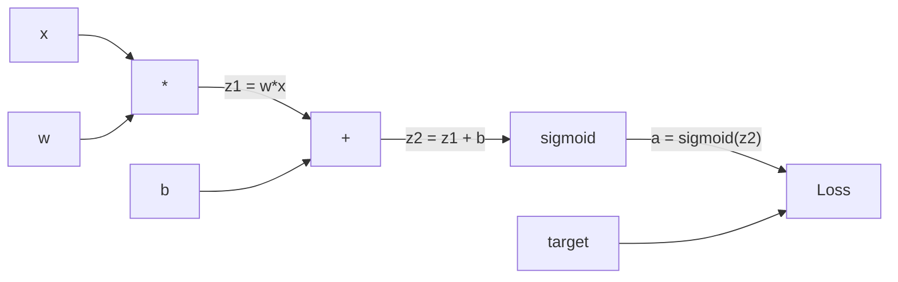
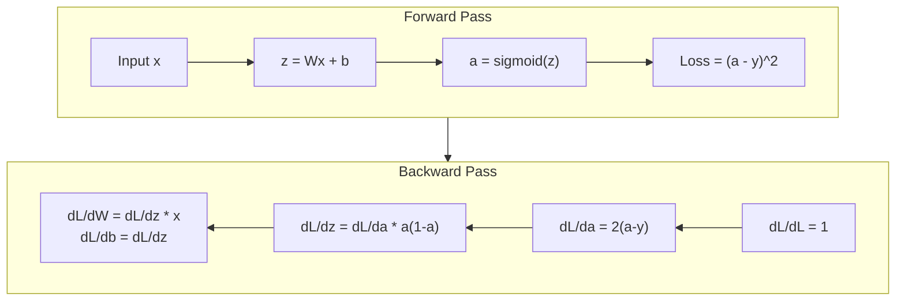
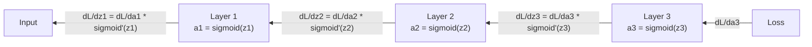

# Backpropagation od zera

> Backpropagation to algorytm, który umożliwia uczenie. Bez niego sieci neuronowe są tylko kosztownymi generatorami liczb losowych.

**Typ:** Zbuduj
**Języki:** Python
**Wymagania wstępne:** Lekcja 03.02 (Sieci wielowarstwowe)
**Szacowany czas:** ~120 minut

## Cele uczenia się

- Zaimplementować oparty na Value silnik autograd, który buduje graf obliczeniowy i oblicza gradienty poprzez sortowanie topologiczne
- Wyprowadzić wsteczną propagację dla dodawania, mnożenia i sigmoidy przy użyciu reguły łańcuchowej
- Trenować sieć wielowarstwową na klasyfikacji XOR i okręgu używając wyłącznie silnika backpropagation zbudowanego od zera
- Zidentyfikować problem znikającego gradientu w głębokich sieciach sigmoid i wyjaśnić, dlaczego gradienty kurczą się wykładniczo

## Problem

Twoja sieć ma jedną warstwę ukrytą z 768 wejściami i 3072 wyjściami. To 2 359 296 wag. Popełniła błędną predykcję. Które wagi spowodowały błąd? Testowanie każdej wagi indywidualnie oznacza 2,3 miliona przebiegów forward. Backpropagation oblicza wszystkie 2,3 miliona gradientów w jednym przebiegu wstecznym. To nie jest optymalizacja. To różnica między tym, co da się trenować, a tym, co jest niemożliwe.

Podejście naiwne: weź jedną wagę, delikatnie ją zmodyfikuj, uruchom ponownie przebieg forward, zmierz czy strata wzrosła czy spadła. To daje ci gradient dla tej wagi. Teraz zrób to dla każdej wagi w sieci. Pomnóż przez tysiące kroków treningowych i miliony punktów danych. Potrzebowałbyś czasu geologicznego, żeby wytrenować cokolwiek użytecznego.

Backpropagation rozwiązuje to. Jeden przebieg forward, jeden przebieg backward, wszystkie gradienty obliczone. Trik polega na regule łańcuchowej z rachunku różniczkowego, zastosowanej systematycznie do grafu obliczeniowego. To jest algorytm, który uczynił głębokie uczenie praktycznym. Bez niego nadal bylibyśmy uwiązani do problemów-zabawek.

## Koncepcja

### Reguła łańcuchowa zastosowana do sieci

Widziałeś regułę łańcuchową w Fazie 01, Lekcji 05. Szybkie przypomnienie: jeśli y = f(g(x)), to dy/dx = f'(g(x)) * g'(x). Mnożysz pochodne wzdłuż łańcucha.

W sieci neuronowej "łańcuch" to sekwencja operacji od wejścia do straty. Każda warstwa aplikuje wagi, dodaje biasy, przepuszcza przez aktywację. Funkcja straty porównuje końcowe wyjście z celem. Backpropagation śledzi ten łańcuch wstecz, obliczając jak każda operacja przyczyniła się do błędu.

### Grafy obliczeniowe

Każdy przebieg forward buduje graf. Każdy węzeł to operacja (mnożenie, dodawanie, sigmoida). Każda krawędź niesie wartość do przodu i gradient do tyłu.



Przebieg forward: wartości płyną od lewej do prawej. x i w produkują z1 = w*x. Dodaj b żeby otrzymać z2. Sigmoida daje aktywację a. Porównaj a z celem y używając funkcji straty.

Przebieg backward: gradienty płyną od prawej do lewej. Zaczynamy od dL/da (jak strata zmienia się z aktywacją). Mnożymy przez da/dz2 (pochodna sigmoidy). To daje dL/dz2. Dzielimy na dL/db (który równa się dL/dz2, bo z2 = z1 + b) i dL/dz1. Następnie dL/dw = dL/dz1 * x i dL/dx = dL/dz1 * w.

Każdy węzeł w grafie ma jedno zadanie podczas przebiegu backward: weź gradient przychodzący z góry, pomnóż przez jego lokalną pochodną i przekaż w dół.

### Forward vs Backward



Przebieg forward przechowuje każdą wartość pośrednią: z, a, wejścia każdej warstwy. Przebieg backward potrzebuje tych przechowanych wartości do obliczenia gradientów. To jest kompromis pamięć-obliczenia w sercu backpropagation. Tradeujesz pamięć (przechowywanie aktywacji) za szybkość (jeden przebieg zamiast milionów).

### Przepływ gradientu przez sieć

Dla sieci 3-warstwowej gradienty przechodzą przez każdą warstwę:



W każdej warstwie gradient jest mnożony przez pochodną sigmoidy. Pochodna sigmoidy to a * (1 - a), która osiąga maksimum 0.25 (gdy a = 0.5). Na głębokości trzech warstw gradient został pomnożony przez co najwyżej 0.25^3 = 0.0156. Na głębokości dziesięciu warstw: 0.25^10 = 0.000001.

### Zanikające gradienty

To jest problem znikającego gradientu. Sigmoida ściska swoje wyjście między 0 a 1. Jej pochodna jest zawsze mniejsza niż 0.25. Nałóż wystarczająco dużo warstw sigmoidy i gradienty kurczą się do zera. Wczesne warstwy prawie się nie uczą, bo otrzymują niemal zerowe gradienty.

```
sigmoid(z):     Zakres wyjścia [0, 1]
sigmoid'(z):    Wartość maksymalna 0.25 (przy z = 0)

Po 5 warstwach:    gradient * 0.25^5 = 0.001x oryginału
Po 10 warstwach:  gradient * 0.25^10 = 0.000001x oryginału
```

To dlatego głębokie sieci sigmoid są niemal niemożliwe do wytrenowania. Poprawka -- ReLU i jej warianty -- to temat Lekcji 04. Na razie zrozum, że backpropagation działa perfekcyjnie. Problem stanowi to, przez co przechodzi.

### Wyprowadzanie gradientów dla sieci 2-warstwowej

Konkretna matematyka dla sieci z wejściem x, warstwą ukrytą z sigmoidą, warstwą wyjściową z sigmoidą i stratą MSE.

Przebieg forward:
```
z1 = W1 * x + b1
a1 = sigmoid(z1)
z2 = W2 * a1 + b2
a2 = sigmoid(z2)
L = (a2 - y)^2
```

Przebieg backward (aplikacja reguły łańcuchowej krok po kroku):
```
dL/da2 = 2(a2 - y)
da2/dz2 = a2 * (1 - a2)
dL/dz2 = dL/da2 * da2/dz2 = 2(a2 - y) * a2 * (1 - a2)

dL/dW2 = dL/dz2 * a1
dL/db2 = dL/dz2

dL/da1 = dL/dz2 * W2
da1/dz1 = a1 * (1 - a1)
dL/dz1 = dL/da1 * da1/dz1

dL/dW1 = dL/dz1 * x
dL/db1 = dL/dz1
```

Każdy gradient to iloczyn lokalnych pochodnych wyśledzonych wstecz od straty. To wszystko czym jest backpropagation.

## Zbuduj to

### Krok 1: Węzeł Value

Każda liczba w naszych obliczeniach staje się Value. Przechowuje swoje dane, swój gradient i jak została stworzona (żeby wiedziała jak obliczyć gradienty wstecz).

```python
class Value:
    def __init__(self, data, children=(), op=''):
        self.data = data
        self.grad = 0.0
        self._backward = lambda: None
        self._children = set(children)
        self._op = op

    def __repr__(self):
        return f"Value(data={self.data:.4f}, grad={self.grad:.4f})"
```

Jeszcze nie ma gradientu (0.0). Jeszcze nie ma funkcji backward (pusta funkcja). `_children` śledzą które Value produkowały ten węzeł, żebyśmy mogli później posortować graf topologicznie.

### Krok 2: Operacje z funkcjami backward

Każda operacja tworzy nowy Value i definiuje jak gradienty płyną wstecz przez nią.

```python
def __add__(self, other):
    other = other if isinstance(other, Value) else Value(other)
    out = Value(self.data + other.data, (self, other), '+')

    def _backward():
        self.grad += out.grad
        other.grad += out.grad

    out._backward = _backward
    return out

def __mul__(self, other):
    other = other if isinstance(other, Value) else Value(other)
    out = Value(self.data * other.data, (self, other), '*')

    def _backward():
        self.grad += other.data * out.grad
        other.grad += self.data * out.grad

    out._backward = _backward
    return out
```

Dla dodawania: d(a+b)/da = 1, d(a+b)/db = 1. Więc oba wejścia otrzymują gradient wyjścia bezpośrednio.

Dla mnożenia: d(a*b)/da = b, d(a*b)/db = a. Każde wejście otrzymuje wartość drugiego pomnożoną przez gradient wyjścia.

`+=` jest krytyczne. Value może być użyte w wielu operacjach. Jego gradient to suma gradientów ze wszystkich ścieżek.

### Krok 3: Sigmoida i strata

```python
import math

def sigmoid(self):
    x = self.data
    x = max(-500, min(500, x))
    s = 1.0 / (1.0 + math.exp(-x))
    out = Value(s, (self,), 'sigmoid')

    def _backward():
        self.grad += (s * (1 - s)) * out.grad

    out._backward = _backward
    return out
```

Pochodna sigmoidy: sigmoid(x) * (1 - sigmoid(x)). Obliczyliśmy sigmoid(x) = s podczas przebiegu forward. Użyj go ponownie. Bez dodatkowej pracy.

```python
def mse_loss(predicted, target):
    diff = predicted + Value(-target)
    return diff * diff
```

MSE dla pojedynczego wyjścia: (predicted - target)^2. Wyrażamy odejmowanie jako dodawanie z zanegowanym Value.

### Krok 4: Przebieg backward

Sortowanie topologiczne zapewnia, że przetwarzamy węzły we właściwej kolejności -- gradient węzła jest w pełni skumulowany zanim go rozpropagujemy przez niego.

```python
def backward(self):
    topo = []
    visited = set()

    def build_topo(v):
        if v not in visited:
            visited.add(v)
            for child in v._children:
                build_topo(child)
            topo.append(v)

    build_topo(self)
    self.grad = 1.0
    for v in reversed(topo):
        v._backward()
```

Zaczynamy od straty (gradient = 1.0, bo dL/dL = 1). Idziemy wstecz przez posortowany graf. Każdy węzeł `_backward` przesyła gradienty do swoich dzieci.

### Krok 5: Warstwa i sieć

```python
import random

class Neuron:
    def __init__(self, n_inputs):
        scale = (2.0 / n_inputs) ** 0.5
        self.weights = [Value(random.uniform(-scale, scale)) for _ in range(n_inputs)]
        self.bias = Value(0.0)

    def __call__(self, x):
        act = sum((wi * xi for wi, xi in zip(self.weights, x)), self.bias)
        return act.sigmoid()

    def parameters(self):
        return self.weights + [self.bias]


class Layer:
    def __init__(self, n_inputs, n_outputs):
        self.neurons = [Neuron(n_inputs) for _ in range(n_outputs)]

    def __call__(self, x):
        out = [n(x) for n in self.neurons]
        return out[0] if len(out) == 1 else out

    def parameters(self):
        params = []
        for n in self.neurons:
            params.extend(n.parameters())
        return params


class Network:
    def __init__(self, sizes):
        self.layers = []
        for i in range(len(sizes) - 1):
            self.layers.append(Layer(sizes[i], sizes[i + 1]))

    def __call__(self, x):
        for layer in self.layers:
            x = layer(x)
            if not isinstance(x, list):
                x = [x]
        return x[0] if len(x) == 1 else x

    def parameters(self):
        params = []
        for layer in self.layers:
            params.extend(layer.parameters())
        return params

    def zero_grad(self):
        for p in self.parameters():
            p.grad = 0.0
```

Neuron bierze wejścia, oblicza sumę ważoną + bias i aplikuje sigmoidę. Inicjalizacja wag skaluje przez sqrt(2/n_inputs) żeby zapobiec nasyceniu sigmoidy w głębszych sieciach. Warstwa to lista Neuronów. Sieć to lista Warstw. Metoda `parameters()` zbiera wszystkie uczące się Value, żebyśmy mogli je później aktualizować.

### Krok 6: Trenuj na XOR

```python
random.seed(42)
net = Network([2, 4, 1])

xor_data = [
    ([0.0, 0.0], 0.0),
    ([0.0, 1.0], 1.0),
    ([1.0, 0.0], 1.0),
    ([1.0, 1.0], 0.0),
]

learning_rate = 1.0

for epoch in range(1000):
    total_loss = Value(0.0)
    for inputs, target in xor_data:
        x = [Value(i) for i in inputs]
        pred = net(x)
        loss = mse_loss(pred, target)
        total_loss = total_loss + loss

    net.zero_grad()
    total_loss.backward()

    for p in net.parameters():
        p.data -= learning_rate * p.grad

    if epoch % 100 == 0:
        print(f"Epoch {epoch:4d} | Loss: {total_loss.data:.6f}")

print("\nXOR Results:")
for inputs, target in xor_data:
    x = [Value(i) for i in inputs]
    pred = net(x)
    print(f"  {inputs} -> {pred.data:.4f} (expected {target})")
```

Obserwuj stratę malejącą. Od losowych predykcji do poprawnych wyjść XOR, napędzane całkowicie przez backpropagation obliczające gradienty i popychające wagi we właściwym kierunku.

### Krok 7: Klasyfikacja okręgu

W Lekcji 02 ręcznie dostrajałeś wagi dla klasyfikacji okręgu. Teraz niech sieć się ich nauczy.

```python
random.seed(7)

def generate_circle_data(n=100):
    data = []
    for _ in range(n):
        x1 = random.uniform(-1.5, 1.5)
        x2 = random.uniform(-1.5, 1.5)
        label = 1.0 if x1 * x1 + x2 * x2 < 1.0 else 0.0
        data.append(([x1, x2], label))
    return data

circle_data = generate_circle_data(80)

circle_net = Network([2, 8, 1])
learning_rate = 0.5

for epoch in range(2000):
    random.shuffle(circle_data)
    total_loss_val = 0.0
    for inputs, target in circle_data:
        x = [Value(i) for i in inputs]
        pred = circle_net(x)
        loss = mse_loss(pred, target)
        circle_net.zero_grad()
        loss.backward()
        for p in circle_net.parameters():
            p.data -= learning_rate * p.grad
        total_loss_val += loss.data

    if epoch % 200 == 0:
        correct = 0
        for inputs, target in circle_data:
            x = [Value(i) for i in inputs]
            pred = circle_net(x)
            predicted_class = 1.0 if pred.data > 0.5 else 0.0
            if predicted_class == target:
                correct += 1
        accuracy = correct / len(circle_data) * 100
        print(f"Epoch {epoch:4d} | Loss: {total_loss_val:.4f} | Accuracy: {accuracy:.1f}%")
```

Używamy tutaj online SGD -- aktualizujemy wagi po każdej próbce zamiast akumulować pełną partię. To szybciej łamie symetrię i unika nasycenia sigmoidy na pełnym krajobrazie straty. Tasowanie danych każdej epoki zapobiega sieci w zapamiętywaniu kolejności.

Bez ręcznego dostrajania. Sieć samodzielnie odkrywa okrągłą granicę decyzyjną. To jest siła backpropagation: definiujesz architekturę, funkcję straty i dane. Algorytm sam odkrywa wagi.

## Użyj tego

PyTorch robi wszystko powyżej w kilku linijkach. Główna idea jest identyczna -- autograd buduje graf obliczeniowy podczas przebiegu forward i śledzi go wstecz, żeby obliczyć gradienty.

```python
import torch
import torch.nn as nn

model = nn.Sequential(
    nn.Linear(2, 4),
    nn.Sigmoid(),
    nn.Linear(4, 1),
    nn.Sigmoid(),
)
optimizer = torch.optim.SGD(model.parameters(), lr=1.0)
criterion = nn.MSELoss()

X = torch.tensor([[0,0],[0,1],[1,0],[1,1]], dtype=torch.float32)
y = torch.tensor([[0],[1],[1],[0]], dtype=torch.float32)

for epoch in range(1000):
    pred = model(X)
    loss = criterion(pred, y)
    optimizer.zero_grad()
    loss.backward()
    optimizer.step()

print("PyTorch XOR Results:")
with torch.no_grad():
    for i in range(4):
        pred = model(X[i])
        print(f"  {X[i].tolist()} -> {pred.item():.4f} (expected {y[i].item()})")
```

`loss.backward()` to twój `total_loss.backward()`. `optimizer.step()` to twoja ręczna `p.data -= lr * p.grad`. `optimizer.zero_grad()` to twój `net.zero_grad()`. Ten sam algorytm, implementacja przemysłowej jakości. PyTorch obsługuje akcelerację GPU, mieszaną precyzję, checkpointing gradientów i setki typów warstw. Ale przebieg backward to ta sama reguła łańcuchowa zastosowana do tego samego grafu obliczeniowego.

Trening uruchamia przebieg forward, potem przebieg backward, potem aktualizuje wagi. Inferencja uruchamia tylko przebieg forward. Bez gradientów, bez aktualizacji. Ta dystynkcja ma znaczenie, bo inferencja to coś, co dzieje się w produkcji. Gdy wywołujesz API jak Claude czy GPT, uruchamiasz inferencję -- twój prompt płynie forward przez sieć, a tokeny wychodzą z drugiej strony. Żadne wagi się nie zmieniają. Zrozumienie backprop ma znaczenie, bo to ukształtowało każdą wagę w tej sieci.

## Wyślij to

Ta lekcja produkuje:
- `outputs/prompt-gradient-debugger.md` -- wielokrotnie użyteczny prompt do diagnozowania problemów z gradientami (zanikające, eksplodujące, NaN) w dowolnej sieci neuronowej

## Ćwiczenia

1. Dodaj metodę `__sub__` do klasy Value (a - b = a + (-1 * b)). Następnie zaimplementuj metodę `__neg__`. Zweryfikuj, że gradienty są poprawne porównując z ręcznym obliczeniem dla prostego wyrażenia jak (a - b)^2.

2. Dodaj metodę `relu` do Value (wyjście max(0, x), pochodna to 1 jeśli x > 0, w przeciwnym razie 0). Zastąp sigmoidę relu w warstwach ukrytych i trenuj na XOR ponownie. Porównaj szybkość zbieżności. Powinieneś zobaczyć szybsze trening -- to podgląd Lekcji 04.

3. Zaimplementuj metodę `__pow__` na Value dla całkowitych potęg. Użyj jej do zastąpienia `mse_loss` prawidłowym wyrażeniem `(predicted - target) ** 2`. Zweryfikuj gradienty z oryginalną implementacją.

4. Dodaj obcinanie gradientów do pętli treningowej: po wywołaniu `backward()`, przytnij wszystkie gradienty do [-1, 1]. Trenuj głębszą sieć (4+ warstw z sigmoidą) i porównaj krzywe straty z obcinaniem i bez. To jest twoja pierwsza obrona przed eksplodującymi gradientami.

5. Zbuduj wizualizację: po treningu na XOR, wypisz gradient każdego parametru w sieci. Zidentyfikuj która warstwa ma najmniejsze gradienty. To demonstruje problem znikającego gradientu, który czytałeś w sekcji Koncepcji.

## Kluczowe terminy

| Termin | Co ludzie mówią | Co to faktycznie oznacza |
|--------|----------------|----------------------|
| Backpropagation | "Sieć się uczy" | Algorytm który oblicza dL/dw dla każdej wagi przez aplikację reguły łańcuchowej wstecz przez graf obliczeniowy |
| Computational graph | "Struktura sieci" | Graf skierowany acykliczny gdzie węzły to operacje, a krawędzie niosą wartości (forward) i gradienty (backward) |
| Chain rule | "Pomnóż pochodne" | Jeśli y = f(g(x)), to dy/dx = f'(g(x)) * g'(x) -- matematyczny fundament backpropagation |
| Gradient | "Kierunek najszybszego wzrostu" | Pochodna cząstkowa straty względem parametru -- mówi jak zmienić ten parametr żeby zmniejszyć stratę |
| Vanishing gradient | "Głębokie sieci się nie uczą" | Gradienty kurczą się wykładniczo gdy propagują przez warstwy z nasycającymi aktywacjami jak sigmoida |
| Forward pass | "Uruchamianie sieci" | Obliczanie wyjścia z wejść przez sekwencyjne aplikowanie operacji każdej warstwy i przechowywanie wartości pośrednich |
| Backward pass | "Obliczanie gradientów" | Przechodzenie grafu obliczeniowego w odwrotnej kolejności, akumulacja gradientów w każdym węźle używając reguły łańcuchowej |
| Learning rate | "Jak szybko się uczy" | Skalar który kontroluje rozmiar kroku przy aktualizacji wag: w_new = w_old - lr * gradient |
| Topological sort | "Właściwa kolejność" | Uporządkowanie węzłów grafu gdzie każdy węzeł pojawia się po wszystkich węzłach od których zależy -- zapewnia, że gradienty są w pełni akumulowane przed propagacją |
| Autograd | "Automatyczne różniczkowanie" | System który buduje grafy obliczeniowe podczas forward computation i automatycznie oblicza gradienty -- co robi silnik PyTorcha |

## Dalsze czytanie

- Rumelhart, Hinton & Williams, "Learning representations by back-propagating errors" (1986) -- artykuł który upowszechnił backpropagation i odblokował trening sieci wielowarstwowych
- 3Blue1Brown, seria "Neural Networks" -- najlepsze wizualne wyjaśnienie backpropagation i przepływu gradientu przez sieci