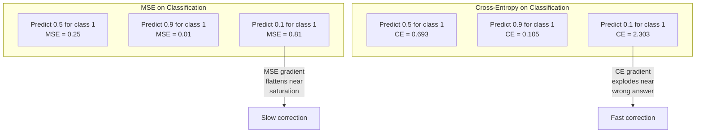
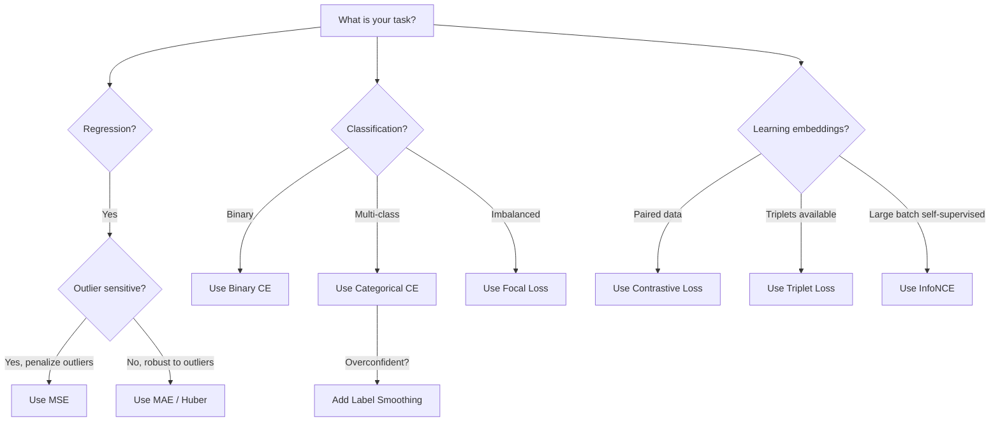
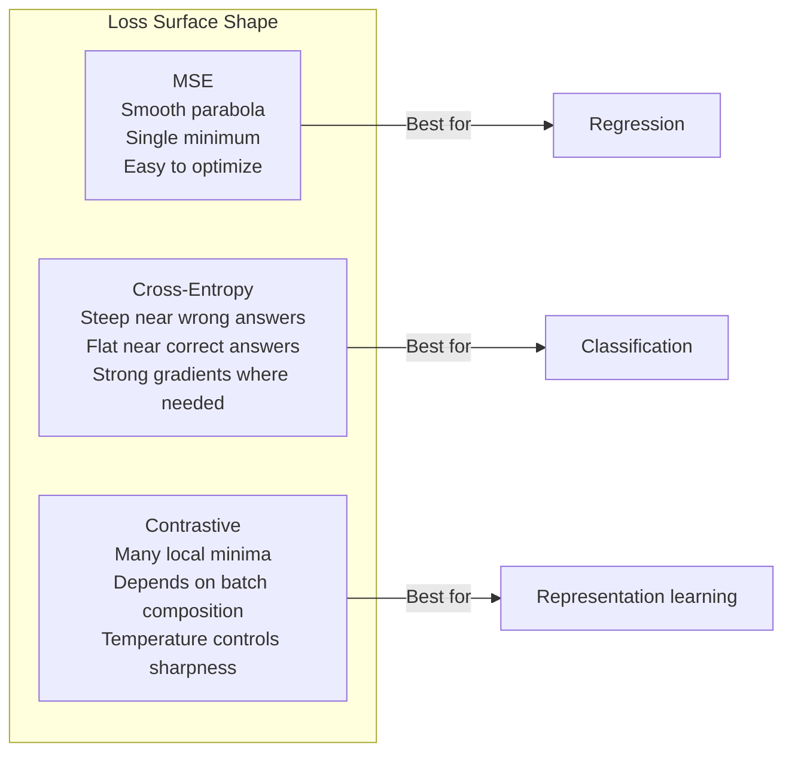

<think>
The user wants me to translate this entire lesson about Loss Functions from English to Polish. This is a technical course lesson, so I need to:

1. Translate the narrative text faithfully
2. Keep all technical terms that are listed as "DOZWOLONE ANGLICYZMY"
3. Keep all code blocks exactly as they are
4. Apply Polish diacritics correctly
5. Add commas appropriately
6. Keep markdown formatting
7. Remove references to external sources
8. Not improve or change the tone

Let me translate this carefully, section by section.
</think>

# Funkcje straty

> Model wykonuje predykcję. Prawda mówi co innego. Jak bardzo się myli? Tą liczbą jest loss. Wybierz złą funkcję straty, a Twój model będzie optymalizowany pod zupełnie złą rzecz.

**Typ:** Build
**Języki:** Python
**Wymagania wstępne:** Lekcja 03.04 (Funkcje aktywacji)
**Szacowany czas:** ~75 minut

## Cele uczenia się

- Zaimplementować od zera MSE, binary cross-entropy, categorical cross-entropy oraz contrastive loss (InfoNCE) wraz z ich gradientami
- Wyjaśnić, dlaczego MSE zawodzi w klasyfikacji, demonstrując tryb awarii „predykcja 0.5 dla wszystkiego"
- Zastosować label smoothing do cross-entropy i opisać, jak zapobiega ona nadmiernie pewnym predykcjom
- Wybrać poprawną funkcję straty dla zadań regresji, klasyfikacji binarnej, klasyfikacji wieloklasowej i uczenia się reprezentacji

## Problem

Model minimalizujący MSE na problemie klasyfikacji będzie pewnie przewidywać 0.5 dla wszystkiego. Minimalizuje stratę. Jest też bezużyteczny.

Funkcja straty to jedyna rzecz, którą Twój model faktycznie optymalizuje. Nie accuracy. Nie F1 score. Nie żadna metryka, którą raportujesz swojemu menedżerowi. Optimizer bierze gradient funkcji straty i dostosowuje wagi, żeby ta liczba była mniejsza. Jeśli funkcja straty nie obejmuje tego, na czym Ci zależy, model znajdzie matematycznie najtańszy sposób, żeby ją zadowolić, i ten sposób prawie nigdy nie jest tym, czego chciałeś.

Oto konkretny przykład. Masz zadanie klasyfikacji binarnej. Dwie klasy, podział 50/50. Używasz MSE jako funkcji straty. Model przewiduje 0.5 dla każdego wejścia. Średnie MSE wynosi 0.25, co jest minimalną możliwą wartością bez faktycznego uczenia się. Model ma zerową zdolność dyskryminacyjną, ale technicznie zminimalizował Twoją funkcję straty. Przełącz na cross-entropy, a ten sam model jest zmuszony przesuwać predykcje w stronę 0 lub 1, bo -log(0.5) = 0.693 to okropna strata, podczas gdy -log(0.99) = 0.01 nagradza pewne poprawne predykcje. Wybór funkcji straty to różnica między modelem, który się uczy, a modelem, który oszukuje metrykę.

Jest jeszcze gorzej. W self-supervised learning nie masz nawet etykiet. Contrastive loss definiuje sygnał uczenia się całkowicie: co liczy się jako podobne, co jako różne, i jak mocno model powinien je odpychać. Zepsuj contrastive loss, a Twoje embeddings zapaść się do jednego punktu -- każde wejście mapuje na ten sam wektor. Technicznie zero straty. Kompletnie bezwartościowe.

## Koncepcja

### Mean Squared Error (MSE)

Domyślna opcja dla regresji. Oblicz kwadrat różnicy między predykcją a wartością docelową, uśrednij po wszystkich próbkach.

```
MSE = (1/n) * sum((y_pred - y_true)^2)
```

Dlaczego kwadratowanie ma znaczenie: karze duże błędy kwadratowo. Błąd 2 kosztuje 4x tyle co błąd 1. Błąd 10 kosztuje 100x. To sprawia, że MSE jest wrażliwe na outliers -- pojedyncza bardzo zła predykcja dominuje nad stratą.

Rzeczywiste liczby: jeśli Twój model przewiduje ceny domów i myli się o $10,000 w większości domów, ale o $200,000 w jednej rezydencji, MSE będzie agresywnie próbować naprawić tę jedną rezydencję, potencjalnie pogarszając wyniki na pozostałych 99 domach.

Gradient MSE względem predykcji to:

```
dMSE/dy_pred = (2/n) * (y_pred - y_true)
```

Liniowy względem błędu. Większe błędy dają większe gradienty. To cecha dla regresji (duże błędy potrzebują dużych korekt) i bug dla klasyfikacji (chcesz karać pewne złe odpowiedzi wykładniczo, nie liniowo).

### Cross-Entropy Loss

Funkcja straty dla klasyfikacji. Zakorzeniona w teorii informacji -- mierzy dywergencję między przewidywanym rozkładem prawdopodobieństwa a prawdziwym rozkładem.

**Binary Cross-Entropy (BCE):**

```
BCE = -(y * log(p) + (1 - y) * log(1 - p))
```

Gdzie y to prawdziwa etykieta (0 lub 1), a p to przewidywane prawdopodobieństwo.

Dlaczego -log(p) działa: gdy prawdziwa etykieta to 1 i przewidujesz p = 0.99, strata to -log(0.99) = 0.01. Gdy przewidujesz p = 0.01, strata to -log(0.01) = 4.6. Ta różnica 460x to dlaczego cross-entropy działa. Brutalnie karze pewne złe predykcje, podczas gdy ledwo karze pewne poprawne.

Gradient opowiada tę samą historię:

```
dBCE/dp = -(y/p) + (1-y)/(1-p)
```

Gdy y = 1 i p jest bliskie zera, gradient to -1/p, co dąży do minus nieskończoności. Model dostaje ogromny sygnał do naprawienia błędu. Gdy p jest bliskie 1, gradient jest minimalny. Już poprawne, nie ma co naprawiać.

**Categorical Cross-Entropy:**

Dla klasyfikacji wieloklasowej z one-hot encoded targets.

```
CCE = -sum(y_i * log(p_i))
```

Tylko prawdziwa klasa przyczynia się do straty (bo wszystkie pozostałe y_i to zero). Jeśli jest 10 klas i poprawna klasa dostaje prawdopodobieństwo 0.1 (losowe zgadywanie), strata to -log(0.1) = 2.3. Jeśli poprawna klasa dostaje prawdopodobieństwo 0.9, strata to -log(0.9) = 0.105. Model uczy się koncentrować masę prawdopodobieństwa na prawidłowej odpowiedzi.

### Dlaczego MSE zawodzi w klasyfikacji



Gradienty MSE spłaszczają się, gdy predykcje są bliskie 0 lub 1 (z powodu nasycenia sigmoidalnego). Gradienty cross-entropy to kompensują -- -log niweluje płaskie regiony sigmoidalnej, dając silne gradienty dokładnie tam, gdzie są najbardziej potrzebne.

### Label Smoothing

Standardowe one-hot labels mówią „to jest w 100% klasa 3 i w 0% wszystko inne". To silne twierdzenie. Label smoothing je wygładza:

```
smooth_label = (1 - alpha) * one_hot + alpha / num_classes
```

Z alpha = 0.1 i 10 klasami: zamiast [0, 0, 1, 0, ...], target staje się [0.01, 0.01, 0.91, 0.01, ...]. Model celuje w 0.91 zamiast 1.0.

Dlaczego to działa: model próbujący wyjściować dokładnie 1.0 przez softmax musi pchać logity do nieskończoności. To powoduje nadmierną pewność, szkodzi generalizacji i sprawia, że model jest kruchyy wobec shift w rozkładzie. Label smoothing ogranicza target do 0.9 (z alpha=0.1), utrzymując logity w rozsądnym zakresie. GPT i większość nowoczesnych modeli używa label smoothing lub jego odpowiednika.

### Contrastive Loss

Bez etykiet. Bez klas. Tylko pary wejść i pytanie: czy są podobne, czy różne?

**SimCLR-style contrastive loss (NT-Xent / InfoNCE):**

Weź jeden obraz. Stwórz dwa augmentowane widoki (crop, rotate, color jitter). To „pozytywna para" -- powinny mieć podobne embeddings. Każdy inny obrazek w batchu tworzy „negatywną parę" -- powinny mieć różne embeddings.

```
L = -log(exp(sim(z_i, z_j) / tau) / sum(exp(sim(z_i, z_k) / tau)))
```

Gdzie sim() to cosine similarity, z_i i z_j to pozytywna para, suma jest po wszystkich negatywach, a tau (temperature) kontroluje, jak ostra jest dystrybucja. Niższa temperatura = trudniejsze negatywy = bardziej agresywne separacja.

Rzeczywiste liczby: batch size 256 oznacza 255 negatywów na pozytywną parę. Temperatura tau = 0.07 (domyślna w SimCLR). Strata wygląda jak softmax nad podobieństwami -- chce, żeby podobieństwo pozytywnej pary było najwyższe spośród wszystkich 256 opcji.

**Triplet Loss:**

Bierze trzy wejścia: anchor, positive (ta sama klasa), negative (inna klasa).

```
L = max(0, d(anchor, positive) - d(anchor, negative) + margin)
```

Margin (typowo 0.2-1.0) wymusza minimalną lukę między odległościami pozytywną a negatywną. Jeśli negatyw jest już wystarczająco daleko, strata wynosi zero -- brak gradientu, brak aktualizacji. To sprawia, że trening jest efektywny, ale wymaga starannego triplet mining (wybierania trudnych negatywów, które są blisko anchora).

### Focal Loss

Dla niezbalansowanych zbiorów danych. Standardowa cross-entropy traktuje wszystkie poprawnie sklasyfikowane przykłady równo. Focal loss down-waguje łatwe przykłady:

```
FL = -alpha * (1 - p_t)^gamma * log(p_t)
```

Gdzie p_t to przewidywane prawdopodobieństwo prawdziwej klasy, a gamma kontroluje focusing. Z gamma = 0, to standardowa cross-entropy. Z gamma = 2 (domyślna):

- Łatwy przykład (p_t = 0.9): waga = (0.1)^2 = 0.01. Efektywnie ignorowany.
- Trudny przykład (p_t = 0.1): waga = (0.9)^2 = 0.81. Pełny sygnał gradientu.

Focal loss został wprowadzony przez Lin et al. do object detection, gdzie 99% candidate regions to background (łatwe negatywy). Bez focal loss model tonie w łatwych przykładach backgroundu i nigdy nie uczy się wykrywać obiektów. Z nią model koncentruje swoją pojemność na trudnych, niejednoznacznych przypadkach, które mają znaczenie.

### Drzewo decyzyjne funkcji straty



### Loss Landscape



## Zbuduj to

### Krok 1: MSE i jego gradient

```python
def mse(predictions, targets):
    n = len(predictions)
    total = 0.0
    for p, t in zip(predictions, targets):
        total += (p - t) ** 2
    return total / n

def mse_gradient(predictions, targets):
    n = len(predictions)
    grads = []
    for p, t in zip(predictions, targets):
        grads.append(2.0 * (p - t) / n)
    return grads
```

### Krok 2: Binary Cross-Entropy

Problem log(0) jest realny. Jeśli model przewiduje dokładnie 0 dla pozytywnego przykładu, log(0) = ujemna nieskończoność. Clipping temu zapobiega.

```python
import math

def binary_cross_entropy(predictions, targets, eps=1e-15):
    n = len(predictions)
    total = 0.0
    for p, t in zip(predictions, targets):
        p_clipped = max(eps, min(1 - eps, p))
        total += -(t * math.log(p_clipped) + (1 - t) * math.log(1 - p_clipped))
    return total / n

def bce_gradient(predictions, targets, eps=1e-15):
    grads = []
    for p, t in zip(predictions, targets):
        p_clipped = max(eps, min(1 - eps, p))
        grads.append(-(t / p_clipped) + (1 - t) / (1 - p_clipped))
    return grads
```

### Krok 3: Categorical Cross-Entropy z Softmax

Softmax konwertuje surowe logity na prawdopodobieństwa. Następnie obliczamy cross-entropy względem one-hot targets.

```python
def softmax(logits):
    max_val = max(logits)
    exps = [math.exp(x - max_val) for x in logits]
    total = sum(exps)
    return [e / total for e in exps]

def categorical_cross_entropy(logits, target_index, eps=1e-15):
    probs = softmax(logits)
    p = max(eps, probs[target_index])
    return -math.log(p)

def cce_gradient(logits, target_index):
    probs = softmax(logits)
    grads = list(probs)
    grads[target_index] -= 1.0
    return grads
```

Gradient softmax + cross-entropy pięknie się upraszcza: to po prostu (przewidywane prawdopodobieństwo - 1) dla prawdziwej klasy i (przewidywane prawdopodobieństwo) dla wszystkich innych klas. Ta elegancka uproszczenie to nie przypadek -- to dlatego softmax i cross-entropy są sparowane.

### Krok 4: Label Smoothing

```python
def label_smoothed_cce(logits, target_index, num_classes, alpha=0.1, eps=1e-15):
    probs = softmax(logits)
    loss = 0.0
    for i in range(num_classes):
        if i == target_index:
            smooth_target = 1.0 - alpha + alpha / num_classes
        else:
            smooth_target = alpha / num_classes
        p = max(eps, probs[i])
        loss += -smooth_target * math.log(p)
    return loss
```

### Krok 5: Contrastive Loss (Uproszczony InfoNCE)

```python
def cosine_similarity(a, b):
    dot = sum(x * y for x, y in zip(a, b))
    norm_a = math.sqrt(sum(x * x for x in a))
    norm_b = math.sqrt(sum(x * x for x in b))
    if norm_a < 1e-10 or norm_b < 1e-10:
        return 0.0
    return dot / (norm_a * norm_b)

def contrastive_loss(anchor, positive, negatives, temperature=0.07):
    sim_pos = cosine_similarity(anchor, positive) / temperature
    sim_negs = [cosine_similarity(anchor, neg) / temperature for neg in negatives]

    max_sim = max(sim_pos, max(sim_negs)) if sim_negs else sim_pos
    exp_pos = math.exp(sim_pos - max_sim)
    exp_negs = [math.exp(s - max_sim) for s in sim_negs]
    total_exp = exp_pos + sum(exp_negs)

    return -math.log(max(1e-15, exp_pos / total_exp))
```

### Krok 6: MSE vs Cross-Entropy na klasyfikacji

Trenuj tę samą sieć z lekcji 04 (circle dataset) z obiema funkcjami straty. Obserwuj, jak cross-entropy szybciej zbiega.

```python
import random

def sigmoid(x):
    x = max(-500, min(500, x))
    return 1.0 / (1.0 + math.exp(-x))

def make_circle_data(n=200, seed=42):
    random.seed(seed)
    data = []
    for _ in range(n):
        x = random.uniform(-2, 2)
        y = random.uniform(-2, 2)
        label = 1.0 if x * x + y * y < 1.5 else 0.0
        data.append(([x, y], label))
    return data


class LossComparisonNetwork:
    def __init__(self, loss_type="bce", hidden_size=8, lr=0.1):
        random.seed(0)
        self.loss_type = loss_type
        self.lr = lr
        self.hidden_size = hidden_size

        self.w1 = [[random.gauss(0, 0.5) for _ in range(2)] for _ in range(hidden_size)]
        self.b1 = [0.0] * hidden_size
        self.w2 = [random.gauss(0, 0.5) for _ in range(hidden_size)]
        self.b2 = 0.0

    def forward(self, x):
        self.x = x
        self.z1 = []
        self.h = []
        for i in range(self.hidden_size):
            z = self.w1[i][0] * x[0] + self.w1[i][1] * x[1] + self.b1[i]
            self.z1.append(z)
            self.h.append(max(0.0, z))

        self.z2 = sum(self.w2[i] * self.h[i] for i in range(self.hidden_size)) + self.b2
        self.out = sigmoid(self.z2)
        return self.out

    def backward(self, target):
        if self.loss_type == "mse":
            d_loss = 2.0 * (self.out - target)
        else:
            eps = 1e-15
            p = max(eps, min(1 - eps, self.out))
            d_loss = -(target / p) + (1 - target) / (1 - p)

        d_sigmoid = self.out * (1 - self.out)
        d_out = d_loss * d_sigmoid

        for i in range(self.hidden_size):
            d_relu = 1.0 if self.z1[i] > 0 else 0.0
            d_h = d_out * self.w2[i] * d_relu
            self.w2[i] -= self.lr * d_out * self.h[i]
            for j in range(2):
                self.w1[i][j] -= self.lr * d_h * self.x[j]
            self.b1[i] -= self.lr * d_h
        self.b2 -= self.lr * d_out

    def compute_loss(self, pred, target):
        if self.loss_type == "mse":
            return (pred - target) ** 2
        else:
            eps = 1e-15
            p = max(eps, min(1 - eps, pred))
            return -(target * math.log(p) + (1 - target) * math.log(1 - p))

    def train(self, data, epochs=200):
        losses = []
        for epoch in range(epochs):
            total_loss = 0.0
            correct = 0
            for x, y in data:
                pred = self.forward(x)
                self.backward(y)
                total_loss += self.compute_loss(pred, y)
                if (pred >= 0.5) == (y >= 0.5):
                    correct += 1
            avg_loss = total_loss / len(data)
            accuracy = correct / len(data) * 100
            losses.append((avg_loss, accuracy))
            if epoch % 50 == 0 or epoch == epochs - 1:
                print(f"    Epoch {epoch:3d}: loss={avg_loss:.4f}, accuracy={accuracy:.1f}%")
        return losses
```

## Użyj tego

PyTorch dostarcza wszystkie standardowe funkcje straty z wbudowaną stabilnością numeryczną:

```python
import torch
import torch.nn as nn
import torch.nn.functional as F

predictions = torch.tensor([0.9, 0.1, 0.7], requires_grad=True)
targets = torch.tensor([1.0, 0.0, 1.0])

mse_loss = F.mse_loss(predictions, targets)
bce_loss = F.binary_cross_entropy(predictions, targets)

logits = torch.randn(4, 10)
labels = torch.tensor([3, 7, 1, 9])
ce_loss = F.cross_entropy(logits, labels)
ce_smooth = F.cross_entropy(logits, labels, label_smoothing=0.1)
```

Używaj `F.cross_entropy` (nie `F.nll_loss` plus manual softmax). Łączy log-softmax i negative log-likelihood w jednej numerycznie stabilnej operacji. Stosowanie softmax osobno, a potem branie log jest mniej stabilne -- tracisz precyzję w odejmowaniu dużych wykładników.

Dla contrastive learning większość zespołów używa niestandardowych implementacji lub bibliotek jak `lightly` lub `pytorch-metric-learning`. Główna pętla jest zawsze taka sama: obliczaj pairwise similarities, twórz softmax nad pozytywami i negatywami, backpropaguj.

## Wyślij to

Ta lekcja wytwarza:
- `outputs/prompt-loss-function-selector.md` -- wielokrotnego użytku prompt do wyboru właściwej funkcji straty
- `outputs/prompt-loss-debugger.md` -- diagnostyczny prompt na wypadek, gdy wykres straty wygląda dziwnie

## Ćwiczenia

1. Zaimplementuj Huber loss (smooth L1 loss), który jest MSE dla małych błędów i MAE dla dużych. Trenuj sieć regresyjną przewidującą y = sin(x) z MSE vs Huber, gdy 5% training targets ma dodany losowy szum (outliers). Porównaj końcowy błąd testowy.

2. Dodaj focal loss do pętli treningowej klasyfikacji binarnej. Stwórz niezbalansowany zbiór danych (90% klasa 0, 10% klasa 1). Porównaj standardową BCE vs focal loss (gamma=2) na recall klasy mniejszościowej po 200 epokach.

3. Zaimplementuj triplet loss z semi-hard negative mining. Generuj dane 2D embeddings dla 5 klas. Dla każdego anchora znajdź najtrudniejszy negatyw, który jest wciąż dalej niż pozytyw (semi-hard). Porównaj zbieżność z losowym wyborem tripletów.

4. Uruchom porównanie MSE vs cross-entropy, ale śledź wielkości gradientów w każdej warstwie podczas treningu. Wykreśl średnią normę gradientu na epokę. Zweryfikuj, że cross-entropy produkuje większe gradienty we wczesnych epokach, gdy model jest najbardziej niepewny.

5. Zaimplementuj KL divergence loss i zweryfikuj, że minimalizowanie KL(true || predicted) daje te same gradienty co cross-entropy, gdy prawdziwy rozkład jest one-hot. Następnie wypróbuj soft targets (jak knowledge distillation), gdzie „prawdziwy" rozkład pochodzi z wyjścia softmax nauczycielskiego modelu.

## Kluczowe terminy

| Termin | Co ludzie mówią | Co to faktycznie oznacza |
|------|----------------|----------------------|
| Loss function | „Jak bardzo model się myli" | Różniczkowalna funkcja mapująca predykcje i targety na skalar, który optimizer minimalizuje |
| MSE | „Średni błąd kwadratowy" | Średnia kwadratów różnic między predykcjami a targetami; karze duże błędy kwadratowo |
| Cross-entropy | „Funkcja straty klasyfikacji" | Mierzy dywergencję między przewidywanym rozkładem prawdopodobieństwa a prawdziwym rozkładem używając -log(p) |
| Binary cross-entropy | „BCE" | Cross-entropy dla dwóch klas: -(y*log(p) + (1-y)*log(1-p)) |
| Label smoothing | „Wygładzanie targetów" | zastąpienie twardych 0/1 targetów miękkimi wartościami (np. 0.1/0.9) w celu zapobiegnięcia nadmiernej pewności i poprawy generalizacji |
| Contrastive loss | „Przyciągaj razem, odpychaj" | Funkcja straty ucząca reprezentacje poprzez zbliżanie podobnych par i oddalanie niepodobnych par w przestrzeni embeddings |
| InfoNCE | „Funkcja straty CLIP/SimCLR" | Znormalizowana temperature-scaled cross-entropy nad wynikami podobieństwa; traktuje contrastive learning jako klasyfikację |
| Focal loss | „Poprawka na niezbalansowane dane" | Cross-entropy ważona przez (1-p_t)^gamma w celu down-weightowania łatwych przykładów i koncentrowania na trudnych |
| Triplet loss | „Anchor-positive-negative" | Pcha anchora bliżej pozytywu niż negatywu o co najmniej margin w przestrzeni embeddings |
| Temperature | „Pokrętło ostrości" | Skalarny dzielnik na logity/podobieństwa kontrolujący, jak skoncentrowany jest wynikowy rozkład; niższy = ostrzejszy |

## Dalsza lektura

- Lin et al., "Focal Loss for Dense Object Detection" (2017) -- wprowadzili focal loss do radzenia sobie z ekstremalnym niezbalansowaniem klas w object detection (RetinaNet)
- Chen et al., "A Simple Framework for Contrastive Learning of Visual Representations" (SimCLR, 2020) -- zdefiniowali nowoczesny pipeline contrastive learning z funkcją straty NT-Xent
- Szegedy et al., "Rethinking the Inception Architecture" (2016) -- wprowadzili label smoothing jako technikę regularizacji, obecnie standard w większości dużych modeli
- Hinton et al., "Distilling the Knowledge in a Neural Network" (2015) -- knowledge distillation używając soft targets i KL divergence, fundamentalne dla kompresji modeli