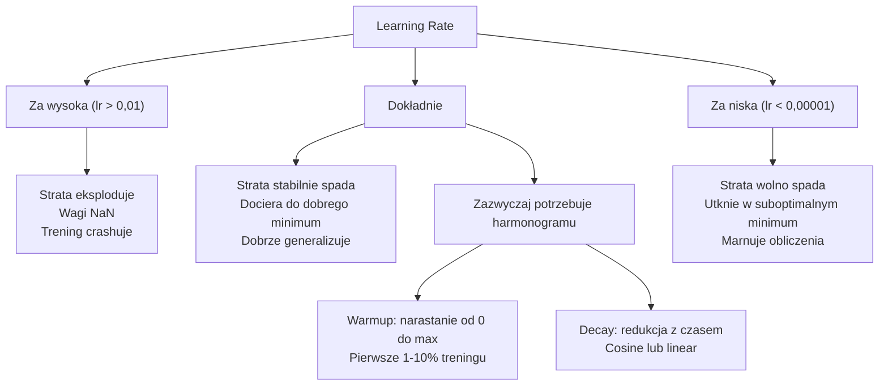
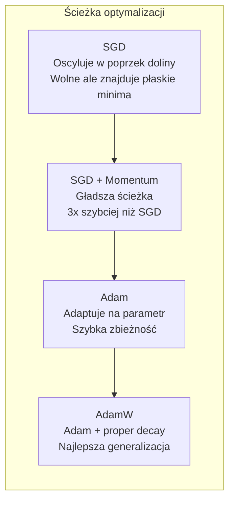
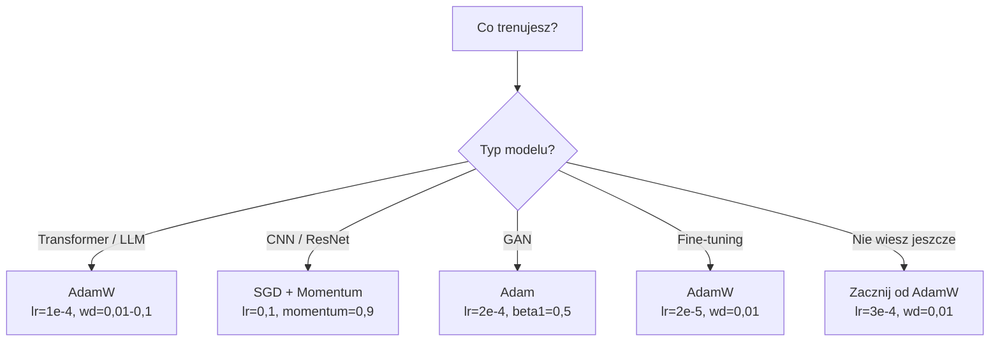

<think>
The user wants me to translate this lesson about Optimizers from English to Polish. Let me follow the guidelines:

1. Stay faithful to the original, preserve style and technical terminology
2. Keep English terms that are standard in the industry (API, GPU, Python, etc.)
3. Don't translate code blocks
4. Use Polish diacritics correctly
5. Add commas before "ze", "bo", "i" (when connecting two independent sentences), etc.
6. Remove external references
7. Format markdown properly

Let me translate this lesson carefully, section by section.
</think>

# Optymizery

> Gradient descent mówi ci, w którym kierunku się poruszać. Nie mówi nic o tym, jak daleko lub jak szybko. SGD to kompas. Adam to GPS z danymi o ruchu drogowym.

**Typ:** Build
**Języki:** Python
**Wymagania wstępne:** Lekcja 03.05 (Funkcje strat)
**Szacowany czas:** ~75 minut

## Cele uczenia się

- Zaimplementuj od podstaw w Pythonie optymizery SGD, SGD z momentum, Adam i AdamW
- Wyjaśnij, jak korekta obciążenia Adama kompensuje oszacowania momentów zainicjowane zerami we wczesnych krokach treningu
- Zademonstruj, dlaczego AdamW daje lepszą generalizację niż Adam z regularyzacją L2 w tym samym zadaniu
- Wybierz odpowiedni optymizer i domyślne hiperparametry dla transformerów, CNN, GAN i fine-tuningu

## Problem

Obliczyłeś gradienty. Wiesz, że waga #4721 powinna zmniejszyć się o 0,003, aby zmniejszyć stratę. Ale 0,003 w jakich jednostkach? Skalowane przez co? I czy powinieneś przesunąć się o tę samą ilość w kroku 1 co w kroku 1000?

Vanilla gradient descent stosuje tę samą szybkość uczenia się (learning rate) do każdego parametru w każdym kroku: w = w - lr * gradient. Tworzy to trzy problemy, które sprawiają, że trenowanie sieci neuronowych jest bolesne w praktyce.

Po pierwsze, oscylacja. Krajobraz strat rzadko ma kształt gładkiej misy. Przypomina raczej długą, wąską dolinę. Gradient wskazuje w poprzek doliny (stromy kierunek), a nie wzdłuż niej (płytki kierunek). Gradient descent podskakuje tam i z powrotem przez wąski wymiar, podczas gdy niewiele robi w użytecznym kierunku. Widziałeś to: strata szybko spada, potem plateau, nie dlatego, że model zbiegł, ale dlatego, że oscyluje.

Po drugie, jedna szybkość uczenia się dla wszystkich parametrów jest błędna. Niektóre wagi potrzebują dużych aktualizacji (są we wczesnym stadium underfitting). Inne potrzebują małych aktualizacji (są blisko swojej optymalnej wartości). Szybkość uczenia się, która działa dla jednych, niszczy drugie i odwrotnie.

Po trzecie, punkty siodłowe. W wysokich wymiarach krajobraz strat ma ogromne płaskie obszary, gdzie gradient jest bliski zera. Vanilla SGD pełznie przez nie z szybkością gradientu, która jest skutecznie zero. Model wygląda na zablokowany. Nie jest zablokowany -- jest na płaskim obszarze z użytecznym zejściem po drugiej stronie. Ale SGD nie ma mechanizmu, który by przez to przepchnął.

Adam rozwiązuje wszystkie trzy. Utrzymuje dwie bieżące średnie na parametr -- średni gradient (momentum, obsługuje oscylację) i średni kwadrat gradientu (adaptacyjna szybkość, obsługuje różne skale). Połączone z korektą obciążenia dla pierwszych kilku kroków, daje jeden optymizer, który działa w 80% problemów z domyślnymi hiperparametrami. Ta lekcja buduje go od podstaw, żebyś dokładnie rozumiał, kiedy i dlaczego zawodzi w pozostałych 20%.

## Koncepcja

### Stochastic Gradient Descent (SGD)

Najprostszy optymizer. Oblicz gradient na mini-batchu i krocz w przeciwnym kierunku.

```
w = w - lr * gradient
```

"Stochastyczny" oznacza, że używasz losowego podzbioru (mini-batch) danych do oszacowania gradientu, a nie całego zestawu danych. Ten szum jest faktycznie użyteczny -- pomaga uciec z ostrych lokalnych minimów. Ale szum także powoduje oscylację.

Learning rate to jedyny pokrętło. Za wysoka: strata diverguje. Za niska: trening trwa wiecznie. Optymalna wartość zależy od architektury, danych, rozmiaru batcha i aktualnego stadium treningu. Dla vanilla SGD na nowoczesnych sieciach, typowe wartości wahają się od 0,01 do 0,1. Ale nawet w ramach jednego treningu, idealna szybkość uczenia się zmienia się.

### Momentum

Analogia z kulą toczącą się z górki jest nadużywana, ale trafna. Zamiast kroczenia samym gradientem, utrzymujesz prędkość, która akumuluje przeszłe gradienty.

```
m_t = beta * m_{t-1} + gradient
w = w - lr * m_t
```

Beta (typowo 0,9) kontroluje, ile historii zachować. Przy beta = 0,9, momentum to w przybliżeniu średnia z ostatnich 10 gradientów (1 / (1 - 0,9) = 10).

Dlaczego to naprawia oscylację: gradienty wskazujące w tym samym kierunku akumulują się. Gradienty zmieniające kierunek kasują się. W tej wąskiej dolinie, komponent "w poprzek" zmienia znak każdego kroku i jest tłumiony. Komponent "wzdłuż" pozostaje spójny i jest wzmacniany. Rezultatem jest płynne przyspieszenie w użytecznym kierunku.

Realne liczby: Sam SGD na źle uwarunkowanym krajobrazie strat może zająć 10 000 kroków. SGD z momentum (beta=0,9) typowo zajmuje 3 000-5 000 kroków na tym samym problemie. Przyspieszenie nie jest marginalne.

### RMSProp

Pierwsza metoda adaptacyjnej szybkości uczenia się na parametr, która faktycznie zadziałała. Zaproponowana przez Hinton w wykładzie na Coursera (nigdy formalnie nieopublikowana).

```
s_t = beta * s_{t-1} + (1 - beta) * gradient^2
w = w - lr * gradient / (sqrt(s_t) + epsilon)
```

s_t śledzi bieżącą średnią kwadratów gradientów. Parametry z konsekwentnie dużymi gradientami są dzielone przez dużą liczbę (mniejsza efektywna szybkość uczenia się). Parametry z małymi gradientami są dzielone przez małą liczbę (większa efektywna szybkość uczenia się).

To rozwiązuje problem "jednej szybkości uczenia się dla wszystkich parametrów". Waga, która już dostawała duże aktualizacje, prawdopodobnie jest blisko celu -- spowolnij ją. Waga, która dostawała małe aktualizacje, może być niedouczona -- przyspiesz ją.

Epsilon (typowo 1e-8) zapobiega dzieleniu przez zero, gdy parametr nie był aktualizowany.

### Adam: Momentum + RMSProp

Adam łączy oba pomysły. Utrzymuje dwie wykładnicze średnie ruchome na parametr:

```
m_t = beta1 * m_{t-1} + (1 - beta1) * gradient        (pierwszy moment: średnia)
v_t = beta2 * v_{t-1} + (1 - beta2) * gradient^2       (drugi moment: wariancja)
```

**Korekta obciążenia** to kluczowy szczegół, który większość wyjaśnień pomija. W kroku 1, m_1 = (1 - beta1) * gradient. Przy beta1 = 0,9, to jest 0,1 * gradient -- dziesięć razy za mało. Średnia ruchoma jeszcze się nie rozgrzała. Korekta obciążenia to kompensuje:

```
m_hat = m_t / (1 - beta1^t)
v_hat = v_t / (1 - beta2^t)
```

W kroku 1 z beta1 = 0,9: m_hat = m_1 / (1 - 0,9) = m_1 / 0,1 = faktyczny gradient. W kroku 100: (1 - 0,9^100) jest w przybliżeniu 1,0, więc korekta znika. Korekta obciążenia ma znaczenie przez pierwsze ~10 kroków i jest nieistotna po ~50.

Aktualizacja:

```
w = w - lr * m_hat / (sqrt(v_hat) + epsilon)
```

Domyślne wartości Adama: lr = 0,001, beta1 = 0,9, beta2 = 0,999, epsilon = 1e-8. Te domyślne wartości działają w 80% problemów. Gdy nie działają, zmień lr pierwszy. Potem beta2. Prawie nigdy nie zmieniaj beta1 lub epsilon.

### AdamW: Weight Decay Zrobione Poprawnie

L2 regularization dodaje lambda * w^2 do straty. W vanilla SGD, jest to równoważne weight decay (odejmowanie lambda * w od wagi w każdym kroku). W Adam, ta równoważność się łamie.

Intuicja Loshchilov & Hutter: gdy dodajesz L2 do straty, a potem Adam przetwarza gradient, adaptacyjna szybkość uczenia się skaluje także termin regularyzacji. Parametry z dużą wariancją gradientu dostają mniej regularyzacji. Parametry z małą wariancją dostają więcej. To nie jest to, czego chcesz -- chcesz jednolitej regularyzacji niezależnie od statystyk gradientu.

AdamW naprawia to, stosując weight decay bezpośrednio do wag, po aktualizacji Adama:

```
w = w - lr * m_hat / (sqrt(v_hat) + epsilon) - lr * lambda * w
```

Termin weight decay (lr * lambda * w) nie jest skalowany przez adaptacyjny czynnik Adama. Każdy parametr dostaje takie samo proporcjonalne zmniejszenie.

To brzmi jak minorowy szczegół. Nie jest. AdamW zbiega do lepszych rozwiązań niż Adam + regularyzacja L2 praktycznie w każdym zadaniu. To domyślny optymizer w PyTorch do trenowania transformerów, modeli dyfuzyjnych i większości nowoczesnych architektur. BERT, GPT, LLaMA, Stable Diffusion -- wszystkie trenowane z AdamW.

### Learning Rate: Najważniejszy Hiperparametr



Jeśli dostroisz jeden hiperparametr, dostroisz learning rate. Zmiana 10x w szybkości uczenia się ma większe znaczenie niż jakakolwiek decyzja architektoniczna, którą podejmiesz. Typowe domyślne:

- SGD: lr = 0,01 do 0,1
- Adam/AdamW: lr = 1e-4 do 3e-4
- Fine-tuning pretrained models: lr = 1e-5 do 5e-5
- Learning rate warmup: liniowe narastanie przez pierwsze 1-10% kroków

### Porównanie optymizerów



### Kiedy każdy optymizer wygrywa



## Zbuduj to

### Krok 1: Vanilla SGD

```python
class SGD:
    def __init__(self, lr=0.01):
        self.lr = lr

    def step(self, params, grads):
        for i in range(len(params)):
            params[i] -= self.lr * grads[i]
```

### Krok 2: SGD z Momentum

```python
class SGDMomentum:
    def __init__(self, lr=0.01, beta=0.9):
        self.lr = lr
        self.beta = beta
        self.velocities = None

    def step(self, params, grads):
        if self.velocities is None:
            self.velocities = [0.0] * len(params)
        for i in range(len(params)):
            self.velocities[i] = self.beta * self.velocities[i] + grads[i]
            params[i] -= self.lr * self.velocities[i]
```

### Krok 3: Adam

```python
import math

class Adam:
    def __init__(self, lr=0.001, beta1=0.9, beta2=0.999, epsilon=1e-8):
        self.lr = lr
        self.beta1 = beta1
        self.beta2 = beta2
        self.epsilon = epsilon
        self.m = None
        self.v = None
        self.t = 0

    def step(self, params, grads):
        if self.m is None:
            self.m = [0.0] * len(params)
            self.v = [0.0] * len(params)

        self.t += 1

        for i in range(len(params)):
            self.m[i] = self.beta1 * self.m[i] + (1 - self.beta1) * grads[i]
            self.v[i] = self.beta2 * self.v[i] + (1 - self.beta2) * grads[i] ** 2

            m_hat = self.m[i] / (1 - self.beta1 ** self.t)
            v_hat = self.v[i] / (1 - self.beta2 ** self.t)

            params[i] -= self.lr * m_hat / (math.sqrt(v_hat) + self.epsilon)
```

### Krok 4: AdamW

```python
class AdamW:
    def __init__(self, lr=0.001, beta1=0.9, beta2=0.999, epsilon=1e-8, weight_decay=0.01):
        self.lr = lr
        self.beta1 = beta1
        self.beta2 = beta2
        self.epsilon = epsilon
        self.weight_decay = weight_decay
        self.m = None
        self.v = None
        self.t = 0

    def step(self, params, grads):
        if self.m is None:
            self.m = [0.0] * len(params)
            self.v = [0.0] * len(params)

        self.t += 1

        for i in range(len(params)):
            self.m[i] = self.beta1 * self.m[i] + (1 - self.beta1) * grads[i]
            self.v[i] = self.beta2 * self.v[i] + (1 - self.beta2) * grads[i] ** 2

            m_hat = self.m[i] / (1 - self.beta1 ** self.t)
            v_hat = self.v[i] / (1 - self.beta2 ** self.t)

            params[i] -= self.lr * m_hat / (math.sqrt(v_hat) + self.epsilon)
            params[i] -= self.lr * self.weight_decay * params[i]
```

### Krok 5: Porównanie treningu

Trenuj tę samą dwuwarstwową sieć na zbiorze danych circle z lekcji 05 ze wszystkimi czterema optymizerami. Porównaj zbieżność.

```python
import random

def sigmoid(x):
    x = max(-500, min(500, x))
    return 1.0 / (1.0 + math.exp(-x))

def make_circle_data(n=200, seed=42):
    random.seed(seed)
    data = []
    for _ in range(n):
        x = random.uniform(-2, 2)
        y = random.uniform(-2, 2)
        label = 1.0 if x * x + y * y < 1.5 else 0.0
        data.append(([x, y], label))
    return data


class OptimizerTestNetwork:
    def __init__(self, optimizer, hidden_size=8):
        random.seed(0)
        self.hidden_size = hidden_size
        self.optimizer = optimizer

        self.w1 = [[random.gauss(0, 0.5) for _ in range(2)] for _ in range(hidden_size)]
        self.b1 = [0.0] * hidden_size
        self.w2 = [random.gauss(0, 0.5) for _ in range(hidden_size)]
        self.b2 = 0.0

    def get_params(self):
        params = []
        for row in self.w1:
            params.extend(row)
        params.extend(self.b1)
        params.extend(self.w2)
        params.append(self.b2)
        return params

    def set_params(self, params):
        idx = 0
        for i in range(self.hidden_size):
            for j in range(2):
                self.w1[i][j] = params[idx]
                idx += 1
        for i in range(self.hidden_size):
            self.b1[i] = params[idx]
            idx += 1
        for i in range(self.hidden_size):
            self.w2[i] = params[idx]
            idx += 1
        self.b2 = params[idx]

    def forward(self, x):
        self.x = x
        self.z1 = []
        self.h = []
        for i in range(self.hidden_size):
            z = self.w1[i][0] * x[0] + self.w1[i][1] * x[1] + self.b1[i]
            self.z1.append(z)
            self.h.append(max(0.0, z))

        self.z2 = sum(self.w2[i] * self.h[i] for i in range(self.hidden_size)) + self.b2
        self.out = sigmoid(self.z2)
        return self.out

    def compute_grads(self, target):
        eps = 1e-15
        p = max(eps, min(1 - eps, self.out))
        d_loss = -(target / p) + (1 - target) / (1 - p)
        d_sigmoid = self.out * (1 - self.out)
        d_out = d_loss * d_sigmoid

        grads = [0.0] * (self.hidden_size * 2 + self.hidden_size + self.hidden_size + 1)
        idx = 0
        for i in range(self.hidden_size):
            d_relu = 1.0 if self.z1[i] > 0 else 0.0
            d_h = d_out * self.w2[i] * d_relu
            grads[idx] = d_h * self.x[0]
            grads[idx + 1] = d_h * self.x[1]
            idx += 2

        for i in range(self.hidden_size):
            d_relu = 1.0 if self.z1[i] > 0 else 0.0
            grads[idx] = d_out * self.w2[i] * d_relu
            idx += 1

        for i in range(self.hidden_size):
            grads[idx] = d_out * self.h[i]
            idx += 1

        grads[idx] = d_out
        return grads

    def train(self, data, epochs=300):
        losses = []
        for epoch in range(epochs):
            total_loss = 0.0
            correct = 0
            for x, y in data:
                pred = self.forward(x)
                grads = self.compute_grads(y)
                params = self.get_params()
                self.optimizer.step(params, grads)
                self.set_params(params)

                eps = 1e-15
                p = max(eps, min(1 - eps, pred))
                total_loss += -(y * math.log(p) + (1 - y) * math.log(1 - p))
                if (pred >= 0.5) == (y >= 0.5):
                    correct += 1
            avg_loss = total_loss / len(data)
            accuracy = correct / len(data) * 100
            losses.append((avg_loss, accuracy))
            if epoch % 75 == 0 or epoch == epochs - 1:
                print(f"    Epoch {epoch:3d}: loss={avg_loss:.4f}, accuracy={accuracy:.1f}%")
        return losses
```

## Użyj tego

Optymizery PyTorch obsługują grupy parametrów, clipping gradientów i harmonogramy szybkości uczenia się:

```python
import torch
import torch.optim as optim

model = torch.nn.Sequential(
    torch.nn.Linear(784, 256),
    torch.nn.ReLU(),
    torch.nn.Linear(256, 10),
)

optimizer = optim.AdamW(model.parameters(), lr=3e-4, weight_decay=0.01)

scheduler = optim.lr_scheduler.CosineAnnealingLR(optimizer, T_max=100)

for epoch in range(100):
    optimizer.zero_grad()
    output = model(torch.randn(32, 784))
    loss = torch.nn.functional.cross_entropy(output, torch.randint(0, 10, (32,)))
    loss.backward()
    torch.nn.utils.clip_grad_norm_(model.parameters(), max_norm=1.0)
    optimizer.step()
    scheduler.step()
```

Wzorzec jest zawsze taki sam: zero_grad, forward, loss, backward, (clip), step, (schedule). Zapamiętaj tę kolejność. Pomylenie jej (np. wywołanie scheduler.step() przed optimizer.step()) to częste źródło subtelnych błędów.

Dla CNN, wielu praktyków nadal woli SGD + momentum (lr=0,1, momentum=0,9, weight_decay=1e-4) z harmonogramem step lub cosine. SGD znajduje gładsze minima, co często lepiej generalizuje. Dla transformerów i LLM, AdamW z warmup + cosine decay to uniwersalny domyślny. Nie walcz z konsensusem bez zmierzonego powodu.

## Wyślij to

Ta lekcja wytwarza:
- `outputs/prompt-optimizer-selector.md` -- prompt decyzyjny do wyboru właściwego optymizera i szybkości uczenia się dla dowolnej architektury

## Ćwiczenia

1. Zaimplementuj Nesterov momentum, gdzie obliczasz gradient w pozycji "lookahead" (w - lr * beta * v) zamiast bieżącej pozycji. Porównaj zbieżność ze standardowym momentum na zbiorze danych circle.

2. Zaimplementuj harmonogram warmup szybkości uczenia się: liniowe narastanie od 0 do max_lr przez pierwsze 10% kroków treningu, potem cosine decay do 0. Trenuj z Adam + warmup vs Adam bez warmup. Zmierz, ile epok zajmuje osiągnięcie 90% accuracy na zbiorze danych circle.

3. Śledź efektywną szybkość uczenia się dla każdego parametru podczas treningu Adam. Efektywna szybkość to lr * m_hat / (sqrt(v_hat) + eps). Wykreśl rozkład efektywnych szybkości po 10, 50 i 200 krokach. Czy wszystkie parametry są aktualizowane z tą samą szybkością?

4. Zaimplementuj gradient clipping (clip przez global norm). Ustaw max gradient norm na 1,0. Trenuj z i bez clippingu używając wysokiej szybkości uczenia się (lr=0,01 dla Adam). Policz, ile uruchomień diverguje (strata idzie w NaN) z i bez clippingu przez 10 losowych seedów.

5. Porównaj Adam vs AdamW na sieci z dużymi wagami. Zainicjuj wszystkie wagi losowymi wartościami w [-5, 5] (znacznie większe niż normalnie). Trenuj przez 200 epok z weight_decay=0,1. Wykreśl normę L2 wag podczas treningu dla obu optymizerów. AdamW powinien pokazać szybsze kurczenie się wag.

## Kluczowe terminy

| Termin | Co ludzie mówią | Co to faktycznie oznacza |
|------|----------------|----------------------|
| Learning rate | "Rozmiar kroku" | Mnożnik skalarny na aktualizacji gradientu; najbardziej wpływowy hiperparametr w treningu |
| SGD | "Podstawowy gradient descent" | Stochastic gradient descent: aktualizuj wagi przez odejmowanie lr * gradient, obliczone na mini-batchu |
| Momentum | "Analogia z toczącą się kulą" | Wykładnicza średnia ruchoma przeszłych gradientów; thumi oscylację i przyspiesza spójne kierunki |
| RMSProp | "Adaptacyjna szybkość uczenia się" | Dzieli gradient każdego parametru przez bieżący RMS jego ostatnich gradientów; wyrównuje szybkości uczenia się |
| Adam | "Domyślny optymizer" | Łączy momentum (pierwszy moment) i RMSProp (drugi moment) z korektą obciążenia dla początkowych kroków |
| AdamW | "Adam zrobione poprawnie" | Adam z odłączonym weight decay; stosuje regularyzację bezpośrednio do wag, a nie przez gradient |
| Bias correction | "Rozgrzewka dla średnich ruchomych" | Dzielenie przez (1 - beta^t) aby skompensować zerową inicjalizację oszacowań momentów Adama |
| Weight decay | "Kurcz wagi" | Odejmowanie frakcji wartości wagi w każdym kroku; regularizer karający duże wagi |
| Learning rate schedule | "Zmiana lr z czasem" | Funkcja dostosowująca szybkość uczenia się podczas treningu; warmup + cosine decay to nowoczesny domyślny |
| Gradient clipping | "Ograniczanie normy gradientu" | Skalowanie gradientu w dół gdy jego norma przekracza próg; zapobiega eksplodującym aktualizacjom gradientu |

## Dalsza lektura

- Kingma & Ba, "Adam: A Method for Stochastic Optimization" (2014) -- oryginalny artykuł o Adam z analizą zbieżności i wyprowadzeniem korekty obciążenia
- Loshchilov & Hutter, "Decoupled Weight Decay Regularization" (2017) -- udowodnili, że regularyzacja L2 i weight decay nie są równoważne w Adam, i zaproponowali AdamW
- Smith, "Cyclical Learning Rates for Training Neural Networks" (2017) -- wprowadzili test zakresu LR i harmonogramy cykliczne, które eliminują potrzebę dostrajania stałej szybkości uczenia się
- Ruder, "An Overview of Gradient Descent Optimization Algorithms" (2016) -- najlepsze pojedyncze zestawienie wszystkich wariantów optymizerów, z jasnymi porównaniami i intuicjami