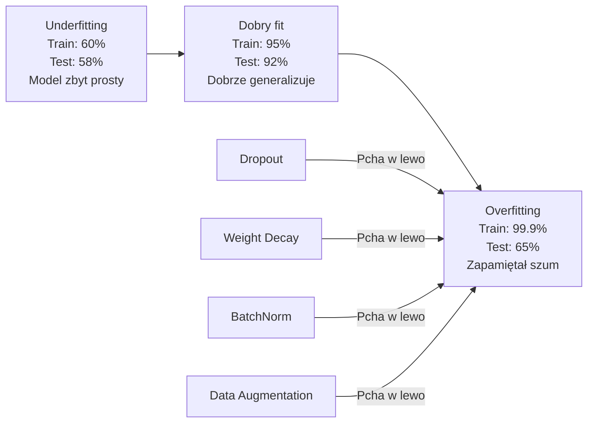
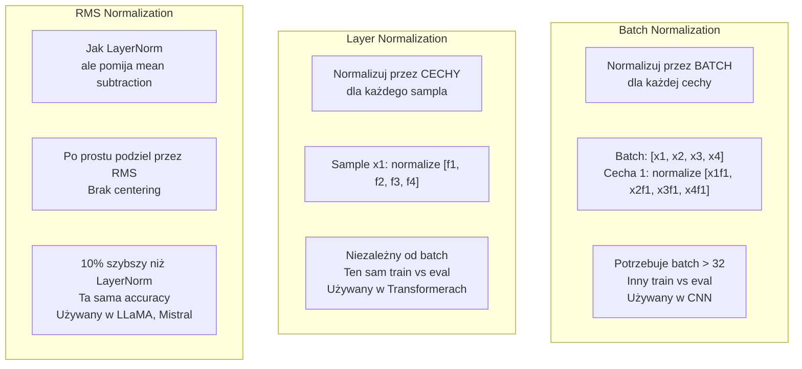
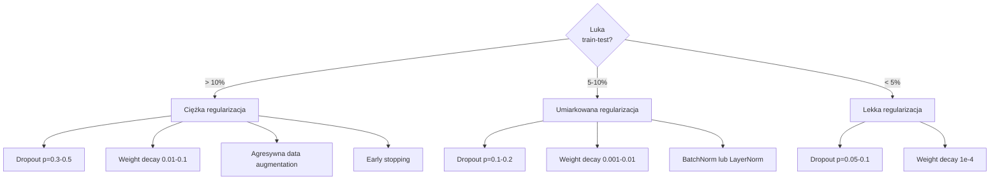

<think>The user wants me to translate a technical lesson about Regularization from English to Polish. Let me analyze the content and follow the instructions:

1. Keep all technical terms, code, variable names, function names in English
2. Keep certain words in English as specified
3. Translate concepts and explanations to Polish
4. Use Polish diacritics correctly
5. Add commas before specific conjunctions
6. Keep markdown formatting
7. Don't translate code blocks

Let me start translating section by section.</think>

# Regularizacja

> Twój model osiąga 99% na danych treningowych i 60% na danych testowych. Zamiast uczyć się, zapamiętał dane. Regularizacja to podatek, który nakładamy na złożoność, żeby wymusić generalizację.

**Typ:** Build
**Języki:** Python
**Wymagania wstępne:** Lesson 03.06 (Optymalizatory)
**Szacowany czas:** ~75 minut

## Cele uczenia się

- Zaimplementować dropout ze skalowaniem odwróconym, L2 weight decay, batch normalization, layer normalization i RMSNorm od zera
- Zmierzyć lukę między dokładnością treningową a testową oraz zdiagnozować overfitting za pomocą eksperymentów z regularizacją
- Wyjaśnić, dlaczego transformery używają LayerNorm zamiast BatchNorm oraz dlaczego nowoczesne LLM preferują RMSNorm
- Zastosować prawidłową kombinację technik regularizacji w zależności od stopnia overfittingu

## Problem

Sieć neuronowa z wystarczającą liczbą parametrów może zapamiętać każdy zbiór danych. To nie jest hipotetyza -- Zhang i in. (2017) udowodnili to, trenując standardowe sieci na ImageNet z losowymi etykietami. Sieci osiągnęły niemal zero loss na treningu przy całkowicie losowych przypisaniach etykiet. Zapamiętały milion losowych par input-output bez żadnego wzorca do nauczenia. Training loss był idealny. Test accuracy wynosił zero.

To jest problem overfittingu i pogarsza się on wraz ze wzrostem rozmiaru modeli. GPT-3 ma 175 miliardów parametrów. Zbiór treningowy ma około 500 miliardów tokenów. Przy tak wielu parametrach model ma wystarczającą pojemność, żeby zapamiętać znaczące fragmenty danych treningowych w całości. Bez regularizacji po prostu zwracałby przykłady treningowe zamiast uczyć się uogólnialnych wzorców.

Luka między treningową a testową wydajnością to luka overfittingu. Każda technika w tej lekcji atakuje tę lukę z innej strony. Dropout zmusza sieć do niepolegania na żadnym pojedynczym neuronie. Weight decay zapobiega nadmiernemu wzrostowi żadnego pojedynczego wagi. Batch normalization wygładza landscape loss, więc optimizer znajduje płaskie, bardziej uogólnialne minima. Layer normalization robi to samo, ale działa tam, gdzie batch normalization zawodzi (małe batche, sekwencje o zmiennej długości). RMSNorm robi to 10% szybciej, usuwając obliczenie mean. Każda technika jest prosta. Razem stanowią różnicę między modelem, który zapamiętuje, a takim, który uogólnia.

## Koncept

### Spektrum Overfittingu

Każdy model znajduje się gdzieś na spektrum od underfittingu (zbyt prosty, żeby uchwycić wzorzec) do overfittingu (tak złożony, że uchwytuje szum). Słodki punkt jest pomiędzy, a regularizacja popycha modele w jego kierunku od strony overfit.



### Dropout

Najprostsza technika regularizacji z najbardziej elegancką interpretacją. Podczas treningu losowo ustawiamy wyjście każdego neuronu na zero z prawdopodobieństwem p.

```
output = activation(z) * mask    gdzie mask[i] ~ Bernoulli(1 - p)
```

Przy p = 0.5, połowa neuronów jest zerowana przy każdym forward pass. Sieć musi nauczyć się redundantnych reprezentacji, bo nie może przewidzieć, które neurony będą dostępne. To zapobiega co-adaptation -- neurony uczą się polegać na konkretnych innych neuronach, które są obecne.

Interpretacja jako ensemble: sieć z N neuronami i dropout tworzy 2^N możliwych subnets (każda kombinacja neuronów włączonych lub wyłączonych). Trenowanie z dropout trenując przybliża wszystkie 2^N subnets jednocześnie, każdy na różnych mini-batchach. W czasie testowania używasz wszystkich neuronów (bez dropout) i skalujesz wyjścia przez (1 - p), żeby dopasować expected value podczas treningu. To jest równoważne uśrednianiu predykcji 2^N subnetworks -- ogromny ensemble z jednego modelu.

W praktyce skalowanie jest stosowane podczas treningu zamiast testowania (inverted dropout):

```
Podczas treningu:  output = activation(z) * mask / (1 - p)
Podczas testowania:   output = activation(z)   (brak zmian)
```

To jest czystsze, bo kod testowy nie musi wiedzieć nic o dropout.

Domyślne wartości: p = 0.1 dla transformerów, p = 0.5 dla MLP, p = 0.2-0.3 dla CNN. Wyższy dropout = silniejsza regularizacja = większe ryzyko underfittingu.

### Weight Decay (L2 Regularization)

Dodaj kwadrat wielkości wszystkich wag do loss:

```
total_loss = task_loss + (lambda / 2) * sum(w_i^2)
```

Gradient memberu regularizacyjnego to lambda * w. To oznacza, że przy każdym kroku każda waga jest kurczona w kierunku zera o frakcję proporcjonalną do jej wielkości. Duże wagi są karane bardziej. Model jest popychany w kierunku rozwiązań, gdzie żadna pojedyncza waga nie dominuje.

Dlaczego to pomaga w generalizacji: przeuczone modele mają tendencję do posiadania dużych wag, które wzmacniają szum w danych treningowych. Weight decay utrzymuje wagi małe, co ogranicza effective capacity modelu i zmusza go do polegania na robustnych, uogólnialnych cechach zamiast na zapamiętanych quirkach.

Hyperparameter lambda kontroluje siłę. Typowe wartości:

- 0.01 dla AdamW na transformerach
- 1e-4 dla SGD na CNN
- 0.1 dla mocno przeuczonych modeli

Jak omówiono w lekcji 06: weight decay i L2 regularization są równoważne w SGD, ale nie w Adam. Zawsze używaj AdamW (decoupled weight decay) podczas treningu z Adam.

### Batch Normalization

Normalizuj wyjście każdej warstwy przez mini-batch przed przekazaniem do następnej warstwy.

Dla mini-batchu aktywacji w pewnej warstwie:

```
mu = (1/B) * sum(x_i)           (batch mean)
sigma^2 = (1/B) * sum((x_i - mu)^2)   (batch variance)
x_hat = (x_i - mu) / sqrt(sigma^2 + eps)   (normalize)
y = gamma * x_hat + beta        (scale and shift)
```

Gamma i beta to parametry learnable, które pozwalają sieci cofnąć normalizację, jeśli to jest optymalne. Bez nich wymuszałbyś, żeby wyjście każdej warstwy było zero-mean unit-variance, co może nie być tym, czego sieć chce.

**Rozdzielenie train vs inference:** Podczas treningu mu i sigma pochodzą z current mini-batch. Podczas inferencji używasz running averages akumulowanych podczas treningu (exponential moving average z momentum = 0.1, co oznacza 90% stare + 10% nowe).

Dlaczego BatchNorm działa jest nadal debatowane. Oryginalny paper twierdził, że redukuje "internal covariate shift" (rozkład wejść warstwy zmienia się w miarę aktualizacji wcześniejszych warstw). Santurkar i in. (2018) pokazali, że to wyjaśnienie jest błędne. Prawdziwy powód: BatchNorm wygładza loss landscape. Gradianienty są bardziej predictive, Lipschitz constants są mniejsze i optimizer może brać większe kroki bezpiecznie. Dlatego BatchNorm pozwala używać wyższych learning rates i szybciej converge.

BatchNorm ma fundamentalne ograniczenie: zależy od batch statistics. Przy batch size 1, mean i variance są bez znaczenia. Przy małych batchach (< 32), statystyki są szumne i szkodzą wydajności. To ma znaczenie dla zadań jak object detection (gdzie pamięć ogranicza batch size) i language modeling (gdzie długości sekwencji są różne).

### Layer Normalization

Normalizuj przez cechy zamiast przez batch. Dla pojedynczego sampla:

```
mu = (1/D) * sum(x_j)           (feature mean)
sigma^2 = (1/D) * sum((x_j - mu)^2)   (feature variance)
x_hat = (x_j - mu) / sqrt(sigma^2 + eps)
y = gamma * x_hat + beta
```

D to wymiar cech. Każdy sample jest normalizowany niezależnie -- brak zależności od batch size. Dlatego transformery używają LayerNorm zamiast BatchNorm. Sekwencje mają zmienne długości, batch size są często małe (lub 1 podczas generacji), a obliczenia są identyczne między treningiem a inferencją.

LayerNorm w transformerach jest stosowany po każdym self-attention block i każdym feed-forward block (Post-LN), lub przed nimi (Pre-LN, co jest bardziej stabilne dla treningu).

### RMSNorm

LayerNorm bez odejmowania mean. Zaproponowany przez Zhang & Sennrich (2019).

```
rms = sqrt((1/D) * sum(x_j^2))
y = gamma * x / rms
```

I to tyle. Brak obliczania mean, brak parametru beta. Obserwacja: re-centering (mean subtraction) w LayerNorm wnosi bardzo mało do wydajności modelu, ale kosztuje obliczenia. Usunięcie go daje tę samą accuracy przy około 10% mniejszym overhead.

LLaMA, LLaMA 2, LLaMA 3, Mistral i większość nowoczesnych LLM używają RMSNorm zamiast LayerNorm. Na skali miliardów parametrów i bilionów tokenów, te 10% oszczędności jest znaczące.

### Porównanie Normalizacji



### Data Augmentation jako Regularizacja

Nie modyfikacja modelu, lecz modyfikacja danych. Transformuj treningowe inputy, zachowując etykiety:

- Obrazy: random crop, flip, rotation, color jitter, cutout
- Tekst: synonym replacement, back-translation, random deletion
- Audio: time stretch, pitch shift, noise addition

Efekt jest identyczny z regularizacją: zwiększa effective size zbioru treningowego, utrudniając modelowi zapamiętywanie konkretnych przykładów. Model, który widzi każdy obraz tylko raz w oryginalnej formie, może go zapamiętać. Model, który widzi 50 augmented wersji każdego obrazu, jest zmuszony uczyć się niezmiennej struktury.

### Early Stopping

Najprostszy regularizer: przestań trenować, gdy validation loss zaczyna rosnąć. Model jeszcze nie przeuczył się w tym momencie. W praktyce śledzisz validation loss co epoch, zapisujesz najlepszy model i kontynuujesz trening przez "patience" window (typowo 5-20 epochs). Jeśli validation loss nie poprawi się w tym oknie, zatrzymujesz i ładujesz najlepszy zapisany model.

### Kiedy stosować co



## Zbuduj to

### Krok 1: Dropout (Tryb Train i Eval)

```python
import random
import math


class Dropout:
    def __init__(self, p=0.5):
        self.p = p
        self.training = True
        self.mask = None

    def forward(self, x):
        if not self.training:
            return list(x)
        self.mask = []
        output = []
        for val in x:
            if random.random() < self.p:
                self.mask.append(0)
                output.append(0.0)
            else:
                self.mask.append(1)
                output.append(val / (1 - self.p))
        return output

    def backward(self, grad_output):
        grads = []
        for g, m in zip(grad_output, self.mask):
            if m == 0:
                grads.append(0.0)
            else:
                grads.append(g / (1 - self.p))
        return grads
```

### Krok 2: L2 Weight Decay

```python
def l2_regularization(weights, lambda_reg):
    penalty = 0.0
    for w in weights:
        penalty += w * w
    return lambda_reg * 0.5 * penalty

def l2_gradient(weights, lambda_reg):
    return [lambda_reg * w for w in weights]
```

### Krok 3: Batch Normalization

```python
class BatchNorm:
    def __init__(self, num_features, momentum=0.1, eps=1e-5):
        self.gamma = [1.0] * num_features
        self.beta = [0.0] * num_features
        self.eps = eps
        self.momentum = momentum
        self.running_mean = [0.0] * num_features
        self.running_var = [1.0] * num_features
        self.training = True
        self.num_features = num_features

    def forward(self, batch):
        batch_size = len(batch)
        if self.training:
            mean = [0.0] * self.num_features
            for sample in batch:
                for j in range(self.num_features):
                    mean[j] += sample[j]
            mean = [m / batch_size for m in mean]

            var = [0.0] * self.num_features
            for sample in batch:
                for j in range(self.num_features):
                    var[j] += (sample[j] - mean[j]) ** 2
            var = [v / batch_size for v in var]

            for j in range(self.num_features):
                self.running_mean[j] = (1 - self.momentum) * self.running_mean[j] + self.momentum * mean[j]
                self.running_var[j] = (1 - self.momentum) * self.running_var[j] + self.momentum * var[j]
        else:
            mean = list(self.running_mean)
            var = list(self.running_var)

        self.x_hat = []
        output = []
        for sample in batch:
            normalized = []
            out_sample = []
            for j in range(self.num_features):
                x_h = (sample[j] - mean[j]) / math.sqrt(var[j] + self.eps)
                normalized.append(x_h)
                out_sample.append(self.gamma[j] * x_h + self.beta[j])
            self.x_hat.append(normalized)
            output.append(out_sample)
        return output
```

### Krok 4: Layer Normalization

```python
class LayerNorm:
    def __init__(self, num_features, eps=1e-5):
        self.gamma = [1.0] * num_features
        self.beta = [0.0] * num_features
        self.eps = eps
        self.num_features = num_features

    def forward(self, x):
        mean = sum(x) / len(x)
        var = sum((xi - mean) ** 2 for xi in x) / len(x)

        self.x_hat = []
        output = []
        for j in range(self.num_features):
            x_h = (x[j] - mean) / math.sqrt(var + self.eps)
            self.x_hat.append(x_h)
            output.append(self.gamma[j] * x_h + self.beta[j])
        return output
```

### Krok 5: RMSNorm

```python
class RMSNorm:
    def __init__(self, num_features, eps=1e-6):
        self.gamma = [1.0] * num_features
        self.eps = eps
        self.num_features = num_features

    def forward(self, x):
        rms = math.sqrt(sum(xi * xi for xi in x) / len(x) + self.eps)
        output = []
        for j in range(self.num_features):
            output.append(self.gamma[j] * x[j] / rms)
        return output
```

### Krok 6: Trenowanie z i bez Regularizacji

```python
def sigmoid(x):
    x = max(-500, min(500, x))
    return 1.0 / (1.0 + math.exp(-x))


def make_circle_data(n=200, seed=42):
    random.seed(seed)
    data = []
    for _ in range(n):
        x = random.uniform(-2, 2)
        y = random.uniform(-2, 2)
        label = 1.0 if x * x + y * y < 1.5 else 0.0
        data.append(([x, y], label))
    return data


class RegularizedNetwork:
    def __init__(self, hidden_size=16, lr=0.05, dropout_p=0.0, weight_decay=0.0):
        random.seed(0)
        self.hidden_size = hidden_size
        self.lr = lr
        self.dropout_p = dropout_p
        self.weight_decay = weight_decay
        self.dropout = Dropout(p=dropout_p) if dropout_p > 0 else None

        self.w1 = [[random.gauss(0, 0.5) for _ in range(2)] for _ in range(hidden_size)]
        self.b1 = [0.0] * hidden_size
        self.w2 = [random.gauss(0, 0.5) for _ in range(hidden_size)]
        self.b2 = 0.0

    def forward(self, x, training=True):
        self.x = x
        self.z1 = []
        self.h = []
        for i in range(self.hidden_size):
            z = self.w1[i][0] * x[0] + self.w1[i][1] * x[1] + self.b1[i]
            self.z1.append(z)
            self.h.append(max(0.0, z))

        if self.dropout and training:
            self.dropout.training = True
            self.h = self.dropout.forward(self.h)
        elif self.dropout:
            self.dropout.training = False
            self.h = self.dropout.forward(self.h)

        self.z2 = sum(self.w2[i] * self.h[i] for i in range(self.hidden_size)) + self.b2
        self.out = sigmoid(self.z2)
        return self.out

    def backward(self, target):
        eps = 1e-15
        p = max(eps, min(1 - eps, self.out))
        d_loss = -(target / p) + (1 - target) / (1 - p)
        d_sigmoid = self.out * (1 - self.out)
        d_out = d_loss * d_sigmoid

        for i in range(self.hidden_size):
            d_relu = 1.0 if self.z1[i] > 0 else 0.0
            d_h = d_out * self.w2[i] * d_relu
            self.w2[i] -= self.lr * (d_out * self.h[i] + self.weight_decay * self.w2[i])
            for j in range(2):
                self.w1[i][j] -= self.lr * (d_h * self.x[j] + self.weight_decay * self.w1[i][j])
            self.b1[i] -= self.lr * d_h
        self.b2 -= self.lr * d_out

    def evaluate(self, data):
        correct = 0
        total_loss = 0.0
        for x, y in data:
            pred = self.forward(x, training=False)
            eps = 1e-15
            p = max(eps, min(1 - eps, pred))
            total_loss += -(y * math.log(p) + (1 - y) * math.log(1 - p))
            if (pred >= 0.5) == (y >= 0.5):
                correct += 1
        return total_loss / len(data), correct / len(data) * 100

    def train_model(self, train_data, test_data, epochs=300):
        history = []
        for epoch in range(epochs):
            total_loss = 0.0
            correct = 0
            for x, y in train_data:
                pred = self.forward(x, training=True)
                self.backward(y)
                eps = 1e-15
                p = max(eps, min(1 - eps, pred))
                total_loss += -(y * math.log(p) + (1 - y) * math.log(1 - p))
                if (pred >= 0.5) == (y >= 0.5):
                    correct += 1
            train_loss = total_loss / len(train_data)
            train_acc = correct / len(train_data) * 100
            test_loss, test_acc = self.evaluate(test_data)
            history.append((train_loss, train_acc, test_loss, test_acc))
            if epoch % 75 == 0 or epoch == epochs - 1:
                gap = train_acc - test_acc
                print(f"    Epoch {epoch:3d}: train_acc={train_acc:.1f}%, test_acc={test_acc:.1f}%, gap={gap:.1f}%")
        return history
```

## Użyj tego

PyTorch dostarcza wszystkie normalizacje i regularizacje jako moduły:

```python
import torch
import torch.nn as nn

model = nn.Sequential(
    nn.Linear(784, 256),
    nn.BatchNorm1d(256),
    nn.ReLU(),
    nn.Dropout(0.3),
    nn.Linear(256, 128),
    nn.BatchNorm1d(128),
    nn.ReLU(),
    nn.Dropout(0.3),
    nn.Linear(128, 10),
)

model.train()
out_train = model(torch.randn(32, 784))

model.eval()
out_test = model(torch.randn(1, 784))
```

Przełącznik `model.train()` / `model.eval()` jest krytyczny. Przełącza dropout on/off i mówi BatchNorm, żeby używał batch statistics vs running statistics. Zapomnienie `model.eval()` przed inferencją to jeden z najczęstszych bugów w deep learningu. Test accuracy będzie losowo fluktuować, bo dropout jest wciąż aktywny, a BatchNorm używa mini-batch statistics.

Dla transformerów wzorzec jest inny:

```python
class TransformerBlock(nn.Module):
    def __init__(self, d_model=512, nhead=8, dropout=0.1):
        super().__init__()
        self.attention = nn.MultiheadAttention(d_model, nhead, dropout=dropout)
        self.norm1 = nn.LayerNorm(d_model)
        self.ff = nn.Sequential(
            nn.Linear(d_model, d_model * 4),
            nn.GELU(),
            nn.Linear(d_model * 4, d_model),
            nn.Dropout(dropout),
        )
        self.norm2 = nn.LayerNorm(d_model)
        self.dropout = nn.Dropout(dropout)

    def forward(self, x):
        attended, _ = self.attention(x, x, x)
        x = self.norm1(x + self.dropout(attended))
        x = self.norm2(x + self.ff(x))
        return x
```

LayerNorm, nie BatchNorm. Dropout p=0.1, nie p=0.5. To są domyślne wartości dla transformerów.

## Wyślij to

Ta lekcja produkuje:
- `outputs/prompt-regularization-advisor.md` -- prompt, który diagnozuje overfitting i rekomenduje właściwą strategię regularizacji

## Ćwiczenia

1. Zaimplementuj spatial dropout dla danych 2D: zamiast upuszczać pojedyncze neurony, upuść całe kanały cech. Symuluj to traktując grupy kolejnych cech jako kanały i upuszczając całe grupy. Porównaj lukę train-test ze standardowym dropout na zbiorze danych circle z hidden_size=32.

2. Zaimplementuj label smoothing z lekcji 05 w połączeniu z dropout z tej lekcji. Trenuj z czterema konfiguracjami: ani jedno, ani drugie; tylko dropout; tylko label smoothing; oba. Zmierz finalną lukę train-test accuracy dla każdej. Która kombinacja daje najmniejszą lukę?

3. Dodaj warstwę BatchNorm między warstwą ukrytą a aktywacją w sieci na zbiorze danych circle. Trenuj z i bez BatchNorm przy learning rates 0.01, 0.05 i 0.1. BatchNorm powinien pozwolić na stabilny trening przy wyższych learning rates, gdzie vanilla network diverguje.

4. Zaimplementuj early stopping: śledź test loss co epoch, zapisuj najlepsze wagi i przestań, jeśli test loss nie poprawia się przez 20 epochs. Uruchom zregularizowaną sieć przez 1000 epochs. Raportuj, który epoch miał najlepsze test accuracy i ile epochs obliczeń zaoszczędziłeś.

5. Porównaj LayerNorm vs RMSNorm na sieci 4-warstwowej (nie tylko 2). Zainicjuj obie tymi samymi wagami. Trenuj przez 200 epochs i porównaj final accuracy, szybkość treningu (czas na epoch) i wielkości gradientów w pierwszej warstwie. Zweryfikuj, że RMSNorm jest szybszy przy tej samej accuracy.

## Kluczowe Terminy

| Termin | Co ludzie mówią | Co to faktycznie oznacza |
|--------|-----------------|-------------------------|
| Overfitting | "Model zapamiętał dane" | Gdy wydajność treningowa modelu znacząco przewyższa jego wydajność testową, co wskazuje, że nauczył się szumu zamiast sygnału |
| Regularization | "Zapobieganie overfitting" | Każda technika, która ogranicza złożoność modelu, żeby poprawić generalizację: dropout, weight decay, normalization, augmentation |
| Dropout | "Losowe usuwanie neuronów" | Zerowanie losowych neuronów podczas treningu z prawdopodobieństwem p, wymuszanie redundantnych reprezentacji; równoważne treningowi ensemble |
| Weight decay | "L2 penalty" | Kurczenie wszystkich wag w kierunku zera przez odejmowanie lambda * w przy każdym kroku; karze złożoność przez wielkość wag |
| Batch normalization | "Normalizuj per batch" | Normalizowanie wyjść warstwy przez wymiar batch używając batch statistics podczas treningu i running averages podczas inferencji |
| Layer normalization | "Normalizuj per sample" | Normalizowanie przez cechy w każdym samplu; niezależne od batch, używane w transformerach gdzie batch size się zmienia |
| RMSNorm | "LayerNorm bez mean" | Root mean square normalization; opuszcza mean subtraction z LayerNorm dla 10% przyspieszenia przy równej accuracy |
| Early stopping | "Przestań przed overfit" | Zatrzymanie treningu gdy validation loss przestaje się poprawiać; najprostszy regularizer, często używany z innymi |
| Data augmentation | "Więcej danych z mniej" | Transformowanie treningowych inputów (flip, crop, noise) żeby zwiększyć effective size zbioru danych i wymusić uczenie się niezmienników |
| Generalization gap | "Train-test split" | Różnica między treningową a testową wydajnością; regularizacja ma na celu minimalizację tej luki |

## Dalsze czytanie

- Srivastava i in., "Dropout: A Simple Way to Prevent Neural Networks from Overfitting" (2014) -- oryginalny paper o dropout z interpretacją ensemble i rozległymi eksperymentami
- Ioffe & Szegedy, "Batch Normalization: Accelerating Deep Network Training by Reducing Internal Covariate Shift" (2015) -- wprowadził BatchNorm i jego procedurę treningową, jeden z najczęściej cytowanych deep learning papers
- Zhang & Sennrich, "Root Mean Square Layer Normalization" (2019) -- pokazał, że RMSNorm dorównuje LayerNorm accuracy przy zmniejszonych obliczeniach; adoptowany przez LLaMA i Mistral
- Zhang i in., "Understanding Deep Learning Requires Rethinking Generalization" (2017) -- przełomowy paper pokazujący, że sieci neuronowe mogą zapamiętywać losowe etykiety, podważając tradycyjne poglądy na generalizację