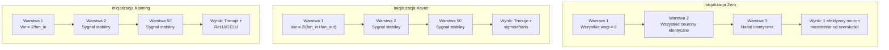
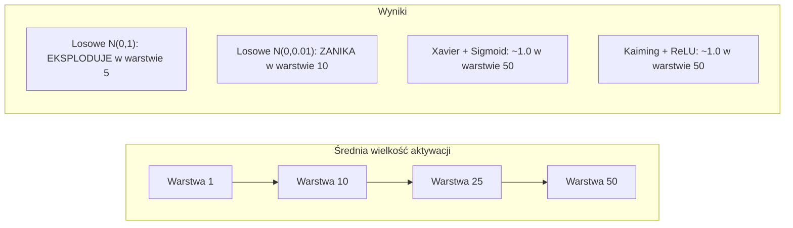
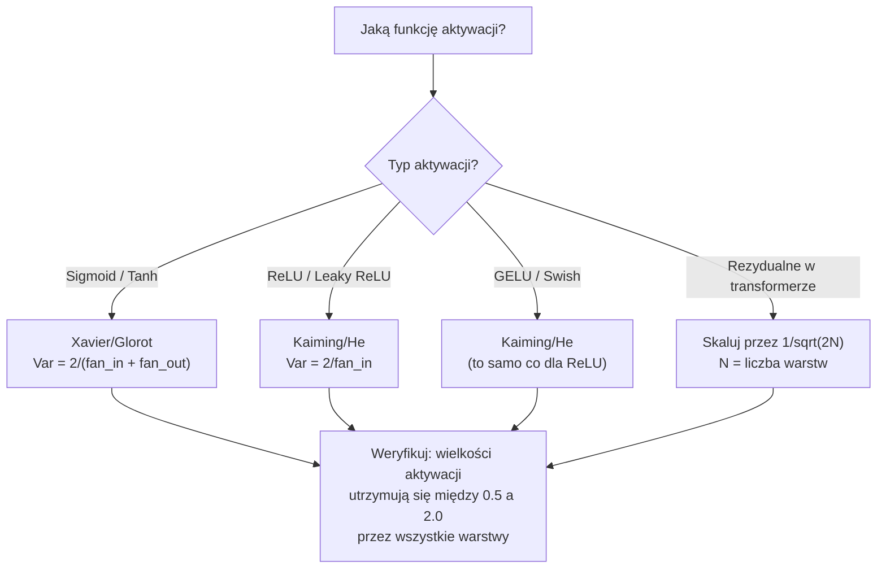

<think>The user wants me to translate this technical lesson about Weight Initialization and Training Stability from English to Polish. Let me carefully translate this while maintaining the technical accuracy and following the rules specified in the system prompt.

Key points:
- Translate from EN to PL faithfully, minimal intervention
- Allowed English terms: API, GPU, CPU, RAM, SQL, Python, PyTorch, TensorFlow, HuggingFace, LangChain, machine learning terms, etc.
- Do NOT translate: train_model(), forward(), backward(), learning_rate, batch_size, import torch
- Do translate: learning objectives -> cele uczenia się, prerequisites -> wymagania wstepne, time -> czas
- Polish diacritics: pamietam, not pamiętać (wait, that's not right - I need to write pamiętać with the correct Polish diacritics: pamiętać)
- Code blocks - do NOT translate, leave as is
- Keep the technical terminology accurate

Let me translate this carefully:</think>

# Inicjalizacja wag i stabilność treningu

> Zainicjalizuj źle, a trening nigdy się nie zacznie. Zainicjalizuj dobrze, a 50 warstw trenuje tak samo gładko jak 3.

**Typ:** Zbuduj to
**Języki:** Python
**Wymagania wstępne:** Lekcja 03.04 (Funkcje aktywacji), Lekcja 03.07 (Regularyzacja)
**Czas:** ~90 minut

## Cele uczenia się

- Zaimplementować strategie inicjalizacji: zero, losową, Xavier/Glorot i Kaiming/He oraz zmierzyć ich wpływ na wielkości aktywacji przez 50 warstw
- Wyprowadzić dlaczego inicjalizacja Xavier używa Var(w) = 2/(fan_in + fan_out) oraz Kaiming używa Var(w) = 2/fan_in
- Zademonstrować problem symetrii przy inicjalizacji zerowej i wyjaśnić, dlaczego sama losowa skala nie jest wystarczająca
- Dopasować właściwą strategię inicjalizacji do funkcji aktywacji: Xavier dla sigmoid/tanh, Kaiming dla ReLU/GELU

## Problem

Zainicjalizuj wszystkie wagi na zero. Nic się nie uczy. Każdy neuron oblicza tę samą funkcję, otrzymuje ten sam gradient i aktualizuje się identycznie. Po 10 000 epokach Twoja warstwa ukryta z 512 neuronami nadal zawiera 512 kopii tego samego neuronu. Zapłaciłeś za 512 parametrów, a otrzymałeś 1.

Zainicjalizuj je zbyt dużymi wartościami. Aktywacje eksplodują przez sieć. W warstwie 10 wartości osiągają 1e15. W warstwie 20 przepełniają się do nieskończoności. Gradienty podążają tą samą trajektorią wstecz.

Zainicjalizuj je losowo ze standardowego rozkładu normalnego. Działa dla 3 warstw. Przy 50 warstwach sygnał zanika do zera lub detonuje do nieskończoności, w zależności od tego, czy skala losowa była nieco za mała, czy nieco za duża. Granica między "działa" a "zepsute" jest bardzo cienka.

Inicjalizacja wag to najbardziej niedoceniana decyzja w deep learningu. Architektura dostaje artykuły naukowe. Optymalizatory dostają posty na blogach. Inicjalizacja dostaje przypis. Ale jeśli zrobisz to źle, nic innego nie ma znaczenia -- Twoja sieć jest martwa, zanim trening się zacznie.

## Koncepcja

### Problem symetrii

Każdy neuron w warstwie ma tę samą strukturę: mnoży wejścia przez wagi, dodaje bias, stosuje aktywację. Jeśli wszystkie wagi zaczynają od tej samej wartości (zero to skrajny przypadek), każdy neuron oblicza ten sam wynik. Podczas wstecznej propagacji każdy neuron otrzymuje ten sam gradient. Podczas kroku aktualizacji każdy neuron zmienia się o tę samą wartość.

Utknąłeś. Sieć ma setki parametrów, ale wszystkie poruszają się w zgodzie. To nazywa się symetria, a losowa inicjalizacja to brutalny sposób, aby ją złamać. Każdy neuron zaczyna w innym punkcie przestrzeni wag, więc każdy uczy się innej cechy.

Ale "losowe" to nie wystarczy. *Skala* losowości determinuje, czy sieć się trenuje.

### Propagacja wariancji przez warstwy

Rozważmy pojedynczą warstwę z fan_in wejść:

```
z = w1*x1 + w2*x2 + ... + w_n*x_n
```

Jeśli każda waga wi jest losowana z rozkładu o wariancji Var(w) i każde wejście xi ma wariancję Var(x), wariancja wyjścia wynosi:

```
Var(z) = fan_in * Var(w) * Var(x)
```

Jeśli Var(w) = 1 i fan_in = 512, wariancja wyjścia jest 512 razy większa od wariancji wejścia. Po 10 warstwach: 512^10 = 1.2e27. Twój sygnał eksplodował.

Jeśli Var(w) = 0.001, wariancja wyjścia zmniejsza się o 0.001 * 512 = 0.512 na warstwę. Po 10 warstwach: 0.512^10 = 0.00013. Twój sygnał zanikł.

Cel: wybierz Var(w) tak, aby Var(z) = Var(x). Wielkość sygnału pozostaje stała przez wszystkie warstwy.

### Inicjalizacja Xavier/Glorot

Glorot i Bengio (2010) wyprowadzili rozwiązanie dla aktywacji sigmoid i tanh. Aby utrzymać stałą wariancję zarówno w przebiegu forward, jak i backward:

```
Var(w) = 2 / (fan_in + fan_out)
```

W praktyce wagi są losowane z:

```
w ~ Uniform(-limit, limit)  gdzie limit = sqrt(6 / (fan_in + fan_out))
```

lub:

```
w ~ Normal(0, sqrt(2 / (fan_in + fan_out)))
```

To działa, ponieważ sigmoid i tanh są w przybliżeniu liniowe w pobliżu zera, gdzie żyją poprawnie zainicjalizowane aktywacje. Wariancja pozostaje stabilna przez dziesiątki warstw.

### Inicjalizacja Kaiming/He

ReLU zabija połowę wyników (wszystko ujemne staje się zero). Efektywny fan_in jest zmniejszony o połowę, ponieważ średnio połowa wejść jest zerowana. Inicjalizacja Xavier nie uwzględnia tego -- niedoszacowuje wariancję potrzebną.

He i in. (2015) skorygowali wzór:

```
Var(w) = 2 / fan_in
```

Wagi są losowane z:

```
w ~ Normal(0, sqrt(2 / fan_in))
```

Współczynnik 2 kompensuje zerowanie połowy aktywacji przez ReLU. Bez niego sygnał zmniejsza się o ~0.5x na warstwę. Przy 50 warstwach: 0.5^50 = 8.8e-16. Inicjalizacja Kaiming temu zapobiega.

### Inicjalizacja w Transformerach

GPT-2 wprowadził inny wzorzec. Połączenia rezydualne dodają wyjście każdej subwarstwy do jej wejścia:

```
x = x + sublayer(x)
```

Każde dodawanie zwiększa wariancję. Przy N warstwach rezydualnych wariancja rośnie proporcjonalnie do N. GPT-2 skaluje wagi warstw rezydualnych przez 1/sqrt(2N), gdzie N to liczba warstw. To utrzymuje akumulowany sygnał na stabilnej wielkości.

Llama 3 (405B parametrów, 126 warstw) używa podobnego schematu. Bez tego skalowania strumień rezydualny rósłby nieograniczenie przez 126 warstw attention i bloków feedforward.



### Wielkość aktywacji przez 50 warstw



### Wybór właściwej inicjalizacji



## Zbuduj to

### Krok 1: Strategie inicjalizacji

Cztery sposoby inicjalizacji macierzy wag. Każda zwraca listę list (macierz 2D) z fan_in kolumnami i fan_out wierszami.

```python
import math
import random


def zero_init(fan_in, fan_out):
    return [[0.0 for _ in range(fan_in)] for _ in range(fan_out)]


def random_init(fan_in, fan_out, scale=1.0):
    return [[random.gauss(0, scale) for _ in range(fan_in)] for _ in range(fan_out)]


def xavier_init(fan_in, fan_out):
    std = math.sqrt(2.0 / (fan_in + fan_out))
    return [[random.gauss(0, std) for _ in range(fan_in)] for _ in range(fan_out)]


def kaiming_init(fan_in, fan_out):
    std = math.sqrt(2.0 / fan_in)
    return [[random.gauss(0, std) for _ in range(fan_in)] for _ in range(fan_out)]
```

### Krok 2: Funkcje aktywacji

Potrzebujemy sigmoid, tanh i ReLU, aby przetestować każdą strategię init z jej zamierzoną aktywacją.

```python
def sigmoid(x):
    x = max(-500, min(500, x))
    return 1.0 / (1.0 + math.exp(-x))


def tanh_act(x):
    return math.tanh(x)


def relu(x):
    return max(0.0, x)
```

### Krok 3: Przebieg forward przez 50 warstw

Przepuść losowe dane przez głęboką sieć i zmierz średnią wielkość aktywacji w każdej warstwie.

```python
def forward_deep(init_fn, activation_fn, n_layers=50, width=64, n_samples=100):
    random.seed(42)
    layer_magnitudes = []

    inputs = [[random.gauss(0, 1) for _ in range(width)] for _ in range(n_samples)]

    for layer_idx in range(n_layers):
        weights = init_fn(width, width)
        biases = [0.0] * width

        new_inputs = []
        for sample in inputs:
            output = []
            for neuron_idx in range(width):
                z = sum(weights[neuron_idx][j] * sample[j] for j in range(width)) + biases[neuron_idx]
                output.append(activation_fn(z))
            new_inputs.append(output)
        inputs = new_inputs

        magnitudes = []
        for sample in inputs:
            magnitudes.append(sum(abs(v) for v in sample) / width)
        mean_mag = sum(magnitudes) / len(magnitudes)
        layer_magnitudes.append(mean_mag)

    return layer_magnitudes
```

### Krok 4: Eksperyment

Uruchom wszystkie kombinacje: zero init, losowe N(0,1), losowe N(0,0.01), Xavier z sigmoid, Xavier z tanh, Kaiming z ReLU. Wydrukuj wielkość w kluczowych warstwach.

```python
def run_experiment():
    configs = [
        ("Zero init + Sigmoid", lambda fi, fo: zero_init(fi, fo), sigmoid),
        ("Random N(0,1) + ReLU", lambda fi, fo: random_init(fi, fo, 1.0), relu),
        ("Random N(0,0.01) + ReLU", lambda fi, fo: random_init(fi, fo, 0.01), relu),
        ("Xavier + Sigmoid", xavier_init, sigmoid),
        ("Xavier + Tanh", xavier_init, tanh_act),
        ("Kaiming + ReLU", kaiming_init, relu),
    ]

    print(f"{'Strategia':<30} {'W1':>10} {'W5':>10} {'W10':>10} {'W25':>10} {'W50':>10}")
    print("-" * 80)

    for name, init_fn, act_fn in configs:
        mags = forward_deep(init_fn, act_fn)
        row = f"{name:<30}"
        for idx in [0, 4, 9, 24, 49]:
            val = mags[idx]
            if val > 1e6:
                row += f" {'EKSPLODOWAŁO':>10}"
            elif val < 1e-6:
                row += f" {'ZANIKŁO':>10}"
            else:
                row += f" {val:>10.4f}"
        print(row)
```

### Krok 5: Demonstracja symetrii

Pokaż, że zero init produkuje identyczne neurony.

```python
def symmetry_demo():
    random.seed(42)
    weights = zero_init(2, 4)
    biases = [0.0] * 4

    inputs = [0.5, -0.3]
    outputs = []
    for neuron_idx in range(4):
        z = sum(weights[neuron_idx][j] * inputs[j] for j in range(2)) + biases[neuron_idx]
        outputs.append(sigmoid(z))

    print("\nDemo symetrii (4 neurony, zero init):")
    for i, out in enumerate(outputs):
        print(f"  Neuron {i}: wyjście = {out:.6f}")
    all_same = all(abs(outputs[i] - outputs[0]) < 1e-10 for i in range(len(outputs)))
    print(f"  Wszystkie identyczne: {all_same}")
    print(f"  Efektywne parametry: 1 (nie {len(weights) * len(weights[0])})")
```

### Krok 6: Raport wielkości warstwa po warstwie

Wydrukuj wizualny wykres słupkowy wielkości aktywacji przez 50 warstw.

```python
def magnitude_report(name, magnitudes):
    print(f"\n{name}:")
    for i, mag in enumerate(magnitudes):
        if i % 5 == 0 or i == len(magnitudes) - 1:
            if mag > 1e6:
                bar = "X" * 50 + " EKSPLODOWAŁO"
            elif mag < 1e-6:
                bar = "." + " ZANIKŁO"
            else:
                bar_len = min(50, max(1, int(mag * 10)))
                bar = "#" * bar_len
            print(f"  Warstwa {i+1:3d}: {bar} ({mag:.6f})")
```

## Użyj tego

PyTorch udostępnia te funkcje jako wbudowane:

```python
import torch
import torch.nn as nn

layer = nn.Linear(512, 256)

nn.init.xavier_uniform_(layer.weight)
nn.init.xavier_normal_(layer.weight)

nn.init.kaiming_uniform_(layer.weight, nonlinearity='relu')
nn.init.kaiming_normal_(layer.weight, nonlinearity='relu')

nn.init.zeros_(layer.bias)
```

Gdy wywołujesz `nn.Linear(512, 256)`, PyTorch domyślnie używa inicjalizacji Kaiming uniform. Dlatego większość prostych sieci "po prostu działa" -- PyTorch już dokonał właściwego wyboru. Ale gdy budujesz niestandardowe architektury lub idziesz głębiej niż 20 warstw, musisz rozumieć, co się dzieje, i potencjalnie nadpisać domyślne ustawienie.

Dla transformerów, modele HuggingFace zazwyczaj obsługują inicjalizację w swojej metodzie `_init_weights`. Implementacja GPT-2 skaluje projekcje rezydualne przez 1/sqrt(N). Jeśli budujesz transformera od zera, musisz dodać to samodzielnie.

## Wyślij to

Ta lekcja tworzy:
- `outputs/prompt-init-strategy.md` -- prompt, który diagnozuje problemy z inicjalizacją wag i zaleca właściwą strategię

## Ćwiczenia

1. Dodaj inicjalizację LeCun (Var = 1/fan_in, zaprojektowaną dla aktywacji SELU). Uruchom eksperyment na 50 warstwach z inicjalizacją LeCun + tanh i porównaj z Xavier + tanh.

2. Zaimplementuj skalowanie rezydualne GPT-2: pomnóż wyjście każdej warstwy przez 1/sqrt(2*N) przed dodaniem do strumienia rezydualnego. Uruchom 50 warstw z i bez skalowania, zmierz, jak szybko rośnie wielkość rezydualna.

3. Stwórz funkcję "health check inicjalizacji", która przyjmuje wymiary warstw sieci i typ aktywacji, następnie zaleca właściwą inicjalizację i ostrzega, jeśli obecna inicjalizacja spowoduje problemy.

4. Uruchom eksperyment z fan_in = 16 vs fan_in = 1024. Xavier i Kaiming adaptują się do fan_in, ale inicjalizacja losowa nie. Pokaż, jak rośnie luka między "działa" a "zepsute" przy większych warstwach.

5. Zaimplementuj inicjalizację ortogonalną (wygeneruj losową macierz, oblicz jej SVD, użyj ortogonalnej macierzy U). Porównaj z Kaiming dla sieci ReLU przy 50 warstwach.

## Kluczowe terminy

| Termin | Co ludzie mówią | Co to faktycznie oznacza |
|------|----------------|----------------------|
| Inicjalizacja wag | "Ustaw początkowe wagi losowo" | Strategia wyboru początkowych wartości wag, która determinuje, czy sieć w ogóle może się trenować |
| Przełamanie symetrii | "Spraw, żeby neurony były różne" | Użycie losowej inicjalizacji, aby zapewnić, że neurony uczą się odrębnych cech zamiast obliczać identyczne funkcje |
| Fan-in | "Liczba wejść do neuronu" | Liczba połączeń przychodzących, która determinuje, jak wariancja wejścia akumuluje się w sumie ważonej |
| Fan-out | "Liczba wyjść z neuronu" | Liczba połączeń wychodzących, istotna dla utrzymania wariancji gradientu podczas wstecznej propagacji |
| Inicjalizacja Xavier/Glorot | "Inicjalizacja dla sigmoid" | Var(w) = 2/(fan_in + fan_out), zaprojektowana, aby zachować wariancję przez aktywacje sigmoid i tanh |
| Inicjalizacja Kaiming/He | "Inicjalizacja dla ReLU" | Var(w) = 2/fan_in, uwzględnia zerowanie połowy aktywacji przez ReLU |
| Propagacja wariancji | "Jak sygnały rosną lub kurczą się przez warstwy" | Matematyczna analiza tego, jak wariancja aktywacji zmienia się warstwa po warstwie w zależności od skali wag |
| Skalowanie rezydualne | "Trik inicjalizacyjny GPT-2" | Skalowanie wag połączeń rezydualnych przez 1/sqrt(2N), aby zapobiec wzrostowi wariancji przez N warstw transformera |
| Martwa sieć | "Nic się nie trenuje" | Sieć, gdzie zła inicjalizacja powoduje, że wszystkie gradienty są zero lub wszystkie aktywacje są nasycone |
| Eksplodujące aktywacje | "Wartości idą do nieskończoności" | Gdy wariancja wag jest zbyt wysoka, powodując wykładniczy wzrost wielkości aktywacji przez warstwy |

## Dalsze czytanie

- Glorot & Bengio, "Understanding the difficulty of training deep feedforward neural networks" (2010) -- oryginalna publikacja o inicjalizacji Xavier z analizą wariancji
- He et al., "Delving Deep into Rectifiers" (2015) -- wprowadziła inicjalizację Kaiming dla sieci ReLU
- Radford et al., "Language Models are Unsupervised Multitask Learners" (2019) -- artykuł o GPT-2 ze skalowaniem rezydualnym
- Mishkin & Matas, "All You Need is a Good Init" (2016) -- inicjalizacja layer-sequential unit-variance, empiryczna alternatywa dla wzorów analitycznych