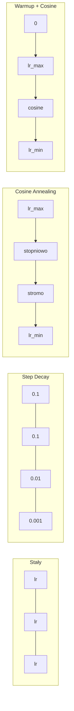
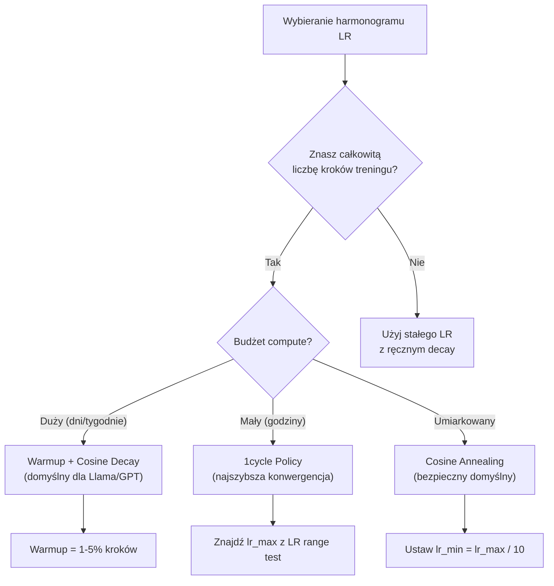
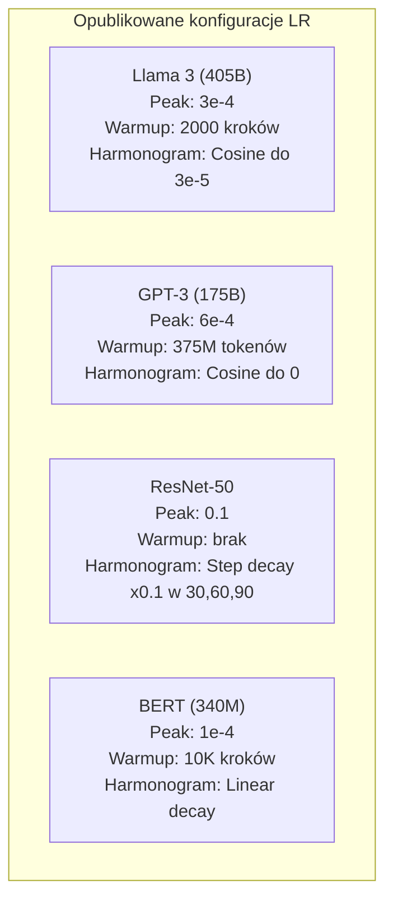

```markdown
# Harmonogramy learning rate i warmup

> Learning rate to najważniejszy hiperparametr. Nie architektura. Nie rozmiar zbioru danych. Nie funkcja aktywacji. Learning rate. Jeśli dostroisz tylko jedną rzecz, dostrój tę.

**Typ:** Build
**Języki:** Python
**Wymagania wstępne:** Lesson 03.06 (Optimizery), Lesson 03.08 (Inicjalizacja wag)
**Szacowany czas:** ~90 minut

## Cele uczenia się

- Zaimplementować od podstaw harmonogramy learning rate: stały, step decay, cosine annealing, warmup + cosine oraz 1cycle
- Zademonstrować trzy tryby awarii przy wyborze learning rate: dywergencję (zbyt wysoki), zastój (zbyt niski) oraz oscylację (brak decay)
- Wyjaśnić, dlaczego warmup jest niezbędny dla optimizerów opartych na Adam i jak stabilizuje wczesne treningi
- Porównać szybkość konwergencji wszystkich pięciu harmonogramów w ramach tego samego zadania i wybrać odpowiedni dla danego budżetu treningowego

## Problem

Ustaw learning rate na 0.1. Trening dywerguje -- loss skacze do nieskończoności w 3 krokach. Ustaw na 0.0001. Trening pełznie -- po 100 epokach model ledwo ruszył się od losowego. Ustaw na 0.01. Trening działa przez 50 epok, potem loss oscyluje wokół minimum, którego nigdy nie może osiągnąć, bo kroki są zbyt duże.

Optymalny learning rate nie jest stały. Zmienia się podczas treningu. Na początku chcesz dużych kroków, żeby szybko pokonać dystans. Pod koniec treningu chcesz mikroskopijnych kroków, żeby osiąść w ostrym minimum. Różnica między modelem o dokładności 90% a 95% często to tylko harmonogram.

Każdy poważny model opublikowany w ciągu ostatnich trzech lat używa harmonogramu learning rate. Llama 3 używała peak lr=3e-4 z 2000 krokami warmup i cosine decay do 3e-5. GPT-3 używał lr=6e-4 z warmup przez 375 milionów tokenów. To nie są arbitralne wybory. To wynik intensywnych przeszukiwań hiperparametrów, które kosztowały miliony dolarów.

Musisz rozumieć harmonogramy, bo wartości domyślne nie zadziałają dla twojego problemu. Kiedy fine-tunujesz wstępnie wytrenowany model, właściwy harmonogram jest inny niż przy treningu od zera. Kiedy zwiększasz batch size, okres warmup musi się zmienić. Kiedy trening pęka na kroku 10 000, musisz wiedzieć, czy to problem harmonogramu czy coś innego.

## Koncepcja

### Stały Learning Rate

Najprostsze podejście. Wybierz liczbę, używaj jej w każdym kroku.

```
lr(t) = lr_0
```

Rzadko optymalny. Jest albo zbyt wysoki na końcu treningu (oscylacja wokół minimum) albo zbyt niski na początku (zmarnowany compute na mikroskopijne kroki). Sprawdza się dla małych modeli i debugowania. Okropny wybór dla wszystkiego, co trwa dłużej niż godzinę.

### Step Decay

Stare podejście z ery ResNet. Zmniejsz learning rate o czynnik (zwykle 10x) w ustalonych epokach.

```
lr(t) = lr_0 * gamma^(floor(epoch / step_size))
```

Gdzie gamma = 0.1 i step_size = 30 oznacza: lr spada 10x co 30 epok. ResNet-50 tego używał -- lr=0.1, spadek 10x w epokach 30, 60 i 90.

Problem: optymalne punkty decay zależą od zbioru danych i architektury. Przejdź do innego problemu, i musisz ponownie dostrajać, kiedy zmniejszać. Przejścia są gwałtowne -- loss może skoczyć, gdy stopa nagle się zmieni.

### Cosine Annealing

Gładki decay od maksymalnego learning rate do minimum, podążając za krzywą cosinus:

```
lr(t) = lr_min + 0.5 * (lr_max - lr_min) * (1 + cos(pi * t / T))
```

Gdzie t to bieżący krok, a T to całkowita liczba kroków.

Przy t=0, wyraz cosinus wynosi 1, więc lr = lr_max. Przy t=T, wyraz cosinus wynosi -1, więc lr = lr_min. Decay jest łagodny na początku, przyspiesza w środku i znów staje się łagodny pod koniec.

To domyślne ustawienie dla większości nowoczesnych treningów. Brak hiperparametrów do dostrajania poza lr_max i lr_min. Kształt cosinusa odpowiada empirycznej obserwacji, że najwięcej nauki dzieje się w środku treningu -- chcesz rozsądnych rozmiarów kroków w tym krytycznym okresie.

### Warmup: Dlaczego zaczynasz od małego

Adam i inne adaptive optimizery utrzymują bieżące estymaty średniej i wariancji gradientu. W kroku 0 te estymaty są inicjalizowane na zero. Pierwsze kilka aktualizacji gradientu opiera się na śmieciowych statystykach. Jeśli twój learning rate jest duży w tym okresie, model wykonuje ogromne, źle nakierowane kroki.

Warmup to naprawia. Zacznij od mikroskopijnego learning rate (często lr_max / warmup_steps lub nawet zero) i liniowo zwiększaj do lr_max przez pierwsze N kroków. Kiedy osiągasz pełny learning rate, wiesz, że statystyki Adama się ustabilizowały.

```
lr(t) = lr_max * (t / warmup_steps)     dla t < warmup_steps
```

Typowy warmup: 1-5% całkowitej liczby kroków treningu. Llama 3 trenowała przez ~1.8 biliona tokenów i używała warmup przez 2000 kroków. GPT-3 używał warmup przez 375 milionów tokenów.

### Linear Warmup + Cosine Decay

Nowoczesny domyślny. Zwiększaj liniowo, potem decay z cosinusem:

```
if t < warmup_steps:
    lr(t) = lr_max * (t / warmup_steps)
else:
    progress = (t - warmup_steps) / (total_steps - warmup_steps)
    lr(t) = lr_min + 0.5 * (lr_max - lr_min) * (1 + cos(pi * progress))
```

To jest to, czego używają Llama, GPT, PaLM i większość nowoczesnych transformerów. Warmup zapobiega wczesnej niestabilności. Cosine decay osadza model w dobrym minimum.

### 1cycle Policy

Odkrycie Leslie'ego Smitha (2018): zwiększaj learning rate od niskiej wartości do wysokiej w pierwszej połowie treningu, potem zmniejszaj w drugiej połowie. Kontraintuicywne -- dlaczego zwiększać learning rate w połowie treningu?

Teoria: wysoki learning rate działa jako regularizacja przez dodawanie szumu do trajektorii optymalizacji. Model eksploruje większą część landscape'u loss w fazie zwiększania, znajdując lepsze baseny. Faza zmniejszania potem udoskonala w najlepszym znalezionym basenie.

```
Faza 1 (0 do T/2):    lr rośnie od lr_max/25 do lr_max
Faza 2 (T/2 do T):    lr maleje od lr_max do lr_max/10000
```

1cycle często trenuje szybciej niż cosine annealing dla ustalonego budżetu compute. Zależność: musisz znać całkowitą liczbę kroków z góry.

### Kształty harmonogramów



### Schemat decyzyjny



### Rzeczywiste liczby z opublikowanych modeli



## Zbuduj to

### Krok 1: Funkcje harmonogramu

Każda funkcja przyjmuje bieżący krok i zwraca learning rate dla tego kroku.

```python
import math


def constant_schedule(step, lr=0.01, **kwargs):
    return lr


def step_decay_schedule(step, lr=0.1, step_size=100, gamma=0.1, **kwargs):
    return lr * (gamma ** (step // step_size))


def cosine_schedule(step, lr=0.01, total_steps=1000, lr_min=1e-5, **kwargs):
    if step >= total_steps:
        return lr_min
    return lr_min + 0.5 * (lr - lr_min) * (1 + math.cos(math.pi * step / total_steps))


def warmup_cosine_schedule(step, lr=0.01, total_steps=1000, warmup_steps=100, lr_min=1e-5, **kwargs):
    if total_steps <= warmup_steps:
        return lr * (step / max(warmup_steps, 1))
    if step < warmup_steps:
        return lr * step / warmup_steps
    progress = (step - warmup_steps) / (total_steps - warmup_steps)
    return lr_min + 0.5 * (lr - lr_min) * (1 + math.cos(math.pi * progress))


def one_cycle_schedule(step, lr=0.01, total_steps=1000, **kwargs):
    mid = max(total_steps // 2, 1)
    if step < mid:
        return (lr / 25) + (lr - lr / 25) * step / mid
    else:
        progress = (step - mid) / max(total_steps - mid, 1)
        return lr * (1 - progress) + (lr / 10000) * progress
```

### Krok 2: Wizualizuj wszystkie harmonogramy

Wydrukuj wykres tekstowy pokazujący, jak każdy harmonogram ewoluuje podczas treningu.

```python
def visualize_schedule(name, schedule_fn, total_steps=500, **kwargs):
    steps = list(range(0, total_steps, total_steps // 20))
    if total_steps - 1 not in steps:
        steps.append(total_steps - 1)

    lrs = [schedule_fn(s, total_steps=total_steps, **kwargs) for s in steps]
    max_lr = max(lrs) if max(lrs) > 0 else 1.0

    print(f"\n{name}:")
    for s, lr_val in zip(steps, lrs):
        bar_len = int(lr_val / max_lr * 40)
        bar = "#" * bar_len
        print(f"  Step {s:4d}: lr={lr_val:.6f} {bar}")
```

### Krok 3: Sieć treningowa

Prosta dwuwarstwowa sieć na zbiorze danych circle, taka sama jak w poprzednich lekcjach, ale teraz zmieniamy harmonogram.

```python
import random


def sigmoid(x):
    x = max(-500, min(500, x))
    return 1.0 / (1.0 + math.exp(-x))


def relu(x):
    return max(0.0, x)


def relu_deriv(x):
    return 1.0 if x > 0 else 0.0


def make_circle_data(n=200, seed=42):
    random.seed(seed)
    data = []
    for _ in range(n):
        x = random.uniform(-2, 2)
        y = random.uniform(-2, 2)
        label = 1.0 if x * x + y * y < 1.5 else 0.0
        data.append(([x, y], label))
    return data


def train_with_schedule(schedule_fn, schedule_name, data, epochs=300, base_lr=0.05, **kwargs):
    random.seed(0)
    hidden_size = 8
    total_steps = epochs * len(data)

    std = math.sqrt(2.0 / 2)
    w1 = [[random.gauss(0, std) for _ in range(2)] for _ in range(hidden_size)]
    b1 = [0.0] * hidden_size
    w2 = [random.gauss(0, std) for _ in range(hidden_size)]
    b2 = 0.0

    step = 0
    epoch_losses = []

    for epoch in range(epochs):
        total_loss = 0
        correct = 0

        for x, target in data:
            lr = schedule_fn(step, lr=base_lr, total_steps=total_steps, **kwargs)

            z1 = []
            h = []
            for i in range(hidden_size):
                z = w1[i][0] * x[0] + w1[i][1] * x[1] + b1[i]
                z1.append(z)
                h.append(relu(z))

            z2 = sum(w2[i] * h[i] for i in range(hidden_size)) + b2
            out = sigmoid(z2)

            error = out - target
            d_out = error * out * (1 - out)

            for i in range(hidden_size):
                d_h = d_out * w2[i] * relu_deriv(z1[i])
                w2[i] -= lr * d_out * h[i]
                for j in range(2):
                    w1[i][j] -= lr * d_h * x[j]
                b1[i] -= lr * d_h
            b2 -= lr * d_out

            total_loss += (out - target) ** 2
            if (out >= 0.5) == (target >= 0.5):
                correct += 1
            step += 1

        avg_loss = total_loss / len(data)
        accuracy = correct / len(data) * 100
        epoch_losses.append(avg_loss)

    return epoch_losses
```

### Krok 4: Porównaj wszystkie harmonogramy

Trenuj tę samą sieć z każdym harmonogramem i porównaj finalny loss oraz zachowanie konwergencji.

```python
def compare_schedules(data):
    configs = [
        ("Stały", constant_schedule, {}),
        ("Step Decay", step_decay_schedule, {"step_size": 15000, "gamma": 0.1}),
        ("Cosine", cosine_schedule, {"lr_min": 1e-5}),
        ("Warmup+Cosine", warmup_cosine_schedule, {"warmup_steps": 3000, "lr_min": 1e-5}),
        ("1cycle", one_cycle_schedule, {}),
    ]

    print(f"\n{'Harmonogram':<20} {'Start Loss':>12} {'Mid Loss':>12} {'End Loss':>12} {'Best Loss':>12}")
    print("-" * 70)

    for name, schedule_fn, extra_kwargs in configs:
        losses = train_with_schedule(schedule_fn, name, data, epochs=300, base_lr=0.05, **extra_kwargs)
        mid_idx = len(losses) // 2
        best = min(losses)
        print(f"{name:<20} {losses[0]:>12.6f} {losses[mid_idx]:>12.6f} {losses[-1]:>12.6f} {best:>12.6f}")
```

### Krok 5: LR za wysoki vs za niski

Zademonstrować trzy tryby awarii: za wysoki (dywergencja), za niski (pełzanie) i w sam raz.

```python
def lr_sensitivity(data):
    learning_rates = [1.0, 0.1, 0.01, 0.001, 0.0001]

    print("\nWrażliwość LR (stały harmonogram, 100 epok):")
    print(f"  {'LR':>10} {'Start Loss':>12} {'End Loss':>12} {'Status':>15}")
    print("  " + "-" * 52)

    for lr in learning_rates:
        losses = train_with_schedule(constant_schedule, f"lr={lr}", data, epochs=100, base_lr=lr)
        start = losses[0]
        end = losses[-1]

        if end > start or math.isnan(end) or end > 1.0:
            status = "DYWERGOWAŁ"
        elif end > start * 0.9:
            status = "SŁABO SIĘ UCZYŁ"
        elif end < 0.15:
            status = "ZKONWERGOWAŁ"
        else:
            status = "UCZY SIĘ"

        end_str = f"{end:.6f}" if not math.isnan(end) else "NaN"
        print(f"  {lr:>10.4f} {start:>12.6f} {end_str:>12} {status:>15}")
```

## Użyj tego

PyTorch dostarcza schedulery w `torch.optim.lr_scheduler`:

```python
import torch
import torch.optim as optim
from torch.optim.lr_scheduler import CosineAnnealingLR, OneCycleLR, StepLR

model = nn.Sequential(nn.Linear(10, 64), nn.ReLU(), nn.Linear(64, 1))
optimizer = optim.Adam(model.parameters(), lr=3e-4)

scheduler = CosineAnnealingLR(optimizer, T_max=1000, eta_min=1e-5)

for step in range(1000):
    loss = train_step(model, optimizer)
    scheduler.step()
```

Dla warmup + cosine użyj lambda schedulera lub `get_cosine_schedule_with_warmup` z HuggingFace:

```python
from transformers import get_cosine_schedule_with_warmup

scheduler = get_cosine_schedule_with_warmup(
    optimizer,
    num_warmup_steps=2000,
    num_training_steps=100000,
)
```

Funkcja HuggingFace to jest to, czego używa większość skryptów fine-tuning Llama i GPT. W razie wątpliwości użyj warmup + cosine z warmup = 3-5% całkowitej liczby kroków. Działa prawie zawsze.

## Dostarcz to

Ta lekcja tworzy:

- `outputs/prompt-lr-schedule-advisor.md` -- prompt, który rekomenduje właściwy harmonogram learning rate i hiperparametry dla twojej konfiguracji treningowej

## Ćwiczenia

1. Zaimplementuj exponential decay: lr(t) = lr_0 * gamma^t gdzie gamma = 0.999. Porównaj z cosine annealing na zbiorze danych circle.

2. Zaimplementuj learning rate range test (Leslie Smith): trenuj przez kilkaset kroków, eksponencjalnie zwiększając LR od 1e-7 do 1. Wykreśl loss vs LR. Optymalny max LR to tuż przed tym, **gdy** loss zaczyna rosnąć.

3. Trenuj z warmup + cosine, ale zmień długość warmup: 0%, 1%, 5%, 10%, 20% całkowitej liczby kroków. Znajdź optymalny punkt, gdzie trening jest najbardziej stabilny.

4. Zaimplementuj cosine annealing z warm restarts (SGDR): resetuj learning rate do lr_max co T kroków i ponownie stosuj decay. Porównaj ze standardowym cosine na dłuższym treningu.

5. Zbuduj "chirurga harmonogramu", który monitoruje training loss i automatycznie przełącza z warmup na cosine, gdy loss się ustabilizuje, oraz zmniejsza lr, jeśli loss plateau trwa zbyt długo.

## Kluczowe terminy

| Termin | Co ludzie mówią | Co to faktycznie oznacza |
|------|----------------|----------------------|
| Learning rate | "Jak szybko model się uczy" | Skalar, który mnoży gradient, co określa rozmiar aktualizacji parametrów |
| Harmonogram | "Zmień LR w czasie" | Funkcja, która odwzorowuje krok treningu na learning rate, zaprojektowana, żeby optymalizować konwergencję |
| Warmup | "Zacznij od małego LR" | Liniowe zwiększanie LR od bliskiego zera do docelowej wartości przez pierwsze N kroków, żeby ustabilizować statystyki optimizera |
| Cosine annealing | "Gładki LR decay" | Zmniejszanie LR zgodnie z krzywą cosinus od lr_max do lr_min podczas treningu |
| Step decay | "Zmniejsz LR w kamieniach milowych" | Mnożenie LR przez czynnik (zwykle 0.1) w ustalonych interwałach epok |
| 1cycle policy | "W górę potem w dół" | Metoda Leslie'ego Smitha: zwiększanie LR potem zmniejszanie w jednym cyklu dla szybszej konwergencji |
| LR range test | "Znajdź najlepszy learning rate" | Krótki trening z rosnącym LR, żeby znaleźć wartość, przy której loss zaczyna dywergować |
| Cosine with warm restarts | "Resetuj i powtarzaj" | Okresowe resetowanie LR do lr_max i ponowne stosowanie decay (SGDR) |
| Eta min | "Podłoga dla LR" | Minimalny learning rate, do którego harmonogram decyduje |
| Peak learning rate | "Maksymalny LR" | Najwyższy LR osiągnięty podczas treningu, typowo po warmup |

## Dalsza lektura

- Loshchilov & Hutter, "SGDR: Stochastic Gradient Descent with Warm Restarts" (2017) -- wprowadzenie cosine annealing i warm restarts
- Smith, "Super-Convergence: Very Fast Training of Neural Networks Using Large Learning Rates" (2018) -- artykuł o 1cycle policy
- Touvron et al., "Llama 2: Open Foundation and Fine-Tuned Chat Models" (2023) -- dokumentuje harmonogram warmup + cosine używany na skalę
- Goyal et al., "Accurate, Large Minibatch SGD: Training ImageNet in 1 Hour" (2017) -- reguła liniowego skalowania i warmup dla treningu z dużymi batchami
```