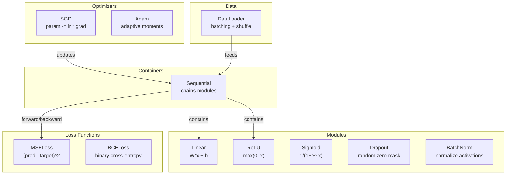
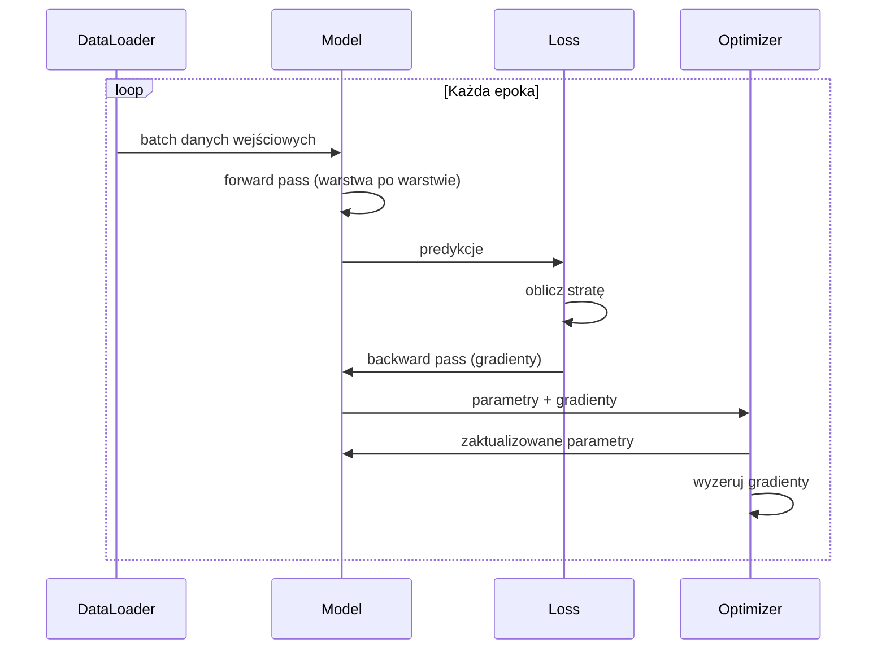
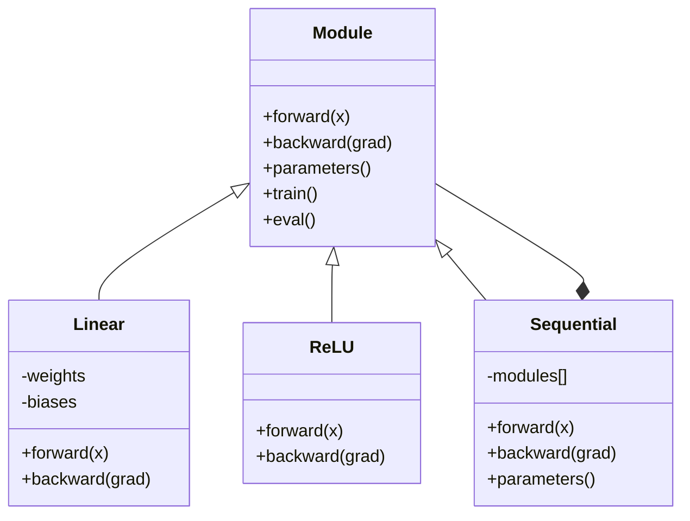

# Zbuduj własny mini-framework

> Zbudowałeś neurony, warstwy, sieci, backprop, aktywacje, funkcje straty, optymalizatory, regularyzację, inicjalizację i harmonogramy LR. Wszystko jako oddzielne kawałki. Teraz połącz je razem w framework. Nie PyTorch. Nie TensorFlow. Twój.

**Typ:** Budowanie
**Języki:** Python
**Wymagania wstępne:** Wszystkie z Fazy 03 (Lekcje 01-09)
**Czas:** ~120 minut

## Cele uczenia się

- Zbuduj kompletny framework deep learning (~500 linii) z Module, Linear, ReLU, Sigmoid, Dropout, BatchNorm, Sequential, funkcjami straty, optymalizatorami i DataLoader
- Wyjaśnij abstrakcję Module (forward, backward, parameters) i dlaczego przełączanie trybu train/eval jest konieczne
- Połącz wszystkie komponenty w działającą pętlę trenowania, która trenuje sieć 4-warstwową na klasyfikacji okręgów
- Zmapuj każdy komponent twojego frameworka na jego odpowiednik w PyTorch (nn.Module, nn.Sequential, optim.Adam, DataLoader)

## Problem

Masz dziesięć lekcji z elementami budulcowymi porozrzucanymi w oddzielnych plikach. Klasa `Value` tutaj, pętla trenowania tam, inicjalizacja wag w innym pliku, harmonogramy learning rate w jeszcze innym. Aby wytrenować sieć, kopiujesz i wklejasz z pięciu różnych lekcji i łączysz je ręcznie.

To jest właśnie to, co rozwiązują frameworki. PyTorch daje ci `nn.Module`, `nn.Sequential`, `optim.Adam`, `DataLoader` i wzorzec pętli trenowania, który je łączy. TensorFlow daje ci `keras.Layer`, `keras.Sequential`, `keras.optimizers.Adam`. To nie jest magia. To są wzorce organizacyjne, które umożliwiają definiowanie, trenowanie i ewaluację sieci bez wymyślania całej hydrauliki od nowa za każdym razem.

Zbudujesz to samo w ~500 liniach Pythona. Bez numpy. Bez zewnętrznych zależności. Framework, który może zdefiniować dowolną sieć feedforward, trenować ją z SGD lub Adam, tworzyć batche danych, stosować dropout i batch normalization, używać dowolnej aktywacji i planować learning rate.

Gdy skończysz, będziesz dokładnie rozumieć, co się dzieje, gdy piszesz `model = nn.Sequential(...)` w PyTorch. Zrozumiesz, dlaczego istnieją `model.train()` i `model.eval()`. Zrozumiesz, dlaczego `optimizer.zero_grad()` jest osobnym wywołaniem. Zrozumiesz to wszystko, bo zbudowałeś to wszystko.

## Koncepcja

### Abstrakcja Module

Każda warstwa w PyTorch dziedziczy z `nn.Module`. Module ma trzy odpowiedzialności:

1. **forward()** -- oblicza wynik dla danych wejściowych
2. **parameters()** -- zwraca wszystkie trenowalne wagi
3. **backward()** -- oblicza gradienty (w PyTorch obsługuje to autograd, u nas jawnie)

Warstwa Linear jest Module. Aktywacja ReLU jest Module. Warstwa dropout jest Module. Warstwa batch normalization jest Module. Wszystkie mają ten sam interfejs.

### Kontener Sequential

`nn.Sequential` łączy moduły w łańcuch. Forward pass: przepuść dane przez Module 1, potem Module 2, potem Module 3. Backward pass: odwróć łańcuch. Sam kontener jest Module -- ma forward(), parameters() i backward(). To jest wzorzec kompozytowy: sekwencja Modułów jest sama w sobie Module.

### Tryb trenowania vs tryb ewaluacji

Dropout losowo zeruje neurony podczas trenowania, ale przepuszcza wszystko podczas ewaluacji. Batch normalization używa statystyk z batcha podczas trenowania, ale średnich ruchomych podczas ewaluacji. Metody `train()` i `eval()` przełączają to zachowanie. Każdy Module ma flagę `training`.

### Optimizer

Optimizer aktualizuje parametry używając ich gradientów. SGD: `param -= lr * grad`. Adam: utrzymuje momentum i oszacowania wariancji, potem aktualizuje. Optimizer nie wie nic o architekturze sieci -- widzi tylko płaską listę parametrów i ich gradientów.

### DataLoader

Tworzenie batchy ma znaczenie z dwóch powodów. Po pierwsze, nie możesz zmieścić całego zbioru danych w pamięci dla dużych problemów. Po drugie, mini-batch gradient descent dostarcza szumu, który pomaga uciec z lokalnych minimów. DataLoader dzieli dane na batche i opcjonalnie shuffleuje między epokami.

### Architektura frameworka



### Pętla trenowania



### Hierarchia Module



## Zbuduj to

### Krok 1: Bazowa klasa Module

Abstrakcyjny interfejs, który implementuje każda warstwa.

```python
class Module:
    def __init__(self):
        self.training = True

    def forward(self, x):
        raise NotImplementedError

    def backward(self, grad):
        raise NotImplementedError

    def parameters(self):
        return []

    def train(self):
        self.training = True

    def eval(self):
        self.training = False
```

### Krok 2: Warstwa Linear

Fundamentalny element budulcowy. Przechowuje wagi i biasy, oblicza Wx + b forward i gradienty wag/wejścia backward.

```python
import math
import random


class Linear(Module):
    def __init__(self, fan_in, fan_out):
        super().__init__()
        std = math.sqrt(2.0 / fan_in)
        self.weights = [[random.gauss(0, std) for _ in range(fan_in)] for _ in range(fan_out)]
        self.biases = [0.0] * fan_out
        self.weight_grads = [[0.0] * fan_in for _ in range(fan_out)]
        self.bias_grads = [0.0] * fan_out
        self.fan_in = fan_in
        self.fan_out = fan_out
        self.input = None

    def forward(self, x):
        self.input = x
        output = []
        for i in range(self.fan_out):
            val = self.biases[i]
            for j in range(self.fan_in):
                val += self.weights[i][j] * x[j]
            output.append(val)
        return output

    def backward(self, grad):
        input_grad = [0.0] * self.fan_in
        for i in range(self.fan_out):
            self.bias_grads[i] += grad[i]
            for j in range(self.fan_in):
                self.weight_grads[i][j] += grad[i] * self.input[j]
                input_grad[j] += grad[i] * self.weights[i][j]
        return input_grad

    def parameters(self):
        params = []
        for i in range(self.fan_out):
            for j in range(self.fan_in):
                params.append((self.weights, i, j, self.weight_grads))
            params.append((self.biases, i, None, self.bias_grads))
        return params
```

### Krok 3: Moduły aktywacji

ReLU, Sigmoid i Tanh jako Moduły. Każdy cacheuje to, co potrzebuje do backward pass.

```python
class ReLU(Module):
    def __init__(self):
        super().__init__()
        self.mask = None

    def forward(self, x):
        self.mask = [1.0 if v > 0 else 0.0 for v in x]
        return [max(0.0, v) for v in x]

    def backward(self, grad):
        return [g * m for g, m in zip(grad, self.mask)]


class Sigmoid(Module):
    def __init__(self):
        super().__init__()
        self.output = None

    def forward(self, x):
        self.output = []
        for v in x:
            v = max(-500, min(500, v))
            self.output.append(1.0 / (1.0 + math.exp(-v)))
        return self.output

    def backward(self, grad):
        return [g * o * (1 - o) for g, o in zip(grad, self.output)]


class Tanh(Module):
    def __init__(self):
        super().__init__()
        self.output = None

    def forward(self, x):
        self.output = [math.tanh(v) for v in x]
        return self.output

    def backward(self, grad):
        return [g * (1 - o * o) for g, o in zip(grad, self.output)]
```

### Krok 4: Moduł Dropout

Losowo zeruje elementy podczas trenowania. Skaluje pozostałe elementy przez 1/(1-p), więc oczekiwane wartości pozostają takie same. Nic nie robi podczas eval.

```python
class Dropout(Module):
    def __init__(self, p=0.5):
        super().__init__()
        self.p = p
        self.mask = None

    def forward(self, x):
        if not self.training:
            return x
        self.mask = [0.0 if random.random() < self.p else 1.0 / (1 - self.p) for _ in x]
        return [v * m for v, m in zip(x, self.mask)]

    def backward(self, grad):
        if self.mask is None:
            return grad
        return [g * m for g, m in zip(grad, self.mask)]
```

### Krok 5: Moduł BatchNorm

Normalizuje aktywacje do średniej zero i wariancji jednostkowej na cechę wzdłuż batcha. Utrzymuje średnie ruchome dla trybu eval.

```python
class BatchNorm(Module):
    def __init__(self, size, momentum=0.1, eps=1e-5):
        super().__init__()
        self.size = size
        self.gamma = [1.0] * size
        self.beta = [0.0] * size
        self.gamma_grads = [0.0] * size
        self.beta_grads = [0.0] * size
        self.running_mean = [0.0] * size
        self.running_var = [1.0] * size
        self.momentum = momentum
        self.eps = eps
        self.x_norm = None
        self.std_inv = None
        self.batch_input = None

    def forward_batch(self, batch):
        batch_size = len(batch)
        output_batch = []

        if self.training:
            mean = [0.0] * self.size
            for sample in batch:
                for j in range(self.size):
                    mean[j] += sample[j]
            mean = [m / batch_size for m in mean]

            var = [0.0] * self.size
            for sample in batch:
                for j in range(self.size):
                    var[j] += (sample[j] - mean[j]) ** 2
            var = [v / batch_size for v in var]

            self.std_inv = [1.0 / math.sqrt(v + self.eps) for v in var]

            self.x_norm = []
            self.batch_input = batch
            for sample in batch:
                normed = [(sample[j] - mean[j]) * self.std_inv[j] for j in range(self.size)]
                self.x_norm.append(normed)
                output = [self.gamma[j] * normed[j] + self.beta[j] for j in range(self.size)]
                output_batch.append(output)

            for j in range(self.size):
                self.running_mean[j] = (1 - self.momentum) * self.running_mean[j] + self.momentum * mean[j]
                self.running_var[j] = (1 - self.momentum) * self.running_var[j] + self.momentum * var[j]
        else:
            std_inv = [1.0 / math.sqrt(v + self.eps) for v in self.running_var]
            for sample in batch:
                normed = [(sample[j] - self.running_mean[j]) * std_inv[j] for j in range(self.size)]
                output = [self.gamma[j] * normed[j] + self.beta[j] for j in range(self.size)]
                output_batch.append(output)

        return output_batch

    def forward(self, x):
        result = self.forward_batch([x])
        return result[0]

    def backward(self, grad):
        if self.x_norm is None:
            return grad
        for j in range(self.size):
            self.gamma_grads[j] += self.x_norm[0][j] * grad[j]
            self.beta_grads[j] += grad[j]
        return [grad[j] * self.gamma[j] * self.std_inv[j] for j in range(self.size)]

    def parameters(self):
        params = []
        for j in range(self.size):
            params.append((self.gamma, j, None, self.gamma_grads))
            params.append((self.beta, j, None, self.beta_grads))
        return params
```

### Krok 6: Kontener Sequential

Łączy moduły w łańcuch. Forward idzie lewa-do-prawa, backward idzie prawa-do-lewa.

```python
class Sequential(Module):
    def __init__(self, *modules):
        super().__init__()
        self.modules = list(modules)

    def forward(self, x):
        for module in self.modules:
            x = module.forward(x)
        return x

    def backward(self, grad):
        for module in reversed(self.modules):
            grad = module.backward(grad)
        return grad

    def parameters(self):
        params = []
        for module in self.modules:
            params.extend(module.parameters())
        return params

    def train(self):
        self.training = True
        for module in self.modules:
            module.train()

    def eval(self):
        self.training = False
        for module in self.modules:
            module.eval()
```

### Krok 7: Funkcje straty

MSE i Binary Cross-Entropy. Każda zwraca wartość straty i udostępnia backward(), który zwraca gradient.

```python
class MSELoss:
    def __call__(self, predicted, target):
        self.predicted = predicted
        self.target = target
        n = len(predicted)
        self.loss = sum((p - t) ** 2 for p, t in zip(predicted, target)) / n
        return self.loss

    def backward(self):
        n = len(self.predicted)
        return [2 * (p - t) / n for p, t in zip(self.predicted, self.target)]


class BCELoss:
    def __call__(self, predicted, target):
        self.predicted = predicted
        self.target = target
        eps = 1e-7
        n = len(predicted)
        self.loss = 0
        for p, t in zip(predicted, target):
            p = max(eps, min(1 - eps, p))
            self.loss += -(t * math.log(p) + (1 - t) * math.log(1 - p))
        self.loss /= n
        return self.loss

    def backward(self):
        eps = 1e-7
        n = len(self.predicted)
        grads = []
        for p, t in zip(self.predicted, self.target):
            p = max(eps, min(1 - eps, p))
            grads.append((-t / p + (1 - t) / (1 - p)) / n)
        return grads
```

### Krok 8: Optymalizatory SGD i Adam

Oba przyjmują listę parametrów i aktualizują wagi używając gradientów.

```python
class SGD:
    def __init__(self, parameters, lr=0.01):
        self.params = parameters
        self.lr = lr

    def step(self):
        for container, i, j, grad_container in self.params:
            if j is not None:
                container[i][j] -= self.lr * grad_container[i][j]
            else:
                container[i] -= self.lr * grad_container[i]

    def zero_grad(self):
        for container, i, j, grad_container in self.params:
            if j is not None:
                grad_container[i][j] = 0.0
            else:
                grad_container[i] = 0.0


class Adam:
    def __init__(self, parameters, lr=0.001, beta1=0.9, beta2=0.999, eps=1e-8):
        self.params = parameters
        self.lr = lr
        self.beta1 = beta1
        self.beta2 = beta2
        self.eps = eps
        self.t = 0
        self.m = [0.0] * len(parameters)
        self.v = [0.0] * len(parameters)

    def step(self):
        self.t += 1
        for idx, (container, i, j, grad_container) in enumerate(self.params):
            if j is not None:
                g = grad_container[i][j]
            else:
                g = grad_container[i]

            self.m[idx] = self.beta1 * self.m[idx] + (1 - self.beta1) * g
            self.v[idx] = self.beta2 * self.v[idx] + (1 - self.beta2) * g * g

            m_hat = self.m[idx] / (1 - self.beta1 ** self.t)
            v_hat = self.v[idx] / (1 - self.beta2 ** self.t)

            update = self.lr * m_hat / (math.sqrt(v_hat) + self.eps)

            if j is not None:
                container[i][j] -= update
            else:
                container[i] -= update

    def zero_grad(self):
        for container, i, j, grad_container in self.params:
            if j is not None:
                grad_container[i][j] = 0.0
            else:
                grad_container[i] = 0.0
```

### Krok 9: DataLoader

Dzieli dane na batche, opcjonalnie shuffleuje każdą epokę.

```python
class DataLoader:
    def __init__(self, data, batch_size=32, shuffle=True):
        self.data = data
        self.batch_size = batch_size
        self.shuffle = shuffle

    def __iter__(self):
        indices = list(range(len(self.data)))
        if self.shuffle:
            random.shuffle(indices)
        for start in range(0, len(indices), self.batch_size):
            batch_indices = indices[start:start + self.batch_size]
            batch = [self.data[i] for i in batch_indices]
            inputs = [item[0] for item in batch]
            targets = [item[1] for item in batch]
            yield inputs, targets

    def __len__(self):
        return (len(self.data) + self.batch_size - 1) // self.batch_size
```

### Krok 10: Trenuj sieć 4-warstwową na klasyfikacji okręgów

Połącz wszystko do kupy. Zdefiniuj model, wybierz funkcję straty, wybierz optimizer, uruchom pętlę trenowania.

```python
def make_circle_data(n=500, seed=42):
    random.seed(seed)
    data = []
    for _ in range(n):
        x = random.uniform(-2, 2)
        y = random.uniform(-2, 2)
        label = 1.0 if x * x + y * y < 1.5 else 0.0
        data.append(([x, y], [label]))
    return data


def train():
    random.seed(42)

    model = Sequential(
        Linear(2, 16),
        ReLU(),
        Linear(16, 16),
        ReLU(),
        Linear(16, 8),
        ReLU(),
        Linear(8, 1),
        Sigmoid(),
    )

    criterion = BCELoss()
    optimizer = Adam(model.parameters(), lr=0.01)

    data = make_circle_data(500)
    split = int(len(data) * 0.8)
    train_data = data[:split]
    test_data = data[split:]

    loader = DataLoader(train_data, batch_size=16, shuffle=True)

    model.train()

    for epoch in range(100):
        total_loss = 0
        total_correct = 0
        total_samples = 0

        for batch_inputs, batch_targets in loader:
            batch_loss = 0
            for x, t in zip(batch_inputs, batch_targets):
                pred = model.forward(x)
                loss = criterion(pred, t)
                batch_loss += loss

                optimizer.zero_grad()
                grad = criterion.backward()
                model.backward(grad)
                optimizer.step()

                predicted_class = 1.0 if pred[0] >= 0.5 else 0.0
                if predicted_class == t[0]:
                    total_correct += 1
                total_samples += 1

            total_loss += batch_loss

        avg_loss = total_loss / total_samples
        accuracy = total_correct / total_samples * 100

        if epoch % 10 == 0 or epoch == 99:
            print(f"Epoch {epoch:3d} | Loss: {avg_loss:.6f} | Train Accuracy: {accuracy:.1f}%")

    model.eval()
    correct = 0
    for x, t in test_data:
        pred = model.forward(x)
        predicted_class = 1.0 if pred[0] >= 0.5 else 0.0
        if predicted_class == t[0]:
            correct += 1
    test_accuracy = correct / len(test_data) * 100
    print(f"\nTest Accuracy: {test_accuracy:.1f}% ({correct}/{len(test_data)})")

    return model, test_accuracy
```

## Użyj tego

Oto odpowiednik w PyTorch tego, co właśnie zbudowałeś:

```python
import torch
import torch.nn as nn
from torch.utils.data import DataLoader, TensorDataset

model = nn.Sequential(
    nn.Linear(2, 16),
    nn.ReLU(),
    nn.Linear(16, 16),
    nn.ReLU(),
    nn.Linear(16, 8),
    nn.ReLU(),
    nn.Linear(8, 1),
    nn.Sigmoid(),
)

criterion = nn.BCELoss()
optimizer = torch.optim.Adam(model.parameters(), lr=0.01)

for epoch in range(100):
    model.train()
    for inputs, targets in dataloader:
        optimizer.zero_grad()
        predictions = model(inputs)
        loss = criterion(predictions, targets)
        loss.backward()
        optimizer.step()

    model.eval()
    with torch.no_grad():
        test_predictions = model(test_inputs)
```

Struktura jest identyczna. `Sequential`, `Linear`, `ReLU`, `Sigmoid`, `BCELoss`, `Adam`, `zero_grad`, `backward`, `step`, `train`, `eval`. Każda koncepcja mapuje jeden-do-jednego. Różnica polega na tym, że PyTorch obsługuje autograd automatycznie (nie trzeba implementować backward() w każdym module), działa na GPU i był optymalizowany przez lata. Ale kości są takie same.

Teraz, gdy widzisz kod PyTorch, dokładnie wiesz, co się dzieje w każdej linii. To zrozumienie jest całym punktem.

## Wyślij to

Ta lekcja tworzy:
- `outputs/prompt-framework-architect.md` -- prompt do projektowania architektur sieci neuronowych używając abstrakcji frameworka

## Ćwiczenia

1. Dodaj klasę `SoftmaxCrossEntropyLoss` do wieloklasowej klasyfikacji. Softmaxuj predykcje, oblicz cross-entropy loss i obsłuż połączony backward pass. Przetestuj to na zbiorze danych spirali 3-klasowej.

2. Zaimplementuj scheduling learning rate w optimizerze: dodaj metodę `set_lr()` i podłącz cosine schedule z Lekcji 09. Trenuj klasyfikator okręgów z warmup + cosine i porównaj ze stałym LR.

3. Dodaj metodę `save()` i `load()` do Sequential, która serializuje wszystkie wagi do pliku JSON i ładuje je z powrotem. Zweryfikuj, że załadowany model produkuje te same predykcje co oryginalny.

4. Zaimplementuj weight decay (regularyzacja L2) w optimizerze Adam. Dodaj parametr `weight_decay`, który zmniejsza wagi ku zero przy każdym kroku. Porównaj trenowanie z decay=0 vs decay=0.01.

5. Zastąp pętlę trenowania per-sample właściwą akumulacją gradientów mini-batch: akumuluj gradienty przez wszystkie próbki w batchu, potem podziel przez rozmiar batcha i wykonaj jeden krok optimizera. Zmierz, czy to zmienia szybkość konwergencji.

## Kluczowe terminy

| Termin | Co ludzie mówią | Co to tak naprawdę oznacza |
|------|----------------|----------------------|
| Module | "Warstwa" | Bazowa abstrakcja we frameworku -- cokolwiek z forward(), backward() i parameters() |
| Sequential | "Ułóż warstwy w kolejności" | Kontener, który łączy moduły, stosując je w sekwencji dla forward i odwrotnie dla backward |
| Forward pass | "Uruchom sieć" | Obliczanie wyniku przez przepuszczenie danych wejściowych przez każdy moduł po kolei |
| Backward pass | "Oblicz gradienty" | Propagowanie gradientu straty przez każdy moduł w odwrotnej kolejności, aby obliczyć gradienty parametrów |
| Parameters | "Trenowalne wagi" | Wszystkie wartości w sieci, które optimizer może aktualizować -- wagi i biasy |
| Optimizer | "To co aktualizuje wagi" | Algorytm, który używa gradientów do aktualizacji parametrów, implementujący SGD, Adam lub inne reguły |
| DataLoader | "To co karmi dane" | Iterator, który dzieli zbiór danych na batche, opcjonalnie shuffleując między epokami |
| Tryb trenowania | "model.train()" | Flaga, która włącza stochastyczne zachowanie jak dropout i batch normalization ze statystykami z batcha |
| Tryb ewaluacji | "model.eval()" | Flaga, która wyłącza dropout i używa średnich ruchomych dla batch normalization |
| Zero grad | "Wyczyść gradienty" | Zerowanie wszystkich gradientów parametrów przed obliczeniem gradientów następnego batcha |

## Dalsza lektura

- Paszke et al., "PyTorch: An Imperative Style, High-Performance Deep Learning Library" (2019) -- artykuł opisujący decyzje projektowe PyTorch
- Chollet, "Deep Learning with Python, Second Edition" (2021) -- Rozdział 3 obejmuje wewnętrzne działanie Keras z tą samą abstrakcją module/layer
- Johnson, "Tiny-DNN" (https://github.com/tiny-dnn/tiny-dnn) -- header-only C++ deep learning framework do zrozumienia wnętrza frameworków