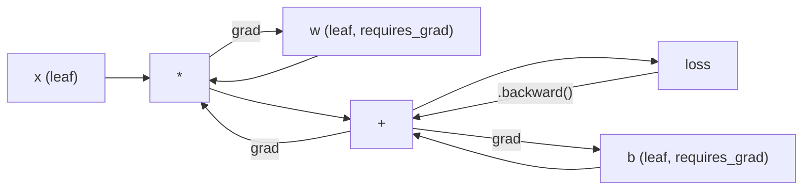
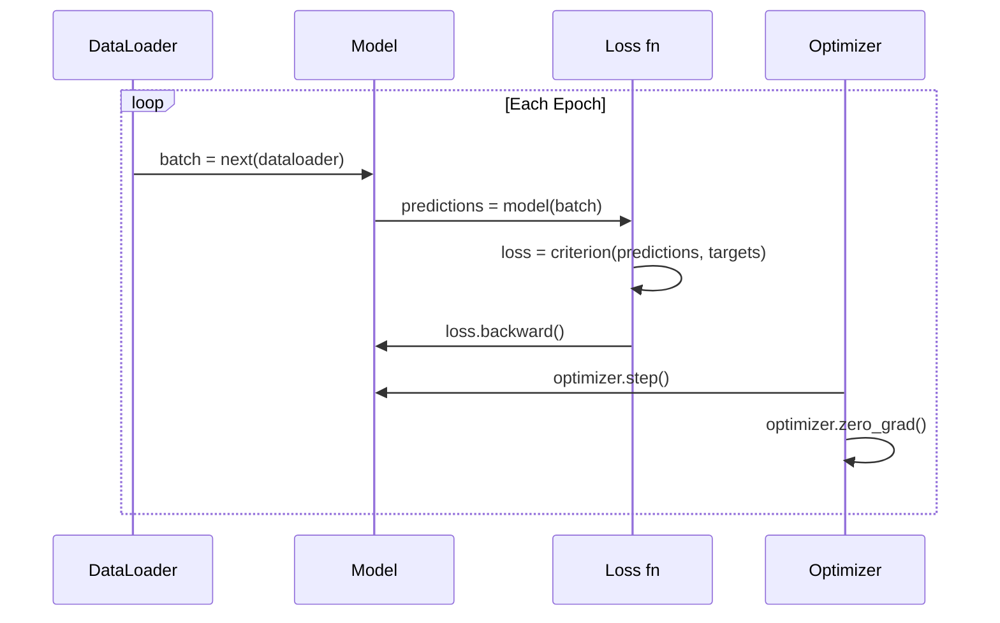

# Wprowadzenie do PyTorch

> Zbudowałeś silnik z tłoków i wałów korbowych. Teraz naucz się tego, którego wszyscy faktycznie używają.

**Type:** Build
**Languages:** Python
**Prerequisites:** Lesson 03.10 (Build Your Own Mini Framework)
**Time:** ~75 minutes

## Cele uczenia się

- Budowanie i trenowanie sieci neuronowych przy użyciu nn.Module, nn.Sequential i autograd w PyTorch
- Używanie tensorów PyTorch, akceleracji GPU i standardowej pętli treningowej (zero_grad, forward, loss, backward, step)
- Konwersja komponentów twojego mini frameworka od zera na ich odpowiedniki w PyTorch
- Profilowanie i porównywanie szybkości treningu między twoim czystym Pythonowym mini frameworkem a PyTorch przy tym samym zadaniu

## Problem

Masz działający mini framework. Warstwy liniowe, ReLU, dropout, batch norm, Adam, DataLoader, pętla treningowa. Trenuje 4-warstwową sieć na problemie klasyfikacji kół w czystym Pythonie.

Jest też 500x wolniejszy niż PyTorch przy tym samym problemie.

Twój mini framework przetwarza jedną próbkę na raz za pomocą zagnieżdżonych pętli Python. PyTorch wysyła te same operacje do zoptymalizowanych kerneli C++/CUDA, które działają na GPU. Na pojedynczym NVIDIA A100, PyTorch trenuje ResNet-50 (25.6M parametrów) na ImageNet (1.28M obrazów) w około 6 godzin. Twój framework potrzebowałby około 3,000 godzin na to samo zadanie -- i to gdyby nie zabrakło mu pamięci pierwszy.

Szybkość to nie jedyna luka. Twój framework nie ma wsparcia GPU. Brak automatycznego różnicowania -- pisałeś backward() ręcznie dla każdego modułu. Brak serializacji. Brak rozproszonego treningu. Brak precyzyjnych obliczeń. Brak sposobu debugowania przepływu gradientów bez instrukcji print.

PyTorch wypełnia każdą z tych luk. I robi to, zachowując dokładnie ten sam model umysłowy, który już zbudowałeś: Module, forward(), parameters(), backward(), optimizer.step(). Koncepcje przenoszą się jeden do jednego. Składnia jest prawie identyczna. Różnica polega na tym, że PyTorch owija dekadę inżynierii systemowej za tą samą interfejsem, który zaprojektowałeś od zera.

## Koncepcja

### Dlaczego PyTorch wygrał

W 2015, TensorFlow wymagał zdefiniowania statycznego grafu obliczeniowego przed uruchomieniem czegokolwiek. Budowałeś graf, kompilowałeś go, a potem przepuszczałeś przez niego dane. Debugowanie oznaczało wpatrywanie się w wizualizacje grafu. Zmiana architektury oznaczała odbudowanie grafu od zera.

PyTorch wystartował w 2017 z inną filozofią: eager execution. Piszesz Python. Natychmiast się wykonuje. `y = model(x)` faktycznie oblicza y teraz, a nie "dodaje węzeł do grafu, który obliczy y później". To oznaczało, że standardowe narzędzia debugowania Pythona działały. print() działał. pdb działał. if/else w forwardzie działało.

Do 2020 rynek się wypowiedział. Udział PyTorch w artykułach ML spadł z 7% (2017) do ponad 75% (2022). Meta, Google DeepMind, OpenAI, Anthropic i Hugging Face wszystkie używają PyTorch jako swojego głównego frameworka. TensorFlow 2.x przyjął eager execution w odpowiedzi -- milczące przyznanie, że projekt PyTorcha był prawidłowy.

Lekcja: doświadczenie programisty kumuluje się. Framework, który jest 10% wolniejszy, ale 50% szybszy w debugowaniu, wygrywa za każdym razem.

### Tensory

Tensor to wielowymiarowa tablica z trzema krytycznymi właściwościami: shape, dtype i device.

```python
import torch

x = torch.zeros(3, 4)           # shape: (3, 4), dtype: float32, device: cpu
x = torch.randn(2, 3, 224, 224) # batch of 2 RGB images, 224x224
x = torch.tensor([1, 2, 3])     # from a Python list
```

**Shape** to wymiarowość. Skalar ma shape (), wektor ma (n,), macierz ma (m, n), batch obrazów ma (batch, channels, height, width).

**Dtype** kontroluje precyzję i pamięć.

| dtype | Bits | Range | Use case |
|-------|------|-------|----------|
| float32 | 32 | ~7 cyfr dziesiętnych | Domyślne trenowanie |
| float16 | 16 | ~3.3 cyfry dziesiętne | Precyzyjne obliczenia |
| bfloat16 | 16 | Tak samo jak float32, mniej precyzji | Trenowanie LLM |
| int8 | 8 | -128 do 127 | Skwantowane wnioskowanie |

**Device** określa, gdzie odbywają się obliczenia.

```python
device = torch.device("cuda" if torch.cuda.is_available() else "cpu")
x = torch.randn(3, 4, device=device)
x = x.to("cuda")
x = x.cpu()
```

Każda operacja wymaga wszystkich tensorów na tym samym urządzeniu. To jest #1 błąd PyTorch dla początkujących: `RuntimeError: Expected all tensors to be on the same device`. Napraw to przenosząc wszystko na to samo urządzenie przed obliczeniami.

**Reshaping** jest stały w czasie -- zmienia metadane, nie dane.

```python
x = torch.randn(2, 3, 4)
x.view(2, 12)      # reshape to (2, 12) -- must be contiguous
x.reshape(6, 4)    # reshape to (6, 4) -- works always
x.permute(2, 0, 1) # reorder dimensions
x.unsqueeze(0)     # add dimension: (1, 2, 3, 4)
x.squeeze()        # remove size-1 dimensions
```

### Autograd

Twój mini framework wymagał zaimplementowania backward() dla każdego modułu. PyTorch nie. Rejestruje każdą operację na tensorach w skierowanym acyklicznym grafie (graf obliczeniowy), a następnie przechodzi ten graf wstecz, aby automatycznie obliczyć gradienty.



Kluczowa różnica od twojego frameworka: PyTorch używa tape-based autodiff. Każda operacja dodaje do "taśmy" podczas forward pass. Wywołanie `.backward()` odtwarza taśmę wstecz.

```python
x = torch.randn(3, requires_grad=True)
y = x ** 2 + 3 * x
z = y.sum()
z.backward()
print(x.grad)  # dz/dx = 2x + 3
```

Trzy reguły autograd:

1. Tylko leaf tensory z `requires_grad=True` akumulują gradienty
2. Gradienty akumulują się domyślnie -- wywołaj `optimizer.zero_grad()` przed każdym backward pass
3. `torch.no_grad()` wyłącza śledzenie gradientów (używaj podczas ewaluacji)

### nn.Module

`nn.Module` to klasa bazowa dla każdego komponentu sieci neuronowej w PyTorch. Zbudowałeś już tę abstrakcję w Lekcji 10. Wersja PyTorcha dodaje automatyczną rejestrację parametrów, rekursywne odkrywanie modułów, zarządzanie urządzeniami i serializację state dict.

```python
import torch.nn as nn

class MLP(nn.Module):
    def __init__(self, input_dim, hidden_dim, output_dim):
        super().__init__()
        self.layer1 = nn.Linear(input_dim, hidden_dim)
        self.relu = nn.ReLU()
        self.layer2 = nn.Linear(hidden_dim, output_dim)

    def forward(self, x):
        x = self.layer1(x)
        x = self.relu(x)
        x = self.layer2(x)
        return x
```

Gdy przypisujesz `nn.Module` lub `nn.Parameter` jako atrybut w `__init__`, PyTorch automatycznie go rejestruje. `model.parameters()` rekursywnie zbiera każdy zarejestrowany parametr. Dlatego nigdy nie musisz ręcznie zbierać wag jak w mini frameworku.

Kluczowe budulce:

| Module | Co robi | Parametry |
|--------|-------------|------------|
| nn.Linear(in, out) | Wx + b | in*out + out |
| nn.Conv2d(in_ch, out_ch, k) | 2D convolution | in_ch*out_ch*k*k + out_ch |
| nn.BatchNorm1d(features) | Normalize activations | 2 * features |
| nn.Dropout(p) | Random zeroing | 0 |
| nn.ReLU() | max(0, x) | 0 |
| nn.GELU() | Gaussian error linear | 0 |
| nn.Embedding(vocab, dim) | Lookup table | vocab * dim |
| nn.LayerNorm(dim) | Per-sample normalization | 2 * dim |

### Funkcje straty i optymizatory

PyTorch dostarcza wersje produkcyjne wszystkiego, co zbudowałeś.

**Funkcje straty** (z `torch.nn`):

| Loss | Zadanie | Input |
|------|------|-------|
| nn.MSELoss() | Regresja | Dowolny kształt |
| nn.CrossEntropyLoss() | Wieloklasowa klasyfikacja | Logits (nie softmax) |
| nn.BCEWithLogitsLoss() | Binarna klasyfikacja | Logits (nie sigmoid) |
| nn.L1Loss() | Regresja (robust) | Dowolny kształt |
| nn.CTCLoss() | Wyrównanie sekwencji | Log probabilities |

Uwaga: `CrossEntropyLoss` łączy `LogSoftmax` + `NLLLoss` wewnętrznie. Przekazuj surowe logits, nie wyjścia softmax. To powszechny błąd, który cicho produkuje złe gradienty.

**Optymizatory** (z `torch.optim`):

| Optymizator | Kiedy używać | Typowy LR |
|-----------|-------------|-----------|
| SGD(params, lr, momentum) | CNN, dobrze dostrojone pipeline'y | 0.01--0.1 |
| Adam(params, lr) | Domyślny punkt startowy | 1e-3 |
| AdamW(params, lr, weight_decay) | Transformery, fine-tuning | 1e-4--1e-3 |
| LBFGS(params) | Mała skala, drugiego rzędu | 1.0 |

### Pętla treningowa

Każda pętla treningowa PyTorch podąża za tym samym 5-krokowym wzorcem. Znasz już to z Lekcji 10.



Kanonicki wzorzec:

```python
for epoch in range(num_epochs):
    model.train()
    for inputs, targets in train_loader:
        inputs, targets = inputs.to(device), targets.to(device)
        optimizer.zero_grad()
        outputs = model(inputs)
        loss = criterion(outputs, targets)
        loss.backward()
        optimizer.step()
```

Pięć linii wewnątrz pętli batch. Pięć linii, które trenowały GPT-4, Stable Diffusion i LLaMA. Architektura się zmienia. Dane się zmieniają. Te pięć linii nie.

### Dataset i DataLoader

`Dataset` w PyTorch to klasa abstrakcyjna z dwoma metodami: `__len__` i `__getitem__`. `DataLoader` owija go z batching, shuffling i wieloprocesowym ładowaniem danych.

```python
from torch.utils.data import Dataset, DataLoader

class MNISTDataset(Dataset):
    def __init__(self, images, labels):
        self.images = images
        self.labels = labels

    def __len__(self):
        return len(self.labels)

    def __getitem__(self, idx):
        return self.images[idx], self.labels[idx]

loader = DataLoader(dataset, batch_size=64, shuffle=True, num_workers=4)
```

`num_workers=4` spawnuje 4 procesy do ładowania danych równolegle, podczas gdy GPU trenuje na obecnym batchu. Przy obciążeniach związanych z dyskiem (duże obrazy, audio), to samo może podwoić szybkość treningu.

### Trenowanie na GPU

Przenoszenie modelu na GPU:

```python
device = torch.device("cuda" if torch.cuda.is_available() else "cpu")
model = model.to(device)
```

To rekursywnie przenosi każdy parametr i buffer na GPU. Następnie przenieś każdy batch podczas treningu:

```python
inputs, targets = inputs.to(device), targets.to(device)
```

**Mixed precision** zmniejsza zużycie pamięci o połowę i podwaja throughput na nowoczesnych GPU (A100, H100, RTX 4090) przez uruchamianie forward/backward w float16, podczas gdy główne wagi pozostają w float32:

```python
from torch.amp import autocast, GradScaler

scaler = GradScaler()
for inputs, targets in loader:
    with autocast(device_type="cuda"):
        outputs = model(inputs)
        loss = criterion(outputs, targets)
    scaler.scale(loss).backward()
    scaler.step(optimizer)
    scaler.update()
    optimizer.zero_grad()
```

### Porównanie: Mini Framework vs PyTorch vs JAX

| Funkcja | Mini Framework (L10) | PyTorch | JAX |
|---------|---------------------|---------|-----|
| Autodiff | Manual backward() | Tape-based autograd | Functional transforms |
| Wykonanie | Eager (pętle Python) | Eager (kernele C++) | Traced + JIT compiled |
| Wsparcie GPU | Nie | Tak (CUDA, ROCm, MPS) | Tak (CUDA, TPU) |
| Szybkość (MNIST MLP) | ~300s/epoch | ~0.5s/epoch | ~0.3s/epoch |
| System modułów | Custom Module class | nn.Module | Stateless functions (Flax/Equinox) |
| Debugowanie | print() | print(), pdb, breakpoint() | Trudniejsze (JIT tracing breaks print) |
| Ekosystem | Żaden | Hugging Face, Lightning, timm | Flax, Optax, Orbax |
| Krzywa uczenia | Zbudowałeś to | Umiarkowana | Stroma (paradygmat funkcyjny) |
| Użycie produkcyjne | Problemy zabawki | Meta, OpenAI, Anthropic, HF | Google DeepMind, Midjourney |

## Zbuduj to

3-warstwowy MLP trenowany na MNIST używając tylko prymitywów PyTorch. Bez wrapperów wysokiego poziomu. Bez `torchvision.datasets`. Sami pobieramy i parsujemy surowe dane.

### Krok 1: Załaduj MNIST z surowych plików

MNIST dostarczany jest jako 4 pliki gzip: obrazy treningowe (60,000 x 28 x 28), etykiety treningowe, obrazy testowe (10,000 x 28 x 28), etykiety testowe. Pobieramy je i parsujemy binarny format.

```python
import torch
import torch.nn as nn
import struct
import gzip
import urllib.request
import os

def download_mnist(path="./mnist_data"):
    base_url = "https://storage.googleapis.com/cvdf-datasets/mnist/"
    files = [
        "train-images-idx3-ubyte.gz",
        "train-labels-idx1-ubyte.gz",
        "t10k-images-idx3-ubyte.gz",
        "t10k-labels-idx1-ubyte.gz",
    ]
    os.makedirs(path, exist_ok=True)
    for f in files:
        filepath = os.path.join(path, f)
        if not os.path.exists(filepath):
            urllib.request.urlretrieve(base_url + f, filepath)

def load_images(filepath):
    with gzip.open(filepath, "rb") as f:
        magic, num, rows, cols = struct.unpack(">IIII", f.read(16))
        data = f.read()
        images = torch.frombuffer(bytearray(data), dtype=torch.uint8)
        images = images.reshape(num, rows * cols).float() / 255.0
    return images

def load_labels(filepath):
    with gzip.open(filepath, "rb") as f:
        magic, num = struct.unpack(">II", f.read(8))
        data = f.read()
        labels = torch.frombuffer(bytearray(data), dtype=torch.uint8).long()
    return labels
```

### Krok 2: Zdefiniuj model

3-warstwowy MLP: 784 -> 256 -> 128 -> 10. Aktywacje ReLU. Dropout dla regularyzacji. Bez batch norm dla prostoty.

```python
class MNISTModel(nn.Module):
    def __init__(self):
        super().__init__()
        self.net = nn.Sequential(
            nn.Linear(784, 256),
            nn.ReLU(),
            nn.Dropout(0.2),
            nn.Linear(256, 128),
            nn.ReLU(),
            nn.Dropout(0.2),
            nn.Linear(128, 10),
        )

    def forward(self, x):
        return self.net(x)
```

Warstwa wyjściowa produkuje 10 surowych logits (po jednym na cyfrę). Bez softmax -- `CrossEntropyLoss` obsługuje to wewnętrznie.

Liczba parametrów: 784*256 + 256 + 256*128 + 128 + 128*10 + 10 = 235,146. Maleńkie jak na dzisiejsze standardy. GPT-2 small ma 124M. To trenuje się w sekundach.

### Krok 3: Pętla treningowa

Kanonicki wzorzec forward-loss-backward-step.

```python
def train_one_epoch(model, loader, criterion, optimizer, device):
    model.train()
    total_loss = 0
    correct = 0
    total = 0
    for images, labels in loader:
        images, labels = images.to(device), labels.to(device)
        optimizer.zero_grad()
        outputs = model(images)
        loss = criterion(outputs, labels)
        loss.backward()
        optimizer.step()
        total_loss += loss.item() * images.size(0)
        _, predicted = outputs.max(1)
        correct += predicted.eq(labels).sum().item()
        total += labels.size(0)
    return total_loss / total, correct / total


def evaluate(model, loader, criterion, device):
    model.eval()
    total_loss = 0
    correct = 0
    total = 0
    with torch.no_grad():
        for images, labels in loader:
            images, labels = images.to(device), labels.to(device)
            outputs = model(images)
            loss = criterion(outputs, labels)
            total_loss += loss.item() * images.size(0)
            _, predicted = outputs.max(1)
            correct += predicted.eq(labels).sum().item()
            total += labels.size(0)
    return total_loss / total, correct / total
```

Uwaga na `torch.no_grad()` podczas ewaluacji. To wyłącza autograd, zmniejszając zużycie pamięci i przyspieszając wnioskowanie. Bez tego PyTorch buduje graf obliczeniowy, którego nigdy nie używasz.

### Krok 4: Połącz wszystko

```python
def main():
    device = torch.device("cuda" if torch.cuda.is_available() else "cpu")

    download_mnist()
    train_images = load_images("./mnist_data/train-images-idx3-ubyte.gz")
    train_labels = load_labels("./mnist_data/train-labels-idx1-ubyte.gz")
    test_images = load_images("./mnist_data/t10k-images-idx3-ubyte.gz")
    test_labels = load_labels("./mnist_data/t10k-labels-idx1-ubyte.gz")

    train_dataset = torch.utils.data.TensorDataset(train_images, train_labels)
    test_dataset = torch.utils.data.TensorDataset(test_images, test_labels)
    train_loader = torch.utils.data.DataLoader(
        train_dataset, batch_size=64, shuffle=True
    )
    test_loader = torch.utils.data.DataLoader(
        test_dataset, batch_size=256, shuffle=False
    )

    model = MNISTModel().to(device)
    criterion = nn.CrossEntropyLoss()
    optimizer = torch.optim.Adam(model.parameters(), lr=1e-3)

    num_params = sum(p.numel() for p in model.parameters())
    print(f"Device: {device}")
    print(f"Parameters: {num_params:,}")
    print(f"Train samples: {len(train_dataset):,}")
    print(f"Test samples: {len(test_dataset):,}")
    print()

    for epoch in range(10):
        train_loss, train_acc = train_one_epoch(
            model, train_loader, criterion, optimizer, device
        )
        test_loss, test_acc = evaluate(
            model, test_loader, criterion, device
        )
        print(
            f"Epoch {epoch+1:2d} | "
            f"Train Loss: {train_loss:.4f} | Train Acc: {train_acc:.4f} | "
            f"Test Loss: {test_loss:.4f} | Test Acc: {test_acc:.4f}"
        )

    torch.save(model.state_dict(), "mnist_mlp.pt")
    print(f"\nModel saved to mnist_mlp.pt")
    print(f"Final test accuracy: {test_acc:.4f}")
```

Oczekiwany wynik po 10 epokach: ~97.8% test accuracy. Czas treningu na CPU: ~30 sekund. Na GPU: ~5 sekund. Na twoim mini frameworku z tą samą architekturą: ~45 minut.

## Użyj tego

### Szybkie porównanie: Mini Framework vs PyTorch

| Mini Framework (Lekcja 10) | PyTorch |
|---------------------------|---------|
| `model = Sequential(Linear(784, 256), ReLU(), ...)` | `model = nn.Sequential(nn.Linear(784, 256), nn.ReLU(), ...)` |
| `pred = model.forward(x)` | `pred = model(x)` |
| `optimizer.zero_grad()` | `optimizer.zero_grad()` |
| `grad = criterion.backward()` then `model.backward(grad)` | `loss.backward()` |
| `optimizer.step()` | `optimizer.step()` |
| Bez GPU | `model.to("cuda")` |
| Manual backward dla każdego modułu | Autograd obsługuje wszystko |

Interfejs jest prawie identyczny. Różnica to wszystko pod maską.

### Zapisywanie i ładowanie modeli

```python
torch.save(model.state_dict(), "model.pt")

model = MNISTModel()
model.load_state_dict(torch.load("model.pt", weights_only=True))
model.eval()
```

Zawsze zapisuj `state_dict()` (słownik parametrów), nie obiekt modelu. Zapisywanie obiektu modelu używa pickle, co psuje się gdy refaktoryzujesz kod. State dicty są przenośne.

### Scheduling rate uczenia

```python
scheduler = torch.optim.lr_scheduler.CosineAnnealingLR(
    optimizer, T_max=10
)
for epoch in range(10):
    train_one_epoch(model, train_loader, criterion, optimizer, device)
    scheduler.step()
```

PyTorch dostarcza 15+ schedulerów: StepLR, ExponentialLR, CosineAnnealingLR, OneCycleLR, ReduceLROnPlateau. Wszystkie podłączają się do tego samego interfejsu optymizatora.

## Wyślij to

Ta lekcja produkuje dwa artefakty:

- `outputs/prompt-pytorch-debugger.md` -- prompt do diagnozowania powszechnych błędów treningu PyTorch
- `outputs/skill-pytorch-patterns.md` -- referencja umiejętności dla wzorców treningowych PyTorch

## Ćwiczenia

1. **Dodaj batch normalization.** Wstaw `nn.BatchNorm1d` po każdej warstwie liniowej (przed aktywacją). Porównaj test accuracy i szybkość treningu vs wersję tylko z dropout. Batch norm powinno osiągnąć 98%+ w mniejszej liczbie epok.

2. **Zaimplementuj finder rate uczenia.** Trenuj przez jedną epokę z wykładniczo rosnącym learning rate (od 1e-7 do 1.0). Wykreśl loss vs LR. Optymalny LR jest tuż przed tym, gdzie loss zaczyna rosnąć. Użyj tego, żeby wybrać lepszy LR dla modelu MNIST.

3. **Przenieś na GPU z mixed precision.** Dodaj `torch.amp.autocast` i `GradScaler` do pętli treningowej. Zmierz throughput (samples/second) z i bez mixed precision na GPU. Na A100 spodziewaj się ~2x speedup.

4. **Zbuduj custom Dataset.** Pobierz Fashion-MNIST (ten sam format co MNIST, ale z ubraniami). Zaimplementuj klasę `FashionMNISTDataset(Dataset)` z `__getitem__` i `__len__`. Trenuj ten sam MLP i porównaj accuracy. Fashion-MNIST jest trudniejszy -- spodziewaj się ~88% vs ~98%.

5. **Zamień Adama na SGD + momentum.** Trenuj z `SGD(params, lr=0.01, momentum=0.9)`. Porównaj krzywe zbieżności. Następnie dodaj scheduler `CosineAnnealingLR` i zobacz, czy SGD dogoni Adama do epoki 10.

## Kluczowe terminy

| Termin | Co ludzie mówią | Co to faktycznie oznacza |
|------|----------------|----------------------|
| Tensor | "Wielowymiarowa tablica" | Typed, device-aware array z automatycznym różnicowaniem wbudowanym w każdą operację |
| Autograd | "Automatyczny backprop" | System tape-based, który rejestruje operacje podczas forward pass, a następnie odtwarza je wstecz, żeby obliczyć dokładne gradienty |
| nn.Module | "Warstwa" | Klasa bazowa dla każdego differentiate block -- rejestruje parametry, wspiera zagnieżdżanie, obsługuje tryby train/eval |
| state_dict | "Wagi modelu" | OrderedDict mapujący nazwy parametrów na tensory -- przenośna, serializowalna reprezentacja trenowanego modelu |
| .backward() | "Oblicz gradienty" | Przechodź graf obliczeniowy wstecz, obliczając i akumulując gradienty dla każdego leaf tensora z requires_grad=True |
| .to(device) | "Przenieś na GPU" | Rekursywnie transferuj wszystkie parametry i bufory na określone urządzenie (CPU, CUDA, MPS) |
| DataLoader | "Pipeline danych" | Iterator, który batchuje, shuffluje i opcjonalnie paralelizuje ładowanie danych z Dataset |
| Mixed precision | "Użyj float16" | Trenuj z float16 forward/backward dla szybkości, trzymając float32 master weights dla stabilności numerycznej |
| Eager execution | "Wykonaj teraz" | Operacje wykonują się natychmiast gdy są wywołane, nie są odroczone do późniejszego kroku kompilacji -- kluczowy wybór projektowy, który różni PyTorch od TF 1.x |
| zero_grad | "Zresetuj gradienty" | Ustaw wszystkie gradienty parametrów na zero przed następnym backward pass, ponieważ PyTorch akumuluje gradienty domyślnie |

## Dalsze czytanie

- Paszke et al., "PyTorch: An Imperative Style, High-Performance Deep Learning Library" (2019) -- oryginalny artykuł wyjaśniający kompromisy projektowe PyTorch
- PyTorch Tutorials: "Learning PyTorch with Examples" -- oficjalna ścieżka od tensorów do nn.Module
- PyTorch Performance Tuning Guide -- mixed precision, DataLoader workers, pinned memory i inne optymalizacje produkcyjne
- Horace He, "Making Deep Learning Go Brrrr" -- dlaczego trening na GPU jest szybki, ze strategiami optymalizacji specyficznymi dla PyTorch