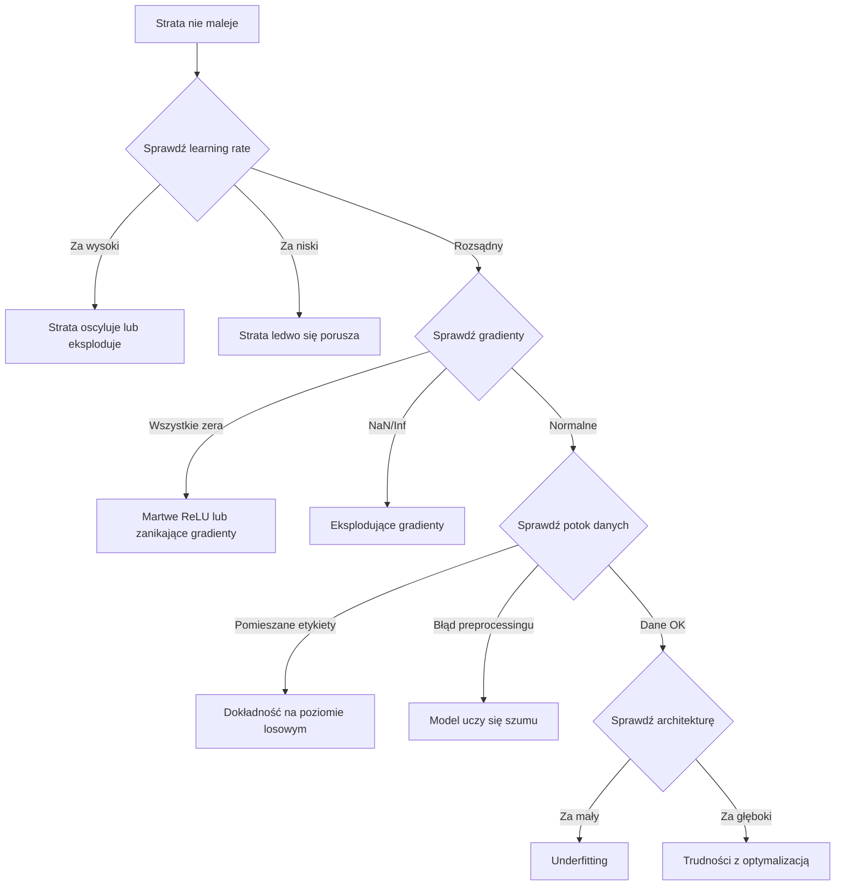
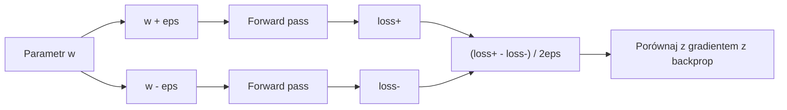
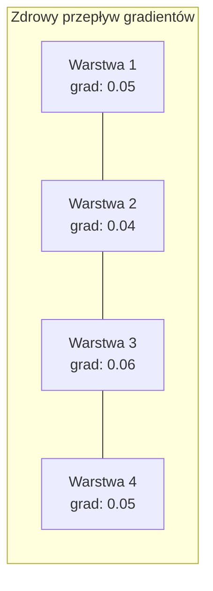
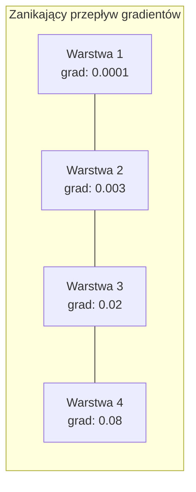
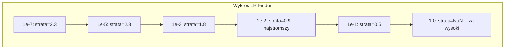

# Debugowanie sieci neuronowych

> Twoja sieć się skompilowała. Uruchomiła się. Wygenerowała liczbę. Liczba jest błędna i nic się nie zawiesiło. Witaj w najtrudniejszym rodzaju debugowania -- takim, w którym nie ma komunikatu o błędzie.

**Typ:** Praktyka
**Języki:** Python, PyTorch
**Wymagania wstępne:** Faza 03 Lekcje 01-10 (szczególnie backpropagation, funkcje straty, optymalizatory)
**Szacowany czas:** ~90 minut

## Cele uczenia się

- Diagnozuj typowe błędy sieci neuronowych (NaN w funkcji straty, płaska krzywa straty, overfitting, oscylacje) używając systematycznych strategii debugowania
- Zastosuj technikę "overfit one batch" aby zweryfikować, że architektura modelu i pętla trenowania są poprawne
- Sprawdzaj wielkości gradientów, rozkłady aktywacji i normy wag, aby zidentyfikować problemy zanikających/eksplodujących gradientów
- Zbuduj listę kontrolną debugowania obejmującą potok danych, architekturę modelu, funkcję straty, optymalizator i problemy z learning rate

## Problem

Tradycyjne oprogramowanie ulega awarii, gdy jest zepsute. Wskaźnik null rzuca wyjątek. Niezgodność typów powoduje błąd kompilacji. Błąd o jedynkę (off-by-one) generuje wyraźnie błędny wynik.

Sieci neuronowe nie dają ci tej luksusowej możliwości.

Zepsuta sieć neuronowa działa do końca, drukuje wartość straty i zwraca predykcje. Strata może maleć. Predykcje mogą wyglądać wiarygodnie. Ale model jest cicho błędny -- uczy się skrótów, zapamiętuje szum lub zbiega do bezużytecznego minimum lokalnego. Badacze Google oszacowali, że 60-70% czasu debugowania ML jest poświęcane na "ciche" błędy, które nie generują błędów, ale obniżają jakość modelu.

Różnica między działającym a zepsutym modelem często sprowadza się do jednej jedynej nieumieszczonej linii: brakującego `zero_grad()`, transponowanego wymiaru, learning rate przesuniętego o 10x. Klasyczny "Przepis na trenowanie sieci neuronowych" (2019) zaczyna się od: "Najczęstszymi błędami sieci neuronowych są błędy, które nie powodują awarii."

Ta lekcja uczy cię, jak je znaleźć.

## Koncepcja

### Mentalność debugowania

Zapomnij o debugowaniu metodą print-and-pray (drukuj i módl się). Debugowanie sieci neuronowych wymaga systematycznego podejścia, ponieważ pętla sprzężenia zwrotnego jest wolna (minuty do godzin na jedno uruchomienie trenowania), a objawy są niejednoznaczne (zła strata może oznaczać 20 różnych rzeczy).

Złota zasada: **zacznij od prostego, dodawaj złożoność krok po kroku i weryfikuj każdy element niezależnie.**



### Objaw 1: Strata nie maleje

To najczęstsza skarga. Pętla trenowania działa, epoki tykają, a strata pozostaje płaska lub oscyluje gwałtownie.

**Zły learning rate.** Za wysoki: strata oscyluje lub skacze do NaN. Za niski: strata maleje tak wolno, że wygląda na płaską. Dla Adama zacznij od 1e-3. Dla SGD zacznij od 1e-1 lub 1e-2. Zawsze wypróbuj 3 learning rate obejmujące zakres 10x każdy (np. 1e-2, 1e-3, 1e-4) przed stwierdzeniem, że coś innego jest nie tak.

**Martwe ReLU.** Jeśli neuron ReLU otrzyma duże ujemne wejście, wyprowadza 0, a jego gradient wynosi 0. Nigdy więcej się nie aktywuje. Jeśli wystarczająco dużo neuronów obumrze, sieć nie może się uczyć. Sprawdź: wydrukuj ułamek aktywacji, które są dokładnie 0 po każdej warstwie ReLU. Jeśli >50% jest martwych, przełącz na LeakyReLU lub zmniejsz learning rate.

**Zanikające gradienty.** W głębokich sieciach z aktywacjami sigmoid lub tanh gradienty kurczą się wykładniczo w miarę propagacji wstecznej. Kiedy dotrą do pierwszej warstwy, są ~0. Pierwsze warstwy przestają się uczyć. Rozwiązanie: użyj ReLU/GELU, dodaj połączenia rezydualne lub użyj batch normalization.

**Eksplodujące gradienty.** Przeciwny problem -- gradienty rosną wykładniczo. Częste w RNN i bardzo głębokich sieciach. Strata skacze do NaN. Rozwiązanie: gradient clipping (`torch.nn.utils.clip_grad_norm_`), niższy learning rate lub dodaj normalizację.

### Objaw 2: Strata maleje, ale model jest zły

Strata idzie w dół. Dokładność trenowania osiąga 99%. Ale dokładność testowa to 55%. Albo model generuje bezsensowne wyniki na prawdziwych danych.

**Overfitting.** Model zapamiętuje dane trenowania zamiast uczyć się wzorców. Przerwa między stratą trenowania a walidacją rośnie z czasem. Rozwiązanie: więcej danych, dropout, weight decay, early stopping, augmentacja danych.

**Wyciek danych (data leakage).** Dane testowe przedostały się do trenowania. Dokładność jest podejrzanie wysoka. Częste przyczyny: shuffling przed podziałem, preprocessing ze statystykami z pełnego zbioru danych, zduplikowane próbki w podziałach. Rozwiązanie: podziel najpierw, preprocessuj potem, sprawdź duplikaty.

**Błędne etykiety.** 5-10% etykiet w większości rzeczywistych zbiorów danych jest błędnych (Northcutt et al., 2021). Model uczy się szumu. Rozwiązanie: użyj confident learning do znajdowania i naprawiania błędnie oznaczonych przykładów lub użyj loss truncation, aby ignorować próbki o wysokiej stracie.

### Objaw 3: NaN lub Inf w funkcji straty

Wartość straty staje się `nan` lub `inf`. Trenowanie jest martwe.

**Learning rate za wysoki.** Aktualizacje gradientów przeskakują tak daleko, że wagi eksplodują. Rozwiązanie: zmniejsz 10-krotnie.

**log(0) lub log(ujemny).** Funkcja straty cross-entropy oblicza `log(p)`. Jeśli twój model wyprowadza dokładnie 0 lub ujemne prawdopodobieństwo, log eksploduje. Rozwiązanie: clampuj predykcje do `[eps, 1-eps]` gdzie `eps=1e-7`.

**Dzielenie przez zero.** Batch normalization dzieli przez odchylenie standardowe. Batch ze stałymi wartościami ma std=0. Rozwiązanie: dodaj epsilon do mianownika (PyTorch robi to domyślnie, ale niestandardowe implementacje mogą nie).

**Przepełnienie numeryczne.** Duże aktywacje podawane do `exp()` produkują Inf. Softmax jest szczególnie podatny. Rozwiązanie: odejmij maximum przed podniesieniem do wykładnika (sztuczka log-sum-exp).

### Technika 1: Sprawdzanie gradientów

Porównaj swoje gradienty analityczne (z backprop) z gradientami numerycznymi (z różnic skończonych). Jeśli się nie zgadzają, twój backward pass ma błąd.

Numeryczny gradient dla parametru `w`:

```
grad_numerical = (loss(w + eps) - loss(w - eps)) / (2 * eps)
```

Metryka zgodności (różnica względna):

```
rel_diff = |grad_analytical - grad_numerical| / max(|grad_analytical|, |grad_numerical|, 1e-8)
```

Jeśli `rel_diff < 1e-5`: poprawne. Jeśli `rel_diff > 1e-3`: prawie na pewno błąd.



### Technika 2: Statystyki aktywacji

Monitoruj średnią i odchylenie standardowe aktywacji po każdej warstwie podczas trenowania. Zdrowe sieci utrzymują aktywacje ze średnią bliską 0 i std bliskim 1 (po normalizacji) lub przynajmniej ograniczone.

| Wskaźnik zdrowia | Średnia | Std | Diagnoza |
|-----------------|---------|-----|----------|
| Zdrowy | ~0 | ~1 | Sieć uczy się normalnie |
| Nasycony | >>0 lub <<0 | ~0 | Aktywacje utknęły na wartościach skrajnych |
| Martwy | 0 | 0 | Neurony są martwe (wszystkie zera) |
| Eksplodujący | >>10 | >>10 | Aktywacje rosną bez ograniczeń |

### Technika 3: Wizualizacja przepływu gradientów

Wykrelij średnią wielkość gradientu dla każdej warstwy. W zdrowej sieci wielkości gradientów powinny być w przybliżeniu podobne w warstwach. Jeśli wczesne warstwy mają gradienty 1000x mniejsze niż późniejsze warstwy, masz zanikające gradienty.





### Technika 4: Test Overfit-One-Batch

Najważniejsza technika debugowania w deep learningu.

Weź jeden mały batch (8-32 próbki). Trenuj na nim przez 100+ iteracji. Strata powinna spaść prawie do zera, a dokładność trenowania powinna osiągnąć 100%. Jeśli tego nie zrobi, twój model lub pętla trenowania ma fundamentalny błąd -- nie kontynuuj pełnego trenowania.

Ten test wyłapuje:

- Złamane funkcje straty
- Złamane backward passes
- Architektura za mała, aby reprezentować dane
- Optimizer niepołączony z parametrami modelu
- Dane i etykiety niewyrównane

To zajmuje 30 sekund i oszczędza godziny debugowania pełnych uruchomień trenowania.

### Technika 5: Learning Rate Finder

Leslie Smith (2017) zaproponował przeszukiwanie learning rate od bardzo małego (1e-7) do bardzo dużego (10) w ciągu jednej epoki, rejestrując stratę. Wykreśl stratę vs learning rate. Optymalny learning rate to w przybliżeniu 10x mniej niż stawka, przy której strata zaczyna najszybciej maleć.



Najlepszy LR w tym przykładzie: ~1e-3 (jedna wielkość przed najstromszym punktem).

### Typowe błędy PyTorch

To są błędy, które marnują najwięcej wspólnych godzin w społeczności PyTorch:

| Błąd | Objaw | Rozwiązanie |
|------|-------|-------------|
| Zapomnienie `optimizer.zero_grad()` | Gradienty kumulują się przez batche, strata oscyluje | Dodaj `optimizer.zero_grad()` przed `loss.backward()` |
| Zapomnienie `model.eval()` w czasie testu | Dropout i batch norm zachowują się inaczej, dokładność testowa różni się między uruchomieniami | Dodaj `model.eval()` i `torch.no_grad()` |
| Złe kształty tensorów | Ciche broadcasting produkuje błędne wyniki, brak błędu | Drukuj kształty po każdej operacji podczas debugowania |
| Niezgodność CPU/GPU | `RuntimeError: expected CUDA tensor` | Użyj `.to(device)` na modelu I danych |
| Niedetachowanie tensorów | Graf obliczeń rośnie w nieskończoność, OOM | Użyj `.detach()` lub `with torch.no_grad()` |
| Operacje in-place psujące autograd | `RuntimeError: modified by in-place operation` | Zastąp `x += 1` przez `x = x + 1` |
| Dane nieznormalizowane | Strata utknęła na poziomie losowym | Normalizuj wejścia do mean=0, std=1 |
| Etykiety jako zły dtype | Cross-entropy oczekuje `Long`, dostało `Float` | Konwertuj etykiety: `labels.long()` |

### Główna tabela debugowania

| Objaw | Prawdopodobna przyczyna | Pierwsza rzecz do wypróbowania |
|-------|------------------------|--------------------------------|
| Strata utknęła na -log(1/num_classes) | Model przewiduje równomierny rozkład | Sprawdź potok danych, zweryfikuj etykiety pasują do wejść |
| Strata NaN po kilku krokach | Learning rate za wysoki | Zmniejsz LR 10-krotnie |
| Strata NaN natychmiast | log(0) lub dzielenie przez zero | Dodaj epsilon do operacji log/dzielenie |
| Strata oscyluje gwałtownie | LR za wysoki lub batch size za mały | Zmniejsz LR, zwiększ batch size |
| Strata maleje potem plateau | LR za wysoki dla fazy fine-tuningu | Dodaj harmonogram LR (cosine lub step decay) |
| Tren acc wysoka, test acc niska | Overfitting | Dodaj dropout, weight decay, więcej danych |
| Tren acc = test acc = losowość | Model niczego się nie uczy | Uruchom test overfit-one-batch |
| Tren acc = test acc ale obie niskie | Underfitting | Większy model, więcej warstw, więcej cech |
| Gradienty wszystkie zero | Martwe ReLU lub odłączony graf obliczeń | Przełącz na LeakyReLU, sprawdź `.requires_grad` |
| Brak pamięci podczas trenowania | Batch za duży lub graf nie jest zwalniany | Zmniejsz batch size, użyj `torch.no_grad()` dla eval |

## Zbuduj to

Narzędzie diagnostyczne, które monitoruje aktywacje, gradienty i krzywe straty. Celowo zepsujesz sieć i użyjesz narzędzia do zdiagnozowania każdego problemu.

### Krok 1: Klasa NetworkDebugger

Podłącza się do modelu PyTorch, aby rejestrować statystyki aktywacji i gradientów dla każdej warstwy.

```python
import torch
import torch.nn as nn
import math


class NetworkDebugger:
    def __init__(self, model):
        self.model = model
        self.activation_stats = {}
        self.gradient_stats = {}
        self.loss_history = []
        self.lr_losses = []
        self.hooks = []
        self._register_hooks()

    def _register_hooks(self):
        for name, module in self.model.named_modules():
            if isinstance(module, (nn.Linear, nn.Conv2d, nn.ReLU, nn.LeakyReLU)):
                hook = module.register_forward_hook(self._make_activation_hook(name))
                self.hooks.append(hook)
                hook = module.register_full_backward_hook(self._make_gradient_hook(name))
                self.hooks.append(hook)

    def _make_activation_hook(self, name):
        def hook(module, input, output):
            with torch.no_grad():
                out = output.detach().float()
                self.activation_stats[name] = {
                    "mean": out.mean().item(),
                    "std": out.std().item(),
                    "fraction_zero": (out == 0).float().mean().item(),
                    "min": out.min().item(),
                    "max": out.max().item(),
                }
        return hook

    def _make_gradient_hook(self, name):
        def hook(module, grad_input, grad_output):
            if grad_output[0] is not None:
                with torch.no_grad():
                    grad = grad_output[0].detach().float()
                    self.gradient_stats[name] = {
                        "mean": grad.mean().item(),
                        "std": grad.std().item(),
                        "abs_mean": grad.abs().mean().item(),
                        "max": grad.abs().max().item(),
                    }
        return hook

    def record_loss(self, loss_value):
        self.loss_history.append(loss_value)

    def check_loss_health(self):
        if len(self.loss_history) < 2:
            return "NOT_ENOUGH_DATA"
        recent = self.loss_history[-10:]
        if any(math.isnan(v) or math.isinf(v) for v in recent):
            return "NAN_OR_INF"
        if len(self.loss_history) >= 20:
            first_half = sum(self.loss_history[:10]) / 10
            second_half = sum(self.loss_history[-10:]) / 10
            if second_half >= first_half * 0.99:
                return "NOT_DECREASING"
        if len(recent) >= 5:
            diffs = [recent[i+1] - recent[i] for i in range(len(recent)-1)]
            if max(diffs) - min(diffs) > 2 * abs(sum(diffs) / len(diffs)):
                return "OSCILLATING"
        return "HEALTHY"

    def check_activations(self):
        issues = []
        for name, stats in self.activation_stats.items():
            if stats["fraction_zero"] > 0.5:
                issues.append(f"DEAD_NEURONS: {name} ma {stats['fraction_zero']:.0%} zerowych aktywacji")
            if abs(stats["mean"]) > 10:
                issues.append(f"EXPLODING_ACTIVATIONS: {name} mean={stats['mean']:.2f}")
            if stats["std"] < 1e-6:
                issues.append(f"COLLAPSED_ACTIVATIONS: {name} std={stats['std']:.2e}")
        return issues if issues else ["HEALTHY"]

    def check_gradients(self):
        issues = []
        grad_magnitudes = []
        for name, stats in self.gradient_stats.items():
            grad_magnitudes.append((name, stats["abs_mean"]))
            if stats["abs_mean"] < 1e-7:
                issues.append(f"VANISHING_GRADIENT: {name} abs_mean={stats['abs_mean']:.2e}")
            if stats["abs_mean"] > 100:
                issues.append(f"EXPLODING_GRADIENT: {name} abs_mean={stats['abs_mean']:.2e}")
        if len(grad_magnitudes) >= 2:
            first_mag = grad_magnitudes[0][1]
            last_mag = grad_magnitudes[-1][1]
            if last_mag > 0 and first_mag / last_mag > 100:
                issues.append(f"GRADIENT_RATIO: first/last = {first_mag/last_mag:.0f}x (zanikający)")
        return issues if issues else ["HEALTHY"]

    def print_report(self):
        print("\n=== NETWORK DEBUGGER REPORT ===")
        print(f"\nKondycja straty: {self.check_loss_health()}")
        if self.loss_history:
            print(f"  Ostatnie 5 strat: {[f'{v:.4f}' for v in self.loss_history[-5:]]}")
        print("\nDiagnostyka aktywacji:")
        for item in self.check_activations():
            print(f"  {item}")
        print("\nDiagnostyka gradientów:")
        for item in self.check_gradients():
            print(f"  {item}")
        print("\nStatystyki aktywacji na warstwę:")
        for name, stats in self.activation_stats.items():
            print(f"  {name}: mean={stats['mean']:.4f} std={stats['std']:.4f} zero={stats['fraction_zero']:.1%}")
        print("\nStatystyki gradientów na warstwę:")
        for name, stats in self.gradient_stats.items():
            print(f"  {name}: abs_mean={stats['abs_mean']:.2e} max={stats['max']:.2e}")

    def remove_hooks(self):
        for hook in self.hooks:
            hook.remove()
        self.hooks.clear()
```

### Krok 2: Test Overfit-One-Batch

```python
def overfit_one_batch(model, x_batch, y_batch, criterion, lr=0.01, steps=200):
    optimizer = torch.optim.Adam(model.parameters(), lr=lr)
    model.train()
    print("\n=== OVERFIT ONE BATCH TEST ===")
    print(f"Batch size: {x_batch.shape[0]}, Steps: {steps}")

    for step in range(steps):
        optimizer.zero_grad()
        output = model(x_batch)
        loss = criterion(output, y_batch)
        loss.backward()
        optimizer.step()

        if step % 50 == 0 or step == steps - 1:
            with torch.no_grad():
                preds = (output > 0).float() if output.shape[-1] == 1 else output.argmax(dim=1)
                targets = y_batch if y_batch.dim() == 1 else y_batch.squeeze()
                acc = (preds.squeeze() == targets).float().mean().item()
            print(f"  Krok {step:3d} | Strata: {loss.item():.6f} | Dokładność: {acc:.1%}")

    final_loss = loss.item()
    if final_loss > 0.1:
        print(f"\n  FAIL: Strata nie zbiegła ({final_loss:.4f}). Model lub pętla trenowania jest zepsuta.")
        return False
    print(f"\n  PASS: Strata zbiegła do {final_loss:.6f}")
    return True
```

### Krok 3: Learning Rate Finder

```python
def find_learning_rate(model, x_data, y_data, criterion, start_lr=1e-7, end_lr=10, steps=100):
    import copy
    original_state = copy.deepcopy(model.state_dict())
    optimizer = torch.optim.SGD(model.parameters(), lr=start_lr)
    lr_mult = (end_lr / start_lr) ** (1 / steps)

    model.train()
    results = []
    best_loss = float("inf")
    current_lr = start_lr

    print("\n=== LEARNING RATE FINDER ===")

    for step in range(steps):
        optimizer.zero_grad()
        output = model(x_data)
        loss = criterion(output, y_data)

        if math.isnan(loss.item()) or loss.item() > best_loss * 10:
            break

        best_loss = min(best_loss, loss.item())
        results.append((current_lr, loss.item()))

        loss.backward()
        optimizer.step()

        current_lr *= lr_mult
        for param_group in optimizer.param_groups:
            param_group["lr"] = current_lr

    model.load_state_dict(original_state)

    if len(results) < 10:
        print("  Nie udało się ukończyć sweep LR -- strata zaszła za szybko")
        return results

    min_loss_idx = min(range(len(results)), key=lambda i: results[i][1])
    suggested_lr = results[max(0, min_loss_idx - 10)][0]

    print(f"  Przeszukano {len(results)} kroków od {start_lr:.0e} do {results[-1][0]:.0e}")
    print(f"  Minimalna strata {results[min_loss_idx][1]:.4f} przy lr={results[min_loss_idx][0]:.2e}")
    print(f"  Sugerowany learning rate: {suggested_lr:.2e}")

    return results
```

### Krok 4: Gradient Checker

```python
def _flat_to_multi_index(flat_idx, shape):
    multi_idx = []
    remaining = flat_idx
    for dim in reversed(shape):
        multi_idx.insert(0, remaining % dim)
        remaining //= dim
    return tuple(multi_idx)


def gradient_check(model, x, y, criterion, eps=1e-4):
    model.train()
    x_double = x.double()
    y_double = y.double()
    model_double = model.double()

    print("\n=== GRADIENT CHECK ===")
    overall_max_diff = 0
    checked = 0

    for name, param in model_double.named_parameters():
        if not param.requires_grad:
            continue

        layer_max_diff = 0

        model_double.zero_grad()
        output = model_double(x_double)
        loss = criterion(output, y_double)
        loss.backward()
        analytical_grad = param.grad.clone()

        num_checks = min(5, param.numel())
        for i in range(num_checks):
            idx = _flat_to_multi_index(i, param.shape)
            original = param.data[idx].item()

            param.data[idx] = original + eps
            with torch.no_grad():
                loss_plus = criterion(model_double(x_double), y_double).item()

            param.data[idx] = original - eps
            with torch.no_grad():
                loss_minus = criterion(model_double(x_double), y_double).item()

            param.data[idx] = original

            numerical = (loss_plus - loss_minus) / (2 * eps)
            analytical = analytical_grad[idx].item()

            denom = max(abs(numerical), abs(analytical), 1e-8)
            rel_diff = abs(numerical - analytical) / denom

            layer_max_diff = max(layer_max_diff, rel_diff)
            checked += 1

        overall_max_diff = max(overall_max_diff, layer_max_diff)
        status = "OK" if layer_max_diff < 1e-5 else "MISMATCH"
        print(f"  {name}: max_rel_diff={layer_max_diff:.2e} [{status}]")

    model.float()

    print(f"\n  Sprawdzono {checked} parametrów")
    if overall_max_diff < 1e-5:
        print("  PASS: Gradienty się zgadzają (rel_diff < 1e-5)")
    elif overall_max_diff < 1e-3:
        print("  WARN: Małe różnice (1e-5 < rel_diff < 1e-3)")
    else:
        print("  FAIL: Wykryto niezgodność gradientów (rel_diff > 1e-3)")
    return overall_max_diff
```

### Krok 5: Celowo zepsute sieci

Teraz zastosuj narzędzie do zepsutych sieci i zdiagnozuj każdą z nich.

```python
def demo_broken_networks():
    torch.manual_seed(42)
    x = torch.randn(64, 10)
    y = (x[:, 0] > 0).long()

    print("\n" + "=" * 60)
    print("BUG 1: Learning rate za wysoki (lr=10)")
    print("=" * 60)
    model1 = nn.Sequential(nn.Linear(10, 32), nn.ReLU(), nn.Linear(32, 2))
    debugger1 = NetworkDebugger(model1)
    optimizer1 = torch.optim.SGD(model1.parameters(), lr=10.0)
    criterion = nn.CrossEntropyLoss()
    for step in range(20):
        optimizer1.zero_grad()
        out = model1(x)
        loss = criterion(out, y)
        debugger1.record_loss(loss.item())
        loss.backward()
        optimizer1.step()
    debugger1.print_report()
    debugger1.remove_hooks()

    print("\n" + "=" * 60)
    print("BUG 2: Martwe ReLU z powodu złej inicjalizacji")
    print("=" * 60)
    model2 = nn.Sequential(nn.Linear(10, 32), nn.ReLU(), nn.Linear(32, 32), nn.ReLU(), nn.Linear(32, 2))
    with torch.no_grad():
        for m in model2.modules():
            if isinstance(m, nn.Linear):
                m.weight.fill_(-1.0)
                m.bias.fill_(-5.0)
    debugger2 = NetworkDebugger(model2)
    optimizer2 = torch.optim.Adam(model2.parameters(), lr=1e-3)
    for step in range(50):
        optimizer2.zero_grad()
        out = model2(x)
        loss = criterion(out, y)
        debugger2.record_loss(loss.item())
        loss.backward()
        optimizer2.step()
    debugger2.print_report()
    debugger2.remove_hooks()

    print("\n" + "=" * 60)
    print("BUG 3: Brakujące zero_grad (gradienty się kumulują)")
    print("=" * 60)
    model3 = nn.Sequential(nn.Linear(10, 32), nn.ReLU(), nn.Linear(32, 2))
    debugger3 = NetworkDebugger(model3)
    optimizer3 = torch.optim.SGD(model3.parameters(), lr=0.01)
    for step in range(50):
        out = model3(x)
        loss = criterion(out, y)
        debugger3.record_loss(loss.item())
        loss.backward()
        optimizer3.step()
    debugger3.print_report()
    debugger3.remove_hooks()

    print("\n" + "=" * 60)
    print("ZDROWA SIEĆ: Poprawna konfiguracja do porównania")
    print("=" * 60)
    model_good = nn.Sequential(nn.Linear(10, 32), nn.ReLU(), nn.Linear(32, 2))
    debugger_good = NetworkDebugger(model_good)
    optimizer_good = torch.optim.Adam(model_good.parameters(), lr=1e-3)
    for step in range(50):
        optimizer_good.zero_grad()
        out = model_good(x)
        loss = criterion(out, y)
        debugger_good.record_loss(loss.item())
        loss.backward()
        optimizer_good.step()
    debugger_good.print_report()
    debugger_good.remove_hooks()

    print("\n" + "=" * 60)
    print("TEST OVERFIT-ONE-BATCH (zdrowy model)")
    print("=" * 60)
    model_test = nn.Sequential(nn.Linear(10, 32), nn.ReLU(), nn.Linear(32, 2))
    overfit_one_batch(model_test, x[:8], y[:8], criterion)

    print("\n" + "=" * 60)
    print("LEARNING RATE FINDER")
    print("=" * 60)
    model_lr = nn.Sequential(nn.Linear(10, 32), nn.ReLU(), nn.Linear(32, 2))
    find_learning_rate(model_lr, x, y, criterion)

    print("\n" + "=" * 60)
    print("GRADIENT CHECK")
    print("=" * 60)
    model_grad = nn.Sequential(nn.Linear(10, 8), nn.ReLU(), nn.Linear(8, 2))
    gradient_check(model_grad, x[:4], y[:4], criterion)
```

## Użyj tego

### Wbudowane narzędzia PyTorch

```python
import torch
import torch.nn as nn

model = nn.Sequential(
    nn.Linear(768, 256),
    nn.ReLU(),
    nn.Linear(256, 10),
)

with torch.autograd.detect_anomaly():
    output = model(input_tensor)
    loss = criterion(output, target)
    loss.backward()

for name, param in model.named_parameters():
    if param.grad is not None:
        print(f"{name}: grad_mean={param.grad.abs().mean():.2e}")
```

### Integracja z Weights & Biases

```python
import wandb

wandb.init(project="debug-training")

for epoch in range(100):
    loss = train_one_epoch()
    wandb.log({
        "loss": loss,
        "lr": optimizer.param_groups[0]["lr"],
        "grad_norm": torch.nn.utils.clip_grad_norm_(model.parameters(), float("inf")),
    })

    for name, param in model.named_parameters():
        if param.grad is not None:
            wandb.log({f"grad/{name}": wandb.Histogram(param.grad.cpu().numpy())})
```

### TensorBoard

```python
from torch.utils.tensorboard import SummaryWriter

writer = SummaryWriter("runs/debug_experiment")

for epoch in range(100):
    loss = train_one_epoch()
    writer.add_scalar("Loss/train", loss, epoch)

    for name, param in model.named_parameters():
        writer.add_histogram(f"weights/{name}", param, epoch)
        if param.grad is not None:
            writer.add_histogram(f"gradients/{name}", param.grad, epoch)
```

### Lista kontrolna debugowania (przed pełnym trenowaniem)

1. Uruchom test overfit-one-batch. Jeśli się nie powiedzie, zatrzymaj się.
2. Wydrukuj podsumowanie modelu -- zweryfikuj, że liczba parametrów jest rozsądna.
3. Uruchom jeden forward pass z losowymi danymi -- sprawdź kształt wyjścia.
4. Trenuj przez 5 epok -- zweryfikuj, że strata maleje.
5. Sprawdź statystyki aktywacji -- brak martwych warstw, brak eksplozji.
6. Sprawdź przepływ gradientów -- brak zanikania, brak eksplozji.
7. Zweryfikuj potok danych -- wydrukuj 5 losowych próbek z etykietami.

## Wyślij to

Ta lekcja wytwarza:

- `outputs/prompt-nn-debugger.md` -- prompt do diagnozowania błędów trenowania sieci neuronowych
- `outputs/skill-debug-checklist.md` -- drzewo decyzyjne do debugowania problemów z trenowaniem

Kluczowe wzorce wdrożeniowe dla debugowania:

- Dodawaj hooks monitorujące do produkcyjnych skryptów trenowania
- Loguj statystyki aktywacji i gradientów do W&B lub TensorBoard co N kroków
- Implementuj automatyczne alerty dla NaN w stracie, martwych neuronów (>80% zerowych) lub eksplozji gradientów
- Zawsze uruchamiaj test overfit-one-batch przy zmianie architektur lub potoków danych

## Ćwiczenia

1. **Dodaj detektor eksplodujących gradientów.** Zmodyfikuj `NetworkDebugger`, aby wykrywał, kiedy gradienty przekraczają próg i automatycznie sugerował wartość gradient clipping. Przetestuj to na 20-warstwowej sieci bez normalizacji.

2. **Zbuduj reanimator martwych neuronów.** Napisz funkcję, która identyfikuje martwe neurony ReLU (zawsze wyprowadzające 0) i reinicjalizuje ich przychodzące wagi inicjalizacją Kaiminga. Pokaż, że to odzyskuje sieć, gdzie >70% neuronów jest martwych.

3. **Zaimplementuj learning rate finder z wykresem.** Rozszerz `find_learning_rate` aby zapisywało wyniki jako CSV i napisz osobny skrypt, który odczytuje CSV i wyświetla krzywą LR vs strata używając matplotlib. Zidentyfikuj optymalny LR dla ResNet-18 na CIFAR-10.

4. **Stwórz walidator potoku danych.** Napisz funkcję, która sprawdza: zduplikowane próbki między podziałami train/test, nierównowagę rozkładu etykiet (>10:1 ratio), normalizację wejść (średnia bliska 0, std bliskie 1) oraz wartości NaN/Inf w danych. Uruchom to na celowo uszkodzonym zbiorze danych.

5. **Zdebuguj prawdziwą awarię.** Weź mini-framework z Lekcji 10, wprowadź subtelny błąd (np. transponuj macierz wag w backward), i użyj sprawdzania gradientów, aby zlokalizować dokładnie, który parametr ma niepoprawne gradienty. Udokumentuj proces debugowania.

## Kluczowe terminy

| Termin | Co ludzie mówią | Co to faktycznie oznacza |
|--------|----------------|-------------------------|
| Silent bug | "Działa, ale daje złe wyniki" | Błąd, który nie produkuje błędu, ale obniża jakość modelu -- dominujący tryb awarii w ML |
| Dead ReLU | "Neurony obumarły" | Neuron ReLU, którego wejście jest zawsze ujemne, więc wyprowadza 0 i otrzymuje gradient 0 na stałe |
| Vanishing gradients | "Wczesne warstwy przestają się uczyć" | Gradienty kurczą się wykładniczo przez warstwy, sprawiając że wagi we wczesnych warstwach są efektywnie zamrożone |
| Exploding gradients | "Strata poszła do NaN" | Gradienty rosną wykładniczo przez warstwy, powodując aktualizacje wag tak duże, że przepełniają się |
| Gradient checking | "Zweryfikuj, że backprop jest poprawny" | Porównywanie gradientów analitycznych z backprop do gradientów numerycznych z różnic skończonych |
| Overfit-one-batch | "Najważniejszy test debugowania" | Trenowanie na jednym małym batchu, aby zweryfikować, że model MOŻE się uczyć -- jeśli nie może, coś jest fundamentalnie zepsute |
| LR finder | "Przeszukaj, aby znaleźć właściwy learning rate" | Wykładniczo zwiększanie learning rate w ciągu jednej epoki i wybieranie stawki tuż przed tym, jak strata się rozjedzie |
| Data leakage | "Dane testowe przedostały się do trenowania" | Gdy informacje ze zbioru testowego zanieczyszczają trenowanie, produkując sztucznie wysoką dokładność |
| Activation statistics | "Monitoruj kondycję warstw" | Śledzenie średniej, std i ułamka zer każdego wyjścia warstwy, aby wykryć martwe, nasycone lub eksplodujące neurony |
| Gradient clipping | "Ogranicz wielkość gradientu" | Skalowanie gradientów w dół, gdy ich norma przekracza próg, zapobiegając eksplodującym aktualizacjom gradientów |

## Dalsze czytanie

- Smith, "Cyclical Learning Rates for Training Neural Networks" (2017) -- paper wprowadzający test zakresu learning rate (LR finder)
- Northcutt et al., "Pervasive Label Errors in Test Sets Destabilize Machine Learning Benchmarks" (2021) -- demonstruje, że 3-6% etykiet w ImageNet, CIFAR-10 i innych głównych benchmarkach jest błędnych
- Zhang et al., "Understanding Deep Learning Requires Rethinking Generalization" (2017) -- paper pokazujący, że sieci neuronowe mogą zapamiętywać losowe etykiety, dlatego test overfit-one-batch działa
- Dokumentacja PyTorch na temat `torch.autograd.detect_anomaly` i `torch.autograd.set_detect_anomaly` dla wbudowanego wykrywania NaN/Inf