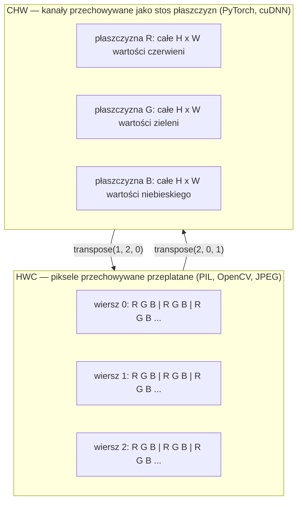

# Podstawy obrazu — piksele, kanały, przestrzenie barw

> Obraz to tensor próbek światła. Od tego faktu zaczyna się każdy model wizyjny, z którym kiedykolwiek będziesz pracować.

**Typ:** Build
**Języki:** Python
**Wymagania wstępne:** Lekcja 12 fazy 1 (Operacje na tensorach), Lekcja 11 fazy 3 (Wprowadzenie do PyTorch)
**Szacowany czas:** ~45 minut

## Cele uczenia się

- Wyjaśnić, w jaki sposób ciągła scena zostaje zdyskretyzowana do pikseli i dlaczego decyzje dotyczące próbkowania/kwantyzacji ustawiają pułap dla każdego modelu downstream
- Odczytywać, wycinać i sprawdzać obrazy jako tablice NumPy oraz płynnie przełączać się między układami HWC i CHW
- Konwertować między RGB, grayscale, HSV i YCbCr oraz uzasadnić, dlaczego każda przestrzeń barw istnieje
- Stosować preprocessowanie na poziomie pikseli (normalize, standardize, resize, channel-first) dokładnie tak, jak oczekuje torchvision

## Problem

Każdy artykuł, który przeczytasz, każde wstępnie wytrenowane wagi, które pobierzesz, każde wywołanie API wizyjnego zakłada określone kodowanie danych wejściowych. Podajesz obraz `uint8` tam, gdzie model oczekuje `float32` — nadal działa — i cicho generuje śmieci. Wsadzasz BGR do sieci trenowanej na RGB i dokładność spada o dziesięć punktów. Przekazujesz modelowi dane w układzie channels-last, gdy oczekuje channels-first i pierwsza warstwa konwolucyjna traktuje wysokość jako kanał cech. Żadne z tych zachowań nie rzuca błędu. Po prostu niszczy metryki i przez tydzień szukasz błędu, który tkwi w tym, jak załadowałeś plik.

Konwolucja nie jest skomplikowana, gdy wiesz, po czym się przesuwa. Trudność polega na tym, że „obraz" oznacza różne rzeczy dla kamery, dekodera JPEG, PIL, OpenCV, torchvision i kernela CUDA. Każdy stos ma własną kolejność osi, zakres bajtów i konwencję kanałów. Inżynier wizyjny, który nie potrafi tego ogarnąć, dostarcza zepsute pipeline'y.

Ta lekcja naprawia fundament, aby reszta fazy mogła na nim budować. Pod koniec będziesz wiedzieć, czym jest piksel, dlaczego są trzy liczby na piksel zamiast jednej, co „normalize z statystykami ImageNet" faktycznie robi i jak przemieszczać się między dwoma lub trzema układami, które każda inna lekcja w tej fazie będzie zakładać.

## Koncepcja

### Pełny pipeline preprocessowania na jeden rzut oka

Każdy produkcyjny system wizyjny to ta sama sekwencja odwracalnych transformacji. Pomylisz jeden krok i model widzi inny wkład niż ten, na którym był trenowany.

```mermaid
flowchart LR
    A["Plik obrazu<br/>(JPEG/PNG)"] --> B["Dekoduj<br/>uint8 HWC"]
    B --> C["Konwertuj<br/>przestrzeń barw<br/>(RGB/BGR/YCbCr)"]
    C --> D["Zmień rozmiar<br/>krótszy bok"]
    D --> E["Przytnij środek<br/>rozmiar modelu"]
    E --> F["Podziel przez 255<br/>float32 [0,1]"]
    F --> G["Odejmij średnią<br/>Podziel przez odchylenie"]
    G --> H["Transponuj<br/>HWC → CHW"]
    H --> I["Batch<br/>CHW → NCHW"]
    I --> J["Model"]

    style A fill:#fef3c7,stroke:#d97706
    style J fill:#ddd6fe,stroke:#7c3aed
    style G fill:#fecaca,stroke:#dc2626
    style H fill:#bfdbfe,stroke:#2563eb
```



Dwa czerwone i niebieskie pola to miejsca, gdzie żyje 80% cichych błędów: brak standaryzacji i zły układ.

### Piksel to próbka, nie kwadrat

Matryca kamery zlicza fotony, które lądują na siatce miniaturowych detektorów. Każdy detektor integruje światło przez ułamek sekundy i emituje napięcie proporcjonalne do tego, ile fotonów go uderzyło. Matryca następnie dyskretyzuje to napięcie do liczby całkowitej. Jeden detektor staje się jednym pikselem.

```
Ciągła scena                  Siatka matrycy                Obraz cyfrowy
(nieskończona szczegółowość)  (H x W detektorów)            (H x W liczb całkowitych)

    ~~~~~                       +--+--+--+--+--+              210 198 180 155 120
   ~   ~   ~                    |  |  |  |  |  |              205 195 178 152 118
  ~ światło ~       ---->       +--+--+--+--+--+    ---->    200 190 175 150 115
   ~~~~~                        |  |  |  |  |  |              195 185 170 148 112
                               +--+--+--+--+--+              188 180 165 145 108
```

Na tym etapie podejmowane są dwie decyzje, które ustalają pułap dla wszystkiego downstream:

- **Próbkowanie przestrzenne** decyduje o tym, ile detektorów przypada na stopień sceny. Zbyt mało — krawędzie stają się postrzępione (aliasing). Zbyt dużo — wybuchają pamięć i obliczenia.
- **Kwantyzacja intensywności** decyduje o tym, jak drobno napięcie jest pakowane w przedziały. 8 bitów daje 256 poziomów i jest standardem do wyświetlania. 10, 12, 16 bitów daje gładsze gradienty i ma znaczenie w obrazowaniu medycznym, HDR i pipeline'ach surowych danych z matrycy.

Piksel to nie kolorowy kwadrat z powierzchnią. To jedno pomiar. Gdy zmieniasz rozmiar lub obracasz, przebudowujesz tę siatkę pomiarową.

### Dlaczego trzy kanały

Jeden detektor zlicza fotony w całym widmie widzialnym — to grayscale. Aby uzyskać kolor, matrycę pokrywa się mozaiką filtrów czerwonych, zielonych i niebieskich. Po demosaicingu każda lokalizacja przestrzenna ma trzy liczby całkowite: odpowiedź detektora z filtrem czerwonym, zielonym i pobliskim niebieskim. Te trzy liczby całkowite to trójka RGB piksela.

```
Jeden piksel w pamięci:

    (R, G, B) = (210, 140, 30)   <- czerwonawo-pomarańczowy

Obraz H x W RGB:

    kształt (H, W, 3)     przechowywany jako   H wierszy po W pikseli po 3 wartości
                                        każda w [0, 255] dla uint8
```

Trzy to nie magia. Kamery głębokości dodają kanał Z. Satelity dodają podczerwień i pasma ultrafioletowe. Skany medyczne często mają jeden kanał (rentgen, CT) lub wiele (hiperspektralne). Liczba kanałów to ostatnia oś; warstwy konwolucyjne uczą się mieszać między nimi.

### Dwie konwencje układu: HWC i CHW

Ten sam tensor, dwa porządki. Każda biblioteka wybiera jedno.

```
HWC (height, width, channels)           CHW (channels, height, width)

   W ->                                    H ->
  +-----+-----+-----+                     +-----+-----+
H |R G B|R G B|R G B|                   C |R R R R R R|
| +-----+-----+-----+                   | +-----+-----+
v |R G B|R G B|R G B|                   v |G G G G G G|
  +-----+-----+-----+                     +-----+-----+
                                          |B B B B B B|
                                          +-----+-----+

   PIL, OpenCV, matplotlib,              PyTorch, większość frameworków DL
   prawie każdy plik obrazu na dysku     kernele cuDNN
```

CHW istnieje dlatego, że jądra konwolucyjne przesuwają się przez H i W. Trzymanie osi kanałów na początku oznacza, że każde jądro widzi ciągłą płaszczyznę 2D na kanał, co wektoryzuje się czysto. Formaty dyskowe trzymają HWC dlatego, że odpowiada to temu, jak linie skanowania wychodzą z matrycy.

Jednolinijkowa konwersja, którą napiszesz tysiąc razy:

```
img_chw = img_hwc.transpose(2, 0, 1)      # NumPy
img_chw = img_hwc.permute(2, 0, 1)        # PyTorch tensor
```

Układ pamięci, zwizualizowany:



### Zakresy bajtów i dtype

Trzy konwencje dominują:

| Konwencja | dtype | Zakres | Gdzie to widzisz |
|------------|-------|-------|-------------------|
| Surowy | `uint8` | [0, 255] | Pliki na dysku, PIL, wyjście OpenCV |
| Znormalizowany | `float32` | [0.0, 1.0] | Po `img.astype('float32') / 255` |
| Standaryzowany | `float32` | w przybliżeniu [-2, +2] | Po odjęciu średniej i podzieleniu przez odchylenie |

Sieci konwolucyjne były trenowane na standaryzowanych danych wejściowych. Statystyki ImageNet `mean=[0.485, 0.456, 0.406]`, `std=[0.229, 0.224, 0.225]` to średnia arytmetyczna i odchylenie standardowe trzech kanałów z pełnego zbioru treningowego ImageNet, obliczone na pikselach znormalizowanych do [0, 1]. Wkładanie surowego `uint8` do modelu, który oczekuje standaryzowanego floata to najczęstszy cichy błąd w applied vision.

### Przestrzenie barw i dlaczego istnieją

RGB to format zapisu, ale nie zawsze najbardziej użyteczna reprezentacja dla modelu.

```
 RGB               HSV                       YCbCr / YUV

 R czerwony        H barwa (kąt 0-360)        Y luminancja (jasność)
 G zielony         S nasycenie (0-1)          Cb chrominancja niebiesko-żółta
 B niebieski       V wartość/jasność (0-1)   Cr chrominancja czerwono-zielona

 Liniowy do        Separuje kolor od          Separuje jasność od
 wyjścia matrycy   jasności. Użyteczne        koloru. JPEG i większość
                   do binaryzacji            kodeków wideo kompresuje
                   koloru, suwaków UI,        kanały chrominancji mocniej,
                   prostych filtrów           bo ludzkie oko jest mniej
                                            wrażliwe na szczegóły chrominancji
                                            niż na Y.
```

Dla większości współczesnych CNN wkładasz RGB. Inne przestrzenie spotykasz, gdy:

- **HSV** — klasyczny kod CV, binaryzacja oparta na kolorze, balans bieli.
- **YCbCr** — czytanie wnętrza JPEG, pipeline'y wideo, modele super-resolution, które operują tylko na Y.
- **Grayscale** — OCR, modele dokumentów, każdy przypadek, gdzie kolor jest zmienną zakłócającą, a nie sygnałem.

Grayscale z RGB to ważona suma, nie średnia, dlatego że ludzkie oko jest bardziej wrażliwe na zieleń niż na czerwień czy niebieski:

```
Y = 0.299 R + 0.587 G + 0.114 B       (ITU-R BT.601, klasyczne wagi)
```

### Proporcje boków, zmiana rozmiaru i interpolacja

Każdy model ma ustalony rozmiar wejściowy (224x224 dla większości klasyfikatorów ImageNet, 384x384 lub 512x512 dla nowoczesnych detektorów). Twoje obrazy rzadko pasują. Trzy wybory zmiany rozmiaru, które mają znaczenie:

- **Zmień rozmiar krótszego boku, potem przytnij środek** — standardowy przepis ImageNet. Zachowuje proporcje boków, wyrzuca pasek brzegowych pikseli.
- **Zmień rozmiar i dopasuj padding** — zachowuje proporcje boków i każdy piksel, dodaje czarne paski. Standard dla detekcji i OCR.
- **Zmień rozmiar bezpośrednio do docelowego** — rozciąga obraz. Tanie, zniekształca geometrię, w porządku dla wielu zadań klasyfikacji.

Metoda interpolacji decyduje o tym, jak obliczane są pośrednie piksele, gdy nowa siatka nie pokrywa się ze starą:

```
Nearest neighbour     najszybsze, blokowe, jedyny wybór dla masek/etykiet
Bilinear              szybkie, gładkie, domyślne dla większości zmian rozmiaru
Bicubic               wolniejsze, ostrzejsze przy upscalingu
Lanczos               najwolniejsze, najlepsza jakość, używane do finalnego wyświetlania
```

Zasada kciuka: bilinear do trenowania, bicubic lub lanczos dla zasobów, które będziesz oglądać, nearest dla wszystkiego zawierającego całkowite ID klas.

## Zbuduj to

### Krok 1: Załaduj obraz i sprawdź jego kształt

Użyj Pillow do załadowania dowolnego JPEG lub PNG, konwertuj do NumPy i wypisz, co masz. Dla deterministycznego przykładu, który działa offline, stwórz syntetyczny.

```python
import numpy as np
from PIL import Image

def synthetic_rgb(h=128, w=192, seed=0):
    rng = np.random.default_rng(seed)
    yy, xx = np.meshgrid(np.linspace(0, 1, h), np.linspace(0, 1, w), indexing="ij")
    r = (np.sin(xx * 6) * 0.5 + 0.5) * 255
    g = yy * 255
    b = (1 - yy) * xx * 255
    rgb = np.stack([r, g, b], axis=-1) + rng.normal(0, 6, (h, w, 3))
    return np.clip(rgb, 0, 255).astype(np.uint8)

arr = synthetic_rgb()
# Or load from disk:
# arr = np.asarray(Image.open("your_image.jpg").convert("RGB"))

print(f"type:   {type(arr).__name__}")
print(f"dtype:  {arr.dtype}")
print(f"shape:  {arr.shape}     # (H, W, C)")
print(f"min:    {arr.min()}")
print(f"max:    {arr.max()}")
print(f"pixel at (0, 0): {arr[0, 0]}")
```

Oczekiwany wynik: `shape: (H, W, 3)`, `dtype: uint8`, zakres `[0, 255]`. To kanoniczna reprezentacja na dysku niezależnie od tego, czy bajty pochodzą z kamery, dekodera JPEG czy generatora syntetycznego.

### Krok 2: Podziel kanały i zmień kolejność układu

Wyciągnij R, G, B oddzielnie, potem konwertuj z HWC do CHW dla PyTorch.

```python
R = arr[:, :, 0]
G = arr[:, :, 1]
B = arr[:, :, 2]
print(f"R shape: {R.shape}, mean: {R.mean():.1f}")
print(f"G shape: {G.shape}, mean: {G.mean():.1f}")
print(f"B shape: {B.shape}, mean: {B.mean():.1f}")

arr_chw = arr.transpose(2, 0, 1)
print(f"\nHWC shape: {arr.shape}")
print(f"CHW shape: {arr_chw.shape}")
```

Trzy płaszczyzny grayscale, jedna na kanał. CHW tylko przestawia osie; kopiowanie danych nie jest ściśle wymagane, gdy układ pamięci na to pozwala.

### Krok 3: Konwersje grayscale i HSV

Ważona suma grayscale, potem ręczna konwersja RGB-do-HSV.

```python
def rgb_to_grayscale(rgb):
    weights = np.array([0.299, 0.587, 0.114], dtype=np.float32)
    return (rgb.astype(np.float32) @ weights).astype(np.uint8)

def rgb_to_hsv(rgb):
    rgb_f = rgb.astype(np.float32) / 255.0
    r, g, b = rgb_f[..., 0], rgb_f[..., 1], rgb_f[..., 2]
    cmax = np.max(rgb_f, axis=-1)
    cmin = np.min(rgb_f, axis=-1)
    delta = cmax - cmin

    h = np.zeros_like(cmax)
    mask = delta > 0
    rmax = mask & (cmax == r)
    gmax = mask & (cmax == g)
    bmax = mask & (cmax == b)
    h[rmax] = ((g[rmax] - b[rmax]) / delta[rmax]) % 6
    h[gmax] = ((b[gmax] - r[gmax]) / delta[gmax]) + 2
    h[bmax] = ((r[bmax] - g[bmax]) / delta[bmax]) + 4
    h = h * 60.0

    s = np.where(cmax > 0, delta / cmax, 0)
    v = cmax
    return np.stack([h, s, v], axis=-1)

gray = rgb_to_grayscale(arr)
hsv = rgb_to_hsv(arr)
print(f"gray shape: {gray.shape}, range: [{gray.min()}, {gray.max()}]")
print(f"hsv   shape: {hsv.shape}")
print(f"hue range: [{hsv[..., 0].min():.1f}, {hsv[..., 0].max():.1f}] degrees")
print(f"sat range: [{hsv[..., 1].min():.2f}, {hsv[..., 1].max():.2f}]")
print(f"val range: [{hsv[..., 2].min():.2f}, {hsv[..., 2].max():.2f}]")
```

Hue wychodzi w stopniach, nasycenie i value w [0, 1]. To odpowiada konwencji `hsv_full` OpenCV.

### Krok 4: Normalize, standardize i odwróć to

Idź od surowych bajtów do dokładnie takiego tensora, jakiego oczekuje wstępnie wytrenowany model ImageNet, potem z powrotem.

```python
mean = np.array([0.485, 0.456, 0.406], dtype=np.float32)
std = np.array([0.229, 0.224, 0.225], dtype=np.float32)

def preprocess_imagenet(rgb_uint8):
    x = rgb_uint8.astype(np.float32) / 255.0
    x = (x - mean) / std
    x = x.transpose(2, 0, 1)
    return x

def deprocess_imagenet(chw_float32):
    x = chw_float32.transpose(1, 2, 0)
    x = x * std + mean
    x = np.clip(x * 255.0, 0, 255).astype(np.uint8)
    return x

x = preprocess_imagenet(arr)
print(f"preprocessed shape: {x.shape}     # (C, H, W)")
print(f"preprocessed dtype: {x.dtype}")
print(f"preprocessed mean per channel:  {x.mean(axis=(1, 2)).round(3)}")
print(f"preprocessed std  per channel:  {x.std(axis=(1, 2)).round(3)}")

roundtrip = deprocess_imagenet(x)
max_diff = np.abs(roundtrip.astype(int) - arr.astype(int)).max()
print(f"roundtrip max pixel diff: {max_diff}    # should be 0 or 1")
```

Średnia na kanał powinna być bliska zeru, odchylenie bliskie jedności. Para preprocess/deprocess to dokładnie to, co każde wywołanie `transforms.Normalize` w torchvision robi pod maską.

### Krok 5: Zmień rozmiar z trzema metodami interpolacji

Porównaj nearest, bilinear i bicubic na upscale, żeby różnica była widoczna.

```python
target = (arr.shape[0] * 3, arr.shape[1] * 3)

nearest = np.asarray(Image.fromarray(arr).resize(target[::-1], Image.NEAREST))
bilinear = np.asarray(Image.fromarray(arr).resize(target[::-1], Image.BILINEAR))
bicubic = np.asarray(Image.fromarray(arr).resize(target[::-1], Image.BICUBIC))

def local_roughness(x):
    gy = np.diff(x.astype(float), axis=0)
    gx = np.diff(x.astype(float), axis=1)
    return float(np.abs(gy).mean() + np.abs(gx).mean())

for name, out in [("nearest", nearest), ("bilinear", bilinear), ("bicubic", bicubic)]:
    print(f"{name:>8}  shape={out.shape}  roughness={local_roughness(out):6.2f}")
```

Nearest ma najwyższy wynik roughness, bo zachowuje twarde krawędzie. Bilinear jest najgładszy. Bicubic jest pomiędzy, zachowując postrzeganą ostrość bez artefaktów schodkowych.

## Użyj tego

`torchvision.transforms` łączy wszystko powyżej w jeden komponowalny pipeline. Poniższy kod odtwarza dokładnie to, co robi `preprocess_imagenet`, plus resize i crop.

```python
import torch
from torchvision import transforms
from PIL import Image

img = Image.fromarray(synthetic_rgb(256, 256))

pipeline = transforms.Compose([
    transforms.Resize(256),
    transforms.CenterCrop(224),
    transforms.ToTensor(),
    transforms.Normalize(mean=[0.485, 0.456, 0.406], std=[0.229, 0.224, 0.225]),
])

x = pipeline(img)
print(f"tensor type:  {type(x).__name__}")
print(f"tensor dtype: {x.dtype}")
print(f"tensor shape: {tuple(x.shape)}      # (C, H, W)")
print(f"per-channel mean: {x.mean(dim=(1, 2)).tolist()}")
print(f"per-channel std:  {x.std(dim=(1, 2)).tolist()}")

batch = x.unsqueeze(0)
print(f"\nbatched shape: {tuple(batch.shape)}   # (N, C, H, W) — ready for a model")
```

Cztery kroki, w tej dokładnie kolejności: `Resize(256)` skaluje krótszy bok do 256; `CenterCrop(224)` bierze patch 224x224 ze środka; `ToTensor()` dzieli przez 255 i zamienia HWC na CHW; `Normalize` odejmuje średnią ImageNet i dzieli przez std. Odwrócenie tej kolejności cicho zmienia, co dociera do modelu.

## Wyślij to

Ta lekcja tworzy:

- `outputs/prompt-vision-preprocessing-audit.md` — prompt, który zamienia dowolną kartę modelu lub datasetu w checklistę dokładnych niezmienników preprocessowania, które zespół musi honorować.
- `outputs/skill-image-tensor-inspector.md` — skill, który dla dowolnego tensora lub tablicy o kształcie obrazu raportuje dtype, układ, zakres i czy wygląda na surowy, znormalizowany czy standaryzowany.

## Ćwiczenia

1. **(Łatwe)** Załaduj JPEG z OpenCV (`cv2.imread`) i z Pillow. Wypisz oba kształty i piksel w `(0, 0)`. Wyjaśnij różnicę w kolejności kanałów, potem napisz jednolinijkową konwersję, która sprawia, że tablica OpenCV jest identyczna z Pillow.
2. **(Średnie)** Napisz `standardize(img, mean, std)` i jego odwrotność, które razem przechodzą test `roundtrip_max_diff <= 1` na dowolnym obrazie uint8. Twoje funkcje muszą działać na pojedynczym obrazie w HWC i na batchu w NCHW tym samym wywołaniem.
3. **(Trudne)** Weź tensor standaryzowany ImageNet z 3 kanałami i przepuść go przez konwolucję 1x1, która uczy się ważonej mieszanki RGB w jeden kanał grayscale. Zainicjuj wagi na `[0.299, 0.587, 0.114]`, zamroź je i zweryfikuj, że wyjście odpowiada ręcznej `rgb_to_grayscale` w granicach błędu zmiennoprzecinkowego. Jakie inne klasyczne transformacje przestrzeni barw można zapisać jako konwolucje 1x1?

## Kluczowe terminy

| Termin | Co ludzie mówią | Co to faktycznie oznacza |
|------|----------------|----------------------|
| Pixel | „Kolorowy kwadrat" | Jedna próbka intensywności światła w jednej lokalizacji siatki — trzy liczby dla koloru, jedna dla grayscale |
| Channel | „Kolor" | Jedna z równoległych siatek przestrzennych składanych w tensor obrazu; ostatnia oś w HWC, pierwsza w CHW |
| HWC / CHW | „Kształt" | Kolejności osi dla tensora obrazu; dysk i PIL używają HWC, PyTorch i cuDNN używają CHW |
| Normalize | „Skaluj obraz" | Podziel przez 255, żeby piksele żyły w [0, 1] — konieczne, ale niewystarczające |
| Standardize | „Wyśrodkuj" | Odejmij średnią i podziel przez std na kanał, żeby rozkład danych wejściowych odpowiadał temu, na czym model był trenowany |
| Konwersja grayscale | „Średnia z kanałów" | Ważona suma ze współczynnikami 0.299/0.587/0.114, która odpowiada percepcji luminancji przez człowieka |
| Interpolacja | „Jak resize wybiera piksele" | Reguła, która decyduje o wartościach wyjściowych, gdy nowa siatka nie pokrywa się ze starą — nearest dla etykiet, bilinear do trenowania, bicubic do wyświetlania |
| Aspect ratio | „Szerokość przez wysokość" | Stosunek, który odróżnia „resize i pad" od „resize i stretch" |

## Dalsze czytanie

- [Charles Poynton — A Guided Tour of Color Space](https://poynton.ca/PDFs/Guided_tour.pdf) — najjasniejsze techniczne omówienie tego, dlaczego jest tak wiele przestrzeni barw i kiedy każda ma znaczenie
- [PyTorch Vision Transforms Docs](https://pytorch.org/vision/stable/transforms.html) — pełny pipeline transformacji, które faktycznie będziesz komponować w produkcji
- [How JPEG Works (Colt McAnlis)](https://www.youtube.com/watch?v=F1kYBnY6mwg) — ostry wizualny przegląd chroma subsamplingu, DCT i dlaczego JPEG koduje YCbCr zamiast RGB
- [ImageNet Preprocessing Conventions (torchvision models)](https://pytorch.org/vision/stable/models.html) — źródło prawdy dla `mean=[0.485, 0.456, 0.406]` i dlaczego każdy model w zoo tego oczekuje