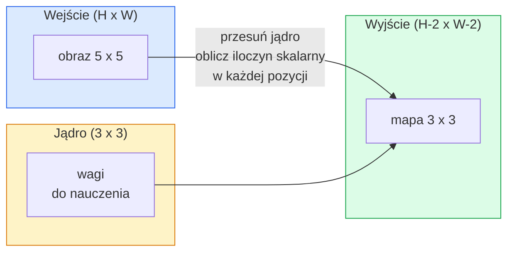
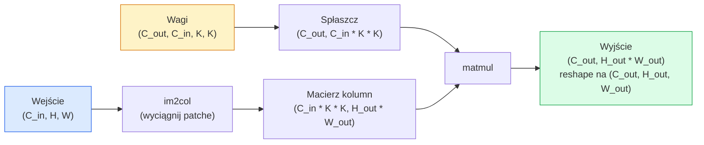

# Sploty od zera

> Splot to gęsta warstwa w miniature, którą przesuwasz po obrazie, dzieląc te same wagi w każdej lokalizacji.

**Typ:** Build
**Języki:** Python
**Wymagania wstępne:** Faza 3 (Deep Learning Core), Faza 4 Lekcja 01 (Podstawy obrazu)
**Szacowany czas:** ~75 minut

## Cele uczenia się

- Zaimplementuj splot 2D od zera używając tylko NumPy, w tym wersję z zagnieżdżonymi pętlami oraz zwektoryzowaną wersję `im2col`
- Oblicz rozmiar przestrzenny wyjścia dla dowolnej kombinacji rozmiaru wejścia, rozmiaru jądra, paddingu i kroku, oraz uzasadnij wzór `(H - K + 2P) / S + 1`
- Zaprojektuj ręcznie jądra (wykrywanie krawędzi, rozmycie, wyostrzenie, Sobel) i wyjaśnij, dlaczego każde z nich wytwarza określony wzór aktywacji
- Złóż sploty w ekstraktor cech i połącz głębokość stosu z rozmiarem pola recepcyjnego

## Problem

Gęsta warstwa na obrazie RGB 224x224 wymagałaby 224 * 224 * 3 = 150 528 wag wejściowych na neuron. Sama ukryta warstwa z 1 000 jednostkami to już 150 milionów parametrów — zanim cokolwiek przydatnego się nauczyła. Co gorsza, ta warstwa nie ma pojęcia, że pies w lewym górnym rogu i pies w prawym dolnym rogu to ten sam wzór. Traktuje każdą pozycję piksela jako niezależną, co jest całkowicie błędne dla obrazów: przesunięcie kota o trzy piksele nie powinno zmuszać sieci do ponownego uczenia się koncepcji.

Dwie właściwości, których potrzebuje model obrazu, to **niezmienniczość translacyjna** (wyjście przesuwa się, gdy wejście się przesuwa) oraz **dzielenie parametrów** (ten sam detektor cech działa wszędzie). Gęste warstwy nie dają żadnej z nich. Splot daje obie za darmo.

Splot nie został wynaleziony dla deep learningu. To ta sama operacja, która napędza kompresję JPEG, rozmycie Gaussowskie w Photoshopie, wykrywanie krawędzi w wizji przemysłowej i każdy filtr audio kiedykolwiek wydany. Powód, dla którego CNN-y zdominowały ImageNet od 2012 do 2020, polega na tym, że splot jest właściwym priorytetem dla danych, gdzie bliskie wartości są powiązane i ten sam wzór może pojawić się w dowolnym miejscu.

## Koncepcja

### Jedno jądro, przesuwane

Splot 2D pobiera małą macierz wag zwaną jądrem (lub filtrem), przesuwa ją po wejściu i w każdej lokalizacji oblicza sumę iloczynów element-wise. Ta suma staje się jednym pikselem wyjściowym.



Konkretny przykład 3x3 na wejściu 5x5 (bez paddingu, krok 1):

```
Wejście X (5 x 5):                  Jądro W (3 x 3):

  1  2  0  1  2                     1  0 -1
  0  1  3  1  0                     2  0 -2
  2  1  0  2  1                     1  0 -1
  1  0  2  1  3
  2  1  1  0  1

Jądro przesuwa się przez każde poprawne okno 3 x 3. Wyjście Y ma rozmiar 3 x 3:

 Y[0,0] = sum( W * X[0:3, 0:3] )
 Y[0,1] = sum( W * X[0:3, 1:4] )
 Y[0,2] = sum( W * X[0:3, 2:5] )
 Y[1,0] = sum( W * X[1:4, 0:3] )
 ... i tak dalej
```

Ten jeden wzór — **współdzielone wagi, lokalność, przesuwane okno** — to cała idea. Wszystko inne to tylko księgowość.

### Wzór na rozmiar wyjścia

Przy danym przestrzennym rozmiarze wejścia `H`, rozmiarze jądra `K`, paddingu `P`, kroku `S`:

```
H_out = floor( (H - K + 2P) / S ) + 1
```

Zapamiętaj to na pamięć. Będziesz to obliczać dziesiątki razy podczas projektowania architektury.

| Scenariusz | H | K | P | S | H_out |
|----------|---|---|---|---|-------|
| Splot valid, bez paddingu | 32 | 3 | 0 | 1 | 30 |
| Splot same (zachowuje rozmiar) | 32 | 3 | 1 | 1 | 32 |
| Downsampling o 2 | 32 | 3 | 1 | 2 | 16 |
| Pooling 2x2 | 32 | 2 | 0 | 2 | 16 |
| Duże pole recepcyjne | 32 | 7 | 3 | 2 | 16 |

"Same padding" oznacza wybór P tak, aby H_out == H gdy S == 1. Dla nieparzystego K, jest to P = (K - 1) / 2. Dlatego jądra 3x3 dominują — są najmniejszym nieparzystym jądrem, które ma jeszcze środek.

### Padding

Bez paddingu każdy splot zmniejsza mapę cech. Złóż 20 takich i Twój obraz 224x224 staje się 184x184, co marnuje obliczenia na granicach i komplikuje połączenia rezydualne, które potrzebują dopasowanych kształtów.

```
Zero padding (P = 1) na wejściu 5 x 5:

  0  0  0  0  0  0  0
  0  1  2  0  1  2  0
  0  0  1  3  1  0  0
  0  2  1  0  2  1  0       Teraz jądro może wycentrować się na pikselu
  0  1  0  2  1  3  0       (0, 0) i nadal mieć trzy wiersze i
  0  2  1  1  0  1  0       trzy kolumny wartości do pomnożenia.
  0  0  0  0  0  0  0
```

Tryby, które spotkasz w praktyce: `zero` (najczęstszy), `reflect` (odbij lustrzanie krawędź, unika twardych granic w modelach generatywnych), `replicate` (kopiuje krawędź), `circular` (zawija wokół, używane w problemach toroidalnych).

### Stride

Stride to rozmiar kroku przesuwania. `stride=1` to domyślny. `stride=2` zmniejsza dwukrotnie wymiary przestrzenne i jest klasycznym sposobem downsamplingu wewnątrz CNN bez osobnej warstwy poolingu — każda nowoczesna architektura (ResNet, ConvNeXt, MobileNet) używa strided conv w miejsce max-pool gdzieś.

```
Stride 1 na wejściu 5 x 5, jądro 3 x 3:

  startuje: (0,0) (0,1) (0,2)        -> wiersz wyjścia 0
          (1,0) (1,1) (1,2)        -> wiersz wyjścia 1
          (2,0) (2,1) (2,2)        -> wiersz wyjścia 2

  Wyjście: 3 x 3

Stride 2 na tym samym wejściu:

  startuje: (0,0) (0,2)              -> wiersz wyjścia 0
          (2,0) (2,2)              -> wiersz wyjścia 1

  Wyjście: 2 x 2
```

### Wiele kanałów wejściowych

Prawdziwe obrazy mają trzy kanały. Splot 3x3 na wejściu RGB jest w istocie objętością 3x3x3: jeden plaster 3x3 na kanał wejściowy. W każdej pozycji przestrzennej mnożysz i sumujesz przez wszystkie trzy plastry i dodajesz bias.

```
Wejście:   (C_in,  H,  W)        3 x 5 x 5
Jądro:     (C_in,  K,  K)        3 x 3 x 3 (jedno jądro)
Wyjście:   (1,     H', W')       mapa 2D

Dla warstwy produkującej C_out kanałów wyjściowych, układasz C_out jąder:

Wagi:      (C_out, C_in, K, K)   np. 64 x 3 x 3 x 3
Wyjście:   (C_out, H', W')       64 x 3 x 3

Liczba parametrów: C_out * C_in * K * K + C_out   (+ C_out to biasy)
```

Ta ostatnia linia to ta, którą będziesz obliczać podczas planowania modelu. Splot 3x3 z 64 kanałami na wejściu 3-kanałowym ma `64 * 3 * 3 * 3 + 64 = 1 792` parametrów. Tanio.

### Trik im2col

Zagnieżdżone pętle są łatwe do czytania, ale wolne. GPU chcą dużych mnożeń macierzy. Trick: spłaszcz każde okno pola recepcyjnego wejścia w jedną kolumnę dużej macierzy, spłaszcz jądro w wiersz, a cały splot staje się jednym mnożeniem matmul.



Każda produkcyjna implementacja splotu to jakaś wariant tego plus triki cache-tiling (direct conv, Winograd, FFT conv dla dużych jąder). Zrozum im2col, a zrozumiesz sedno.

### Pole recepcyjne

Pojedynczy splot 3x3 widzi 9 pikseli wejściowych. Złóż dwa sploty 3x3 i neuron w drugiej warstwie widzi 5x5 pikseli wejściowych. Trzy sploty 3x3 dają 7x7. Ogólnie:

```
RF po L nałożonych splotach K x K (stride 1) = 1 + L * (K - 1)

Ze stride:   RF rośnie multiplikatywnie ze stride w każdej warstwie.
```

Cały powód, dla którego "3x3 przez całą drogę" działa (VGG, ResNet, ConvNeXt), polega na tym, że dwa sploty 3x3 widzą ten sam obszar wejścia co jeden splot 5x5, ale z mniejszą liczbą parametrów i dodatkową nieliniowością pomiędzy.

## Zbuduj to

### Krok 1: Wypełnij tablicę zerami

Zacznij od najmniejszego prymitywu: funkcji, która wypełnia zerami wokół tablicy H x W.

```python
import numpy as np

def pad2d(x, p):
    if p == 0:
        return x
    h, w = x.shape[-2:]
    out = np.zeros(x.shape[:-2] + (h + 2 * p, w + 2 * p), dtype=x.dtype)
    out[..., p:p + h, p:p + w] = x
    return out

x = np.arange(9).reshape(3, 3)
print(x)
print()
print(pad2d(x, 1))
```

Sztuczka z osiami końcowymi `x.shape[:-2]` oznacza, że ta sama funkcja działa na `(H, W)`, `(C, H, W)` lub `(N, C, H, W)` bez modyfikacji.

### Krok 2: Splot 2D z zagnieżdżonymi pętlami

Implementacja referencyjna — wolna, ale jednoznaczna. To jest to, co `torch.nn.functional.conv2d` robi w zasadzie.

```python
def conv2d_naive(x, w, b=None, stride=1, padding=0):
    c_in, h, w_in = x.shape
    c_out, c_in_w, kh, kw = w.shape
    assert c_in == c_in_w

    x_pad = pad2d(x, padding)
    h_out = (h + 2 * padding - kh) // stride + 1
    w_out = (w_in + 2 * padding - kw) // stride + 1

    out = np.zeros((c_out, h_out, w_out), dtype=np.float32)
    for oc in range(c_out):
        for i in range(h_out):
            for j in range(w_out):
                hs = i * stride
                ws = j * stride
                patch = x_pad[:, hs:hs + kh, ws:ws + kw]
                out[oc, i, j] = np.sum(patch * w[oc])
        if b is not None:
            out[oc] += b[oc]
    return out
```

Cztery zagnieżdżone pętle (kanał wyjściowy, wiersz, kolumna, plus implikowana suma nad C_in, kh, kw). To jest ground truth, przeciwko której będziesz sprawdzać każdą szybszą implementację.

### Krok 3: Weryfikacja z ręcznie zaprojektowanym jądrem

Zbuduj pionowe jądro Sobela, zastosuj je do syntetycznego obrazu ze stopniem i obserwuj, jak pionowa krawędź się zapala.

```python
def synthetic_step_image():
    img = np.zeros((1, 16, 16), dtype=np.float32)
    img[:, :, 8:] = 1.0
    return img

sobel_x = np.array([
    [[-1, 0, 1],
     [-2, 0, 2],
     [-1, 0, 1]]
], dtype=np.float32)[None]

x = synthetic_step_image()
y = conv2d_naive(x, sobel_x, padding=1)
print(y[0].round(1))
```

Oczekuj dużych dodatnich wartości w kolumnie 7 (wzrost jasności od lewej do prawej) i zer gdzie indziej. Ten jeden wydruk to Twoje sanity check, że matematyka jest poprawna.

### Krok 4: im2col

Konwertuj każde okno wielkości jądra w wejściu na kolumnę macierzy. Dla `C_in=3, K=3`, każda kolumna ma 27 liczb.

```python
def im2col(x, kh, kw, stride=1, padding=0):
    c_in, h, w = x.shape
    x_pad = pad2d(x, padding)
    h_out = (h + 2 * padding - kh) // stride + 1
    w_out = (w + 2 * padding - kw) // stride + 1

    cols = np.zeros((c_in * kh * kw, h_out * w_out), dtype=x.dtype)
    col = 0
    for i in range(h_out):
        for j in range(w_out):
            hs = i * stride
            ws = j * stride
            patch = x_pad[:, hs:hs + kh, ws:ws + kw]
            cols[:, col] = patch.reshape(-1)
            col += 1
    return cols, h_out, w_out
```

To wciąż pętla Pythona, ale teraz ciężka praca będzie jednym zwektoryzowanym matmulem.

### Krok 5: Szybki splot przez im2col + matmul

Zamień poczwórną pętlę na jedno mnożenie macierzowe.

```python
def conv2d_im2col(x, w, b=None, stride=1, padding=0):
    c_out, c_in, kh, kw = w.shape
    cols, h_out, w_out = im2col(x, kh, kw, stride, padding)
    w_flat = w.reshape(c_out, -1)
    out = w_flat @ cols
    if b is not None:
        out += b[:, None]
    return out.reshape(c_out, h_out, w_out)
```

Sprawdzenie poprawności: uruchom obie implementacje i porównaj.

```python
rng = np.random.default_rng(0)
x = rng.normal(0, 1, (3, 16, 16)).astype(np.float32)
w = rng.normal(0, 1, (8, 3, 3, 3)).astype(np.float32)
b = rng.normal(0, 1, (8,)).astype(np.float32)

y_naive = conv2d_naive(x, w, b, padding=1)
y_im2col = conv2d_im2col(x, w, b, padding=1)

print(f"max abs diff: {np.max(np.abs(y_naive - y_im2col)):.2e}")
```

`max abs diff` powinno być około `1e-5` — różnica wynika z kolejności akumulacji zmiennoprzecinkowej, nie z błędu.

### Krok 6: Bank ręcznie zaprojektowanych jąder

Pięć filtrów, które pokazują, co pojedyncza warstwa splotowa może wyrazić przed jakimkolwiek treningiem.

```python
KERNELS = {
    "identity": np.array([[0, 0, 0], [0, 1, 0], [0, 0, 0]], dtype=np.float32),
    "blur_3x3": np.ones((3, 3), dtype=np.float32) / 9.0,
    "sharpen": np.array([[0, -1, 0], [-1, 5, -1], [0, -1, 0]], dtype=np.float32),
    "sobel_x": np.array([[-1, 0, 1], [-2, 0, 2], [-1, 0, 1]], dtype=np.float32),
    "sobel_y": np.array([[-1, -2, -1], [0, 0, 0], [1, 2, 1]], dtype=np.float32),
}

def apply_kernel(img2d, kernel):
    x = img2d[None].astype(np.float32)
    w = kernel[None, None]
    return conv2d_im2col(x, w, padding=1)[0]
```

Zastosowane do dowolnego obrazu w skali szarości, blur miękczy, sharpen podostrza krawędzie, Sobel-x zapala pionowe krawędzie, Sobel-y zapala poziome krawędzie. To są dokładnie te wzory, które *pierwsza* trenowana warstwa splotowa w AlexNecie i VGG nauczyła się wykrywać — bo dobry model obrazu potrzebuje detektorów krawędzi i blobów niezależnie od późniejszego zadania.

## Użyj tego

`nn.Conv2d` z PyTorcha opakowuje tę samą operację z autograd, kernelami CUDA i optymalizacją cuDNN. Semantyka kształtów jest identyczna.

```python
import torch
import torch.nn as nn

conv = nn.Conv2d(in_channels=3, out_channels=64, kernel_size=3, stride=1, padding=1)
print(conv)
print(f"weight shape: {tuple(conv.weight.shape)}   # (C_out, C_in, K, K)")
print(f"bias shape:   {tuple(conv.bias.shape)}")
print(f"param count:  {sum(p.numel() for p in conv.parameters())}")

x = torch.randn(8, 3, 224, 224)
y = conv(x)
print(f"\ninput  shape: {tuple(x.shape)}")
print(f"output shape: {tuple(y.shape)}")
```

Zamień `padding=1` na `padding=0` i wyjście spadnie do 222x222. Zamień `stride=1` na `stride=2` i spadnie do 112x112. Ten sam wzór, który zapamiętałeś powyżej.

## Wyślij to

Ta lekcja wytwarza:

- `outputs/prompt-cnn-architect.md` — prompt, który przy danym rozmiarze wejścia, budżecie parametrów i docelowym polu recepcyjnym projektuje stos warstw `Conv2d` z odpowiednim K/S/P na każdym kroku.
- `outputs/skill-conv-shape-calculator.md` — skill, który przechodzi przez specyfikację sieci warstwa po warstwie i zwraca kształt wyjścia, pole recepcyjne i liczbę parametrów dla każdego bloku.

## Ćwiczenia

1. **(Łatwe)** Mając wejście 128x128 w skali szarości i stos `[Conv3x3(s=1,p=1), Conv3x3(s=2,p=1), Conv3x3(s=1,p=1), Conv3x3(s=2,p=1)]`, oblicz ręcznie przestrzenny rozmiar wyjścia i pole recepcyjne na każdej warstwie. Zweryfikuj z `nn.Sequential` z PyTorch dummy convs.
2. **(Średnie)** Rozszerz `conv2d_naive` i `conv2d_im2col` o argument `groups`. Pokaż, że `groups=C_in=C_out` odtwarza depthwise convolution i że jej liczba parametrów to `C * K * K` zamiast `C * C * K * K`.
3. **(Trudne)** Zaimplementuj wsteczną propagację `conv2d_im2col` ręcznie: mając gradient wyjścia, oblicz gradient `x` i `w`. Zweryfikuj przeciwko `torch.autograd.grad` na tych samych wejściach i wagach. Trick: gradient im2col to `col2im`, i musi akumulować nakładające się okna.

## Kluczowe terminy

| Termin | Co ludzie mówią | Co to faktycznie oznacza |
|------|----------------|----------------------|
| Splot | "Przesuwanie filtru" | Nauczalny iloczyn skalarny stosowany w każdej lokalizacji przestrzennej ze współdzielonymi wagami; matematycznie cross-correlation, ale wszyscy nazywają to splotem |
| Jądro / filtr | "Detektor cech" | Mały tensor wag o kształcie (C_in, K, K), którego iloczyn skalarny z oknem wejścia produkuje jeden piksel wyjścia |
| Stride | "Jak daleko skaczesz" | Rozmiar kroku między kolejnymi pozycjami jądra; stride 2 zmniejsza dwukrotnie każdy wymiar przestrzenny |
| Padding | "Zera na krawędziach" | Dodatkowe wartości dodawane wokół wejścia, aby jądro mogło wycentrować się na pikselach granicznych; `same` padding zachowuje równość rozmiaru wyjścia z wejściem |
| Pole recepcyjne | "Ile neuron widzi" | Plaster oryginalnego wejścia, od którego zależy dana aktywacja wyjściowa, rosnący z głębokością i stride |
| im2col | "Sztuczka GEMM" | Przestawienie każdego okna recepcyjnego w kolumny, aby splot stał się jednym dużym mnożeniem macierzy — sedno każdego szybkiego kernela splotowego |
| Depthwise conv | "Jedno jądro na kanał" | Splot z `groups == C_in`, obliczający każdy kanał wyjściowy tylko z jego pasującego kanału wejściowego; szkielet MobileNet i ConvNeXt |
| Niezmienniczość translacyjna | "Przesuń wejście, przesuń wyjście" | Właściwość, że przesunięcie wejścia o k pikseli przesuwa wyjście o k pikseli; wynika za darmo ze współdzielonych wag |