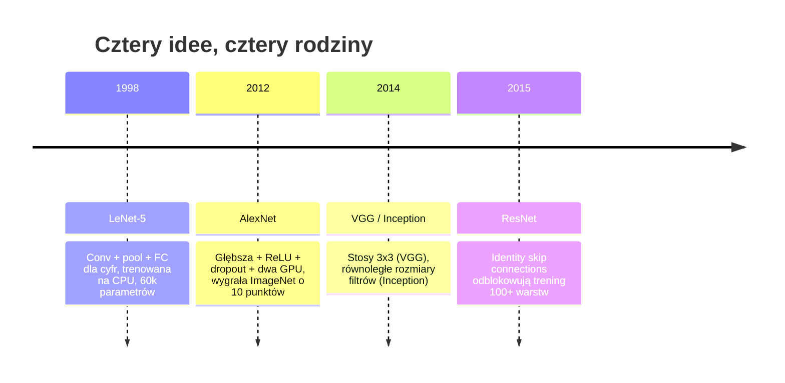
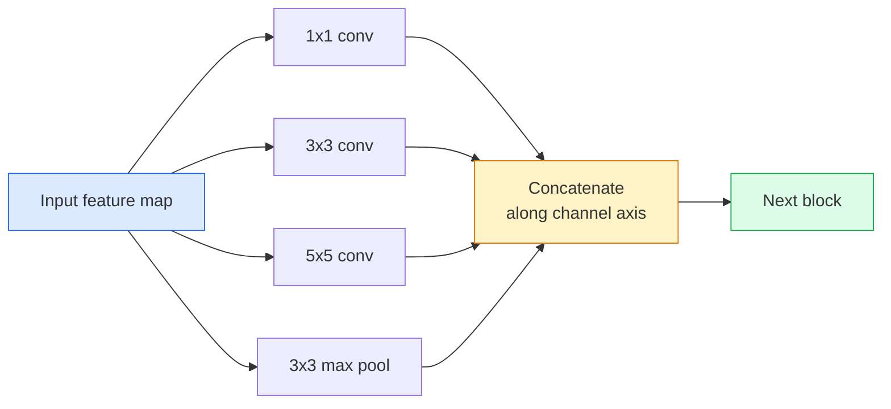
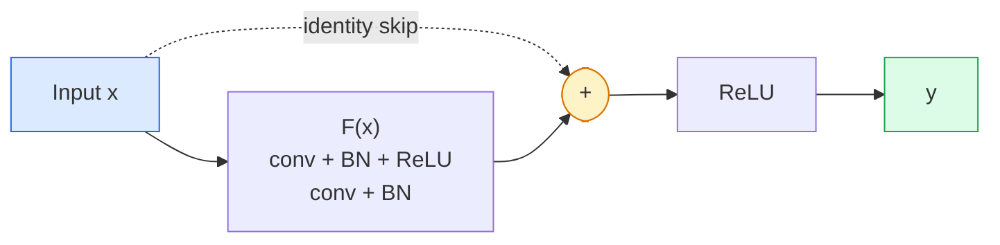

# CNN — od LeNet do ResNet

> Każda główna architektura CNN z ostatnich trzydziestu lat to ten sam przepis: konwolucja–nieliniowość–downsampling z jedną nową ideą doklejoną. Poznaj idee w kolejności.

**Typ:** Nauka + Budowanie
**Języki:** Python
**Wymagania wstępne:** Phase 3 Lesson 11 (PyTorch), Phase 4 Lesson 01 (Image Fundamentals), Phase 4 Lesson 02 (Convolutions from Scratch)
**Czas:** ~75 minut

## Cele uczenia się

- Prześledź linię architektoniczną LeNet-5 -> AlexNet -> VGG -> Inception -> ResNet i podaj jedną nową ideę, jaką wniosła każda rodzina
- Zaimplementuj LeNet-5, blok w stylu VGG i BasicBlock ResNet w PyTorch, każdy w mniej niż 40 liniach
- Wyjaśnij, dlaczego połączenia rezydualne zamieniają sieć o 1000 warstw z nietrwałalnej w najnowocześniejszą
- Przeczytaj nowoczesny backbone (ResNet-18, ResNet-50) i przewiduj kształt wyjściowy, pole recepcyjne oraz liczbę parametrów przed zajrzeniem do źródła

## Problem

W 2011 roku najlepszy klasyfikator ImageNet uzyskiwał około 74% dokładności top-5. W 2012 roku AlexNet uzyskał 85%. W 2015 roku ResNet uzyskał 96%. Żadnych nowych danych. Żadnej nowej generacji GPU. Zyski pochodziły z idei architektoniczych. Praktykujący inżynier widzenia musi wiedzieć, która idea pochodzi z którego artykułu, ponieważ każdy produkcyjny backbone, który wdrożysz w 2026 roku, jest rekombinacją tych samych elementów — i dlatego, że idee wciąż się przenoszą: grupowane konwolucje przeszły z CNN do transformerów, połączenia rezydualne przeszły z ResNet do każdego LLM, normalizacja partii żyje w modelach dyfuzyjnych.

Studiowanie tych sieci w kolejności chroni także przed częstym błędem: sięganiem po największy dostępny model, gdy sieć wielkości LeNet rozwiązałaby problem. MNIST nie potrzebuje ResNet. Znajomość krzywej skalowania każdej rodziny mówi ci, gdzie się na niej umieścić.

## Koncepcja

### Cztery idee, które zmieniły wizję



Nic innego w klasycznej wizji nie miało takiego znaczenia jak te cztery skoki.

### LeNet-5 (1998)

Rozpoznawacz cyfr Yann LeCuna. 60 000 parametrów. Dwa bloki conv-pool, dwie w pełni połączone warstwy, aktywacje tanh. Zdefiniował szablon, który każdy CNN dziedziczy:

```
input (1, 32, 32)
  conv 5x5 -> (6, 28, 28)
  avg pool 2x2 -> (6, 14, 14)
  conv 5x5 -> (16, 10, 10)
  avg pool 2x2 -> (16, 5, 5)
  flatten -> 400
  dense -> 120
  dense -> 84
  dense -> 10
```

Wszystko, co nowoczesny świat nazywa CNN — naprzemienne konwolucje i downsampling prowadzące do małej głowy klasyfikatora — to LeNet z większą liczbą warstw, większymi kanałami i lepszymi aktywacjami.

### AlexNet (2012)

Trzy zmiany, które razem przełamały ImageNet:

1. **ReLU** zamiast tanh. Gradienty przestają zanikać. Trening przyspiesza sześciokrotnie.
2. **Dropout** w w pełni połączonej głowie. Regularyzacja staje się warstwą, nie sztuczką.
3. **Głębokość i szerokość**. Pięć warstw conv, trzy warstwy dense, 60M parametrów, trenowane na dwóch GPU z podziałem modelu między nimi.

Figure 2 z artykułu wciąż pokazuje podział GPU jako dwa równoległe strumienie. Ten paralelizm był obejściem sprzętowym, nie architektonicznym wglądem — ale trzy powyższe idee wciąż są w każdym modelu, którego używasz.

### VGG (2014)

VGG zadał pytanie: co się stanie, jeśli użyjesz tylko konwolucji 3x3 i będziesz iść głęboko?

```
stack:   conv 3x3 -> conv 3x3 -> pool 2x2
repeat:  16 lub 19 warstw conv
```

Dwie konwolucje 3x3 widzą ten sam obszar wejściowy 5x5 co jedna konwolucja 5x5, ale z mniejszą liczbą parametrów (2*9*C^2 = 18C^2 vs 25*C^2) i dodatkowym ReLU pomiędzy nimi. VGG zamienił to spostrzeżenie w całą architekturę. Prostota — jeden typ bloku, powtarzany — uczyniła ją punktem odniesienia dla wszystkiego, co przyszło potem.

Koszt: 138M parametrów, wolne trenowanie, drogie wnioskowanie.

### Inception (2014, ten sam rok)

Odpowiedź Google na "jaki rozmiar jądra powinienem użyć?" brzmiała: wszystkie, równolegle.



Każda gałąź się specjalizuje — 1x1 do mieszania kanałów, 3x3 do lokalnej tekstury, 5x5 do większych wzorców, pooling do cech niezmienniczych względem przesunięcia — a konkatenacja pozwala następnej warstwie wybrać dowolną użyteczną gałąź. Inception v1 używał konwolucji 1x1 wewnątrz każdej gałęzi jako wąskiego gardła, aby utrzymać liczbę parametrów w ryzach.

### Problem degradacji

Do 2015 roku VGG-19 działała, a VGG-32 już nie. Głębokość miała pomagać, ale po około 20 warstwach zarówno straty trenowania, jak i testu pogarszały się. To nie jest overfitting. To optymalizator nie może znaleźć użytecznych wag, bo gradienty kurczą się multiplikatywnie przez każdą warstwę.

```
Plain deep network:
  y = f_L( f_{L-1}( ... f_1(x) ... ) )

Gradient względem wczesnej warstwy:
  dL/dW_1 = dL/dy * df_L/df_{L-1} * ... * df_2/df_1 * df_1/dW_1

Każdy czynnik multiplikatywny ma wielkość w przybliżeniu (wielkość wagi) * (wzmocnienie aktywacji).
Ułóż 100 takich z wzmocnieniem < 1 i gradient jest efektywnie zerowy.
```

VGG działał przy 19 warstwach, ponieważ batch norm (opublikowany jednocześnie) utrzymywał aktywacje dobrze skalowane. Ale nawet batch norm nie mógł uratować głębokości powyżej około 30 warstw.

### ResNet (2015)

He, Zhang, Ren, Sun zaproponowali jedną zmianę, która naprawiła wszystko:

```
standard block:   y = F(x)
residual block:   y = F(x) + x
```

`+ x` oznacza, że warstwa może zawsze wybrać nicnierobienie, napędzając `F(x)` do zera. Sieć ResNet o 1000 warstw jest teraz najwyżej tak zła jak sieć o 1 warstwie, ponieważ każdy dodatkowy blok ma trywialną drogę ucieczki. Z tą gwarancją optymalizator jest skłonny sprawić, że każdy blok jest *minimalnie* użyteczny — a minimalna użyteczność, skumulowana 100 razy, to stan najnowocześniejszy.



Dwa warianty bloku pojawiają się wszędzie:

- **BasicBlock** (ResNet-18, ResNet-34): dwie konwolucje 3x3, skip wokół obu.
- **Bottleneck** (ResNet-50, -101, -152): 1x1 down, 3x3 middle, 1x1 up, skip wokół trójki. Tańsze przy wysokich liczbach kanałów.

Gdy skip musi przejść przez downsample (stride=2), ścieżka identity jest zastępowana konwolucją 1x1 stride=2, aby dopasować kształty.

### Dlaczego połączenia rezydualne mają znaczenie poza wizją

Idea właściwie nie dotyczyła klasyfikacji obrazów. Chodziło o przekształcenie głębokich sieci z "skrzyżuj palce i módl się, żeby gradienty przetrwały" w niezawodne, skalowalne narzędzie inżynieryjne. Każdy transformer, o którym przeczytasz w następnej fazie, ma dokładnie to samo połączenie skip w każdym bloku. Bez ResNet nie ma GPT.

## Zbuduj to

### Krok 1: LeNet-5

Minimalna, wierna implementacja LeNet. Aktywacje tanh, average pooling. Jedyna koncesja na nowoczesność to użycie `nn.CrossEntropyLoss` downstream zamiast oryginalnych połączeń Gaussowskich.

```python
import torch
import torch.nn as nn
import torch.nn.functional as F

class LeNet5(nn.Module):
    def __init__(self, num_classes=10):
        super().__init__()
        self.conv1 = nn.Conv2d(1, 6, kernel_size=5)
        self.conv2 = nn.Conv2d(6, 16, kernel_size=5)
        self.pool = nn.AvgPool2d(2)
        self.fc1 = nn.Linear(16 * 5 * 5, 120)
        self.fc2 = nn.Linear(120, 84)
        self.fc3 = nn.Linear(84, num_classes)

    def forward(self, x):
        x = self.pool(torch.tanh(self.conv1(x)))
        x = self.pool(torch.tanh(self.conv2(x)))
        x = torch.flatten(x, 1)
        x = torch.tanh(self.fc1(x))
        x = torch.tanh(self.fc2(x))
        return self.fc3(x)

net = LeNet5()
x = torch.randn(1, 1, 32, 32)
print(f"output: {net(x).shape}")
print(f"params: {sum(p.numel() for p in net.parameters()):,}")
```

Oczekiwany wynik: `output: torch.Size([1, 10])`, `params: 61,706`. To cały klasyfikator cyfr, który zapoczątkował nowoczesną wizję.

### Krok 2: Blok VGG

Jeden wielokrotnego użytku blok: dwie konwolucje 3x3, ReLU, batch norm, max pool.

```python
class VGGBlock(nn.Module):
    def __init__(self, in_c, out_c):
        super().__init__()
        self.conv1 = nn.Conv2d(in_c, out_c, kernel_size=3, padding=1)
        self.bn1 = nn.BatchNorm2d(out_c)
        self.conv2 = nn.Conv2d(out_c, out_c, kernel_size=3, padding=1)
        self.bn2 = nn.BatchNorm2d(out_c)
        self.pool = nn.MaxPool2d(2)

    def forward(self, x):
        x = F.relu(self.bn1(self.conv1(x)))
        x = F.relu(self.bn2(self.conv2(x)))
        return self.pool(x)

class MiniVGG(nn.Module):
    def __init__(self, num_classes=10):
        super().__init__()
        self.stack = nn.Sequential(
            VGGBlock(3, 32),
            VGGBlock(32, 64),
            VGGBlock(64, 128),
        )
        self.head = nn.Sequential(
            nn.AdaptiveAvgPool2d(1),
            nn.Flatten(),
            nn.Linear(128, num_classes),
        )

    def forward(self, x):
        return self.head(self.stack(x))

net = MiniVGG()
x = torch.randn(1, 3, 32, 32)
print(f"output: {net(x).shape}")
print(f"params: {sum(p.numel() for p in net.parameters()):,}")
```

Trzy bloki VGG na danych wejściowych w rozmiarze CIFAR, adaptacyjny pool, jedna warstwa liniowa. ~290k parametrów. Wystarczająco dla CIFAR-10.

### Krok 3: BasicBlock ResNet

Podstawowy blok budulcowy ResNet-18 i ResNet-34.

```python
class BasicBlock(nn.Module):
    def __init__(self, in_c, out_c, stride=1):
        super().__init__()
        self.conv1 = nn.Conv2d(in_c, out_c, kernel_size=3, stride=stride, padding=1, bias=False)
        self.bn1 = nn.BatchNorm2d(out_c)
        self.conv2 = nn.Conv2d(out_c, out_c, kernel_size=3, stride=1, padding=1, bias=False)
        self.bn2 = nn.BatchNorm2d(out_c)
        if stride != 1 or in_c != out_c:
            self.shortcut = nn.Sequential(
                nn.Conv2d(in_c, out_c, kernel_size=1, stride=stride, bias=False),
                nn.BatchNorm2d(out_c),
            )
        else:
            self.shortcut = nn.Identity()

    def forward(self, x):
        out = F.relu(self.bn1(self.conv1(x)))
        out = self.bn2(self.conv2(out))
        out = out + self.shortcut(x)
        return F.relu(out)
```

`bias=False` na warstwach conv to konwencja batch-norm — parametr beta BN już obsługuje bias, więc dodatkowy bias konwolucji to marnotrawstwo. `shortcut` potrzebuje prawdziwej konwolucji tylko gdy stride lub liczba kanałów się zmienia; w przeciwnym razie to no-op identity.

### Krok 4: Mały ResNet

Cztery grupy BasicBlock dla działającego ResNet na danych wejściowych w rozmiarze CIFAR.

```python
class TinyResNet(nn.Module):
    def __init__(self, num_classes=10):
        super().__init__()
        self.stem = nn.Sequential(
            nn.Conv2d(3, 32, kernel_size=3, stride=1, padding=1, bias=False),
            nn.BatchNorm2d(32),
            nn.ReLU(inplace=True),
        )
        self.layer1 = self._make_group(32, 32, num_blocks=2, stride=1)
        self.layer2 = self._make_group(32, 64, num_blocks=2, stride=2)
        self.layer3 = self._make_group(64, 128, num_blocks=2, stride=2)
        self.layer4 = self._make_group(128, 256, num_blocks=2, stride=2)
        self.head = nn.Sequential(
            nn.AdaptiveAvgPool2d(1),
            nn.Flatten(),
            nn.Linear(256, num_classes),
        )

    def _make_group(self, in_c, out_c, num_blocks, stride):
        blocks = [BasicBlock(in_c, out_c, stride=stride)]
        for _ in range(num_blocks - 1):
            blocks.append(BasicBlock(out_c, out_c, stride=1))
        return nn.Sequential(*blocks)

    def forward(self, x):
        x = self.stem(x)
        x = self.layer1(x)
        x = self.layer2(x)
        x = self.layer3(x)
        x = self.layer4(x)
        return self.head(x)

net = TinyResNet()
x = torch.randn(1, 3, 32, 32)
print(f"output: {net(x).shape}")
print(f"params: {sum(p.numel() for p in net.parameters()):,}")
```

Cztery grupy po dwa bloki. Stride 2 na początku grup 2, 3, 4. Liczba kanałów podwaja się przy każdym downsample. Około 2.8M parametrów. To standardowy przepis, który skaluje się czysto aż do ResNet-152.

### Krok 5: Porównaj efektywność parametrów do cech

Uruchom te same dane wejściowe przez wszystkie trzy sieci i porównaj liczby parametrów.

```python
def summary(name, net, x):
    y = net(x)
    params = sum(p.numel() for p in net.parameters())
    print(f"{name:12s}  input {tuple(x.shape)} -> output {tuple(y.shape)}  params {params:>10,}")

x = torch.randn(1, 3, 32, 32)
summary("LeNet5",     LeNet5(),       torch.randn(1, 1, 32, 32))
summary("MiniVGG",    MiniVGG(),      x)
summary("TinyResNet", TinyResNet(),   x)
```

Trzy modele, trzy epoki, trzy rzędy wielkości w liczbie parametrów. Dla dokładności CIFAR-10 potrzebujesz w przybliżeniu: LeNet 60%, MiniVGG 89%, TinyResNet 93% po kilku epokach treningu.

## Użyj tego

`torchvision.models` daje ci wstępnie wytrenowane wersje wszystkich powyższych. Sygnatura wywołania jest identyczna w rodzinach, co jest dokładnie punktem abstrakcji backbone.

```python
from torchvision.models import resnet18, ResNet18_Weights, vgg16, VGG16_Weights

r18 = resnet18(weights=ResNet18_Weights.IMAGENET1K_V1)
r18.eval()

print(f"ResNet-18 params: {sum(p.numel() for p in r18.parameters()):,}")
print(r18.layer1[0])
print()

v16 = vgg16(weights=VGG16_Weights.IMAGENET1K_V1)
v16.eval()
print(f"VGG-16   params: {sum(p.numel() for p in v16.parameters()):,}")
```

ResNet-18 ma 11.7M parametrów. VGG-16 ma 138M. Podobna dokładność top-1 na ImageNet (69.8% vs 71.6%). Połączenia rezydualne dają ci 12-krotną wygraną w efektywności parametrów. Dlatego warianty ResNet zdominowały od 2016 do momentu, gdy ViT pojawił się w 2021 — i wciąż dominują w rzeczywistych wdrożeniach, gdzie compute jest ograniczeniem.

Dla transfer learning, przepis jest zawsze ten sam: załaduj wstępnie wytrenowany model, zamroź backbone, zastąp głowę klasyfikatora.

```python
for p in r18.parameters():
    p.requires_grad = False
r18.fc = nn.Linear(r18.fc.in_features, 10)
```

Trzy linie. Masz teraz klasyfikator CIFAR o 10 klasach, który dziedziczy reprezentacje, za które ImageNet zapłacił.

## Wdrożenie

Ta lekcja wytwarza:

- `outputs/prompt-backbone-selector.md` — prompt, który wybiera właściwą rodzinę CNN (LeNet/VGG/ResNet/MobileNet/ConvNeXt) przy danym zadaniu, wielkości zbioru danych i budżecie compute.
- `outputs/skill-residual-block-reviewer.md` — skill, który czyta moduł PyTorch i flaguje błędy połączeń skip (brakujący shortcut przy zmianie stride, kolejność aktywacji shortcuta, umiejscowienie BN względem dodawania).

## Ćwiczenia

1. **(Łatwe)** Policz parametry ręcznie dla `TinyResNet` warstwa po warstwie. Porównaj z `sum(p.numel() for p in net.parameters())`. Gdzie idzie większość budżetu parametrów — konwolucje, BN, czy głowa klasyfikatora?
2. **(Średnie)** Zaimplementuj blok Bottleneck (1x1 -> 3x3 -> 1x1 ze skip) i użyj go do zbudowania sieci w stylu ResNet-50 dla CIFAR. Porównaj parametry z `TinyResNet`.
3. **(Trudne)** Usuń połączenie skip z `BasicBlock`, trenuj sieć "plain" o 34 blokach i ResNet o 34 blokach na CIFAR-10 przez 10 epok każdy. Wykreśl loss trenowania vs epoka dla obu. Odtwórz wynik Figure 1 z He et al., gdzie płaska głęboka sieć zbiega się do wyższego loss niż jej płytszy bliźniak.

## Kluczowe pojęcia

| Pojęcie | Co ludzie mówią | Co to faktycznie oznacza |
|---------|-----------------|------------------------|
| Backbone | "Model" | Stos bloków konwolucyjnych, który produkuje mapę cech przekazywaną do głowy zadania |
| Połączenie rezydualne | "Skip connection" | `y = F(x) + x`; pozwala optymalizatorowi nauczyć się identity przez wyzerowanie F, co czyni dowolną głębokość trwałalną |
| BasicBlock | "Dwie konwolucje 3x3 ze skipem" | Blok budulcowy ResNet-18/34: conv-BN-ReLU-conv-BN-add-ReLU |
| Bottleneck | "1x1 down, 3x3, 1x1 up" | Blok ResNet-50/101/152; tani przy wysokich liczbach kanałów, bo 3x3 działa na zredukowanej szerokości |
| Problem degradacji | "Głębszy jest gorszy" | Powyżej ~20 płaskich warstw conv, zarówno błąd trenowania, jak i testu rośnie; rozwiązane przez połączenia rezydualne, nie przez więcej danych |
| Stem | "Pierwsza warstwa" | Początkowa konwolucja konwertująca wejście 3-kanałowe w bazową szerokość cech; zwykle 7x7 stride 2 dla ImageNet, 3x3 stride 1 dla CIFAR |
| Head | "Klasyfikator" | Warstwy po ostatnim bloku backbone: adaptacyjny pool, flatten, liniowe |
| Transfer learning | "Wstępnie wytrenowane wagi" | Ładowanie backbone trenowanego na ImageNet i fine-tuning tylko głowy na swoje zadanie |

## Dalsza lektura

- [Deep Residual Learning for Image Recognition (He et al., 2015)](https://arxiv.org/abs/1512.03385) — artykuł o ResNet; każdy rysunek jest wart studiowania
- [Very Deep Convolutional Networks (Simonyan & Zisserman, 2014)](https://arxiv.org/abs/1409.1556) — artykuł o VGG; wciąż najlepsze odniesienie dla "dlaczego 3x3"
- [ImageNet Classification with Deep CNNs (Krizhevsky et al., 2012)](https://papers.nips.cc/paper_files/paper/2012/hash/c399862d3b9d6b76c8436e924a68c45b-Abstract.html) — AlexNet; artykuł, który zakończył erę ręcznie projektowanych cech
- [Going Deeper with Convolutions (Szegedy et al., 2014)](https://arxiv.org/abs/1409.4842) — Inception v1; idea równoległych filtrów, która wciąż pojawia się w transformerach wizyjnych