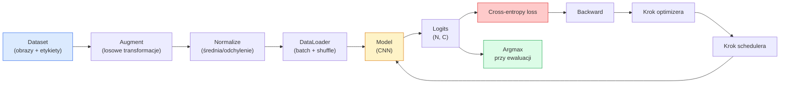

# Klasyfikacja obrazów

> Classifier to funkcja z pikseli do rozkładu prawdopodobieństwa klas. Wszystko inne to hydraulika.

**Typ:** Budowanie
**Języki:** Python
**Wymagania wstępne:** Lekcja 09 z fazy 2 (Ewaluacja modelu), Lekcja 10 z fazy 3 (Mini framework), Lekcja 03 z fazy 4 (CNN-y)
**Szacowany czas:** ~75 minut

## Cele uczenia się

- Zbudować end-to-end pipeline klasyfikacji obrazów na CIFAR-10: dataset, augmentacja, model, pętla treningowa, ewaluacja
- Wyjaśnić rolę każdego komponentu (dataloader, loss, optimizer, scheduler, augmentacja) i przewidzieć jak uszkodzenie któregoś z nich manifestuje się w krzywej loss
- Zaimplementować mixup, cutout i label smoothing od zera i uzasadnić kiedy każdy z nich warto dodać
- Odczytać macierz pomyłek i tabelę precision/recall per klasa aby diagnozować błędy datasetu i modelu poza zagregowaną dokładnością

## Problem

Każde zadanie z wizji, które trafia do produkcji, redukuje się do klasyfikacji obrazów na jakimś poziomie. Detection klasyfikuje regiony. Segmentation klasyfikuje piksele. Retrieval rankuje przez podobieństwo do centroidów klas. Uzyskanie prawidłowej klasyfikacji — dataset loop, augmentation policy, loss, ewaluacja — to umiejętność, która transferuje się do każdego innego zadania w fazie.

Większość bugów klasyfikacyjnych nie jest w modelu, lecz żyją w pipeline: zepsuta normalizacja, niepotasowany training set, augmentacja która zniekształca etykiety, podział walidacyjny skażony danymi treningowymi, learning rate który cicho rozbiega się po epoce 30. CNN który osiągnąłby 93% na CIFAR-10 z prawidłową konfiguracją często zdobywa 70-75% z popsutą, a krzywa loss wygląda wiarygodnie przez cały czas.

Ta lekcja łączy cały pipeline ręcznie, więc każda część jest inspektywalna. Nie będziesz używać niczego z `torchvision.datasets` co mogłoby ukryć bug.

## Koncepcja

### Pipeline klasyfikacji



Każda linia w tej pętli to miejsce, gdzie może się ukryć bug. Cross-entropy bierze surowe logitsy, nie wyjścia softmax, więc jakikolwiek `model(x).softmax()` przed loss cicho oblicza zły gradient. Augmentacje stosują się do wejść tylko, nie do etykiet — oprócz mixup, który miesza oba. `optimizer.zero_grad()` musi nastąpić raz na krok; pominięcie go akumuluje gradienty i wygląda jak dziko niestabilny learning rate. Każdy z tych bugów spłaszcza krzywą uczenia bez rzucania błędu.

### Cross-entropy, logits i softmax

Classifier produkuje `C` liczb na obraz nazywanych logits. Zastosowanie softmax konwertuje je w rozkład prawdopodobieństwa:

```
softmax(z)_i = exp(z_i) / sum_j exp(z_j)
```

Cross-entropy mierzy negatywne log prawdopodobieństwo poprawnej klasy:

```
CE(z, y) = -log( softmax(z)_y )
        = -z_y + log( sum_j exp(z_j) )
```

Prawa forma to ta numerycznie stabilna (log-sum-exp). PyTorch `nn.CrossEntropyLoss` łączy softmax + NLL w jednej operacji i bierze surowe logitsy bezpośrednio. Zastosowanie softmax samemu najpierw to prawie zawsze bug — obliczasz log(softmax(softmax(z))), bezsensowną wielkość.

### Dlaczego augmentacja działa

CNN ma inductive bias dla translacji (z weight sharing), ale nie ma wbudowanej niezmienniczości do cropów, flipów, jittera kolorów czy okluzji. Jedyny sposób, żeby go nauczyć tych niezmienniczości, to pokazać mu piksele które je ćwiczą. Każda losowa transformacja podczas treningu to sposób powiedzenia: "te dwa obrazy mają tę samą etykietę; naucz się cech które ignorują różnicę."

```
Oryginał crop:   "pies zwrócony w lewo"
Flip:            "pies zwrócony w prawo"       <- ta sama etykieta, inne piksele
Rotate(+15):     "pies, lekkie przechylenie"
Colour jitter:   "pies w cieplejszym świetle"
RandomErasing:   "pies z brakującym fragmentem"
```

Reguła: augmentacja musi zachować etykietę. Cutout i rotacja na cyfrze może obrócić "6" w "9"; dla tego datasetu używamy mniejszych zakresów rotacji i wybieramy augmentacje które szanują cyfrowe-specyficzne niezmienniczości.

### Mixup i cutmix

Zwykła augmentacja transformuje piksele, ale utrzymuje etykiety one-hot. **Mixup** i **cutmix** to łamią, interpolując oba.

```
Mixup:
  lambda ~ Beta(a, a)
  x = lambda * x_i + (1 - lambda) * x_j
  y = lambda * y_i + (1 - lambda) * y_j

Cutmix:
  wklej losowy prostokąt z x_j do x_i
  y = ważony obszarowo mix y_i i y_j
```

Dlaczego to pomaga: model przestaje memorizować ostre one-hot targety i uczy się interpolować między klasami. Training loss rośnie, test accuracy rośnie. To najtańszy robustness upgrade dla dowolnego classifiera.

### Label smoothing

Krewny mixup. Zamiast trenować przeciwko `[0, 0, 1, 0, 0]`, trenuje się przeciwko `[eps/C, eps/C, 1-eps, eps/C, eps/C]` dla małego `eps` jak 0.1. Powstrzymuje model przed produkowaniem arbitralnie ostrych logitsów i poprawia kalibrację prawie za darmo. Wbudowane w `nn.CrossEntropyLoss(label_smoothing=0.1)` od PyTorch 1.10.

### Ewaluacja poza dokładnością

Zagregowana dokładność ukrywa niezbalansowanie. Binarny classifier 90-10 który zawsze przewiduje klasę większościową zdobywa 90%. Narzędzia które faktycznie mówią ci co się dzieje:

- **Per-class accuracy** — jedna liczba per klasa; natychmiast surfuje niedocenione kategorie.
- **Macierz pomyłek** — siatka C x C z wierszem i kolumną j = liczba prawdziwej klasy i przewidzianej jako j; diagonal to poprawne, off-diagonals to gdzie twój model żyje.
- **Top-1 / Top-5** — czy poprawna klasa jest w 1 lub 5 najbardziej prawdopodobnych przewidywaniach; Top-5 ma znaczenie dla ImageNet, bo klasy jak "Norwich terrier" vs "Norfolk terrier" są naprawdę ambiwalentne.
- **Kalibracja (ECE)** — czy przewidywanie z pewnością 0.8 jest poprawne w 80% przypadków? Nowoczesne sieci są systematycznie over-confident; napraw przez temperature scaling lub label smoothing.

## Zbuduj to

### Krok 1: Deterministyczny syntetyczny dataset

CIFAR-10 żyje na dysku. Żeby ta lekcja była reprodukowalna i szybka, budujemy syntetyczny dataset który wygląda jak CIFAR — 32x32 RGB obrazy z klasową strukturą, którą model musi się nauczyć. Ten sam pipeline działa niezmieniony na prawdziwym CIFAR-10.

```python
import numpy as np
import torch
from torch.utils.data import Dataset


def synthetic_cifar(num_per_class=1000, num_classes=10, seed=0):
    rng = np.random.default_rng(seed)
    X = []
    Y = []
    for c in range(num_classes):
        centre = rng.uniform(0, 1, (3,))
        freq = 2 + c
        for _ in range(num_per_class):
            yy, xx = np.meshgrid(np.linspace(0, 1, 32), np.linspace(0, 1, 32), indexing="ij")
            r = np.sin(xx * freq) * 0.5 + centre[0]
            g = np.cos(yy * freq) * 0.5 + centre[1]
            b = (xx + yy) * 0.5 * centre[2]
            img = np.stack([r, g, b], axis=-1)
            img += rng.normal(0, 0.08, img.shape)
            img = np.clip(img, 0, 1)
            X.append(img.astype(np.float32))
            Y.append(c)
    X = np.stack(X)
    Y = np.array(Y)
    idx = rng.permutation(len(X))
    return X[idx], Y[idx]


class ArrayDataset(Dataset):
    def __init__(self, X, Y, transform=None):
        self.X = X
        self.Y = Y
        self.transform = transform

    def __len__(self):
        return len(self.X)

    def __getitem__(self, i):
        img = self.X[i]
        if self.transform is not None:
            img = self.transform(img)
        img = torch.from_numpy(img).permute(2, 0, 1)
        return img, int(self.Y[i])
```

Każda klasa dostaje własną paletę kolorów i wzór częstotliwości, plus szum Gaussian, żeby zmusić model do nauki sygnału zamiast memorizowania pikseli. Dziesięć klas, tysiąc obrazów każda, potasowane.

### Krok 2: Normalizacja i augmentacja

Dwie transformacje, które ma każdy vision pipeline.

```python
def standardize(mean, std):
    mean = np.array(mean, dtype=np.float32)
    std = np.array(std, dtype=np.float32)
    def _fn(img):
        return (img - mean) / std
    return _fn


def random_hflip(p=0.5):
    def _fn(img):
        if np.random.random() < p:
            return img[:, ::-1, :].copy()
        return img
    return _fn


def random_crop(pad=4):
    def _fn(img):
        h, w = img.shape[:2]
        padded = np.pad(img, ((pad, pad), (pad, pad), (0, 0)), mode="reflect")
        y = np.random.randint(0, 2 * pad)
        x = np.random.randint(0, 2 * pad)
        return padded[y:y + h, x:x + w, :]
    return _fn


def compose(*fns):
    def _fn(img):
        for fn in fns:
            img = fn(img)
        return img
    return _fn
```

Reflect-pad przed cropem, nie zero-pad, bo czarne obramowania to sygnał, którego model nauczyłby się ignorować w nie użyteczny sposób.

### Krok 3: Mixup

Miesza dwa obrazy i dwie etykiety wewnątrz kroku treningowego. Zaimplementowane jako batch transform, więc żyje obok forward passa, zamiast wewnątrz datasetu.

```python
def mixup_batch(x, y, num_classes, alpha=0.2):
    if alpha <= 0:
        return x, torch.nn.functional.one_hot(y, num_classes).float()
    lam = float(np.random.beta(alpha, alpha))
    idx = torch.randperm(x.size(0), device=x.device)
    x_mixed = lam * x + (1 - lam) * x[idx]
    y_onehot = torch.nn.functional.one_hot(y, num_classes).float()
    y_mixed = lam * y_onehot + (1 - lam) * y_onehot[idx]
    return x_mixed, y_mixed


def soft_cross_entropy(logits, soft_targets):
    log_probs = torch.log_softmax(logits, dim=-1)
    return -(soft_targets * log_probs).sum(dim=-1).mean()
```

`soft_cross_entropy` to cross-entropy przeciwko miękkiej dystrybucji etykiet. Redukuje się do zwykłego przypadku one-hot, gdy target jest dokładnie one-hot.

### Krok 4: Pętla treningowa

Kompletny przepis: jeden przejazd przez dane, gradienty raz na batch, scheduler steppingowany raz na epokę.

```python
import torch
import torch.nn as nn
from torch.utils.data import DataLoader
from torch.optim import SGD
from torch.optim.lr_scheduler import CosineAnnealingLR

def train_one_epoch(model, loader, optimizer, device, num_classes, use_mixup=True):
    model.train()
    total, correct, loss_sum = 0, 0, 0.0
    for x, y in loader:
        x, y = x.to(device), y.to(device)
        if use_mixup:
            x_m, y_soft = mixup_batch(x, y, num_classes)
            logits = model(x_m)
            loss = soft_cross_entropy(logits, y_soft)
        else:
            logits = model(x)
            loss = nn.functional.cross_entropy(logits, y, label_smoothing=0.1)
        optimizer.zero_grad()
        loss.backward()
        optimizer.step()
        loss_sum += loss.item() * x.size(0)
        total += x.size(0)
        # Training accuracy vs un-mixed labels `y` is only an approximation
        # when mixup is on (the model saw soft targets, not y). Treat it as a
        # rough progress signal; rely on val accuracy for real performance.
        with torch.no_grad():
            pred = logits.argmax(dim=-1)
            correct += (pred == y).sum().item()
    return loss_sum / total, correct / total


@torch.no_grad()
def evaluate(model, loader, device, num_classes):
    model.eval()
    total, correct = 0, 0
    loss_sum = 0.0
    cm = torch.zeros(num_classes, num_classes, dtype=torch.long)
    for x, y in loader:
        x, y = x.to(device), y.to(device)
        logits = model(x)
        loss = nn.functional.cross_entropy(logits, y)
        pred = logits.argmax(dim=-1)
        for t, p in zip(y.cpu(), pred.cpu()):
            cm[t, p] += 1
        loss_sum += loss.item() * x.size(0)
        total += x.size(0)
        correct += (pred == y).sum().item()
    return loss_sum / total, correct / total, cm
```

Pięć niezmienników, które sprawdzasz za każdym razem, gdy piszesz pętlę treningową:

1. `model.train()` przed treningiem, `model.eval()` przed ewaluacją — przestawia zachowanie dropout i batchnorm.
2. `.zero_grad()` przed `.backward()`.
3. `.item()` przy akumulowaniu metryk, żeby nic nie trzymało grafu obliczeniowego przy życiu.
4. `@torch.no_grad()` podczas ewaluacji — oszczędza pamięć i czas, zapobiega subtelnym wypadkom.
5. Argmax przeciwko surowym logitsom, nie softmax — ten sam wynik, jedna operacja mniej.

### Krok 5: Złóż to razem

Użyj `TinyResNet` z poprzedniej lekcji, trenuj przez kilka epok, ewaluuj.

```python
from main import synthetic_cifar, ArrayDataset
from main import standardize, random_hflip, random_crop, compose
from main import mixup_batch, soft_cross_entropy
from main import train_one_epoch, evaluate
# TinyResNet comes from the previous lesson (03-cnns-lenet-to-resnet).
# Adjust the import path to wherever you stored the previous lesson's code.
from cnns_lenet_to_resnet import TinyResNet  # example placeholder

X, Y = synthetic_cifar(num_per_class=500)
split = int(0.9 * len(X))
X_train, Y_train = X[:split], Y[:split]
X_val, Y_val = X[split:], Y[split:]

mean = [0.5, 0.5, 0.5]
std = [0.25, 0.25, 0.25]
train_tf = compose(random_hflip(), random_crop(pad=4), standardize(mean, std))
eval_tf = standardize(mean, std)

train_ds = ArrayDataset(X_train, Y_train, transform=train_tf)
val_ds = ArrayDataset(X_val, Y_val, transform=eval_tf)

train_loader = DataLoader(train_ds, batch_size=128, shuffle=True, num_workers=0)
val_loader = DataLoader(val_ds, batch_size=256, shuffle=False, num_workers=0)

device = "cuda" if torch.cuda.is_available() else "cpu"
model = TinyResNet(num_classes=10).to(device)
optimizer = SGD(model.parameters(), lr=0.1, momentum=0.9, weight_decay=5e-4, nesterov=True)
scheduler = CosineAnnealingLR(optimizer, T_max=10)

for epoch in range(10):
    tr_loss, tr_acc = train_one_epoch(model, train_loader, optimizer, device, 10, use_mixup=True)
    va_loss, va_acc, _ = evaluate(model, val_loader, device, 10)
    scheduler.step()
    print(f"epoch {epoch:2d}  lr {scheduler.get_last_lr()[0]:.4f}  "
          f"train {tr_loss:.3f}/{tr_acc:.3f}  val {va_loss:.3f}/{va_acc:.3f}")
```

Na syntetycznym datasecie, to osiąga niemal perfect validation accuracy w ciągu pięciu epok, co jest pointą: pipeline jest poprawny, model może się nauczyć tego, co da się nauczyć. Zamień dataset na prawdziwy CIFAR-10 i ta sama pętla trenuje do ~90% bez zmian.

### Krok 6: Odczytaj macierz pomyłek

Sama dokładność nigdy nie mówi ci, gdzie model zawodzi. Macierz pomyłek mówi.

```python
def print_confusion(cm, labels=None):
    c = cm.shape[0]
    labels = labels or [str(i) for i in range(c)]
    print(f"{'':>6}" + "".join(f"{l:>5}" for l in labels))
    for i in range(c):
        row = cm[i].tolist()
        print(f"{labels[i]:>6}" + "".join(f"{v:>5}" for v in row))
    print()
    tp = cm.diag().float()
    fp = cm.sum(dim=0).float() - tp
    fn = cm.sum(dim=1).float() - tp
    prec = tp / (tp + fp).clamp_min(1)
    rec = tp / (tp + fn).clamp_min(1)
    f1 = 2 * prec * rec / (prec + rec).clamp_min(1e-9)
    for i in range(c):
        print(f"{labels[i]:>6}  prec {prec[i]:.3f}  rec {rec[i]:.3f}  f1 {f1[i]:.3f}")

_, _, cm = evaluate(model, val_loader, device, 10)
print_confusion(cm)
```

Wiersze to prawdziwe klasy, kolumny to przewidywania. Klaster off-diagonal counts między klasami 3 i 5 oznacza, że model myli te dwie i daje ci punkt startowy dla targetowanej kolekcji danych lub klasowej augmentacji.

## Użyj tego

`torchvision` owija wszystko powyżej w idiomatyczne komponenty. Dla prawdziwego CIFAR-10 pełny pipeline to cztery linie plus pętla treningowa.

```python
from torchvision.datasets import CIFAR10
from torchvision.transforms import Compose, RandomCrop, RandomHorizontalFlip, ToTensor, Normalize

mean = (0.4914, 0.4822, 0.4465)
std = (0.2470, 0.2435, 0.2616)
train_tf = Compose([
    RandomCrop(32, padding=4, padding_mode="reflect"),
    RandomHorizontalFlip(),
    ToTensor(),
    Normalize(mean, std),
])
eval_tf = Compose([ToTensor(), Normalize(mean, std)])

train_ds = CIFAR10(root="./data", train=True,  download=True, transform=train_tf)
val_ds   = CIFAR10(root="./data", train=False, download=True, transform=eval_tf)
```

Dwie rzeczy do zauważenia: mean/std są **datasetowo-specyficzne** — wyliczone na CIFAR-10 training set, nie ImageNet — i reflect pad to community-default crop policy. Copy-paste ImageNet stats tutaj to ~1% accuracy leak, którego nikt nie łapie, dopóki ktoś nie zprofiluje model.

## Wyślij to

Ta lekcja produkuje:

- `outputs/prompt-classifier-pipeline-auditor.md` — prompt który audytuje skrypt treningowy pod kątem pięciu niezmienników powyżej i surfuje pierwsze naruszenie.
- `outputs/skill-classification-diagnostics.md` — skill który, mając macierz pomyłek i listę nazw klas, podsumowuje per-klasowe błędy i proponuje najbardziej impactowy pojedynczy fix.

## Ćwiczenia

1. **(Łatwe)** Trenuj ten sam model z i bez mixup przez pięć epok na syntetycznym datasiecie. Wyrysuj train i val loss dla obu. Wyjaśnij dlaczego train loss z mixup jest wyższy, a val accuracy podobna lub lepsza.
2. **(Średnie)** Zaimplementuj Cutout — wyzeruj losowy kwadrat 8x8 w każdym obrazie treningowym — i przeprowadź ablację vs brak augmentacji, hflip+crop, hflip+crop+cutout, hflip+crop+mixup. Raportuj val accuracy dla każdego.
3. **(Trudne)** Zbuduj pipeline CIFAR-100 (100 klas, ten sam rozmiar wejścia) i odtwórz training run ResNet-34 w granicach 1% opublikowanej dokładności. Extra: sweep trzech learning rates i dwóch weight decays, loguj do lokalnego CSV, produkuj finalną macierz-pomyłek-top-confusions table.

## Kluczowe terminy

| Termin | Co ludzie mówią | Co to faktycznie oznacza |
|--------|-----------------|--------------------------|
| Logits | "Surowe wyjścia" | Wektor pre-softmax C liczb na obraz; cross-entropy oczekuje ich, nie softmaxowanych wartości |
| Cross-entropy | "Loss" | Negatywne log-prawdopodobieństwo poprawnej klasy; łączy log-softmax i NLL w jednej stabilnej operacji |
| DataLoader | "Batcher" | Owija dataset z shuffle, batchingiem i (opcjonalnym) multi-worker loadingiem; obwiniany za połowę bugów treningowych |
| Augmentacja | "Losowe transformacje" | Każda pixel-level transformacja w czasie treningu, która zachowuje etykietę; uczy niezmienniczości, których CNN nie ma natywnie |
| Mixup / Cutmix | "Mieszaj dwa obrazy" | Blenduj zarówno wejścia jak i etykiety, żeby classifier uczył się gładkich interpolacji zamiast twardych granic |
| Label smoothing | "Miększe targety" | Zastąp one-hot przez (1-eps, eps/(C-1), ...); poprawia kalibrację i lekko zwiększa dokładność |
| Top-k accuracy | "Top-5" | Poprawna klasa jest w k najwyższych prawdopodobnych przewidywaniach; używane na datasetach z naprawdę ambiwalentnymi klasami |
| Macierz pomyłek | "Gdzie błędy żyją" | Tabela C x C gdzie entry (i, j) liczy obrazy prawdziwej klasy i przewidziane jako j; diagonal to poprawne, off-diagonal mówi ci co naprawić |

## Dalsze czytanie

- [CS231n: Training Neural Networks](https://cs231n.github.io/neural-networks-3/) — wciąż najjaśniejszy przegląd pipeline'u treningowego na jednej stronie
- [Bag of Tricks for Image Classification (He et al., 2019)](https://arxiv.org/abs/1812.01187) — każda mała sztuczka, która razem dodaje 3-4% do ResNet accuracy na ImageNet
- [mixup: Beyond Empirical Risk Minimization (Zhang et al., 2017)](https://arxiv.org/abs/1710.09412) — oryginalny mixup paper; trzy strony teorii plus przekonujące eksperymenty
- [Why temperature scaling matters (Guo et al., 2017)](https://arxiv.org/abs/1706.04599) — paper który udowodnił, że nowoczesne sieci są miscalibrated i naprawił to jednym skalarnym parametrem