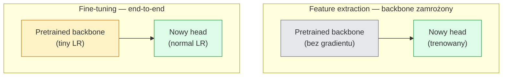

# Transfer Learning i Fine-Tuning

> Ktoś inny poświęcił milion godzin GPU na nauczenie sieci, jak wyglądają krawędzie, tekstury i części obiektów. Powinieneś zapożyczyć te cechy przed treningiem własnego modelu.

**Typ:** Build
**Języki:** Python
**Wymagania wstępne:** Lesson 03 z Fazy 4 (CNN-y), Lesson 04 z Fazy 4 (Klasyfikacja obrazów)
**Szacowany czas:** ~75 minut

## Cele uczenia się

- Rozróżniać feature extraction od fine-tuningu i wybierać odpowiednią metodę na podstawie rozmiaru zbioru danych, odległości domeny i budżetu obliczeniowego
- Załadować pretrained backbone, zastąpić jego classifier head i wytrenować tylko head do działającego baseline'a w mniej niż 20 liniach kodu
- Progresywnie odmrażać warstwy z discriminative learning rates, aby wczesne ogólne cechy otrzymywały mniejsze aktualizacje niż późne specyficzne dla zadania
- Diagnozować trzy typowe błędy: feature drift z powodu zbyt wysokiego LR na odmrożonych blokach, collapse BN statistics na małych zbiorach danych i catastrophic forgetting

## Problem

Trening ResNet-50 na ImageNet kosztuje około 2000 godzin GPU. Niewiele zespołów ma taki budżet na każde zadanie, które wdrażają. Prawie każdy zespół wdraża pretrained backbone z nowym headem wytrenowanym na kilkuset lub kilku tysiącach obrazów specyficznych dla zadania.

To nie jest skrót. Pierwszy blok konwolucyjny każdego CNN wytrenowanego na ImageNet uczy się krawędzi i filtrów Gabor-like. Następne kilka bloków uczy się tekstur i prostych motywów. Środkowe bloki uczą się części obiektów. Ostatnie bloki uczą się kombinacji, które zaczynają wyglądać jak 1000 kategorii ImageNet. Pierwsze 90% tej hierarchii przenosi się prawie bez zmian do obrazowania medycznego, inspekcji przemysłowej, danych satelitarnych i każdego innego zadania wizyjnego — ponieważ natura ma ograniczony zasób słów dla krawędzi i tekstur. Ostatnie 10% to to, co faktycznie trenujesz.

Uzyskanie prawidłowego transferu ma trzy błędy czyhające na ciebie: niszczenie pretrained features zbyt wysokim learning rate, głodzenie modelu informacji przez zamrożenie zbyt dużej części i pozwolenie na dryf BatchNorm's running statistics w kierunku małego zbioru danych, którego reszta sieci nigdy się nie nauczyła. Ta lekcja pokazuje każdy z nich celowo.

## Koncepcja

### Feature extraction vs fine-tuning

Dwa tryby, wybierane na podstawie tego, jak bardzo ufasz pretrained features i ile masz danych.



Zasady kciuka:

| Rozmiar zbioru danych | Odległość domeny | Przepis |
|--------------|-----------------|--------|
| < 1k obrazów | blisko ImageNet | Zamroź backbone, trenuj tylko head |
| 1k-10k | blisko | Zamroź pierwsze 2-3 stage'y, fine-tune resztę |
| 10k-100k | dowolna | Fine-tune end-to-end z discriminative LR |
| 100k+ | daleka | Fine-tune wszystko; rozważ trening od zera jeśli domena jest wystarczająco daleka |

"Blisko ImageNet" mniej więcej oznacza naturalne zdjęcia RGB z treścią obiektopodobną. Skany CT medyczne, obrazy satelitarne z góry i mikroskopia to dalekie domeny — features nadal pomagają, ale będziesz musiał pozwolić na adaptację większej liczbie warstw.

### Dlaczego zamrażanie w ogóle działa

Features CNN uczone na ImageNet nie są wyspecjalizowane do 1000 kategorii. Są wyspecjalizowane do statystyk naturalnych obrazów: krawędzie przy określonych orientacjach, tekstury, wzorce kontrastu, prymitywne kształty. Te statystyki są stabilne w prawie każdej domenie wizyjnej, jaką człowiek może wymienić. Dlatego model trenowany na ImageNet i ewaluowany zero-shot na CIFAR-10 z tylko nowym linear head (bez fine-tuningu backbone) osiąga 80%+ accuracy. Head uczy się, które z już nauczonych features ważyć dla tego zadania.

### Discriminative learning rates

Gdy odmrażasz, wczesne warstwy powinny trenować wolniej niż późne. Wczesne warstwy kodują ogólne features, które chcesz zachować; późne warstwy kodują strukturę specyficzną dla zadania, którą musisz znacznie przesunąć.

```
Typowy przepis:

  stage 0 (stem + pierwsza grupa): lr = base_lr / 100    (głównie stałe)
  stage 1:                       lr = base_lr / 10
  stage 2:                       lr = base_lr / 3
  stage 3 (ostatnia grupa backbone): lr = base_lr
  head:                          lr = base_lr  (lub nieco wyższe)
```

W PyTorch to po prostu lista grup parametrów przekazanych do optimizera. Jeden model, pięć learning rates, zero dodatkowego kodu.

### Problem BatchNorm

Warstwy BN przechowują bufory `running_mean` i `running_var`, które zostały obliczone na ImageNet. Jeśli twoje zadanie ma inną dystrybucję pikseli — inne oświetlenie, inny sensor, inna przestrzeń kolorów — te bufory są błędne. Trzy opcje w kolejności preferencji:

1. **Fine-tune z BN w trybie train.** Pozwól BN aktualizować jego running statistics wraz ze wszystkim innym. Domyślny wybór gdy zbiór danych zadania ma średni rozmiar (>= 5k przykładów).
2. **Zamroź BN w trybie eval.** Zachowaj statystyki ImageNet i trenuj tylko wagi. Poprawne gdy twój zbiór danych jest na tyle mały, że BN's moving average byłby zaszumiony.
3. **Zastąp BN GroupNorm.** Całkowicie usuwa problem moving average. Używane w detection i segmentation backbone, gdzie batch size na GPU jest minimalny.

Nieprawidłowe postępowanie cicho obniża accuracy o 5-15%.

### Projektowanie head

Classifier head to 1-3 warstwy linear plus opcjonalny dropout. Każdy torchvision backbone ma domyślny head, który zastępujesz:

```
backbone.fc = nn.Linear(backbone.fc.in_features, num_classes)          # ResNet
backbone.classifier[1] = nn.Linear(..., num_classes)                    # EfficientNet, MobileNet
backbone.heads.head = nn.Linear(..., num_classes)                       # torchvision ViT
```

Dla małych zbiorów danych zwykle wystarcza pojedyncza warstwa linear. Dodanie warstwy ukrytej (Linear -> ReLU -> Dropout -> Linear) pomaga gdy dystrybucja zadania jest dalej od dystrybucji treningowej backbone.

### Layer-wise LR decay

Gładsza wersja discriminative LR używana w nowoczesnym fine-tuningu (BEiT, DINOv2, ViT-B fine-tunes). Zamiast grupować warstwy w stage'y, nadaj każdej warstwie nieco mniejszy LR niż warstwie nad nią:

```
lr_layer_k = base_lr * decay^(L - k)
```

Z decay = 0.75 i L = 12 bloków transformer, pierwszy blok trenuje z `0.75^11 ≈ 0.04x` LR head. Ma większe znaczenie dla transformer fine-tunes niż dla CNN, gdzie stage-grouped LRs zwykle wystarczają.

### Co ewaluować

Uruchomienia transfer learning wymagają dwóch liczb, których nie śledziłbyś na treningu od zera:

- **Pretrained-only accuracy** — accuracy head z zamrożonym backbone. To jest twój floor.
- **Fine-tuned accuracy** — ten sam model po treningu end-to-end. To jest twój ceiling.

Jeśli fine-tuned jest niższe niż pretrained-only, masz bug w learning rate lub BN. Zawsze drukuj oba.

## Zbuduj to

### Krok 1: Załaduj pretrained backbone i sprawdź go

```python
import torch
import torch.nn as nn
from torchvision.models import resnet18, ResNet18_Weights

backbone = resnet18(weights=ResNet18_Weights.IMAGENET1K_V1)
print(backbone)
print()
print("classifier head:", backbone.fc)
print("feature dim:", backbone.fc.in_features)
```

`ResNet18` ma cztery stage'y (`layer1..layer4`) plus stem i `fc` head. Każdy torchvision classification backbone ma analogiczną strukturę.

### Krok 2: Feature extraction — zamroź wszystko, zastąp head

```python
def make_feature_extractor(num_classes=10):
    model = resnet18(weights=ResNet18_Weights.IMAGENET1K_V1)
    for p in model.parameters():
        p.requires_grad = False
    model.fc = nn.Linear(model.fc.in_features, num_classes)
    return model

model = make_feature_extractor(num_classes=10)
trainable = sum(p.numel() for p in model.parameters() if p.requires_grad)
frozen = sum(p.numel() for p in model.parameters() if not p.requires_grad)
print(f"trainable: {trainable:>10,}")
print(f"frozen:    {frozen:>10,}")
```

Tylko `model.fc` jest trenowalny. Backbone jest zamrożonym feature extractor.

### Krok 3: Discriminative fine-tuning

Funkcja pomocnicza budująca grupy parametrów ze stage-specific learning rates.

```python
def discriminative_param_groups(model, base_lr=1e-3, decay=0.3):
    stages = [
        ["conv1", "bn1"],
        ["layer1"],
        ["layer2"],
        ["layer3"],
        ["layer4"],
        ["fc"],
    ]
    groups = []
    for i, names in enumerate(stages):
        lr = base_lr * (decay ** (len(stages) - 1 - i))
        params = [p for n, p in model.named_parameters()
                  if any(n.startswith(k) for k in names)]
        if params:
            groups.append({"params": params, "lr": lr, "name": "_".join(names)})
    return groups

model = resnet18(weights=ResNet18_Weights.IMAGENET1K_V1)
model.fc = nn.Linear(model.fc.in_features, 10)
for p in model.parameters():
    p.requires_grad = True

groups = discriminative_param_groups(model)
for g in groups:
    print(f"{g['name']:>10s}  lr={g['lr']:.2e}  params={sum(p.numel() for p in g['params']):>8,}")
```

`decay=0.3` oznacza, że każdy stage trenuje z 30% rate następnego. `fc` dostaje `base_lr`, `layer4` dostaje `0.3 * base_lr`, `conv1` dostaje `0.3^5 * base_lr ≈ 0.00243 * base_lr`. Brzmi ekstremalnie; empirycznie działa.

### Krok 4: Obsługa BatchNorm

Funkcja pomocnicza do zamrożenia BN running statistics bez zamrażania jego wag.

```python
def freeze_bn_stats(model):
    for m in model.modules():
        if isinstance(m, (nn.BatchNorm1d, nn.BatchNorm2d, nn.BatchNorm3d)):
            m.eval()
            for p in m.parameters():
                p.requires_grad = False
    return model
```

Wywołaj ją po ustawieniu `model.train()` na początku każdej epoki. `model.train()` przełącza wszystko w tryb treningowy; to odwraca to tylko dla warstw BN.

### Krok 5: Minimalna pętla fine-tuning end-to-end

```python
from torch.optim import SGD
from torch.utils.data import DataLoader
from torch.optim.lr_scheduler import CosineAnnealingLR
import torch.nn.functional as F

def fine_tune(model, train_loader, val_loader, device, epochs=5, base_lr=1e-3, freeze_bn=False):
    model = model.to(device)
    groups = discriminative_param_groups(model, base_lr=base_lr)
    optimizer = SGD(groups, momentum=0.9, weight_decay=1e-4, nesterov=True)
    scheduler = CosineAnnealingLR(optimizer, T_max=epochs)

    for epoch in range(epochs):
        model.train()
        if freeze_bn:
            freeze_bn_stats(model)
        tr_loss, tr_correct, tr_total = 0.0, 0, 0
        for x, y in train_loader:
            x, y = x.to(device), y.to(device)
            logits = model(x)
            loss = F.cross_entropy(logits, y, label_smoothing=0.1)
            optimizer.zero_grad()
            loss.backward()
            optimizer.step()
            tr_loss += loss.item() * x.size(0)
            tr_total += x.size(0)
            tr_correct += (logits.argmax(-1) == y).sum().item()
        scheduler.step()

        model.eval()
        va_total, va_correct = 0, 0
        with torch.no_grad():
            for x, y in val_loader:
                x, y = x.to(device), y.to(device)
                pred = model(x).argmax(-1)
                va_total += x.size(0)
                va_correct += (pred == y).sum().item()
        print(f"epoch {epoch}  train {tr_loss/tr_total:.3f}/{tr_correct/tr_total:.3f}  "
              f"val {va_correct/va_total:.3f}")
    return model
```

Pięć epok z powyższym przepisem na CIFAR-10 przenosi `ResNet18-IMAGENET1K_V1` z ~70% zero-shot linear-probe accuracy do ~93% fine-tuned accuracy. Sam head zatrzymałby się wokół 86% bez dotykania backbone.

### Krok 6: Progressive unfreezing

Harmonogram odmrażający jeden stage na epokę od końca do początku. Mituje feature drift kosztem kilku dodatkowych epok.

```python
def progressive_unfreeze_schedule(model):
    stages = ["layer4", "layer3", "layer2", "layer1"]
    yielded = set()

    def start():
        for p in model.parameters():
            p.requires_grad = False
        for p in model.fc.parameters():
            p.requires_grad = True

    def unfreeze(epoch):
        if epoch < len(stages):
            name = stages[epoch]
            yielded.add(name)
            for n, p in model.named_parameters():
                if n.startswith(name):
                    p.requires_grad = True
            return name
        return None

    return start, unfreeze
```

Wywołaj `start()` raz przed pierwszą epoką. Wywołaj `unfreeze(epoch)` na początku każdej epoki. Przebuduj optimizer za każdym razem, gdy zestaw trenowalnych parametrów się zmienia, w przeciwnym razie zamrożone parametry nadal trzymają cached moments, które go mylą.

## Użyj tego

Dla większości rzeczywistych zadań `torchvision.models` + trzy linie wystarczą. Cięższy mechanizm powyżej ma znaczenie gdy napotkasz problemy, których domyślne ustawienia biblioteki nie mogą naprawić.

```python
from torchvision.models import resnet50, ResNet50_Weights

model = resnet50(weights=ResNet50_Weights.IMAGENET1K_V2)
model.fc = nn.Linear(model.fc.in_features, num_classes)
optimizer = torch.optim.AdamW(model.parameters(), lr=1e-4, weight_decay=1e-4)
```

Dwa inne produkcyjne domyślne ustawienia:

- `timm` dostarcza ~800 pretrained vision backbones z spójnym API (`timm.create_model("resnet50", pretrained=True, num_classes=10)`). Dla każdego fine-tune poza torchvision zoo, to jest standard.
- Dla transformerów, `transformers.AutoModelForImageClassification.from_pretrained(name, num_labels=N)` daje ci ViT / BEiT / DeiT z tą samą semantyką ładowania co text models.

## Wdróż to

Ta lekcja tworzy:

- `outputs/prompt-fine-tune-planner.md` — prompt który wybiera feature-extraction vs progressive vs end-to-end fine-tuning na podstawie rozmiaru zbioru danych, odległości domeny i budżetu obliczeniowego.
- `outputs/skill-freeze-inspector.md` — skill który, mając dany PyTorch model, raportuje które parametry są trenowalne, które warstwy BatchNorm są w trybie eval i czy optimizer faktycznie otrzymuje trenowalne parametry.

## Ćwiczenia

1. **(Łatwe)** Trenuj `ResNet18` jako linear probe (backbone zamrożony) i jako full fine-tune na tym samym syntetycznym zbiorze danych CIFAR. Raportuj oba accuracy obok siebie. Wyjaśnij która luka mówi ci, że features transferują się dobrze i która mówi, że nie.

2. **(Średnie)** Wprowadź bug celowo: ustaw `base_lr = 1e-1` na stage backbone zamiast na head. Pokaż eksplozję training loss, a potem odzyskaj stosując helper `discriminative_param_groups`. Zapisz LR, przy którym każdy stage zaczyna się divergence.

3. **(Trudne)** Weź zbiór danych obrazowania medycznego (np. CheXpert-small, PatchCamelyon lub HAM10000) i porównaj trzy tryby: (a) ImageNet-pretrained zamrożony backbone + linear head; (b) ImageNet-pretrained fine-tune end-to-end; (c) trening od zera. Raportuj accuracy i koszt obliczeniowy dla każdego. Przy jakim rozmiarze zbioru danych trening od zera staje się konkurencyjny?

## Kluczowe terminy

| Termin | Co ludzie mówią | Co to faktycznie oznacza |
|------|----------------|----------------------|
| Feature extraction | "Zamroź i trenuj head" | Parametry backbone zamrożone, tylko nowy classifier head otrzymuje gradient |
| Fine-tuning | "Retrenuj end-to-end" | Wszystkie parametry trenowalne, zwykle z dużo mniejszym LR niż trening od zera |
| Discriminative LR | "Mniejszy LR dla wczesnych warstw" | Grupy parametrów optimizera gdzie LR wczesnego stage to ułamek LR późnego stage |
| Layer-wise LR decay | "Gładki gradient LR" | LR per-warstwa mnożony przez decay^(L - k); wspólne w transformer fine-tunes |
| Catastrophic forgetting | "Model stracił ImageNet" | Zbyt wysoki LR nadpisuje pretrained features zanim sygnał nowego zadania zostanie nauczony |
| BN statistics drift | "Running mean jest błędny" | BatchNorm running_mean/var obliczone na innej dystrybucji niż bieżące zadanie, cicho szkodząc accuracy |
| Linear probe | "Zamrożony backbone + linear head" | Ewaluacja pretrained features — accuracy najlepszego linear classifier na szczycie zamrożonej reprezentacji |
| Catastrophic collapse | "Wszystko przewiduje jedną klasę" | Dzieje się gdy fine-tuning z LR wystarczająco wysokim by zniszczyć features zanim gradienty z head ustabilizują model |

## Dalsze czytanie

- [How transferable are features in deep neural networks? (Yosinski et al., 2014)](https://arxiv.org/abs/1411.1792) — artykuł który kwantyfikował transferability features przez warstwy
- [Universal Language Model Fine-tuning (ULMFiT, Howard & Ruder, 2018)](https://arxiv.org/abs/1801.06146) — oryginalny przepis discriminative LR / progressive unfreezing; idee transferują się bezpośrednio do wizji
- [timm documentation](https://huggingface.co/docs/timm) — referencja dla nowoczesnych vision backbones i dokładnych domyślnych ustawień fine-tune z jakimi były trenowane
- [A Simple Framework for Linear-Probe Evaluation (Kornblith et al., 2019)](https://arxiv.org/abs/1805.08974) — dlaczego linear-probe accuracy ma znaczenie i jak poprawnie raportować